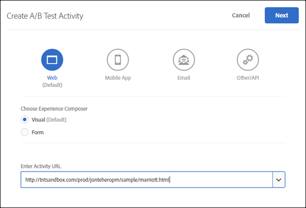

#  Enterprise-användarbehörigheter{#enterprise-user-permissions}

Enterprise-användarbehörigheter är ett sätt att formellt administrera företagsövergripande användaråtkomst till [!DNL Target]. Lägg till användare [!DNL Target], tilldela behörigheter baserat på deras roller och skapa arbetsytor för team baserat på olika avdelningar, globala platser, kanaler och andra logiska grupper. Du kan tilldela användare rollerna för [!UICONTROL Observer], [!UICONTROL Editor]eller [!UICONTROL Approver].

## Avgör om du har åtkomst till företagsanvändarbehörigheter

>[!NOTE]
>
>Egenskaper och behörigheter är tillgängliga som en del av [!DNL Target] Premium-lösningen. De finns inte i [!DNL Target] Standard utan en [!DNL Target] Premium-licens.
>
>Din [!DNL Target] implementering kan använda vilken version som helst av at.js eller mbox.js.

Du kan se om din organisation har en Standard- eller Premium-licens genom att klicka på [!UICONTROL Administration] länken överst i [!DNL Target] användargränssnittet.

* **[!DNL Target Standard]Kunder**: Om du ser [!UICONTROL Users] fliken ([!UICONTROL Adminitration > Users]) (och inte [!UICONTROL Properties] fliken) har din organisation en [!DNL Target Standard] licens. [!DNL Target Standard]-användare ska följa instruktionerna i [Användare](/help/administrating-target/c-user-management/c-user-management/user-management.md) för att lägga till användare och tilldela behörigheter i [!DNL Adobe Admin Console].

* **[!DNL Target Premium]Kunder**: Om du ser [!UICONTROL Properties] fliken ([!UICONTROL Administration > Properties]) och [!UICONTROL Users] fliken har din organisation en [!DNL Target Premium] licens. [!DNL Target Premium] ska kunderna följa instruktionerna i den här artikeln och i [Konfigurera företagsbehörigheter](/help/administrating-target/c-user-management/property-channel/properties-overview.md).

## Innan du börjar använda företagsbehörigheter

>[!IMPORTANT]
>
>Se till att du läser [avsnittet Caveats](/help/administrating-target/c-user-management/property-channel/property-channel.md#section_9714311B1CD9497A86F4910F8AE635E2) nedan innan du fortsätter med företagsbehörigheter.

## Termer och definitioner som används i detta avsnitt {#section_F8D229544FEA41C3BC2EFD1F95AA0116}

Följande termer används i hela det här avsnittet och kan vara nya för användare som vill använda funktionerna för egenskaper och behörigheter i [!DNL Target] Premium.

### Egenskap

Egenskaper liknar till sin natur de i [!DNL Adobe Platform Launch] och med att de använder ett unikt kodfragment för att särskilja dem.

En webbegenskap är ett bibliotek med regler och en inbäddningskod. En webbegenskap kan vara vilken gruppering som helst av en eller flera domäner och underdomäner.

Egenskaper aktiveras genom att ett specifikt namn/värde-par läggs till som en parameter med ett anrop (Target call, api call, etc.) till [!DNL Target].

Egenskaperna tillhör specifika kanaler (webb, mobil, e-post eller API/annan).

### Arbetsyta (produktprofil)

Med en arbetsyta kan en organisation tilldela en viss uppsättning användare till en viss uppsättning egenskaper. På många sätt liknar en arbetsyta en rapportserie i [!DNL Adobe Analytics].

Obs! Arbetsytor kallas [!UICONTROL Product Profiles] i [!DNL Adobe Admin Console for Enterprise].

Om du är en del av en flernationell organisation kan du ha en arbetsyta för dina europeiska webbsidor, egenskaper eller webbplatser och en annan arbetsyta för dina amerikanska webbsidor, egenskaper eller webbplatser. Om du är en del av en organisation med flera varumärken kan du ha en separat arbetsyta för varje varumärke.

Användare kan ingå i flera arbetsytor och kan till och med ha olika roller inom varje arbetsyta.

Användare kan ha olika vyer av [!DNL Adobe Target] genom att flytta mellan arbetsytor, på samma sätt som [!DNL Analytics] användare har olika vyer av [!DNL Analytics] genom att flytta mellan olika rapportsviter.

Arbetsytorna kan omfatta olika målgrupper, olika erbjudanden och aktiviteter.

Alla målgrupper och aktiviteter som skapats före migreringen av den nya Enterprise Permissions-modellen grupperas tillsammans i &quot;Default Workspace&quot;, vilket beskrivs nedan.

Alla aktiviteter som skapas via [!DNL Adobe Experience Manager] (AEM) [!DNL Adobe Mobile Services]och [!DNL Adobe Target Classic] ingår i standardarbetsytan.

### Standardarbetsyta

Alla befintliga arbetsytor (produktprofiler) i [!DNL Admin Console] sammanfogas till en enda arbetsyta som kallas standardarbetsyta när din organisation migrerar till den nya Enterprise Permissions-modellen.

>[!IMPORTANT]
>
>Ta inte bort standardarbetsytan.

Alla användarroller och åtkomst till alla [!DNL Target] funktioner är desamma som de var innan migreringen till den nya Enterprise Permissions-modellen.

### Användargrupper

Du kan skapa användargrupper som utvecklare, analytiker, marknadsförare, chefer osv. och sedan tilldela behörigheter för flera Adobe-produkter och arbetsytor. Att utse en ny teammedlem kan vara lika enkelt som att lägga till dem i en viss användargrupp.

### Roller och behörigheter

Roller och behörigheter avgör vilka åtkomstnivåer användare har för att skapa och hantera aktiviteter i din [!DNL Target] implementering. I [!DNL Target]rollerna ingår följande:

| Roll | Beskrivning |
|--- |--- |
| Godkännare | Kan skapa, redigera och aktivera eller stoppa aktiviteter. |
| Redigerare | Kan skapa och redigera aktiviteter innan de är aktiva, men kan inte godkänna att en aktivitet startas. |
| Observer | Kan visa aktiviteter, men kan inte skapa eller redigera dem. |
| Utgivare | Liknar observationsrollen (kan visa aktiviteter, men kan inte skapa eller redigera dem). Utgivarrollen har dock ytterligare behörighet att aktivera aktiviteter. |

### Kanal

Kanalen refererar till innehållstypen där dina [!DNL Target] aktiviteter levereras: webbsidor, mobilappar, e-postmeddelanden och så vidare.

När du skapar en ny aktivitet skapas den i den markerade arbetsytan. Du kommer att se alternativ för kanalval i den första dialogrutan där du kan välja den kanal du vill använda för aktiviteten: Webb, mobilapp, e-post eller annan/API.

## Översikt över behörigheter {#section_DC2172520DA84605B218A5E9FB6D187A}

I följande information förklaras hur behörigheter tillämpades tidigare i [!DNL Target] och hur de tillämpades med [!UICONTROL Properties] funktionerna och [!UICONTROL Permissions] .

Med den nya [!UICONTROL Permissions] funktionen kan du skapa olika projekt (så kallade&quot;produktprofiler&quot; i [!DNL Adobe Admin Console for Enterprise]) så att du kan tilldela olika behörigheter till en enskild användare som bestämmer den användarens åtkomstbehörighet för varje projekt. Dessa distinkta projekt kan jämföras med hur rapportsviterna fungerar i [!DNL Adobe Analytics]. Varje projekt kan ha specifika användare med specifika roller som gäller för en uppsättning egenskaper. Resultatet är att kunderna kan begränsa åtkomst till vy, redigering och godkännande för sina användare baserat på region, miljö (dev/stage/prod), kanal eller andra anpassade kriterier, vilket visas nedan:

En viss användare kan till exempel ha åtkomst till&quot;godkännande&quot; på amerikanska webbplatser, men bara visa åtkomst på den europeiska mobilappen. Samma användare kanske inte har tillgång till ens de aktiviteter som erbjuds på webb- och mobilsajter i APAC-regionen.

Den aktuella [!DNL Target] [!UICONTROL Permissions] modellen har tre behörighetsroller (observatör, redigerare och godkännare), vilket visas på följande bild:

Varje roll har olika behörighetsnivåer:

| Roll | Beskrivning |
|--- |--- |
| Godkännare | Kan skapa, redigera och aktivera eller stoppa aktiviteter. |
| Redigerare | Kan skapa och redigera aktiviteter innan de är aktiva, men kan inte godkänna att en aktivitet startas. |
| Observer | Kan visa aktiviteter, men kan inte skapa eller redigera dem. |
| Utgivare | Liknar observationsrollen (kan visa aktiviteter, men kan inte skapa eller redigera dem). Utgivarrollen har dock ytterligare behörighet att aktivera aktiviteter. |

Observera att varje användares roll gäller för alla sidor, egenskaper och webbplatser i ditt konto som innehåller [!DNL Target] taggar, vilket visas nedan:

Den nya [!DNL Target][!UICONTROL Permissions] modellen har samma tre behörighetsroller (observatör, redigerare och godkännare). Du kan dock tilldela en användares behörigheter roller separat för enskilda sidor, egenskaper eller platser, vilket visas nedan:

I det här exemplet har Jan godkännarbehörighet till USA:s hemsida och behörigheten US Site och Observer till Frankrikes webbplats.

Jan kommer inte heller att kunna se sidor, egenskaper eller webbplatser [!DNL Target] som hon inte har behörighet att se, vilket visas nedan:

I det här exemplet kan Jan inte se produktsidorna, Rysslands webbplats och karriärwebbplatsen.

## Användningsscenarier {#section_F3CE8576959E4F4CB13BEEED38311DD8}

Följande användningsexempel kan vara användbara för att förstå hur egenskaper, projekt, roller och behörigheter kan hjälpa er att uppnå era marknadsföringsmål med [!DNL Target]:

### Flernationell organisation

Om du är en del av en flernationell organisation kan du ha en arbetsyta för dina europeiska webbsidor, egenskaper eller webbplatser och en annan arbetsyta för dina amerikanska webbsidor, egenskaper eller webbplatser.
Efter en omorganisering, med hjälp av de profiler som visas på bilderna ovan, kan du skapa arbetsytor och behörigheter som liknar följande:

* **Jan**: Jan är chef för optimering vid Center of Excellence för sin organisations amerikanska webbsidor, egendomar och webbplatser. Hon har antagligen systemadministratörsbehörighet i Adobe Experience Cloud.

   I sin roll har hon godkännarbehörighet för den amerikanska hemsidan och den amerikanska webbplatsen. Med godkännarbehörighet kan hon skapa, redigera och aktivera eller stoppa aktiviteter.

   Jan samarbetar också med optimeringsteamet i Frankrike och har därför observatörsbehörighet för Frankrikes webbplats som ger henne skrivskyddad åtkomst till aktiviteter. Jan kan visa aktiviteter, men kan inte skapa eller redigera dem.

   Eftersom Jan inte har någon roll som gör att hon måste se produktsidor, Rysslands webbplats eller karriärsajten, kan hon inte se aktiviteter för dessa sajter.

* **Ernie**: Ernie är marknadschef för organisationen med ansvar för marknadsföring i USA.

   Eftersom Ernie är ganska ny i organisationen och lite oerfaren av Target har han redigeringsbehörighet för USA:s hemsida, amerikanska webbplats och produktsidor. Med redigerarbehörigheter kan Ernie skapa och redigera aktiviteter innan de är aktiva, men han kan inte godkänna att en aktivitet startas - någon med godkännandebehörighet, som Jan, måste godkänna aktiviteten innan den kan tas i produktion.

   Eftersom Ernie inte har någon roll som gör det nödvändigt att han ser Rysslands webbplats, Frankrikes webbplats eller karriärsajten, kan han inte se aktiviteter för dessa sajter.

* **Diana**: Diana är nu analytiker för organisationen och har fått observationsbehörigheter för USA:s hemsida, produktsidor, Rysslands webbplats och Frankrikes webbplats som ger henne skrivskyddad åtkomst till aktiviteter. Diana kan visa aktiviteter, men kan inte skapa eller redigera dem.

   Eftersom Diana inte har någon roll som gör det nödvändigt att hon ser karriären, kan hon inte se aktiviteter för dessa sajter.

### Organisering av flera varumärken

Om du är en del av en organisation med flera varumärken kan du ha en separat arbetsyta för varje varumärkes webbsidor, egenskaper eller webbplatser.

Efter en omorganisering, med hjälp av personerna i illustrationerna ovan, kan du skapa projekt och behörigheter som liknar följande:

* **Jan**: Jan är chef för optimeringen vid Center of Excellence för en sjukvårdsorganisation som är verksam på sjukhus- och konsumentproduktioner. Hon har antagligen systemadministratörsbehörighet i Adobe Experience Cloud.

   I sin roll har hon godkännarbehörighet för webbplatsen. Med godkännarbehörighet kan hon skapa, redigera och aktivera eller stoppa aktiviteter.

   Jan samarbetar också med optimeringsteamet för konsumentprodukter och har därför administratörsbehörighet för webbplatsen som ger läsbehörighet för aktiviteter. Jan kan visa aktiviteter, men kan inte skapa eller redigera dem.

* **Ernie**: Ernie är marknadschef för organisationen med ansvar för marknadsföring på konsumentproduktområdet.

   Eftersom Ernie är ganska ny i organisationen och lite oerfaren av Target har han redigeringsbehörigheter för konsumentwebbplatsen. Med redigerarbehörigheter kan Ernie skapa och redigera aktiviteter innan de är aktiva, men han kan inte godkänna att en aktivitet startas - någon med godkännanderättigheter för konsumentwebbplatsen, men inte Jan i det här scenariot, måste godkänna aktiviteten innan den kan tas i produktion.

   Eftersom Ernie inte har någon roll som gör det nödvändigt att han ser webbplatsen kan han inte se aktiviteter för den sajten.

* **Diana**: Diana är nu analytiker för organisationen och har fått observationsbehörigheter för sjukhuswebbplatsen och konsumentwebbplatsen som ger henne skrivskyddad åtkomst till aktiviteter. Diana kan visa aktiviteter, men kan inte skapa eller redigera dem.

## Kontaktpunkter för gränssnittsegenskaper och behörigheter {#section_3414371393BB42999A268628B5456EC9}

Den nya behörighetsfunktionen kan visas på olika platser i [!DNL Target] användargränssnittet.

* **Listruta för arbetsyta (produktprofil):** Den nedrullningsbara listan Arbetsyta visas högst upp på sidorna [!UICONTROL Activities], [!UICONTROL Audiences]och [!UICONTROL Offers] . Välj önskad arbetsyta för att filtrera listan så att endast objekt i den markerade arbetsytan visas.

   

* **Skapa aktivitet:** När du skapar en ny aktivitet skapas den i den markerade arbetsytan. Du kommer att se alternativ för kanalval i den första dialogrutan där du kan välja den kanal du vill använda för aktiviteten: Webb, mobilapp, e-post eller annan/API.

   

* **Målgrupper:** När du skapar en ny målgrupp skapas den i den markerade arbetsytan.
* **Skapa erbjudande:** När du skapar ett nytt erbjudande skapas det i den valda arbetsytan.
* **Sidan Egenskaper (Administration > Egenskaper):** Du kan använda rutan [!UICONTROL Search] för att söka i [!UICONTROL Property] listan.

   

## Caveats {#section_9714311B1CD9497A86F4910F8AE635E2}

Tänk på följande när du använder eller konfigurerar egenskaper och behörigheter i [!DNL Target] Premium:

* **Viktigt**: Ta inte bort arbetsytor med aktiviteter. Om det händer ska du arbeta med kundtjänst för att återskapa dessa aktiviteter.
* När du använder vyn Alla arbetsytor:

   * Du kan se aktiviteter, målgrupper och erbjudanden för alla arbetsytor som du har rätt roller och behörigheter att komma åt.
   * När du väljer vyn Alla mina arbetsytor läggs en ny kolumn till på sidan för aktiviteter, målgrupper och erbjudanden som listar objektets arbetsyta och den användarbehörighet som är kopplad till det objektet (observatör, redigerare eller godkännare),
   * När du skapar en aktivitet, målgrupp eller ett erbjudande i vyn Alla arbetsytor måste du välja den arbetsyta där objektet ska skapas. Endast de arbetsytor som du har behörighet att redigera eller godkänna kan väljas.
   * När du kopierar en aktivitet, målgrupp eller ett erbjudande i vyn Alla arbetsytor måste du välja den arbetsyta där objektet ska kopieras. Endast de arbetsytor som du har behörighet att redigera eller godkänna kan väljas.

* Alla inställningar på följande administrationssidor kan styras av alla godkännare på alla arbetsytor:

   * Visual Experience Composer
   * Rapportering
   * Scene7 Configuration
   * Implementering
   * Egenskaper
   * Värdar
   * Miljö
   * Svarstoken
   * Användare

* Användare kan inte flytta resurser från en arbetsyta (produktprofil) till en annan. Kopiering stöds dock.
* När du visar målgrupper från [!DNL Audiences] sidan läses sidan in långsammare än förväntat. Om du interagerar med sökfältet på något sätt visas målgrupperna snabbare. Det här är ett känt fel och kommer att korrigeras i en kommande uppdatering. Problemet påverkar inte valet av målgrupper när aktiviteten skapas.
* Följande resurser ingår i den nya Enterprise Permissions-modellen:

   * Aktiviteter, målgrupper och koderbjudanden som skapats i Target Standard/Premium när kunden har aktiverats för tillstånd. (Obs! kunder måste ha rätt till Target Premium.)
   * Egenskaper kan läggas till i befintliga aktiviteter på standardarbetsytan; Detta kan dock komma att ändras.
   * Endast nya resurser (till exempel aktiviteter, koderbjudanden och målgrupper) som skapats i Target Premium (efter att Enterprise Permissions (Enterprise Permissions)) har aktiverats kan begränsas av behörigheter.
   * Externa resurser är bara tillgängliga för användare på standardarbetsytan. En användares roll i standardarbetsytan används globalt (för alla Target-begäranden och alla Target-resurser).

* Följande resurser ingår *inte* i den nya Enterprise Permissions-modellen:

   * Bilderbjudanden
   * Alla Recommendations-resurser, inklusive kriteriebibliotek, designbibliotek, katalog, Recommendations Setup.
   * Befintliga resurser (t.ex. aktiviteter, koderbjudanden och målgrupper) som skapats i Target Premium innan Enterprise-behörigheter aktiverades kan kopieras, men kan inte flyttas till andra arbetsytor.
   * Aktiviteter, målgrupper, koderbjudanden, bilderbjudanden eller andra resurser som skapats med följande lösningar eller metoder kan inte styras av modellen Enterprise Permissions, men kommer att ingå i standardarbetsytan: Target Classic, Adobe Experience Manager (AEM), Adobe Mobile Services och resurser som skapats via API. Resurser som skapas via API omfattar aktiviteter, målgrupper, koderbjudanden och bilderbjudanden).
   * Bilderbjudanden (resurser som lagras under `https://[tenantName].marketing.adobe.com/content/mac/[tenantName]/target/offers.html#image-library` kan för närvarande inte styras av Enterprise Permissions-modellen.
   * clickTracking and redirects fungerar bara när mållänken eller målsidan är en del av en egenskap som ingår i aktiviteten. ClickTracking fungerar kanske inte heller när `targetPageParams()` funktionen används. Det `targetPageParamsAll()` är den rekommenderade funktionen.

   [!DNL Target] kräver för närvarande att det finns en `at_property` token på alla sidor där spårning sker. Om variabeln (1) inte finns, (2) inte identifieras vid tidpunkten för aktivitetsinställningen (i VEC) eller (3) inte skickas till anropet clickTracking Target via `targetPageParamsAll()` -funktionen, ökas inte mätvärdet och visas som &quot;0&quot;.

   Detsamma gäller för aktiviteter som använder omdirigeringar. Målsidan måste ha en `at_property` token och identifieras när konfigurationen görs i VEC.

   I en framtida version kommer Target att fungera på sidor där det inte finns någon `at_property` token eller på sidor där det finns en annan `at_property` token.

* Funktionen Enterprise-användarbehörigheter stöds inte i API-anrop [för](https://developers.adobetarget.com)Adobe.

## Vanliga frågor {#faqs}

Vanliga frågor om Enterprise permissions är:

### Kan jag flytta en aktivitet från en arbetsyta till en annan?

Tyvärr kan du inte flytta aktiviteter från en arbetsyta till en annan. Du kan dock kopiera en aktivitet till valfri arbetsyta i vetskap om att rapportdata inte överförs. Mer information finns i&quot;Kopiera/redigera en aktivitet när du använder arbetsytor&quot; i [Kopiera/redigera en aktivitet när du använder arbetsytor](/help/c-activities/edit-activity.md#section_45A92E1DD3934523B07E71EF90C4F8B6).

Aktiviteter som skapas före migreringen fortsätter att köras på samma sätt i standardarbetsytan, såvida de inte redigeras och tilldelas egenskaper. Aktiviteter under en viss arbetsyta följer egenskaper som tilldelats den arbetsytan och beteendet kanske därför inte ändras före migreringen.

### Varför får jag ett felmeddelande om att ingen egenskap är associerad med den här aktiviteten, trots att det finns en egenskap tilldelad?

Om du implementerat [!DNL Target] med [!DNL Adobe Launch] och får ett felmeddelande som anger att det inte finns någon egenskap associerad med aktiviteten skickar du `at_property` parametern med `targetPageParams` funktionen.

### Spelas klickspårskonverteringar in om en omdirigeringssida och aktivitets-URL:en tillhör olika egenskaper?

Klickspårning registreras inte på sidor där sid- och aktivitets-URL:en tillhör olika egenskaper.

Tänk på följande scenario (gäller både at.js och mbox.js):

* Page1 tillhör Property1.
* Page2 tillhör Property2.
* I aktiviteten dirigeras Page1 om till Page2, som innehåller klickspår.

När en besökare öppnar Page1 i en webbläsare omdirigeras han eller hon till Page2. Eftersom Page2 inte är kvalificerat för att leverera aktiviteten innehåller inte Target-anropet några klickspår i sitt svar.

Om omdirigeringssidan och aktivitets-URL:en tillhör samma egenskap fungerar klickningsspåren som förväntat. Mer information finns i [Klickspårning](/help/c-activities/r-success-metrics/click-tracking.md).

## Utbildningsvideor

I följande videofilmer finns mer information om de begrepp som beskrivs i den här artikeln.

### Utbildningsvideo: Märk 

Utbildningsmål:

* De tre rollnivåerna som Adobe Target-användare kan hantera
* Begreppen Egenskaper och Arbetsytor och hur dessa gränser och grupperingar fungerar för att styra användarnas åtkomstnivåer
* Olika egenskapsexempel som din organisation kan ta hänsyn till

>[!VIDEO](https://video.tv.adobe.com/v/19042/)

### Kontorstid: Arbetsytor för Target Premium

Den här videon är en inspelning av&quot;Office Hours&quot;, ett projekt som leds av kundtjänstteamet på Adobe.

* Skapa en arbetsyta (produktprofil)
* Skapa egenskaper
* Lägga till användare
* Uppdaterar implementering

>[!NOTE]
>
>Gränssnittet för [!DNL Target][!UICONTROL Administration] menyer (tidigare [!UICONTROL Setup]) har gjorts om för att ge bättre prestanda, minska den underhållstid som krävs när nya funktioner släpps och för att förbättra användarupplevelsen i hela produkten. Informationen i följande video är i allmänhet korrekt: alternativen kan dock finnas på något olika platser. Uppdaterade videor kommer snart att publiceras.

>[!VIDEO](https://video.tv.adobe.com/v/23643/)
