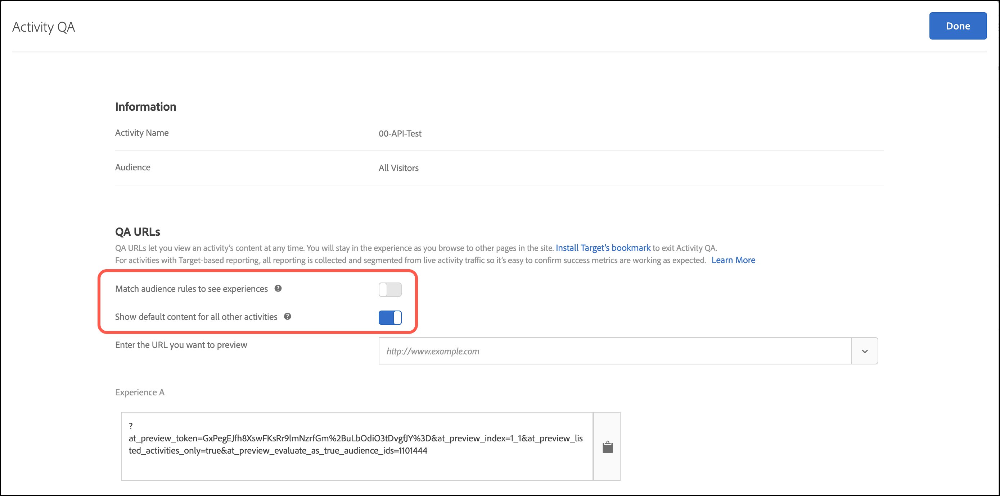

# Aktivitets-QA {#activity-qa}

Använd QA-URL:er i Adobe Target för att utföra enkel QA-analys från början till slut med förhandsgranskningslänkar som aldrig ändras, målgruppsanpassning som tillval och QA-rapportering som förblir segmenterad från live-aktivitetsdata.

## Översikt {#section_11B761A522A14E61978275772210A4C2}

Med Activity QA kan du testa dina Target-aktiviteter fullständigt innan du startar dem live. QA-funktionaliteten för aktiviteten omfattar:

* Länkar att dela med teammedlemmar som aldrig behöver ändras eller behöver genereras om, oavsett vilka uppdateringar som gjorts för upplevelserna eller aktiviteterna. På så sätt kan du testa dina aktiviteter fullt ut under hela användarresan.
* Målgruppsvillkor kan respekteras så att marknadsförarna kan testa målinriktningskriterier eller ignorera målinriktningskriterier för att få QA att visa hur upplevelserna ser ut utan att behöva uppfylla målgruppsvillkoren.
* QA-rapportering samlas in så att marknadsförarna kan bekräfta att mätvärdena ökar som förväntat och att QA-rapportdata hålls åtskilda från produktionsrapporter (för icke-A4T-rapportering).
* Möjlighet att förgranska en upplevelse separat eller tillsammans med andra aktiva aktiviteter som uppfyller leveranskriterierna (sid/målbegäran/målgrupp).
* Möjlighet att köra QA under hela användarresan. Du kan komma åt din webbplats en gång med QA-länken och sedan bläddra på hela webbplatsen i Activity QA. Du är kvar i Activity QA tills du avslutar sessionen eller tills du använder [QA Target-bokmärket](../../c-activities/c-activity-qa/activity-qa-bookmark.md#concept_A8A3551A4B5342079AFEED5ECF93E879) för att tvinga dig ut ur Activity QA. Den här funktionen är särskilt användbar om du har en aktivitet som sträcker sig över flera webbsidor.

   >[!NOTE]
   >
   >Detta gäller för at.js-implementeringar med version 2.*x* eller senare. För at.js 1.*x* - och mbox.js-implementeringar, detta gäller bara om besökarens webbläsare inte blockerar cookies från tredje part.

## Åtkomst till och delning av en QA-URL {#section_1C59BAA247B247BDB125D1BE8EAD4547}

1. Klicka på [!UICONTROL Overview] länken på aktivitetens **[!UICONTROL Activity QA]** sida (alla typer utom Automated Personalization).

   

1. Konfigurera följande inställningar:

   

   * **Matcha målgruppsregler för att se upplevelser:** Ibland vill ni bekräfta att målgruppsmatchningen fungerar. Andra gånger vill du bara kontrollera aktivitetens utseende och känsla. Om den här inställningen är aktiverad måste testarna uppfylla målinriktningskraven för att kunna se upplevelserna. För XT-aktiviteter (Experience Targeting) anges en enda aktivitets-URL. Den upplevelse du ser bestäms av om du kvalificerar dig för en av målinriktningsreglerna.

      Om den här inställningen har växlats till&quot;av&quot;-positionen, kan du klicka på länkarna för att visa upplevelserna oavsett om du kvalificerar dig eller inte. När du utför QA kan du växla fram och tillbaka mellan att kräva eller inte kräva att målgruppsanpassningen respekteras.

   * **Visa standardinnehåll för alla andra aktiviteter:** Om det här alternativet växlas till&quot;på&quot;-positionen visas standardinnehåll för alla andra aktiviteter (till exempel visas förhandsvisningen separat utan att alla andra aktiva aktiviteter på samma sida/[!DNL Target] begäran beaktas).

      Om den här inställningen är inaktiverad bör du tänka på följande:

      * Om det förekommer kollisioner mellan den aktivitet du testar och andra aktiva aktiviteter gäller [normala prioriteringsregler](../../c-activities/priority.md#concept_1780C11FEA57440499F0047DD6900E0F) . På grund av detta kan det hända att du inte kan se aktiviteten som du tänker göra till en kvalitetskontroll.
      * Ökning av mätvärden för de visade aktiviteterna, men endast i QA-rapporteringsmiljön.

1. Klicka **[!UICONTROL Done]** för att spara ändringarna.
1. Dela URL:er för aktivitetslänken med medlemmar i organisationen för testning.

   Aktivitetslänkar upphör aldrig att gälla och du behöver inte skicka om länkar om någon gör ändringar i en aktivitet eller upplevelse. Men om du använder en annan målgrupp från målgruppsbiblioteket i stället för att bara redigera aktiviteten skapas en ny länk som du måste dela igen.

   Varje URL för aktivitetslänk (för EXP A, EXP B osv.) Med kan du påbörja användarresan från motsvarande upplevelse. Du kan klicka på den URL som genererats för en upplevelse och sedan fortsätta med vanlig surfning för att se upplevelser på flera sidor (om det finns flera sidor). Endast en URL genereras per upplevelse, även om upplevelsen sträcker sig över flera sidor (malltestning eller flersidig testning).

   Du kan navigera på webbplatsen för att se de andra sidorna eftersom Aktivitets-QA är fast. Observera att detta gäller för at.js-implementeringar med version 2.*x* eller senare. För at.js 1.*x* - och mbox.js-implementeringar, detta gäller bara om besökarens webbläsare inte blockerar cookies från tredje part.

1. Om du vill visa rapporter som skapats från URL:er för aktivitetslänk klickar du på aktivitetens **[!UICONTROL Reports]** sida, klickar på **[!UICONTROL Settings]** ikonen (  ) och väljer sedan **[!UICONTROL QA Mode]** i **[!UICONTROL Environment]** listrutan.

## Överväganden {#section_B256EDD7BFEC4A6DA72A8A6ABD196D78}

* Länken visas på [!UICONTROL Activity QA] [!UICONTROL Overview] sidan med alla aktivitetstyper utom Automated Personalization (AP). Du kan använda [förhandsgranskningslänkar](../../c-activities/t-automated-personalization/experience-preview.md#task_586C6655A6FD4AF08F5678FC3F481EFC) för AP-aktiviteter.
* URL:er för verksamhets-QA är tillgängliga med aktiviteter med Analytics som rapportkälla (A4T). Träffar som genereras när QA utförs med Activity QA kommer att flöda till samma rapportsvit där aktivitetens data kommer att flöda även efter att aktiviteten publiceras.
* Aktivitets-QA visar inte innehåll för arkiverade aktiviteter eller aktiviteter som ligger efter deras slutdatum. Om du inaktiverar en avslutad aktivitet måste du spara aktiviteten igen för att Activity QA ska fungera.
* Aktiviteter som importeras till Target Standard/Premium (till exempel från Target Classic) stöder inte QA-URL:er.
* I Automatisk allokering, Automatiskt mål och Recommendations-aktiviteter påverkas inte modellen av de besök som gjorts i Aktivitets-QA.
* Eftersom Aktivitets-QA är klumpigt måste din målsession förfalla när du har bläddrat på en webbplats i Activity QA, eller du måste ha släppt Target från Activity QA innan du kan visa webbplatsen som en vanlig besökare. Använd [Target QA-bokmärket](../../c-activities/c-activity-qa/activity-qa-bookmark.md#concept_A8A3551A4B5342079AFEED5ECF93E879) för att tvinga dig ut ur Activity QA.

   Du kan också tvinga dig ut manuellt genom att läsa in en sida på webbplatsen med parametern `at_preview_token` med ett tomt värde (till exempel `https://www.mysite.com/?at_preview_token=`).

* Om du angav &quot;URL is&quot; när du skapade aktivitetsförbättringarna i den formulärbaserade dispositionen [eller alternativen för](../../c-experiences/form-experience-composer.md#task_FAC842A6535045B68B4C1AD3E657E56E) sidleverans i Visual Experience Composer) fungerar inte QA-URL:en eftersom Activity QA lägger till URL-parametrar. Du löser det här problemet genom att klicka på QA-URL:en för att gå till webbplatsen, ta bort de tillagda parametrarna från URL:en och sedan läsa in den nya URL:en.
* Om du har .js 1.*x*, eller mbox.js, Activity QA-läget är inte tilltalande om du använder Safari eller en annan webbläsare som blockerar cookies från tredje part. I dessa fall måste du lägga till förhandsgranskningsparametrarna i varje URL som du navigerar till. Detsamma gäller om du har implementerat [CNAME](/help/c-implementing-target/c-considerations-before-you-implement-target/implement-cname-support-in-target.md).
* Om en aktivitet använder flera upplevelsemålgrupper (till exempel en amerikansk och brittisk webbplats som ingår i samma aktivitet) genereras inte QA-länkar för de fyra kombinationerna (Experience A/ US Site, Experience A/ UK Site, Experience B/ US Site, Experience B/ UK Site). Endast två QA-länkar (Experience A och Experience B) skapas, och användarna måste kvalificera sig för att rätt målgrupp ska kunna se sidan. En QA-person i Storbritannien kunde inte se den amerikanska webbplatsen.
* Alla `at_preview` parametrar och värden är redan URL-kodade. För det mesta fungerar allt som förväntat. Vissa kunder kan dock ha belastningsutjämnare eller webbservrar som försöker koda frågesträngsparametrarna igen.

   På grund av den här dubbla kodningen kan inte Target extrahera rätt tokenvärde när vi försöker avkoda `at_preview_token`koden, vilket resulterar i att förhandsvisningen inte fungerar.

   Vi rekommenderar att du talar med IT-avdelningen för att säkerställa att alla förhandsgranskningsparametrar är tillåtslista så att dessa värden inte förändras på något sätt.

   I följande tabell visas de parametrar som kan tillåtslista i din domän:

   | Parameter | Typ | Värde | Beskrivning |
   |--- |--- |--- |--- |
   | `at_preview_token` | Krypterad sträng | Obligatoriskt. inget standardvärde | En krypterad entitet som innehåller listan över kampanj-ID:n som tillåts att köras i QA-läge. |
   | `at_preview_index` | Sträng | Tom | Parameterns format är `<campaignIndex>` eller `<campaignIndex>_< experienceIndex>` Båda indexen börjar med 1. |
   | `at_preview_listed_activities_only` | Boolean (true/false) | Standardvärde: false | Om värdet är&quot;true&quot; bearbetas alla kampanjer som anges i `at_preview_index` parametrarna. Om värdet är &quot;false&quot; bearbetas alla kampanjer från sidan, även om de inte har angetts i förhandsgranskningstoken. |
   | `at_preview_evaluate_as_true_audience_ids` | Sträng | Tom | Understrykningsavgränsad (&quot;_&quot;) lista med segment-ID:n som alltid (på mål- och rapporteringsnivå) ska utvärderas som &quot;true&quot; i omfattningen av [!DNL Target] begäran. |
   | `_AT_Debug` | Sträng | Fönster eller konsol | Konsolloggning eller nytt fönster. |
   | `adobe_mc_ref` |  |  | Skickar den refererande URL-adressen för standardsidan till den nya sidan. När det används med `AppMeasurement.js` version 2.1 (eller senare) [!DNL Adobe Analytics] används det här parametervärdet som den refererande URL:en på den nya sidan. |
   | `adobe_mc_sdid` |  |  | Skickar [!DNL Supplemental Data Id] (SDID) och [!DNL Experience Cloud Org Id] från standardsidan till den nya sidan för att Analytics for Target (A4T) ska sammanfoga Target-begäran på standardsidan med Analytics-begäran på den nya sidan. |

* Gränssnittet för mål-QA-läge visar bara den första URL:en för en upplevelse i en flersidig aktivitet. Anta att du skapar ett resetest och att du går från URL1 till URL2. Om du vill gå till URL2 separat kopierar du alla URL-parametrar som finns mot URL1 och använder dem på URL2 efter att du har placerat ett &quot;?&quot; precis som i URL1.
