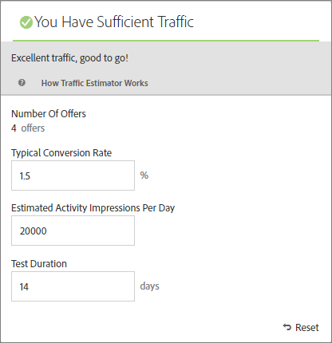

#  PREMIUMEmmentera trafiken som krävs för att lyckas

[!UICONTROL Traffic Estimator] ger feedback som talar om för dig om du har tillräckligt med trafik för att din [!DNL Adobe Target]-aktivitet ska lyckas.

Eftersom en [!UICONTROL Automated Personalization]-aktivitet använder flera erbjudandekombinationer är det viktigt att veta hur mycket trafik som krävs för att ge meningsfulla resultat. [!UICONTROL Traffic Estimator] använder statistik om din sida och antalet upplevelser som testas för att uppskatta mängden trafik och hur lång tid som krävs för att aktiviteten ska lyckas.

[!UICONTROL Traffic Estimator] avgör om det finns tillräckligt med trafik för att generera personaliserade modeller genom att jämföra de uppskattade sidavbildningarna och den typiska konverteringsgraden för sidorna. Det bästa är om du väljer en lyckad aktivitet med rätt samplingsstorlek, så att det anpassade innehållet är klart inom 50 % av aktivitetens varaktighet eller 14 dagar, beroende på vilket värde som är lägst. Detta ger tillräckligt med tid för att få personaliserat innehåll och lära sig vilket innehåll som ska levereras.

Kom ihåg att [!DNL Target] fungerar slumpmässigt tills personaliseringsalgoritmerna byggs. Kryssmarkeringsikonen bredvid varje erbjudande visar när modellen för det erbjudandet är klar och [!DNL Target] kan börja leverera personaliserat innehåll. Eftersom lift (lift) förväntas först när modellerna är klara kan du med den visuella indikeringen ställa in rätt förväntningar. Använd [!UICONTROL Traffic Estimator] i [!UICONTROL Visual Experience Composer] (VEC) för att få en riktlinje för när modellerna ska vara klara.

## Använda Traffic Estimator

1. Klicka på **[!UICONTROL Traffic]** i [!UICONTROL Visual Experience Composer].

   

   [!UICONTROL Traffic Estimator] öppnas. Du kan klicka på **[!UICONTROL Traffic]** igen om du vill dölja [!UICONTROL Traffic Estimator].

   

1. Ange typisk konverteringsgrad (eller den konverteringsgrad du förväntar dig av den här aktiviteten), beräknade aktivitetsavtryck per dag och testets varaktighet.

   * **Antal erbjudanden**: Beräknas automatiskt baserat på antalet upplevelser som skapas som en del av din aktivitet efter eventuella undantag.
   * **Normal konverteringsgrad**: Konverteringsgraden uttrycks som en procentandel, baserat på din uppskattning eller tidigare data från analyssystemet.
   * **Beräknade besök per dag**: Detta är antalet besök per dag från besökare som kan visa aktiviteten, baserat på målinriktningskriterierna. Detta kan baseras på era analysdata. Observera att det här numret ska vara besök, inte unika besökare.
   * **Testvaraktighet**: Antalet dagar som du vill att aktiviteten ska köras.

   [!UICONTROL Traffic Estimato]r använder statistiken för att avgöra vilka justeringar som krävs för att köra ett lyckat test.

   I närheten av överkanten av [!UICONTROL Traffic Estimator] beräknas de värden du angav och resultatet visas.

   

   När du ändrar siffrorna ändras uppskattningen. Om du till exempel testar ett stort antal kombinationer och din konverteringsgrad och dina visningar är för låga, visar [!UICONTROL Traffic Estimator] hur lång tid testet måste köras för att lyckas. Eller, om trafiken är låg, kan [!UICONTROL Traffic Estimator] föreslå ett lägre antal erbjudandekombinationer så att du kan köra testet på önskat antal dagar.

   Om du inte har tillräckligt med trafik kan du göra något av följande:

   * Överväg att använda en [Auto-Target](/help/c-activities/auto-target/auto-target-to-optimize.md)-aktivitet i stället för [!UICONTROL Automated Personalization] för att skapa upplevelser med flera erbjudandeändringar i en upplevelsevariation.
   * Minska antalet erbjudandekombinationer i din [!UICONTROL Automated Personalization]-aktivitet.
   * Öka aktivitetens varaktighet.

   Justera siffrorna tills [!UICONTROL Traffic Estimator] säger att du har tillräckligt med trafik och utforma sedan testet därefter.

   

   Om trafiken är tillräcklig visas en grön kontroll med ikonen [!UICONTROL Traffic]. Om ikonen inte är tillräcklig visas en röd varningsetikett.

## Vanliga frågor om trafikberäkningsverktyget

Tänk på följande vanliga frågor när du arbetar med [!UICONTROL Traffic Estimator]:

### Varför skapar inte [!DNL Target] personaliserade modeller när min AP-aktivitet har tillräckligt med trafik?

Under vissa omständigheter kan din trafik vara tillräckligt stor för att en anpassad modell ska kunna skapas, men den trafiken kan informera [!DNL Target] om att det inte finns någon meningsfull skillnad mellan den personaliserade modellen och slumpmässigt. Även om modellen är inbyggd i [!DNL Target] och testad kommer den inte att distribueras eftersom modellen inte är betydligt bättre än slumpmässig.

En möjlig orsak till att modellen inte är bättre än slumpmässigt kan vara att erbjudandena inte skiljer sig nämnvärt från varandra. Om så är fallet kan du prova att göra erbjudandena mer visuellt annorlunda om meddelandet är liknande, eller så kan du försöka ändra själva meddelandet.
