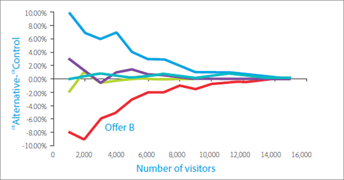

# Tio vanliga A/B-testfall och hur man undviker dem{#nine-common-a-b-testing-pitfalls-and-how-to-avoid-them}

A/B-tester utgör ryggraden i de flesta optimeringsprogram för digital marknadsföring och hjälper marknadsförare att erbjuda optimerade och målinriktade upplevelser till sina besökare och kunder. I det här avsnittet beskrivs tio av de största fallgropar som företag hamnar på när de utför A/B-tester. Det innehåller även sätt att undvika dem, så att ditt företag kan få större avkastning genom sina testsatsningar och ha större förtroende för de rapporterade A/B-testresultaten.

## Pitfall 1: Ignorera effekterna av signifikansnivån {#section_55F5577A13C6470BA1417C2B735C6B1D}

Hur sannolikt är det att ditt test rapporterar en betydande skillnad i konverteringsgrad mellan två erbjudanden när det i själva verket inte finns någon? Det är det som *signifikansnivån* i ett test kan avgöra. Sådana missvisande resultat kallas ofta falskt positiva och i statistikens värld kallas ett Type I-fel (om du felaktigt avvisar den nollhypotes som faktiskt är sann).

När du anger signifikansnivån för ett A/B-test gör du en kompromiss mellan toleransen för att acceptera att en upplevelse är bättre än den andra när den egentligen inte är det (Type I-fel eller&quot;false positive&quot;) och att inte se någon statistisk skillnad mellan upplevelserna när det faktiskt finns en verklig skillnad (Type II-fel eller&quot;false negative&quot;). Konfidensnivån *bestäms innan* testet körs.

Det *konfidensintervall* som bestäms när testet är klart påverkas av tre huvudfaktorer: teststorlek, signifikansnivå och populationsstandardavvikelse. Eftersom markören valde signifikansnivån innan testet konstruerades och populationsstandardavvikelsen inte kan påverkas, är den enda kontrollerbara faktorn samplingsstorleken. Den provstorlek som krävs för ett konfidensintervall som du känner dig bekväm med, och den resulterande tid det tar att uppnå den provstorleken, är ett nyckelbeslut som en marknadsförare måste bestämma under testdesignen.

Ett annat direkt relaterat begrepp, *konfidensnivån*, tar mer av ett glas halvfullt. I stället för att ange sannolikheten för att du blir falskt positiv, som signifikansnivån gör, representerar konfidensnivån sannolikheten för att ditt test inte kommer att göra det misstaget.

Konfidensnivå och signifikansnivå har ett direkt samband eftersom:

100 % - konfidensnivå = signifikansnivå

I A/B-tester använder marknadsförarna ofta 95 % konfidensnivåer. Baserat på ovanstående ekvation är det tydligt att det motsvarar en signifikansnivå på 5 %. Att testa med 95 % konfidensnivå innebär att du har 5 % chans att upptäcka en statistiskt signifikant ökning, även när det i verkligheten inte är någon skillnad mellan erbjudandena.

Som framgår av diagrammet nedan blir resultatet falskt positivt ju fler tester du kör, desto mer troligt blir minst ett av testerna. Om du t.ex. kör 10 tester med 95 % konfidensnivå, finns det ungefär en 40-procentig risk att du kommer att upptäcka en eller flera falska positiva effekter (eftersom det inte finns någon verklig lyft: Pr(minst en falsk positiv) = 1 - Pr(inga falska positiva) = 1 - 0,95^10 = 40 %).

I en marknadsföringsorganisation utgör 95 procent vanligtvis en rimlig kompromiss mellan risken för ett falskt positivt och falskt negativt negativ.

Det finns dock två situationer som kräver stor uppmärksamhet för signifikansnivån och dess konsekvenser för testresultaten: segmentering efter test och testning av flera erbjudanden.

* **Segmentering efter provning:** Marknadsförarna segmenterar och tonar ofta resultaten av ett test baserat på besökarsegment efter att A/B-testet är avslutat. Vanliga segment är webbläsartyp, enhetstyp, geografiska områden, tid på dygnet och nya jämfört med återkommande besökare. Denna metod, som kallas segmentering efter test, ger en utmärkt inblick i besökarsegment. Marknadsförarna kan i sin tur använda dessa insikter för att skapa mer målinriktat, relevant och differentierat innehåll.

   Om det inte finns någon verklig skillnad i konverteringsgrad är sannolikheten för ett falskt positivt värde lika med signifikansnivån varje gång du testar ett segment. Och ju fler tester du kör, desto större är sannolikheten att du kommer att uppleva minst ett falskt positivt test bland dessa tester. Varje post-test representerar alltså ett separat test. Med en signifikansnivå på 5 % faller ni i genomsnitt till en falsk positiv nivå varje gång ni tittar på 20 segment efter testet. Diagrammet ovan visar hur sannolikheten ökar.

   Ju fler tester du kör, desto större sannolikhet kommer du att uppleva minst ett falskt positivt test bland testerna. Varje post-test utgör alltså ett separat test, vilket ökar sannolikheten för ett falskt positivt resultat. Ökningen kan bli ännu större om segmenten är korrelerade.

   Ska ni helt enkelt inte segmentera efter testet? Nej, posttestsegment är värdefulla. För att undvika detta kumulativa falskt positiva problem med segmentering efter testet bör du testa det i ett nytt test när du har identifierat ett segment efter testet. Du kan också använda Bonferroni-korrigeringen, som beskrivs nedan.

* **Testa flera erbjudanden:** Marknadsförarna testar ofta fler än två erbjudanden (eller upplevelser) mot varandra. Därför ser du ibland A/B-testningslösningar som kallas A/B/n-testning, där n är antalet erbjudanden som du testar samtidigt.

   Det är viktigt att observera att *varje* testat erbjudande har en falskt positiv hastighet som motsvarar signifikansnivån, vilket beskrivs ovan. Även här kör du effektivt flera tester när flera erbjudanden skickas mot varandra i en och samma testmiljö. Om du till exempel jämför fem erbjudanden i ett A/B/C/D/E-test kan du göra fyra jämförelser: kontroll till B, kontroll till C, kontroll till D, kontroll till E. Med en konfidensnivå på 95 % och inte 5 % sannolikhet för falskt positiva resultat har du i själva verket 18,5 %. 2

   För att behålla den totala konfidensnivån på 95 % och undvika det här problemet använder du det som kallas Bonferroni-korrigeringen. Med hjälp av den här korrigeringen delar du bara in signifikansnivån med antalet jämförelser för att få den signifikansnivå som behövs för att uppnå en konfidensnivå på 95 %.

   Om du tillämpar Bonferroni-korrigeringen i exemplet ovan skulle du använda en signifikansnivå på 5%/4 = 1,25%, vilket är samma som en konfidensnivå på 98,75% för ett enskilt test (100% - 1,25% = 98,75%). Justeringen bibehåller den effektiva konfidensnivån vid 95 % när du har fyra tester, som i det beskrivna exemplet.

## Pitfall 2: Deklarera vinnarna av tester av olika erbjudanden utan statistiskt signifikant skillnad {#section_FA83977C71DB4F69B3D438AF850EF3B6}

Med testning av flera erbjudanden deklarerar marknadsförarna ofta erbjudandet med högsta lyft som testvinnare, även om det inte finns någon statistiskt signifikant skillnad mellan vinnaren och löparen. Detta inträffar när skillnaden mellan alternativen är mindre än skillnaden mellan alternativen och kontrollen. Bilden nedan illustrerar detta koncept, med de svarta felstaplarna som representerar 95 % ökning av konfidensintervall. Den verkliga höjningen för varje erbjudande i förhållande till kontrollerbjudandet är 95 % troligtvis inkluderad i konfidensintervallet - det intervall som visas av felstaplarna.

Erbjudandena A och B har den högsta observerade lyften under testet, och det är osannolikt att erbjudandet C skulle överträffa dessa erbjudanden i ett framtida test, eftersom konfidensintervallet för C inte ens överlappar konfidensintervallen för A eller B. Även om A-erbjudandet har den högsta observerade lyften under testet är det dock helt möjligt att B-erbjudandet kan fungera bättre i ett framtida test eftersom konfidensintervallen överlappar varandra.

Här är processen att både erbjudanden A och B bör betraktas som testvinnare.

Det är vanligtvis inte möjligt att köra testet tillräckligt länge för att identifiera alternativens verkliga relativa prestanda, och ofta är skillnaden i prestanda mellan alternativen för liten för att i hög grad påverka konverteringsgraden. I sådana fall kan du tolka resultatet som en länk och använda andra överväganden, som strategi eller anpassning till andra element på sidan, för att avgöra vilket erbjudande som ska implementeras. Med flera tester måste du vara öppen för fler än en vinnare, vilket i vissa fall avsevärt öppnar upp för möjligheterna att ta vägen till utvecklingen av din webbplats.

Observera att om ni vill identifiera erbjudandet med den högsta konverteringsgraden jämför ni alla erbjudanden med varandra. I exemplet ovan har du n = 5 erbjudanden - du måste göra n(n-1)/2 jämförelser eller 5*(5-1)/2 = 10 jämförelser. I detta fall kräver Bonferroni-korrigeringen att signifikansnivån för testet är 5%/10 = 0,5%, vilket motsvarar en konfidensnivå på 99,5%. En sådan hög konfidensnivå kan dock kräva att du kör testet under en orimligt lång tid.

## Pitfall 3: Ignorera effekten av statistisk styrka {#section_0D517079B7D547CCAA75F80981CBE12A}

Statistisk effekt är sannolikheten för att ett test ska upptäcka en verklig skillnad i konverteringsgrad mellan olika erbjudanden. På grund av det slumpmässiga, eller som statistiker kallar det&quot;stokastiskt&quot;, typ av konverteringshändelser, kanske ett test inte visar en statistiskt signifikant skillnad, även när det finns en verklig skillnad i konverteringsgrad mellan två anbud i längden. Kalla det otur eller av en slump. Om det inte går att identifiera en verklig skillnad i konverteringsgraden kallas det för ett falskt negativ eller ett Type II-fel.

Det finns två huvudfaktorer som avgör kraften i ett test. Den första är exempelstorleken, det vill säga antalet besökare som ingår i testet. Sekund är storleken på skillnaden i konverteringsgrad som du vill att testet ska identifiera. Kanske är detta ganska intuitivt, men om du bara är intresserad av att upptäcka stora skillnader i konverteringsgraden är det mycket större sannolikhet att testet faktiskt kommer att upptäcka så stora skillnader - som att upptäcka att du har en elefant i vardagsrummet jämfört med en fluga när du tittar igenom ett pappersdukrör. Längs de raderna är det mindre skillnad du vill identifiera, ju större samplingsstorleken är det, och därför är det dags att få den större samplingsstorleken.

Dagens marknadsförare understyr ett anmärkningsvärt antal tester. Med andra ord använder de en samplingsstorlek som är för liten. Det innebär att de har en liten chans att upptäcka sanna positiva effekter, även när det faktiskt finns en betydande skillnad i konverteringsgraden. Om du ständigt kör underdrivna tester kan antalet falska positiva vara jämförbart med, eller till och med dominera, antalet sanna positiva. Detta leder ofta till implementering av neutrala förändringar av en plats (tidsslöseri) eller förändringar som faktiskt minskar konverteringsgraden.

För att undvika underdrift bör du tänka på att en typisk standard för ett väldrivet test inkluderar en konfidensnivå på 95 % och en statistisk styrka på 80 %. Ett sådant test ger en 95-procentig sannolikhet att du undviker ett falskt positivt test och en 80-procentig sannolikhet att du undviker ett falskt negativt.

## Steg 4: Använda ensidiga tester {#section_8BB136D1DD6341FA9772F4C31E9AA37C}

Enkelsidiga tester kräver en mindre observerad skillnad i konverteringsgraden mellan erbjudandena för att ringa en vinnare på en viss signifikansnivå. Detta verkar tilltalande eftersom vinnarna kan kallas tidigare och oftare än vid dubbelsidiga tester. Men i enlighet med talesättet &quot;Det finns ingen gratis lunch&quot; kostar ensidiga tester.

I ett ensidigt test testar ni om erbjudande B är bättre än erbjudande A. Testets riktning måste bestämmas innan testet börjar, eller &quot;a priori&quot; i statistiken. Du måste alltså bestämma om du ska testa om B är bättre än A eller A är bättre än B *innan* testet inleds. Om du emellertid tittar på resultaten av A/B-testet och ser att B klarar sig bättre än A och *sedan* bestämmer dig för att göra ett ensidigt test för att se om skillnaden är statistiskt signifikant, bryter du mot antagandena bakom det statistiska testet. Om du bryter antagandena i testet innebär det att dina konfidensintervall är otillförlitliga och att testet har en högre falskt positiv frekvens än du hade förväntat dig.

Du kan se ett ensidigt test som att ställa ett erbjudande inför rätta till en domare som redan har bestämt sig. I ett ensidigt test har ni redan bestämt vad det vinnande erbjudandet ska vara och ska bevisa det, istället för att ge varje upplevelse en lika stor chans att visa sig som vinnaren. Enkelsidiga tester bör endast användas i sällsynta fall där du bara är intresserad av om ett erbjudande är bättre än det andra och inte tvärtom. För att undvika problemet med ensidigt test bör du använda en A/B-testlösning som alltid använder tvåsidiga tester, till exempel [!DNL Adobe Target].

## Pitfall 5: Övervakningstester {#section_EA42F8D5967B439284D863C46706A1BA}

Marknadsförarna övervakar ofta A/B-tester tills testet ger ett betydande resultat. Varför testa när du har uppnått statistisk signifikans?

Tyvärr är det inte så enkelt. För att inte kasta ut en skiftnyckel i arbetena, men det visar sig att övervakning av resultaten negativt påverkar testets effektiva statistiska betydelse. Det ökar faktiskt sannolikheten för falska positiva resultat avsevärt och gör dina konfidensintervall otillförlitliga.

Det här kan verka förvirrande. Det låter som om vi säger att om vi bara tittar på resultaten mitt i testet kan du få dem att förlora sin statistiska betydelse. Det är inte precis vad som pågår. I följande exempel förklaras varför.

Låt oss säga att ni simulerar 10 000 konverteringshändelser för två erbjudanden, där båda erbjudandena har 10 % konverteringsgrad. Eftersom konverteringsgraden är densamma bör du inte upptäcka några skillnader i konverteringshöjning när du testar de två erbjudandena mot varandra. Med ett 95% konfidensintervall ger testet förväntat 5% falskt positivt resultat när det utvärderas efter att alla 10 000 observationer har samlats in. Om vi kör 100 av dessa tester får vi i genomsnitt fem falska positiva utfall (i själva verket är alla positiva utfall falska i det här exemplet eftersom det inte finns någon skillnad i konverteringsgrad mellan de två erbjudandena). Men om vi utvärderar testet 10 gånger under testet - var 1 000:e observation - visar det sig att den falska positiva hastigheten hoppar upp till 16 %. Övervakning av testet har mer än tredubblat risken för falskt positiva resultat! Hur kan det här vara?

För att förstå varför detta inträffar måste du överväga de olika åtgärder som vidtas när ett signifikant resultat identifieras och när det inte identifieras. När ett statistiskt signifikant resultat påträffas avbryts testet och en vinnare deklareras. Om resultatet inte är statistiskt signifikant kan vi dock fortsätta testet. Denna situation gynnar starkt det positiva resultatet och förvränger därmed testets effektiva signifikansnivå.

För att undvika det här problemet bör du bestämma hur lång tid testet ska köras innan testet inleds. Det går bra att titta på testresultaten under testet för att kontrollera att du implementerat testet korrekt, men dra inga slutsatser eller stoppa testet innan det önskade antalet besökare uppnås. Med andra ord, ingen tjuvtitt!

## Pitfall 6: Prov stoppas för tidigt {#section_DF01A97275E44CA5859D825E0DE2F49F}

Det är frestande att stoppa ett test om ett av erbjudandena fungerar mycket bättre eller sämre än de andra under testets första dagar. När antalet observationer är lågt är det dock mycket troligt att en positiv eller negativ lyft kommer att observeras av en enda slump, eftersom konverteringsgraden är ett medelvärde för ett lågt antal besökare. När testet samlar in fler datapunkter konverterar konverteringsgraden till sina sanna långsiktiga värden.

Bilden nedan visar fem erbjudanden med samma långsiktiga konverteringsgrad. Erbjudandet B hade en dålig konverteringsgrad för de första 2 000 besökarna och det tar lång tid innan den uppskattade konverteringsgraden återgår till den verkliga långfristiga räntan.

Fenomenet kallas &quot;regression till medelvärdet&quot; och kan leda till besvikelse när ett erbjudande som utfördes väl under testets första dagar inte klarar att prestera så bra på lång sikt. Det kan också leda till förlorade intäkter när ett bra erbjudande inte implementeras, eftersom det råkade underprestera under testets tidiga dagar bara av en slump.

Precis som när det gäller att övervaka ditt test är det bästa sättet att undvika dessa problem att fastställa ett tillräckligt antal besökare innan testet körs och sedan låta testet köras tills detta antal besökare har exponerats för erbjudandena.

## Pitfall 7: Ändra trafiktilldelningen under testperioden {#allocation}

Vi rekommenderar att du inte ändrar procentsatserna för trafikallokering under testperioden eftersom detta kan fördröja testresultaten tills data har normaliserats.
Anta till exempel att du har en A/B-testaktivitet där 80 % av trafiken tilldelas till Experience A (kontrollen) och 20 % av trafiken tilldelas till Experience B. Under testperioden ändrar du tilldelningen till 50 % för varje upplevelse. Några dagar senare ändrar ni trafiktilldelningen till 100 % till Experience B.

I det här scenariot, hur tilldelas användare till upplevelser?

Om du manuellt ändrar fördelningen till 100 % för Experience B, kommer besökare som ursprungligen tilldelades Experience A (kontrollen) att förbli kvar i sin ursprungliga tilldelade upplevelse (upplevelse A). Förändringen av trafiktilldelningen påverkar endast nya deltagare.

Om du vill ändra procentsatser eller avsevärt påverka besökarflödet till varje upplevelse rekommenderar vi att du skapar en ny aktivitet eller kopierar aktiviteten och sedan redigerar procentsatserna för trafikallokering.

Om du ändrar procentsatserna för olika upplevelser under testperioden tar det några dagar innan data normaliseras, särskilt om många köpare returnerar besökare.
Ett annat exempel är om A/B-testets trafikallokering delas upp 50/50 och sedan du ändrar uppdelningen till 80/20, vilket innebär att resultatet kan bli skeva under de första dagarna efter ändringen. Om den genomsnittliga tiden för konvertering är hög, vilket innebär att det tar flera timmar eller till och med dagar att göra ett köp, kan dessa fördröjda konverteringar påverka dina rapporter. I den första upplevelsen, där antalet gick från 50 % till 80 % och den genomsnittliga tiden till konvertering är två dagar, konverterar bara besökare från 50 % av befolkningen på testets första dag, även om 80 % av befolkningen idag deltar i upplevelsen. Detta gör att konverteringsgraden ser ut som den har ökat, men det kommer att normaliseras igen efter att dessa 80 % av besökarna har tagit två dagar på sig att konvertera.

## Pitfall 8: Saknar betydelse {#section_90F0D24C40294A8F801B1A6D6DEF9003}

Andra oväntade saker kan hända om vi inte hinner köra ett test tillräckligt länge. Den här gången är problemet inte ett statistikproblem. det är bara en reaktion på besökarnas förändring. Om du ändrar en väletablerad del av din webbplats kan återkommande besökare i första hand engagera sig mindre i det nya erbjudandet på grund av ändringar i deras vanliga arbetsflöde. Detta kan tillfälligt leda till att ett överlägset nytt erbjudande fungerar mindre optimalt tills de återkommande besökarna vänjer sig vid det - ett lågt pris att betala med tanke på de långsiktiga vinster som det överlägsna erbjudandet ger.

För att avgöra om det nya erbjudandet fungerar dåligt på grund av en ny effekt eller för att det är riktigt sämre kan ni segmentera era besökare i nya och återkommande besökare och jämföra konverteringsgraden. Om det bara är nyheten vinner det nya erbjudandet med nya besökare. När de återkommande besökarna vänjer sig vid de nya ändringarna vinner erbjudandet också.

Nyhetseffekten kan också fungera omvänt. Besökarna reagerar ofta positivt på en förändring bara för att den introducerar något nytt. Efter en stund när det nya innehållet blir gammalt eller mindre spännande för besökaren sjunker konverteringsgraden. Den här effekten är svårare att identifiera, men det är viktigt att noggrant övervaka förändringar i konverteringsgraden för att upptäcka detta.

## Pitfall 9: Hänsyn tas inte till skillnader i skadeundersökningsperioden {#section_B166731B5BEE4E578816E351ECDEA992}

Ersättningsperioden är den tidsperiod från och med vilken A/B-testningslösningen ger ett erbjudande till en besökare när besökaren konverterar. Detta kan vara viktigt med erbjudanden som avsevärt påverkar skadeundersökningsperioden, till exempel ett erbjudande som innebär en deadline, till exempel&quot;Tidsbegränsat erbjudande - Köp före söndag&quot;.

Sådana erbjudanden uppmuntrar besökarna att konvertera snabbare och kommer att prioriteras om testet stoppas omedelbart efter att erbjudandet upphör, eftersom det alternativa erbjudandet kan ha en längre deadline eller ingen deadline, och därför en längre tidsperiod. Alternativet skulle få konverteringar under perioden efter testets slut, men om du stoppar testet i slutet av tidsgränsen räknas inte ytterligare konverteringar in i testkonverteringsgraden.

Bilden nedan visar två erbjudanden som två olika besökare ser samtidigt på en söndagseftermiddag. Ersättningsperioden för erbjudande A är kort och besökaren konverterar senare den dagen. Men erbjudande B har en längre tidsperiod och besökaren som såg erbjudandet B funderar på erbjudandet en stund och konverterar till måndag morgon. Om du stoppar testet på söndag kväll räknas konverteringen som är kopplad till erbjudande A in i A:s konverteringsmått, medan konverteringen som är kopplad till erbjudande B inte räknas in i erbjudandets konverteringsmått. Detta medför att erbjudande B hamnar i en betydande nackdel.

För att undvika detta fall bör besökare som exponerats för testerbjudandena få tid att konvertera efter att ett nytt tävlingsbidrag har stoppats. I det här steget får du en rättvis jämförelse av erbjudandena.

## Pitfall 10: Använda mätvärden som inte avspeglar affärsmålen {#section_F0CD6DC7993B4A6F9BEEBB31CD1D9BEE}

Marknadsförarna kan vara frestade att använda konverteringsvärden för hög trafik och låg varians i den övre tratten, som klickfrekvens (CTR), för att snabbare nå ett tillräckligt antal testkonverteringar. Tänk dock på om CTR är en lämplig proxy för det verksamhetsmål du vill uppnå. Erbjudanden med högre CTR kan enkelt leda till lägre intäkter. Det här kan hända när erbjudanden lockar besökare som har en lägre köpbenägenhet, eller när själva erbjudandet - till exempel - leder till ett rabatterbjudande - bara till lägre intäkter.

Titta på skiderbjudandet nedan. Det genererar en mycket högre CTR än cykelerbjudandet, men eftersom besökarna i genomsnitt spenderar mycket mer pengar när de följer cykelerbjudandet är den förväntade intäkten att placera cykelerbjudandet framför en viss besökare högre. Ett A/B-test med CTR som mätvärde skulle därför välja ett erbjudande som inte maximerar intäkterna - det grundläggande affärsmålet.

För att undvika det här problemet bör du övervaka dina affärsvärden noga för att identifiera affärseffekten av erbjudandena, eller ännu bättre, använda en mätmetod som ligger närmare ditt verksamhetsmål, om det är möjligt.

## Slutsats: Framgångsrik A/B-testning genom att identifiera och stega runt fallgroparna {#section_54D33248163A481EBD4421A786FE2B15}

När du har lärt dig om de vanliga A/B-testfallen hoppas vi att du kan identifiera när och var du kan ha fallit för dem. Vi hoppas också att vi beväpnat dig med bättre förståelse för några av de statistik och sannolikhetsbegrepp som ingår i A/B-testning som ofta känns som domänen för människor med mattegrader.

Stegen nedan hjälper dig att undvika dessa fallgropar och fokusera på att få bättre resultat från A/B-testningen:

* Tänk noga på rätt mätvärden för testet baserat på relevanta affärsmål.
* Bestäm en konfidensnivå innan testet börjar och följ detta tröskelvärde när du utvärderar resultaten efter att testet har avslutats.
* Beräkna provstorleken (antal besökare) innan testet startas.
* Vänta tills den beräknade provstorleken har nåtts innan testet stoppas.
* Justera konfidensnivån när du segmenterar efter testet eller utvärderar mer än ett alternativ, t.ex. med korrigeringen av Bonferroni.

