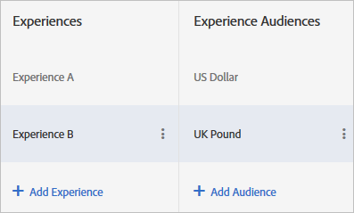

# Målgrupper med olika upplevelser i ett A/B-test

Du kan rikta versioner av samma upplevelse till olika målgrupper i [!DNL Adobe Target] A/B-aktiviteter. Du kan konfigurera flera målgrupper för en upplevelse i Visual Experience Composer eller i den formulärbaserade Experience Composer.

Användare kan växla mellan olika upplevelsemålgrupper när deras profil ändras. De sitter inte fast i samma upplevelse under aktivitetens livstid.

Om webbplatsen till exempel använder en enhetlig design för flera sidor eller produkter och du vill använda samma upplevelse för flera målgrupper (till exempel besökare med olika webbläsarspråk), kan du skapa flera versioner av upplevelsen. Du kanske ger engelska och japanska talare samma upplevelse, men den enda skillnaden är att texten presenteras på besökarens språk. Data samlas in för upplevelsen, oavsett språk, så rapporten visar upplevelsens prestanda i stället för versionen.

Utan möjligheten att konfigurera upplevelseversioner måste du skapa olika tester för varje språk (i det här exemplet) och sedan manuellt sammanställa resultaten för att försöka få en uppfattning om hur en upplevelse med båda språken kan fungera. Resultatet blir mindre exakt. För vissa tester är dessa beräkningar kanske inte ens användbara på grund av det sätt besökarna är slumpmässiga.

Genom att skapa olika versioner av en upplevelse får ni mer korrekt information utan att behöva göra manuella beräkningar och antaganden.

## Scenario

Ni testar två upplevelser, en geofylld banderoll jämfört med en allmän banderoll. Banderollen för varje geografi måste vara olika, men det övergripande testet är att avgöra om geolokalisering är bättre än att visa generiskt innehåll. Om du skapar en separat upplevelse för varje plats skulle du faktiskt mäta hur varje geo fungerar jämfört med den andra, i stället för om geolokalisering hjälper dig att uppnå dina framgångsmål när de mäts mot den allmänna banderollen.

I det här fallet behöver du geospecifika versioner av upplevelsen, så att du kan testa den riktade upplevelsen mot en icke-geografisk kontroll.

1. [Skapa en A/B-](/help/c-activities/t-test-ab/t-test-create-ab/test-create-ab.md) aktivitet som vanligt.

   När du konfigurerar en upplevelse som ska ha flera versioner väljer du målgrupp för varje version, vilket visas i följande steg.

1. Markera upplevelsen och klicka sedan på **[!UICONTROL Configure]** > **[!UICONTROL Audiences]** > **[!UICONTROL Multiple Audiences]**.

   

1. Klicka på **[!UICONTROL Add Audience]** och välj sedan den första målgruppen som du vill ha som mål. Upprepa för varje publik.

   

   Om målgruppen inte finns än klickar du på [Skapa målgrupp](/help/c-target/c-audiences/create-audience.md#task_E18BD77A9A8F4ED0AC50569F94556558) och ställer in den.

   Om en besökare kvalificerar sig för mer än en målgrupp returneras innehållet för alla målgrupper, och det sista innehållet i listan återges faktiskt på sidan.

1. Fortsätt att konfigurera aktiviteten.

## Bästa praxis

* Välj målgrupper som utesluter varandra. Om aktiviteten skapades i VEC returneras innehållet för varje målgrupp, med innehållet för målgruppen som visades senast på sidan, om en besökare matchar mer än en målgrupp.
* De målgrupper som definieras i diagrammet kombineras med upplevelsemålgrupperna med ett AND-villkor. För att kunna delta i aktiviteten måste besökaren vara berättigad till aktivitetsgruppen och en av upplevelsemålgrupperna.
* Lägg till samma målgrupper som segment för rapporter. Detta hjälper dig att se testresultaten på den höga upplevelsen A jämfört med B och på den lägre upplevelsen A jämfört med B för bara&quot;browser lang ja_JP&quot;. Detta fungerar bara för Target-baserade rapporter, inte för analysbaserade rapporter.

