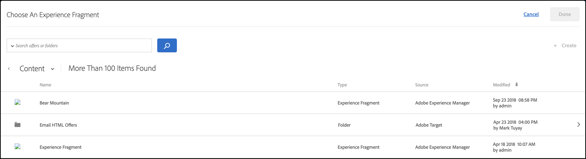

# AEM upplevelsefragment

Information om hur du använder upplevelsefragment som skapats i [!DNL Adobe Experience Manager] (AEM) i [!DNL Target]-aktiviteter för att underlätta optimering eller personalisering.

>[!NOTE]
>
>Den här funktionen kräver att du är [!DNL Adobe Experience Manager] ([!DNL AEM]) kund. Mer information finns i [Krav](/help/c-experiences/c-manage-content/aem-experience-fragments.md#section_AE6F0971E1574B3AA324003599B96E5A) nedan.

## Översikt {#section_95A91830530F493B81C5C9CDB9B783EA}

Genom att använda upplevelsefragment som skapats i [!DNL AEM] i [!DNL Target]-aktiviteter kan du kombinera lättanvända och kraftfulla [!DNL AEM] med kraftfulla funktioner för Automated Intelligence (AI) och Machine Learning (ML) i [!DNL Target] för att testa och personalisera upplevelser i stor skala.

[!DNL AEM] sammanför allt innehåll och alla resurser på en central plats för att understödja er personaliseringsstrategi. [!DNL AEM] gör att du enkelt kan skapa innehåll för datorer, surfplattor och mobila enheter på en plats utan att skriva kod. Du behöver inte skapa sidor för alla enheter. [!DNL AEM] anpassar automatiskt varje upplevelse med ditt innehåll.

[!DNL Target] Med kan ni leverera personaliserade upplevelser i stor skala baserat på en kombination av regelbaserade och AI-drivna maskininlärningsstrategier som innehåller beteendevariabler, sammanhangsbaserade variabler och offlinevariabler. Med [!DNL Target] kan du enkelt ställa in och köra [A/B Test](/help/c-activities/t-test-ab/test-ab.md) och [Multivariate](/help/c-activities/c-multivariate-testing/multivariate-testing.md)-aktiviteter (MVT) för att fastställa de bästa erbjudandena, innehållet och upplevelserna.

Experience fragments utgör ett stort steg framåt för att länka samman skapare och chefer av innehåll/upplevelser med optimerings- och personaliseringsproffs som driver affärsresultat med [!DNL Target].

## Krav {#section_AE6F0971E1574B3AA324003599B96E5A}

Du måste ha tillgång till funktionen för upplevelsefragment inom [!DNL Target]. Dessutom måste du använda [!DNL AEM] 6.3 med lämpligt Service Pack eller [!DNL AEM] 6.4 (eller senare). Din kontorepresentant kan se till att du uppfyller kraven för den här funktionen:

* [!DNL Adobe Experience Manager] 6.4 (eller senare).
* [!DNL Adobe Experience Manager] 6.3 SP2 (eller senare).
* [!DNL Adobe Target Standard] eller  [!DNL Adobe Target Premium] konto.
* Kontakta [Adobe Target kundtjänst](/help/cmp-resources-and-contact-information.md#reference_ACA3391A00EF467B87930A450050077C) om du vill aktivera integreringen och ge dig autentiseringsinformation.

## Skapa och konfigurera upplevelsefragment i [!DNL AEM] {#section_745C8EFE29F547A2958FDBF61A5ADF7B}

Om du vill använda [!DNL AEM]-upplevelsefragment i [!DNL Target] måste du utföra följande steg:

### Steg 1: Integrera [!DNL AEM] med [!DNL Target]

Mer information finns i:

* **[!DNL AEM]6.3**:  [Gå med i Adobe Analytics och Adobe ](https://docs.adobe.com/docs/en/aem/6-3/administer/integration/marketing-cloud/opt-in.html) rörande  _Adobe Experience Manager 6.3_ dokumentation.
* **[!DNL AEM]6.4**:  [Gå med i Adobe Analytics och Adobe ](https://helpx.adobe.com/experience-manager/6-4/sites/administering/using/opt-in.html) rörande  _Adobe Experience Manager 6.4_ dokumentation.
* **[!DNL AEM]6.5**:  [Gå med i Adobe Analytics och Adobe ](https://helpx.adobe.com/experience-manager/6-5/sites/administering/using/opt-in.html) rörande  *Adobe Experience Manager 6.5* dokumentation.

### Steg 2: Skapa upplevelsefragmentet

Upplevelsefragment skapas i [!DNL AEM]. Mer information finns i:

* **[!DNL AEM]6.3**:  [Upplev ](https://docs.adobe.com/docs/en/aem/6-3/author/experience-fragments.html) fragmentering i  *Adobe Experience Manager 6.3-* dokumentationen.
* **[!DNL AEM]6.4**:  [Upplev ](https://helpx.adobe.com/experience-manager/6-4/sites/authoring/using/experience-fragments.html) fragmentering i  *Adobe Experience Manager 6.4-* dokumentationen.
* **[!DNL AEM]6.5**:  [Upplev ](https://helpx.adobe.com/experience-manager/6-5/sites/authoring/using/experience-fragments.html) fragmentering i  *Adobe Experience Manager 6.5-* dokumentationen.

### Steg 3: Konfigurera [!DNL AEM] för att dela upplevelsefragmentet med [!DNL Target]

1. I [!DNL AEM] väljer du önskat upplevelsefragment eller dess innehållande mapp och klickar sedan på **[!UICONTROL Properties]**.
2. Klicka på fliken **[!UICONTROL Cloud Services]** och välj sedan **[!UICONTROL Adobe Target]** i listrutan **[!UICONTROL Cloud Service Configuration]**.

   >[!NOTE]
   >
   >I föregående steg förutsätts att någon i organisationen har skapat [!DNL Adobe Target]-konfigurationen.

3. Klicka på **[!UICONTROL Save & Close]**.

### Steg 4: Publicera upplevelsefragmentet och exportera det till [!DNL Target]

Beroende på din [!DNL AEM]-version finns följande länkar för stegvisa instruktioner:

* **[!DNL AEM]6.3**:  [Exportera ett Experience Fragment till ](https://helpx.adobe.com/experience-manager/6-3/sites/administering/using/experience-fragments-target.html) mål för  *Adobe Experience Manager 6.3-* dokumentationen.
* **[!DNL AEM]6.4**:  [Exportera en Experience Fragment till ](https://experienceleague.adobe.com/docs/experience-manager-64/administering/integration/experience-fragments-target.html) mål för  *Adobe Experience Manager 6.4-* dokumentationen.
* **[!DNL AEM]6.5**:  [Exportera en Experience Fragment till ](https://helpx.adobe.com/experience-manager/6-5/sites/administering/using/experience-fragments-target.html) mål för  *Adobe Experience Manager 6.5-* dokumentationen.

## Använda upplevelsefragment i målaktiviteter {#section_17CE4BE6B2B74CCEBAE0C68DEB84ABB9}

När du har utfört de föregående åtgärderna visas upplevelsefragmentet på sidan [!UICONTROL Offers] i [!DNL Target].

>[!NOTE]
>
>[!DNL Target] letar efter upplevelsefragment som ska importeras var tionde minut. Det importerade upplevelsefragmentet bör vara tillgängligt om [!DNL Target] inom tio minuter, men den här tidsramen bör korta framskriden.

>[!IMPORTANT]
>
>Experience fragment importeras för närvarande till [!DNL Target] som ett HTML-erbjudande. Observera att den &quot;primära&quot; versionen för upplevelsefragmentet finns kvar i [!DNL AEM]. Du kan inte redigera upplevelsefragmentet i [!DNL Target].

Du kan hovra över ett upplevelsefragment i listan och sedan klicka på ikonen [!UICONTROL View]  för att visa ytterligare information om upplevelsefragmentet, inklusive dess URL för offentlig leverans och dess [!DNL AEM]-sökväg.

Du kan använda upplevelsefragment i [!DNL Target]-aktiviteter med [Visual Experience Composer](/help/c-experiences/c-visual-experience-composer/visual-experience-composer.md) (VEC) eller [formulärbaserad Experience Composer](/help/c-experiences/form-experience-composer.md).

>[!NOTE]
>
>Om du vill använda funktionerna för [!DNL Target] AI och ML fullt ut kan du välja [Automatisk allokering](/help/c-activities/automated-traffic-allocation/automated-traffic-allocation.md#concept_A1407678796B4C569E94CBA8A9F7F5D4) eller [Automatisk allokering](/help/c-activities/automated-traffic-allocation/automated-traffic-allocation.md) när du skapar ett A/B-test.

**Så här använder du upplevelsefragment med VEC:**

1. I [!DNL Target], när du skapar eller redigerar en upplevelse i [Visual Experience Composer](/help/c-experiences/experiences.md#concept_A2E10F6AFB3D4AEAB6951EE14688848D), klickar du på den plats på sidan där du vill infoga [!DNL AEM]-innehåll och väljer sedan önskat alternativ för att visa [!UICONTROL Choose an Experience Fragment]-listan.

   * [!UICONTROL Insert Before]
   * [!UICONTROL Insert After]
   * [!UICONTROL Swap with Experience Fragment]

   Listan [!UICONTROL Experience Fragment] visar allt innehåll som skapats i [!DNL AEM] och som nu är internt tillgängligt i [!DNL Target].

   >[!NOTE]
   >
   >Alternativet [!UICONTROL Swap with Experience Fragment] är inte tillgängligt för bilder. Om du vill använda det här alternativet med en bild klickar du på behållarelementet som innehåller den önskade bilden.

   

1. Välj önskat upplevelsefragment och klicka sedan på **[!UICONTROL Done]**.
1. Slutför konfigurationen av aktiviteten.

   Mer information om hur du konfigurerar de olika aktivitetstyperna finns i följande avsnitt:

   * **A/B-test:** [Skapa ett A/B-test](/help/c-activities/t-test-ab/t-test-create-ab/test-create-ab.md)
   * **Automatisk tilldelning:** [Automatisk allokering](/help/c-activities/automated-traffic-allocation/automated-traffic-allocation.md#concept_A1407678796B4C569E94CBA8A9F7F5D4)
   * **automatiskt mål:** [automatiskt mål](/help/c-activities/auto-target/auto-target-to-optimize.md)
   * **Automated Personalization (AP):** [Skapa en Automated Personalization-aktivitet](/help/c-activities/t-automated-personalization/create-ap-activity.md#task_8AAF837796D74CF893CA2F88BA1491C9)
   * **Experience Targeting (XT):** [Skapa en Experience Targeting-aktivitet](/help/c-activities/t-experience-target/t-xt-create/xt-create.md#task_D6B3429AC31549E1A70EDF04B3DDC765)
   * **Multivariattest (MVT):** [Skapa multivariattest](/help/c-activities/c-multivariate-testing/t-create-multivariate-test/create-multivariate-test.md#task_BF870FA60A8245AB8F0B775BE32EA710)
   * **Recommendations:** [Skapa en Recommendations-aktivitet](/help/c-recommendations/t-create-recs-activity/create-recs-activity.md#task_6874328773C64C44A73F0A130AD3F96F)

**Så här använder du upplevelsefragment med den formulärbaserade Experience Composer:**

1. I [!DNL Target], när du skapar eller redigerar en upplevelse i [formulärbaserad Experience Composer](/help/c-experiences/form-experience-composer.md#task_FAC842A6535045B68B4C1AD3E657E56E), väljer du den plats på sidan där du vill infoga [!DNL AEM]-innehåll. Välj sedan **[!UICONTROL Change Experience Fragment]** för att visa [!UICONTROL Choose an Experience Fragment]-listan.

   

   Listan [!UICONTROL Experience Fragment] visar allt innehåll som skapats i [!DNL AEM] och som nu är internt tillgängligt i [!DNL Target].

1. Välj önskat upplevelsefragment och klicka sedan på **[!UICONTROL Save]**.
1. Slutför konfigurationen av aktiviteten.

## Överväganden {#considerations}

* [!DNL Target] letar efter upplevelsefragment som ska importeras var tionde minut. Det importerade upplevelsefragmentet bör vara tillgängligt om [!DNL Target] inom tio minuter, men den här tidsramen bör korta framskriden.
* Experience fragment importeras för närvarande till [!DNL Target] som ett HTML-erbjudande. Observera att den &quot;primära&quot; versionen för upplevelsefragmentet finns kvar i [!DNL AEM]. Du kan inte redigera upplevelsefragmentet i [!DNL Target].
* Du kan importera JSON-erbjudanden som upplevelsefragment till [!DNL Target]. Erbjudandena importeras dock som HTML-erbjudanden. JSON-erbjudanden (upplevelsefragment) stöds för närvarande inte helt i användargränssnittet för [!DNL Target].
* Du kan inte skapa upplevelsefragment med Adobe IO. Du måste skapa upplevelsefragment med AEM, vilket förklaras ovan.

## Utbildningsvideo: Använda AEM upplevelsefragment med Adobe Target  {#section_C0EDC54063464F41A182492D2045BC64}

I följande video visas hur du konfigurerar och använder upplevelsefragment:

>[!VIDEO](https://video.tv.adobe.com/v/22383)

>[!NOTE]
>
>Funktionen [!DNL AEM] för borttagning av länk som diskuterades vid 4:54 har tagits bort.

Mer information finns i [Använda Experience Fragments med Adobe Target](https://experienceleague.adobe.com/docs/experience-manager-learn/sites/personalization/experience-fragment-target-offer-feature-video-use.html) på sidan *AEM Sites Videos och Tutorials*.
