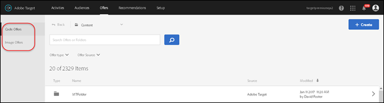

# Erbjudanden{#offers}

Använd erbjudandebiblioteket i [!DNL Adobe Target] för att hantera ditt erbjudande och innehåll i bilderbjudanden.

>[!NOTE]
>
>I januari 2017-versionen visas erbjudanden som skapats via [!DNL Target Classic], [!DNL Adobe Experience Manager] (AEM), [!DNL Adobe Mobile Services] (AMS) och API:er i [!DNL Target Standard/Premium]-användargränssnittet. Erbjudanden som uppdaterats under de senaste två åren med dessa metoder kommer att vara synliga (dvs. januari 2015 och senare). Den inledande synkroniseringen görs första gången någon användare i organisationen öppnar sidan [!UICONTROL Offers]. Hur lång tid den inledande synkroniseringen tar beror på mängden data. Efter den första synkroniseringen synkroniseras data stegvis. Om du hade kod och bilder i samma mapp före den här versionen delas de upp i två dubblettmappar i [!DNL Target]. Observera att uppdateringsdatumet och uppdateringstidpunkten hänvisar till den tidpunkt då mappen migrerades och inte återspeglar det datum då du ursprungligen skapade mappen.

Klicka på **[!UICONTROL Offers]** för att öppna biblioteket. Biblioteket innehåller erbjudanden som har konfigurerats via [!DNL Target Standard/Premium], [!DNL Target Classic], [!DNL Adobe Experience Manager] (AEM), [!DNL Adobe Mobile Services] (AMS) och API:er. Erbjudanden som skapats i [!DNL Target Classic] eller andra lösningar kan redigeras i [!DNL Target Standard/Premium].

Sidan [!UICONTROL Offers] har två flikar längs den högra sidan: Koderbjudanden och bilderbjudanden som gör att du kan visa erbjudanden efter typ.

Du kan filtrera erbjudanden efter typ (HTML-erbjudande, omdirigeringserbjudande, fjärrerbjudande eller mapp) och efter källa (Adobe Target, Adobe Target Classic, Adobe Experience Manager, Adobe Mobile Services eller API).

Du kan redigera eller kopiera en mapp eller ett erbjudande genom att hålla markören över det önskade objektet och sedan klicka på ikonerna Redigera eller Kopiera.

## Definitioner av visningserbjudande {#section_6B059DD121434E6292CAB393507D010E}

Du kan visa information om erbjudandedefinitioner på ett popup-kort i erbjudandebiblioteket utan att öppna erbjudandet.

Du kan till exempel få åtkomst till följande definitionskort för ett HTML-erbjudande genom att hovra över ett erbjudande i innehållslistan och sedan klicka på informationsikonen:

Följande information finns:

* Namn
* Källa
* Typ
* Erbjudande-ID
* Erbjudandesökväg
* Senast ändrad

Klicka på fliken [!UICONTROL Offer Usage] för att visa aktiviteterna som refererar till ett koderbjudande i varje erbjudande. Den här funktionen gäller inte bilderbjudanden. På så sätt kan du undvika att andra aktiviteter påverkas när du redigerar erbjudanden. Informationen omfattar live-aktiviteter och inaktiva aktiviteter.

Följande kort för erbjudandedefinition för ett omdirigeringserbjudande:

Följande information finns:

* Namn
* Källa
* Typ
* Erbjudande-ID
* Erbjudandesökväg
* Senast ändrad
* Omdirigerings-URL
* Inkludera alla URL-parametrar (av eller på)
* Sessions-ID för lösenordsruta (på eller av)

Följande kort för definition av erbjudande för ett fjärrerbjudande:

Följande information finns:

* Namn
* Källa
* Typ
* Erbjudande-ID
* Erbjudandesökväg
* Senast ändrad
* Omdirigera URL-typ
* Absolut eller relativ URL

## Utbildningsvideo: The Content Repository 

Den här videon innehåller information om hur du hanterar erbjudanden.

* Anslutning mellan [Experience Cloud-resursbiblioteket](https://experienceleague.adobe.com/docs/core-services/interface/assets/creative-cloud.html) och målinnehållsbiblioteket
* Anpassade HTML-erbjudanden
* Anpassat HTML-erbjudande i Visual Experience Composer

>[!VIDEO](https://video.tv.adobe.com/v/17387)