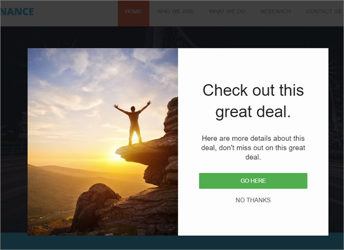
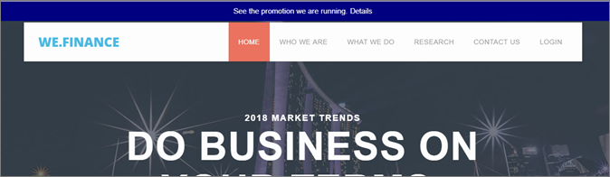

# Experience Templates{#experience-templates}

Information om Adobe Target Experience Templates som kan användas i anpassad kod. Target Experience Templates är förkodade exempel med konfigurerbara indata som används för att köra vanliga marknadsföringsfall.

Dessa Experience Templates är kostnadsfria för utvecklare och marknadsförare som en startpunkt för vanliga användningsfall, antingen via VEC eller den formulärbaserade Experience Composer.

Följande mallar är för närvarande tillgängliga på Adobe Marketing Cloud GitHub, se [Target-Experience-Templates](https://github.com/Adobe-Marketing-Cloud/target-experience-templates).

## Banderoll Carousel med miniatyrbilder {#section_BEEE51D47CC44A478264BBF3FEC70DAE}

Banner Carousel med Thumbnails Experience template  är en roterande karusell som ofta används på hemsidor och landningssidor eller andra sidor med stora volymer. Denna karusell roterar inte automatiskt genom bilderna och kan interagera direkt genom att klicka på de mindre bilderna under den primära bilden.

## Banner Carousel {#section_725D4C0C4FCD41FA92BCFC910A216E2A}

Mallen [för](https://github.com/Adobe-Marketing-Cloud/target-experience-templates/tree/master/banner-carousel) banderollCarousel-upplevelsen är en roterande karusell som ofta används på startsidor och landningssidor eller andra stora startsidor. Denna karusell roterar inte automatiskt genom bilderna och kan interagera direkt genom att klicka på vänster- och högerpilarna.

## Nedräkning av banderoll {#section_ED9501FE096C4CD7B6D9933E0322B4AD}

Mallen [för upplevelsenedräkning av](https://github.com/Adobe-Marketing-Cloud/target-experience-templates/tree/master/banner-countdown) banderoller är en stor banderoll med en central nedräkningsfunktion, som ofta används på hemsidor och landningssidor eller andra sidor med stora volymer.

## Button Builder {#section_DBDD1C9A9F294FB6BABBC04B4454E59B}

Mallen [för upplevelsen i](https://github.com/Adobe-Marketing-Cloud/target-experience-templates/tree/master/button) Button Builder är en liten knapp med ett textanrop till åtgärd. Knappen är konfigurerbar och kan placeras var som helst på sidan för att lägga till ett nytt anrop till åtgärd eller ersätta en befintlig knapp med ett mer konfigurerbart alternativ.

## Ljuslåda med nedräkning {#section_E1177C52F1294EA5AC48312727CD3DF4}

Ljuslådan med mallen  Nedräkning är en popup-meny för ljuslådeövertäckning med en central nedräkning, som ofta används på startsidor och landningssidor eller andra startsidor med stora volymer.

## Ljuslåda med avslutningsmetod {#section_E624C867E4CD4F2294CFC7917EFAEBD7}

Ljuslådan med [Exit Intent-upplevelsemallen](https://github.com/Adobe-Marketing-Cloud/target-experience-templates/tree/master/lightbox-exit-intent) är en popup med ljuslådeövertäckning som aktiveras vid avslutningsmetoden (flytta musen till övre högra delen av skärmen) och kan användas på alla webbegenskaper där du vill ha en sista chans att fånga uppmärksamheten.

## Ljuslåda {#section_EF4FBA08CE55407CAFB334340C6C1577}

Mallen  Ljuslådeupplevelse är en popup-meny med ljuslådeövertäckning och inbyggd fördröjning, som ofta används på hemsidor och landningssidor eller andra startsidor med stora volymer.

## Band {#section_CCBB656265F140AEA1B200409D719000}

Mallen  Ribbon Experience är ett 100-procentigt breddband som infogas högst upp på webbsidan, vilket vanligtvis används för att visa en blixtförsäljning, fri frakt, säkerhets- eller väderhändelse eller andra viktiga meddelanden.

