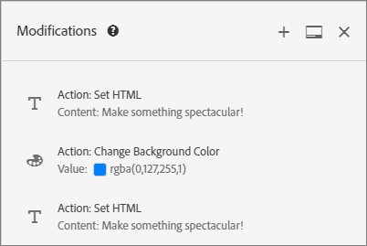
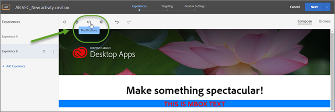

# Ändringar{#modifications}

Information om sidan Modifications (Ändringar) där du kan visa ändringar på sidan och lägga till ytterligare ändringar (CSS-väljare, Mbox och anpassad kod).

På sidan Ändringar visas alla ändringar som har gjorts på sidan i Visual Experience Composer (VEC). Du kan göra ytterligare ändringar genom att klicka på varje element på sidan och [välja en åtgärd](/help/c-experiences/c-visual-experience-composer/viztarget-options.md#reference_3BD1BEEAFA584A749ED2D08F14732E81). Varje ändring du gör visas som en separat åtgärd eller ett separat element i [!UICONTROL Modifications] listan. Du kan också lägga till ändringar, bland annat följande ändringstyper: CSS-väljare, Mbox. och anpassad kod.

## Översikt över ändringar {#section_EE27E7572AA74397BBDED563B2B3D509}

På [!UICONTROL Modifications] sidan visas alla ändringar som har gjorts på sidan i VEC. Varje ändring du gör visas som en separat åtgärd eller ett separat element i [!UICONTROL Modifications] listan.


Använd sidan Modifications (Ändringar) för att göra små ändringar i väljaren som Target väljer när du använder VEC för att konfigurera hur innehåll levereras. Du kan ändra antingen innehållet eller ett HTML-attribut. Du kan också redigera koden och skapa motsvarigheten till ett HTML-erbjudande i en mbox.

Använd sidan Ändringar för att:

* Visa en åtgärd som har utförts i den visuella dispositionen.

   

* Redigera en befintlig åtgärd. Håll pekaren över den önskade ändringen och klicka sedan på **[!UICONTROL Edit]** ikonen.

   

   Gör ändringarna.

   

* Ta bort en befintlig åtgärd. Håll pekaren över den önskade ändringen och klicka sedan på **[!UICONTROL Delete]** ikonen.

   

* Lägg till en ny ändring. Klicka på **[!UICONTROL Add Modification]** eller ikonen + och ange sedan dina ändringar enligt beskrivningen nedan.

   

   Observera att när en ändring har skapats visas en +-ikon längst upp på panelen Ändringar i stället för knappen Lägg till ändring längst ned på panelen.

* Docka ändringspanelen lodrätt längs sidan av målgränssnittet eller vågrätt längst ned. Klicka på [!UICONTROL Dock] ikonen för att växla mellan de två inställningarna.

   

   I följande bild visas panelen Ändringar som är dockad längst ned på skärmen:

   

## Lägg till ändringar {#section_C7ABCD5731A048CB8F90EDC31A32EDF9}

1. Om du vill visa [!UICONTROL Modifications] sidan för en vald upplevelse går du till VEC och klickar på **[!UICONTROL Modifications]** &lt;/>-ikonen.

   

   >[!NOTE]
   >
   >Skapa eller redigera ett HTML-erbjudande om du vill öppna panelen Modifications i den formulärbaserade Experience Composer. Mer information finns i [Formulärbaserad Experience Composer](/help/c-experiences/form-experience-composer.md#task_FAC842A6535045B68B4C1AD3E657E56E).

   Sidan öppnas och skärmen delas upp mellan det visuella läget till vänster och panelen Ändringar till höger. [!UICONTROL Modifications] Klicka på [!UICONTROL Dock] ikonen om du vill docka panelen Ändringar lodrätt längs sidan av målgränssnittet eller vågrätt längst ned. Observera att Experience A i följande bild inte har några tidigare ändringar.

   

   Upplevelse B visar de tidigare ändringarna på [!UICONTROL Modifications] panelen till höger.

   

1. Så här lägger du till en ändring:

   * Om inga tidigare ändringar av upplevelsen har gjorts klickar du på **[!UICONTROL Add Modification]** knappen längst ned på [!UICONTROL Modifications] panelen till höger.
   * Om det finns tidigare ändringar för upplevelsen klickar du på +-ikonen längst upp på [!UICONTROL Modifications] panelen till höger.

   På panelen Ändringar visas:

   

1. Välj önskad typ i **[!UICONTROL Modifications Type]** listrutan:

   | Ändringstyp | Detaljer |
   |--- |--- |
   | CSS-väljare | I rutan CSS-elementväljare anger du önskat CSS-element som du vill ändra, väljer en åtgärdstyp ( Ange innehåll eller Ange attribut) och fyller sedan i den obligatoriska informationen och det önskade innehållet. |
   | Mbox | Ange namnet på Mbox och önskat innehåll. |
   | Egen kod | Ange ett valfritt namn, markera eller avmarkera kryssrutan [!UICONTROL Add Code in the `<HEAD>` Avsnitt] efter behov och lägg sedan till din egen kod.<br>Om du väljer [!UICONTROL Add Code in the `<HEAD>` Avsnitt]läggs anpassad kod till i `<head>` avsnittet och körningen väntar inte på body- eller page-load-händelser. Lägg endast till `<script>` och `<style>` element. Om du lägger till `<div>` taggar och andra element kan det leda till att återstående `<head>` element visas i `<body>`. Om du använder mbox.js version 60 eller senare eller någon version av at.js kommer alla erbjudanden att levereras asynkront.<br> Om du avmarkerar [!UICONTROL Add Code in the `<HEAD>` Avsnitt]körs den anpassade koden direkt efter `<body>` -taggen. Lägg all kod i en enda `<div>` för att bevara DOM-strukturen. Om du använder mbox.js version 60 eller senare eller någon version av at.js kommer alla erbjudanden att levereras asynkront.<br>**Obs**: Skript körs asynkront. Det innebär att du till exempel inte kan använda `document.write` eller liknande skriptmetoder.<br>Anpassad kod ger ett icke-visuellt gränssnitt för att visa, redigera och lägga till nya åtgärder i VEC, den formulärbaserade Experience Composer och HTML-editorn. Panelen innehåller en kodvy med en upplevelse som hjälper dig att skapa mer komplexa upplevelser, finjustera befintliga upplevelser och felsöka problem.<br>Anpassad kod är avsedd för avancerade användare som känner sig bekväma med HTML, JavaScript och CSS. I kodvyn kan du finjustera eller finjustera ändringar eller åtgärda väljarproblem. Den kan också användas för att lägga till ny anpassad kod och åtgärder. Du kan lägga till mer än en anpassad kod och eventuellt namnge varje anpassad kod.<br>**Obs**: Anpassad kod är för närvarande endast tillgänglig för A/B- och Experience Targeting-aktiviteter (XT). Anpassad kod inaktiveras för övertäckning och om ett omdirigeringserbjudande används.<br>Anpassad kod har stöd för följande användningsexempel:<ul><li>Lägg till anpassad JavaScript, HTML eller CSS som ska köras högst upp på sidan</li><li>Visa eller redigera koden som genererats av VEC efter att ha gjort ändringar</li><li>Ange HTML-innehåll för en väljare (endast CSS-väljare)</li><li>Ange ett attribut för ett HTML-element</li><li>Lägg till erbjudandeinnehåll som ska levereras i en regional mbox</li><li>Växla på DOM-klar med jQuery</li><li>Växla på DOM-klar, ingen jquery (stöder inte Internet Explorer 8)</li><li>Växla med DOM-avsökning via plugin-programmet &quot;elementOnLoad&quot;</li><li>Anpassad omdirigering</li></ul>Anpassad kod ger:<ul><li>Radnummer ger bättre användbarhet.</li><li>Syntaxmarkering hjälper dig att undvika felaktig syntax för HTML-erbjudanden.</li><li>Möjlighet att skapa flera anpassade koder och ange ett valfritt namn för var och en. Om du skapar flera anpassade koder blir det enklare att felsöka i framtiden. I stället för att skapa en enda anpassad kod för att utföra flera ändringar kan du skapa en separat anpassad kod för varje ändring med ett beskrivande namn. Om du har separata anpassade koder blir ändringarna mer modulära och hanterbara. Observera att det inte är säkert att flera anpassade koder körs i den sekvens i vilken de skapades.</li></ul>Panelen Ändringar delar upp skärmen mellan det visuella läget och kodläget. Båda lägena är synkroniserade. Alla ändringar som görs visuellt har en motsvarande rad i kodvyn. På samma sätt visas alla ändringar som implementeras i kodvyn i den visuella upplevelsen. Om du klickar på en rad i kodvyn markeras motsvarande element på den visuella sidan.<br>Anpassad kod stöder HTML, skript och format. Valfri giltig HTML-kod eller skript kan läggas till eller redigeras. |

1. Lägg till ytterligare ändringar efter behov.

## Användningsexempel för anpassad kod {#section_26CB3360097D400FB02E20AE5FDBA352}

Panelen innehåller **[!UICONTROL Custom Code]** kod som körs i början av sidinläsningen.

Du kan köra JavaScript-koden i `<head>` -taggen. Kodkörningen väntar inte på att `<body>` taggen ska finnas i DOM.

Väljare för efterföljande visuella åtgärder beror på vilka HTML-element som läggs till på den här fliken.

Panelen Egen kod används ofta för att lägga till JavaScript eller CSS högst upp på sidan.


Använd **[!UICONTROL Custom Code]** fliken för att:

* Använd intern JavaScript-kod eller länka till en extern JavaScript-fil

   Om du till exempel vill ändra ett elements färg:

   ```
   <script type="text/javascript"> 
   document.getElementById("element_id").style.color = "blue"; 
   </script> 
   ```

* Konfigurera en infogad formatmall eller länka till en extern formatmall

   Så här definierar du en klass för ett övertäckningselement:

   ```
   <style> 
   .overlay 
   { position: absolute; top:0; left: 0; right: 0; bottom: 0; background: red; } 
   </style> 
   ```

* Lägga till HTML-kodfragment för att definiera nya element

   Använd till exempel följande HTML-kodfragment för att skapa en övertäckning `<div>` med den CSS-klass som definieras ovan:

   ```
   <div class="overlay"></div>
   ```

* Växla på DOM-klar med jQuery

   ```
   <style>#default_content {visibility:hidden;}</style> 
   <script> 
   jQuery( document ).ready(function() { 
       jQuery("#default_content").html( "<span style='color:red'>Hello <strong>Again</strong></span>" ); 
       jQuery("#default_content").css("visibility","visible"); 
   }); 
   </script> 
   ```

* Växla på DOM-klar, ingen jQuery (stöder inte Internet Explorer 8)

   ```
   <style>#default_content {visibility:hidden;}</style> 
   <script> 
   document.addEventListener("DOMContentLoaded", function(event) {  
       document.getElementById("default_content").innerHTML = "<span style='color:red'>Hello <strong>Again</strong></span>"; 
       document.getElementById("default_content").style.visibility="visible"; 
   }); 
   </script> 
   ```

* Växla med DOM-avsökning via `elementOnLoad` plugin-program

   Fördelen med detta är att bytet sker tidigare än när det är DOM-klart. Plugin-programmet hanterar döljning och visning i förväg och kräver ett id för elementet.

   ```
   <style>#default_content {visibility:hidden;}</style> 
   <script> 
   /*elementOnLoad DOM Swizzling v3 ==>Mbox.js Extra Javascript*/window.elementOnLoad=function(e,l){var m=document.getElementById(e);if(m){setTimeout(function(){l(m);setTimeout(function(){m.style.visibility='visible';m.style.display='block'},20)},20)}else{setTimeout(function(){elementOnLoad(e,l)},20)}},addEvent=function(a){var d=document,w=window,wa=w.addEventListener,da=d.addEventListener,e='load',o='on'+e;if(wa){wa(e,a,false)}else if(da){da(e,a,false)}else if(d.attachEvent){w.attachEvent(o,a)}};addEvent(function(){setTimeout("elementOnLoad=function(){}",500)}); 
   elementOnLoad('default_content',function(e){ 
       e.innerHTML = "<span style='color:red'>Hello <strong>Again</strong></span>"; 
   }); 
   </script> 
   ```

* Anpassad omdirigering som skickar befintliga parametrar, `s_tnt` param (för äldre integration till Analytics), referensparam och mbox-session

   ```
   <style type="text/css">body{display:none!important;}</style> 
   <script type="text/javascript"> 
    var qs='';window.location.search?qs=window.location.search+'&':qs='?'; 
    window.location.replace('//www.mywebsite.com/'+qs+'s_tnt=${campaign.id}:${campaign.recipe.id}:${campaign.recipe.trafficType}&s_tntref='+encodeURIComponent(document.referrer)+'&mboxSession='+mboxFactoryDefault.getSessionId().getId()+''+window.location.hash+''); 
   </script> 
   ```

* Lägg till Adobe Target Experience Templates för användning i anpassad kod. Target Experience Templates är förkodade exempel med konfigurerbara indata som används för att köra vanliga marknadsföringsfall. Dessa Experience Templates är kostnadsfria för utvecklare och marknadsförare som en startpunkt för vanliga användningsfall, antingen via VEC eller den formulärbaserade Experience Composer. Användningsexempel är ljusbord, karuseller, räkningar med mera.

   Mer information finns i [Experience Templates](/help/c-experiences/c-visual-experience-composer/c-vec-code-editor/experience-templates.md#concept_109BBD7EABC04DD39E6B7B1687786652).

## Bästa praxis för anpassad kod {#section_10DFFD9FB92A43C1BB444A45E0272B28}

**Radbryt alltid den anpassade koden i ett element.**

Exempel:

```
<div id="custom-code"> 
// My Code goes here 
</div>
```

Om några ändringar behövs gör du ändringarna i behållaren.

Om du inte behöver den anpassade koden längre lämnar du den här behållaren tom, men tar inte bort den. Detta säkerställer att andra upplevelseändringar inte påverkas.

**Använd inte element-ID:t &quot;CDQID&quot; för ändringar av sidan som görs i kodredigeraren.**

Målet använder ett nytt element-ID med värdet &quot;CDQID&quot; för alla element på sidan som ändras av Target. Eftersom detta ID används av Target bör det inte användas för ytterligare ändringar eller justeringar i kodredigeraren.

**Utför inte document.write-åtgärder i egna kodskript.**

Skript körs asynkront. Detta medför ofta att `document.write` åtgärder visas på fel plats på sidan. Du bör inte använda `document.write` i skript som skapas i anpassad kod.

**Om du skapar ett element och sedan ändrar det, ska du inte ta bort det ursprungliga elementet.**

Varje ändring skapar ett nytt element på panelen Ändringar. Eftersom den andra åtgärden ändrar Element 1 har den åtgärden inte längre något att ändra om du tar bort Element 1, så ändringen fungerar inte längre. Mer information finns i Felsökning nedan.

**Var försiktig om du använder den anpassade kodfunktionen för två aktiviteter som har samma URL som mål.**

Om du använder den anpassade kodfunktionen för två aktiviteter som har samma URL som mål, kommer JavaScript-koden att matas in på sidan från båda aktiviteterna. Målet bestämmer automatiskt ordningen för levererat innehåll. Kontrollera att koden inte är beroende av placering. Det är upp till dig att se till att det inte finns några konflikter i koden.

## Felsökning av anpassad kod {#section_6C965CBC31C348D7AA5B57B63DAB9E7F}

**Jag fick en varning om att en åtgärd inte kan utföras på grund av strukturella ändringar på en sida. Vad betyder det?**

Det här meddelandet anger att sidans struktur har ändrats sedan aktiviteten senast sparades.

De saknade väljarna kan nås i bläddringsläge. Vi rekommenderar att du tar bort och sedan återskapar varje upplevelse så att innehållet ser ut som du tänkt dig, vilket visas i varningsmeddelandet.


***När jag tar bort ett element visas ett varningsmeddelande som säger&quot;Om du tar bort den här åtgärden kan det påverka efterföljande åtgärder&quot;. Vad betyder det?***

Om du till exempel har vidtagit två åtgärder:

* En klass har lagts till i Element 1
* HTML för element 1 har redigerats

Varje ändring skapar ett nytt element på panelen Ändringar. Eftersom den andra åtgärden ändrar element 1 har den andra åtgärden inte längre något att ändra om du tar bort element 1, så ändringen fungerar inte längre.

Om du lägger till ett element med text och sedan redigerar elementet med annan text i en separat åtgärd, visas båda åtgärderna som separata element på panelen Ändringar. När du redigerade elementet skapade du ett nytt element som ändrar det ursprungliga elementet som du skapade och som innehåller den redigerade texten. Om du sedan tar bort det ursprungliga elementet kommer den redigerade texten inte att kunna hitta det element som redigerades och kommer inte att visas. Det andra elementet finns kvar i listan med element, men det påverkar inte sidan eftersom elementet det ändras inte längre finns.

***Ett element som jag skapade med `document.write` i ett skript visas inte där jag förväntade mig det.***

Skript körs asynkront. Detta medför ofta att `document.write` åtgärder visas på fel plats på sidan. Adobe rekommenderar inte att du använder `document.write` i skript som skapas i den anpassade koden.

***Mitt JavaScript visar fel i den anpassade koden.***

Alla infogade JavaScript som inte är ett giltigt JavaScript-skript visar fel i den anpassade koden.

***Jag kan inte ångra en ändring i min egen kod.***

Ångra stöds för närvarande inte för redigerings- och borttagningsåtgärder från panelen Ändringar och i anpassad kod. Om du ångrar någon av dessa åtgärder kan det leda till att upplevelsen i VEC inte överensstämmer med de faktiska åtgärder som visas i den anpassade koden. Åtgärderna i den anpassade koden är emellertid i rätt läge och påverkar inte leveransen. Det här är ett gränssnittsproblem. Om du vill uppdatera upplevelsen sparar du den och öppnar den igen, eller går till nästa steg och går tillbaka. Båda dessa åtgärder läser in upplevelsen på nytt, så den ser ut som förväntat och överensstämmer med åtgärderna på panelen Ändringar.

**Anpassad kod ger inte det förväntade resultatet i Internet Explorer 8.**

Target har inte längre stöd för IE8.
