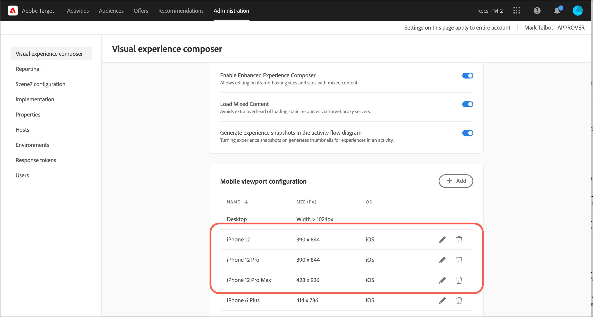
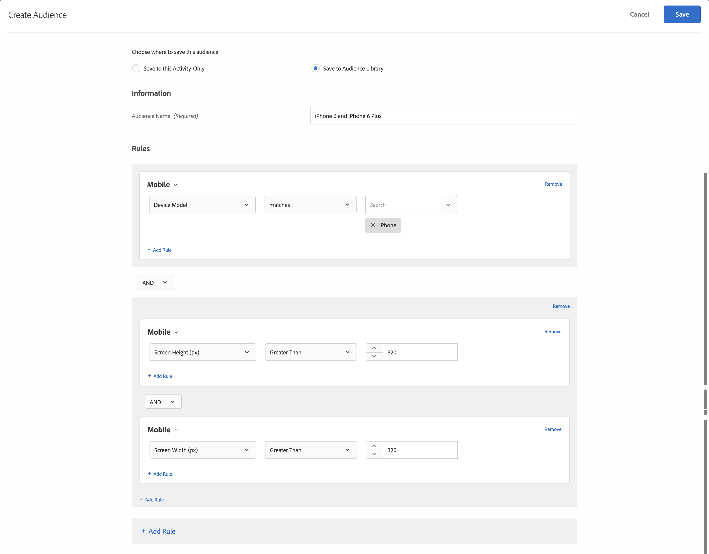

# Mobilvisningsrutor för responsiva upplevelser{#mobile-viewports-for-responsive-experiences}

Med mobilvisningsrutor kan du förhandsgranska hur dina [!DNL Target] aktiviteter visas på skärmar av olika storlek.

Förhandsvisningsfunktionen för mobilvisningsruta är utformad för responsiva webbplatser som återges bra på olika enheter, fönster och skärmstorlekar. Responsiva sajter justeras och anpassas automatiskt efter alla skärmstorlekar, inklusive stationära datorer, bärbara datorer, surfplattor och mobiltelefoner.

>[!NOTE]
>
> * Använd mobila visningsrutor om webbplatsen är responsiv och samma element på skrivbordssidan används på mobilsidan i en annan konfiguration. Om du har en separat mobilwebbplats med en separat struktur, till exempel `m.mysite.com`, ska du använda en [flersidig aktivitet](../../c-experiences/c-visual-experience-composer/multipage-activity.md#concept_277E096063E14813AC5D8EDFA1D2ED48) i stället.
   >
   >
* Mobila visningsrutor är inte tillgängliga om de överlappas av en övertäckning för omdirigeringserbjudanden.

En visningsruta definieras av storleken på rektangeln som fylls av en webbsida på skärmen. Det är storleken på webbläsarfönstret, minus rullningslister och verktygsfält. I webbläsare används&quot;CSS-pixlar&quot;. För många enheter, t.ex. enheter med retina-skärmar, är visningsrutan mindre än den annonserade enhetsupplösningen.

Nedan visas visningsrutor och upplösningar för vissa populära enheter. Kom ihåg att använda visningsrutans storlek i [!DNL Target]. På olika webbplatser visas visningsstorlekar för populära enheter. Se t.ex. [https://viewportsizer.com/devices/](https://viewportsizer.com/devices/) eller se enhetstillverkarens webbplats.

| Enhet | Storlek på visningsruta | Enhetsupplösning |
|---|---|---|
| iPhone SE | 375w x 667h | 750w x 1 334h |
| iPhone 11 Pro Max | 414w x 896h | 1242w x 2688h |
| iPhone 11 Xs max | 414w x 896h | 1242w x 2688h |
| iPhone 11 | 414w x 896h | 828w x 1792h |
| iPhone 11 Xr | 414w x 896h | 828w x 1792h |
| iPhone 11 Pro | 375w x 812h | 1125w x 2436h |
| iPhone 11 X | 375w x 812h | 1125w x 2436h |
| iPhone 11 Xs | 375w x 812h | 1125w x 2436h |
| iPhone X | 375w x 812h | 1125w x 2436h |
| iPhone 8 Plus | 414w x 736h | 1080w x 1920h |
| iPhone 8 | 375w x 667h | 750w x 1 334h |
| iPhone 7 Plus | 414w x 736h | 1080w x 1920h |
| iPhone 7 | 375w x 667h | 750w x 1 334h |
| iPhone 6s Plus | 414w x 736h | 1080w x 1920h |
| iPhone 6s | 375w x 667h | 750w x 1 334h |
| iPhone 6 Plus | 414w x 736h | 1080w x 1920h |
| iPhone 6 | 375w x 667h | 750w x 1 334h |
| iPad Pro | 1024w x 1366h | 2048w x 2732h |
| Tredje och fjärde generationen iPad | 768w x 1 024h | 1536w x 2048h |
| iPad Air 1 &amp; 2 | 768w x 1 024h | 1536w x 2048h |
| iPad Mini | 768w x 1 024h | 768w x 1 024h |
| iPad Mini 2 och 3 | 768w x 1 024h | 1536w x 2048h |
| Nexus 6P | 411w x 731h | 1440w x 2560h |
| Nexus 5X | 411w x 731h | 1080w x 1920h |
| Google Pixel | 411w x 731h | 1080w x 1920h |
| Google Pixel XL | 411w x 731h | 1440w x 2560h |
| Google Pixel 2 | 411w x 731h | 1080w x 1920h |
| Google Pixel 2 XL | 411w x 823h | 1440w x 2880h |
| Samsung Galaxy Note 5 | 480w x 853h | 1440w x 2560h |
| LG G G5 | 480w x 853h | 1440w x 2560h |
| Ett plus 3 | 480w x 853h | 1080w x 1920h |
| Samsung Galaxy S9 | 360w x 740h | 1440w x 2960h |
| Samsung Galaxy S9+ | 360w x 740h | 1440w x 2960h |
| Samsung Galaxy S8 | 360w x 740h | 1440w x 2960h |
| Samsung Galaxy S8+ | 360w x 740h | 1440w x 2960h |
| Samsung Galaxy S7 | 360w x 640h | 1440w x 2560h |
| Samsung Galaxy S7 Edge | 360w x 640h | 1440w x 2560h |
| Nexus 7 (2013) | 600w x 960h | 1200w x 1920h |
| Nexus 9 | 768w x 1 024h | 1536w x 2048h |
| Samsung Galaxy Tab 10 | 800w x 1280h | 800w x 1280h |
| Chromebook Pixel | 1280w x 850h | 2 560w x 1 700h |

Om du vill leverera en aktivitet till personer på en viss enhet väljer du lämplig målgrupp för den enheten i aktivitetsdiagrammet. Använd Mobile Web Composer för att redigera sidan i aktiviteten för den enheten. Om du vill köra en aktivitet i hela den digitala upplevelsen och försäkra dig om att den ser bra ut på alla enheter ska du inte använda målgruppsanpassning och använda mobila visningsrutor för att förhandsgranska aktiviteten på varje skärmstorlek.

Om du har en responsiv webbplats är webbplatsen vanligtvis utformad för att öppnas i en annan vy när den används av en enhet med en viss skärmstorlek. De skärmstorlekar som utlöser de nya vyerna kallas CSS-brytpunkter. CSS-brytpunkter är punkter där webbplatsinnehållet svarar beroende på enhetens bredd för att visa den optimala layouten för besökarna. CSS-brytpunkter kallas även [mediefrågor](https://developer.mozilla.org/en-US/docs/Web/CSS/Media_Queries/Using_media_queries).

Spara dina CSS-brytpunkter i så [!DNL Target] att du kan förhandsgranska upplevelserna för varje vy du definierar. Var och en av dessa upplevelser visas i en mobilvisningsruta i [!DNL Target] gränssnittet. Öppna vyn för varje skärmstorlek genom att klicka på visningsrutan längst upp på skärmen.

Om webbplatsen inte är responsiv kan du fortfarande använda Mobile Web Composer för att visa en webbplats om aktiviteten är avsedd för en viss enhet.

>[!IMPORTANT]
>
>Även om du kan redigera en upplevelse inifrån mobila visningsrutor gäller dessa ändringar alla visningsrutor och enheter, inte bara den visningsruta som du arbetar i. På samma sätt ändras sidan för alla skärmstorlekar, inte bara för skrivbordsvyn, när du redigerar en upplevelse i den normala skrivbordsvyn. För närvarande stöder vi inte ändringar av vyportsspecifika sidor.

## Konfiguration för mobilvisningsruta {#task_B4B161499DC0470584ED922A4D20FCAB}

Konfigurera de mobila visningsrutor som du vill göra tillgängliga när du skapar dina upplevelser.

1. Klicka på **[!UICONTROL Administration]** > **[!UICONTROL Visual Experience Composer]**.
1. Om du vill lägga till en ny mobilvisningsruta klickar du i **[!UICONTROL Mobile viewports configuration]** avsnittet **[!UICONTROL Add]**.

   

   Om du vill ändra konfigurationen för en befintlig mobilvisningsruta markerar du den visningsrutan och klickar sedan på [!UICONTROL Edit] (pennikonen).

1. Ange ett namn för mobilvisningsrutan.

   Ge mobilvisningsrutan ett beskrivande namn som är lätt att känna igen. Namnet kan innehålla upp till 36 tecken.

1. Ange den mobila enhetens skärmstorlek, både bredd och höjd.

   Bredden kan vara mellan 150 och 968 pixlar. Höjden kan vara mellan 150 och 1280 pixlar.

1. (Valfritt) Välj operativsystem för enheten.

   Alternativ:

   * Android
   * iOS
   * Windows
   * Symbian
   * Blackberry

   Om du använder [Förbättrad Experience Composer](../../c-experiences/experiences.md#section_34265986611B4AB8A0E4D6ACC25EF91D) och väljer ett operativsystem emuleras den enheten när du visar sidan [!DNL Target] . Om till exempel Android ser annorlunda ut och känns annorlunda än iOS på din responsiva webbplats liknar det beteendet. [!DNL Target]

1. Klicka på **[!UICONTROL Save]**.

## Skapa en responsiv upplevelse {#task_D6332438B5EE48CCA8AF199270F1CAEF}

Lägg in mobila visningsrutor i era aktiviteter för att skapa responsiva upplevelser för mobila skärmar. [!DNL Target]

1. Skapa [önskad aktivitet](/help/c-activities/activities.md).
1. I Visual Experience Composer klickar du på **[!UICONTROL Settings]** kugghjulsikonen och väljer sedan **[!UICONTROL Add Mobile Viewports]**.

   

1. Klicka på **[!UICONTROL Devices]** ikonen och aktivera sedan alla enheter som ska ha en mobil visningsruta.

   

   De mobila visningsrutorna listas från minsta till största enligt bredd.

1. Redigera mobilvyportarna efter behov.

   Alla ändringar du gör i upplevelsen (till exempel om du ändrar texten i en rubrik) används på upplevelsen på alla enheter.

   För musen över namnet på en visningsruta för att se visningsrutans storlek.

   

1. Om du vill kan du växla mellan stående och liggande läge genom att klicka på önskad orienteringsikon.

   

## Användningsfall: Använd två iPhone-versioner {#task_CC3144BF5BA54034996E1D3DB0BC1A35}

Det här användningsexemplet visar hur du konfigurerar upplevelser för två iPhone-versioner: iPhone 11 Pro Max och iPhone SE.

1. Klicka på Mål **[!UICONTROL Administration]**.
1. I **[!UICONTROL Mobile viewport configuration]** avsnittet skapar du mobila visningsrutor för iPhone 11 Pro Max och iPhone SE.

   Använd följande inställningar för varje visningsruta:

   | Namn | Bredd | Höjd | Operativsystem |
   |---|---|---|---|
   | iPhone 11 Pro Max | 414 | 896 | iOS |
   | iPhone SE | 375 | 667 | iOS |

   

1. Skapa en aktivitet med den upplevelse du vill rikta dig till.
1. Välj den upplevelse du vill rikta dig till besökare som kommer åt webbplatsen från en iPhone 11 Pro Max eller iPhone SE.
1. När du väljer mål klickar du på **[!UICONTROL Create Audience]** och konfigurerar sedan en målgrupp enligt bilden nedan:

   

   Eftersom telefonen kan roteras till liggande format och både höjd och bredd måste vara större än 320 samtidigt, skapas ett villkor som endast iPhone 11 Pro Max och iPhone SE kan uppfylla när de kombineras med iPhone-enhetsmodellen.
1. Klicka på **[!UICONTROL Save]**.
1. Fortsätt att konfigurera aktiviteten som vanligt.

## Utbildningsvideor

I följande videofilmer finns mer information om de begrepp som beskrivs i den här artikeln.

### Visuell Experience Composer (2 av 2) (7:29) 

I följande demovideo finns information om hur du använder Visual Experience Composer för att arbeta med mobila visningsrutor:

* Byta namn på och duplicera en upplevelse
* Skapa en omdirigeringsupplevelse
* Anpassa en aktivitet till en enskild URL-adress eller en grupp URL-adresser
* Skapa en flersidig aktivitet
* Förgranska och skapa upplevelser för responsiva webbplatser
* Använda övertäckningar för att markera typer av element

>[!VIDEO](https://video.tv.adobe.com/v/17401)

### Kontoinställningar i märket 

Den här videon innehåller information om hur du ställer in mobila visningsrutor, med början vid 4:40 i videon.

>[!VIDEO](https://video.tv.adobe.com/v/17379)