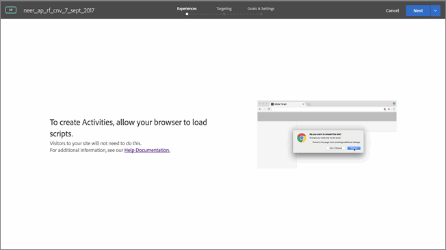

# Aktivera blandat innehåll i webbläsaren{#enabling-mixed-content-in-your-browser}

I vissa webbläsare blockeras visningen av en sida om säkert innehåll blandas med osäkert innehåll.

Om Visual Experience Composer (VEC) försöker öppna en sida som innehåller blandat (säkert och osäkert) innehåll visas ett meddelande som visar hur du inaktiverar blockering i webbläsaren så att du kan öppna en HTTP-webbplats eller en plats med blandade anrop (HTTPS och HTTP).

Tidigare kunde du utföra några åtgärder i steg 1 i det guidade arbetsflödet i tre steg när du skapade aktiviteter när blandat innehåll inte tilläts. Målet blockerar nu åtgärder i steg 1. När det här meddelandet visas måste du aktivera blandat innehåll innan du fortsätter.

Webbläsarens säkerhetsinställningar kan blockera blandat innehåll eller osäkert (HTTP) innehåll som läses in till en säker (HTTPS) sida eller ram (t.ex. VEC). Om du inte vill inaktivera säkerhetsinställningarna i webbläsaren måste du ha en HTTPS-webbplats.

Om webbplatsen körs på en osäker domän (HTTP) måste du tillåta VEC att läsa in aktivt blandat innehåll.

>[!NOTE]
>
>Om du tillåter blandat innehåll påverkas endast VEC och inte den aktiva webbplatsen.

Mer information finns i [Blandat innehåll](https://developer.mozilla.org/en-US/docs/Web/Security/Mixed_content) på webbplatsen *Mozilla Developer Network* (MDN).

## Aktivera blandat innehåll i Google Chrome {#task_FF297A08F66E47A588C14FD67C037B3A}

Om du besöker en webbplats via en säker anslutning kontrollerar Google Chrome att innehållet på webbsidan har överförts på ett säkert sätt.

Se [Den här sidan har osäkert innehåll](https://support.google.com/chrome/answer/1342714?hl=en) i hjälpen för Google Chrome.

### Utbildningsvideo: Aktivera VEC i Chrome version 79.0.3945.117 eller senare (Jan 2020) 

Om du använder VEC med den senaste versionen av Chrome (version 79.0.3945.117 eller senare) måste du uppdatera platsinställningarna. Besökare på webbplatsen behöver inte utföra dessa steg.

>[!VIDEO](https://www.youtube.com/v=6zGCi5Y8eVo)

I videon ovan beskrivs de steg som krävs:

1. Klicka på låsikonen eller varningsikonen och klicka sedan på Webbplatsinställningar.

   

1. Bläddra till osäkert innehåll och använd sedan listrutan för att ändra blockering (standard) till Tillåt.

   

1. Läs in VEC-sidan igen.

## Aktivera blandat innehåll i Mozilla Firefox {#task_5448763B8DC941FD80F84041AEF0A14D}

Som standard blockerar Firebox sidor som blandar säkert och osäkert innehåll. Du bör ändra den här inställningen permanent [!DNL Target].

1. I Firefox anger du `about:config` i adressfältet.
1. Bekräfta varningsmeddelandet som visas av Firefox.
1. Skriv i sökfältet `block_active`.
1. Dubbelklicka ` **[!UICONTROL security.mixed_content.block_active_content]**` .

   Värdet ändras från &quot;Sant&quot; till &quot;Falskt&quot;. När värdet visar &quot;Falskt&quot; är du klar.  Vi rekommenderar att du startar om datorn när du har ändrat den här inställningen.

## Aktivera blandat innehåll i Microsoft Internet Explorer {#task_59E7D13C04DF486C92CD78D0C63DDDE8}

Internet Explorer blockerar som standard sidor som blandar säkert och osäkert innehåll. Vi rekommenderar att du ändrar den här inställningen permanent till Target.

1. I Internet Explorer klickar du på inställningsikonen > **[!UICONTROL Internetalternativ]**.
1. Öppna fliken [!UICONTROL Säkerhet] .
1. Välj **[!UICONTROL Internet]** och klicka sedan på **[!UICONTROL Anpassad nivå]**.
1. Välj **[!UICONTROL Övrigt]**.
1. Under [!UICONTROL Övrigt]aktiverar du **[!UICONTROL Visa blandat innehåll]**.
1. Klicka på **[!UICONTROL OK]** > **[!UICONTROL Ja]** > **[!UICONTROL Använd]**.

Vi rekommenderar att du startar om datorn när du har ändrat den här inställningen.

