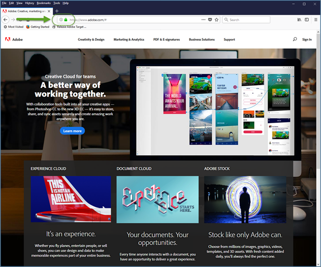

# Felsökning av problem relaterade till Förbättrad Experience Composer{#troubleshooting-issues-related-to-the-enhanced-experience-composer}

Visningsproblem kan ibland uppstå i Enhanced Experience Composer (EEC) under vissa förhållanden.

## EEG läser inte in en intern QA-URL som inte är tillgänglig på offentlig IP. (endast EEG) {#section_D29E96911D5C401889B5EACE267F13CF}

Detta kan åtgärdas genom att följande IP-adresser tillåts listas. De här IP-adresserna är till för Adobes server och används som proxy för Enhanced Experience Composer. De behövs bara för aktivitetsredigering. Besökare på platsen behöver inte dessa tillåtna IP-adresser

Be IT-avdelningen om tillåtelse att ange följande IP-adresser:

| Län | IP-adresser | Värdnamn |
|--- |--- |--- |
| Amerikas förenta stater | 52.55.99.45 | `us1-proxy.adobemc.com` |
| Europa, Mellanöstern och Afrika (EMEA) | 52.51.238.221 | `emea1-proxy.adobemc.com` |
| Asien-Stillahavsområdet (APAC) | 52.193.67.35 | `apac1-proxy.adobemc.com` |

Följande felmeddelande kan visas i Target:

`Error: Your website domain (ISP) is blocking the Enhanced Experience Composer. You can allowlist the Enhanced Experience Composer's IP addresses or turn off Enhanced Experience Composer in [!UICONTROL Configure] > [!UICONTROL Page Delivery] menu.`

Följande är orsaker till att du kan se det här felmeddelandet och åtgärda problemet:

* **Problem:** Din webbplatsdomän (ISP) blockerar Förbättrad Experience Composer.

   **Åtgärda:** Tillåt de IP-adresser som anges ovan.

* **Problem:** IP-adresserna är tillåtna, men din webbplats stöder inte TLS version 1.2. Målet använder för närvarande standardkonfigurationen 1.2. Före mål 18.4.1 (25 april 2018) hade standardkonfigurationen stöd för TLS 1.0. Mer information finns i [TLS (Transport Layer Security) Krypteringsändringar](../../../c-implementing-target/c-considerations-before-you-implement-target/tls-transport-layer-security-encryption.md#concept_CC1001E9D3AE4BABAF90B8311B0A6451).

   **Lösning:** Se följande fråga (Förbättrad Visual Experience Composer läses inte in på säkra sidor på min webbplats som använder TLS 1.2).

## EEC laddas inte på säkra sidor på min webbplats som använder TLS 1.0. (endast EEG) {#section_C5B31E3D32A844F68E5A8153BD17551F}

Du kan se felmeddelandet som beskrivs ovan i&quot;Den förbättrade Visual Experience Composer läses inte in på säkra sidor på min webbplats.&quot; om IP-adresserna ovan tillåts men din webbplats inte stöder TLS version 1.2. Målet använder för närvarande standardkonfigurationen 1.2. Före mål 18.4.1 (25 april 2018) hade standardkonfigurationen stöd för TLS 1.0. Mer information finns i [TLS (Transport Layer Security) Krypteringsändringar](../../../c-implementing-target/c-considerations-before-you-implement-target/tls-transport-layer-security-encryption.md#concept_CC1001E9D3AE4BABAF90B8311B0A6451).

Så här kontrollerar du TLS-versionen på din webbplats med Firefox (andra webbläsare har liknande steg):

1. Öppna den berörda webbplatsen i Firefox.
1. Klicka på **[!UICONTROL Show Site Information]** ikonen i webbläsarens adressfält.

   

1. Klicka på **[!UICONTROL Show Connection Details]** > **[!UICONTROL More Information]**.

   

1. Se TLS-versionsinformationen under Technical Details (Teknisk information):

   

1. Om du ser att TLS 1.0 visas på din webbplats kan du läsa [TLS (Transport Layer Security) Encryption Changes](../../../c-implementing-target/c-considerations-before-you-implement-target/tls-transport-layer-security-encryption.md#concept_CC1001E9D3AE4BABAF90B8311B0A6451) (Krypteringsändringarför transportskikt) om du vill ha information om TLS-stödsregler för mål. För att åtgärda detta (gäller till den 12 september 2018) ber vi dig kontakta [kundtjänst](../../../cmp-resources-and-contact-information.md#reference_ACA3391A00EF467B87930A450050077C) för att få hjälp med att konfigurera med din TLS-version och domänen.

## Jag ser timeout-fel eller&quot;åtkomst nekad&quot;-fel när webbplatser med proxy aktiverat läses in. (endast EEG) {#section_60CBB9022DC449F593606C0E6252302D}

Kontrollera att proxy-IP:n inte är blockerade i din miljö.
