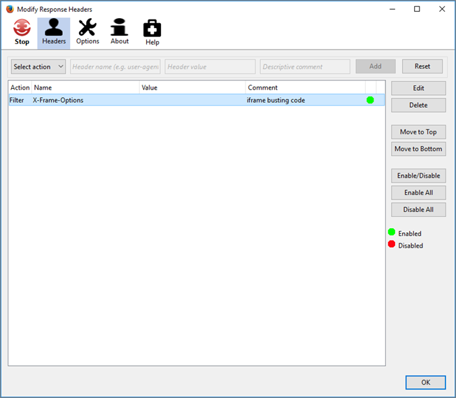

# Felsökning av problem relaterade till Visual Experience Composer{#troubleshooting-issues-related-to-the-visual-experience-composer}

Visningsproblem kan ibland uppstå i Visual Experience Composer (VEC) under vissa förhållanden.

## När jag öppnar min webbplats i Visual Experience Composer läses inte målbiblioteken in. (Endast VEC) {#section_8A7D3F4AD2CC4C3B823EE9432B97E06F}

Målet lägger till två parametrar (`mboxEdit=1` och `mboxDisable=1`) när webbplatsen öppnas i Visual Experience Composer.

Om webbplatsen (särskilt Single Page Apps) trimmar bort eller tar bort parametrar när du navigerar från en sida till en annan (utan att behöva läsa in en sida på nytt) så bryter Target-funktionen och Target-biblioteken läses inte in.
Undvik problemet genom att se till att du inte trimmar eller tar bort de här två parametrarna.

## Min sida öppnas inte i EEG eller laddas långsamt. Aktiviteter och upplevelser läses in långsamt i VEC. (Endast VEC) {#section_71E7601BE9894E3DA3A7FBBB72B6B0C1}

Flera problem kan påverka sidprestanda i Target Experience Composer. Några vanliga problem är:

* Det finns ingen mbox på sidan.
* Din webbplats använder proxyblockering, vilket innebär att sidan inte kan öppnas i någon av upplevelsedispositionerna.
* Din webbplats tillåter inte att den öppnas i en iFrame.

Om det uppstår problem i Förbättrad Experience Composer kan du prova att inaktivera Förbättrad Experience Composer och använda Visual Experience Composer i stället.

Om du vill inaktivera Förbättrad Experience Composer går du till **[!UICONTROL Administration]** > **[!UICONTROL Visual Experience Composer]** och inaktiverar alternativet **[!UICONTROL Enable Enhanced Experience Composer]**.

Följande felmeddelande visas för vissa användare i konsolen:

Om varken Visual Experience Composer eller Enhanced Experience Composer fungerar kan du använda ett webbläsartillägg som True (Chrome eller Firefox) eller Modify Response Headers (Firefox) som kan skriva över X-Frames-rubrikalternativen för din webbplats och tillåta att de läses in iFrames, vilket aktiverar VEC. Om du inte kan använda webbläsartillägg använder du Formulärdisposition.

>[!NOTE]
>
>Utöver följande information kan du använda webbläsartillägget [Adobe Target VEC Helper](/help/c-experiences/c-visual-experience-composer/r-troubleshoot-composer/vec-helper-browser-extension.md) för Google Chrome.

>[!NOTE]
>
>Dessa plugin-program bör endast användas i samband med VEC-redigering.
>
>För tillägget Begär bör du göra något av följande när du behöver ta bort sidhuvuden:
>
>* Lägg till URL-regler för den URL-adress som du vill öppna i VEC så att rubriker bara tas bort för dessa URL-adresser.
   >
   >
* Aktivera regeln när du redigerar i VEC och inaktivera regeln när du inte använder VEC.
>
>
För tillägget Ändra svarshuvud (Firefox) måste du göra följande eftersom du inte kan lägga till en URL-regel:
>
>* Aktivera regeln när du redigerar i VEC och inaktivera regeln när du inte använder VEC.

**Så här använder du tillägget för att begära i Chrome eller Firefox:**

1. Stäng av Förbättrad upplevelsedisposition.
1. Installera tillägget TrueBrowser i Chrome eller Firefox.
1. Öppna tillägget och konfigurera det med följande:
1. Välj **[!UICONTROL Modify headers]**.
1. Ange följande:

   * Regelnamn
   * Ändringsregler

      * Växla **[!UICONTROL Add]** till **[!UICONTROL Remove]**.
      * Växla **[!UICONTROL Request]** till **[!UICONTROL Response]**.
      * Ange&quot;X-Frame-Options&quot; som rubriknamn.
      * Upprepa föregående steg och ange&quot;x-frame-options&quot; som rubriknamn.

         >[!NOTE]
         >
         >Huvuden som manipuleras via Ärligt talat är skiftlägeskänsliga.

      * Ändra **[!UICONTROL Equals]** till **[!UICONTROL Contains]** som villkor för käll-URL:en och ange URL:en för aktiviteten som du försöker läsa in i VEC.

      

1. Klicka på **[!UICONTROL Save]**.

   

   Nu bör du kunna läsa in sidan snabbt med Visual Experience Composer.

**Så här använder du tillägget Ändra svarshuvuden i Firefox:**

1. Installera Ändra svarshuvuden i Firefox och starta om webbläsaren.
1. I Firefox-tilläggen väljer du tillägget Ändra svarshuvuden.
1. Klicka på **[!UICONTROL Preferences]**.
1. Välj **[!UICONTROL Filter]** i listrutan Åtgärd.
1. I fältet Rubriknamn anger du: **[!UICONTROL X-Frame-Options]**.
1. Upprepa steg 4 och 5 om du vill lägga till ett filter med **[!UICONTROL x-frame-options]**.
1. Klicka på **[!UICONTROL Add]**.
1. Klicka på **[!UICONTROL Start]**.

Öppna Target när du har konfigurerat ett tillägg. Dina sidor bör nu läsas in i Visual Experience Composer, även om Förbättrad Experience Composer är inaktiverat.

## Min sida visas inte i VEC (endast VEC) {#section_87B3BEA4B6174CFDA6C9A69A1A051FA1}

* Webbläsaren stöds inte.
* Webbläsaren blockerar en osäker sida på en säker webbplats.

   Klicka på ikonen till vänster om URL-adressen i webbläsarens adressfält och klicka på **[!UICONTROL Disable protection on this page]**
* Du angav en ogiltig URL.
* Du har inte angett någon standardwebbadress på sidan för kontoinställningar.

Kontrollera att den här inställningen är aktiverad och hämta sedan och uppdatera mbox.js på webbplatsen.

## VEC-värdet visas som brutet när jag använder bläddringsläge. (Endast VEC) {#section_FA2A18E8FD6A4274B2E395DBAA2FB407}

Om du använder bläddringsläget och har åtkomst till en URL som inte har target.js eller som innehåller ett frame-buster-huvud, visas visuella Experience Composer som brutna. På grund av säkerhetsproblem i webbläsaren kan inte Target komma åt den URL du navigerade till.
