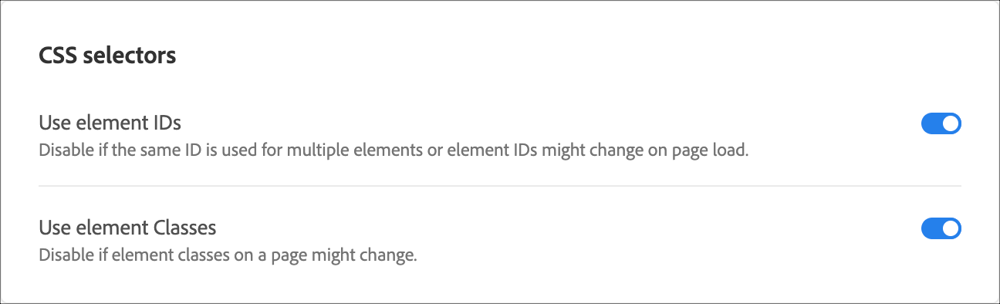

# Elementväljare som används i Visual Experience Composer{#element-selectors-used-in-the-visual-experience-composer}

En elementväljare är ett CSS-uttryck som kan identifiera ett eller flera element.

Grundläggande information om CSS-väljare finns i dokumentet [Väljare](https://developer.mozilla.org/en-US/docs/Web/Guide/CSS/Getting_started/Selectors) i Mozilla Developer Network (MDN).

Du kan ange om element-ID:n som klassas eller element-ID:n ska användas i dina kontoinställningar. Klicka **[!UICONTROL Setup > Preferences]** och välj sedan dina CSS-väljare.



>[!NOTE]
>
>Elementklasser är tillgängliga som väljare i A/B Test-, Automated Personalization- och Multivariate Test-aktiviteter.

Mer information om när du ska använda CSS-väljare och när du ska använda unika ID:n finns i [Visuell Experience Composer-metodtips och -begränsningar](../../c-experiences/c-visual-experience-composer/experience-composer-best-practices.md#concept_E284B3F704C04406B174D9050A2528A6).

## Så här genererar Adobe Target en väljare för ett element {#section_D89D954BCBFB486CA081BE183776A475}

Målet använder en enkel algoritm för att skapa en väljare. Här följer en kort beskrivning av genereringslogiken:

1. Om ett element till exempel har ett id `id="container"`är väljaren för elementet `#container`.

   Exempel:

   ```
   <div class="wrapper">
     <div id="container"> <!-- Selector is computed for this element -->
       <ul class="navigation">
         <li class="item active"> Home </li>
         <li class="item"> Men </li>
         <li class="item"> Women </li>
         <li class="item"> Kids </li>
       </ul>
     </div>
   </div>
   ```

1. Om ett element innehåller ett klassattribut försöker Target utnyttja den första klassen i alla klasser som finns i elementet.

   Målet försöker tolka det överordnade elementet tills det hittar `<HTML>` elementet eller ett element med ett id. När ett element innehåller ett id och väljaren beräknas på dess underordnade underordnade objekt, bidrar elementets id till väljaren.

   Exempel:

   ```
   <div class="wrapper">
     <div id="container"> <!-- id is present here. It contributes to selector -->
       <ul class="navigation">
         <li class="item active"> Home </li> <!-- Selector is computed for this element -->
         <li class="item"> Men </li>
         <li class="item"> Women </li>
         <li class="item"> Kids </li>
       </ul>
     </div>
   </div>
   ```

   I det här exemplet:

   Väljare: `#container` > `ul.navigation:eq(0)` > `li.item:eq(0)` (&quot; > &quot; anger det omedelbara underordnade objektet.)

   `eq` anger för indexet att det finns ett element som har &quot;tagName=UL&quot; och att den första klassen är `navigation`. Därför `index` är 0. Mer information finns i artikeln [Väljare](https://developer.mozilla.org/en-US/docs/Web/Guide/CSS/Getting_started/Selectors) i MDN.

1. Om ett element inte innehåller någon klass använder Target `tagName` för elementet och går uppåt i det överordnade elementet tills antingen `<HTML>` elementet eller ett element med ett id hittas.

   Exempel:

   ```
   <div class="wrapper">
     <div id="container"> <!-- id is present here. It contributes to selector -->
       <ul class="navigation">
         <li> Home </li>
         <li> Men </li>
         <li class="active"> Women </li>
         <li> Kids </li><!-- Selector is computed for this element -->
       </ul>
     </div>
   </div>
   ```

   Väljare: `#container` > `ul.navigation(0)` > `li:nth-of-type(4)`

   Du kan läsa mer om [den n:te typen på webbsidan](https://css-tricks.com/almanac/selectors/n/nth-of-type/)CSS Tricks.

I ovanstående process:

* Du kan använda valfri CSS-väljare så länge den unikt identifierar ett element i DOM.
* Metoden ovan används av Target. Målet tillåter inte att du använder det här tillvägagångssättet. Du kan lägga till valfri väljare förutsatt att punkt 1 är sann.
* Du kan använda valfritt attribut i väljaren. I det här dokumentet används endast klassnamn som exempel.

