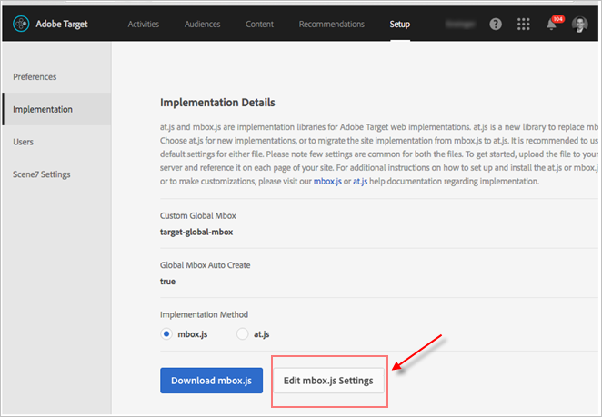
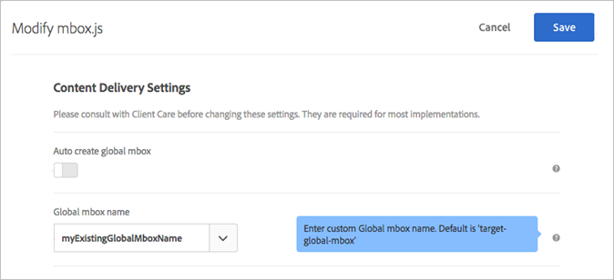

# Anpassa en global mbox{#customize-a-global-mbox}

Information som hjälper dig att anpassa en global mbox för både at.js och mbox.js.

1. Redigera mbox.js.

   Gå till **[!UICONTROL Target]** > **[!UICONTROL Setup]** > **[!UICONTROL Implementation]**.

   * För mbox.js, klicka **[!UICONTROL Edit mbox.js Settings]**.
   * Välj [!DNL at.js]under Implementeringsmetod **[!UICONTROL at.js]** och klicka sedan på **[!UICONTROL Edit mbox.js Settings]**.
   

1. Redigera [!DNL mbox.js] eller [!DNL at.js].

   Inaktivera **[!UICONTROL Auto create global mbox]** och lägg sedan till namnet på den anpassade globala mbox som du vill använda för att leverera aktiviteter från [!DNL Target Standard/Premium]. Den här anpassade globala rutan används även för klickspårning.

   

   Klicka **[!UICONTROL Save]** när du är klar.
1. Implementera [!DNL mbox.js] eller [!DNL at.js] biblioteket på din webbplats.

* Mer information om mbox.js finns i Implementering av [Mbox.js](../../../../c-implementing-target/c-implementing-target-for-client-side-web/t-mbox-download/mbox-download.md#task_4EAE26BB84FD4E1D858F411AEDF4B420).
* Mer information om at.js finns [i implementeringen](../../../../c-implementing-target/c-implementing-target-for-client-side-web/t-mbox-download/c-target-atjs-implementation/target-atjs-implementation.md#concept_8AC8D169E02944B1A547A0CAD97EAC17)av at.js.

1. Tid för övergången med din release.

   Så fort du är redo [!DNL Target Standard/Premium] att börja använda din globala mbox för alla aktiviteter framåt kan du fortsätta med det här steget.

   Uppdatera namnet på den anpassade globala mbox så att det matchar namnet som används i steg 2 ovan.

   

   >[!IMPORTANT]
   >
   >När du sparar synkroniseras alla aktiviteter på ditt konto med den här rutan. Om den här rutan inte finns på din webbplats kommer alla aktiviteter att sluta fungera.

   Klicka på **[!UICONTROL Save]**.
