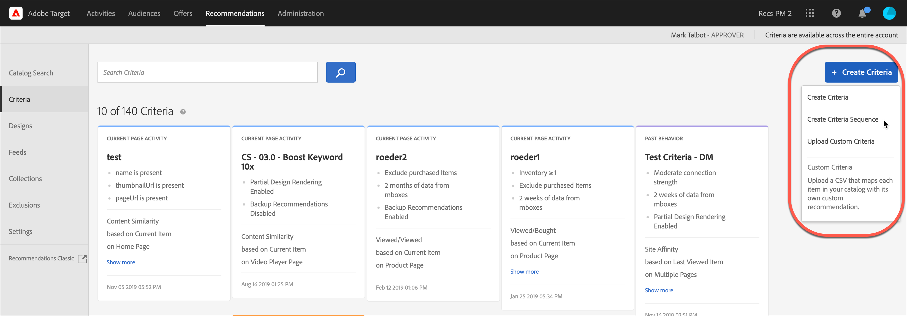

#  Skapa villkorssekvenser

Använd sekvenser med upp till fem kriterier för att få bättre kontroll över de objekt som visas i dina [!UICONTROL Recommendations] aktiviteter.

>[!NOTE]
>
>Villkorssekvenser kan inte användas med [!UICONTROL Recommendations] aktiviteter som skapats före oktober 2016-versionen av [!DNL Target Premium].

Om du vill skapa en villkorssekvens måste du först skapa de villkor som du vill inkludera i sekvensen. Mer information finns i [Skapa villkor](/help/c-recommendations/c-algorithms/create-new-algorithm.md) .

Genom att använda en villkorssekvens kan du ange ytterligare riktade rekommendationer, i stället för att använda mer allmänna rekommendationer för säkerhetskopiering, när ett villkor inte returnerar tillräckligt många resultat för att fylla din design. Vanligtvis går en villkorssekvens från mer specifik målgruppsanpassning, som kan returnera färre resultat, till mer allmän målgruppsanpassning, som vanligtvis ger fler resultat.

Dina villkorssekvenser kan variera i ordning beroende på sidtypen, vilket visas i följande exempel:

| Sidtyp | Möjlig sekvensordning |
| --- | --- |
| Produktsida | <ol><li>Baserat på aktuellt objekt, från samma varumärke</li><li>Baserat på aktuellt objekt, från alla varumärken</li><li>Baserat på innehållets likhet</li><li>Baserat på de främsta säljarna</li><li>Baserat på de mest visade objekten på webbplatsen</li></ol> |
| Startsida | <ol><li>Baserat på besökarens senaste köp </li><li>Baserat på besökarens favoritobjekt</li><li>Baserat på besökarens favoritkategori</li><li>Baserat på de främsta säljarna</li><li>Baserat på de mest visade sidorna på webbplatsen</li></ol> |

## Öppna skärmen Skapa villkorssekvens

Det finns flera sätt att nå [!UICONTROL Create Criteria Sequence] skärmen. Vissa skärmalternativ varierar beroende på hur du kommer till skärmen.

* På skärmen **[!UICONTROL Recommendations]** > **[!UICONTROL Criteria]** bibliotek klickar du **[!UICONTROL Create Criteria]** > **[!UICONTROL Create Criteria Sequence]**. Kriterierna som du skapar här blir automatiskt tillgängliga för alla [!UICONTROL Recommendations] aktiviteter.
* När du skapar en [!UICONTROL Recommendations] aktivitet går du till skärmen Välj villkor och klickar på **[!UICONTROL Create New]** > **[!UICONTROL Create Criteria Sequence]**. Du kan spara den nya villkorssekvensen och använda den med andra [!UICONTROL Recommendations] aktiviteter.
* När du redigerar en [!UICONTROL Recommendations] aktivitet klickar du i en [!UICONTROL Recommendations Location] ruta på sidan och väljer sedan **[!UICONTROL Change Criteria]**. På [!UICONTROL Select Criteria] skärmen klickar du **[!UICONTROL Create New]** > **[!UICONTROL Create Criteria Sequence]**. Du kan spara dina nya villkor och använda dem med andra [!UICONTROL Recommendations] aktiviteter.

Följande steg förutsätter att du kommer åt [!UICONTROL Create Criteria Sequence] skärmen med den första metoden: på **[!UICONTROL Recommendations]** > **[!UICONTROL Criteria]** biblioteksskärmen.

1. Klicka på **[!UICONTROL Recommendations]** > **[!UICONTROL Criteria]**.

1. Klicka på **[!UICONTROL Create Criteria]** > **[!UICONTROL Create Criteria Sequence]**.

   

## Fyll i informationsavsnittet

1. Skriv ett **[!UICONTROL Name]** för sekvensen.

   Det här är det&quot;interna&quot; namnet som används för att beskriva villkorssekvensen. Besökare på platsen kommer inte att se det här namnet.

   

1. Skriv in en offentlig sida **[!UICONTROL Generic Display Title]** som ska visas på sidan om flera villkor i sekvensen används för att fylla i [!UICONTROL Recommendations] designen.

   Du kanske vill ersätta&quot;Kunder som tittade på det här även visade..&quot;. med&quot;Recommended for You&quot; om designen kan innehålla objekt som baseras på mer än en [!UICONTROL Recommendations] nyckel.

1. Ange en kort **[!UICONTROL Description]** av villkorssekvensen.

   Beskrivningen bör hjälpa dig att identifiera villkorssekvensen och kan innehålla information om dess syfte.

1. Välj en **[!UICONTROL Industry Vertical]**.

   Standardbranschens lodräta  version visas automatiskt.

1. Välj en **[!UICONTROL Page Type]**.

   Du kan välja flera sidtyper.

   Tillsammans används de vertikala metoderna och sidtyperna i branschen för att kategorisera de sparade villkorssekvenserna, vilket gör det enklare att återanvända sekvenser för andra [!UICONTROL Recommendations] aktiviteter.

## Skapa sekvens {#sequence}

Sekvensordningen definierar i vilken ordning en design fylls. Om Villkor 1 inte har tillräckligt många rekommendationer för att fylla din design fylls de återstående platserna med villkor 2 och så vidare.

1. Klicka i **[!UICONTROL Criteria Sequence]** avsnittet **[!UICONTROL Add Criteria]**.

   

1. Välj ett villkor på [!UICONTROL Select Criteria] skärmen.

   Du kan använda sökrutan och listrutorna för filter för att hitta önskat villkor.

   

1. Klicka på **[!UICONTROL Add]**.

1. (Valfritt) Skjut **[!UICONTROL Limit the number of items returned]** växlingsknappen till&quot;på&quot;-positionen och ange sedan antalet objekt (mellan 1 och 50).

   

   Du kan förstå värdet av [!UICONTROL Limit the number of items returned] alternativet på följande sätt:

   * **Användningsfall 1**: Du vill ha en blandning av olika typer av objekt i ett enda rekommendationsfack. Du kan till exempel visa en blandning av ytterkläder (schaket) och överdelar (skjortor, T-shirts). För att uppnå detta ska du använda en samling för aktiviteten som innehåller alla möjliga produkttyper du vill ha i platserna i designen. Ange sedan dina första kriterier med ett statiskt filter som begränsar kriterierna så att de bara omfattar ytterkläder, och ange dina andra kriterier med ett statiskt filter som begränsar kriterierna så att de bara omfattar toppar. Lägg slutligen till båda villkoren i en villkorssekvens och begränsa det första villkoret till 2 kortplatser.

      Rekommendationsfältet kan se ut så här på din webbplats:

      

   * **Användningsfall 2**: Du vill ha en blandning av både alternativa objekt och kompletterande objekt. Ange ett villkor för att använda en visad/visad algoritm och använd ett dynamiskt filter som begränsar de rekommenderade objekten till det aktuella objektets kategori. Ställ in det andra villkoret för att använda en visad/köpt algoritm och använd ett dynamiskt filter som endast innehåller rekommenderade objekt som inte matchar det aktuella objektets kategori. Lägg slutligen till båda villkoren i en sekvens och begränsa det första villkoret till två kortplatser.

1. Fortsätt lägga till ytterligare villkor i sekvensen. Du kan lägga till upp till fem villkor i en sekvens.

## Ange innehåll för säkerhetskopiering

Välj vilket innehåll som returneras när det inte finns tillräckligt med rekommendationer för att fylla designmallen.

När du skapar en villkorssekvens ignoreras rekommendationer för säkerhetskopiering och partiella designåtergivningsinställningar för de enskilda villkoren som utgör sekvensen. Om du vill använda rekommendationer för säkerhetskopiering och partiell designåtergivning måste du aktivera dem för sekvensen. Välj lämpliga reglage. Om du väljer att tillåta rekommendationer för säkerhetskopiering kan du också välja om inkluderingsregler ska tillämpas på säkerhetskopiorna.

1. (Valfritt) Skjut **[!UICONTROL Partial Design Rendering]** växlingsknappen till&quot;på&quot;-positionen.

   Så många kortplatser som möjligt kommer att fyllas, men designmallen kan innehålla tomt utrymme för återstående kortplatser.

1. (Valfritt) Segmentera **[!UICONTROL Backup Recommendations]** växlingen till&quot;på&quot;-positionen.

   Fyll eventuella återstående tomma platser i designen med ett slumpmässigt urval av de mest visade produkterna från hela webbplatsen.

   Mer information finns i [Använda en rekommendation](/help/c-recommendations/c-algorithms/backup-recs.md)för säkerhetskopiering.

1. (Villkorligt) Om du valde **[!UICONTROL Backup Recommendations]** i föregående steg kan du markera **[!UICONTROL Apply inclusion rules to backup recommendations]**.

   Mer information finns i [Använda dynamiska och statiska inkluderingsregler](/help/c-recommendations/c-algorithms/use-dynamic-and-static-inclusion-rules.md).

1. Klicka på **[!UICONTROL Save]**.

   Villkorssekvensen visas i kriterielistan.

   Mer information om alternativ för rekommendationslogik finns i [Kriterier](../../c-recommendations/c-algorithms/algorithms.md#concept_4BD01DC437F543C0A13621C93A302750).

## Utbildningsvideo: Skapa villkor i Recommendations (12:33) 

Den här videon innehåller följande information:

* Skapa villkor
* Skapa villkorssekvenser
* Överför anpassade villkor

>[!VIDEO](https://video.tv.adobe.com/v/27694?quality=12)
