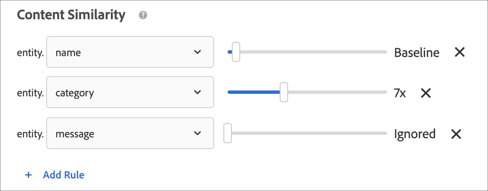

#  Skapa villkor{#create-criteria}

Kriterierna styr innehållet i dina [!UICONTROL Recommendations] aktiviteter. Skapa villkor för att visa de rekommendationer som passar bäst för din aktivitet.

## Skapa nya villkor

I följande avsnitt beskrivs hur du skapar nya villkor.

### Öppna skärmen Skapa nya villkor

Det finns flera sätt att nå [!UICONTROL Create New Criteria] skärmen. Vissa skärmalternativ varierar beroende på hur du kommer till skärmen.

* På skärmen **[!UICONTROL Recommendations]** > **[!UICONTROL Criteria]** bibliotek klickar du **[!UICONTROL Create Criteria]** > **[!UICONTROL Create Criteria]**. Kriterierna som du skapar här blir automatiskt tillgängliga för alla [!DNL Recommendations] aktiviteter.
* När du skapar en [!DNL Recommendations] aktivitet klickar du **[!UICONTROL Create Criteria]** på [!UICONTROL Select Criteria] skärmen. Du kan spara dina nya villkor och använda dem med andra [!DNL Recommendations] aktiviteter.
* När du redigerar en [!DNL Recommendations] aktivitet klickar du i en [!UICONTROL Recommendations Location] ruta på sidan och väljer **[!UICONTROL Change Criteria]**. Klicka på på [!UICONTROL Select Criteria] skärmen **[!UICONTROL Create Criteria]**. Du kan spara dina nya villkor och använda dem med andra [!DNL Recommendations] aktiviteter.

Följande steg förutsätter att du kommer åt [!UICONTROL Create New Criteria] skärmen med den första metoden: på **[!UICONTROL Recommendations]** > **[!UICONTROL Criteria]** biblioteksskärmen.

1. Klicka på **[!UICONTROL Recommendations]** > **[!UICONTROL Criteria]**.

1. Klicka på **[!UICONTROL Create Criteria]** > **[!UICONTROL Create Criteria]**.

   

### Fyll i avsnittet Grundläggande information {#info}

1. Skriv ett **[!UICONTROL Criteria Name]**.

   Detta är det&quot;interna&quot; namnet som används för att beskriva kriterierna. Du kanske vill kalla villkoren för&quot;Produkter med högsta marginal&quot;, men du vill inte att den titeln ska visas offentligt. Se nästa steg för att ange den offentliga titeln.

   

1. Skriv en offentlig sida **[!UICONTROL Display Title]** som ska visas på sidan för rekommendationer som använder det här villkoret.

   Du kan till exempel visa&quot;Personer som visade det här&quot; eller&quot;Liknande produkter&quot; när du använder det här villkoret för att visa rekommendationer.

1. Ange en kort **[!UICONTROL Description]** av villkoren.

   Beskrivningen bör hjälpa dig att identifiera villkoren och kan innehålla information om syftet med kriterierna.

1. Välj en **[!UICONTROL Industry Vertical]**:

   * [!UICONTROL Retail/Ecommerce]
   * [!UICONTROL Lead Generation/B2B/Financial Services]
   * [!UICONTROL Media/Publishing]

   Andra kriteriealternativ ändras beroende på vilken vertikal du väljer.

1. Välj en **[!UICONTROL Page Type]**.

   Du kan välja flera sidtyper.

   Tillsammans används de vertikala metoderna och sidtyperna för att kategorisera de sparade villkoren, vilket gör det enklare att återanvända villkor för andra [!DNL Recommendations] aktiviteter.

1. Välj en **[!UICONTROL Recommendation Key]**.

   Mer information om att basera villkor på en nyckel finns i [Basera rekommendationen på en rekommendationsnyckel](#task_2B0ED54AFBF64C56916B6E1F4DC0DC3B).

1. Markera **[!UICONTROL Recommendation Logic]**.

   Mer information om alternativ för rekommendationslogik finns i [Kriterier](../../c-recommendations/c-algorithms/algorithms.md).

   >[!NOTE]
   >
   >Om du väljer **[!UICONTROL Items]**/ **[!UICONTROL Media with Similar Attributes]** kan du ange regler för [innehållets likhet](#similarity).

### Ange alternativ för datakälla

1. Ange **[!UICONTROL Data Range]** för att bestämma tidsintervallet för tillgängliga historiska användarbeteendedata som ska användas när du avgör vilka rekommendationer som ska visas.

   

   Om det finns mycket trafik och beteenden på platsen ändras ofta väljer du ett kortare datafönster. Ett kortare fönster gör [!DNL Recommendations] att ni kan reagera bättre på förändringar på marknaden och i er verksamhet. Ett kortare fönster innebär till exempel att besökarnas beteendeförändringar [!DNL Recommendations] upptäcks när besökarna börjar handla säsongsenligt, till exempel köp på skolstarten eller jul, och att man rekommenderar artiklar som passar dessa shoppingsäsonger.

   Om du inte har så mycket data eller besökarbeteendet inte ändras så ofta kan du välja ett längre fönster. För många webbplatser ger dock ett kortare fönster bättre rekommendationer.

   De tillgängliga dataintervallen är:

   * Två dagar
   * En vecka
   * Två veckor
   * En månad
   * Två månader

1. (Villkorligt) Markera önskat **[!UICONTROL Behavioral Data Source]**: [!UICONTROL mboxes] eller [!UICONTROL Analytics].

   >[!NOTE]
   >
   >Avsnittet visas bara om implementeringen använder [!UICONTROL Behavioral Data Source] Analytics for Target  (A4T).

   

   Välj önskad rapportsvit om du väljer [!UICONTROL Analytics]det.

   Om villkoren använder [!DNL Adobe Analytics] som beteendedatakälla beror tiden för kriteriernas tillgänglighet på om den valda rapportsviten och uppslagsfönstret har använts för andra villkor, vilket förklaras nedan:

   * **Installation** av engångsrapportsviter: Första gången en rapportsvit används med ett visst fönster för sökning efter dataintervall kan det [!DNL Target Recommendations] ta mellan två och sju dagar att helt hämta beteendedata för den valda rapportsviten från [!DNL Analytics]. Den här tidsramen beror på [!DNL Analytics] systeminläsningen.
   * **Nya eller redigerade villkor med hjälp av ett rapportpaket** som redan är tillgängligt: När du skapar ett nytt villkor eller redigerar ett befintligt villkor, och om den valda rapportsviten redan har använts med [!DNL Target Recommendations]ett dataintervall som är lika med eller mindre än det valda dataområdet, blir data omedelbart tillgängliga och ingen engångsinställning krävs. I det här fallet, eller om en algoritms inställningar redigeras utan att den valda rapportsviten eller dataintervallet ändras, körs eller körs om inom 12 timmar.
   * **Pågående algoritmkörningar**: Data flödar från [!DNL Analytics] till [!DNL Target Recommendations] dag. Om en användare till exempel tittar på en produkt skickas ett spårningsanrop för produktvyn till den [!UICONTROL Viewed Affinity] här rekommendationen i [!DNL Analytics] nära realtid. Data [!DNL Analytics] skickas till [!DNL Target] tidigt nästa dag och [!DNL Target] kör algoritmen på mindre än 12 timmar.

   Mer information finns i [Använda Adobe Analytics med Target Recommendations](/help/c-recommendations/c-algorithms/use-adobe-analytics-with-recommendations.md).

### Ange innehållsinställningar {#content}

Innehållsreglerna avgör vad som händer om antalet rekommenderade objekt inte fyller din design. Det är möjligt att Recommendations-kriterier returnerar färre rekommendationer än din design kräver. Om din design t.ex. har plats för fem objekt, men dina villkor bara leder till att tre objekt rekommenderas, kan du lämna det återstående utrymmet tomt eller använda rekommendationer för säkerhetskopiering för att fylla det extra utrymmet.

1. (Valfritt) Skjut **[!UICONTROL Partial Design Rendering]** växlingsknappen till&quot;på&quot;-positionen.

   Så många kortplatser som möjligt kommer att fyllas, men designmallen kan innehålla tomt utrymme för återstående kortplatser.

1. (Valfritt) Skjut **[!UICONTROL Show Backup Recommendations]** växlingsknappen till&quot;på&quot;-positionen.

   Fyll eventuella återstående tomma platser i designen med ett slumpmässigt urval av de mest visade produkterna från hela webbplatsen.

   Mer information finns i [Använda en rekommendation](/help/c-recommendations/c-algorithms/backup-recs.md)för säkerhetskopiering.

1. (Villkorligt) Om du valde **[!UICONTROL Show Backup Recommendations]** i föregående steg kan du aktivera **[!UICONTROL Apply inclusion rules to backup recommendations]**.

   Inkluderingsregler avgör vilka objekt som ska inkluderas i dina rekommendationer. Vilka alternativ som är tillgängliga beror på var du arbetar vertikalt.

   Mer information finns i [Ange inkluderingsregler](#inclusion) nedan.

1. (Valfritt) Skjut **[!UICONTROL Recommend Previously Purchased Items]** växlingsknappen till&quot;på&quot;-positionen.

   Den här inställningen baseras på `productPurchasedId`. Standardbeteendet är att inte rekommendera tidigare inköpta artiklar. I de flesta fall vill du inte marknadsföra artiklar som en kund nyligen har köpt. Det är användbart om du säljer artiklar som normalt bara köps en gång, t.ex. kajaker. Om du säljer artiklar som personer återkommer till att köpa igen upprepade gånger, som schampo eller andra personliga artiklar, bör du aktivera det här alternativet.

I följande matris visas det resultat du får se när du använder alternativen [!UICONTROL Partial Design Rendering] och [!UICONTROL Backup Recommendations] :

| Delvis designåtergivning | Säkerhetskopiera Recommendations | Resultat |
|--- |--- |--- |
| Handikappade | Handikappade | Om färre rekommendationer returneras än vad designen kräver ersätts rekommendationsdesignen med standardinnehåll och inga rekommendationer visas. |
| Aktiverad | Handikappade | Designen återges, men kan innehålla tomt utrymme om färre rekommendationer returneras än vad designanropen kräver. |
| Aktiverad | Aktiverad | Rekommendationer för säkerhetskopiering fyller i tillgängliga designfack och återger designen helt. Om inkluderingsregler tillämpas på rekommendationer för säkerhetskopiering, begränsas antalet kvalificerade rekommendationer för säkerhetskopiering till den punkt där designen inte kan fyllas, återges designen delvis. Om villkoret inte returnerar några rekommendationer, och inkluderingsreglerna begränsar rekommendationerna för säkerhetskopiering till noll, ersätts designen med standardinnehåll. |
| Handikappade | Aktiverad | Rekommendationer för säkerhetskopiering fyller i tillgängliga designfack och återger designen helt. Om inkluderingsregler tillämpas på rekommendationer för säkerhetskopiering, begränsas antalet kvalificerade rekommendationer för säkerhetskopiering till den punkt där designen inte kan fyllas, ersätts designen med standardinnehåll och inga rekommendationer visas. |

### Ange likhetsregler för innehåll {#similarity}

Använd [!UICONTROL Content Similarity] regler för att göra rekommendationer baserat på objekt- eller medieattribut.

>[!NOTE]
>
>Om du valde **[!UICONTROL Items]**/ **[!UICONTROL Media with Similar Attributes]** som [rekommendationslogik](#info)kan du ange regler för innehållets likhet.

Innehållslikhet jämför nyckelord för objektattribut och gör rekommendationer baserat på hur många nyckelord olika objekt har gemensamt. Recommendations baserat på innehållets likhet kräver inte tidigare data för att ge ett starkt resultat.

Att använda innehållets likhet för att generera rekommendationer är särskilt effektivt för nya objekt, som troligen inte kommer att visas i rekommendationer med *Personer som har tittat på det här, som har tittat på det* och annan logik som baseras på tidigare beteende. Ni kan också använda innehållets likhet för att generera användbara rekommendationer för nya besökare som inte har några tidigare inköp eller andra historiska data.

När du väljer **[!UICONTROL Items]**/ **[!UICONTROL Media with Similar Attributes]** kan du skapa regler som ökar eller minskar vikten av specifika objektattribut när du fastställer rekommendationer. För t.ex. böcker kanske du vill öka vikten av attribut som *genre*, *författare*, *serie* och så vidare, för att rekommendera liknande böcker.

Eftersom innehållets likhet använder nyckelord för att jämföra objekt, kan vissa attribut, som *meddelande* eller *beskrivning*, infoga&quot;brus&quot; i jämförelsen. Du kan skapa regler för att ignorera dessa attribut.

Som standard är alla attribut inställda på *Baslinje*. Du behöver inte skapa en regel om du inte vill ändra den här inställningen.

>[!NOTE]
>
>Algoritmen för innehållets likhet kan använda slumpmässig sampling för att beräkna likhet mellan objekt. Därför kan likhetsgraderingar mellan objekt variera mellan olika algoritmkörningar.

### Ange inkluderingsregler {#inclusion}

Det finns flera alternativ som du kan använda för att begränsa de objekt som visas i dina rekommendationer. Du kan använda inkluderingsregler när du skapar villkor eller kampanjer.

Inkluderingsregler är frivilliga. Men om du ställer in dessa uppgifter får du bättre kontroll över vilka objekt som visas i dina rekommendationer. Varje detalj som du konfigurerar förminskar visningsvillkoren ytterligare.

Du kan t.ex. välja att bara visa damskor som har en inventering på mer än 50 och ett pris mellan 25 och 45 dollar. Du kan också väga varje attribut så att de objekt som är viktigast för ditt företag visas med största sannolikhet.

Som ett annat exempel kan du välja att visa nya jobb för besökare som besöker webbplatsen endast från vissa städer och som har rätt högskoleutbildning.

Inkluderingsregelalternativen varierar beroende på bransch-vertikal. Som standard tillämpas inkluderingsregler på rekommendationer för säkerhetskopiering.

>[!IMPORTANT]
>
>Du bör använda inkluderingsregler med försiktighet. De är användbara om er organisation till exempel har regler som kräver att ett varumärke inte rekommenderas medan ett annat varumärke visas. Men den här funktionen kostar en möjlighet. Du kan förlora en procentandel av en ökning genom att begränsa vissa objekt från att inte visas när de normalt visas av aktivitetskriterierna.

Inkluderingsreglerna kombineras med en AND. Alla regler måste uppfyllas för att ett objekt ska kunna inkluderas i en rekommendation.

Så här skapar du en enkel inkluderingsregel, som tidigare nämnts, som endast visar damskor som har en inventering på mer än 50 och ett pris på mellan 25 och 45 dollar:

1. Ange ett prisintervall för de produkter som du vill rekommendera.
1. Ange det minsta lagerbeloppet för de produkter som du vill rekommendera.
1. Konfigurera rekommendationen så att endast objekt visas när de uppfyller vissa villkor.

   

   Du kan ange att objekt bara ska inkluderas när ett av attributen i listan uppfyller eller inte matchar ett eller flera angivna villkor.

   Vilka utvärderare som är tillgängliga beror på vilket värde du väljer i den första listrutan. Du kan lista flera objekt. Dessa objekt utvärderas med OR.

   Flera regler kombineras med en AND.

   >[!NOTE]
   >
   >Det här alternativet begränsar de objekt som visas i rekommendationen. Det påverkar inte vilka sidor som rekommendationen visas på. Om du vill begränsa var rekommendationen visas markerar du sidorna i upplevelsedispositionen.

Mer information finns i [Använda dynamiska och statiska inkluderingsregler](/help/c-recommendations/c-algorithms/use-dynamic-and-static-inclusion-rules.md).

### Ange attributvikt

Du kan lägga till flera regler för att&quot;knuffa&quot; algoritmen baserat på viktig beskrivning eller metadata om innehållskatalogen så att vissa objekt lättare visas.

Du kan t.ex. använda en högre viktning på artiklar som säljs så att de visas oftare i rekommendationen. Icke-försäljningsposter exkluderas inte helt, men de verkar mindre ofta. Flera viktade attribut kan tillämpas på samma algoritm och de viktade attributen kan testas på delad trafik i rekommendationen.

1. Välj ett värde.

   Värdet avgör vilken typ av objekt som troligen visas, baserat på ett av flera tillgängliga villkor.

1. Välj en utvärderare.

1. Skriv nyckelordet för att slutföra regelattributen.

   Den fullständiga regeln kan till exempel vara &quot;Kategori innehåller delsträngsskor&quot;.

   

1. Välj den vikt som ska tilldelas regeln.

   Alternativen varierar från 0 till 100 i steg om 25.

1. Lägg till ytterligare regler om du vill.

När du är klar klickar du på **[!UICONTROL Save]**.

Om du skapar en ny [!UICONTROL Recommendations] aktivitet eller redigerar en befintlig, är **[!UICONTROL Save criteria for later]** kryssrutan markerad som standard. Om du inte vill använda villkoren i andra aktiviteter avmarkerar du kryssrutan innan du sparar.

## Basera rekommendationen på en rekommendationsnyckel {#task_2B0ED54AFBF64C56916B6E1F4DC0DC3B}

Recommendations baserat på tangenter använder besökarbeteendekontext för att visa relevanta resultat.

Det finns två typer av Recommendations:

* **Popularitet:** Visar objekt enligt Mest visade, Mest sålda och Mät upp. Nyckeln är tom för popularitetskriterier.
* **Nyckelbaserad:** Innefattar resten av kriterierna. Recommendations erbjuder en mängd olika alternativ när det gäller nyckeltypen. Alternativen varierar från&quot;aktuellt objekt&quot; till&quot;profilparametrar&quot;, vilket gör att du kan ställa in nyckelvärdena för programmering att rekommendera. Du kan testa flera villkor mot varandra genom att basera varje villkor på en annan nyckel.

Varje villkor definieras på en egen flik. Trafiken fördelas jämnt mellan olika kriterietester. Med andra ord, om du har två kriterier, delas trafiken lika mellan dem. Om du har två kriterier och två designer, delas trafiken jämnt mellan de fyra kombinationerna. Du kan också ange en procentandel besökare som ser standardinnehållet för jämförelse. I så fall ser den angivna procentandelen besökare standardinnehållet och resten delas mellan dina kriterier och designkombinationer.

1. Skapa en ny rekommendation eller välj en befintlig rekommendation och klicka på **[!UICONTROL Edit]**.
1. Om du vill ändra rekommendationsnyckeln väljer du den nya nyckeln i [!UICONTROL Recommendation Key] listrutan och klickar sedan på **[!UICONTROL Save]**.

   Eftersom olika logik mappar till olika rekommendationstangenter passar olika rekommendationer in på olika typer av sidor. Mer information om varje tangent finns i följande avsnitt.

### Aktuellt objekt

Rekommendationen avgörs av det objekt som besökaren för närvarande visar.

Recommendations visar andra objekt som kan intressera besökare som är intresserade av det angivna objektet.

När det här alternativet är markerat måste `entity.id` värdet skickas som en parameter i visningsrutan.

#### Logic (villkor)

* [!UICONTROL Items with similar attributes]
* [!UICONTROL People Who Viewed This, Viewed That]
* [!UICONTROL People Who Viewed This, Bought That]
* [!UICONTROL People Who Bought This, Bought That]
* [!UICONTROL Site Affinity]

#### Var kan du använda på din webbplats?

Sidor med en artikel, t.ex. produktsidor.

Använd INTE på null-sökresultatsidor.

### Aktuell kategori

Rekommendationen avgörs av den produktkategori som besökaren för närvarande visar.

Recommendations visar objekt i den angivna produktkategorin.

När det här alternativet är markerat måste `entity.categoryId` värdet skickas som en parameter till visningsrutan.

#### Logic (villkor)

* De viktigaste säljarna
* Mest visade

#### Var kan du använda på din webbplats?

Sidor i en kategori.

Använd INTE på null-sökresultatsidor.

### Anpassat attribut {#custom}

Rekommendationen bestäms av ett objekt som lagras i en besökarprofil, med hjälp av någon av användarna.*x* eller profil.*x* -attribut.

När det här alternativet är markerat måste `entity.id` värdet finnas i profilattributet.

#### Logic (villkor)

* [!UICONTROL People Who Viewed This, Viewed That]
* [!UICONTROL People Who Viewed This, Bought That]
* [!UICONTROL People Who Bought This, Bought That]
* [!UICONTROL Overall behavior]
* [!UICONTROL Most Viewed]
* [!UICONTROL Top Sellers]

Om nyckeln är ett anpassat profilattribut och algoritmtypen är Most Viewed eller Top Sellers, visas en ny listruta med namnet &quot;Group By Unique Value Of&quot; som har en lista med kända entitetsattribut (förutom ID, kategori, marginal, värde, lager och miljö). Det här fältet är obligatoriskt.

#### Var kan du använda på din webbplats?

Kan användas på alla sidor.

#### Använd en anpassad rekommendationsnyckel

Du kan basera rekommendationer på värdet för ett anpassat profilattribut. Anta till exempel att du vill visa rekommenderade filmer baserat på den film som en besökare senast lade till i sin kö.

1. Välj det anpassade profilattributet i **[!UICONTROL Recommendation Key]** listrutan (till exempel &quot;Senast visade tillagd i bevakningslista&quot;).
1. Välj sedan din **[!UICONTROL Recommendation Logic]** (till exempel&quot;Personer som har tittat på det här, har sett det&quot;).

   

Om ditt anpassade profilattribut inte direkt matchar ett enda enhets-ID måste du förklara [!DNL Recommendations] hur du vill att matchningen till en entitet ska ske. Anta till exempel att du vill visa de främsta säljartiklarna från en besökares favoritvarumärke.

1. Välj det anpassade profilattributet i **[!UICONTROL Recommendation Key]** listrutan (till exempel &quot;Favoritmärke&quot;).

1. Välj sedan den **[!UICONTROL Recommendation Logic]** du vill använda med den här nyckeln (till exempel&quot;Top Sellers&quot;).

   Alternativet [!UICONTROL Group By Unique Value Of] visas.

1. Välj det entitetsattribut som matchar nyckeln som du har valt. I det här fallet matchar&quot;Favorite Brand&quot; `entity.brand`.

   [!DNL Recommendations] skapar nu en&quot;Top Sellers&quot;-lista för varje varumärke och visar besökaren rätt&quot;Top Sellers&quot;-lista baserat på det värde som lagras i besökarens attribut för favoritprofilen.

   

### Senast köpta artikel

Rekommendationen avgörs av den sista artikeln som köptes av varje unik besökare. Detta hämtas automatiskt, så inga värden behöver skickas till sidan.

#### Logic (villkor)

* [!UICONTROL Items with similar attributes]
* [!UICONTROL People Who Viewed This, Viewed That]
* [!UICONTROL People Who Viewed This, Bought That]
* [!UICONTROL People Who Bought This, Bought That]
* [!UICONTROL Site Affinity]

#### Var kan du använda på din webbplats?

Startsida, Min kontosida, annonser på annan plats.

Använd INTE på produktsidor eller sidor som är relevanta för inköp.

### Senast visade objekt

Rekommendationen avgörs av det sista objektet som visades av varje unik besökare. Detta hämtas automatiskt, så inga värden behöver skickas till sidan.

#### Logic (villkor)

* [!UICONTROL Items with similar attributes]
* [!UICONTROL People Who Viewed This, Viewed That]
* [!UICONTROL People Who Viewed This, Bought That]
* [!UICONTROL People Who Bought This, Bought That]
* [!UICONTROL Site Affinity]

#### Var kan du använda på din webbplats?

Startsida, Min kontosida, annonser på annan plats.

Använd INTE på produktsidor eller sidor som är relevanta för inköp.

### Mest visade objekt

Rekommendationen avgörs av det objekt som har visats oftast, med samma metod som används för favoritkategorin.

Detta bestäms av kriterier för aktuell frekvens och frekvens som fungerar enligt följande:

* 10 poäng för den första produktvyn
* 5 poäng för varje efterföljande vy
* I slutet av sessionen divideras alla värden med 2

Om du till exempel visar surfboardA och sedan surfboardB i en session blir resultatet A: 10 B: 5. När sessionen är slut får du ett: 5 B: 2.5. Om du visar samma objekt i nästa session ändras värdena till A: 15 B: 7.5.

#### Logic (villkor)

* [!UICONTROL Items with similar attributes]
* [!UICONTROL People Who Viewed This, Viewed That]
* [!UICONTROL People Who Viewed This, Bought That]
* [!UICONTROL People Who Bought This, Bought That]
* [!UICONTROL Site Affinity]

#### Var kan du använda på din webbplats?

Allmänna sidor, t.ex. hemsidor eller landningssidor och annonser utanför webbplatsen.

### Favoritkategori

Rekommendationen avgörs av den kategori som har fått mest aktivitet, med samma metod som används för&quot;mest visade objekt&quot; förutom att kategorier räknas i stället för produkter.

Detta bestäms av kriterier för aktuell frekvens och frekvens som fungerar enligt följande:

* 10 poäng för den första kategorivyn
* 5 poäng för varje efterföljande vy

De kategorier som besöktes för första gången får 10 poäng. Fem poäng ges för efterföljande besök i samma kategori. Vid varje besök minskas inaktuella kategorier som har visats tidigare med 1.

Om du till exempel visar kategori A och sedan kategori B i en session blir resultatet A: 9 B: 10. Om du visar samma objekt i nästa session ändras värdena till A: 20 B: 9.

#### Logic (villkor)

* [!UICONTROL Top Sellers]
* [!UICONTROL Most Viewed]

#### Var kan du använda på din webbplats?

Allmänna sidor, t.ex. hemsidor eller landningssidor och annonser utanför webbplatsen.

### Popularitet

Rekommendationen avgörs av hur populära objekten på webbplatsen är. Populariteten omfattar bland annat de främsta säljarna och de mest visade uppgifterna i mbox och, om du använder Adobe Analytics, alla mätvärden som finns i produktrapporten. Objekten rangordnas baserat på den rekommendationslogik du väljer.

#### Logic (villkor)

* [!UICONTROL Top Sellers]
* [!UICONTROL Most Viewed]
* Produktrapportstatistik (om du använder Adobe Analytics)

#### Var kan du använda på din webbplats?

Allmänna sidor, t.ex. hemsidor eller landningssidor och annonser utanför webbplatsen.

### Senast visade objekt {#recently-viewed}

Använder besökarens historik (spridningssessioner) för att presentera de senaste *x* -objekten som besökaren har visat, baserat på antalet platser i designen.

Kriterierna för nyligen visade objekt returnerar nu resultat som är specifika för en viss [miljö](/help/administrating-target/hosts.md). Om två platser tillhör olika miljöer och en besökare växlar mellan de två platserna, visar varje plats endast nyligen visade objekt från rätt plats. Om två platser finns i samma miljö och en besökare växlar mellan de två platserna, kommer besökaren att se samma nyligen visade objekt för båda platserna.

#### Var kan du använda på din webbplats?

Allmänna sidor, t.ex. hemsidor eller landningssidor och annonser utanför webbplatsen.

>[!NOTE]
>
>Nyligen visade objekt respekterar både de globala inställningarna Uteslutningar och den valda samlingsinställningen för aktiviteten. Om ett objekt utesluts av ett globalt undantag, eller inte ingår i den valda samlingen, visas det inte. Därför bör inställningen&quot;Alla samlingar&quot; användas i allmänhet när du använder ett villkor för nyligen visade objekt.

## Utbildningsvideo: Skapa villkor i Recommendations (12:33) 

Den här videon innehåller följande information:

* Skapa villkor
* Skapa villkorssekvenser
* Överför anpassade villkor

>[!VIDEO](https://video.tv.adobe.com/v/27694?quality=12)
