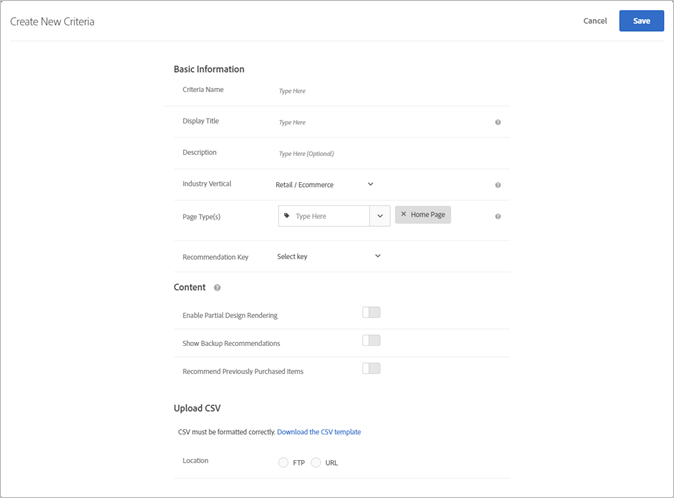

#  -överföring{#upload-custom-criteria}

Överför en CSV-fil för att anpassa dina rekommendationer.

Det finns flera sätt att nå [!UICONTROL Create New Criteria] skärmen. Vissa skärmalternativ varierar beroende på hur du kommer till skärmen.

* När du skapar en [!UICONTROL Recommendations] aktivitet klickar du **[!UICONTROL Create New]** på [!UICONTROL Select Criteria] skärmen. Du kan spara dina nya villkor och använda dem med andra [!UICONTROL Recommendations] aktiviteter.
* När du redigerar en [!UICONTROL Recommendations] aktivitet klickar du i en [!UICONTROL Recommendations Location] ruta på sidan och väljer **[!UICONTROL Change Criteria]**. Klicka på på [!UICONTROL Select Criteria] skärmen **[!UICONTROL Create New]**. Du kan spara dina nya villkor och använda dem med andra [!UICONTROL Recommendations] aktiviteter.
* Klicka på på skärmen **[!UICONTROL Recommendations]** > **[!UICONTROL Criteria]** bibliotek **[!UICONTROL Create Criteria]**. Kriterierna som du skapar här blir automatiskt tillgängliga för alla [!UICONTROL Recommendations] aktiviteter.

1. Klicka på **[!UICONTROL Create Criteria]**.

   

1. Välj **[!UICONTROL Upload Custom Criteria]**.

   

1. Skriv ett **[!UICONTROL Criteria Name]**.

   Detta är det&quot;interna&quot; namnet som används för att beskriva kriterierna.  Du kanske vill kalla villkoren för&quot;Produkter med högsta marginal&quot;, men du vill inte att den titeln ska visas offentligt. Se nästa steg för att ange den offentliga titeln.
1. Skriv en offentlig sida **[!UICONTROL Display Title]** som ska visas på sidan för rekommendationer som använder det här villkoret.

   Du kan till exempel visa&quot;Personer som visade det här&quot; eller&quot;Liknande produkter&quot; när du använder det här villkoret för att visa rekommendationer.
1. Ange en kort **[!UICONTROL Description]** av villkoren.

   Beskrivningen bör hjälpa dig att identifiera villkoren och kan innehålla information om syftet med kriterierna.
1. Välj en **[!UICONTROL Industry Vertical]**.

   Andra kriteriealternativ kan ändras beroende på vilken vertikal bransch du väljer.

1. Välj en **[!UICONTROL Page Type]**.

   Du kan välja flera sidtyper.

   Tillsammans används de vertikala metoderna och sidtyperna för att kategorisera de sparade villkoren, vilket gör det enklare att återanvända villkor för andra [!UICONTROL Recommendations] aktiviteter.
1. Välj en **[!UICONTROL Recommendation Key]**.

   Mer information om att basera villkor på en nyckel finns i [Basera rekommendationen på en rekommendationsnyckel](/help/c-recommendations/c-algorithms/base-the-recommendation-on-a-recommendation-key.md).
1. Ange dina **[!UICONTROL Content]** regler.

   Innehållsreglerna avgör vad som händer om antalet rekommenderade objekt inte fyller din design. Om din design t.ex. har plats för fem objekt, men dina villkor bara leder till att tre objekt rekommenderas, kan du lämna det återstående utrymmet tomt eller använda rekommendationer för säkerhetskopiering för att fylla det extra utrymmet. Välj lämpliga reglage. Se [Ange innehållsinställningar](/help/c-recommendations/c-algorithms/create-new-algorithm.md#content).
1. Sätt din egen **[!UICONTROL Inclusion Rules]**.

   Inkluderingsregler hjälper dig att begränsa de objekt som visas i dina rekommendationer. Se [Ange inkluderingsregler](/help/c-recommendations/c-algorithms/create-new-algorithm.md#inclusion). 1. Markera **[!UICONTROL Location]** innehållet i CSV-filen.

   CSV-filen måste vara korrekt formaterad för att överföringen ska lyckas. Klicka **[!UICONTROL Download the CSV template]** för att hämta en korrekt formaterad CSV-fil.

   Det finns två platsalternativ:

   * **FTP:** Om du vill överföra din CSV-fil från en FTP-server markerar du **[!UICONTROL FTP]** och anger sedan nödvändig information. Du kan använda SSL, som använder FTPS-protokollet för att överföra CSV-filen på ett säkert sätt.
   * **URL:** Om du vill överföra din CSV-fil från en URL-adress väljer du **[!UICONTROL URL]** och anger sedan en feed-URL.

1. Klicka på **[!UICONTROL Save]**.

   >[!NOTE]
   >
   >Anpassade villkorsenheter (rader) kan innehålla upp till 1 000 rekommenderade objekt (kolumner).

Uppdateringar av anpassade villkor är som standard&quot;kumulativa&quot;. Nya nyckelvärdepar som anges i CSV-överföringsfilen skriver över befintliga nyckelvärdepar. Befintliga nyckelvärdepar som inte har nycklar angivna i CSV-överföringen är fortfarande tillgängliga för leverans och upphör att gälla om 31 dagar från den tidpunkt då de senast överfördes som en del av CSV-filen.

Kontakta kundtjänst om du vill aktivera inställningen för att ignorera befintliga resultat som inte ingår i nästa CSV-överföring. Om den här inställningen är aktiverad är endast nycklarna i den anpassade CSV-feed-filen tillgängliga för leverans. Den här inställningen gäller för alla anpassade villkor.

Anpassade villkorsfeeds uppdateras en gång var 24:e timme.

Du kan se överförings- och synkroniseringsstatusen för dina anpassade villkorsuppladdningar längst ned på varje kriteriekort på sidan Recommendations > Villkor. Du kan även se statusen i dialogrutan Redigera när du redigerar egna villkor.

Flödet för en felfri överföring ska vara Schemalagd > Hämta feedfil > Importera > Slutförd.

Följande felmeddelanden är möjliga om Target stöter på ett problem med överföringen:

| Felmeddelande | Detaljer |
|--- |--- |
| Okänt fel | Anger ett internt tekniskt fel. |
| Tolkningsfel | Det finns troligen ett problem med feed-filformatet. Korrigera filformatet och spara om algoritmen, vilket startar filhämtningen igen. |
| Servern hittades inte | Ange ett IP- eller värdnamn som visas på Internet. |
| Fel i autentiseringsuppgifter | Ange en giltig användare och ett giltigt lösenord för ett aktivt konto på servern. |
| Katalogen hittades inte | Ange en katalog som finns på servern. |
| Filen hittades inte | Ange namnet på en fil som finns på servern i den angivna katalogen. |

## Utbildningsvideo: Skapa villkor i Recommendations (12:33) 

Den här videon innehåller följande information (information om hur du överför anpassade villkor börjar vid 11:43):

* Skapa villkor
* Skapa villkorssekvenser
* Överför anpassade villkor

>[!VIDEO](https://video.tv.adobe.com/v/27694?quality=12)