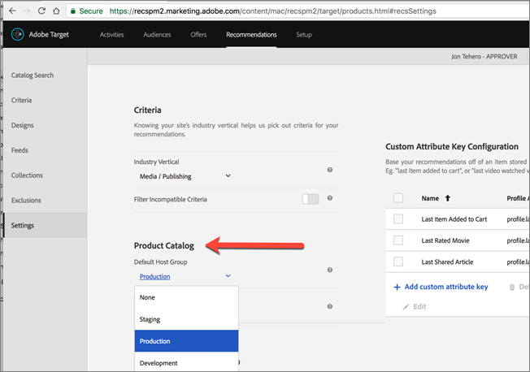

#  PREMIUMRecommendations FAQ{#recommendations-faq}

Lista med vanliga frågor och svar om Adobe Target Recommendations-aktiviteter.

## Varför visas inte rätt resultat vid katalogsökning när jag söker efter ett anpassat attribut med ett numeriskt värde?

När du gör en katalogsökning i ett anpassat attribut med ett numeriskt värde behandlas det anpassade attributet som en strängtyp i stället för ett numeriskt värde.

För närvarande finns det ingen tillgänglig funktion som gör att kunderna kan ändra typen av attribut. Om du vill göra en ändring [öppnar du en kundutgåva](/help/cmp-resources-and-contact-information.md#reference_ACA3391A00EF467B87930A450050077C) som refererar till de attribut som behöver typen ändrad från sträng till numerisk.

## Hur lång tid tar det för uppdateringar av objekt i min katalog att återspeglas på min webbplats?

När du har importerat en feed-fil, eller efter att ha tagit emot enhetsuppdateringar via API eller mbox, visas följande ändringar under 60 minuter:

* Objektattribut som returneras i designmallen.
* Artikelattribut som används i globala exkluderingsregler som förhindrar att objektet tas med i returnerade rekommendationer.
* Artikelattribut som används i inkluderingsregler i kriterierna som påverkar huruvida artikeln inkluderas eller exkluderas i returnerade rekommendationer.

Följande ändringar återspeglas inte förrän nästa algoritmkörning inträffar (inom 12-24 timmar):

* Objektattribut som används i samlingsreglerna som används för aktiviteten.
* Artikelattribut som används i en kampanj baserat på ett attribut eller en samling som är associerad med aktiviteten.
* Artikelkategori som objektet visas i för en&quot;Aktuell kategori&quot; eller&quot;Favoritkategori&quot; i algoritmen Top Sellers eller Most Viewed.
* Rankning av rekommenderade objekt när attributet ändras är ett anpassat attribut som används som anpassad nyckel för en algoritm.
* Rankning av rekommenderade objekt baserat på ändrade attribut när rekommendationslogiken är&quot;Objekt med liknande attribut&quot; när&quot;Likhetsfaktorn för innehåll&quot; används, eller när&quot;Attributviktningsfaktorer&quot; används.

>[!NOTE]
>
>En feed-fil betraktas som importerad när dess status ändras från&quot;Importera objekt&quot; till&quot;Förbereda sökindexuppdateringar&quot;. Uppdateringar kan ta mer än 60 minuter att spegla i användargränssnittet för katalogsökning. Katalogsökningen är uppdaterad när flödets status ändras till Uppdateringar slutförda. Även om katalogsökningen ännu inte är uppdaterad kommer webbplatsen att återspegla uppdateringar enligt de tidsramar som anges ovan. Den senaste uppdateringstiden för katalogens sökindex visas på sidan Katalogsökning.

## Vad ska jag göra om specialtecken bryter min array? {#section_D27214116EE443638A60887C7D1C534E}

Använd escape-värden i JavaScript. Citattecken ( &quot; ) kan bryta arrayen. Följande kodfragment är ett exempel på escape-värden:

```
#set($String='') 
#set($escaper=$String.class.forName('org.apache.commons.lang.StringEscapeUtils')) 
<script type="text/javascript"> 
console.log("$escaper.escapeJavaScript($entity1.name)") 
console.log("$escaper.escapeJavaScript($entity2.name)") 
console.log('$escaper.escapeJavaScript($entity3.name)') 
names.push("$escaper.escapeJavaScript($entity4.name)") 
</script>
```

## Varför är inte alla villkor, inklusive anpassade kriterier, tillgängliga för val när du skapar en Recommendations-aktivitet? {#section_B2265AC8B8A94E0298D495A05C5D817F}

De tillgängliga villkoren baseras på den aktuella kategorin. När du skapar rekommendationserbjudanden visar algoritmväljaren villkor baserat på kategori-ID.

Om platsen som du använder det här villkoret på inte innehåller kategori-ID:t är vissa villkor inte tillgängliga i algoritmväljaren.

Om du använder en plats där kategori-ID finns i mbox, innehåller villkorsväljaren alla tillämpliga villkor.

Målet har en [inställning för filterinkompatibla villkor](/help/c-recommendations/plan-implement.md#concept_C1E1E2351413468692D6C21145EF0B84) som styr intelligent filtrering av algoritmväljaren.

>[!NOTE]
>
>Den här inställningen gäller endast för aktiviteter som skapats i Visual Experience Composer (VEC). Den här inställningen gäller inte för aktiviteter som skapas i den formulärbaserade Experience Composer (målet har ingen platskontext).

Om du vill komma åt inställningen [!UICONTROL Filter Incompatible Criteria] klickar du på [!UICONTROL Recommendations] > [!UICONTROL Settings]:


Om inställningen [!UICONTROL Filter Incompatible Criteria] inte är aktiverad filtrerar inte Target algoritmer i algoritmväljaren och alla algoritmer visas.

Om inställningen [!UICONTROL Filter Incompatible Criteria] är aktiverad läser Target entitetId och category Id i VEC-aktiviteter från den valda platsen och visar sedan algoritmer baserade på `currentItem|currentCategory` (om det finns respektive värden på den platsen). Därför visas som standard bara kompatibla algoritmer för den valda platsen i algoritmväljaren.

Om inställningen [!UICONTROL Filter Incompatible Criteria] är aktiverad kan du fortfarande visa icke-kompatibla algoritmer genom att avmarkera kryssrutan [!UICONTROL Compatible] när du väljer villkor.


Följande lista innehåller specialfall där alternativet [!UICONTROL Compatible] inte visas i Target:

* Både entityId och category Id finns på platsen och inget filtreras.
* Du använder [!DNL mbox.js] version 55 eller tidigare.
* Inget mbox-anrop utlöses från sidan (!config.isAutoCreateGlobalMbox &amp;&amp; !config.isRegionalMbox)
* Målparametrar har inte definierats.

## Vad ska jag göra om en samling i Recommendations blir noll (0)? {#section_E2DB2FE67CF24EEC81412BFF3FA6385D}

Tänk på följande information om du ser en samling gå till noll som tidigare inte var noll:

* Du kan spara samlingen igen och se om den uppdaterar numret. Observera att om du sparar om kommer samlingen att köra alla algoritmer som använder den samlingen igen.
* Tittar du på rätt miljö? Gå till [!DNL /target/products.html#recsSettings] om du vill dubbelkontrollera (som visas nedan).

   

* Är ditt index aktuellt? Gå till [!DNL /target/products.html#productSearch] och kontrollera hur många timmar som indexet är gammalt (t.ex. &quot;För 3 timmar sedan&quot;). Du kan uppdatera indexet efter behov.
* Har du ändrat något i feeden eller datalagret som resulterade i att dina enheter inte längre matchade samlingsreglerna? Se till att CASE-filen överensstämmer (skiftlägeskänslig).
* Kördes din feed korrekt? Har någon ändrat FTP-katalogen, lösenordet osv.?
* Target gör sitt bästa för att få leveransen att uppdateras (på kundens sida/app) så snabbt som möjligt. Men vi måste också tillhandahålla viss representation i användargränssnittet för marknadsföraren. Vi behöver inte nödvändigtvis fördröja leveransuppdateringar för att vänta på att gränssnittsuppdateringarna ska vara synkroniserade. Du kan använda [mboxTrace](/help/c-activities/c-troubleshooting-activities/content-trouble.md) för att se vad som finns i systemet när en begäran kommer in.

## Vad är skillnaden mellan allmän attributviktning och innehållets likhetsspecifika attributviktning? {#section_FCD96598CBB44B16A4C6C084649928FF}

Attributvikningen finns i två former: &quot;standardattribuering&quot; och &quot;attribuering av likhetsattribut för innehåll&quot;.

&quot;Standardattributviktning&quot; gäller de flesta, om inte alla, kriterietyper (inte bara Innehållslikhet). Den här typen av viktning ger mer vikt åt vissa attributvärden. I följande exempel kommer Nike-produkter att få en ojämnhet i utdatarrekommendationerna.


&quot;Attributvikning för innehållets likhet&quot; gäller endast för kriterier för innehållets likhet.

Den här typen av viktning är mer dynamisk och baseras på den aktuella rekommendationsnyckeln (det objekt som visas för närvarande). I följande exempel (varumärke x 16), om en besökare tittade på Nike sneakers, är det mer sannolikt att den besökaren rekommenderas till andra Nike-produkter (inte nödvändigtvis bara sneakers) än konkurrenternas sensorer. Om en besökare tittar på Adidas-sneakers är det troligare att han eller hon rekommenderar Adidas-produkter.


## Varför kan Target ibland inte visa rekommendationer? {#section_DB3F40673AED42228E407C05437D99E9}

Målet kan ibland inte visa rekommendationer på grund av det låga antalet tillgängliga rekommendationer.

Antalet genererade värden per villkor är 3 gånger det antal enheter som anges i designen. Körtidsfiltrering (till exempel lagerhantering, mbox-attributmatchning) tillämpas efter att 3x-värdena har genererats, så det är möjligt att få färre än 3x-värden vid leveranstiden. Om du vill minska den här situationen ökar du antalet enheter i designen genom att dölja ytterligare enheter.

Följande JavaScript kan användas i början av designen för att öka antalet begärda entiteter. I det här exemplet skulle antalet begärda entiteter vara 30 (3x10).

```
#foreach($entity in $entities) 
 #if( $foreach.count > 10 ) 
  #break 
 #end 
 #set ($foo = $entity.id) 
#end 
```

## Vilken är storleksgränsen för ett API-anrop för infognings-/uppdateringsprodukter? Kan jag uppdatera 50 000 produkter i ett samtal med API:t istället för en feed? {#section_434FE1F187B7436AA39B7C14C7895168}

Target inför en postgräns på 50 MB på applikationsnivå. Detta är dock bara när du skickar innehållstypsrubriken `application/x-www-form-urlencoded`.

Du kan försöka att skicka 50 000 produkter i ett enda samtal. Om det inte fungerar bör du dela upp det i grupper. Vi rekommenderar oftast att kunderna delar upp sina samtal i 5 000 eller 10 000 produktgrupper för att minska sannolikheten för en timeout på grund av systembelastning.

## Måste jag ange mbox-namnet när jag skapar Recommendations-kriterier, kampanjer eller testregler för mallar? {#section_FFA42ABCC5954B48A46526E32A3A88A2}

När du skapar Recommendations-kriterier, kampanjer eller malltestningsregler som baseras på en mbox-parameter, frågar `mboxParameter` inte längre efter `mboxName`. Nu är mbox-namnet valfritt. Med den här ändringen kan du använda parametrar från flera rutor eller referera till en parameter som ännu inte har registrerats på kanten.

Så här väljer du önskad parameter:

* När du skapar ett nytt villkor, en befordran eller en malltestregel väljer du ett parameternamn i listan, börjar skriva de första tecknen i det önskade parameternamnet eller skriver det fullständiga namnet på det önskade parameternamnet.
* Om du kommer ihåg mbox-namnet, men inte parameternamnet, använder du kryssrutan för att filtrera på en känd mbox som skickar den önskade parametern.

Om du använder någon av metoderna finns det ingen länk mellan mbox och parametern. Regeln för villkor, befordran eller malltestning fungerar utifrån parametern i alla mbox som skickar den parametern.

Om du redigerar ett befintligt villkor, en befordran eller en malltestregel visas filtervillkoren med namnet på mbox som angavs när du skapade.

## Varför kan jag inte spara min gamla Recommendations-aktivitet efter att ha definierat en ny publik? {#section_1E47C40B1FE7479BAC3EE0F50CE7C2C4}

Se till att målgruppen har ett unikt namn. Om du gav målgruppen samma namn som en befintlig målgrupp kan du inte spara din tidigare Recommendations-aktivitet (en Recommendations-aktivitet som skapades före oktober 2016).

## Vilken är den maximala storleken för en CSV-fil för en feed-överföring? {#section_20F1AF4839A447B9889B246D6E873538}

Det finns ingen hård gräns för antalet rader eller filstorleken för en feed CSV-filöverföring. Vi rekommenderar dock att CSV-filens storlek begränsas till 1 GB för att undvika fel under filöverföringen. Om filens storlek överstiger 1 GB bör den helst delas upp i flera feedsfiler. Det maximala antalet anpassade attributkolumner är 100 och anpassade attribut är begränsade till 4 096 tecken. Ytterligare begränsningar för längden på de kolumner som krävs finns på [sidan Målbegränsningar](/help/r-troubleshooting-target/target-limits.md#reference_BEFE60C3AAA442FF94D4EBFB9D3CC9B1).

## Kan jag utesluta en entitet dynamiskt?

I frågesträngen kan du skicka enhets-ID:n för entiteter som du vill utesluta från dina rekommendationer. Du kanske vill utesluta artiklar som redan finns i kundvagnen.

Om du vill aktivera exkluderingsfunktionen använder du parametern `excludedIds` mbox. Den här parametern pekar på en lista med kommaavgränsade enhets-ID:n. Exempel, `mboxCreate(..., "excludedIds=1,2,3,4,5")`. Värdet skickas när rekommendationer begärs.

Uteslutningen görs endast för det aktuella Target-anropet. objekt exkluderas inte vid efterföljande Target-anrop såvida inte `excludedIds`-värdet skickas igen. Om du vill utesluta artiklar i kundvagnen från rekommendationer på varje sida fortsätter du skicka `excludedIds`-värdet på varje sida.

>[!NOTE]
>
>Om för många enheter utesluts beter sig rekommendationerna som om det inte finns tillräckligt många enheter för att fylla rekommendationsmallen.

Om du vill exkludera `entityIds` lägger du till `&excludes=${mbox.excludedIds}`-token till erbjudandets innehålls-URL. När innehålls-URL:en extraheras ersätts de obligatoriska parametrarna med aktuella parametrar för mbox-begäran.

Som standard är den här funktionen aktiverad för nya rekommendationer. Befintliga rekommendationer måste sparas för att stödja enheter som utesluts dynamiskt.

## Vad betyder NO_CONTENT-svaret som ibland returneras i Recommendations innehållsspårning?

NO_CONTENT returneras när rekommendationer inte är tillgängliga för den begärda algoritmen och tangentkombinationen. I allmänhet inträffar detta när säkerhetskopiering är inaktiverat för algoritmen och ett eller flera av följande är också sant:

* Resultaten är inte klara än.

   Det här inträffar vanligtvis när du först sparar en nyskapad aktivitet eller efter att konfigurationsändringar har gjorts i den samling, de villkor eller kampanjer som används i aktiviteten.

* Resultaten är klara, men har ännu inte cachelagrats på närmaste edge-server, för den begärda algoritm-/tangentkombinationen.

   Denna begäran kommer att initiera en cachelagring, så den bör lösas efter några sidladdningar och/eller några minuter framåt.

* Resultaten är klara, men inte tillgängliga för det angivna nyckelvärdet.

   Det här inträffar vanligtvis när du begär rekommendationer för ett objekt som har lagts till i katalogen efter att den senaste algoritmen har körts och sedan kommer att matchas automatiskt efter nästa algoritmkörning.

* Delvis mallåtergivning är inaktiverat och det finns inte tillräckligt med resultat för att fylla mallen.

   Detta inträffar vanligtvis när du har en regel för dynamisk inkludering, som innebär att många objekt filtreras bort från de möjliga resultaten. Du kan undvika detta genom att aktivera säkerhetskopieringar och inte tillämpa inkluderingsregeln på säkerhetskopieringar, eller använda villkoren i följd med ett mindre aggressivt filtrerat villkor.

