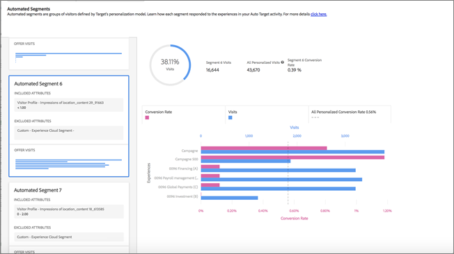

#  över PREMIUMAutomated Segments{#automated-segments-report}

Information om rapporten Automated Segments, en av de två specialrapporter som är tillgängliga för användare av Automated Personalization- (AP) och Auto-Target-aktiviteter (AT).

>[!NOTE]
>
>Tänk på följande när du använder personaliseringsInsights-rapporter:
>
>* AP- och AT-aktiviteter är tillgängliga som en del av [!DNL Target Premium]-lösningen. De ingår inte i [!DNL Target Standard] utan en [!DNL Target Premium]-licens.
   >
   >
* [!UICONTROL Personalization Insights] rapporter är bara tillgängliga för AP- och AT-aktiviteter som använder ett konverteringsoptimeringsmål. Aktiviteter där optimeringsmålet ändrades till konvertering från intäkt efter att aktiviteten redan var aktiv stöds inte heller.
   >
   >
* [!UICONTROL Personalization Insights] -rapporter är bara tillgängliga om du  [!UICONTROL Primary Goal] har valt dem i  [!UICONTROL Report Metric] listrutan.
   >
   >
* [!UICONTROL Personalization Insights] rapporter stöds endast i  [standardmiljön ](/help/administrating-target/hosts.md) .
   >
   >
* [!UICONTROL Personalization Insights] Rapporterna genereras endast för aktiviteter som har  [!UICONTROL Live] status och har aktiverats och fått trafik i minst 15 dagar.

Olika besökare svarar annorlunda på erbjudandena/upplevelserna i er AP/AT-aktivitet. Den här rapporten visar hur olika automatiserade segment som definierats av Target personaliseringsmodeller svarade på erbjudandena/upplevelserna i aktiviteten.

## Åtkomst till rapporten Automated Segments {#section_8E8F997AAAF44A1B9EE06EB6FB652801}

1. Klicka på **[!UICONTROL Activities]** och sedan på önskad [Automated Personalization](/help/c-activities/t-automated-personalization/automated-personalization.md#task_8AAF837796D74CF893CA2F88BA1491C9) eller [Automatisk målaktivitet](/help/c-activities/auto-target/auto-target-to-optimize.md) i listan.

   Om du har många aktiviteter kan du filtrera listan genom att välja alternativ i listrutorna [!UICONTROL Type], [!UICONTROL Status], [!UICONTROL Property], [!UICONTROL Reporting Source], [!UICONTROL Experience Composer], [!UICONTROL Metrics Type] och [!UICONTROL Activity Source].

1. Klicka på **[!UICONTROL Reports]**.

   Rapporten [Automated Personalization Summary](/help/c-reports/reports-ap.md) eller [Auto-Target Summary](/help/c-reports/auto-target-summary-report.md) visar information om aktiviteternas prestanda, som representeras av den första skärmikonen. De två ytterligare ikonerna representerar de två personaliseringsinsikterna: Automatiska segment och viktiga attribut. Observera att Auto-Target har en extra diagramikon för den grafiska vyn i [!UICONTROL Summary]-rapporten.

   

   >[!IMPORTANT]
   >
   >Rapporten [!UICONTROL Automated Segments] är inte tillgänglig förrän minst 15 dagar efter att du har aktiverat aktiviteten. Under den inledande perioden kommer du inte att kunna komma åt den här rapporten eller klicka på ikonen [!UICONTROL Automated Segments]. Efter 15 dagar kommer [!UICONTROL Automated Segments]-rapporten att vara tillgänglig om det finns tillräckligt med personaliserad trafik i din aktivitet.

1. Efter 15 dagar kan du klicka på ikonen **[!UICONTROL Automated Segments]**.

   

1. Välj önskat datumintervall.

   Till skillnad från [!UICONTROL Summary]-rapporten (prestandarapportering) är [!UICONTROL Personalization Insights], inklusive [!UICONTROL Automated Segments], bara tillgängligt för fasta datumintervall: 15 dagar, 30 dagar, 45 dagar, 60 dagar och 90 dagar. Med dessa fasta datumintervall kan [!UICONTROL Personalization Insights] använda ett stort tillräckligt stort dataintervall för att minska sannolikheten för att du får insikter från ett kort mönster i din aktivitet. De två beslut som du kan fatta för datumintervallet är&quot;Slutdatum&quot; och&quot;Varaktighet&quot;. Du kommer att märka att &quot;Start&quot; är nedtonat. Startdatumet ändras automatiskt baserat på dina val för slutdatumet och varaktigheten.

   

   Du kommer åt de tillgängliga datumintervallen i listrutan [!UICONTROL Choose Duration].

   

1. Granska rapportdata för [!UICONTROL Automated Segments].

   

1. (Valfritt) [Hämta rapporten i CSV-format](/help/c-reports/c-report-settings/report-settings.md#section_77E65C50BAAF4AB79242DB3A8778ADEF) för analys i Excel och andra verktyg.

   >[!NOTE]
   >
   >Användargränssnittsrapporten Personalization Insights innehåller urvalsinformation. CSV-nedladdningen för rapporten Automated Segments innehåller ytterligare information. Nedladdningen av rapporten Automated Segments innehåller ytterligare automatiserade segment utöver de främsta segmenten som ingår i användargränssnittet, tillsammans med hur dessa segment fungerade i förhållande till era erbjudanden eller upplevelser.

## Tolka rapporten Automatiserade segment

I följande tabell beskrivs hur du tolkar rapporten och dess element:

| Element | Detaljer |
|--- |--- |
| Vänster sidopanel | Den vänstra panelen listar de 20 största&quot;automatiserade segmenten&quot; som identifieras av Target personaliseringsmodeller för den här aktiviteten. Ett&quot;automatiserat segment&quot; är som en målgrupp, men definieras av Target personaliseringsmodeller i stället för av marknadsföraren. Varje automatiserat segment består av specifika värden (eller värdeintervall) för specifika attribut. Observera att automatiska segment kan överlappa varandra. Automatiska segment kan definieras med ett, två, tre eller fyra attribut. Se exemplen nedan för mer information. Mer information om Target personaliseringsmodeller finns i  [Slumpmässig skogsalgoritm](/help/c-activities/t-automated-personalization/algo-random-forest.md). Mer information om attributen Target personaliseringsmodeller använder för att skapa automatiserade segment finns i [Datainsamling för Target&#39;s Personalization Algorithms](/help/c-activities/t-automated-personalization/ap-data.md). |
| Centrera diagram | Centrumdiagrammen visar hur aktivitetens innehåll har utförts för det markerade automatiserade segmentet. När du klickar på olika segment på den vänstra panelen uppdateras diagrammen i mitten. |
| Cirkeldiagram | Cirkeldiagrammen högst upp på mittpanelen visar det automatiserade segmentets storlek samt det totala antalet personaliserade besök i aktiviteten (till exempel trafik till den här aktiviteten som betjänades av personaliseringsmodellen). Omfattar inte kontrolltrafik eller trafik som betjänas av den övergripande vinnarmodellen). Observera att segmentets storlek endast baseras på personaliserade besök.  |
| Stapeldiagram med dubbla axlar | I stapeldiagrammet med dubbla axlar ingår besöks- och konverteringsinformation från erbjudandet eller upplevelsen för det specifika automatiserade segmentet. |
| Rosa stapel | Det rosa strecket representerar konverteringsgraden och använder diagrammets nedre axel. Om du vill ha mer information håller du pekaren över fältet |
| Blå stapel | Det blå fältet representerar antalet besök och använder diagrammets övre axel. Om du vill ha mer information håller du pekaren över fältet. |
| Grå prickad linje | Den grå prickade linjen representerar konverteringsgraden för alla personaliserade besök i aktiviteten, för alla erbjudanden/upplevelser och automatiserade segment. |

**Exempel 1 på automatiserat segment**

Detta automatiserade segment definieras utifrån endast ett attribut. Besökarna i det här automatiserade segmentet såg den här AP-aktiviteten på en veckodag utanför de vanliga arbetstiderna eller på en helg.

**Exempel 2 på automatiserat segment**

Detta automatiska segment definieras baserat på två attribut. Besökare som ingick i det här automatiska segmentet och som såg denna AP-aktivitet hade färre än tre sidvisningar vid sitt aktuella besök och var geografiskt baserade i Latitude 42.57 och 47.29 (ungefär mellan New Hampshire/Oregon och Washington/Maine för ett amerikanskt företag).

## Vanliga frågor om automatiserade segment {#section_740910A52FA646B4AC9452F98C2F5719}

**Personaliseringsinsikter - rapporter är inte tillgängliga än för min aktivitet. Varför är det där?**

Det finns flera orsaker till varför [!UICONTROL Personalization Insights]-rapporterna ännu inte är tillgängliga för din aktivitet:

* 15 dagar har inte gått sedan du aktiverade aktiviteten. Automatiserade segment och viktiga attributrapporter är inte tillgängliga förrän tidigast 15 dagar efter att du har påbörjat aktiviteten. Under den inledande perioden kommer du inte att kunna komma åt dessa rapporter eller klicka på ikonerna Automatiserade segment och Viktiga attribut.
* Din aktivitet har inte haft tillräckligt med trafik under den angivna tidsramen. Efter 15 dagar kommer rapporter om automatiserade segment och viktiga attribut att finnas tillgängliga, förutsatt att det finns tillräckligt med personaliserad trafik i din aktivitet för att skapa personaliseringsmodeller.
* Din aktivitet har ett intäktsoptimeringsmål. För närvarande är [!UICONTROL Personalization Insights] bara tillgängligt för målaktiviteter för konverteringsoptimering. Vi kommer att lägga till stöd för intäktsoptimeringsmålaktiviteter i en kommande release.

**Vad är ett attribut?**

Ett attribut är information om en besökare eller hans eller hennes specifika besök som används av personaliseringsalgoritmerna för att lära sig att personalisera trafik. Ett attribut kan till exempel vara webbläsartyp, plats, tidpunkt på besöksdagen och så vidare.

Mer information om vilka attribut [!DNL Target] använder i sina anpassningsmodeller finns i [Datainsamling för Target&#39;s Personalization Algorithms](/help/c-activities/t-automated-personalization/ap-data.md). Mer information om hur du överför nya attribut till Target för användning i Target-personaliseringsmodeller finns i [Metoder för att hämta data till Target](/help/c-implementing-target/c-considerations-before-you-implement-target/c-methods-to-get-data-into-target/methods-to-get-data-into-target.md#concept_0069C0EFB56C4700BB33F2F35C2B9B17).

**Vad är ett automatiserat segment?**

Ett&quot;automatiserat segment&quot; är som en målgrupp, men definieras av Target personaliseringsmodeller i stället för av marknadsföraren.

Ett automatiserat segment består av specifika värden (eller värdeintervall) för specifika attribut. Se steg 5 ovan för exempel automatiserade segment. Observera att segment kan överlappa varandra.

Mer information om den slumpmässiga algoritmen för skogspersonalisering, som är grunden för Target personaliseringsmodeller, finns i [Slumpmässig skogsalgoritm](/help/c-activities/t-automated-personalization/algo-random-forest.md).

**Vilken ordning bestämmer de automatiserade segmenten? **

Poängen beräknas för varje segment utifrån dess storlek och hur annorlunda det utfördes med innehållet i din aktivitet. Kombinationen av dessa indata avgör ordningen på de automatiserade segmenten så att större segment med större skillnader i hur de svarade på det olika innehållet visas närmare segmentlistans övre del.

**Varför visas bara några av mina erbjudanden/upplevelser i rapporten om automatiserade segment?**

AP- och AT-aktiviteter bygger en modell per erbjudande (i fallet AP) och en modell per upplevelse (i fallet AT). Dessa aktiviteter börjar betjäna personaliserad trafik och skapar din [!UICONTROL Personalization Insights] med så lite som två modeller skapade. Om du inte ser alla erbjudanden/upplevelser i [!UICONTROL Personalization Insights] har du förmodligen inte några modeller som är byggda för just de erbjudandena/upplevelserna. Du kan kontrollera aktivitetens [!UICONTROL Summary]-rapport och se om det finns en urtikon bredvid erbjudandet/upplevelsen. Den här ikonen anger att modeller ännu inte har byggts för det erbjudandet/upplevelsen.

**Varför får vissa erbjudanden/upplevelser med en lägre konverteringsgrad större trafik jämfört med andra erbjudanden/upplevelser för ett visst automatiserat segment?**

Det finns flera möjliga orsaker till varför du kan se fler besök i ett erbjudande om lägre konverteringsgrad eller en upplevelse inom ett automatiserat segment, bland annat:

* Ett litet antal vyer för vissa eller alla erbjudanden/upplevelser för ett visst automatiserat segment.
* Aktiviteter med låg volym där vissa erbjudanden/upplevelser inte har några modeller byggda, eller där modeller har skapats tidigare för vissa erbjudanden/upplevelser än andra.
* Riktlinjer för ett specifikt erbjudande som begränsar vilka besökare som kan se vilka erbjudanden/upplevelser som finns.

**Är informationen i  [!UICONTROL Automated Segments] och  [!UICONTROL Important Attributes] rapporterna densamma som i CSV-nedladdningen?**

Nej, UI-rapporten innehåller urvalsinformation. CSV-nedladdningen innehåller ytterligare information. Nedladdningen av rapporten Automated Segment Insights innehåller ytterligare automatiserade segment utöver de främsta segmenten som ingår i användargränssnittet, tillsammans med hur dessa segment fungerade i förhållande till era erbjudanden eller upplevelser. Rapporten Viktiga attribut innehåller de 100 viktigaste besökarattributen och deras relativa betydelse, medan användargränssnittet endast innehåller de 10 viktigaste besökarattributen.

**Kan jag se  [!UICONTROL Personalization Insights] efter ett anpassat datumintervall?**

Personalisering Insights-rapportering (både [!UICONTROL Automated Segments] och [!UICONTROL Important Attributes]) är bara tillgänglig för fasta datumintervall: 15 dagar, 30 dagar, 45 dagar, 60 dagar och 90 dagar. Med dessa fasta datumintervall kan [!UICONTROL Personalization Insights] använda ett stort tillräckligt stort dataintervall för att minska sannolikheten för att du får insikter från ett kort mönster i din aktivitet. Du kan välja de här varaktigheterna för ett slutdatum (där dessa data är tillräckligt många för att aktiviteten ska klara varaktigheten).

**Hur  [!UICONTROL Personalization Insights] skapas?**

[!UICONTROL Personalization Insights] skapas med en patentsökt teknik i Adobe som kallas MAGIX (Model Agnostic Global Interpretable Förklarations). Du kan läsa mer om MAGIX i Adobe forskningsteamets publicerade rapport på [arXiv.org-webbplatsen](https://arxiv.org/abs/1706.07160).

**Varför matchar inte den totala besökstrafiken i  [!UICONTROL Automated Segments] rapporten min AP- eller AT-sammanfattning/prestandarapport?**

[!UICONTROL Personalization Insights]-rapporterna innehåller endast besökare som såg en del av innehållet som valts ut av Target personaliseringsmodeller (d.v.s. inte kontrolltrafik eller trafik som betjänas av den övergripande vinnarmodellen). Denna trafiktyp kallas för&quot;personaliserad&quot; trafik. Den sammanfattande prestandarapporten i AP/AT omfattar kontroll kontra&quot;riktad&quot; trafik. Målstyrd trafik omfattar personaliserad trafik, liksom trafik som betjänades med den övergripande vinnarmodellen och viss slumpmässigt betjänad trafik som brukade lära sig mer.

**Kan de automatiserade segmenten utesluter varandra?**

Nej, det finns överlappning mellan de automatiserade segmenten.

**Är  [!UICONTROL Personalization Insights] det möjligt med intäktsbaserade modelleringsmål/primärt mål?**

För närvarande är [!UICONTROL Personalization Insights] bara tillgängligt för målaktiviteter för konverteringsoptimering. Vi kommer att lägga till stöd för intäktsoptimeringsmålaktiviteter i en kommande release.

**Hur kan jag utnyttja informationen i personaliseringsinsikter på olika sätt?**

* Upptäck nya målgrupper att inrikta sig på: Om du ser ett visst automatiserat segment som fungerar särskilt bra kan du skapa en målgrupp så att du kan återanvända det segmentet i andra rapporter.
* Testa era hypoteser om vilken typ av besökare som kommer att svara på vilken av era upplevelser.
* Ta reda på vilket innehåll som fungerade för vilka typer av besökare: Vilka erbjudanden som låg till grund för besökarnas lyft.
* Identifiera underpresterande innehåll.
* Förstå vilka attribut som var viktigast för hur modellen lärde sig.
* Se vilka attribut som används i personaliseringsmodellerna och hur viktiga de är.
* Identifiera möjligheter för ytterligare datapunkter som ni kan skicka till Target för att ytterligare informera er personalisering.

**Finns det någon logik i ordningen som attribut visas i ett segmentkort?**

Nej, kortens ordning baseras endast på en rankning som beskrivs ovan. Attributens ordning i ett kort baseras inte på någon logik.