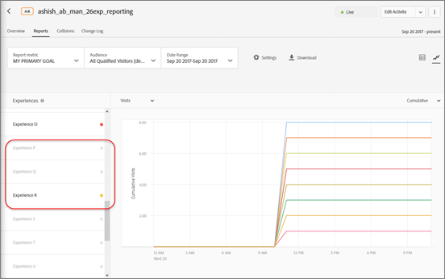

# Rapportinställningar{#report-settings}

Information som hjälper dig att ange de element som du vill ska visas i rapporten. Rapportinställningarna kan sparas för senare bruk.

Om du vill visa en rapport klickar du **[!UICONTROL Activities]** på önskad aktivitet i listan och sedan på **[!UICONTROL Reports]** fliken.

## Målförinställning {#section_51F67341465045BEB4F1A2FB638A8EB1}

Du kan spara upp till tio olika förinställningar för en enskild aktivitets rapport efter att du har konfigurerat den som du vill (mått, datumintervall, målgrupper, avancerade inställningar osv.). Alla målanvändare kan visa, redigera och ta bort de olika förinställningarna, oavsett vem som skapade dem.

Du kan också konfigurera rapporten för en enskild aktivitet efter behov och sedan spara konfigurationen som standard-/favoritförinställning. Det här är vyn som visas när du visar aktivitetens rapport som fortsätter.

### Skapa en förinställning eller standardförinställning

1. Konfigurera aktivitetens rapport efter behov.

   De tillgängliga inställningarna, inklusive mått, datumintervall, målgrupper, avancerade inställningar och så vidare, förklaras nedan.

1. Klicka på ikonen för tre lodräta ellipser > bredvid **[!UICONTROL Target Preset]** den. **[!UICONTROL Save as New]**

   

   Dialogrutan Ny förinställning visas:

   

1. Granska informationen i avsnitten Filter och Inställningar för att kontrollera att rapporten är konfigurerad som du vill och ange sedan **[!UICONTROL Preset Name]** (upp till 50 tecken).
1. (Villkorligt) Om du vill att det här ska vara din standard-/favoritrapportvy drar du **[!UICONTROL Set This as Default Preset]** växlingsknappen till På-positionen.
1. Klicka på **[!UICONTROL Save]**.

### Välj en annan förinställning

Välj önskad förinställning i **[!UICONTROL Target Preset]** listrutan.

### Redigera en förinställning

1. Markera den förinställning som du vill redigera.
1. Redigera rapportens konfiguration efter behov (mått, datumintervall, målgrupper, avancerade inställningar och så vidare).

   När du har klickat [!UICONTROL Save] efter att ha redigerat rapportens konfiguration visas en asterisk ( * ) efter förinställningens namn för att ange att förinställningen har ändrats, vilket visas nedan:

   

1. Klicka på ikonen för tre lodräta ellipser > **[!UICONTROL Save as New]** för att skapa en ny förinställning.

   eller

   Klicka på ikonen för tre lodräta ellipser > för att uppdatera den aktuella förinställningen **[!UICONTROL Update]** .

   

### Ta bort en förinställning

1. Markera den förinställning som du vill ta bort.
1. Klicka på ikonen för tre lodräta ellipser > **[!UICONTROL Delete]**.

   

1. Klicka **[!UICONTROL Delete]** igen för att bekräfta borttagningen.

### Felhantering av förinställningar

Varningar och meddelanden i rapporter talar om för dig om en förinställning blir ogiltig. Varningen eller meddelandet instruerar dig att välja en annan målgrupp, mätare, värdgrupp eller upplevelse för att skapa en giltig förinställning.

I följande lista beskrivs några situationer som kan göra att en förinställning blir ogiltig:

* En rapportmålgrupp togs bort från aktiviteten men refereras i förinställningsdefinitionen.
* Ett (eller flera) mätvärde togs bort, men det finns referenser i förinställningsdefinitionen. Du kan till exempel ta bort en eller flera mätvärden från aktiviteten och sedan lägga till nya mätvärden.
* En (eller flera) värdgrupp (miljö) finns inte, men det finns en referens i förinställningsdefinitionen.
* En (eller flera) upplevelse togs bort efter att förinställningen skapades, men det finns referenser i förinställningsdefinitionen.
* En förinställning är semantiskt ogiltig eftersom refererade entiteter fortfarande finns men uppdaterades på ett sätt som förinställningsdefinitionen semantiskt har ändrats. Anta till exempel att du först skapar en förinställning med namnet&quot;Intäkter i Chrome&quot;. Du uppdaterar senare aktiviteten för att mäta konverteringsmåttet i stället för intäkt. Den här uppdateringen av aktivitetsdefinitionen gör förinställningsdefinitionen ogiltig semantiskt.

## Rapportmått {#section_894ABD7148244806B7CE556EBBA2AD62}

Klicka på den **[!UICONTROL Report Metric]** nedrullningsbara listan för att välja ett annat [framgångsmått](../../c-activities/r-success-metrics/success-metrics.md#reference_D011575C85DA48E989A244593D9B9924) eller flera mätvärden som ska visas i diagrammet.

Som standard bestäms det primära måttet i inställningarna för framgångsmått när du skapar aktiviteten. Om du ändrar konfigurationen och sparar aktiviteten igen uppdateras det primära måttet för rapportering.

Mer information om hur du väljer flera mätvärden att visa i rapporter finns i [Visa flera mätvärden i en rapport](../../c-reports/c-report-settings/view-multiple-metrics.md#concept_9E3C3F6F3EC1412FAF252975AC0720B7).

## Målgrupp {#section_70926EB4618945D9AFF2B0564FF3717B}

Klicka på [!UICONTROL Audience] listrutan för att ändra rapportens målgrupp.

Mer information finns i [Publiker](../../c-target/target.md#concept_A782F8481A5041EBA75103CB26376522).

## Datumintervall {#section_A410A768403C4E01891F95CB357E63ED}

I rutan Datumintervall visas rapportens aktuella datumintervall. Klicka på listruteikonen för att visa en kalender där du kan ändra rapportens datumintervall.

Välj nya **[!UICONTROL Start]** och **[!UICONTROL End]** datum för rapporten. Du kan också använda rutorna **[!UICONTROL From Start of Activity]** och **[!UICONTROL Till End of Activity]** .

Klicka **[!UICONTROL Custom Dates]** för att välja fördefinierade datumintervall: De senaste 7 dagarna, de senaste 15 dagarna eller de senaste 30 dagarna. Dessa fördefinierade datumintervall är rullande intervall. Om startdatumet är mindre än antalet valda dagar visas intervallet från startdatumet i kalendern, men om startdatumet blir äldre än det antal dagar som väljs när aktivitetens varaktighet ökar.

Rapporterna har följande datumbegränsningar:

* Rapportens startdatum måste vara inom de senaste två åren.
* Dagliga rapporter är begränsade till 100 dagar.
* Rapporterna per timme är begränsade till 15 dagar.

## Inställningar {#section_D99CE462107D45CABE0960F820E1E972}

Klicka på kugghjulsikonen för att konfigurera rapportinställningarna och klicka sedan på **[!UICONTROL Save Settings]** när du är klar.

Följande bild visar dialogrutan Inställningar för en A/B-aktivitet:

Beroende på den valda aktivitetstypen varierar alternativen:

* **Inventeringsmetod:** Välj önskad metod:

   * Besökare
   * Besök
   * Aktivitetsexponeringar

* **Kontroll:** Välj den kontrollupplevelse som ska användas vid beräkning och jämförelse av lyft.
* **Miljö:** Välj den miljö (värdgrupp) som ska användas för rapporten.  Mer information finns i [Värdar](../../administrating-target/hosts.md#concept_516BB01EBFBD4449AB03940D31AEB66E).
* **Återställ rapportdata:** Återställ rapportdata för att ta bort gamla data. Befintliga besökare stannar kvar i aktiviteten.  Det här alternativet är bara tillgängligt för dem som har godkännarbehörighet.

   >[!IMPORTANT]
   >
   >Detta är en permanent åtgärd som inte kan ångras.

* **Exkludera extrema värden:** Växlingsknappen [!UICONTROL Exclude Extreme Values] gäller endast för aktiviteter med måtten Intäkter och engagemang. Mer information finns i [Exkludera extrema order](../../c-reports/c-report-settings/excluding-extreme-orders.md#task_2AE7743FFCDD466DAEEB720BE5F33DAA).

## Hämta {#section_77E65C50BAAF4AB79242DB3A8778ADEF}

Klicka på ikonen Hämta om du vill hämta rapportdata i ett [!DNL .csv] format för snabb import till Excel, Access eller andra dataanalysprogram. Mer information finns i [Hämta data i en CSV-fil](../../c-reports/downloading-data-in-csv-file.md#concept_3F276FF2BBB2499388F97451D6DE2E75).

## Uppdatera {#section_E203729F2F314DF3856D2EE67C60B370}

Klicka på ikonen Uppdatera om du vill uppdatera en rapports tabell- och diagramvy utan att uppdatera hela sidan, dess konfiguration eller dess datumintervall.

## Fler alternativ {#section_AB1B5C695D7045A0A0AC0E2698D2E7DE}

Klicka på ikonen Fler alternativ (tre lodräta ellipser) för att visa alternativen [!UICONTROL Edit Activity] och [!UICONTROL View Experience URLs] .

## Visningsalternativ

Du kan visa rapporten i olika format, beroende på aktivitetstypen. Välj önskat alternativ.

* **Tabellvy**: Klicka på **[!UICONTROL Table View]** ikonen om du vill visa rapporten som en tabell.
* **Diagramvy**: Klicka på **[!UICONTROL Graph View]** ikonen om du vill visa rapporten som ett diagram.
* **Automatiska segment**:(Endast tillgängligt för Automated Personalization- (AP) och AT-aktiviteter (Auto-Target).) Klicka på ikonen **[!UICONTROL Automated Segments] för att visa rapporten [om](/help/c-reports/c-personalization-insights-reports/automated-segments-report.md)automatiserade segment.
* **Viktiga attribut**: (Endast tillgängligt för Automated Personalization-aktiviteter (AP) och Automatiskt mål-aktiviteter (AT).) Klicka på ikonen **[!UICONTROL Important Attributes] för att visa [rapporten](/help/c-reports/c-personalization-insights-reports/important-attributes-report.md)Viktiga attribut.

## Genomsnittligt intervall för Lyft, Lyft gränser och Bekräftelse {#section_0D87615B1D3344B3858BA494EEBC16FB}

Rapporterna innehåller flera datapunkter och visualiseringsrepresentationer som förstår vilka lyftgränser och konfidensnivåer din aktivitet har. På så sätt kan du bättre avgöra en vinnare.

Mer information finns i [Jämka lyft, Lyft gränser och Konfidensintervall](../../c-reports/c-report-settings/average-lift-bounds-and-confidence-interval.md#topic_AFFDC672A8A34D028B100EF6BE5D8129).

Tänk på följande:

* Endast tillgängligt när du visar rapporter i tabellvyn.
* Den här funktionen är inte tillgänglig för aktiviteter som använder [Analytics som rapportkälla (A4T)](/help/c-integrating-target-with-mac/a4t/a4t.md).

## Platsbidrag {#section_5832F126AC114AE1ABFFF4D9B904393B}

Klicka på **[!UICONTROL Location Contribution]** ikonen om du vill växla till rapporten för att visa bidrag per plats.

## Erfarenheter {#section_3A450DE1FA7E43F0AAB73165EC3D1C34}

(Endast tillgängligt när du visar rapporten i diagramvyn)

Markera eller avmarkera upplevelser till vänster om diagrammet för att visa eller dölja motsvarande upplevelser i diagrammet.

Om följande bild visas visas bara Default, Mid-East och Total i rapporten. Asienupplevelsen är dold i diagrammet.

## Löpande medelvärde {#section_59066693158C4433B87D07402C2BC6CD}

(Endast tillgängligt när du visar rapporten i diagramvyn)

&quot;Löpande medelvärde&quot; motsvarar de kumulativa konverteringarna (från rapportfönstrets början till det datum som anges i diagrammet) dividerat med de kumulativa besökarna.

Markera önskad diagramvy:

* Löpande medelvärde
* Löpande medelstor lyft
* Daglig kontroll
* Daglig målgruppsanpassning
* Daglig lyft

>[!NOTE]
>
>Namnet på den här listrutan varierar beroende på den valda vyn, men det är en av vyerna ovan.

## Räkningsmetod {#section_01B0ED5665C74AE1AE97259800190C3E}

(Endast tillgängligt när du visar rapporten i diagramvyn)

Du kan välja beräkningsmetod för diagram i rapporter. Observera att detta inte stöds för Automated Personalization-aktiviteter (AP).

Om du vill öppna alternativet Räkningsmetod när du visar en rapport i grafikläge klickar du på **[!UICONTROL My Primary Goal]** listrutan och väljer sedan beräkningsmetoden.

Beräkningsmetoden är densamma som den som valts i den [!UICONTROL Settings] dialogruta som beskrivs ovan.

Som standard ritas diagrammet i [!UICONTROL Daily] läge.

Du kan ändra läge genom att klicka på den [!UICONTROL Daily] nedrullningsbara listan och sedan välja ett kumulativt alternativ.

>[!NOTE]
>
>Namnet på den här listrutan varierar beroende på det valda läget.

Det finns fyra lägen för Automatiskt mål-aktiviteter: Daily Control, Daily Targeted, Cumulative Control och Cumulative Targeted.

Standardordningen som diagrammet ritas i är följande:

* **A/B-tester (inklusive autoallokering och Automated Personalization)**: Den ordning i vilken upplevelsen skapas, i fallande ordning.
* **Experience Targeting (XT)**: Upplevelseordning i aktiviteten.
* **Multivariata tester (MVT)**: I bokstavsordning efter upplevelsenamn.
* **Recommendations**: Den ordning i vilken upplevelsen skapas, i fallande ordning.

När du arbetar med alternativen för Räkningsmetod bör du tänka på följande:

* För [Automatiskt mål-aktiviteter](/help/c-activities/auto-target-to-optimize.md)finns det inget alternativ för att välja &quot;Besökare&quot; som beräkningsmetod. Automatiskt mål är den enda aktivitetstypen som du inte kan rita upp av besökare.
* För aktiviteter som använder [Analytics som rapportkälla (A4T)](/help/c-integrating-target-with-mac/a4t/a4t.md)kan du inte rita in Besök eller Impression kumulativt.

## Arbeta med diagram som har mer än 16 upplevelser i aktiviteten

Om en aktivitet har färre än 16 upplevelser ritas varje upplevelse i en annan färg i diagrammet.

Om en aktivitet har fler än 16 upplevelser visas de färgade linjerna för de första 16 upplevelserna i diagrammet. De återstående upplevelserna är nedtonade i rutan Erfarenheter till vänster och inga motsvarande ritytrader visas i diagrammet. Raderna för endast 16 upplevelser kan visas vid en viss tidpunkt.

Om du hovrar över någon av de grå upplevelserna visas en ny grå rityta som motsvarar den upplevelsen tillfälligt i diagrammet. Om du vill visa ritlinjen för en gråtonad upplevelse i en färg kan du avmarkera en upplevelse som visas i färg genom att klicka på dess namn och sedan välja önskad gråton genom att klicka på dess namn.

Följande bild visar en aktivitets diagram med 26 upplevelser:

Diagrammet visar linjerna för de första 16 upplevelserna (vissa överlappar, så det verkar som om det finns färre än 16 linjer). Den färgade punkten i rutan Erfarenheter till vänster bredvid varje upplevelsenamn anger att upplevelsens rityta visas i motsvarande färg.

Om du bläddrar nedåt i rutan Erfarenheter kommer du att märka att namnen för de 17 till 26:e upplevelserna är nedtonade, vilket visas på följande bild:

Om du hovrar över en av de grå upplevelserna visas en ny grå rityta som motsvarar den upplevelsen tillfälligt i diagrammet.

Anta att du vill visa ritytan för Experience R och att du inte vill se raden för Experience P. Du kan klicka på Experience P:s namn för att avmarkera det och sedan klicka på Experience R:s namn för att markera det, så som visas nedan:

