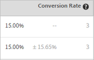

# Konverteringsgrad{#conversion-rate}

Konverteringsgrad, lyft, konfidensintervall (statistisk signifikans) och konfidensintervall rapporteras för varje upplevelse.

Följande bild visar diagramrubriken för en exempelaktivitet med rubrikerna [!UICONTROL Conversion Rate], [!UICONTROL Lift] och [!UICONTROL Confidence] markerade.

>[!NOTE]
>
>I alla data ignoreras dubblettorder om en `orderID` skickas. Revideringsrapporten innehåller en lista över ignorerade dubblettorder.

## Konverteringsgrad {#section_07A36846C4E84D0881906809B9CE5A74}

Visar mediankonverteringsfrekvens, konfidensintervall och antal konverteringar.

Titta till exempel i följande rapportkolumn för konverteringsgrad:

Den första raden är kontrollupplevelsen. Den visar en konverteringsgrad på 15 %, med tre konverteringar. Den andra raden, Experience B, visar en konverteringsgrad på 15 %, med ett konfidensintervall på plus eller minus 15,65 % och tre konverteringar.

>[!NOTE]
>
>För närvarande beräknas konfidensintervallet bara för binära värden.

## Lyft {#section_0F409572C720433D9378092ABC999982}

Jämför konverteringsgraden för varje upplevelse med kontrollupplevelsen.

Lyft = (Experience CR - Control CR) / Ctrl CR

Om kontrollen är 0, finns ingen procentuell lyft.

## Konfidentiellt (statistisk signifikans) {#section_35DB6724813D40C7B0808DE18FE595C1}

Detta tal representerar sannolikheten för att resultatet skulle dupliceras om testet kördes igen. Konfidensen avrundar till upp till 100,00 % när förtroendet är större än eller lika med 99,995 %.

Se [Konfidensnivå och konfidensintervall](/help/c-reports/conversion-rate.md#concept_0D0002A1EBDF420E9C50E2A46F36629B).

## Butiksdata {#section_30A674731BA6440E9BB93C421BE990EE}

AOV-, RPV- och Sales-data visas för varje upplevelse om du infogade en [monteringsorder](/help/c-implementing-target/c-implementing-target-for-client-side-web/t-mbox-download/orderconfirm-create.md) ( `orderConfirmPage`)-ruta och valde den som konverteringsruta.

## Konfidensnivå och konfidensintervall {#concept_0D0002A1EBDF420E9C50E2A46F36629B}

För varje upplevelse visas konfidensnivå och konfidensintervall.

Konverteringar och kontinuerliga variabler för Target-baserade mätvärden, som intäkter och engagemangsmått, beräknas enligt följande:

* **Konvertering:** Antingen ja eller nej
* **Alla andra:** värden i ett intervall

Du kan utföra offlineberäkningar för Analytics för Target (A4T), men det kräver ett steg med dataexporter i [!DNL Analytics]. Mer information finns i&quot;Utföra offlineberäkningar för analys av mål (A4T)&quot; nedan.

### Konfidensnivå {#section_26FE5E44BDD5478792A65FCFD83DCCDC}

*Konfidensnivån* representeras av den mörkare procentandelen i kolumnen Konverteringshastighet för varje upplevelse.

  

Konfidensnivån, eller den statistiska betydelsen, visar hur sannolikt det är att en upplevelses framgång inte beror på en chans. En högre konfidensnivå indikerar:

* Erfarenheten skiljer sig avsevärt från kontroll.
* Prestandan beror inte bara på brus.
* Om du körde testet igen kommer du förmodligen att se samma resultat.

Om konfidensnivån är över 90% eller 95%, kan resultatet anses vara statistiskt signifikant. Innan du fattar några affärsbeslut ska du försöka vänta tills exempelstorleken är tillräckligt stor och att de fyra konfidensintervallen för en eller flera upplevelser är konsekventa hela tiden för att säkerställa att resultaten är stabila.

>[!NOTE]
>
>Konfidensen avrundar till upp till 100,00 % när förtroendet är större än eller lika med 99,995 %.

### Konfidensintervall {#section_F582738DFE1648C78B93D81EBC6CACF7}

>[!NOTE]
>
>För närvarande beräknas konfidensintervallet bara för binära värden.

*konfidensintervallet* är ett intervall inom vilket det sanna värdet kan hittas på en given konfidensnivå. Konfidensintervallet visas som ett ljusgrått +/- procentvärde i kolumnen Konverteringsfrekvens. I exemplet nedan är konfidensintervallet för Experience B plus eller minus 15,65 %.

**Exempel:** En upplevelses RPV är 10 dollar, dess konfidensnivå är 95 % och dess  **konfidensnivå** motsvarar 5 till 15 dollar. Om vi testade detta flera gånger skulle RPV vara mellan 5 och 15 dollar.

**Vad påverkar konfidensintervallet?** Formeln följer statistiska standardmetoder för beräkning av konfidensintervall.

* **Samplingsstorlek:** När samplet växer krymps eller minskas intervallet. Detta är att föredra eftersom det innebär att dina rapporter närmar sig det verkliga värdet av framgångsmåttet.
* **Standardavvikelsen är mindre:** Mer likartade resultat, som liknande AOV:ar eller liknande nummer eller besökare som konverterar varje dag, minskar standardavvikelsen.

## Konfidenskalering och hur den utförs offline {#section_86F7C231943043A5B8B6BFE67B706E3B}

Den hämtade CSV-rapporten [innehåller endast rådata och inte beräknade värden, t.ex. intäkter per besökare, lyft eller konfidensgrad som används för A/B-tester.](/help/c-reports/downloading-data-in-csv-file.md#concept_3F276FF2BBB2499388F97451D6DE2E75)

Om du vill beräkna dessa beräknade värden hämtar du målets [Complete Confidence Calculator](/help/assets/complete_confidence_calculator.xlsx) Excel-fil för att ange aktivitetens värde, eller läser de [statistiska beräkningar som används av Target](/help/assets/statistical-calculations.pdf).

>[!NOTE]
>
>Den här räknaren används för målbaserad rapportering och inte för A4T-rapportering.

## Utföra offlineberäkningar för analys av mål (A4T) {#section_B34BD016C8274C97AC9564F426B9607E}

Du kan utföra offlineberäkningar för A4T, men det krävs ett steg med dataexporter i [!DNL Analytics].

För A4T använder vi Students t-test-beräkning för kontinuerliga variabler (i stället för binära värden). I Analytics spåras alltid en besökare, och alla åtgärder som vidtas räknas. Om besökaren köper flera gånger eller besöker ett framgångsmått flera gånger räknas de ytterligare träffarna. Detta gör mätvärdet till en kontinuerlig variabel. För att kunna utföra Students t-test-beräkning krävs&quot;summan av kvadrater&quot;. Det här kan hämtas från [!DNL Analytics]. Om du vill få summan av kvadratdata måste du utföra en export på besökarnivå för det mätresultat som du optimerar för, under en provtidsperiod.

Om du till exempel optimerar till sidvisningar per besökare, kan du exportera ett exempel på det totala antalet sidvisningar per besökare för en viss tidsperiod, kanske några dagar (ett par tusen datapunkter är allt du behöver). Därefter fyrkantiga varje värde och summerar summan (operationsordningen är viktig här). Värdet&quot;summan av kvadrater&quot; används sedan i Complete Confidence Calculator. Använd avsnittet &quot;intäkt&quot; i kalkylbladet för dessa värden.

**Så här använder du  [!DNL Analytics] dataexportfunktionen:**

1. Logga in på [!DNL Adobe Analytics].
1. Klicka på **[!UICONTROL Tools]** > **[!UICONTROL Data Warehouse]**.
1. Fyll i fälten på fliken **[!UICONTROL Data Warehouse Request]**.

   Mer information om de olika fälten finns i &quot;Data warehouse beskrivningar&quot; i [Data warehouse](https://experienceleague.adobe.com/docs/analytics/export/data-warehouse/data-warehouse.html).

   | Fält | Instruktioner |
   |--- |--- |
   | Namn på begäran | Ange ett namn för din begäran. |
   | Rapportdatum | Ange en tidsperiod och granularitet. Som bästa praxis bör du inte välja mer än en timme eller dag med data för din första förfrågan.  data warehouse-filer tar längre tid att bearbeta längre tid än vad som begärts, så det är alltid en god vana att begära data för en liten tidsperiod först för att vara säker på att filen returnerar det förväntade resultatet. Gå sedan till Request Manager, duplicera din begäran och be om fler data vid andra gången. Om du växlar granularitet till något annat än &quot;Inget&quot; ökar filstorleken drastiskt.  |
   | Tillgängliga segment | Använd ett segment efter behov. |
   | Uppdelningar | Välj önskade mått:  Standard är körklar (OTB), medan Custom innehåller eVars &amp; Props. Vi rekommenderar att du använder&quot;besökar-ID&quot; om information på besökar-ID-nivå behövs, i stället för&quot;Experience Cloud Visitor-ID&quot;.<ul><li>Besökar-ID är det sista ID som används av Analytics. Det blir antingen ett ID (om kunden är äldre) eller ett MID (om kunden är ny eller rensad på cookies sedan besökar-ID-tjänsten för MC startades).</li><li>Experience Cloud Visitor-ID kommer endast att anges för kunder som är nya eller rensade cookies sedan besöks-ID-tjänsten startades.</li></ul> |
   | Mått | Välj önskade mätvärden. Standard är OTB, medan Anpassad innehåller anpassade händelser. |
   | Förhandsgranska rapport | Granska inställningarna innan du schemalägger rapporten.  |
   | Schemalägg leverans | Ange en e-postadress som filen ska skickas till, ge filen ett namn och välj sedan [!UICONTROL Send Immediately]. Obs! Filen kan levereras via FTP under  [!UICONTROL Advanced Delivery Options] . |

1. Klicka på **[!UICONTROL Request this Report]**.

   Filhanteringen kan ta upp till 72 timmar, beroende på mängden data som begärs. Du kan när som helst kontrollera förloppet för din begäran genom att klicka på [!UICONTROL Tools] > [!UICONTROL Data Warehouse] > [!UICONTROL Request Manager].

   Om du vill begära om data som du har begärt tidigare kan du duplicera en gammal begäran från [!UICONTROL Request Manager] efter behov.

Mer information om [!DNL Data Warehouse] finns i följande länkar i hjälpdokumentationen för [!DNL Analytics]:

* [Skapa en begäran från Data warehouse](https://experienceleague.adobe.com/docs/analytics/export/data-warehouse/t-dw-create-request.html)
* [data warehouse bästa praxis](https://experienceleague.adobe.com/docs/analytics/export/data-warehouse/data-warehouse-bp.html)

## Räkningsmetod {#concept_EC19BC897D66411BABAF2FA27BCE89AA}

Du kan välja att visa rapporter med olika beräkningsmetoder för att förstå hur dina aktiviteter påverkar dina användare under deras livstid eller under en enda session.

Räkningsmetod stöds för följande aktivitetstyper:

* A/B-test

   Ett undantag är att A/B-aktiviteter med Automatiskt mål endast stöder standardmetoden för Besök.

* Experience Targeting (XT)
* Multivariata tester (MVT)

   För MVT-elementets bidragsrapport stöder inte Target aktivitetsexponeringar för intäktsmätningstyper.

* Recommendations

Endast standardmetoden för antal besök (Besök) stöds för närvarande för Automated Personalization-aktiviteter (AP).

Du kan visa rapporter med följande beräkningsmetoder:

* **Besökare:** En unik deltagare i aktiviteten, under aktivitetens hela livstid.

   En person räknas som ny deltagare om han eller hon besöker platsen från en ny dator eller en ny webbläsare. tar bort cookien, eller konverterar och återgår till aktiviteten med samma cookie. En deltagare identifieras av PCID i besökarens mbox-cookie. Om PCID ändras betraktas personen som en ny besökare.

* **Besök:** En unik deltagare i en upplevelse under en enstaka 30-minuters webbläsarsession.

   Om en besökare konverteras eller återkommer till webbplatsen efter att ha varit borta i minst 30 minuter räknas en återkommande besökare som ett nytt besök. Ett besök identifieras av `sessionID` i besökarens mbox-cookie. När `sessionID` ändras betraktas besöket som nytt.

* **Impression/sidvy:** Räknas varje gång en besökare läser in en sida i aktiviteten.

   Ett enda besök kan innehålla flera visningar av till exempel din hemsida.

>[!NOTE]
>
>Antalet bestäms vanligtvis av cookies och sessionsaktivitet. Om du når den sista konverteringspunkten för en aktivitet och sedan anger aktiviteten igen, betraktas du som en ny deltagare och ett nytt besök i aktiviteten. Detta gäller även om dina PCID- och `sessionID`-värden inte ändras.