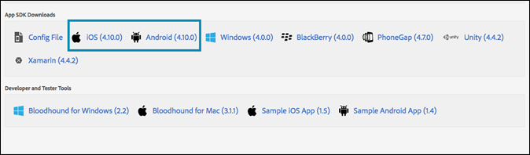

# Aktivera mål i SDK{#enable-target-in-the-sdk}

Lägg till Adobe Mobile Services SDK i din app.

1. Om du inte har installerat Adobe Mobile Services SDK i din app använder du inloggningsuppgifterna för Analytics eller Experience Cloud och hämtar SDK från webbplatsen [Adobe Mobile Services](https://mobilemarketing.adobe.com).

1. Lägg till Adobe Mobile Services SDK i din app.

   Instruktionerna finns under [Core Implementation och Lifecycle](https://experienceleague.adobe.com/docs/mobile-services/ios/getting-started-ios/dev-qs.html).

1. Lägg till klientkod, tidsgräns och aktivera SSL.

   Öppna Mobile Services i Experience Cloud och gå sedan till **[!UICONTROL Manage App Settings]** > **[!UICONTROL SDK Target Options]**.

   Lägg till din Target-klientkod och tidsgräns. Klientkoden är unik för ditt konto eller företag. Tidsgränsen är tiden i antal sekunder tills Target väntar på ett svar innan standardinnehållet visas. Kontrollera att alternativet **[!UICONTROL Use HTTPS]** är markerat på sidan Hantera appinställningar i Adobe Mobile Services. Om HTTPS inte är aktiverat blockeras alla anrop i iOS9+ om du inte tillåtslista målservern.

   

1. När du har skapat/hittat programmet kan du hitta programinställningarna och hämta önskat SDK.

   

>[!IMPORTANT]
>
> Om du inte har tillgång till gränssnittet för mobilmarknadsföring kan du göra ändringar direkt i konfigurationsfilen i appkoden; Den kommer dock inte att vara synkroniserad med inställningssidan i användargränssnittet.

