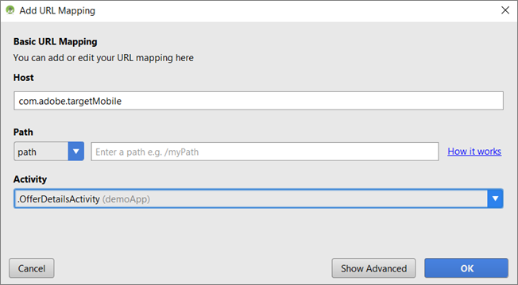
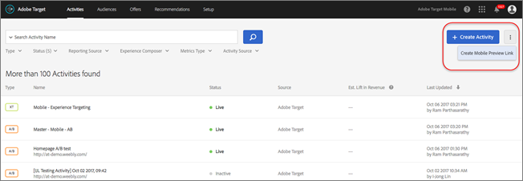

# Förhandsvisning av målmobiler{#target-mobile-preview}

Använd länken för förhandsgranskning av mobilmaterial för att enkelt skapa heltäckande QA för mobilappsaktiviteter och registrera dig för olika upplevelser direkt på din enhet utan några särskilda testenheter.

>[!NOTE]
>
>För funktionen för förhandsgranskning för mobila enheter krävs att du hämtar och installerar rätt version av version 4.14 (eller senare) av Adobe Mobile SDK.

## Översikt {#section_981D6FA4AEE64098809EA606E89E4A5E}

Med funktionen för mobilförhandsgranskning kan du testa mobilappsaktiviteterna innan du startar dem live.

## Förutsättningar {#section_A763C564C9E84B0EB448237B5B1E4068}

1. **Använd en version av SDK som stöds:** För funktionen för förhandsgranskning för mobila enheter måste du hämta och installera lämplig version av 4.14 (eller senare) av Adobe Mobile SDK i dina motsvarande program.

   Anvisningar om hur du hämtar rätt SDK finns i:

   * **iOS:** [Innan du börjar](https://experienceleague.adobe.com/docs/mobile-services/ios/getting-started-ios/requirements.html) i *hjälpen* för iOS-mobiltjänster.
   * **Android:** [Innan du börjar](https://experienceleague.adobe.com/docs/mobile-services/android/getting-started-android/requirements.html) i Android-hjälpen *för* Mobile Services.

1. **Konfigurera ett URL-schema:** Förhandsgranskningslänken använder ett URL-schema för att öppna programmet. Du måste ange ett unikt URL-schema för förhandsgranskningen.

   Följande bild är ett exempel på iOS:

   

   Följande bild är ett exempel på Android:

   

1. **Spåra Adobe DeepLink**

   **iOS:** I programdelegaten ska du anropa `[ADBMobile trackAdobeDeepLink:url` när delegaten ombeds öppna resursen med det URL-schema som angavs i föregående steg.

   Följande kodfragment är ett exempel:

   ```javascript
   - (BOOL) application:(UIApplication *)app openURL:(NSURL *)url 
                options:(NSDictionary<NSString *,id> *)options { 
   
       if ([[url scheme] isEqualToString:@"com.adobe.targetmobile"]) { 
           [ADBMobile trackAdobeDeepLink:url]; 
           return YES; 
       } 
       return NO; 
   } 
   ```

   **Android:** I appen anropar du `Config.trackAdobeDeepLink(URL);` när anroparen uppmanas att öppna resursen med det URL-schema som angavs i föregående steg.

   ```javascript
    private Boolean shouldOpenDeeplinkUrl() { 
        Intent appLinkIntent = getIntent(); 
        String appLinkAction = appLinkIntent.getAction(); 
        Uri appLinkData = appLinkIntent.getData; 
        if (appLinkData.toString().startsWith("com.adobe.targetmobile")) { 
            Config.trackAdobeDeepLink(appLinkData); 
            return true; 
        } 
        return false; 
     }
   ```

   Om du vill att Mobile Preview ska fungera för Android måste du även lägga till följande kodfragment i [!DNL AndroidManifest.xml]:

   ```javascript
   <activity android:name="com.adobe.marketing.mobile.FullscreenMessageActivity" />
   ```

## Skapa en förhandsgranskningslänk {#section_D9D58173FFF34E9BB75EBF357273F128}

1. Klicka på **[!UICONTROL More Options]** ikonen (tre lodräta ellipser) i målgränssnittet och markera sedan **[!UICONTROL Create Mobile Preview]**.

   

1. Markera de aktiviteter som du vill förhandsgranska och klicka sedan på **[!UICONTROL Generate Mobile Preview LInk]**.

   >[!NOTE]
   >
   >Endast formulärbaserade AB- och XT-aktiviteter kan väljas.

   

1. Ange appens URL-schema.

   Det här måste vara samma som i din iOS- eller Android-app. Upprepa den här processen separat för iOS och Android, om det behövs.

   

1. Klicka **[!UICONTROL Generate Mobile Preview Link]** och kopiera sedan länken.

   

## Förhandsgranska på din enhet {#section_521F0D46F3DE4A2A98283A1B73FF69F6}

Öppna länken i en mobilwebbläsare på en enhet där appen är installerad. Den här appen kan vara den produktionsapp du hämtade från Apple App Store eller Google Play. Det behöver inte vara en specialbyggnad. Om du har en aktiv förhandsgranskningslänk kan du visa upplevelserna på enheten.

1. Öppna länken i din webbläsare.

   Dela länken som du kopierade i föregående steg från målgränssnittet till den mobila enheten på ett smidigt sätt, till exempel med text, e-post eller Slack.

   |||

   Ditt program öppnas och målläget för mobilförhandsvisning startas.

1. Välj den kombination av upplevelser som du vill se och klicka sedan på **[!UICONTROL Launch Experiences]**.

   ||||
||||

## Begränsningar {#section_4E9BDED0F718485292527EFB508305BD}

* Vyn måste läsas in igen för att det nya innehållet ska visas när användaren klickar på [!UICONTROL Launch Experiences] knappen. Det enklaste sättet är att växla till en annan skärm och sedan gå tillbaka till skärmen där du väntar dig att ändringen ska ske.
* Mobilförhandsvisning stöds inte för Android-versioner tidigare än API-19 (KitKat).