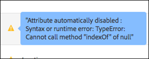

# Profilattribut{#profile-attributes}

Profilattribut är parametrar som är specifika för en besökare. Dessa attribut lagras i besökarens profil för att ge information om besökaren som kan användas i dina aktiviteter.

En användarprofil innehåller demografisk information och beteendeinformation om en besökare på en webbsida, t.ex. ålder, kön, köpta produkter, sista besökstillfället och så vidare, som Target använder för att anpassa det innehåll som besökaren ska använda.

När en besökare surfar på webbplatsen, eller när besökaren återgår till en annan session, kan de sparade profilattributen i profilen användas för att rikta innehåll eller logginformation för segmentfiltrering.

Så här ställer du in profilattribut:

1. Klicka på **[!UICONTROL Audiences]** > **[!UICONTROL Profile Scripts.]**

   

1. Klicka på **[!UICONTROL Create Script]**.

   

   Följande typer av profilattribut är tillgängliga:

   | Parametertyp | Beskrivning |
   |--- |--- |
   | mbox | Indata skickas direkt via sidkoden när mbox skapas. Se [Skicka parametrar till en global Mbox](/help/c-implementing-target/c-implementing-target-for-client-side-web/t-mbox-download/c-understanding-global-mbox/pass-parameters-to-global-mbox.md).<br>**Obs **: Target har en gräns på 50 unika profilattribut per mbox-anrop. Om du behöver skicka mer än 50 profilattribut till Target kan du skicka dem med API-metoden för profiluppdatering. Mer information finns i[Profiluppdatering i Adobe Target API-dokumentationen](http://developers.adobetarget.com/api/#updating-profiles). |
   | Profil | Definieras direkt med ett JavaScript-kodfragment. Dessa kan lagra summor som förbrukas av konsumenten och körs på varje mbox-begäran. Se Profilskriptattribut nedan. |

## Profilskriptattribut {#concept_8C07AEAB0A144FECA8B4FEB091AED4D2}

Definiera ett profilskriptattribut med tillhörande JavaScript-kodfragment.

Du kan använda profilskript för att hämta besökarattribut vid flera besök. Profilskript är kodfragment som definieras i Target med en form av JavaScript på serversidan. Du kan till exempel använda ett profilskript för att ta reda på hur ofta en besökare besöker webbplatsen och när de senast besöktes.

Profilskript är inte desamma som profilparametrar. Profilparametrar samlar in information om besökare som använder mbox-kodimplementeringen i Target.

## Skapa profilskript {#section_CB02F8B97CAF407DA84F7591A7504810}

Profilskript finns på fliken [!UICONTROL Audiences] i [!DNL Target] gränssnittet.

Om du vill lägga till ett nytt profilskript klickar du på **[!UICONTROL Profile Scripts]** fliken **[!UICONTROL Create Script]** och skriver sedan skriptet.

eller

Om du vill kopiera ett befintligt profilskript håller du pekaren över det önskade skriptet i [!UICONTROL Profile Scripts] listan och klickar sedan på **[!UICONTROL Copy]** ikonen: 

Sedan kan ni redigera målgruppen för att skapa en liknande målgrupp.


Profilskript kör profilattributet &quot;catchers&quot; på varje platsbegäran. När en platsbegäran tas emot avgör Target vilken aktivitet som ska köras och visar innehåll som är lämpligt för den aktiviteten och den upplevelsen, spårar aktivitetens framgång och kör relevanta profilskript. På så sätt kan du spåra information om besöket, t.ex. besökarens plats, tid på dagen, antal gånger besökaren har besökt webbplatsen, om han eller hon har köpt tidigare och så vidare. Den här informationen läggs sedan till i besökarprofilen så att du bättre kan spåra besökarens aktivitet på webbplatsen.

Profilskriptattribut har infogats som `user.` -tagg före attributnamnet. Exempel:

```
if (mbox.name == 'Track_Interest') { 
    if (profile.get('model') == "A5" &&; profile.get('subcat') == "KS6") { 
        return (user.get('A5KS6') || 0) + 1; 
    } 
}
```

Tänk på följande:

* Se profilskriptattributen (inklusive sig själv) i koden med `user.get('parameterName')`
* Spara variabler som kan nås nästa gång skriptet körs (på nästa mbox-begäran) med `user.setLocal('variable_name', 'value')`. Referera variabeln med `user.getLocal('variable_name')`. Detta är användbart i situationer där du vill referera till datumet och tiden för den senaste begäran.
* Parametrar och värden är skiftlägeskänsliga. Matcha skiftläget för de parametrar och värden som du får under aktiviteten eller testet.
* Mer JavaScript-syntax finns i avsnittet&quot;JavaScript-referens för skriptprofilparametrar&quot; nedan.
* Parametern finns kvar i profilen när skriptet har inaktiverats. Användare vars profiler redan innehåller en parameter som används i en aktivitets målgrupp kvalificeras för den aktiviteten.
* Profilskript kan inte tas bort medan de används i en aktivitet.
* Du bör inte skapa beroende profilskript som använder resultatet av ett profilskript i ett annat profilskript. Körningsordningen för profilskript är inte garanterad.

## Visa informationskort för profilskript {#section_18EA3B919A8E49BBB09AA9215E1E3F17}

Du kan visa profilskriptinformationskort på ungefär samma sätt som informationskort. Dessa profilskriptinformationskort gör att du kan visa en lista över aktiviteter som refererar till det valda profilskriptet, tillsammans med andra användbara metadata.

Följande profilskriptinformationskort nås till exempel genom att du hovrar över ett profilskript i profilskriptlistan (Publiker > Profilskript) och sedan klickar på ikonen Info.

Fliken innehåller följande information: [!UICONTROL Script Info] Namn, status, tokentyp, skript-ID, ändringslogg och beskrivning.


På fliken [!UICONTROL Script Usage] visas de aktiviteter (och deras arbetsytor) som refererar till det valda profilskriptet.


>[!NOTE]
>
>Fliken Skriptanvändning visar inte aktiviteter som refererar till det valda profilskriptet i följande situationer:
>
> * Aktiviteten är i utkastläge.
> * Innehållet eller erbjudandet som används i aktiviteten använder skriptvariabler (antingen ett infogat erbjudande inom aktiviteten eller ett erbjudande inom erbjudandebiblioteket).


## Target inaktiverar profilskript i vissa situationer {#section_C0FCB702E60D4576AD1174D39FBBE1A7}

[!DNL Target] inaktiverar automatiskt profilskript i vissa situationer, t.ex. om det tar för lång tid att köra dem eller om de har för många instruktioner.

När ett profilskript är inaktiverat visas en gul varningsikon bredvid profilskriptet i Target-gränssnittet, vilket visas nedan:


Vid hovring visas information om felet, enligt bilden nedan:



Vanliga orsaker till att systemet inaktiverar profilskript är:

* En odefinierad variabel som refereras.
* Ett ogiltigt värde refereras. Detta beror ofta på att URL-värden refereras och andra användarindata inte validerats korrekt.
* För många JavaScript-instruktioner används. Target har en gräns på 2 000 JavaScript-instruktioner per skript, men detta kan inte beräknas genom manuell läsning av JavaScript. Till exempel behandlar Rhino alla funktionsanrop och&quot;nya&quot; anrop som 100 instruktioner. Det innebär att alla anrop till en funktion kräver 100 instruktioner. Storleken på alla postdata, t.ex. URL-värden, kan också påverka antalet instruktioner.
* Följande objekt är inte markerade i avsnittet om [bästa praxis](../../c-target/c-visitor-profile/profile-parameters.md#section_64AFE5D2B0C8408A912FC2A832B3AAE0) nedan.

## God praxis {#best}

Följande riktlinjer är avsedda att hjälpa dig att skriva förenklade profilskript som är så felfria som möjligt genom att skriva kod som inte fungerar på ett bra sätt så att skripten bearbetas utan att ett systemskript behöver avbrytas. Riktlinjerna är ett resultat av bästa praxis som har visat sig fungera effektivt. Dessa riktlinjer ska tillämpas tillsammans med de principer och rekommendationer som har utarbetats av utvecklingssamfundet i Rhino.

* Ställ in det aktuella skriptvärdet på en lokal variabel i användarskriptet och ställ in en failover-sträng på en tom sträng.
* Validera den lokala variabeln genom att kontrollera att den inte är en tom sträng.
* Använd strängbaserade redigeringsfunktioner jämfört med reguljära uttryck.
* Använd begränsat för slingor kontra öppna slut för eller while-slingor.
* Högst 1 300 tecken eller 50 upprepningar av slingor.
* Använd inte fler än 2 000 JavaScript-instruktioner. Target har en gräns på 2 000 JavaScript-instruktioner per skript, men detta kan inte beräknas genom manuell läsning av JavaScript. Till exempel behandlar Rhino alla funktionsanrop och&quot;nya&quot; anrop som 100 instruktioner. Storleken på alla postdata, t.ex. URL-värden, kan också påverka antalet instruktioner.
* Tänk inte bara på skriptprestanda, utan även på den kombinerade prestandan för alla skript. Vi rekommenderar sammanlagt färre än 5 000 instruktioner. Att räkna antalet instruktioner är inte uppenbart, men det viktiga att notera är att skript som överskrider 2 000 instruktioner automatiskt inaktiveras. Antalet aktiva profilskript får inte överstiga 300. Varje skript körs med varje enskilt mbox-anrop. Kör bara så många skript som behövs.
* I ett regex med en punktstjärna i början (t.ex.: `/.*match/`, `/a|.*b/`) behövs nästan aldrig. Regex-sökningen startar från alla positioner i en sträng (om den inte är bunden till `^`), så punktstjärnan antas redan. Skriptkörningen kan avbrytas om en sådan regex matchas med tillräckligt många indata (vilket kan vara så lågt som flera hundra tecken).
* Om allt misslyckas omsluter du skriptet i en try/catch.
* Följande rekommendationer kan hjälpa dig att begränsa komplexiteten i profilskript. Profilskript kan köra ett begränsat antal instruktioner.

   Bästa praxis:

   * Håll profilskripten så små och enkla som möjligt.
   * Undvik reguljära uttryck eller använd endast mycket enkla reguljära uttryck. Även enkla uttryck kan ta många instruktioner att utvärdera.
   * Undvik rekursion.
   * Profilskript bör prestandatestas innan de läggs till i Target. Alla profilskript körs på varje mbox-begäran. Om profilskript inte körs korrekt tar det längre tid att köra mbox-begäranden. Detta kan påverka trafik och konvertering.
   * Om profilskript blir för komplexa bör du i stället använda [svarstoken](/help/administrating-target/response-tokens.md) .

* Mer information finns i dokumentationen för JS Rhino-motorn: [https://www.mozilla.org/rhino/doc.html](https://www.mozilla.org/rhino/doc.html).

## Felsöka profilskript {#section_E9F933DE47EC4B4E9AF2463B181CE2DA}

Följande metoder kan användas för att felsöka profilskript:

>[!NOTE]
>
>Profilvärdet genereras inte när du använder [!DNL console.log] i ett profilskript eftersom profilskript körs på serversidan.

* **Lägg till profilskript som svarstoken till felsökningsprofilskript:**

   I Target klickar du **[!UICONTROL Administration]** på, klickar **[!UICONTROL Response Tokens]** och aktiverar sedan det profilskript som du vill felsöka.

   När du läser in en sida för webbplatsen med Target på den innehåller en del av svaret från Target ditt värde för det angivna profilskriptet, vilket visas nedan:

   

* **Använd mboxTrace Debugging Tool för att felsöka profilskript.**

   Den här metoden kräver en auktoriseringstoken som du kan generera genom att klicka **[!UICONTROL Target]** > **[!UICONTROL Administration]** > **[!UICONTROL Implementation]** > **[!UICONTROL Generate Authorization Token]** i [!UICONTROL Debugger tools] avsnittet.

   Sedan lägger du till de här två parametrarna i sidans URL efter &quot;?&quot;: `mboxTrace=window&authorization=YOURTOKEN`.

   Detta är lite mer informativt än svarstoken eftersom du får en ögonblicksbild som tagits före körningen och en ögonblicksbild av din profil. Här visas även alla tillgängliga profiler.

   

## Vanliga frågor om profilskript {#section_1389497BB6D84FC38958AE43AAA6E712}

**Går det att använda profilskript för att hämta information från en sida som finns i ett datalager?**

Profilskript kan inte läsa sidan direkt eftersom de körs på serversidan. Data måste skickas in via en mbox-begäran eller via andra [metoder för att hämta data till Target](../../c-implementing-target/c-considerations-before-you-implement-target/c-methods-to-get-data-into-target/methods-to-get-data-into-target.md#concept_0069C0EFB56C4700BB33F2F35C2B9B17). När data finns i Target kan profilskript läsa data som en mbox-parameter eller profile-parameter.

## JavaScript-referens för skriptprofilparametrar

Enkel Javascript-kunskap krävs för att effektivt använda skriptprofilparametrar. Det här avsnittet är en snabb referens som gör dig produktiv med den här funktionen på bara några minuter.

Skriptprofilsparametrar finns under fliken mboxes/profiles. Du kan skriva JavaScript-program som returnerar alla JavaScript-typer (sträng, heltal, array o.s.v.).

### Exempel på parametrar för skriptprofil {#examples}

**Namn:** *user.recency*

```
var dayInMillis = 3600 * 24 * 1000;
if (mbox.name == 'orderThankyouPage') {
    user.setLocal('lastPurchaseTime', new Date().getTime());
}
var lastPurchaseTime = user.getLocal('lastPurchaseTime');
if (lastPurchaseTime) {
    return ((new Date()).getTime() - lastPurchaseTime) / dayInMillis;
}
```

Skapar en variabel för dag mätt i millisekunder. Om mbox-namnet är `orderThankyouPage`anger du ett lokalt (osynligt) användarprofilattribut med namnet `lastPurchaseTime` som ska ha värdet för aktuellt datum och tid. Värdet för den senaste inköpstiden läses, och om den är definierad returnerar vi den tid som har gått sedan den senaste inköpstiden, dividerad med antalet millisekunder i en dag (vilket ger antalet dagar sedan det senaste köpet).

**Namn:** *user.frequency*

```
var frequency = user.get('frequency') || 0;
if (mbox.name == 'orderThankyouPage') {
    return frequency + 1;
}
```

Skapar en variabel som heter `frequency`och initierar den till antingen det tidigare värdet eller 0, om det inte fanns något tidigare värde. Om mbox-namnet är `orderThankyouPage`returneras det stegvisa värdet.

**Namn:** *user.monetärValue*

```
var monetaryValue = user.get('monetaryValue') || 0;
if (mbox.name == 'orderThankyouPage') {
    return monetaryValue + parseInt(mbox.param('orderTotal'));
}
```

Skapar en variabel med namnet `monetaryValue`och söker upp det aktuella värdet för en viss besökare (eller anger 0 om det inte fanns något tidigare värde). Om mbox-namnet är `orderThankyouPage`, returneras ett nytt monetärt värde genom att det föregående värdet läggs till och värdet på den `orderTotal` parameter som skickas till mbox.

**Namn:** adobeQA

```
if (page.param("adobeQA"))
     return page.param("adobeQA");
else if (page.param("adobeqa"))
     return page.param("adobeqa");
else if (mbox.param("adobeQA"))
     return mbox.param("adobeQA");
```

Skapar en variabel som anropas `adobeQA` för att spåra en användare för [Activity QA](/help/c-activities/c-activity-qa/activity-qa.md).

### Objekt och metoder

Följande egenskaper och metoder kan refereras av parametrar för skriptprofiler:

| Objekt eller metod | Detaljer |
| --- | --- |
| `page.url` | Aktuell URL. |
| `page.protocol` | Protokollet som används för sidan (http eller https). |
| `page.domain` | Den aktuella URL-domänen (allt före det första snedstrecket). Till exempel `www.acme.com` i `http://www.acme.com/categories/men_jeans?color=blu e&size=small`. |
| `page.query` | Frågesträngen för den aktuella sidan. Allt efter&quot;?&quot;. Till exempel `blue&size=small` i `http://www.acme.com/categories/mens_jeans?color=blue&size=small`. |
| `page.param(‘<par_name>’)` | Värdet på parametern som anges av `<par_name>`. Om din nuvarande URL är Googles söksida och du har angett `page.param('hl')`en, får du &quot;en&quot; för URL:en `http://www.google.com/search?hl=en& q=what+is+asdf&btnG=Google+Search`. |
| `page.referrer` | Samma uppsättning åtgärder som ovan gäller för hänvisaren och landningen (dvs. referrer.url är referentens URL-adress). |
| `landing.url`, `landing.protocol`, `landing.query`och `landing.param` | Liknar sidan, men för landningssidan. |
| `mbox.name` | Den aktiva mbox-namnet. |
| `mbox.param(‘<par_name>’)` | En mbox-parameter med det angivna namnet i den aktiva mbox. |
| `profile.get(‘<par_name>’)` | Den klientskapade användarprofilsparametern efter namnet `<par_name>`. Om användaren till exempel anger en profilparameter med namnet &quot;kön&quot; kan värdet extraheras med &quot;profile.kön&quot;. Returnerar värdet för &quot;`profile.<par_name>`&quot;-uppsättningen för den aktuella besökaren. returnerar null om inget värde har angetts. Observera att `profile.get(<par_name>)` är kvalificerat som ett funktionsanrop. |
| `user.get(‘<par_name>’)` | Returnerar värdet för &quot;`user.<par_name>`&quot;-uppsättningen för den aktuella besökaren. returnerar null om inget värde har angetts. |
| `user.categoryAffinity` | Returnerar namnet på den bästa kategorin. |
| `user.categoryAffinities` | Returnerar en array med de bästa kategorierna. |
| `user.isFirstSession` | Returnerar true om det är besökarens första session. |
| `user.browser` | Returnerar user-agent i HTTP-huvudet. Du kan till exempel skapa ett uttrycksmål som enbart riktar sig till Safari-användare: `if (user.browser != null && user.browser.indexOf('Safari') != -1) { return true; }` |

### Vanliga operatorer


Alla vanliga JavaScript-operatorer finns och kan användas. JavaScript-operatorer kan användas på strängar och tal (samt andra datatyper). En kort genomgång:

| Operator | Beskrivning |
| --- | --- |
| `==` | Anger likhet. Innehåller true när operanderna på båda sidor är lika. |
| `!=` | Anger olikhet. Innehåller true när operanderna på båda sidor inte är lika. |
| `<` | Anger att variabeln till vänster är mindre än variabeln till höger. Utvärderar till false om variablerna är lika. |
| `>` | Anger att variabeln till vänster är större än variabeln till höger. Utvärderar till false om variablerna är lika. |
| `<=` | Samma som `<` , förutom om variablerna är lika, utvärderas de till true. |
| `>=` | Samma som `>` , förutom om variablerna är lika, utvärderas de till true. |
| `&&` | Logiskt &quot;AND&quot;-uttryck till vänster och höger om det - är bara true när båda sidorna är sanna (annars false). |
| `||` | Logiskt &quot;OR&quot; är uttrycken till vänster och höger om det bara sant om en av sidorna är sann (annars false). |
| `//` | Kontrollerar om källan innehåller alla element från booleska målvärden (Array source, Array target).<br>`//` extraherar delsträngen från målet (motsvarande regexp) och avkodar den `Array/*String*/ decode(String encoding, String regexp, String target)`.<br>Funktionen stöder också användning av konstanta strängvärden, gruppering (`condition1 || condition2) && condition3`och reguljära uttryck (`/[^a-z]$/.test(landing.referring.url)`). |

## Utbildningsvideo: Profilskript - 

Den här videon innehåller information om hur du använder och skapar profilskript.

* Förklara vad ett profilskript är
* Förklara hur ett profilskript skiljer sig från en profilparameter
* Skapa ett enkelt profilskript
* Använd menyn Tillgänglig token för att komma åt tillgängliga alternativ
* Aktivera och inaktivera profilskript

>[!VIDEO](https://video.tv.adobe.com/v/17394)
