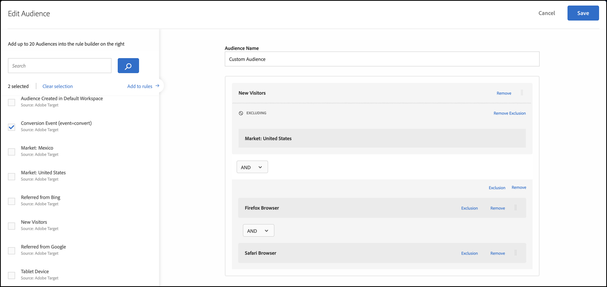
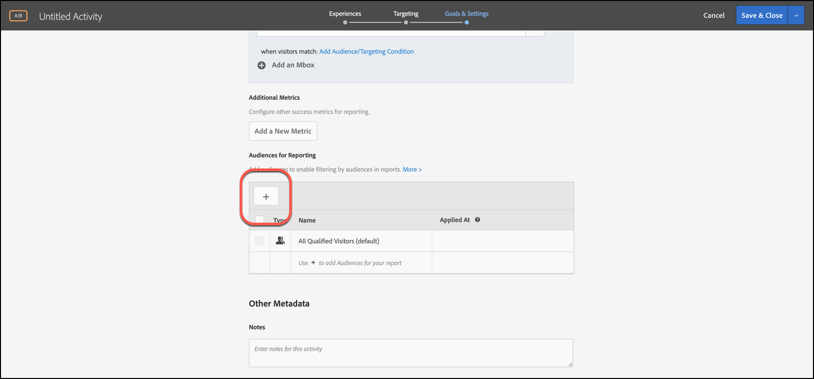

# Kombinera flera målgrupper{#combine-multiple-audiences}

Kombinera olika målgrupper (inklusive Adobe Experience Cloud-målgrupper och målgrupper) snabbt och enkelt för att skapa ad hoc-målgrupper. Du kan också skapa exkluderingsregler och exkludera målgrupper från en regel.

Anta att du har en&quot;New Visitors&quot;-målgrupp och en&quot;Chrome Users&quot;-målgrupp. För en viss aktivitet kanske du vill kombinera dessa befintliga målgrupper för att rikta in dig på nya besökare med Chrome-webbläsare. I stället för att skapa en tredje målgrupp och lagra den i [!UICONTROL Audiences] biblioteket kan du kombinera dessa två målgrupper när du skapar en aktivitet eller redigerar en befintlig aktivitet.

Som ett annat exempel kan ni inrikta er på alla lojalitetskunder genom att inkludera ett specifikt [!DNL Audience Manager] segment för lojalitetsstatus och kombinera det med ett [!DNL Target] segment bestående av personer som har registrerat sig för ditt lojalitetsprogram under den aktuella sessionen, i stället för att skapa en tredje permanent målgrupp.

Du kan kombinera upp till tio målgrupper med operatorerna AND och OR.

Du kan skapa och använda kombinerade målgrupper på olika platser i [!DNL Target] användargränssnittet.

## Skapa en kombinerad målgrupp när du skapar en aktivitet {#section_2F1CE9434CC04174B4BA2BFC89B85D77}

Du kan skapa en ad hoc-målgrupp på aktivitetens [!UICONTROL Target] sida under det guidade arbetsflödet i tre steg.

1. När du skapar en [aktivitet](../c-activities/activities.md#concept_D317A95A1AB54674BA7AB65C7985BA03)klickar du på de tre lodräta ellipserna på **[!UICONTROL Target]** sidan och sedan på **[!UICONTROL Replace Audience]**.

   

1. På [!UICONTROL Choose Audience] sidan markerar du kryssrutorna bredvid de målgrupper du vill använda som byggstenar för den kombinerade målgruppen.

   

1. Klicka **[!UICONTROL Combine Multiple Audiences]** i det övre högra hörnet.

   

1. (Villkorligt) Redigera den nya kombinerade målgruppen efter behov.

   I [!UICONTROL Edit Audience] dialogrutan kan du dra och släppa ytterligare målgruppsbyggen från vänster sida till den nya kombinerade målgruppen samt lägga till undantagsregler och exkludera målgrupper.

   1. Du kan använda dra-och-släpp-funktioner för att lägga till målgrupper i ett befintligt avsnitt som en nivå 2-byggsten. Om du vill lägga till ett byggblock på nivå 1 markerar du kryssrutan bredvid den önskade målgruppen och klickar sedan på **[!UICONTROL Add to Rules]**.

      Anta till exempel att du i föregående exempel nu vill inkludera Safari-användare i den kombinerade publiken. Sök efter och dra målgruppen&quot;Safari Browser&quot; till rutan&quot;Firefox Browser&quot; till höger, som i följande exempel:

      

      Observera att operatorn mellan de två målgrupperna av webbläsartyp är&quot;AND&quot;. Välj listrutan And och ändra den till &quot;OR&quot; för att skapa en ny kombinerad målgrupp för nya besökare med Firefox eller Safari. Undvik att skapa regler som utesluter alla potentiella målgruppsmedlemmar. Det är till exempel inte möjligt för någon att besöka en sida med Firefox och Safari samtidigt.

      >[!NOTE]
      >
      >Operatorn (AND eller OR) måste vara densamma som du kombinerar målgrupper. Du kan inte blanda och matcha operatorer.

   1. Om du vill lägga till ett undantag för en regel klickar du på **[!UICONTROL Exclusion]** > **[!UICONTROL Add Exclusion]**.

      

      Dra och släpp en målgrupp i paketet:

      

      Om du till exempel vill utesluta besökare från USA från nya besökare kan du dra Market: Amerikansk publik i lådan, som visas nedan:

      

      Den här kombinerade publiken innehåller alla nya besökare på din webbplats (utom de som kommer från San Francisco) som använder Safari eller Firefox.

   1. Om du vill utesluta en målgrupp från en regel klickar du på **[!UICONTROL Exclusion]** > **[!UICONTROL Exclude this Audience.]**.

      Du kan till exempel skapa en kombinerad publik som innehåller alla nya besökare på webbplatsen, förutom de som använder Firefox. Det är enklare och snabbare att utesluta besökare som använder Firefox än att skapa en kombinerad publik som uttryckligen inkluderar flera webbläsare (Safari, Chrome och Internet Explorer), men inte Firefox.

1. Ange ett beskrivande namn för den kombinerade målgruppen och klicka sedan på **[!UICONTROL Save]**.

## Skapa en kombinerad målgrupp som kan användas för målinriktning mot mätvärden {#section_A42E795AFCBD4575809C5942039910F0}

Du kan skapa en ad hoc-målgrupp på aktivitetens [!UICONTROL Goals & Settings] sida som ska användas för målinriktning mot mätvärden. Om du till exempel vill skapa mål baserat på konvertering med en kombinerad målgrupp:

1. När du redigerar eller skapar en [aktivitet](../c-activities/activities.md#concept_D317A95A1AB54674BA7AB65C7985BA03)väljer du **[!UICONTROL Goals & Settings]** som framgångsmått på **[!UICONTROL Conversion]** sidan och väljer sedan **[!UICONTROL Viewed an Mbox]** åtgärden.
1. Markera önskad mbox i **[!UICONTROL Search mbox]** fältet.

   

1. Klicka på kugghjulsikonen och sedan på **[!UICONTROL Add Audience Targeting]**.
1. Klicka på **[!UICONTROL Add Audience/Targeting Condition]** länken för att visa [!UICONTROL Choose Audience] dialogrutan.

   

1. Fortsätt med [steg 2](../c-target/combining-multiple-audiences.md#section_2F1CE9434CC04174B4BA2BFC89B85D77) under&quot;Skapa en kombinerad publik medan du skapar en aktivitet&quot; för att skapa den kombinerade målgruppen.

## Skapa en kombinerad publik som kan användas i rapporter {#section_4682D342EFBB43C38E54B99B3A1E14CD}

Du kan skapa en ad hoc-målgrupp på aktivitetens [!UICONTROL Goals & Settings] sida som ska användas för rapportering.

1. När du redigerar eller skapar en [aktivitet](../c-activities/activities.md#concept_D317A95A1AB54674BA7AB65C7985BA03)klickar du på **[!UICONTROL Goals & Settings]** ikonen under på **[!UICONTROL Add Audience]** sidan [!UICONTROL Audiences for Reporting] för att visa [!UICONTROL Choose Audience] sidan.

   

1. Fortsätt med [steg 2](../c-target/combining-multiple-audiences.md#section_2F1CE9434CC04174B4BA2BFC89B85D77) under&quot;Skapa en kombinerad publik medan du skapar en aktivitet&quot; för att skapa den kombinerade målgruppen.

## Skapa en kombinerad målgrupp när du redigerar en aktivitet {#section_364A12CE96E04B61B7C18113AA586C2C}

Du kan skapa en ad hoc-målgrupp samtidigt som du redigerar en befintlig aktivitet.

1. Håll markören över den önskade aktiviteten på [!UICONTROL Activities] sidan och klicka sedan på **[!UICONTROL Edit]** ikonen .

   eller

   Klicka på önskad aktivitet för att öppna den och klicka sedan på **[!UICONTROL Edit Activity]**.

1. Klicka på **[!UICONTROL Configure]** > **[!UICONTROL Audiences]** > **[!UICONTROL Multiple Audiences]**.

   

1. Klicka på ikonen med fler alternativ (tre lodräta ellipser) bredvid aktivitetens aktuella målgrupp och klicka sedan på **[!UICONTROL Change Audience]**.

   

1. Fortsätt med [steg 2](../c-target/combining-multiple-audiences.md#section_2F1CE9434CC04174B4BA2BFC89B85D77) under&quot;Skapa en kombinerad publik medan du skapar en aktivitet&quot; för att skapa den kombinerade målgruppen.