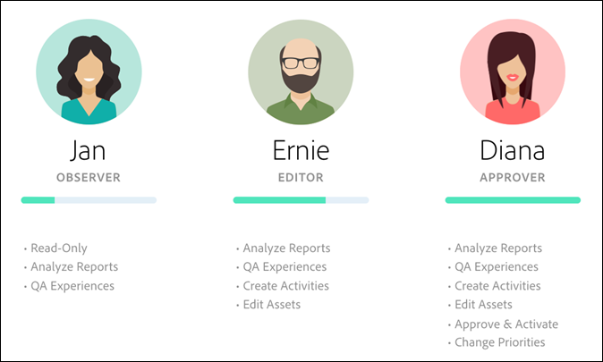

# Enterprise-användarbehörigheter

Enterprise-användarbehörigheter är ett sätt att formellt administrera företagsövergripande användaråtkomst till [!DNL Adobe Target]. Lägg till användare i [!DNL Target], tilldela behörigheter baserat på deras roller och skapa arbetsytor för team baserat på olika avdelningar, globala platser, kanaler och andra logiska grupperingar. Du kan tilldela användare rollerna för [!UICONTROL Observer], [!UICONTROL Editor], [!UICONTROL Approver] eller [!UICONTROL Publisher].

{{permissions-update}}

## Avgör om du har åtkomst till företagsanvändarbehörigheter

>[!NOTE]
>
>[!UICONTROL Properties and Permissions]-funktionaliteten är tillgänglig som en del av [!DNL Target] Premium-lösningen. De är inte tillgängliga i [!DNL Target] Standard utan en [!DNL Target] Premium-licens.
>
>Implementeringen av [!DNL Target] kan använda vilken version som helst av at.js eller [!DNL Adobe Experience Platform Web SDK].

Du kan se om din organisation har en Standard- eller Premium-licens genom att klicka på länken [!UICONTROL Administration] högst upp i [!DNL Target]-gränssnittet.

* **[!DNL Target Standard]Kunder**: Om du ser fliken [!UICONTROL Users] ([!UICONTROL Administration > Users]) (och inte fliken [!UICONTROL Properties]) har din organisation en [!DNL Target Standard]-licens. [!DNL Target Standard]-kunder bör följa instruktionerna i [Användare](/help/main/administrating-target/c-user-management/c-user-management/user-management.md) för att lägga till användare och tilldela behörigheter i [!DNL Adobe Admin Console].

* **[!DNL Target Premium]Kunder**: Om du ser fliken [!UICONTROL Properties] ([!UICONTROL Administration > Properties]) och fliken [!UICONTROL Users] har din organisation en [!DNL Target Premium]-licens. [!DNL Target Premium]-kunder bör följa instruktionerna i den här artikeln och i [Konfigurera företagsbehörigheter](/help/main/administrating-target/c-user-management/property-channel/properties-overview.md).

## Innan du börjar använda företagsbehörigheter

>[!IMPORTANT]
>
>Läs avsnittet [Caveats](/help/main/administrating-target/c-user-management/property-channel/property-channel.md#section_9714311B1CD9497A86F4910F8AE635E2) nedan innan du fortsätter med företagsbehörigheter.

## Termer och definitioner som används i detta avsnitt {#section_F8D229544FEA41C3BC2EFD1F95AA0116}

Följande termer används i hela det här avsnittet och kan vara nya för användare som vill använda funktionerna för egenskaper och behörigheter i [!DNL Target] Premium.

### Egenskap

Egenskaper liknar egenskaper inom [!DNL Adobe Experience Platform] på så sätt att de använder ett unikt kodfragment för att särskilja dem.

En webbegenskap är ett bibliotek med regler och en inbäddningskod. En webbegenskap kan vara vilken gruppering som helst av en eller flera domäner och underdomäner.

Egenskaper aktiveras genom att ett specifikt namn/värde-par läggs till som en parameter med ett anrop (Target call, api call, osv.) till [!DNL Target].

Egenskaperna tillhör specifika kanaler (webb, mobil, e-post eller API/annan).

### Workspace (produktprofil) {#workspace}

Med en arbetsyta kan en organisation tilldela en viss uppsättning användare till en viss uppsättning egenskaper. På många sätt liknar en arbetsyta en rapportserie i [!DNL Adobe Analytics].

Obs! Arbetsytor kallas [!UICONTROL Product Profiles] i [!DNL Adobe Admin Console for Enterprise].

Om du är en del av en flernationell organisation kan du ha en arbetsyta för dina europeiska webbsidor, egenskaper eller webbplatser och en annan arbetsyta för dina amerikanska webbsidor, egenskaper eller webbplatser. Om du är en del av en organisation med flera varumärken kan du ha en separat arbetsyta för varje varumärke.

Användare kan ingå i flera arbetsytor och kan till och med ha olika roller inom varje arbetsyta.

Användare kan ha olika vyer av [!DNL Adobe Target] genom att flytta mellan arbetsytor, på samma sätt som [!DNL Analytics] användare har olika vyer av [!DNL Analytics] genom att flytta mellan olika rapportsviter.

Arbetsytor kan innehålla helt olika målgrupper, koderbjudanden och aktiviteter.

Alla målgrupper och aktiviteter som skapats före migreringen av den nya Enterprise Permissions-modellen grupperas i&quot;Default Workspace&quot;, som beskrivs nedan.

Alla aktiviteter som skapas via [!DNL Adobe Experience Manager] (AEM), [!DNL Adobe Mobile Services] och [!DNL Adobe Target Classic] är en del av&quot;Default Workspace&quot;.

### Standardarbetsyta

Alla befintliga arbetsytor (produktprofiler) i [!DNL Admin Console] sammanfogas till en enda arbetsyta som kallas&quot;Default Workspace&quot; när din organisation migrerar till den nya Enterprise Permissions-modellen.

>[!IMPORTANT]
>
>Ta inte bort Workspace Standard.

Alla användarroller och åtkomst till alla [!DNL Target]-funktioner är desamma som de var innan migreringen till den nya Enterprise Permissions-modellen.

### Användargrupper

Du kan skapa användargrupper, till exempel utvecklare, analytiker, marknadsförare och chefer. Sedan kan du tilldela behörigheter för flera Adobe-produkter och arbetsytor. Att tilldela en ny teammedlem alla behörigheter som krävs för olika Adobe-produkter kan vara lika enkelt som att lägga till dem i en viss användargrupp.

### Roller och behörigheter {#roles-permissions}

Roller och behörigheter avgör vilka åtkomstnivåer användare har för att skapa och hantera aktiviteter i din [!DNL Target]-implementering. I [!DNL Target] innehåller rollerna följande:

| Roll | Beskrivning |
|--- |--- |
| [!UICONTROL Approver] | Kan skapa, redigera och aktivera eller stoppa aktiviteter. |
| [!UICONTROL Editor] | Kan skapa och redigera aktiviteter innan de är aktiva, men kan inte godkänna att en aktivitet startas. |
| [!UICONTROL Observer] | Kan visa aktiviteter, men kan inte skapa eller redigera dem. |
| [!UICONTROL Publisher] | Liknar rollen [!UICONTROL Observer] (kan visa aktiviteter, men inte skapa eller redigera dem). Rollen [!UICONTROL Publisher] har dock ytterligare behörighet att aktivera aktiviteter. |

### Kanal

Kanalen refererar till innehållstypen för var dina [!DNL Target]-aktiviteter levereras: webbsidor, mobilappar, e-postmeddelanden och så vidare.

När du skapar en aktivitet skapas den i den markerade arbetsytan. Du ser alternativ för kanalval i den första dialogrutan där du kan välja önskad kanal för aktiviteten: Web, Mobile App, Email eller Other/API.

## Översikt över behörigheter {#section_DC2172520DA84605B218A5E9FB6D187A}

Följande information förklarar hur behörigheter tillämpades tidigare i [!DNL Target] och hur de genomdrevs med funktionerna [!UICONTROL Properties] och [!UICONTROL Permissions].

Med den nya funktionen [!UICONTROL Permissions] kan du skapa olika projekt (kallas produktprofiler i [!DNL Adobe Admin Console for Enterprise]). Med projekt kan du tilldela olika behörigheter till en enskild användare som bestämmer den användarens åtkomstbehörighet för varje projekt. Dessa distinkta projekt kan jämföras med hur rapportsviterna fungerar i [!DNL Adobe Analytics]. Varje projekt kan ha specifika användare med specifika roller som gäller för en uppsättning egenskaper. Resultatet är att kunderna kan begränsa åtkomst till vy, redigering och godkännande för sina användare baserat på region, miljö (dev/stage/prod), kanal eller andra anpassade kriterier, vilket visas nedan:

En viss användare kan till exempel ha åtkomst till&quot;godkännande&quot; på amerikanska webbplatser, men bara visa åtkomst på den europeiska mobilappen. Samma användare kanske inte har tillgång till ens de aktiviteter som erbjuds på webb- och mobilsajter i APAC-regionen.

Modellen [!DNL Target] [!UICONTROL Permissions] har följande behörighetsroller (observatör, redigerare, godkännare och observatör). Observerrollen visas inte i illustrationer i den här artikeln.

Varje roll har olika behörighetsnivåer:

| Roll | Beskrivning |
|--- |--- |
| Godkännare | Kan skapa, redigera och aktivera eller stoppa aktiviteter. |
| Redigerare | Kan skapa och redigera aktiviteter innan de är aktiva, men kan inte godkänna att en aktivitet startas. |
| Observer | Kan visa aktiviteter, men kan inte skapa eller redigera dem. |
| Utgivare | Liknar observatörsrollen (kan visa aktiviteter, men kan inte skapa eller redigera dem). Utgivarrollen har dock ytterligare behörighet att aktivera aktiviteter. |

Det är viktigt att observera att varje användares roll gäller för varje sida, egenskap eller webbplats i ditt konto som innehåller [!DNL Target] -taggar, vilket visas nedan:

Den nya [!DNL Target] [!UICONTROL Permissions]-modellen har samma tre behörighetsroller (observatör, redigerare och godkännare), men du kan tilldela en användares behörighetsroller separat för enskilda sidor, egenskaper eller platser, vilket visas nedan:

I det här exemplet har Jan godkännarbehörighet till USA:s hemsida och behörigheten US Site och Observer till Frankrikes webbplats.

Jan kan inte heller se sidor, egenskaper eller webbplatser i [!DNL Target] som hon inte har behörighet att se, vilket visas nedan:

I det här exemplet kan Jan inte se produktsidorna, Rysslands webbplats och karriärwebbplatsen.

## Användningsscenarier {#section_F3CE8576959E4F4CB13BEEED38311DD8}

Följande användningsexempel kan vara användbara för att förstå hur egenskaper, projekt, roller och behörigheter kan hjälpa dig att uppnå dina marknadsföringsmål med [!DNL Target]:

### Flernationell organisation

Om du är en del av en flernationell organisation kan du ha en arbetsyta för dina europeiska webbsidor, egenskaper eller webbplatser och en annan arbetsyta för dina amerikanska webbsidor, egenskaper eller webbplatser.
Efter en omorganisering, med hjälp av de profiler som visas på bilderna ovan, kan du skapa arbetsytor och behörigheter som liknar följande:

* **Jan**: Jan är chef för optimering i Center of Excellence för organisationens amerikanska webbsidor, egenskaper och webbplatser. Hon har antagligen systemadministratörsbehörighet i Adobe Experience Cloud.

  I sin roll har hon godkännarbehörighet för den amerikanska hemsidan och den amerikanska webbplatsen. Med godkännarbehörighet kan hon skapa, redigera och aktivera eller stoppa aktiviteter.

  Jan samarbetar också med optimeringsteamet i Frankrike och har därför observatörsbehörighet för Frankrikes webbplats som ger henne skrivskyddad åtkomst till aktiviteter. Jan kan visa aktiviteter, men kan inte skapa eller redigera dem.

  Eftersom Jan inte har någon roll som gör att hon måste se produktsidor, Rysslands webbplats eller karriärsajten, kan hon inte se aktiviteter för dessa sajter.

* **Ernie**: Ernie är marknadschef för organisationen som ansvarar för marknadsföring i USA.

  Eftersom Ernie är ganska ny i organisationen och oerfaren av Target har han redigeringsbehörighet för USA:s hemsida, amerikanska webbplats och produktsidor. Med redigeringsbehörigheter kan Ernie skapa och redigera aktiviteter innan de publiceras. Han kan inte godkänna lanseringen av en aktivitet - någon med godkännande, t.ex. Jan, måste godkänna aktiviteten innan den kan tas i produktion.

  Eftersom Ernie inte har någon roll som gör det nödvändigt att han ser Rysslands webbplats, Frankrikes webbplats eller karriärsajten, kan han inte se aktiviteter för dessa sajter.

* **Diana**: Diana är nu analytiker för organisationen och har fått observationsbehörigheter för USA:s hemsida, produktsidor, Rysslands webbplats och Frankrikes webbplats som ger henne skrivskyddad åtkomst till aktiviteter. Diana kan visa aktiviteter, men kan inte skapa eller redigera dem.

  Eftersom Diana inte har någon roll som gör det nödvändigt att hon ser karriären, kan hon inte se aktiviteter för dessa webbplatser.

### Organisering av flera varumärken

Om du är en del av en organisation med flera varumärken kan du ha en separat arbetsyta för varje varumärkes webbsidor, egenskaper eller webbplatser.

Efter en omorganisering, med hjälp av personerna i illustrationerna ovan, kan du skapa projekt och behörigheter som liknar följande:

* **Jan**: Jan är chef för optimeringen vid Center of Excellence för en hälso- och sjukvårdsorganisation som är verksam på sjukhus- och konsumentproduktioner. Hon har antagligen systemadministratörsbehörighet i Adobe Experience Cloud.

  I sin roll har hon godkännarbehörighet för webbplatsen. Med godkännarbehörighet kan hon skapa, redigera och aktivera eller stoppa aktiviteter.

  Jan samarbetar också med optimeringsteamet för konsumentprodukter och har därför administratörsbehörighet för webbplatsen som ger läsbehörighet för aktiviteter. Jan kan visa aktiviteter, men kan inte skapa eller redigera dem.

* **Ernie**: Ernie är marknadschef för organisationen som ansvarar för marknadsföring inom konsumentproduktsrymden.

  Eftersom Ernie är ganska ny i organisationen och oerfaren av Target har han redigeringsbehörighet för konsumentwebbplatsen. Med redigeringsbehörigheter kan Ernie skapa och redigera aktiviteter innan de publiceras. Han kan inte godkänna lanseringen av en aktivitet. Någon med behörigheten Godkännanden för konsumentwebbplatsen, men inte Jan i det här scenariot, måste godkänna aktiviteten innan den kan tas i produktion.

  Eftersom Ernie inte har någon roll som gör det nödvändigt att han ser webbplatsen kan han inte se aktiviteter för den sajten.

* **Diana**: Diana är nu analytiker för organisationen och har fått observationsbehörigheter för den sjukhus och konsumentwebbplatsen som ger henne skrivskyddad åtkomst till aktiviteter. Diana kan visa aktiviteter, men kan inte skapa eller redigera dem.

## Kontaktpunkter för gränssnittsegenskaper och behörigheter {#section_3414371393BB42999A268628B5456EC9}

Den nya behörighetsfunktionen kan visas på olika platser i användargränssnittet för [!DNL Target].

* **Listrutan Workspace (produktprofil):** Listrutan Workspace visas högst upp på sidorna [!UICONTROL Activities], [!UICONTROL Audiences] och [!UICONTROL Offers]. Välj önskad arbetsyta för att filtrera listan så att endast objekt i den markerade arbetsytan visas.

* **Skapa aktivitet:** När du skapar en aktivitet skapas den i den markerade arbetsytan. Du ser alternativ för kanalval i den första dialogrutan där du kan välja önskad kanal för aktiviteten: Web, Mobile App, Email eller Other/API.

* **Målgruppsgenerering:** När du skapar en målgrupp skapas den i den valda arbetsytan.
* **Mållista:** Du kan flytta målgrupper mellan arbetsytor genom att använda alternativet [!UICONTROL More Actions] > [!DNL Move] på sidan [!UICONTROL Audiences] .
* **Skapa erbjudande:** När du skapar ett erbjudande skapas det i den valda arbetsytan.
* **Sidan Egenskaper (Administration > Egenskaper):** Du kan använda rutan [!UICONTROL Search] för att söka i listan [!UICONTROL Property].

## Caveats {#section_9714311B1CD9497A86F4910F8AE635E2}

Tänk på följande när du använder eller konfigurerar egenskaper och behörigheter i [!DNL Target] Premium:

* **Viktigt**: Ta inte bort arbetsytor med aktiviteter. Om du tar bort en arbetsyta med aktiviteter kan du arbeta med kundtjänst för att återställa dessa aktiviteter.
* När du använder vyn Alla arbetsytor:

   * Du kan se aktiviteter, målgrupper och erbjudanden för alla arbetsytor som du har rätt roller och behörigheter att komma åt.
   * När du väljer vyn [!UICONTROL All My Workspaces] läggs en ny kolumn till på sidan för aktiviteter, målgrupper och erbjudanden. I den här kolumnen visas objektets arbetsyta och din användarbehörighet som är kopplad till det objektet (observatör, redigerare eller godkännare),
   * När du skapar en aktivitet, målgrupp eller ett erbjudande i vyn Alla arbetsytor måste du välja den arbetsyta där objektet ska skapas. Endast de arbetsytor som du har behörighet att redigera eller godkänna kan väljas.
   * När du kopierar en aktivitet, målgrupp eller ett erbjudande i vyn Alla arbetsytor måste du välja den arbetsyta där objektet ska kopieras. Endast de arbetsytor som du har behörighet att redigera eller godkänna kan väljas.

* Alla inställningar på följande [!UICONTROL Administration]-sidor kan styras av alla [!UICONTROL Approver] på alla arbetsytor:

   * Visual Experience Composer
   * Rapportering
   * Konfiguration av Scene7
   * Implementering
   * Egenskaper
   * Värdar
   * Miljö
   * Svarstoken
   * Användare

* Användare kan inte flytta resurser från en arbetsyta (produktprofil) till en annan. Kopiering stöds dock.
* När målgrupper från sidan [!DNL Audiences] visas blir sidan långsammare än förväntat. Om du interagerar med sökfältet på något sätt visas målgrupperna snabbare. Problemet är känt och kommer att åtgärdas i en kommande uppdatering. Problemet påverkar inte valet av målgrupper när aktiviteten skapas.
* Följande resurser ingår i den nya Enterprise Permissions-modellen:

   * Aktiviteter, målgrupper och koderbjudanden som skapats i [!DNL Target Standard/Premium] är tillgängliga efter att kunden har aktiverats för behörigheter. (Obs! Kunder måste ha rätt till [!DNL Target Premium].)
   * Egenskaper kan läggas till i befintliga aktiviteter i standardversionen av Workspace, men detta kan komma att ändras.
   * Endast nya resurser (till exempel aktiviteter, koderbjudanden och målgrupper) som skapats i Target Premium (efter att Enterprise Permissions (Enterprise Permissions)) har aktiverats kan begränsas av behörigheter.
   * Externa resurser är bara tillgängliga för användare i Workspace Standard. En användares roll i standardversionen av Workspace gäller globalt (för alla Target-begäranden och alla Target-resurser).

* Följande resurser är *inte* en del av den nya Enterprise Permissions-modellen:

   * Bilderbjudanden
   * Alla resurser för rekommendationer, inklusive kriteriebibliotek, designbibliotek, katalog, inställningar för rekommendationer.
   * Befintliga resurser (som aktiviteter, koderbjudanden och målgrupper) som skapats i Target Premium innan Enterprise Permissions aktiveras kan kopieras, men kan inte flyttas till andra arbetsytor.
   * Aktiviteter, målgrupper, koderbjudanden, bilderbjudanden eller andra resurser som skapats med följande lösningar eller metoder kan inte styras av Enterprise Permissions-modellen, men ingår i standardversionen av Workspace: Target Classic, Adobe Experience Manager (AEM), Adobe Mobile Services och resurser som skapats via API. Resurser som skapas via API omfattar aktiviteter, målgrupper, koderbjudanden och bilderbjudanden).
   * Bilderbjudanden (resurser som lagras under `https://[tenantName].marketing.adobe.com/content/mac/[tenantName]/target/offers.html#image-library` kan för närvarande inte styras av modellen Enterprise Permissions.
   * clickTracking och omdirigerar arbetet när mållänken eller målsidan är en del av en egenskap som ingår i aktiviteten. ClickTracking fungerar kanske inte heller när funktionen `targetPageParams()` används. `targetPageParamsAll()` är den rekommenderade funktionen.

  [!DNL Target] kräver för närvarande en `at_property`-token för att kunna finnas på alla sidor där spårning sker. Om variabeln (1) inte finns, (2) inte upptäcks vid tidpunkten för aktivitetsinställningen (i VEC) eller (3) inte skickas till anropet clickTracking Target via funktionen `targetPageParamsAll()` ökas inte mätvärdet och visas som &quot;0&quot;.

  Detsamma gäller för aktiviteter som använder omdirigeringar. Målsidan måste ha en `at_property`-token och identifieras när konfigurationen görs i VEC.

  I en framtida version kommer Target att fungera på sidor där det inte finns någon `at_property`-token eller på sidor där det finns en annan `at_property`-token.

* Enterprise-användarbehörigheten stöds inte i Adobe Developer API-anrop.

## Vanliga frågor {#faqs}

Vanliga frågor om Enterprise permissions är:

### Vad händer om en användare har flera roller och behörigheter? {#multiple-roles}

Om en användare har flera roller och behörigheter används rollen med behörigheten för hierarkin. Om en användare till exempel har [!UICONTROL Observer] och [!UICONTROL Approver] roller används rollen [!UICONTROL Approver].

### Kan jag flytta en aktivitet från en arbetsyta till en annan?

Tyvärr kan du inte flytta aktiviteter från en arbetsyta till en annan. Du kan dock kopiera en aktivitet till valfri arbetsyta i vetskap om att rapportdata inte överförs. Mer information finns i&quot;Kopiera/redigera en aktivitet när du använder arbetsytor&quot; i [Kopiera/redigera en aktivitet när du använder arbetsytor](/help/main/c-activities/edit-activity.md#section_45A92E1DD3934523B07E71EF90C4F8B6).

Aktiviteter som skapats före migreringen fortsätter att köras på samma sätt i standardversionen av Workspace, såvida de inte redigeras och tilldelas egenskaper. Aktiviteter under en specifik arbetsyteegenskap som tilldelats den arbetsytan och därför kanske inte beteendet är detsamma som före migreringen.

### Kan jag flytta en målgrupp från en arbetsyta till en annan? {#move-audience}

Ja, du kan flytta målgrupper mellan arbetsytor genom att använda alternativet [!UICONTROL More Actions] på sidan [!UICONTROL Audiences].

1. Klicka på knappen **[!UICONTROL More Actions]** (de tre ellipserna) och klicka sedan på **[!UICONTROL Move]**.

   

1. Välj önskad arbetsyta i listrutan **[!UICONTROL Workspace]** och klicka sedan på **[!UICONTROL Move]**.

   

>[!NOTE]
>
>Du måste ha rätt behörighet för att redigera en målgrupp. Dessutom får målgruppen inte användas i andra verksamheter. Om målgruppen används i andra aktiviteter och du fortfarande vill flytta målgruppen till en annan arbetsplats tar du bort målgruppen från de andra aktiviteterna där de används.

### Varför får jag ett felmeddelande om att ingen egenskap är associerad med den här aktiviteten, trots att det finns en egenskap tilldelad?

Om du har implementerat [!DNL Target] med taggar i [!DNL Adobe Experience Platform] och får ett felmeddelande som anger att ingen egenskap är associerad med aktiviteten skickar du parametern `at_property` med funktionen `targetPageParams`.

### Spelas klickspårskonverteringar in om en omdirigerad sida och aktivitets-URL:en tillhör olika egenskaper?

Klickspårning registreras inte på sidor där sid- och aktivitets-URL:en tillhör olika egenskaper.

Tänk på följande scenario:

* Page1 tillhör Property1.
* Page2 tillhör Property2.
* I aktiviteten dirigeras Page1 om till Page2, som innehåller klickspår.

När en besökare öppnar Page1 i en webbläsare omdirigeras besökaren till Page2. Eftersom Page2 inte är kvalificerat för att leverera aktiviteten innehåller inte Target-anropet några klickspår i sitt svar.

Om omdirigeringssidan och aktivitets-URL:en tillhör samma egenskap fungerar klickningsspåren som förväntat. Mer information finns i [Klickspårning](/help/main/c-activities/r-success-metrics/click-tracking.md).

## Utbildningsvideor

I följande videofilmer finns mer information om de begrepp som beskrivs i den här artikeln.

### Utbildningsvideo: Utbildningsvideon för företagsbehörigheter 

Utbildningsmål:

* De tre rollnivåerna som Adobe Target-användare kan hantera
* Begreppen Egenskaper och Arbetsytor och hur dessa gränser och grupperingar fungerar för att styra användarnas åtkomstnivåer
* Olika egenskapsexempel som din organisation kan ta hänsyn till

>[!VIDEO](https://video.tv.adobe.com/v/19042/)

### Kontorstid: [!DNL Target] Premium-arbetsytor

Den här videon är en inspelning av&quot;Office Hours&quot;, ett projekt som leds av Adobe kundtjänstteam.

* Skapa en arbetsyta (produktprofil)
* Skapa egenskaper
* Lägga till användare
* Uppdaterar implementering

>[!NOTE]
>
>Gränssnittet för [!DNL Target] [!UICONTROL Administration]-menyn (tidigare [!UICONTROL Setup]) har gjorts om för att ge bättre prestanda, minska den underhållstid som krävs när nya funktioner släpps och för att förbättra användarupplevelsen i hela produkten. Informationen i följande video är korrekt, men alternativen kan finnas på något olika platser.

>[!VIDEO](https://video.tv.adobe.com/v/23643/)
