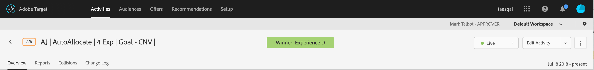

# Tolka autofördelningsrapporter

Tolka resultatet av en [!UICONTROL Auto-Allocate] A/B-aktivitet i [!UICONTROL Adobe Target] genom att undersöka viktiga indikatorer, inklusive lyft och förtroende.

Många marknadsförare gör misstag genom att i förväg deklarera en vinnande upplevelse innan resultatet visar på den tydliga vinnaren. [!DNL Target] gör det enklare för dig att avgöra vinnaren.

Allmän information om hur du deklarerar en vinnare finns i [Tio vanliga A/B-testfall och hur du undviker dem](/help/main/c-activities/t-test-ab/common-ab-testing-pitfalls.md).

## Identifiera den vinnande upplevelsen {#section_24007470CF5B4D30A06610CE8DD23CE3}

När funktionen [!UICONTROL Auto-Allocate] används visas ett märke längst upp på aktivitetens sida som anger &quot;Ingen vinnare än&quot; tills aktiviteten når det minsta antalet konverteringar med tillräcklig säkerhet. [!DNL Target]

När en klar vinnare deklareras visar [!DNL Target]&quot;Vinnare: Upplevelse *X*&quot;.

>[!NOTE]
>
>Automatisk fördelning av aktiviteter är utformade för att hitta den bästa upplevelsen bland alla alternativ och inte bara för att göra parvisa jämförelser med kontroll.

## Statistiska garantier för automatisk fördelning {#section_7AF3B93E90BA4B80BC9FC4783B6A389C}

I slutet av en A/B-aktivitet garanterar [!UICONTROL Auto-Allocate] att den fastställda vinnaren har en faktisk falskt positiv nivå på 5 %. Detta innebär att bara 5 % av tiden är den bestämda vinnaren egentligen inte den bästa upplevelsen bland alla upplevelser i aktiviteten. För ett [A/A-test](/help/main/c-activities/t-test-ab/aa-testing.md) (med identiska upplevelser) avslutar [!DNL Target] ett test som är mindre än 5 % av tiden. Det förväntade beteendet för ett A/A-test (med identiska upplevelser) är att det körs oavbrutet, så vinnarmärket ska aldrig visas.

[!DNL Target] använder inte p-value-baserad konfidens för [!UICONTROL Auto-Allocate].

Kolumnen [!UICONTROL Confidence] i en [!UICONTROL Auto-Allocate]-aktivitet (visas nedan) visar sannolikheten för att en upplevelse blir vinnare inom 1 % felmarginal. Algoritmen använder en minsta mätbar effekt på 1 % mellan den bästa och den näst bästa konverteringsgraden. Algoritmen använder [Bernstein Innequality](https://en.wikipedia.org/wiki/Bernstein_inequalities_%28probability_theory%29) för att beräkna den här sannolikheten.

Normala A/B-tester beräknar tillförlitlighet baserat på p-värden. [!UICONTROL Auto-Allocate] använder inte p-värden. P-värden &quot;löst&quot; beräknar sannolikheten för att en viss upplevelse skiljer sig från kontrollen. Dessa p-värden kan bara användas för att avgöra om en upplevelse kan skilja sig från kontrollen. Dessa värden kan inte användas för att avgöra om en upplevelse skiljer sig från en annan upplevelse (inte kontroll).

>[!IMPORTANT]
>
>[!DNL Target] visar en vinnare efter ett fördefinierat minsta antal konverteringar, men det slutliga beslutet att välja vinnaren ska alltid baseras på resultatet av beräkningen av provstorlek för [!DNL Adobe Target]. [!DNL Target] tar inte hänsyn till baskonverteringsgraden för en webbplats och andra viktiga aspekter som matas in i beräkningen för att avgöra aktivitetens varaktighet. Därför kan [!DNL Target] visa en vinnare som är tidigare än vad som krävs baserat på ett minsta antal konverteringar. Mer information finns i [Beräkna provstorlek](/help/main/c-activities/t-test-ab/sample-size-determination.md#section_6B8725BD704C4AFE939EF2A6B6E834E6).

## Förstå Lyft- och förtroenderapportering i [!UICONTROL Auto-Allocate]-aktiviteter {#lift-confidence}

I [!UICONTROL Auto-Allocate]-aktiviteter definieras alltid den första upplevelsen (som standard Experience A) som en kontrollupplevelse på fliken [!UICONTROL Reports]. Denna erfarenhet behandlas inte som en riktig statistisk kontroll i den modellering som används för att fastställa upplevelsernas resultat, men den behandlas som en referens eller baslinje för vissa siffror i rapporten.

Det numeriska&quot;Lyft&quot;-värdet och 95 %-gränserna för varje upplevelse beräknas alltid med referens till den definierade&quot;Kontroll&quot;-upplevelsen. Den definierade kontrollupplevelsen kan inte ha en lyft i förhållande till sig själv, så ett tomt &quot;—&quot;-värde rapporteras för den här upplevelsen. Till skillnad från i A/B-tester rapporteras inte ett negativt Lyft-värde i [!UICONTROL Auto-Allocate]-tester om en upplevelse fungerar sämre än den definierade kontrollen. I stället visas &quot;—&quot;.

De [!UICONTROL Confidence Interval] staplarna som visas representerar 95 % konfidensintervall runt den genomsnittliga uppskattningen av en upplevelses konverteringsgrad. Dessa fält är också färgkodade med hänsyn till den definierade &quot;Kontroll&quot;-upplevelsen. &quot;Kontrollfältet&quot; är alltid grått. De delar av konfidensintervallen som ligger under &quot;Kontroll&quot; - upplevelsens konfidensintervall är röda och de delar av konfidensintervallen som ligger över &quot;Kontroll&quot; - upplevelsen är färgade i grönt.

En vinnare hittas när den ledande upplevelsen (95 % [!UICONTROL Confidence Interval]) inte överlappar några andra upplevelser. Den vinnande upplevelsen får en grön stjärna till vänster om upplevelsenamnet och i banderollen&quot;Vinnare&quot;. När ingen stjärna är synlig står det &quot;Ingen vinnare än&quot; på banderollen och ingen vinnare har hittats ännu.

Ett&quot;konfidensnummer&quot; rapporteras också bredvid den nuvarande ledande eller vinnande upplevelsen. Den här siffran rapporteras bara tills den ledande upplevelsen [!UICONTROL Confidence] når minst 60 %. Om det finns två upplevelser i aktiviteten [!UICONTROL Auto-Allocate] representerar det här talet den konfidensnivå som upplevelsen fungerar bättre än den andra. Om det finns fler än två upplevelser i aktiviteten [!UICONTROL Auto-Allocate] representerar det här talet den konfidensnivå som upplevelsen fungerar bättre än den definierade Control-upplevelsen. Om&quot;Kontroll&quot;-upplevelsen vinner rapporteras ingen siffra för&quot;förtroende&quot;.

## Vanliga frågor {#section_C8E068512A93458D8C006760B1C0B6A2}

Här följer svar på vanliga frågor:

### Det har gått några dagar framåt. Varför visar alla konfidensvärden fortfarande 0 %?

En av följande orsaker beskriver varför 0 % visas i rapportens [!UICONTROL Confidence]-kolumn för alla aktiviteter:

* Manuella A/B-tester och [!UICONTROL Auto-Allocate] använder olika statistik för att visa [!UICONTROL Confidence]-värden.

  Manuella A/B-tester använder p-värden som baseras på [Welchs t-test](https://en.wikipedia.org/wiki/Welch%27s_t-test). Ett P-värde är sannolikheten att hitta den observerade (eller mer extrema) skillnaden mellan en upplevelse och kontrollen, eftersom det i verkligheten inte finns någon sådan skillnad. Dessa P-värden kan bara användas för att avgöra om observerade data är konsekventa med en viss upplevelse och om kontrollen är densamma. Dessa värden kan inte användas för att avgöra om en upplevelse skiljer sig från en annan upplevelse (inte kontroll).

  [!UICONTROL Auto-Allocate] visar sannolikheten för att en viss upplevelse ska vara en riktig vinnare för alla upplevelser i aktiviteten. Det är bara en vinnande upplevelse (som sannolikt är vinnaren) som har ett värde som inte är noll. Alla andra är mest benägna att vara förlorare och visa 0 %.

* [!UICONTROL Auto-Allocate] börjar visa förtroende först efter att den vinnande upplevelsen fått 60 % förtroende. Dessa konfidensnivåer uppträder vanligtvis på ungefär hälften så lång tid som ett normalt A/B-test skulle ta att slutföra (även om denna tidsram inte garanteras). Om du vill avgöra hur länge ett normalt A/B-test skulle köras använder du [!DNL Adobe Target] [Beräkna samplingsstorlek](/help/main/c-activities/t-test-ab/sample-size-determination.md#section_6B8725BD704C4AFE939EF2A6B6E834E6): plugin-kontrollens konverteringsgrad i &quot;Baslinjekonvertering&quot;, &quot;5 %&quot; för &quot;Lyft&quot; och 95 % för &quot;Förtroende&quot;. Normalt börjar förtroendet visa sig efter att varje upplevelse har fyllt 50 % av det antal samplingar som krävs per upplevelse. Då får du en uppfattning om när självförtroende börjar uppstå.

* Om rapporten visar 0 procent över hela linjen är det sannolikt för tidigt i verksamheten.

### Är&quot;Ingen vinnare&quot;,&quot;vinnare&quot; och&quot;stjärna&quot; tillgängliga för [!UICONTROL Auto-Allocate] aktiviteter som använder [!UICONTROL Analytics as the reporting source] (A4T)?

Märken &quot;Ingen vinnare än&quot; och &quot;vinnare&quot; är för närvarande inte tillgängliga på panelen [!UICONTROL A4T] i [!DNL Analysis Workspace]. Dessa emblem är inte heller tillgängliga om samma rapport visas i [!DNL Target]. Ett stjärntecken som visas i en [!DNL Target]-rapport för en [!UICONTROL Auto-Allocate]-aktivitet som använder A4T ska ignoreras.

Mer information om detta och andra begränsningar och anteckningar finns i [Automatisk allokering](/help/main/c-integrating-target-with-mac/a4t/a4t-at-aa.md#aa) i *A4T-stöd för [!UICONTROL Auto-Allocate] och [!UICONTROL Auto-Target] aktiviteter*.

