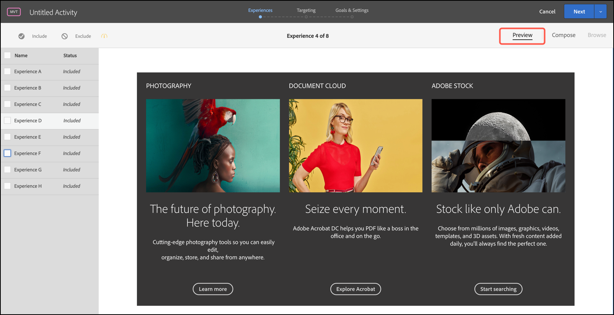

# Förgranska upplevelser för en [!UICONTROL Multivariate Test]

För en [!UICONTROL Multivariate Test] in [!DNL Adobe Target] jämför flera upplevelser på en sida, det är praktiskt att förhandsgranska sidan med varje upplevelse.

1. Från [!UICONTROL Visual Experience Composer] (VEC), klicka **[!UICONTROL Preview]**.

   En lista över alla upplevelser visas.

   

1. Klicka på en upplevelse i listan för att visa den upplevelsen.

1. Om du vill utesluta en eller flera upplevelser från multivariata tester väljer du de önskade upplevelserna och klickar sedan på **[!UICONTROL Exclude]**.

   

   Du kan utesluta en upplevelse som visar variationer i konflikt eller en upplevelse som inte är estetiskt balanserad.

   >[!NOTE]
   >
   >När du skapar multivariata tester kan du exkludera mer än 10 procent av upplevelserna från testet, förutsatt att du bekräftar att du måste använda offlinerapporter för analys.

   Som standard ingår alla upplevelser i multivariattestet. Om du vill inkludera en upplevelse som har uteslutits väljer du den uteslusta upplevelsen och klickar på **[!UICONTROL Include]**.

1. Klicka **[!UICONTROL Exit Preview Mode]** för att gå tillbaka till [!UICONTROL Visual Experience Composer] så att du kan göra ändringar, eller klicka **[!UICONTROL Continue]** för att gå till testsammanfattningen.
