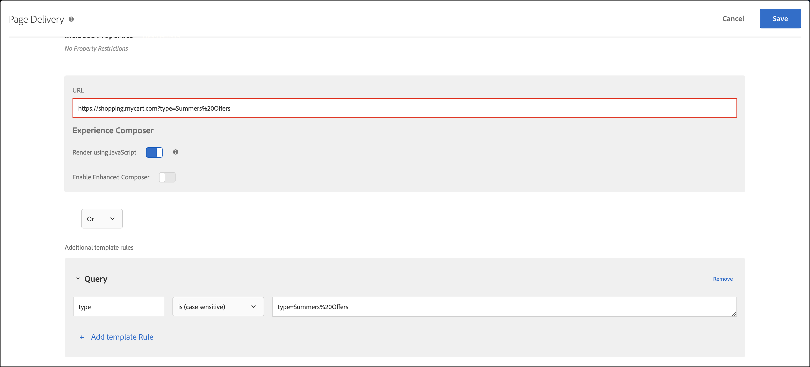

# Felsöka innehållsleverans

Om sidan inte visar det förväntade innehållet kan du utföra några steg för att felsöka innehållsleveransen.

* Kontrollera aktiviteten eller kampanjkoden noggrant. Ett skrivfel eller ett annat fel kan göra att det förväntade innehållet inte visas.
* Använd mboxTrace eller mboxDebug för att felsöka [!DNL Target]-begäran.
* Använd Adobe Experience Cloud Debugger, ett lättanvänt verktyg som ger mycket av samma information som mboxDebug, för att felsöka [!DNL Target]-begäran.

mboxDebug är särskilt användbar när du konfigurerar [!DNL Target] på sidan för att kontrollera att Target-begäran utlöses och att cookien ställs in. Men den går inte in på den typ av detaljer som är användbar vid felsökning av innehållsleverans. Om aktiviteten inte visas på sidan eller om oönskat innehåll visas använder du mboxTrace för att undersöka och felsöka sidan i detalj.

## Hämta den auktoriseringstoken som ska användas med felsökningsverktyg {#section_BED130298E794D1FA229DB7C3358BA54}

Eftersom mboxTrace och mboxDebug kan visa kampanjdata och profildata för externa parter krävs en auktoriseringstoken. Auktoriseringstoken kan hämtas i användargränssnittet för [!DNL Target]. Token gäller i sex timmar.

Du måste ha någon av följande användarbehörigheter för att generera en autentiseringstoken:

* Minst [!UICONTROL Editor] behörighet (eller [!UICONTROL Approver])

  Mer information för [!DNL Target Standard]-kunder finns i [Ange roller och behörigheter](/help/main/administrating-target/c-user-management/c-user-management/user-management.md#roles-permissions) i *Användare*. Mer information om [!DNL Target Premium] kunder finns i [Konfigurera företagsbehörigheter](/help/main/administrating-target/c-user-management/property-channel/properties-overview.md).

* Administratörsroll på arbetsyta/produktprofilnivå

  Arbetsytor är bara tillgängliga för [!DNL Target Premium] kunder. Mer information finns i [Konfigurera företagsbehörigheter](/help/main/administrating-target/c-user-management/property-channel/properties-overview.md).

* Administratörsrättigheter (systemadministratörsbehörighet) på [!DNL Adobe Target]-produktnivå

Så här hämtar du auktoriseringstoken:

1. Klicka på **[!UICONTROL Administration]** > **[!UICONTROL Implementation]**.
1. Klicka på **[!UICONTROL Generate New Authentication Token]** i avsnittet Felsökningsverktyg.

   

1. Lägg till den genererade variabeln som en parameter i URL-adressen för att aktivera ett av de avancerade felsökningsverktygen.

   

## mboxTrace {#section_256FCF7C14BB435BA2C68049EF0BA99E}

Med mboxTrace kan du ta emot spårningsinformation som är kopplad till [!DNL Target] svar. Spårningsinformationen återger resultatet av ett [!DNL Target]-anrop (till exempel en konvertering eller ett intryck) och eventuella ytterligare data som kan hjälpa till att avgöra varför det här specifika resultatet inträffade, till exempel en uppsättning tillgängliga grenar som urvalet gjordes bland i en kampanj. Använd den här informationen för att felsöka innehållsleverans.

Följande parametrar är tillgängliga:

| mboxTrace-alternativ | Resultat |
|--- |--- |
| `?mboxTrace=console` | Skriver ut som objekt i konsolloggen.<br>För at.js behöver du, i stället för att öppna ett nytt webbläsarfönster eller skriva ut till konsolen som i mbox.js (nu föråldrat), granska nätverksbegäran och titta under Förhandsgranska (Chrome) eller Response (Firefox). |
| `?mboxTrace=json` | Skriver ut i konsolloggen som en literal JSON-sträng |
| `?mboxTrace=window` | Skriver ut i ett popup-fönster som en JSON-sträng |
| `?mboxTrace=disable` | Inaktiverar spårningssessionsläge |

**Exempel på mboxTrace-anrop**

`https://www.mysite.com/page.html?mboxTrace=window&authorization=f543abf-0111-4061-9619-d41d665c59a6`

Utdata visar detaljerad information om ditt innehåll. mboxTrace visar information om din kampanj eller aktivitet och profil. Den innehåller även en ögonblicksbild av profilen före körning och en ögonblicksbild av vad som ändrats efter körningen. Det visar också vilka kampanjer eller aktiviteter som utvärderats för varje plats.

En del av informationen innehåller matchade och omatchade segment- och mål-ID:n:

* **SegmentId**: ID:n för segment, antingen från det återanvändbara segmentbiblioteket eller anonyma som skapats för den aktuella kampanjen.
* **TargetId**: ID:n för mål, antingen från måluttrycksbiblioteket eller anonyma mål för alla segment från kampanjen.
* **Omatchad**: Begäran kvalificerades inte i det här anropet för dessa segment eller mål.
* **Matchad**: Begäran kvalificerad för de angivna segmenten eller målen.

**Använda mboxTrace på rekommendationssidor**: Om du lägger till mboxTrace som en frågeparameter på sidor med rekommendationer ersätts designen Recommendations på sidan med ett mboxTrace-informationsfönster, som visar detaljerad information om dina rekommendationer, bland annat:

* Rekommendationer som returnerats jämfört med rekommendationer som begärts
* Nyckeln som används och om den genererar rekommendationer
* Villkorsgenererade rekommendationer jämfört med rekommendationer för säkerhetskopiering
* Villkorskonfiguration
* Undantag och inkluderingar som tillämpas
* Samlingsregler

Du behöver inte inkludera `=console`, `=json` eller `=window` i frågeparametern. När du är klar med informationen för mboxTrace lägger du till `=disable` och trycker på **[!UICONTROL Enter]** för att återgå till det normala visningsläget.

Webbplatsens normala funktion och utseende påverkas inte av mboxTrace. Besökarna ser din vanliga rekommendationsdesign.

## mboxDebug {#mboxdebug}

Om du vill använda mboxDebug lägger du till en mboxDebug-parameter i slutet av URL:en. Följande tabell innehåller information om [!DNL Target] svarsrelaterade URL-parametrar.

>[!NOTE]
>
>Vissa mboxDebug-parametrar är tillgängliga med eller utan autentisering.

| URL-parametrar | Syfte |
|--- |--- |
| `mboxDebug=1` | Felsökning<br>Om du lägger till den här parametern i en URL med definierade Target-begäranden öppnas ett popup-fönster med värdefull felsökningsinformation. Cookie-information, PCid- och sessions-ID-värden skrivs ut och alla URL:er visas. Klicka på en URL för en målbegäran för att visa svaret på den [!DNL Target]-begäran. Mer information finns i [mbox_debug.pdf](/help/main/assets/mbox_debug.pdf). |
| `mboxDisable=1` | Inaktivera kryssrutor på sidan |
| `mboxOverride.browserIp=<Insert IP address>` | Testa geolokalisering<br>Testa geolokalisering med den här URL-parametern. Ange en IP-adress som värde för det här attributet, och Test&amp;Target-målet utvärderar den IP-adressen så att den matchar alla geografiska mål och segmenteringar som angetts i en kampanj. |

>[!NOTE]
>
>Kontrollera att URL-fragmentet är efter frågesträngsparametrar. Allt efter den första `#` är en fragmentidentifierare och får felsökningsparametrarna att inte fungera korrekt.

## Adobe Experience Cloud Debugger {#section_A2798ED3A431409690A4BE08A1BFCF17}

Med Adobe Experience Cloud Debugger är det snabbt och enkelt att förstå hur Target-implementeringen fungerar. Du kan snabbt visa bibliotekskonfigurationen, granska förfrågningar för att se till att dina anpassade parametrar skickas korrekt, aktivera konsolloggning och inaktivera alla Target-förfrågningar. Logga in i Experience Cloud så kan du använda det kraftfulla MboxTrace-verktyget för att kontrollera din aktivitet och dina målgruppskvalifikationer liksom din besökarprofil.

Mer information finns i utbildningsvideorna nedan:

Mer detaljerad information finns i [Felsöka at.js med Adobe Experience Cloud Debugger](https://experienceleague.adobe.com/docs/target-dev/developer/client-side/at-js-implementation/functions-overview/target-debugging-atjs.html?lang=sv-SE){target=_blank}.

## De viktigaste säljarna visas inte i rekommendationerna {#section_3920C857270A406C80BE6CBAC8221ECD}

Anropet *`SiteCatalyst: purchase`* kan inte användas för trafikdata för inköpsalgoritmen. Använd *`orderConfirmPage`*-anropet i stället.

## Kontrollera aktivitetsprioritet {#section_3D0DD07240F0465BAF655D0804100AED}

Formulärbaserade aktiviteter som skapats med [!DNL Target Standard/Premium] kan kollidera med aktiviteter som skapats i användargränssnittet i [!DNL Target Classic] som har samma prioritet och använder samma [!DNL Target]-begäran.

## Anpassad kod ger inte det förväntade resultatet i Internet Explorer 8. {#section_FAC3651F19144D12A37A3E4F14C06945}

Target har inte längre stöd för IE 8.

## Målcookie har inte angetts {#section_77AFEB541C0B495EB67E29A4475DF960}

Om din webbplats har en underdomän, till exempel [!DNL us.domain.com], men du behöver en målcookie som är inställd på [!DNL domain.com] (i stället för på [!DNL us.domain.com]), måste du åsidosätta inställningen `cookieDomain`. Mer information finns i [targetGlobalSettings()](https://experienceleague.adobe.com/docs/target-dev/developer/client-side/at-js-implementation/functions-overview/targetglobalsettings.html?lang=sv-SE){target=_blank}.

## Målinnehållet flimrar eller visas inte om ett element också ingår i Adobe Experience Manager personalisering. {#section_9E1DABEB75AB431FB9F09887E6DD07D3}

Om ett DOM-element är en del av Adobe Experience Manager (AEM) personalisering och en Target-aktivitet kan Target-innehåll flimra eller inte visas.

För att åtgärda detta kan du inaktivera AEM-personalisering på sidor där Target körs.

## Omdirigerings- och fjärrerbjudanden levereras inte på grund av en ogiltig URL. {#section_7D09043B687F43B39DAEDF17D00375AC}

Om omdirigerings- eller fjärrerbjudandet använder en ogiltig URL kanske det inte kan levereras.

För omdirigeringserbjudanden kan svaret på [!DNL Target] innehålla `/* invalid redirect offer URL */`

eller

För fjärrerbjudanden kan svaret på [!DNL Target] innehålla `/* invalid remote offer URL */`

Du kan kontrollera [!DNL Target]-svaret i webbläsaren eller med mboxTrace. Mer information om giltiga URL:er finns i [https://tools.ietf.org/html/std66](https://tools.ietf.org/html/std66).

## [!DNL Target] begäranden utlöses inte på min webbplats.

at.js utlöser inte Target-begäranden om du använder en ogiltig doctype. at.js kräver HTML 5 doctype.

## Se till att [!DNL Target] aktiviteter hanterar URL:er med frågesträngsparametrar korrekt. {#query-strings}

[!UICONTROL Activity URL] avgör vilken sida som kvalificerar besökare för aktiviteten och återger aktivitetsupplevelserna för användarna. När en uppmaning visas när en aktivitet skapas säkerställer inte alltid att innehållet levereras på den webbplatssidan, särskilt inte med URL:er som innehåller frågesträngsparametrar.

Som standard öppnar [!UICONTROL Visual Experience Composer] (VEC) sidan som anges i [inställningarna för Visual Experience Composer](/help/main/administrating-target/visual-experience-composer-set-up.md). Du kan också ange en annan sida när du skapar en aktivitet.

Om du vill visa en annan sida efter att VEC har öppnats klickar du på **[!UICONTROL Configure gear icon]** > välj **[!UICONTROL Page Delivery]** > och anger sedan önskad URL i fältet [!UICONTROL Activity URL].


Men tänk om URL:en innehåller frågesträngsparametrar? Fungerar det och visar det personaliserade innehållet? I det här scenariot kan du, oavsett vilken målgrupp du har, inkludera mallregler förutom bas-URL:en för att definiera frågeparametrarna.

Följande alternativ kan användas för att inkludera ytterligare mallregler:

### Alternativ 1: Replikera URL-adressen och behåll den i mallregeln med alternativet &quot;contains&quot;.

Det här alternativet ser till att den här URL:en kvalificerar sig för aktiviteten, men tänk på att det finns hörnfall kopplade till den som kan påverka rapportdata med ytterligare poster till URL:er som innehåller bas-URL:en.

I det här scenariot är URL:en `https://shopping.mycart.com?type=Summers%20Offers` och ytterligare mallregler &quot;innehåller&quot; samma URL, avgränsade med en OR-operator:


### Alternativ 2: Begränsa URL-villkoret &quot;contains&quot; med endast frågesträngen.

I det här alternativet används det hörnfall som beskrivs i det föregående alternativet, men här begränsas villkorsinställningarna till enbart frågesträngen.

I det här scenariot är URL:en `https://shopping.mycart.com?type=Summers%20Offers` och ytterligare mallregler&quot;innehåller&quot; bara frågesträngen, avgränsade med en OR-operator:


### Alternativ 3: Använd en specifik del av webbadressen i stället för att ange den fullständiga webbadressen som mål.

I det här scenariot är URL:en `https://shopping.mycart.com?type=Summers%20Offers` och ytterligare mallregler anger [!UICONTROL Query] med [!UICONTROL type] > [!UICONTROL is (case sensitive)] > type=Summers%20Offers, avgränsade med en OR-operator:



## Det går inte att ta bort dubbla citattecken i profilattributvärdet [!DNL Target] som förväntat. {#escape}

När du skickar värden som innehåller dubbla citattecken i ett [!DNL Target]-profilattribut måste du undvika det så som visas nedan.

```
adobe.target.trackEvent({
    "mbox": "data-collection",
    "params":    {
        "profile.tagLine": "Escape \\\"Double Quotes\\\" like this."
    }
});
```

## Utbildningsvideor

I följande videofilmer finns mer information om de begrepp som beskrivs i den här artikeln.

### Lägg till självstudiekursen 

>[!VIDEO](https://video.tv.adobe.com/v/23114t2/)

### Grundläggande Adobe Target-felsökning 

>[!VIDEO](https://video.tv.adobe.com/v/23115t2/)

### Mbox Trace 

>[!VIDEO](https://video.tv.adobe.com/v/23113t2/)
