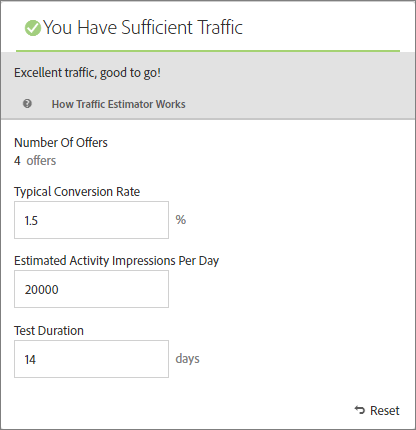

# Uppskatta den trafik som krävs för att lyckas

[!DNL Adobe Target] [!UICONTROL Traffic Estimator] ger dig feedback som talar om för dig om du har tillräckligt med trafik för din [!UICONTROL Automated Personalization] (AP)-aktivitet för att lyckas.

Eftersom [!UICONTROL Automated Personalization]-aktiviteter använder flera erbjudandekombinationer är det viktigt att veta hur mycket trafik som krävs för att ge meningsfulla resultat. [!UICONTROL Traffic Estimator] använder statistik om din sida och antalet upplevelser som testas för att uppskatta mängden trafik och hur lång tid som krävs för att aktiviteten ska lyckas.

[!UICONTROL Traffic Estimator] avgör om det finns tillräckligt med trafik för att generera personaliserade modeller genom att jämföra de uppskattade sidavbildningarna och den typiska konverteringsgraden för sidorna. Det bästa är om du väljer en lyckad aktivitet med rätt samplingsstorlek, så att det anpassade innehållet är klart inom 50 % av aktivitetens varaktighet eller 14 dagar, beroende på vilket värde som är lägst. Denna process ger tillräckligt med tid för att få personaliserat innehåll och lära sig vilket innehåll som ska levereras.

Kom ihåg att [!DNL Target] skickar upplevelser slumpmässigt tills personaliseringsalgoritmerna byggs. Kryssmarkeringsikonen bredvid varje erbjudande visar när modellen för det erbjudandet är klar och [!DNL Target] kan börja leverera personaliserat innehåll. Eftersom lift (lift) förväntas först när modellerna är klara kan du med den visuella indikeringen ställa in rätt förväntningar. Använd [!UICONTROL Traffic Estimator] i [!UICONTROL Visual Experience Composer] (VEC) för att få en vägledning om när modellerna är klara.

## Använda Traffic Estimator

1. Klicka på ikonen **[!UICONTROL Traffic]** på sidan [!UICONTROL Experiences] i [!UICONTROL Visual Experience Composer] i en [!UICONTROL Automated Personalization] -aktivitet.

   

   [!UICONTROL Traffic Estimator] öppnas. Du kan klicka på **[!UICONTROL Traffic]** igen om du vill dölja [!UICONTROL Traffic Estimator].

   

1. Ange typisk konverteringsgrad (eller den konverteringsgrad som du förväntar dig av den här aktiviteten), uppskattade aktivitetsavtryck per dag och testets varaktighet.

   | Mått | Beskrivning |
   | --- | --- |
   | **[!UICONTROL Number of Offers]** | Det här måttet beräknas automatiskt baserat på antalet upplevelser som skapas som en del av din aktivitet, efter eventuella undantag. |
   | **[!UICONTROL Typical Conversion Rate]** | Detta mätvärde uttrycks som en procentandel, baserat på din uppskattning eller tidigare data från analyssystemet. |
   | **[!UICONTROL Estimated Visits Per Day]** | Det här måttet är antalet besök per dag från besökare som kan visa aktiviteten, baserat på målinriktningskriterierna. Detta mätresultat kan baseras på era analysdata. Det här numret måste vara besök, inte unika besökare. |
   | **[!UICONTROL Test Duration]** | Antalet dagar som du vill att aktiviteten ska köras. |

   [!UICONTROL Traffic Estimator] använder dessa mått för att avgöra vilka justeringar som krävs för att köra ett lyckat test.

   I närheten av överkanten av [!UICONTROL Traffic Estimator] beräknas de värden du angav och resultaten visas.

   

   När du ändrar siffrorna ändras uppskattningen. Om du till exempel testar många kombinationer och din konverteringsgrad och dina avbildningar är för låga, visar [!UICONTROL Traffic Estimator] hur länge testet måste köras för att lyckas. Om trafiken är låg kan [!UICONTROL Traffic Estimator] föreslå ett lägre antal erbjudandekombinationer så att du kan köra testet på det önskade antalet dagar.

   Om du inte har tillräckligt med trafik bör du tänka på följande:

   * Överväg att använda en [Automatisk målaktivitet](/help/main/c-activities/auto-target/auto-target-to-optimize.md) i stället för [!UICONTROL Automated Personalization] för att skapa upplevelser med flera erbjudandeändringar i en upplevelsevariation.
   * Minska antalet erbjudandekombinationer i din [!UICONTROL Automated Personalization]-aktivitet.
   * Öka aktivitetens varaktighet.

   Justera siffrorna tills [!UICONTROL Traffic Estimator] indikerar att du har tillräckligt med trafik och utforma sedan testet därefter.

   

   Om trafiken är tillräcklig visas en grön kontroll med ikonen [!UICONTROL Traffic]. Om ikonen inte är tillräcklig visas en röd varningsetikett.

## Vanliga frågor om trafikberäkningsverktyget

Tänk på följande vanliga frågor när du arbetar med [!UICONTROL Traffic Estimator]:

### Varför byggs inte personaliserade modeller trots att min AP-aktivitet har tillräckligt med trafik?

Under vissa omständigheter är din trafik tillräckligt stor för att en anpassad modell ska kunna skapas, men den trafiken kan informera [!DNL Target] om att det inte finns någon meningsfull skillnad mellan den personaliserade modellen och slumpmässigt. Även om modellen är inbyggd i [!DNL Target] och testad distribueras den inte eftersom modellen inte är bättre än slumpmässig.

En möjlig orsak till att modellen inte är bättre än slumpmässigt kan vara att erbjudandena inte skiljer sig tillräckligt mycket från varandra. I så fall kan du försöka göra erbjudandena mer visuellt annorlunda om meddelandet är liknande, eller så kan du försöka ändra själva meddelandet.
