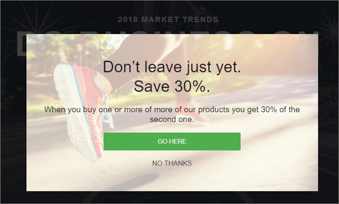

# Experience Templates

Information om [!DNL Adobe Target] Upplevelsemallar som kan användas i anpassad kod. [!DNL Target] Experience Templates är förkodade exempel med konfigurerbara indata som används för att köra vanliga användningsfall för marknadsförare.

Dessa Experience Templates är kostnadsfria för utvecklare och marknadsförare som en startpunkt för vanliga användningsfall, antingen via VEC eller den formulärbaserade Experience Composer.

Följande mallar är för närvarande tillgängliga på Adobe Marketing Cloud GitHub, se [Target-Experience-Templates](https://github.com/Adobe-Marketing-Cloud/target-experience-templates).

## Banderoll Carousel med miniatyrbilder {#section_BEEE51D47CC44A478264BBF3FEC70DAE}

The [Banner Carousel with Thumbnails experience template](https://github.com/Adobe-Marketing-Cloud/target-experience-templates/tree/master/banner-carousel-thumbnails) är en roterande karusell som ofta används på hemsidor och landningssidor eller andra sidor med stora volymer. Denna karusell roterar inte automatiskt genom bilderna och kan interagera direkt genom att klicka på de mindre bilderna under den primära bilden.

## Banner Carousel {#section_725D4C0C4FCD41FA92BCFC910A216E2A}

The [Banner Carousel Experience Template](https://github.com/Adobe-Marketing-Cloud/target-experience-templates/tree/master/banner-carousel) är en roterande karusell som ofta används på hemsidor och landningssidor eller andra sidor med stora volymer. Denna karusell roterar inte automatiskt genom bilderna och kan interagera direkt genom att klicka på vänster- och högerpilarna.

## Nedräkning av banderoll {#section_ED9501FE096C4CD7B6D9933E0322B4AD}

The [Mall för hämtning av banderollupplevelser](https://github.com/Adobe-Marketing-Cloud/target-experience-templates/tree/master/banner-countdown) är en stor banderoll med en central nedräkning, som ofta används på hemsidor och landningssidor eller andra startsidor med stora volymer.

## Button Builder {#section_DBDD1C9A9F294FB6BABBC04B4454E59B}

The [Button Builder Experience Template](https://github.com/Adobe-Marketing-Cloud/target-experience-templates/tree/master/button) är en liten knapp med ett textanrop till åtgärd. Knappen är konfigurerbar och kan placeras var som helst på sidan för att lägga till ett nytt anrop till åtgärd eller ersätta en befintlig knapp med ett mer konfigurerbart alternativ.

## Ljuslåda med nedräkning {#section_E1177C52F1294EA5AC48312727CD3DF4}

The [Ljuslåda med en nedräkningsbar upplevelsemall](https://github.com/Adobe-Marketing-Cloud/target-experience-templates/tree/master/lightbox-countdown) är en popup-meny för ljuslådeövertäckning med en central nedräkning, som ofta används på hemsidor och landningssidor eller andra startsidor för stora volymer.

## Ljuslåda med avslutningsmetod {#section_E624C867E4CD4F2294CFC7917EFAEBD7}

The [Ljuslåda med en mall för upplevelsehantering vid avslut](https://github.com/Adobe-Marketing-Cloud/target-experience-templates/tree/master/lightbox-exit-intent) är en popup-meny för ljuslådeövertäckning som aktiveras vid avslutningsmetoden (flytta musen till övre högra hörnet av skärmen) och kan användas på alla webbegenskaper där du vill ha en sista chans att fånga uppmärksamheten.

## Ljuslåda {#section_EF4FBA08CE55407CAFB334340C6C1577}

The [Ljuslådeupplevelsemall](https://github.com/Adobe-Marketing-Cloud/target-experience-templates) är en popup-meny med ljuslådeövertäckning med inbyggd fördröjning, som ofta används på startsidor och landningssidor eller andra startsidor med stora volymer.

## Band {#section_CCBB656265F140AEA1B200409D719000}

The [Mall för bandupplevelser](https://github.com/Adobe-Marketing-Cloud/target-experience-templates/tree/master/ribbon) är ett 100-procentigt breddband som infogas högst upp på webbsidan och som vanligen används för att visa en blixtförsäljning, fri frakt, säkerhets- eller väderhändelse eller andra viktiga meddelanden.

