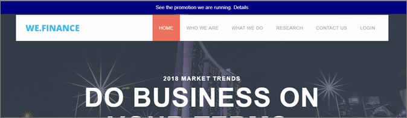

# Experience Templates

Information om [!DNL Adobe Target] Experience Templates som kan användas i anpassad kod. [!DNL Target] Experience Templates är förkodade exempel med konfigurerbara indata som kan användas för att köra vanliga användningsfall för marknadsförare.

Dessa Experience Templates är kostnadsfria för utvecklare och marknadsförare som en startpunkt för vanliga användningsfall, antingen via VEC eller den formulärbaserade Experience Composer.

Följande mallar är för närvarande tillgängliga på Adobe Marketing Cloud GitHub, se [Target-Experience-Templates](https://github.com/Adobe-Marketing-Cloud/target-experience-templates).

## Banderoll Carousel med miniatyrbilder {#section_BEEE51D47CC44A478264BBF3FEC70DAE}

[Bannerkarusellen med miniatyrbilderna &#x200B;](https://github.com/Adobe-Marketing-Cloud/target-experience-templates/tree/master/banner-carousel-thumbnails) är en roterande karusell som ofta används på startsidor och landningssidor eller andra startsidor med stora volymer. Denna karusell roterar inte automatiskt genom bilderna och kan interagera direkt genom att klicka på de mindre bilderna under den primära bilden.

## Banner Carousel {#section_725D4C0C4FCD41FA92BCFC910A216E2A}

Mallen [Banner Carousel Experience &#x200B;](https://github.com/Adobe-Marketing-Cloud/target-experience-templates/tree/master/banner-carousel) är en roterande karusell som ofta används på startsidor och landningssidor eller andra startsidor med stora volymer. Denna karusell roterar inte automatiskt genom bilderna och kan interagera direkt genom att klicka på vänster- och högerpilarna.

## Nedräkning av banderoll {#section_ED9501FE096C4CD7B6D9933E0322B4AD}

Mallen [Banner-nedräkning](https://github.com/Adobe-Marketing-Cloud/target-experience-templates/tree/master/banner-countdown) är en stor banderoll med en central nedräkningsfunktion, som ofta används på hemsidor och landningssidor eller andra startsidor med stora volymer.

## Button Builder {#section_DBDD1C9A9F294FB6BABBC04B4454E59B}

Mallen [för upplevelsen i Button Builder](https://github.com/Adobe-Marketing-Cloud/target-experience-templates/tree/master/button) är en liten knapp med texten call to action. Knappen är konfigurerbar och kan placeras var som helst på sidan för att lägga till en ny call to action eller ersätta en befintlig knapp med ett mer konfigurerbart alternativ.

## Ljuslåda med nedräkning {#section_E1177C52F1294EA5AC48312727CD3DF4}

[Ljuslådan med mallen för nedräkningsfunktionen](https://github.com/Adobe-Marketing-Cloud/target-experience-templates/tree/master/lightbox-countdown) är en popup-meny med ljuslådeövertäckning och en central nedräkningsnivå, som ofta används på startsidor och landningssidor eller andra startsidor med stora volymer.

## Ljuslåda med avslutningsmetod {#section_E624C867E4CD4F2294CFC7917EFAEBD7}

[Ljuslådan med upplevelsemallen Avsluta &#x200B;](https://github.com/Adobe-Marketing-Cloud/target-experience-templates/tree/master/lightbox-exit-intent) är en popup-ruta med ljuslådeövertäckning som aktiveras vid avslutningsmetoden (flytta musen till övre högra delen av skärmen) och kan distribueras på alla webbegenskaper där du vill ha en sista chans att fånga uppmärksamheten.

## Ljuslåda {#section_EF4FBA08CE55407CAFB334340C6C1577}

Mallen [Ljuslådeupplevelse](https://github.com/Adobe-Marketing-Cloud/target-experience-templates) är en övertäckningspopup med en inbyggd fördröjning, som ofta används på startsidor och landningssidor eller andra startsidor med stora volymer.

## Band {#section_CCBB656265F140AEA1B200409D719000}

Mallen [för bandupplevelser](https://github.com/Adobe-Marketing-Cloud/target-experience-templates/tree/master/ribbon) är ett menyfliksområde med 100 % bredd som infogas högst upp på webbsidan, som vanligtvis används för att ange en blixtförsäljning, fri frakt, säkerhets- eller väderhändelse eller andra viktiga meddelanden.

