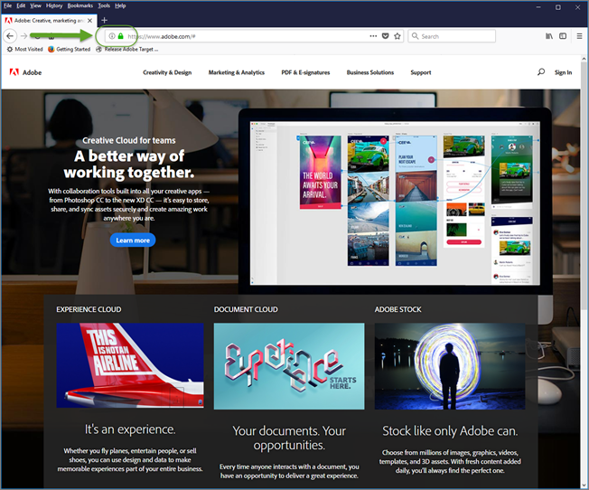

# Felsökning av problem relaterade till [!UICONTROL Enhanced Experience Composer]

Visningsproblem kan ibland uppstå i [!DNL Adobe Target] [!UICONTROL Enhanced Experience Composer] (EEC) under vissa villkor.

## EEG läser inte in en intern QA-URL som inte är tillgänglig på offentlig IP. {#section_D29E96911D5C401889B5EACE267F13CF}

+++Information
Problemet kan lösas genom att du tillåtslista följande IP-adresser. Dessa IP-adresser är för [!DNL Adobe]-servern som används för EEG-proxyn. Dessa IP-adresser krävs bara för aktivitetsredigering. Besökare på webbplatsen behöver inte tillåtslista dessa IP-adresser.

Be IT-teamet att tillåtslista följande IP-adresser:

### USA (va7)

40.70.154.136/29
52.254.106.240/28
52.254.106.160/28
52.254.107.16/28
20.186.185.181
20.22.83.112
20.186.185.227
52.254.106.192/28
52.254.106.0/28
52.254.107.128/28
52.254.107.80/28
52.254.106.176/28
52.254.107.32/28
52.254.105.192/28
52.254.107.64/28
52.254.106.208/28
52.254.107.0/28
52.254.106.224/28
20.14.241.153
20.186.185.239
4.152.211.251
52.254.107.144/28
52.254.106.144/28

### EMEA (nld2)

51.138.17.16/28
51.138.17.48/28
51.138.16.128/28
51.138.17.32/28
51.138.16.240/28
51.138.17.112/28
51.138.16.160/28
51.138.16.208/28
51.138.17.80/28
51.138.17.0/28
51.138.17.96/28
51.138.16.144/28
20.31.145.248
20.126.189.248
51.138.16.224/28
51.138.16.192/28
51.138.12.94
51.138.12.11
51.138.16.176/28
51.138.12.100
51.138.17.64/28
51.138.12.160/28

### APAC (aus)

20.43.104.160/28
20.227.35.177
20.40.188.227
20.43.104.112/28
20.43.104.128/28
20.43.104.144/28
20.40.188.166
20.53.206.128
20.43.104.80/28
20.43.104.16/28
20.43.105.48/28
20.43.104.96/28
20.43.104.48/28
20.40.188.194
20.43.104.32/28
20.40.191.224/28
20.43.105.16/28
20.40.191.96/28
20.43.104.176/28
20.40.191.240/28
20.43.104.64/28
20.43.105.32/28
20.43.104.192/28
20.43.105.0/28
20.43.104.0/28

### Äldre IP-adresser

Följande tidigare IP-adresser bör fortsätta att tillåtslista tills vidare.

34.254.77.200
54.73.207.147
54.229.152.123
3.224.194.242
54.90.51.39
34.228.136.112
54.150.116.11
18.178.142.8
54.199.107.77
99.80.139.221
54.78.56.224
54.247.179.246
54.80.219.243
34.201.235.54
54.196.224.236
35.75.212.45
52.199.184.130
18.180.161.176

Följande felmeddelande kan visas i [!DNL Target]:

`Error: Your website domain (ISP) is blocking the [!UICONTROL Enhanced Experience Composer]. You can allowlist the [!UICONTROL Enhanced Experience Composer]'s IP addresses or turn off [!UICONTROL Enhanced Experience Composer] in [!UICONTROL Configure] > [!UICONTROL Page Delivery] menu.`

Följande är orsaker till att du kan se det här felmeddelandet och åtgärda problemet:

* **Problem:** Webbplatsdomänen (ISP) blockerar [!UICONTROL Enhanced Experience Composer].

  **Åtgärd:** Tillåtslista de IP-adresser som anges ovan.

* **Problem:** IP-adresserna har tillåtslista men webbplatsen stöder inte TLS version 1.2. [!DNL Target] använder för närvarande standardkonfigurationen 1.2. Före [!DNL Target] 18.4.1 (25 april 2018) hade standardkonfigurationen stöd för TLS 1.0. Mer information finns i [&#x200B; TLS (Transport Layer Security) Krypteringsändringar &#x200B;](https://experienceleague.adobe.com/docs/target-dev/developer/implementation/tls-transport-layer-security-encryption.html?lang=sv-SE){target=_blank} .

  **Lösning:** Se följande fråga ([!UICONTROL Enhanced Visual Experience Composer] läses inte in på säkra sidor på min webbplats som använder TLS 1.2).

+++

## EEC laddas inte på säkra sidor som använder TLS 1.0. (endast EEG) {#section_C5B31E3D32A844F68E5A8153BD17551F}

+++Information
Felmeddelandet som beskrivs ovan kan visas i &quot;[!UICONTROL Enhanced Visual Experience Composer] kommer inte att läsas in på säkra sidor på min webbplats.&quot; om IP-adresserna ovan är tillåtslista men webbplatsen saknar stöd för TLS version 1.2. [!DNL Target] använder för närvarande standardkonfigurationen 1.2. Före [!DNL Target] 18.4.1 (25 april 2018) hade standardkonfigurationen stöd för TLS 1.0. Mer information finns i [&#x200B; TLS (Transport Layer Security) Krypteringsändringar &#x200B;](https://experienceleague.adobe.com/docs/target-dev/developer/implementation/tls-transport-layer-security-encryption.html?lang=sv-SE){target=_blank} .

Så här kontrollerar du TLS-versionen på din webbplats med Firefox (andra webbläsare har liknande steg):

1. Öppna den webbplats som påverkas i Firefox.
1. Klicka på ikonen **[!UICONTROL Show Site Information]** i webbläsarens adressfält.

   

1. Klicka på **[!UICONTROL Show Connection Details]** > **[!UICONTROL More Information]**.

   

1. Se TLS-versionsinformationen under Technical Details (Teknisk information):

   

1. Om du ser att TLS 1.0 visas på din webbplats kan du läsa [TLS (Transport Layer Security) Krypteringsändringar](https://experienceleague.adobe.com/docs/target-dev/developer/implementation/tls-transport-layer-security-encryption.html?lang=sv-SE){target=_blank} om du vill ha information om TLS-stödsregler för mål. Om du vill åtgärda situationen för tillfället (gäller till den 12 september 2018){target=_blank} kan du kontakta [kundtjänst](/help/main/cmp-resources-and-contact-information.md#reference_ACA3391A00EF467B87930A450050077C) för att få hjälp med konfigurationen för din TLS-version och domänen.

+++

## Jag ser timeout-fel eller&quot;åtkomst nekad&quot;-fel när webbplatser med proxy aktiverat läses in. (endast EEG) {#section_60CBB9022DC449F593606C0E6252302D}

+++Information
Kontrollera att proxy-IP:n inte är blockerade i din miljö.

+++
