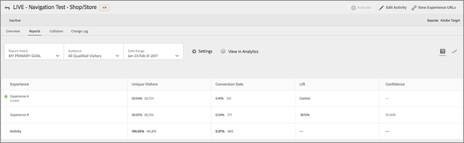

# [!DNL Adobe Analytics] som rapportkälla för [!DNL Adobe Target] (A4T)

[!DNL Adobe Analytics for Target] (A4T) är en integrering med flera lösningar som gör att du kan skapa aktiviteter baserade på [!DNL Analytics] konverteringsstatistik och målgruppssegment. Med A4T-integreringen kan du använda [!DNL Analytics] rapporter för att undersöka resultaten. Om du [!DNL Analytics] som rapporteringskälla för en verksamhet, all rapportering och segmentering för denna verksamhet baseras på [!DNL Analytics] datainsamling.

## Ökning {#section_92B66069210C40DBA937790E8CC596CF}

The [!DNL Analytics for Target] integrering mellan [!DNL Analytics] och [!DNL Target] innehåller kraftfulla analys- och tidsbesparande verktyg för optimeringsprogrammet.

De tre viktigaste fördelarna med att använda [!DNL Analytics] data i [!DNL Target] är:

* Marknadsförare kan tillämpa [!DNL Analytics] framgångsmått eller rapporteringssegment för [!DNL Target] aktivitetsrapporter när som helst. Du behöver inte ange allt innan du kör aktiviteten.
* En enda datakälla eliminerar den varians som uppstår när data samlas in i två olika system.
* Din befintliga [!DNL Analytics] implementeringen samlar in alla nödvändiga data. Det finns ingen anledning att implementera mbox på sidor enbart i syfte att samla in data för rapporter.

Om du [!DNL Analytics] som rapporteringskälla för en verksamhet, all rapportering och segmentering för denna verksamhet baseras på [!DNL Analytics].

Alla [!DNL Analytics] mätvärden, inklusive beräknade värden, finns i [!DNL Target] och [!UICONTROL Target Activities] rapportera i [!DNL Analytics], med ett undantag. Beräknade mått för [!UICONTROL Lift & Confidence] stöds inte. Alla segment finns också i [!DNL Analytics] kan användas på båda lösningarna. Du kan använda måttet eller målgruppen i rapporten i [!DNL Target] efter det att aktiviteten har startats, eller till och med efter det att aktiviteten har slutförts.

Alla mätvärden ingår, inklusive anpassade eller beräknade mätvärden som är inbyggda [!DNL Analytics].

Efter klassificeringsperioden visas data i dessa rapporter ungefär en timme efter det att de samlats in från webbplatsen. Alla mätvärden, segment och värden i rapporterna kommer från den rapportsserie du valde när du konfigurerade aktiviteten.

Tänk på följande när du ska använda A4T:

* Används [!DNL Analytics] som rapportkälla för [!DNL Target], både du och ditt företag måste ha tillgång till [!DNL Analytics] och till [!DNL Target]. [Kontakta din kontorepresentant](/help/main/cmp-resources-and-contact-information.md#concept_34A1CA16F2244D42930BB77846A5ABBB) om du behöver någon lösning.
* Rapporteringskällan anges för varje aktivitet. [!DNL Target] fortsätter att samla in data som ska användas vid rapportering och [!DNL Target] data är fortfarande tillgängliga om du föredrar att basera en aktivitet på data som samlats in av [!DNL Target].
* Använd en rapportkälla eller en annan. Du kan inte samla in data för en enskild aktivitet från båda källor.
* När du använder A4T är alla framgångsmått som är tillgängliga för dina aktiviteter [!DNL Analytics] mätvärden. Måttet för ditt mål kan dock baseras på ett mbox-anrop om at.js används. Du kan t.ex. använda Target-funktionen för klick-spårning som är färdig med programmet med A4T i stället för att behöva implementera [!DNL Analytics] klickspårningskod.
* Vid visning av rapportering av en A4T-aktivitet i [!DNL Target] Gränssnitt, du visar [!DNL Analytics] data. Om du till exempel använder [!UICONTROL Visitor] mått in [!DNL Target]använder du [!DNL Analytics] [!UICONTROL Visitor] metrisk, inte [!DNL Target] [!UICONTROL Visitors] metrisk, som nu kallas [!UICONTROL Entrants]. Skillnaden är särskilt viktig för grundläggande trafikstatistik ([!UICONTROL Visitors], [!UICONTROL Visits], [!UICONTROL Page Views]) och konverteringsstatistik.
* Alla befintliga [!DNL Target] aktiviteter fortsätter att använda [!DNL Target] datainsamling och påverkas inte av att A4T aktiveras.
* Endast ett mbox-baserat mått tillåts när A4T används.
* Ett anrop från server till server från [!DNL Target] till [!DNL Analytics] skickar information om aktivitet och upplevelser till [!DNL Analytics]. Den här integreringen resulterar inte i extra serveranrop för någon av [!DNL Target] eller [!DNL Analytics].

  I vissa fall kan klassificeringarna från [!DNL Target] till [!DNL Analytics] misslyckas och aktiviteter inte visar data i [!DNL Analytics]. Se [Felsöka integreringen med Analytics och Target (A4T)](/help/main/c-integrating-target-with-mac/a4t/c-a4t-troubleshooting/a4t-troubleshooting.md). Du kan också [kontakta kundtjänst](/help/main/cmp-resources-and-contact-information.md#concept_34A1CA16F2244D42930BB77846A5ABBB) för ytterligare hjälp.

## Implementera A4T

Mer information om hur du implementerar A4T med at.js och [!DNL Adobe Experience Platform Web SDK], se [Analyser för [!DNL Target] implementering](/help/main/c-integrating-target-with-mac/a4t/a4timplementation.md).

## Aktivitetstyper som stöds {#section_F487896214BF4803AF78C552EF1669AA}

Följande avsnitt innehåller information om vilka aktivitetstyper som stöds när du använder [!DNL Adobe Experience Platform Web SDK] eller at.js:

| Typ av aktivitet | A4T-kompatibel? | Anteckningar, om tillämpligt |
|--- |--- |--- |
| [A/B-aktivitet med manuell trafikdelning](/help/main/c-activities/t-test-ab/test-ab.md) | Ja |  |
| [A/B-aktivitet med automatisk fördelning](/help/main/c-activities/automated-traffic-allocation/automated-traffic-allocation.md) | Ja | Se [A4T-stöd för Automatisk allokering och Automatiskt mål-aktiviteter](/help/main/c-integrating-target-with-mac/a4t/a4t-at-aa.md) |
| [A/B-aktivitet med automål](/help/main/c-activities/auto-target/auto-target-to-optimize.md) | Ja (at.js)
Nej (Platform Web SDK) | A4T-stöd för Auto-Target-aktiviteter stöds för närvarande endast för at.js. |
| [Experience Targeting (XT)](/help/main/c-activities/t-experience-target/experience-target.md) | Ja |  |
| [Multivariata tester (MVT)](/help/main/c-activities/c-multivariate-testing/multivariate-testing.md) | Ja | Kräver mbox-baserat målmätningsmål för att få [!UICONTROL Element Contribution] rapport. The [!UICONTROL Element Contribution] rapporten stöder för närvarande inte [!DNL Analytics] mätvärden. |
| [Automated Personalization-aktivitet (AP)](/help/main/c-activities/t-automated-personalization/automated-personalization.md) | Nej |  |
| [Recommendations-aktivitet](/help/main/c-recommendations/recommendations.md) | Ja |  |
| [Alla aktiviteter som använder ett omdirigeringserbjudande](/help/main/c-integrating-target-with-mac/a4t/r-a4t-faq/a4t-faq-redirect-offers.md) | Ja |

Eftersom alla aktivitetstyper ännu inte har stöd för A4T rekommenderar vi att du behåller eller implementerar viktiga konverteringsrutor, som `orderConfirmPage` mbox.

## Exempel på A4T-rapporter {#section_F0A43A1CB2F04E8282B909E4D7034361}

Visa A4T-rapporter i [!DNL Target], klicka **[!UICONTROL Activities]** klickar du på önskad aktivitet i listan som använder [!DNL Analytics] som rapportkälla klickar du på **[!UICONTROL Reports]** -fliken.

>[!NOTE]
>
>Du kan använda [!UICONTROL Reporting Source] nedrullningsbar lista högst upp i [!UICONTROL Activities] för att visa endast aktiviteter som använder A4T.

Du kan växla mellan [!UICONTROL Table View] och [!UICONTROL Graph View] genom att klicka på lämplig ikon längst upp till höger i rapporten.

Följande bild visar [!UICONTROL Graph View] en A4T-rapport med [!UICONTROL Report Metric] nedrullningsbar lista med tillgängliga [!DNL Analytics] målmått:

Följande bild visar [!UICONTROL Graph View] en A4T-rapport med [!UICONTROL Audience] nedrullningsbar lista med tillgängliga [!DNL Analytics] målgrupper:

Följande bild visar [!UICONTROL Table View] för en A4T-rapport:

Visa rapporten i [!DNL Analytics] i stället för i [!DNL Target], klicka **[!UICONTROL View in Analytics]** längs rapportens överkant.

## Analytics &amp; Target: Best Practices for Analysis Tutorial {#section_3438E6E77A464424B717A4FD333B84B2}

Öppna [Analys och mål: Bästa metoder för analys](https://spark.adobe.com/page/Lo3Spm4oBOvwF/) självstudiekurs, från [!DNL Adobe Experience League].

## Utbildningsvideor:

I följande videofilmer finns mer information om de begrepp som beskrivs i det här avsnittet.

### Analyser för Adobe Target (A4T) (4:32) 

I den här videon förklaras hur du använder [!DNL Analytics] som rapportkälla i [!DNL Target] för att utveckla analysen av optimeringsprogrammet.

* Förklara vad A4T är och varför du ska använda det
* Förklara hur A4T fungerar
* Förstå de krav som krävs innan A4T används

>[!VIDEO](https://video.tv.adobe.com/v/17384)

### Analys/Adobe Target-integrering (A4T) (40:33) 

Den här videon är en inspelning av &quot; [Kontorstimmar](/help/main/cmp-resources-and-contact-information.md#concept_58EA30379D3B48C4848BA2A8C464A5B7),&quot; ett initiativ som leds av kundtjänstteamet på Adobe.

* Konfigurera och verifiera att integreringen fungerar
* Hur integreringen fungerar
* Läs mer om de idealiska rapporterna som ska användas i Analytics
* Svar på vanliga frågor om A4T

[Kontorstimmar för analys/målintegrering (A4T)](https://helpx.adobe.com/customer-care-office-hours/target/analytics-target-A4T-integration.html)

>[!MORELIKETHIS]
>
>* [Analyser för [!DNL Target] implementering](/help/main/c-integrating-target-with-mac/a4t/a4timplementation.md): Innehåller implementeringsinformation för at.js och Platform Web SDK.
>* [Omdirigeringserbjudanden - A4T FAQ](/help/main/c-integrating-target-with-mac/a4t/r-a4t-faq/a4t-faq-redirect-offers.md)
>* [Vad är Adobe Experience Platform Web SDK?](https://experienceleague.adobe.com/docs/experience-platform/edge/home.html): Innehåller översiktsinformation om Platform Web SDK.
>* [Målöversikt](https://experienceleague.adobe.com/docs/experience-platform/edge/personalization/adobe-target/target-overview.html): Innehåller information som är specifik för [!DNL Target] och [!DNL Platform Web SDK].
