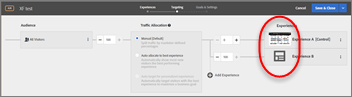

# Vanliga frågor om måloptimering och personalisering

En lista med vanliga frågor och svar om hur du använder funktionerna i Adobe Target samt information och länkar för mer information.

## Allmän information {#section_CE5713B5AAC341C9A75586C107797FA3}

**Hur kan jag se hur andra kunder har utnyttjat Adobe Target för att få bättre resultat?**

Här är bara några av våra [nöjda kunder](https://www.adobe.com/in/marketing-cloud/target/resources.html#x). Se hur kunder som ni har utnyttjat Target för att förbättra optimering och personalisering för att nå affärsmålen.

Observera att vissa av dessa fallstudier har använt funktioner från Adobe Target Premium.

**Var kan jag lära mig mer om de senaste Target-funktionerna?**

Se vår [Versionsinformation](/help/main/r-release-notes/release-notes.md#reference_8FE40B43A5A34DDF8F26A53D55EE036A) om du vill se information om den senaste versionen. Information om alla våra [tidigare versioner](/help/main/r-release-notes/release-notes-for-previous-releases.md) finns också online.

**Har Adobe en community/forum där jag kan hitta svar och mer information om Target?**

Kolla in [Forum för målgrupper](/help/main/cmp-resources-and-contact-information.md#concept_9C203A8AED054DFFA9A504811DB6BA42), där vi hjälper våra kunder, men ännu viktigare är att vi tycker att Adobe Target-läkare tycker om dig själv för att hjälpa varandra. Ett communityn och forumets framgång är trots allt beroende av att medlemmarna aktivt deltar. Bli en del av communityn och bidra och sök svar på dina frågor.

**Vilka webbläsare stöder Target?**

Läs våra [Webbläsare som stöds](https://developer.adobe.com/target/before-implement/supported-browsers/){target=_blank} matris för mer information. Observera att det finns två aspekter: Stöd för gränssnitten Target Standard/Premium Experience Cloud och webbläsarstöd för slutanvändare på datorer/enheter.

## Verksamhet {#section_CB95B3BF9934445DB98E8A7E22FC2CF6}

**Kan jag utföra en statistiskt rigorös aktivitet för att hitta en vinnande och förlorande upplevelse när jag använder en kontrollupplevelse?**

Använd [A/B-testning](/help/main/c-activities/t-test-ab/test-ab.md#task_05E33EB15C4D4459B5EAFF90A94A7977) (alternativet Manuell målanpassning) tillsammans med [Beräkna samplingsstorlek](/help/main/c-activities/t-test-ab/sample-size-determination.md#section_286EB6E671184239BB1552F0387DAEB5) för bästa resultat.

**Hur vet jag när en aktivitet ska stoppas?**

Om du stoppar aktiviteter för tidigt kan det leda till felaktiga slutsatser. Var medveten om [vanliga fallgropar och säkerställa rutiner för att undvika dem](/help/main/c-activities/t-test-ab/common-ab-testing-pitfalls.md#section_DF01A97275E44CA5859D825E0DE2F49F). Se även [Hur länge ska du köra ett A/B-test?](/help/main/c-activities/t-test-ab/sample-size-determination.md)?

**Hur utför jag en aktivitet om tidsfönstret är litet?**

**Kan jag optimera för mitt mål när jag testar?**

Använd våra [rapporter för att fastställa den vinnande upplevelsen](/help/main/c-activities/automated-traffic-allocation/determine-winner.md#concept_5741A89ED7224E1285A3BC34B2CCD0F9).

**Kan jag utföra en aktivitet med en nivå av personalisering som en integrerad del av aktiviteten?**

Checka ut [Automatiskt mål](/help/main/c-activities/auto-target/auto-target-to-optimize.md) alternativ.

**Hur vet jag vilken typ av aktivitet som passar mina behov bäst?**

Läs [Verksamhetens syfte](/help/main/c-activities/target-activities-guide.md#concept_D974B0918EB74B3B8CB07ACD32BF37A1) för att förstå scenarierna där vart och ett av de alternativ som Adobe Target erbjuder är rimligt.

Se också till att tänka [Recommendations-verksamhet](/help/main/c-recommendations/recommendations.md#concept_7556C8A4543942F2A77B13A29339C0C0).

**Hur vet jag vilka kombinationer av element på min sida som bidrar till att den blir framgångsrik och i vilken utsträckning varje element bidrar?**

Kolla in vår [Komplett multivariataktivitet (MVT)](/help/main/c-activities/c-multivariate-testing/multivariate-testing.md#concept_628695CDC71B449B8DCC2F5654C11499) med Element-bidragsanalys för att se om den uppfyller dina behov.

Observera att trafikbehovet ökar med MVT-aktiviteter.

**Kan jag köra en aktivitet som sträcker sig över flera sidor där sidstrukturen är annorlunda?**

**Kan jag tillämpa erbjudanden på olika platser (till exempel utcheckningskanalen)?**

Prova [Funktion för flersidig aktivitet](/help/main/c-experiences/c-visual-experience-composer/multipage-activity.md#concept_277E096063E14813AC5D8EDFA1D2ED48) så att ni kan använda flera sidor i upplevelserna.

**Hur kan jag säkerställa att en användare aldrig kommer in i aktiviteten igen när ett mål (primär eller sekundär) har uppnåtts och i stället ser en annan aktivitet gå framåt?**

Detta är enkelt att uppnå genom att använda [Avancerade inställningar](/help/main/c-activities/t-test-ab/t-test-create-ab/ab-goals-and-settings.md#section_E2FE441AFB324E498793ABB025ED9974) för alla mål. Du kan välja vad som ska hända när användaren har nått målet och hur du vill att räkningen ska ökas.

I det här fallet kan du alltså välja &quot;Ökningsantal, Frigör användare och fält från återinträde&quot; tillsammans med &quot;Standardinnehåll/annat aktivitetsinnehåll&quot; för att uppnå målet. Se även andra alternativ.

**Jag har skapat flera mål i min verksamhet. Kan jag skapa en kedja av mål som en kanal för rapportering och analys?**

**Jag vill till exempel överväga mål B när användaren har uppnått mål A så att jag kan spåra nummer för en viss tratt.**

Target har ett robust sätt att uppnå detta med vår funktion Metrics Dependency. Bara [lägga till beroenden till andra framgångsmått](/help/main/c-activities/r-success-metrics/success-metrics.md#section_7CE95A2FA8F5438E936C365A6D43BC5B). Du har alternativ som &quot;Nekat&quot; och &quot;Inte nått&quot; tillsammans med möjlighet att kombinera mätvärden på flera sätt för att skapa valfri kombination.

**Hur kan jag vara tydlig med hur man skapar en verksamhet för att uppnå mina mål?**

Det är här [mål](/help/main/c-activities/t-test-ab/t-test-create-ab/ab-goals-and-settings.md#reference_B25389FD6F3A4989801E740364B089CC) kom in.

Börja med att veta vad du vill optimera. Är det Intäkter, konvertering eller engagemang? Var och en av dessa alternativ är tillgängliga i målavsnittet. Och för vart och ett av dessa kan du ytterligare definiera vilken åtgärd en användare skulle vidta på din webbplats för att kvalificera att målet har uppnåtts.

Detta är möjligt med inställningen Primärt mål i steg 3 i det guidade arbetsflödet med tre delar. Du kan även lägga till ytterligare mål som kan hjälpa dig att få bättre rapporter

**Kan jag schemalägga en aktivitet att börja och sluta vid en fast tidpunkt?**

Använd [Schemaläggningsfunktion i mål och inställningar](/help/main/c-activities/t-test-ab/t-test-create-ab/ab-goals-and-settings.md#section_DCBDC354261F420EBD4B43EA34947BAC) steg i det tredelade aktivitetsarbetsflödet genom att ange start- och slutdatum.

Kom ihåg att aktivera aktiviteten. Endast aktiva aktiviteter följer det angivna schemat. När slutdatumet har nåtts försätts aktiviteten i tillståndet Avslutat.

**Kan jag ändra till bara målinriktningssteget och inte gå igenom hela det guidade trestegsarbetsflödet för redigering?**

Det kan du enkelt göra med [direkt gå till det önskade steget från sidan Aktivitetsöversikt](/help/main/c-activities/edit-activity.md#concept_BB064C0D4A194BD1A1AE7CCA1E6BB8F0) och sedan avsluta det steget med alternativet Spara och stäng.

**Kan jag fortsätta med ett visst steg, fortsätta att ändra aktiviteten (t.ex. erbjudandetext eller anpassad kod) och sedan utföra QA på en annan flik?**

Detta är också möjligt. Bara [använda alternativet Spara till att göra stegvisa ändringar utan att lämna steget](/help/main/c-activities/edit-activity.md#concept_BB064C0D4A194BD1A1AE7CCA1E6BB8F0).

**Hur kan jag förhandsgranska och göra kvalitetskontroll av en aktivitet som jag just har skapat?**

Använd våra [kraftfull QA-lägesfunktion](/help/main/c-activities/c-activity-qa/activity-qa.md) att utföra kvalitetskontroll. Du kan dela länkar med ditt QA-team och även testa aktiviteten från början till slut, inklusive rapportering, för att vara helt säker på att den fungerar som den ska och som den har testats när aktiviteten är aktiv.

**Hur kan jag använda Target beslutskraft för att få en upplevelse/ett erbjudande som kan användas i Single Page Applications (SPA) eller serverintegration?**

Använd kraften i [formulärbaserad verksamhet](/help/main/c-experiences/form-experience-composer.md#task_FAC842A6535045B68B4C1AD3E657E56E) med [JSON erbjuder](/help/main/c-experiences/c-manage-content/create-json-offer.md#concept_63C7BEE1F0DB4A7596D997219B7C136D) för att nå ditt mål.

**Jag har bildat två aktiviteter. Hur vet jag vilken besökare som kommer att träffa?**

**Kan jag ange prioritetsordning för några aktiviteter?**

Använd inställningen Prioritet som finns i steg 3 i det guidade arbetsflödet i tre delar (sidan Mål och inställningar) för att [Definiera verksamheternas prioritet.](/help/main/c-activities/t-test-ab/t-test-create-ab/ab-goals-and-settings.md#section_DCBDC354261F420EBD4B43EA34947BAC).

Det finns två alternativ:

* Standard, med tre nivåer (låg/medel/hög)
* Anpassad, med ett intervall från 0 till 999. För Anpassad aktiverar du funktionen Finkorniga prioriteringar (Administration > Visuell Experience Composer).

## Målgrupper {#section_FA6314777ABC46D8B198D6F388051460}

**Kan jag skapa ett målgruppssegment i en aktivitet som är specifik för aktiviteten? Jag tycker inte att en sådan publik ska skapas i målgruppsbiblioteket eftersom det inte finns någon återanvändningsfaktor.**

Börja använda våra [Funktion för enbart aktivitet](/help/main/c-target/creating-activity-only-audience.md#concept_A6BADCF530ED4AE1852E677FEBE68483) för att definiera målgrupper som är lokala för aktiviteten.

**Hur kan jag rikta in användare baserat på deras platser?**

Prova [Geo målgrupper](/help/main/c-target/c-audiences/c-target-rules/geo.md#concept_5B4D99DE685348FB877929EE0F942670). Läs om noggrannhetsnivåerna för den här funktionen.

**Kan jag rikta in användare baserat på vissa attribut på sidan i sessionen?**

Det bästa sättet är att använda rutor och [anpassade målgrupper](/help/main/c-target/c-audiences/c-target-rules/custom-parameters.md#concept_C4C6E00D7C5A4BE9B72D471DB2E3027B) för att leverera rätt upplevelse.

**Kan vi leverera upplevelser baserat på besökarattribut för flera besök?**

**Kan jag slumpmässigt dela upp trafiken i två bussar?**

Prova [Profilskriptfunktion](/help/main/c-target/c-visitor-profile/profile-parameters.md#concept_8C07AEAB0A144FECA8B4FEB091AED4D2). Det är ett kraftfullt sätt att personalisera upplevelser, men det kräver att ni skriver kod.

**Kan jag starta en aktivitet med ett färre antal besökare?**

Använd procentallokeringskontrollerna som är tillgängliga från [Steg 2 i det guidade arbetsflödet i tre delar (målsida)](/help/main/c-activities/t-test-ab/t-test-create-ab/ab-audience.md#concept_A268236C1224451DB7844BF67F41A087) för att bestämma hur du vill gå vidare med att konfigurera aktiviteten.

**Jag har också Adobe Analytics och vill utnyttja det med Target. Vilka nyckelfunktioner får jag genom att integrera de två lösningarna?**

Ta en titt på följande aspekter av produkten:

* [Analyser för mål (A4T)](/help/main/c-integrating-target-with-mac/a4t/a4t.md#concept_7540C8C04259434AB6EE33B09F47A1DE)
* [Kundattribut](https://developer.adobe.com/target/before-implement/methods-to-get-data-into-target/customer-attributes/)
* [Målgrupper](/help/main/c-integrating-target-with-mac/mmp.md)

## Erfarenheter {#section_5959536B8D6A4BEA8FAA1273338F3451}

**Kan jag köra en aktivitet på flera sidor där sidstrukturen är gemensam?**

Checka ut [Mallregler](/help/main/c-experiences/c-visual-experience-composer/temtest.md#task_2539D51A18044F82B0D9895636546781) för att inkludera många liknande strukturerade sidor som aktiviteten men ändå skapa upplevelsen på den enda URL som tillhandahålls.

**Jag är trött på meddelandet&quot;Tillåt att webbläsaren läser in skript&quot; när jag försöker läsa in min sida i Visual Experience Composer (VEC). Hur kan jag undvika det här?**

Det beror på att din webbplats har blandat innehåll - det är en plats som hämtar både HTTP- och HTTPS-resurser. Begär att IT-teamet flyttar till HTTPS helt.

Följ instruktionerna i [Aktivera blandat innehåll i webbläsaren](/help/main/c-experiences/c-visual-experience-composer/r-troubleshoot-composer/mixed-content.md#concept_46D022D50280468C9EF6D5DF6EFC911C) så att webbläsaren kan läsa in blandat innehåll. Detta är en säkerhetsfunktion i de flesta moderna webbläsare.

**Kan jag testa Visual Experience Composer (VEC) på min webbplats trots att Target at.js-biblioteket ännu inte har distribuerats?**

Prova att läsa in sidan med [Förbättrad Experience Composer](/help/main/c-experiences/experiences.md#section_34265986611B4AB8A0E4D6ACC25EF91D).

**Varför läses inte min webbplats in i Visual Experience Composer (VEC)?**

Prova [felsökningsinformation](/help/main/c-experiences/c-visual-experience-composer/r-troubleshoot-composer/troubleshoot-composer.md#reference_77743144F10143A3A89D56E116D296E4) som beskrivs på vår hjälpsida. Nå ut till [Stöd för Adobe](/help/main/cmp-resources-and-contact-information.md#reference_ACA3391A00EF467B87930A450050077C) om ingen av dessa metoder fungerar.

Vi har också [formulärbaserad metod](/help/main/c-experiences/form-experience-composer.md#task_FAC842A6535045B68B4C1AD3E657E56E) som kan låsa upp dig.

Läs även när och varför [Förbättrad Experience Composer](/help/main/c-experiences/experiences.md#section_34265986611B4AB8A0E4D6ACC25EF91D) kan vara användbart. Du kanske måste kontakta din IT-avdelning för att [tillåtelselista Adobe proxyservrar](/help/main/c-experiences/c-visual-experience-composer/experience-composer-best-practices.md#concept_E284B3F704C04406B174D9050A2528A6) också.

**Jag har en responsiv sajt. Hur vet jag att jag tänker använda nyckelenheter när jag skapar en aktivitet?**

Prova [Mobilvisningsrutor](/help/main/c-experiences/c-visual-experience-composer/mobile-viewports.md#concept_8E45527C4ABC41D59AA3553BEDC76FA5) -funktion. Observera att det bara fungerar när Förbättrad Experience Composer är aktiverat.

**Jag har flera domäner. En av domänerna måste ha Förbättrad Experience Composer aktiverat, medan andra måste ha det inaktiverat. Hur kan jag göra såhär?**

Du kan alltid använda [Alternativet Förbättrad Experience Composer på aktivitetsnivå](/help/main/c-experiences/experiences.md#section_34265986611B4AB8A0E4D6ACC25EF91D) om du vill åsidosätta standardinställningen (Administration > Visual Experience Composer).

**Varför visas inte ett alternativ för att byta bilder?**

Nå ut till Adobe till [se till att ditt konto har konfigurerats för Scene7](/help/main/administrating-target/scene7-settings.md#task_37AD0768EFBA4E588955FE3D5DD670A5). När du väl har etablerat dig kan du enkelt byta ut en bild mot en annan bild.

**Jag vill testa mellan två olika upplevelser, till exempel rabatt på platt och rabatt i procent, men jag vill att upplevelserna ska vara rätt riktade (visa olika språkversioner eller olika valutor för personer som kommer från olika länder). Hur kan jag göra såhär?**

Du kan enkelt uppnå detta med våra [Funktionen Multiple Experience Versions](/help/main/c-activities/t-test-ab/t-test-create-ab/target-experience-to-multiple-audiences.md#task_0138112E283A4A5B9F8AB9AAF2FBC2FF). Notera nyanserna kring leverans i sådana tester

**Hur ser jag vilka ändringar jag har gjort i Visual Experience Composer (VEC)?**

Vi visar alltid dina ändringar i [Kodredigeraren](/help/main/c-experiences/c-visual-experience-composer/c-vec-code-editor/vec-code-editor.md#concept_B3A6E9EE3A60406DB640E205EA1745B5). På fliken Ändringar visas den CSS-väljare eller ruta som du har använt på ditt erbjudande.

Observera att CSS-väljaren är en enkel väljare. Du kan använda det här avsnittet för att göra mindre ändringar eller ta bort vissa erbjudanden snabbt.

**Jag vill leverera JavaScript som en del av experimentet/aktiviteten för att antingen göra ändringar direkt för vissa dynamiska element eller bara skicka ett anrop till en tredjepartslösning. Hur kan jag göra såhär?**

Ett sätt är att använda [Anpassad kodredigerare](/help/main/c-experiences/c-visual-experience-composer/c-vec-code-editor/vec-code-editor.md#concept_B3A6E9EE3A60406DB640E205EA1745B5). Sätt JavaScript i sektionen så levereras det. Du kan välja att skicka den i huvudet eller överst på kroppen, beroende på dina behov.

**Varför kan jag inte gå förbi inloggningssidan i Visual Experience Composer (VEC) eller till en sida som är nedgrävd och där jag inte har någon specifik URL?**

Använd funktionerna Disponera och Bläddra för att navigera till valfri sida och börja skapa din upplevelse.

**Hur kan jag gå till den upplevelse jag väljer från steg 2 i det guidade arbetsflödet i tre delar (målsida)?**

Klicka på miniatyrbilden framför upplevelsenamnet i steg 2 så får du en bättre upplevelse.

**Jag är en tidigare Target Classic-användare. Kan jag utnyttja mina lådor för vissa syften?**

Använd [formulärbaserad metod](/help/main/c-experiences/form-experience-composer.md#task_FAC842A6535045B68B4C1AD3E657E56E) för att skapa aktiviteter.

**Varför ser jag inte det önskade erbjudandet/upplevelsen och ser i stället någon annan aktivitet?**

Använd våra [debugger](/help/main/c-activities/c-troubleshooting-activities/content-trouble.md#concept_D2548B486C984B1E97ED7A72075B8EEA) och sök efter [aktivitetskonflikter](/help/main/c-experiences/c-visual-experience-composer/activity-collisions.md#concept_0BC6B929592744DFA7DA01FF4F91052E).

## Erbjudanden {#section_A547B1EAD0B34FD38D3B87AAF62E3963}

**Jag vill inte prova smärre ändringar, utan istället testa en helt ny sida.**

**Jag vill dirigera användare till en landningssida, till exempel en ny start.**

**Hur kan jag göra såhär?**

Vi har [Funktionen Omdirigera URL](/help/main/c-experiences/c-manage-content/offer-redirect.md#task_33C80CD722564303B687948261484F94) som gör att du kan dirigera om användare till valfri sida (med eller utan de aktuella frågeparametrarna).

**Varför sker inte innehållsleverans i min QA-process?**

Det är möjligt att din plats kan ha dynamiska ID:n, duplicerade ID:n eller dynamiska klasser för element. Du kan behöva utvärdera webbplatsinställningarna på kontonivå (eller på aktivitetsnivå om problemet är specifikt för en domän eller sida). Se [CSS-väljare](/help/main/administrating-target/visual-experience-composer-set-up.md#css).

**Varför ser jag inte det önskade erbjudandet/upplevelsen och ser i stället någon annan aktivitet?**

Använd våra [debugger](/help/main/c-activities/c-troubleshooting-activities/content-trouble.md#concept_D2548B486C984B1E97ED7A72075B8EEA) och sök efter [aktivitetskonflikter](/help/main/c-experiences/c-visual-experience-composer/activity-collisions.md#concept_0BC6B929592744DFA7DA01FF4F91052E).

**Kan jag använda Target beslutskraft för att få en upplevelse/ett erbjudande som kan användas i Single Page-program (SPA) eller integreringar på serversidan?**

Använd kraften i [formulärbaserad verksamhet](/help/main/c-experiences/form-experience-composer.md#task_FAC842A6535045B68B4C1AD3E657E56E) med [JSON erbjuder](/help/main/c-experiences/c-manage-content/create-json-offer.md#concept_63C7BEE1F0DB4A7596D997219B7C136D) för att nå ditt mål.

## Rapporter (inklusive analyser för Target - A4T) {#section_8AECC69BEEB7422E894E7EC44A50BA0A}

**Jag har också Adobe Analytics och vill utnyttja det med Target. Vilka nyckelfunktioner får jag genom att integrera de två lösningarna?**

Ta en titt på följande aspekter av produkten:

* [Analyser för mål (A4T)](/help/main/c-integrating-target-with-mac/a4t/a4t.md#concept_7540C8C04259434AB6EE33B09F47A1DE)

* [Kundattribut](https://developer.adobe.com/target/before-implement/methods-to-get-data-into-target/customer-attributes/)

* [Målgrupper](/help/main/c-integrating-target-with-mac/mmp.md)

**Kan jag segmentera och tona ned rapporteringen för flera användarsegment?**

Det är här [Målgrupper för rapporteringsfunktionen](/help/main/c-activities/t-test-ab/t-test-create-ab/ab-goals-and-settings.md#section_13119392051044FBA6387D9B3B1C43CF) som finns på sidan Mål och inställningar i steg 3 i det guidade arbetsflödet med tre delar.

Du kan lägga till 50 sådana segment och även programpunkten (aktivitetspost eller ett visst mått) för att få ett kraftfullt sätt att segmentera och skära.

Observera att Target samlar in data i det här avseendet från den tidpunkt du lägger till dessa målgrupper, så om du missar att lägga till segment innan du kör testet har du inte tur.

**Jag kan inte definiera målgrupper innan jag kör aktiviteten. Den här aspekten av att rapportera målgrupper i Target-aktiviteter är begränsande.**

**Vad kan jag göra för att förenkla den här processen?**

Det är här [Analyser för mål (A4T)](/help/main/c-integrating-target-with-mac/a4t/a4t.md#concept_7540C8C04259434AB6EE33B09F47A1DE) är praktiskt. Om du har Adobe Analytics väljer du bara källan som Analytics, vilket eliminerar den här begränsningen. Nu kan ni göra analyser för alla typer av målgrupper, och ni behöver inte definiera de rapporterande målgrupperna direkt.

**Kan jag utföra offlinerapporteringsberäkningar?**

Använd [Alternativ för att exportera rapporter till CSV och hämta beställningsinformation till CSV](/help/main/c-reports/downloading-data-in-csv-file.md#concept_3F276FF2BBB2499388F97451D6DE2E75) på rapportsidan om du vill hämta önskade rapportdata.

**Kan jag ändra kontrollupplevelsen för att utvärdera rapporter eller ändra beräkningsmetoden från besökare till besök?**

Gör dessa ändringar med [Inställningsutrustning på rapportsidan](/help/main/c-reports/c-report-settings/report-settings.md#concept_4BB6A7FDAB6F4806A632F9CD989B8BFA). Läs mer om de här inställningarna för att förstå hur beräkningarna varierar.

**Hur ska jag tolka rapporter?**

Vi har försökt att göra rapporter så intuitiva som möjligt med funktioner som [konfidensintervallfält, lyft gränser, signifikans/konfidens och flera mätvärden, tabell- och diagramvyer, löpande medelvärden med mera](/help/main/c-reports/c-report-settings/report-settings.md#concept_4BB6A7FDAB6F4806A632F9CD989B8BFA) för kraftfull, men ändå enkel, rapportanalys. Det är tydligt att ni kan undersöka Analytics om ni använder [Analyser för mål (A4T)](/help/main/c-integrating-target-with-mac/a4t/a4t.md#concept_7540C8C04259434AB6EE33B09F47A1DE) verksamhet för ytterligare analys av målgrupper,

## Svarstoken {#section_C2A7118B4B62482A9D630C2212112A3D}

**Kan jag genomföra en integrering med ett tredjepartssystem, som Google Analytics eller ClickTale, för att skicka aktivitetsinformationen som skickas till en slutanvändare för analys?**

Vi har också en lösning för det med våra [Funktionen Svarstoken](/help/main/administrating-target/response-tokens.md#concept_2B21B222F6A344D68CA5929817E836C4).

## Felsökning {#section_6B8B4DC62AE34066A8C55915E9EC6C19}

**Hur vet jag tillgänglighetsstatus för Adobe Target?**

Använd [Adobe systemstatussida](/help/main/r-release-notes/system-status-updates.md#concept_5CBDF506BEFA40E483CC7DE0DA915EAD) för att se status för Adobe-produkter och Experience Cloud-lösningar, inklusive Target. På den här sidan kan du avgöra om de problem du kan råka ut för beror på systemuppdateringar eller rutinunderhåll.

**Har du en felsökningsguide?**

Vi beklagar att du har problem. Checka ut [Felsökningsmål](/help/main/r-troubleshooting-target/troubleshooting-target.md#reference_A9DB82675D044BD8861F6752A4EE6839) för länkar till många felsökningsämnen.

## Målmobilappar {#section_07BA89F2C38747158ECD5B153274AEAF}

**Vi har en mobil SKU. Kan jag skapa mobilaktiviteter?**

För optimering och personalisering på mobilen måste ni använda [formulärbaserad verksamhet](/help/main/c-experiences/form-experience-composer.md#task_FAC842A6535045B68B4C1AD3E657E56E) tillsammans med [Adobe SDK](https://developer.adobe.com/target/implement/mobile/enable-target-in-sdk/){target=_blank}. Läs mer om [Mål för mobilappar](https://developer.adobe.com/target/implement/mobile/){target=_blank}.

## Mål-API:er {#section_714E85EFF6E3400389EF2E40D538E1DA}

**Var kan jag läsa mer om Target API:er?**

Vi har utförlig dokumentation om API:er. Se [Dokumentation för leverans-API:er, NodeJS SDK och Recommendations API:er](https://developer.adobe.com/target/implement/server-side/){target=_blank}.
