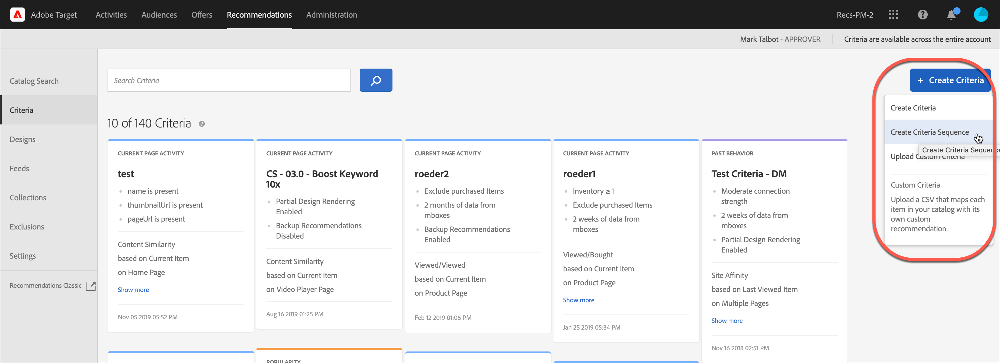

#  Skapa villkorssekvenser

Använd sekvenser med upp till fem kriterier för att få bättre kontroll över de objekt som visas i [!UICONTROL Recommendations] verksamhet. Du kan också begränsa antalet returnerade objekt (kallas ibland för&quot;platskontrollen&quot;).

>[!NOTE]
>
>Villkorssekvenser kan inte användas med [!UICONTROL Recommendations] aktiviteter skapade före oktober 2016-utgåvan av [!DNL Target Premium].

Om du vill skapa en villkorssekvens måste du först skapa de villkor som du vill inkludera i sekvensen. Se [Skapa villkor](/help/main/c-recommendations/c-algorithms/create-new-algorithm.md) för mer information.

Genom att använda en villkorssekvens kan du ange ytterligare riktade rekommendationer, i stället för att använda mer allmänna rekommendationer för säkerhetskopiering, när ett villkor inte returnerar tillräckligt många resultat för att fylla din design. Vanligtvis går en villkorssekvens från mer specifik målgruppsanpassning, som kan returnera färre resultat, till mer allmän målgruppsanpassning, som vanligtvis ger fler resultat.

Dina villkorssekvenser kan variera i ordning beroende på sidtypen, vilket visas i följande exempel:

| Sidtyp | Möjlig sekvensordning |
| --- | --- |
| Produktsida | <ol><li>Baserat på aktuellt objekt, från samma varumärke</li><li>Baserat på aktuellt objekt, från alla varumärken</li><li>Baserat på innehållets likhet</li><li>Baserat på de främsta säljarna</li><li>Baserat på de mest visade objekten på webbplatsen</li></ol> |
| Startsida | <ol><li>Baserat på besökarens senaste köp </li><li>Baserat på besökarens favoritobjekt</li><li>Baserat på besökarens favoritkategori</li><li>Baserat på de främsta säljarna</li><li>Baserat på de mest visade sidorna på webbplatsen</li></ol> |

## Skapa en villkorssekvens

Du skapar villkorssekvenser från [!UICONTROL Create Criteria Sequence] skärm.

Det finns flera sätt att nå [!UICONTROL Create Criteria Sequence] skärm. Vissa skärmalternativ varierar beroende på hur du kommer till skärmen.

* På **[!UICONTROL Recommendations]** > **[!UICONTROL Criteria]** biblioteksskärm, klicka **[!UICONTROL Create Criteria]** > **[!UICONTROL Create Criteria Sequence]**. Kriterierna som du skapar här blir automatiskt tillgängliga för alla [!UICONTROL Recommendations] verksamhet.
* När du skapar en [!UICONTROL Recommendations] -aktivitet, från skärmen Välj villkor, klicka på **[!UICONTROL Create New]** > **[!UICONTROL Create Criteria Sequence]**. Du kan välja att spara den nya villkorssekvensen och använda den med andra [!UICONTROL Recommendations] verksamhet.
* När du redigerar en [!UICONTROL Recommendations] aktivitet, klicka på en [!UICONTROL Recommendations Location] på sidan och välj **[!UICONTROL Change Criteria]**. På [!UICONTROL Select Criteria] skärm, klicka **[!UICONTROL Create New]** > **[!UICONTROL Create Criteria Sequence]**. Du kan spara dina nya villkor och använda dem tillsammans med andra [!UICONTROL Recommendations] verksamhet.

Följande steg förutsätter att du har åtkomst till [!UICONTROL Create Criteria Sequence] skärm med den första metoden: den **[!UICONTROL Recommendations]** > **[!UICONTROL Criteria]** biblioteksskärm.

1. Klicka på **[!UICONTROL Recommendations]** > **[!UICONTROL Criteria]**.

1. Klicka på **[!UICONTROL Create Criteria]** > **[!UICONTROL Create Criteria Sequence]**.

   

1. Fyll i informationen i [Grundläggande information](/help/main/c-recommendations/c-algorithms/create-new-algorithm.md#info) -avsnitt.

1. I **[!UICONTROL Criteria Sequence]** avsnitt, klicka **[!UICONTROL Add Criteria]**.

   Sekvensordningen definierar i vilken ordning en design fylls. Om Villkor 1 inte har tillräckligt många rekommendationer för att fylla din design fylls de återstående platserna med villkor 2 och så vidare.

   

1. På [!UICONTROL Select Criteria] väljer du ett villkor och klickar sedan på **[!UICONTROL Add]**.

   Du kan använda sökrutan och listrutorna för filter för att hitta önskat villkor.

   

1. (Valfritt) Skjut **[!UICONTROL Limit the number of items returned]** växla till&quot;på&quot;-positionen och ange sedan antalet objekt (mellan 1 och 50).

   

   För att du ska förstå värdet på [!UICONTROL Limit the number of items returned] (kallas ibland&quot;kontroll på platshållarnivå&quot;) kan följande användas:

   * **Användningsfall 1**: Du vill ha en blandning av olika typer av objekt i ett enda rekommendationsfack. Du kan till exempel visa en blandning av ytterkläder (schaket) och överdelar (skjortor, T-shirts). För att uppnå detta ska du använda en samling för aktiviteten som innehåller alla möjliga produkttyper du vill ha i platserna i designen. Ange sedan dina första kriterier med ett statiskt filter som begränsar kriterierna så att de bara omfattar ytterkläder, och ange dina andra kriterier med ett statiskt filter som begränsar kriterierna så att de bara omfattar toppar. Lägg slutligen till båda villkoren i en villkorssekvens och begränsa det första villkoret till 2 kortplatser.

      Rekommendationsfältet kan se ut så här på din webbplats:

      

   * **Användningsfall 2**: Du vill ha en blandning av både alternativa objekt och kompletterande objekt. Ange ett villkor för att använda en visad/visad algoritm och använd ett dynamiskt filter som begränsar de rekommenderade objekten till det aktuella objektets kategori. Ställ in det andra villkoret för att använda en visad/köpt algoritm och använd ett dynamiskt filter som endast innehåller rekommenderade objekt som inte matchar det aktuella objektets kategori. Lägg slutligen till båda villkoren i en sekvens och begränsa det första villkoret till två kortplatser.

1. Fortsätt lägga till ytterligare villkor i sekvensen. Du kan lägga till upp till fem villkor i en sekvens.

1. Aktivera [Alternativ för att säkerhetskopiera innehåll](/help/main/c-recommendations/c-algorithms/create-new-algorithm.md#content).

1. Klicka på **[!UICONTROL Save]**.

   Villkorssekvensen visas i kriterielistan.

   Mer information om alternativ för rekommendationslogik finns i [Kriterier](/help/main/c-recommendations/c-algorithms/algorithms.md).

## Utbildningsvideo: Skapa villkor i Recommendations (12:33) 

Den här videon innehåller följande information:

* Skapa villkor
* Skapa villkorssekvenser
* Överför anpassade villkor

>[!VIDEO](https://video.tv.adobe.com/v/27694?quality=12)
