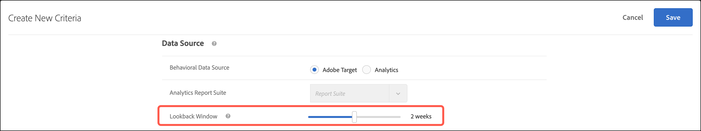

# Skapa villkor

Kriterier i [!UICONTROL Adobe Target] [!UICONTROL Recommendations] styr innehållet i dina [!UICONTROL Recommendations]-aktiviteter. Skapa villkor för att visa de rekommendationer som är lämpligast för din aktivitet. Dessa kriterier använder besökarens åtgärder för att avgöra vilket innehåll eller vilka produkter som ska visas.

I följande avsnitt beskrivs hur du skapar nya villkor.

## Öppna skärmen Skapa nya villkor

Det finns flera sätt att nå skärmen [!UICONTROL Create New Criteria]. Vissa skärmalternativ varierar beroende på hur du kommer till skärmen.

* Klicka på **[!UICONTROL Recommendations]** > **[!UICONTROL Criteria]** på biblioteksskärmen **[!UICONTROL Create Criteria]** > **[!UICONTROL Create Criteria]**. Kriterier som du skapar här blir automatiskt tillgängliga för alla [!DNL Recommendations]-aktiviteter.
* När du skapar en [!DNL Recommendations]-aktivitet med [!UICONTROL Visual Experience Composer] (VEC) visas du omedelbart på skärmen [!UICONTROL Select Criteria] när du har markerat ett element på sidan och klickat på [!UICONTROL Replace w/ Recommendations], [!UICONTROL Insert Recommendations Before] eller [!UICONTROL Insert Recommendations After]. Du kan sedan välja ett tillgängligt villkor eller klicka på **[!UICONTROL Create Criteria]**. Om du skapar ett nytt villkor kan du välja att spara villkoret för användning med andra [!DNL Recommendations]-aktiviteter. Mer information finns i [Skapa en rekommendationsaktivitet](/help/main/c-recommendations/t-create-recs-activity/create-recs-activity.md).
* När du redigerar en [!DNL Recommendations]-aktivitet klickar du i en [!UICONTROL Recommendations Location]-ruta på sidan och väljer **[!UICONTROL Change Criteria]**. Klicka på [!UICONTROL Select Criteria] på skärmen **[!UICONTROL Create Criteria]**. Du kan spara dina nya villkor och använda dem med andra [!DNL Recommendations]-aktiviteter.

Följande steg förutsätter att du kommer åt skärmen [!UICONTROL Create New Criteria] med den första metoden: biblioteksskärmen **[!UICONTROL Recommendations]** > **[!UICONTROL Criteria]**.

1. Klicka på **[!UICONTROL Recommendations]** > **[!UICONTROL Criteria]**.

1. Klicka på **[!UICONTROL Create Criteria]** > **[!UICONTROL Create Criteria]**.

1. Konfigurera informationen i följande avsnitt.

## [!UICONTROL Basic Information] {#info}

1. Skriv en **[!UICONTROL Criteria Name]**.

   Detta är det&quot;interna&quot; namnet som används för att beskriva kriterierna. Du kanske vill kalla villkoren för&quot;Produkter med högsta marginal&quot;, men du vill inte att den titeln ska visas offentligt. Se nästa steg för att ange den offentliga titeln.

1. Skriv en offentlig **[!UICONTROL Display Title]** som ska visas på sidan för alla rekommendationer som använder det här villkoret.

   Du kan till exempel visa&quot;Personer som visade det här&quot; eller&quot;Liknande produkter&quot; när du använder det här villkoret för att visa rekommendationer.

1. Ange en kort **[!UICONTROL Description]** av villkoren.

   Beskrivningen bör hjälpa dig att identifiera villkoren och kan innehålla information om syftet med kriterierna.

1. Välj en vertikal bransch baserat på målen för dina rekommendationer.

   | Branschvertikal | Mål |
   |--- |--- |
   | [!UICONTROL Retail/Ecommerce] | Konvertering som resulterar i inköp |
   | [!UICONTROL Lead Generation/B2B/Financial Services] | Konvertering utan köp |
   | [!UICONTROL Media/Publishing] | Engagemang |

   Andra kriteriealternativ ändras beroende på vilken vertikal du väljer i branschen.

1. Välj en **[!UICONTROL Page Type]**.

   Du kan välja flera sidtyper.

   Tillsammans hjälper de vertikala metoderna i branschen och sidtyperna dig att kategorisera dina sparade villkor, vilket gör det enklare att återanvända villkor för andra [!DNL Recommendations]-aktiviteter.

## [!UICONTROL Recommendations Algorithm] {#rec-algo}

1. Välj en **[!UICONTROL Algorithm Type]** och **[!UICONTROL Algorithm]**:

   

   | Algoritmtyp | Använd/Tillgängliga algoritmer |
   | --- | --- |
   | [!UICONTROL Cart-Based] | Utför rekommendationer baserat på användarens kundvagnsinnehåll. <ul><li>[!UICONTROL People Who Viewed These, Also Viewed] </li><li>[!UICONTROL People Who Viewed These, Also Bought]</li><li>[!UICONTROL People Who Bought These, Also Bought]</li></ul> |
   | [!UICONTROL Popularity-Based] | Utför rekommendationer baserat på hur populärt ett objekt på webbplatsen är eller utifrån hur populärt det är att ha objekt inom en användares favoritkategori, varumärke, genre osv. <ul><li>[!UICONTROL Most Viewed Across the Site]</li><li>[!UICONTROL Most Viewed by Category]</li><li>[!UICONTROL Most Viewed by Item Attribute]</li><li>[!UICONTROL Top Sellers Across the Site]</li><li>[!UICONTROL Top Sellers by Category]</li><li>[!UICONTROL Top Sellers by Item Attribute]</li><li>[!UICONTROL Top by Analytics Metric]</li></ul> |
   | [!UICONTROL Item-Based] | Rekommendationer baserade på sökning efter liknande objekt för ett objekt som användaren för närvarande visar eller nyligen har visat. <ul><li>[!UICONTROL People Who Viewed This, Viewed That]</li><li>[!UICONTROL People Who Viewed This, Bought That]</li><li>[!UICONTROL People Who Bought This, Bought That]</li><li>[!UICONTROL Items with Similar Attributes]</li></ul> |
   | [!UICONTROL User-Based] | Utför rekommendationer baserat på användarens beteende.<ul><li>[!UICONTROL Recently Viewed Items]</li><li>[!UICONTROL Recommended for You]</li></ul> |
   | [!UICONTROL Custom Criteria] | Utför rekommendationer baserat på en anpassad fil som du överför.<ul><li>Anpassad algoritm</li></ul> |

   >[!NOTE]
   >
   >Om du väljer **[!UICONTROL Items]**/ **[!UICONTROL Media with Similar Attributes]** kan du ange [likhetsregler för innehåll](#similarity).

1. Välj ett **objektattribut** och **profilattribut som matchar**, en **rekommendationsnyckel**, **filtreringsnyckel** och/eller **analysmått** för att konfigurera algoritmen.

De återstående alternativen för algoritmkonfigurationen varierar beroende på den valda algoritmen. Om du vill slutföra konfigurationen av algoritmen väljer du [!UICONTROL Recommendation Key], [!UICONTROL Filtering Key], [!UICONTROL Co-Occurrence Basis], [!UICONTROL Analytics Metric] och/eller [!UICONTROL Item Attribute] och [!UICONTROL Profile Attribute to Match].

Mer information om att välja [!UICONTROL Recommendation Key] finns i [Basera rekommendationen på en rekommendationsnyckel](/help/main/c-recommendations/c-algorithms/base-the-recommendation-on-a-recommendation-key.md).

## [!UICONTROL Backup Content] {#content}

[!UICONTROL Backup Content]-regler avgör vad som händer om antalet rekommenderade objekt inte uppfyller din [rekommendationsdesign](/help/main/c-recommendations/c-design-overview/design-overview.md). [!DNL Recommendations]-kriterier kan returnera färre rekommendationer än vad din design kräver. Om din design till exempel har platser för fyra objekt, men dina villkor bara leder till att två objekt rekommenderas, kan du lämna de återstående platserna tomma, du kan använda rekommendationer för säkerhetskopiering för att fylla de extra platserna, eller så kan du välja att inte visa några rekommendationer.

1. (Valfritt) Skjut **[!UICONTROL Partial Design Rendering]**-växeln till&quot;på&quot;-positionen.

   Så många kortplatser som möjligt kommer att fyllas, men designmallen kan innehålla tomt utrymme för återstående kortplatser. Om det här alternativet är inaktiverat och det inte finns tillräckligt med innehåll för att fylla alla tillgängliga platser, kommer inga rekommendationer att visas och standardinnehåll visas i stället.

   Aktivera det här alternativet om du vill att rekommendationer ska hanteras med tomma platser. Använd rekommendationer för säkerhetskopiering om du vill att rekommendationsplatserna ska fyllas med innehåll baserat på dina kriterier med tomma platser fyllda med liknande eller populärt innehåll från platsen, vilket förklaras i nästa steg.

1. (Valfritt) Skjut **[!UICONTROL Show Backup Content]**-växeln till&quot;på&quot;-positionen.

   Fyll eventuella återstående tomma platser i designen med ett slumpmässigt urval av de mest visade produkterna från hela sajten.

   Genom att använda rekommendationer för säkerhetskopiering försäkrar du dig om att din rekommendationsdesign fyller alla tillgängliga platser. Anta att du har en design på 4 x 1 enligt nedan:

   

   Anta att dina kriterier gör att bara två objekt rekommenderas. Om du aktiverar alternativet [!UICONTROL Partial Design Rendering] fylls de två första platserna i, men de återstående två platserna förblir tomma. Om du aktiverar alternativet [!UICONTROL Show Backup Recommendations] fylls de första två kortplatserna i baserat på dina angivna villkor och de återstående två kortplatserna fylls i baserat på dina rekommendationer för säkerhetskopiering.

   I följande matris visas resultatet som du kommer att observera när du använder alternativen [!UICONTROL Partial Design Rendering] och [!UICONTROL Backup Content]:

   | Delvis designåtergivning | Säkerhetskopiera innehåll | Resultat |
   |--- |--- |--- |
   | Handikappade | Handikappade | Om färre rekommendationer returneras än vad designen kräver ersätts rekommendationsdesignen med standardinnehåll och inga rekommendationer visas. |
   | Aktiverad | Handikappade | Designen återges, men kan innehålla tomt utrymme om färre rekommendationer returneras än vad designanropen kräver. |
   | Aktiverad | Aktiverad | Rekommendationer för säkerhetskopiering fyller i tillgängliga designfack och återger designen helt. Om inkluderingsregler tillämpas på rekommendationer för säkerhetskopiering, begränsas antalet kvalificerade rekommendationer för säkerhetskopiering till den punkt där designen inte kan fyllas, återges designen delvis. Om villkoret inte returnerar några rekommendationer och inkluderingsreglerna begränsar rekommendationerna för säkerhetskopiering till noll, ersätts designen med standardinnehåll. |
   | Handikappade | Aktiverad | Rekommendationer för säkerhetskopiering fyller i tillgängliga designfack och återger designen helt. Om inkluderingsregler tillämpas på rekommendationer för säkerhetskopiering, begränsas antalet kvalificerade rekommendationer för säkerhetskopiering till den punkt där designen inte kan fyllas, ersätts designen med standardinnehåll och inga rekommendationer visas. |

   Mer information finns i [Använd en rekommendation för säkerhetskopiering](/help/main/c-recommendations/c-algorithms/backup-recs.md).

1. (Villkorligt) Om du valde **[!UICONTROL Show Backup Content]** i föregående steg kan du aktivera **[!UICONTROL Apply inclusion rules to backup recommendations]**.

   Inkluderingsregler avgör vilka objekt som tas med i dina rekommendationer. Vilka alternativ som är tillgängliga beror på var du arbetar vertikalt.

   Mer information finns i [Ange inkluderingsregler](#inclusion) nedan.

## [!UICONTROL Data Source] {#data-source}

1. Välj önskad **[!UICONTROL Behavioral Data Source]**: [!UICONTROL Adobe Target] eller [!UICONTROL Analytics].

   >[!NOTE]
   >
   >Avsnittet [!UICONTROL Behavioral Data Source] visas bara om implementeringen använder [Analytics for Target](/help/main/c-integrating-target-with-mac/a4t/a4t.md) (A4T).

   

   Om du väljer [!UICONTROL Analytics] väljer du önskad rapportserie.

   Om villkoret använder [!DNL Adobe Analytics] som beteendedatakälla beror tiden för kriteriernas tillgänglighet på om den valda rapportsviten och uppslagsfönstret har använts för andra villkor, enligt följande:

   * **Installation av en engångsrapportsserie**: Första gången en rapportsvit används med ett visst fönster för dataområdessökning kan det ta mellan två och sju dagar för [!DNL Target Recommendations] att helt hämta beteendedata för den valda rapportsviten från [!DNL Analytics]. Tidsramen är beroende av systeminläsningen för [!DNL Analytics].
   * **Nya eller redigerade villkor med en redan tillgänglig rapportsvit**: När du skapar ett nytt villkor eller redigerar ett befintligt villkor och den valda rapportsviten redan har använts med [!DNL Target Recommendations], med ett dataintervall som är lika med eller mindre än det valda dataintervallet, är data omedelbart tillgängliga och ingen engångsinställning krävs. I det här fallet, eller om en algoritms inställningar redigeras utan att den valda rapportsviten eller det valda dataintervallet ändras, körs eller körs om inom 12 timmar.
   * **Pågående algoritm kör**: Data flödar från [!DNL Analytics] till [!DNL Target Recommendations] dagligen. För rekommendationen [!UICONTROL Viewed Affinity] skickas till exempel ett spårningsanrop i produktvyn till [!DNL Analytics] i närheten av realtid när en användare tittar på en produkt. [!DNL Analytics]-data skickas till [!DNL Target] tidigt nästa dag och [!DNL Target] kör algoritmen på mindre än 12 timmar.

   Mer information finns i [Använd Adobe Analytics med målrekommendationer](/help/main/c-recommendations/c-algorithms/use-adobe-analytics-with-recommendations.md).

1. Ange **[!UICONTROL Lookback Window]** för att bestämma tidsintervallet för tillgängliga historiska användarbeteendedata som ska användas när rekommendationer ska fastställas. Det här alternativet är tillgängligt för alla algoritmer med undantag av [!UICONTROL Items with Similar Attributes] och [!UICONTROL Custom Algorithms].

   

   Om det finns mycket trafik och beteenden på platsen ändras ofta väljer du ett kortare datafönster. Ett kortare fönster gör att [!DNL Recommendations] kan reagera mer på förändringar på marknaden och i din verksamhet. Ett kortare fönster innebär till exempel att [!DNL Recommendations] kommer att upptäcka förändringar i besökarnas beteende när besökarna börjar handla säsongsmässigt, till exempel handla på skolstarten eller i julen, och rekommenderar artiklar som passar dessa shoppingsäsonger.

   Om du inte har så mycket data eller besökarbeteendet inte ändras så ofta kan du välja ett längre fönster. För många webbplatser ger dock ett kortare fönster bättre rekommendationer.

   De tillgängliga dataintervallen är:

   | Alternativet Fönster för uppläsning | Uppdaterad frekvens (visas vid hovring) | Algoritmer som stöds |
   | --- | --- | --- |
   | Sex timmar | Algoritmen körs var 3:e till 6:e timme | [!UICONTROL Popularity-Based] algoritmer när den markerade [!UICONTROL Behavioral Data Source] är [!DNL Adobe Target] |
   | En dag | Algoritmen körs var 12-24:e timme | [!UICONTROL Popularity-Based] algoritmer |
   | Två dagar | Algoritmen körs var 12-24:e timme | <ul><li>[!UICONTROL Popularity-Based] algoritmer</li><li>[!UICONTROL Item-Based] algoritmer</li><li>[!UICONTROL User-Based] algoritmer</li><li>[!UICONTROL Cart-Based] algoritmer</li></ul> |
   | En vecka | Algoritmen körs var 24:e till 48:e timme | <ul><li>[!UICONTROL Popularity-Based] algoritmer</li><li>[!UICONTROL Item-Based] algoritmer</li><li>[!UICONTROL User-Based] algoritmer</li><li>[!UICONTROL Cart-Based] algoritmer</li></ul> |
   | Två veckor | Algoritmen körs var 24:e till 48:e timme | <ul><li>[!UICONTROL Popularity-Based] algoritmer</li><li>[!UICONTROL Item-Based] algoritmer</li><li>Alla [!UICONTROL User-Based]-algoritmer</li><li>[!UICONTROL Cart-Based] algoritmer</li></ul> |
   | En månad (30 dagar) | Algoritmen körs var 24:e till 48:e timme | <ul><li>[!UICONTROL Popularity-Based] algoritmer</li><li>[!UICONTROL Item-Based] algoritmer</li><li>[!UICONTROL User-Based] algoritmer</li><li>[!UICONTROL Cart-Based] algoritmer</li></ul> |
   | Två månader (61 dagar) | Algoritmen körs var 24:e till 48:e timme | <ul><li>[!UICONTROL Popularity-Based] algoritmer</li><li>[!UICONTROL Item-Based] algoritmer</li><li>[!UICONTROL User-Based] algoritmer</li><li>[!UICONTROL Cart-Based] algoritmer</li></ul> |

## Likhet för innehåll {#similarity}

Använd [!UICONTROL Content Similarity]-regler om du vill göra rekommendationer baserat på objekt- eller medieattribut.

>[!NOTE]
>
>Om du valde **[!UICONTROL Item-Based]**/ **[!UICONTROL Media with Similar Attributes]** som [!UICONTROL Algorithm Type] och [!UICONTROL Algorithm] kan du ange likhetsregler för innehåll.

Innehållslikhet jämför nyckelord för objektattribut och gör rekommendationer baserat på hur många nyckelord olika objekt har gemensamt. Rekommendationer som baseras på innehållets likhet kräver inte tidigare data för att ge starka resultat.

Att använda innehållets likhet för att generera rekommendationer är särskilt effektivt för nya objekt, som troligen inte visas i rekommendationer med *Personer som har tittat på det här, även Viewedt* och annan logik baserad på tidigare beteende. Ni kan också använda innehållets likhet för att generera användbara rekommendationer för nya besökare som inte har några tidigare inköp eller andra historiska data.

När du väljer **[!UICONTROL Item-Based]**/ **[!UICONTROL Media with Similar Attributes]** kan du välja att skapa regler för att öka eller minska vikten av specifika objektattribut när du fastställer rekommendationer. För objekt som böcker kanske du vill öka vikten av attribut som *genre*, *author*, *series* och så vidare, för att rekommendera liknande böcker.

Eftersom innehållets likhet använder nyckelord för att jämföra objekt, kan vissa attribut, som *message* eller *description*, infoga &quot;noise&quot; i jämförelsen. Du kan skapa regler för att ignorera dessa attribut.

Som standard är alla attribut inställda på *Baslinje*. Du behöver inte skapa en regel om du inte vill ändra den här inställningen.

>[!NOTE]
>
>Algoritmen för innehållets likhet kan använda slumpmässig sampling för att beräkna likhet mellan objekt. Därför kan likhetsgraderingar mellan objekt variera mellan olika algoritmkörningar.

## Inkluderingsregler {#inclusion}

Det finns flera alternativ som du kan använda för att begränsa de objekt som visas i dina rekommendationer. Du kan använda inkluderingsregler när du skapar villkor eller kampanjer.

Inkluderingsregler är valfria, men om du ställer in dessa uppgifter får du bättre kontroll över vilka objekt som visas i dina rekommendationer. Varje detalj som du konfigurerar förminskar visningsvillkoren ytterligare.

Du kan t.ex. välja att bara visa damskor som har en inventering på mer än 50 och ett pris mellan 25 och 45 dollar. Du kan också väga varje attribut så att de objekt som är viktigast för ditt företag visas med största sannolikhet.

Som ett annat exempel kan du välja att visa nya jobb för besökare som besöker webbplatsen endast från vissa städer och som har rätt högskoleutbildning.

Inkluderingsregelalternativen varierar beroende på bransch-vertikal. Som standard tillämpas inkluderingsregler på rekommendationer för säkerhetskopiering.

>[!IMPORTANT]
>
>Du bör använda inkluderingsregler med försiktighet. De är användbara om t.ex. din organisation har regler som kräver att ett varumärke inte rekommenderas medan ett annat varumärke visas. Men den här funktionen kostar en möjlighet. Du kan förlora en procentandel av en ökning genom att begränsa vissa objekt från att inte visas när de normalt visas av aktivitetskriterierna.

Inkluderingsreglerna kombineras med en AND. Alla regler måste uppfyllas för att ett objekt ska kunna inkluderas i en rekommendation.

Så här skapar du en enkel inkluderingsregel, som tidigare nämnts, som endast visar damskor som har en inventering på mer än 50 och ett pris på mellan 25 och 45 dollar:

1. (Villkorligt) Skjut **[!UICONTROL Allow recently purchased items to be recommended?]**-växeln till&quot;på&quot;-positionen.

   Den här inställningen baseras på `productPurchasedId`. Standardbeteendet är att inte rekommendera tidigare inköpta artiklar. I de flesta fall vill du inte marknadsföra artiklar som en kund nyligen har köpt. Det är användbart om du säljer artiklar som normalt bara köps en gång, t.ex. kajaker. Om du säljer artiklar som personer återkommer till att köpa igen upprepade gånger, som schampo eller andra personliga artiklar, bör du aktivera det här alternativet.

1. Ange ett prisintervall för de produkter som du vill rekommendera.
1. Ange det minsta lagerbeloppet för de produkter som du vill rekommendera.
1. Konfigurera rekommendationen så att endast objekt visas när de uppfyller vissa villkor.

   Du kan ange att objekt bara ska inkluderas när ett av attributen i listan uppfyller eller inte matchar ett eller flera angivna villkor.

   Vilka utvärderare som är tillgängliga beror på vilket värde du väljer i den första listrutan. Du kan lista flera objekt. Dessa objekt utvärderas med OR.

   Flera regler kombineras med en AND.

   >[!NOTE]
   >
   >Det här alternativet begränsar de objekt som visas i rekommendationen. Det påverkar inte vilka sidor som rekommendationen visas på. Om du vill begränsa var rekommendationen visas markerar du sidorna i upplevelsedispositionen.

Mer information finns i [Använd dynamiska och statiska inkluderingsregler](/help/main/c-recommendations/c-algorithms/use-dynamic-and-static-inclusion-rules.md).

## Attributviktning {#weighting}

Du kan lägga till flera regler för att&quot;knuffa&quot; algoritmen baserat på viktig information eller metadata om innehållskatalogen så att vissa objekt lättare visas.

Du kan t.ex. använda en högre viktning på artiklar som säljs så att de visas oftare i rekommendationen. Icke-försäljningsposter exkluderas inte helt, men de verkar mindre ofta. Flera viktade attribut kan tillämpas på samma algoritm och de viktade attributen kan testas på delad trafik i rekommendationen.

1. Välj ett värde.

   Värdet avgör vilken typ av objekt som troligen visas, baserat på ett av flera tillgängliga villkor.

1. Välj en utvärderare.

1. Skriv nyckelordet för att slutföra regelattributen.

   Den fullständiga regeln kan till exempel vara &quot;Kategori innehåller delsträngsskor&quot;.

1. Välj den vikt som ska tilldelas regeln.

   Alternativen varierar från 0 till 100 i steg om 25.

1. Lägg till ytterligare regler om du vill.

När du är klar klickar du på **[!UICONTROL Create]**.

Om du skapar en ny [!UICONTROL Recommendations]-aktivitet eller redigerar en befintlig, markeras kryssrutan **[!UICONTROL Save criteria for later]** som standard. Om du inte vill använda villkoren i andra aktiviteter avmarkerar du kryssrutan innan du sparar.
