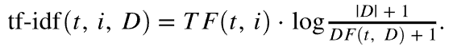

# Forskningen bakom Target:s rekommendationsalgoritmer

En ingående beskrivning av algoritmerna som används i [!DNL Adobe Target Recommendations], inklusive logik och matematiska detaljer för modellutbildning och modellserveringsprocessen.

Modellutbildning är processen för hur rekommendationer genereras av [!DNL Adobe Target]-inlärningsalgoritmerna. Modelltjänsten är hur [!DNL Target] levererar rekommendationer till webbplatsens besökare (kallas även innehållsleverans).

[!DNL Target] innehåller följande breda typer av algoritmer i [!DNL Recommendations]:

* **Objektbaserade algoritmer**: Inkludera algoritmer som följer logiken&quot;Personer som visade/köpte det här objektet visade/köpte även dessa objekt.&quot; Dessa algoritmer grupperas under paraplytermen objektbaserad samarbetsfiltrering samt [!UICONTROL Items with Similar Attributes] algoritmer.

* **Användarbaserade algoritmer**: Inkludera algoritmerna [!UICONTROL Recently Viewed] och [!UICONTROL Recommended for You].

* **Popularitetsbaserade algoritmer**: Inkludera algoritmer som returnerar de mest visade eller mest köpta objekten på webbplatsen, eller toppvisade eller toppköpta efter kategori eller objektattribut.

* **Konstnärsbaserade algoritmer**: Inkludera flerobjektsbaserade rekommendationer med logiken&quot;personer som visade/köpte dessa objekt, även visade/köpte dem.&quot;

* **Anpassade villkor**: Inkludera rekommendationer baserade på anpassade filer som överförts till [!DNL Target].

>[!NOTE]
>
>Mer allmän information om varje algoritmtyp och de enskilda algoritmerna finns i [Basera rekommendationen på en rekommendationsnyckel](/help/main/c-recommendations/c-algorithms/base-the-recommendation-on-a-recommendation-key.md).

Många av de algoritmer som anges ovan beror på om det finns en eller flera nycklar. Dessa nycklar används för att hämta liknande objekt vid innehållsleverans (när rekommendationer görs). Kundspecificerade nycklar kan inkludera det objekt som någon visar, det senast visade eller köpta objektet, det översta objektet, den aktuella kategorin eller favoritkategorin för den besökaren. Andra algoritmer, t.ex. kundvagnsbaserade eller användarbaserade rekommendationer, använder implicita nycklar (som inte kan konfigureras av kunden). Mer information finns i *Rekommendationsnycklar* i [Basera rekommendationen på en rekommendationsnyckel](/help/main/c-recommendations/c-algorithms/base-the-recommendation-on-a-recommendation-key.md#keys). Observera dock att dessa nycklar endast är relevanta vid modellanvändning (innehållsleverans). Dessa knappar påverkar inte tidslogiken för&quot;offline&quot; eller modellutbildning.

I följande avsnitt grupperas algoritmer på ett något annorlunda sätt än de algoritmtyper som beskrivs ovan. Följande gruppering baseras på likheterna i modellens utbildningslogik.

## Samarbetsfiltrering av objekt

Algoritmer är:

* [!UICONTROL People Who Viewed This, Viewed That]
* [!UICONTROL People Who Viewed This, Bought That]
* [!UICONTROL People Who Bought This, Bought That]

Rekommendationsalgoritmer för filtrering av objekt-objekt baseras på tanken att du bör använda beteendemönstren för många användare (och därigenom samarbeta) för att ge användbara rekommendationer för ett visst objekt (t.ex. filtrera katalogen med möjliga objekt att rekommendera). Även om det finns många olika algoritmer som faller under det allmänna paraplyet för [samarbetsfiltrering](https://en.wikipedia.org/wiki/Collaborative_filtering) använder dessa algoritmer beteendedatakällor som indata. I [!DNL Target Recommendations] är dessa indata unika vyer och köp av objekt av användare.

För algoritmen&quot;personer som visade/köpte det här objektet även visade/köpte dessa objekt&quot; är målet att beräkna en likhet som (A,B) mellan alla par av objekt. För en given post A ordnas de översta rekommendationerna sedan efter deras likhet som (A,B).

Ett exempel på en sådan likhet är att det finns flera objekt samtidigt: ett enkelt antal användare som har köpt båda objekten. Även om det är intuitivt är en sådan mätmetod naiv eftersom den är partisk med att rekommendera populära objekt. Om till exempel de flesta i en livsmedelsbutik köper bröd, kommer brödet att vara mycket vanligt tillsammans med alla artiklar, men det behöver inte vara en bra rekommendation. I [!DNL Target] används i stället ett mer avancerat likhetsmått som kallas för Loggsannolikhet (LLR). Den här kvantiteten är stor när sannolikheten för att två artiklar, A och B, inträffar samtidigt skiljer sig mycket från sannolikheten för att de inte inträffar samtidigt. Om du är osäker bör du överväga ett fall med algoritmen [!UICONTROL People Who Viewed This, Bought That]. LLR-likheterna är stora när sannolikheten att B köptes är *inte* oberoende av om någon visar A.

Om

ska inte objekt B rekommenderas med objekt A. Fullständig information om den här likhetsberäkningen för loggsannolikhetsgrad finns [i denna PDF](/help/main/c-recommendations/c-algorithms/assets/log-likelihood-ratios-recommendation-algorithms.pdf).

Det logiska flödet för den faktiska algoritmimplementeringen visas i följande schematiska diagram:

Här följer information om de här stegen:

* **Indata**: Beteendedata, i form av visningar och köp av besökare som samlats in när du [implementerar Target](https://experienceleague.adobe.com/docs/target-dev/developer/recommendations.html?lang=sv-SE){target=_blank} eller från [Adobe Analytics](/help/main/c-recommendations/c-algorithms/use-adobe-analytics-with-recommendations.md){target=_blank}.

* **Modellutbildning**:

   * **Datarensning och -sampling**: För algoritmer med N-dagars uppslag filtreras beteendedata först så att de endast innehåller N-dagars data. Samlingsregler och globala undantag tillämpas sedan för att ta bort objekt som inte bör rekommenderas. Alla besökare som interagerade med mer än 1 000 artiklar får dessutom endast 1 000 uppgifter.
   * **Beräkning av likhet för objekt**: Detta är det grundläggande beräkningssteget: beräkning av likhet för sannolikhetsgrad för logg mellan alla förslagsobjektpar och rangordning av objekt med detta likhetsresultat.
   * **Offlinefiltrering**: Slutligen tillämpas alla andra tillämpliga dynamiska filter (till exempel dynamiska kategoriundantag). Efter det här steget cachelagras förberäknade rekommendationer globalt så att de kan användas.

* **Modellhantering**: Rekommendationsinnehåll levereras från [!DNL Target]s [globala Edge-nätverk](/help/main/c-intro/how-target-works.md#concept_0AE2ED8E9DE64288A8B30FCBF1040934). När mbox-begäranden görs till [!DNL Target] och det fastställs att rekommendationsinnehåll ska levereras till sidan, tolkas begäran om lämplig [objektnyckel](/help/main/c-recommendations/c-algorithms/base-the-recommendation-on-a-recommendation-key.md#keys) för rekommendationsalgoritmen antingen från begäran eller slås upp från användarprofilen, och används sedan för att hämta de rekommendationer som beräknats i föregående steg. Ytterligare dynamiska filter tillämpas nu, innan rätt [design](/help/main/c-recommendations/c-design-overview/create-design.md) återges.

## Likhet i innehåll

Algoritmen ingår:

* [!UICONTROL Items with Similar Attributes]

I den här typen av algoritm anses två objekt vara relaterade om deras namn och textbeskrivningar är semantiskt lika. Till skillnad från de flesta rekommendationsalgoritmer där beteendedatakällor måste användas, använder algoritmer för innehållets likhet metadata från produktkataloger för att härleda likheterna mellan objekt. [!DNL Target] kan därför köra rekommendationer i så kallade kallstartsscenarier, där inga beteendedata har samlats in (till exempel i början av en [!DNL Target] -aktivitet).

Även om modellinlärnings- och innehållsleveransaspekterna för [!DNL Target]s likhetsalgoritmer är identiska med andra objektbaserade algoritmer, skiljer sig modellutbildningsstegen drastiskt och omfattar en serie naturliga språkbehandlingssteg och förbearbetningssteg enligt bilden nedan. Kärnan i likhetsberäkningen är användningen av den koniska likheten hos modifierade tf-idf-vektorer som representerar varje objekt i katalogen.

Här följer information om de här stegen:

* **Indatadata**: Enligt beskrivningen ovan baseras den här algoritmen enbart på katalogdata (som har importerats till [!DNL Target] via en [katalogfeed, entitets-API:t eller från siduppdateringar](https://experienceleague.adobe.com/docs/target-dev/developer/recommendations.html?lang=sv-SE){target=_blank}.

* **Modellutbildning**:

   * **Attributextrahering**: Efter tillämpning av vanliga statiska filter, katalogregler och globala undantag extraherar den här algoritmen relevanta textfält från entitetsschemat. [!DNL Target] använder automatiskt namn-, meddelande- och kategorifälten från entitetsattributen och försöker extrahera alla strängfält från anpassade [entitetsattribut](/help/main/c-recommendations/c-products/entity-attributes.md). Detta görs genom att se till att merparten av värdena för det fältet inte kan tolkas som ett tal, datum eller booleskt värde.
   * **Ordstam- och stoppordsborttagning**: För exaktare matchning av textlikhet är det klokt att ta bort mycket vanliga stoppord som inte ändrar innebörden av ett objekt (t.ex. &quot;var&quot;, &quot;is&quot;, &quot;och&quot; o.s.v.). På samma sätt hänvisar ordstammen till processen att minska ord med olika suffix till deras rotord, som har en identisk betydelse (till exempel &quot;connect&quot;, &quot;connecting&quot; och &quot;connection&quot; har alla samma rotord: &quot;connect&quot;). [!DNL Target] använder Snowball-stammen. [!DNL Target] utför automatisk språkidentifiering först, och kan stoppa ordborttagning på upp till 50 språk och härleda för 18 språk.
   * **Skapa n-gram**: Efter föregående steg behandlas varje ord som en token. Att kombinera sekvenser av variabler i en enda token kallas för att skapa n-gram. Algoritmerna för [!DNL Target] tar upp till 2 gram i anspråk.
   * **tf-idf-beräkning**: I nästa steg skapas tf-idf-vektorer som återspeglar tokens relativa betydelse i objektbeskrivningen. För varje token/term t i ett objekt i, i en katalog D med |D| poster beräknas termen frekvens TF(t, i) först (antalet gånger termen visas i posten i) samt dokumentfrekvensen DF(t, D). Det vill säga antalet objekt där token finns. Tf-idf-måttet är sedan

     

     [!DNL Target] använder Apache Sparks *tf-idf*-funktionsimplementering, som under huven binder varje token till ett utrymme på 218 token. I det här steget tillämpas också boostring och kopiering av kundspecificerade attribut genom att termfrekvenserna i varje vektor justeras baserat på inställningarna som anges i [villkoret](/help/main/c-recommendations/c-algorithms/create-new-algorithm.md#similarity).

   * **Beräkning av objektlikhet**: Den sista objektlikhetsberäkningen görs med en ungefärlig cosinus-likhet. För två objekt, *A* och *B*, med vektorerna tA och tB, definieras cosinus-likhet som:

     

     För att undvika en större komplexitet när det gäller att beräkna likheter mellan alla N x N-objekt, trunkeras *tf-idf*-vektorn så att den bara innehåller de största 500 posterna. Sedan beräknas cosinus-likheterna mellan objekten med den här trunkerade vektorrepresentationen. Detta tillvägagångssätt visar sig vara mer robust för likhetsberäkningar för gles vektor, jämfört med andra approximativa närliggande (ANN) tekniker, t.ex. lokaliseringskänslig hash.

   * **Modellbetjäning**: Den här processen är identisk med samarbetsfiltreringstekniker för objektobjekt som beskrivs i föregående avsnitt.

## Rekommendationer med flera tangenter

Algoritmer är:

* Cart-baserade rekommendationer
* [!UICONTROL Recommended For You]

De senaste tilläggen till gruppen [!DNL Target] med rekommendationsalgoritmer är [!UICONTROL Recommended For You] och en serie Cart-baserade rekommendationer-algoritmer. Båda typerna av algoritmer använder tekniker för samarbete vid filtrering för att skapa individuella objektbaserade rekommendationer. Sedan används flera objekt i användarens webbläsarhistorik (för [!UICONTROL Recommended For You]), eller användarens aktuella kundvagn (för kundvagnsrekommendationer) för att hämta de här objektbaserade rekommendationerna, som sedan sammanfogas för att utgöra den slutliga listan med rekommendationer. Observera att det finns många varianter av personaliserade rekommendationsalgoritmer. Valet av en flernyckelalgoritm innebär att rekommendationer är omedelbart tillgängliga efter det att en besökare har en webbläsarhistorik och rekommendationer kan uppdateras för att svara på den senaste besökarfunktionen.

Dessa algoritmer bygger på de grundläggande filtertekniker för samarbete som beskrivs i det objektbaserade rekommendationsavsnittet, men innehåller även hyperparameterjustering för att fastställa optimal likhet mellan objekten. Algoritmen utför en kronologisk delning av beteendedata för varje användare, och utbildar rekommendationsmodeller på tidigare data samtidigt som man försöker förutsäga objekt som en användare tittar på eller köper senare. Likhetsmåttet som ger den optimala [medelprecisionen]&#x200B;(https://en.wikipedia.org/wiki/Evaluation_measures_(information_retrieval)) väljs sedan.

Logiken i modellutbildning och poängsättning visas i följande diagram:

Här följer information om de här stegen:

* **Indata**: Detta är identiskt med CF-metoder (object-item collaborative filtering). [!UICONTROL Both Recommended For You] och Cart-baserade algoritmer använder beteendedata, i form av visningar och köp av användare som samlats in när du [implementerar Target](https://experienceleague.adobe.com/docs/target-dev/developer/recommendations.html?lang=sv-SE){target=_blank} eller från [Adobe Analytics](/help/main/c-recommendations/c-algorithms/use-adobe-analytics-with-recommendations.md){target=_blank}.

* **Modellutbildning**:

   * **Datarensning och sampling**: Detta är återigen detsamma som för samarbetsfiltreringsmetoder, där uppslagsfönstret används för att filtrera beteendedata till ett lämpligt datumintervall, följt av katalogregler och globala undantag. Besökare som har interagerat med mer än 1 000 objekt har bara de senaste 1 000 användningarna.
   * **Tågtestsdelning**: Utför en kronologisk delning av användningsområdena för varje användare och allokera de första 80 % av användarens användning till utbildningsdata, medan de återstående 20 % tilldelas till testdata.
   * **Modellutbildning för objektlikhet**: Beräkningen av likhet för huvudobjekt skiljer sig åt för [!UICONTROL Recommended For You] - och Cart-baserade algoritmer på det sätt som vektorer för kandidatobjekt skapas. För [!UICONTROL Recommended For You] har objektvektorerna dimensionerna NUsers, där varje post representerar summan av implicita klassificeringar för den användaren av objektet. Inköp av ett objekt får en vikt på 2x den för objektets vyer. För kundvagnsbaserade rekommendationer har objektvektorerna binära poster. Om endast sessionsbeteendet ska beaktas finns det en ny post för varje session. Annars finns det en post i den här objektvektorn för varje besökare.

  Utbildningssteget beräknar flera typer av vektorlikheter: LLR-likheter ([beskrivs här](/help/main/c-recommendations/c-algorithms/assets/log-likelihood-ratios-recommendation-algorithms.pdf)), cosinus-likhet (definieras tidigare) och en normaliserad L2-likhet, definierad som:

  

   * **Utvärdering av objektlikhetsmodell**: Modellutvärderingen görs genom att rekommendationerna som genererades i föregående steg utförs och prognoser görs på testdatauppsättningen. Onlinebedömningsfasen härleds genom att varje användares objektanvändning i testdatauppsättningen ordnas kronologiskt och sedan görs 100 rekommendationer för ordnade deluppsättningar av objekt i ett försök att förutse efterföljande vyer och inköp. Ett mått för informationshämtning, [Medelhög precision]&#x200B;(https://en.wikipedia.org/wiki/Evaluation_measures_(information_retrieval)), används för att utvärdera kvaliteten hos dessa rekommendationer. Detta mätresultat tar hänsyn till rekommendationsordningen och prioriterar relevanta poster högre upp i listan över rekommendationer, som är en viktig egenskap för rangordningssystem.
   * **Modellval**: Efter offlineutvärdering markeras modellen som har den högsta genomsnittliga precisionen och alla rekommendationer för enskilda objekt beräknas för den.
   * **Offlinefiltrering**: Det sista steget i modellträningen är att tillämpa tillämpliga dynamiska filter. Efter det här steget cachelagras förberäknade rekommendationer globalt så att de kan användas.

* **Modellhantering**: Till skillnad från tidigare algoritmer där rekommendationer ska hanteras måste en enda nyckel för hämtning anges, följt av tillämpning av affärsregler, använder algoritmerna [!UICONTROL Recommended for You] och Cart-baserad en mer komplex körningsprocess.

   * **Hämtning och sammanslagning av flera nycklar**: För kundvagnsbaserade rekommendationer räknas upp till tio objekt som skickas i vagnen som nycklar för hämtning och rekommendationer från var och en av dem viktas lika. För [!UICONTROL Recommended for You] betraktas upp till de senaste fem unika visade objekten och de senaste fem unika inköpta objekten som nycklar för hämtning, där rekommendationer från inköpta artiklar viktas dubbelt så mycket som rekommendationer från visade objekt. När du sammanfogar rekommendationer, om ett objekt visas i flera individuella listor med rekommendationer, läggs dess viktade likhetspoäng till. Den sista listan med rekommendationer från det här steget är sedan den sammanfogade listan med omviktade rekommendationer, rankade i fallande ordning.
   * **Filtrering**: Därefter tillämpas filtreringsregler, som borttagning av tidigare visade och/eller köpta objekt, samt andra dynamiska affärsregler.

De här processerna illustreras i följande bild, där en besökare har visat objekt A och köpt objekt B. Enskilda rekommendationer hämtas med de offline-likhetsresultat som visas under varje objektetikett. Efter hämtning sammanfogas rekommendationerna med viktade likhetsresultat. I ett scenario där kunden har angett att tidigare visade och köpta artiklar måste filtreras bort, tar filtreringssteget bort A och B från listan med rekommendationer.

## Popularitetsbaserad

Algoritmer är:

* [!UICONTROL Most Viewed Across the Site]
* [!UICONTROL Most Viewed by Category]
* [!UICONTROL Most Viewed by Item Attribute]
* [!UICONTROL Top Sellers Across the Site]
* [!UICONTROL Top Sellers by Category]
* [!UICONTROL Top Sellers by Item Attribute]

[!DNL Target] innehåller popularitetsbaserade algoritmer för både de mest visade objekten och de främsta säljartiklarna på en webbplats eller uppdelade efter ett objektattribut eller en kategori. Popularitetsbaserade algoritmer rangordnar objekt baserat på det antal sessioner i vilka det objektet visades eller köptes under en given tidsram.

Alla dessa algoritmer kombinerar aggregerade beteendedata där det totala antalet sessioner där objekt visades och köptes registreras med upplösningar både varje timme och varje dag. Enskilda algoritmer hittar sedan de mest visade eller köpta objekten för kundens konfigurerade fönster för sökning.

Enskilda algoritmenheter är följande:

* [!UICONTROL Most Viewed Across the Site] och [!UICONTROL Top Sellers Across the Site] rangordnar objekt efter det sammanlagda antalet sessioner där dessa objekt visades respektive köptes. Utdata är en enda (nyckellös) lista med rekommenderade objekt.
* De flesta visade/populära säljarna efter kategori/artikelattribut är rekommendationer där artiklar sorteras efter det sammanlagda antalet sessioner där dessa artiklar visades eller köptes, men grupperas efter artikelkategori eller specifikt artikelattribut. Utdata är listor med rekommenderade objekt, ordnade efter kategorivärden eller värden för objektattribut.

## Nyligen visade

Algoritmen&quot;nyligen visade&quot; rekommendationer möjliggör anpassning av rekommendationer under sessioner. Den här algoritmen kräver ingen &quot;modellutbildning offline&quot;. I stället använder [!DNL Target] den unika [besökarprofilen](/help/main/c-target/c-visitor-profile/visitor-profile.md) för att upprätthålla en löpande lista över objekt som har visats i en given session och kan visa objekten i rekommendationer. På så sätt kan du uppdatera rekommendationer i realtid och personalisera nästa sida.

## Egna villkor

Med anpassade kriterier kan kunderna [överföra sina egna rekommendationer till  [!DNL Target]](/help/main/c-recommendations/c-algorithms/recommendations-csv.md), vilket ger stor flexibilitet och tillåter&quot;ta med din egen modell&quot;-funktioner. Anpassade villkor ersätter delen&quot;offline-utbildning&quot; i [!UICONTROL Item-Based] rekommendationer, men fungerar på samma sätt som artikelbaserade rekommendationsalgoritmer under innehållsleveransfasen online, eftersom en enskild nyckel används för att hämta rekommendationer och affärsregler/filter sedan tillämpas.
