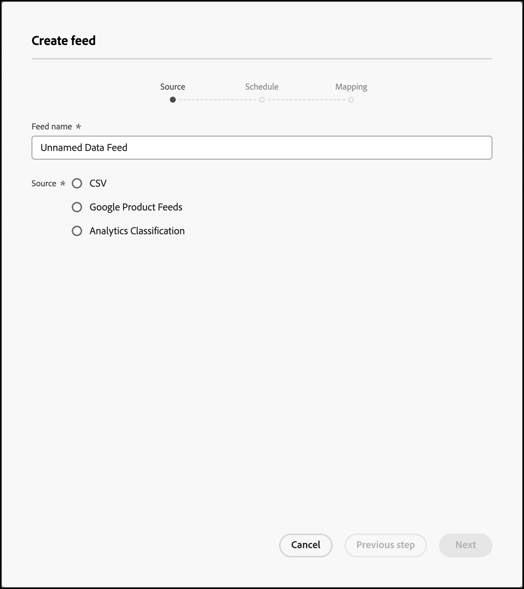

#  Feeds

Använd feeds för att importera enheter till [!DNL Adobe Target Recommendations]. Enheter kan skickas med CSV-filer, Google produktsökningsformat och Adobe Analytics produktklassificeringar.

## Feeds - översikt {#concept_D1E9C7347C5D4583AA69B02E79607890}

Med hjälp av feeds kan du skicka [Enheter](/help/main/c-recommendations/c-products/products.md) eller utöka dina mbox-data med information som antingen inte är tillgänglig på sidan eller som inte kan skickas direkt från sidan, t.ex. marginal, COGS osv.

Med hjälp av flöden kan du skicka detaljerad objektinformation till [!DNL Recommendations], till exempel produkt-ID, kategori, namn, meddelande och andra attribut.

Du kan välja vilka kolumner i [!DNL Target] produktklassificeringsfil eller Google produktsökningsfil som du vill skicka till [!DNL Recommendations] server.

Dessa datadelar för varje objekt kan sedan användas för att:

* Visa värden i design
* Definiera villkor för inkludering
* Sortera objekt i olika samlingar
* Tillämpa undantag för rekommendationer

Artikelbeskrivningar kan skickas till [!DNL Target] med feeds eller mbox. Om data samlas in både av en entitetsfeed och en mbox, vinner den senaste informationen. Vanligtvis kommer de senaste data från en mbox, eftersom de visas oftare. I den sällsynta händelse att enhetsmatningsdata och mbox-data träffar samtidigt, används mbox-data.

The [!UICONTROL Feeds] lista ( **[!UICONTROL Recommendations]** > **[!UICONTROL Feeds]**) innehåller information om alla feeds du har skapat.


Sidan Feeds innehåller följande kolumner:

* **Namn**: Namnet på den feed som angavs när den skapades. Om du vill redigera namnet på en feed måste du redigera själva feeden. När du sparar med det nya namnet uppdateras feeden.
* **Typ**: Typer kan vara [CSV](/help/main/c-recommendations/c-products/feeds.md#section_65CC1148C7DD448FB213FDF499D35FCA), [Google produktfeed](/help/main/c-recommendations/c-products/feeds.md#section_8EFA98B5BC064140B3F74534AA93AFFF)och [Analysklassificeringar](/help/main/c-recommendations/c-products/feeds.md#section_79E430D2C75443BEBC9AA0916A337E0A).
* **Status**: Aktuell feed [status](/help/main/c-recommendations/c-products/feeds.md#concept_E475986720D1400999868B3DFD14A7A0).
* **Schema**: Visar uppdateringsschemat för feeden: Varje dag, Varje vecka, Varannan vecka eller Aldrig.
* **Objekt**: Visar antalet objekt i feeden.
* **Senast uppdaterad**: Visar datum och tid då feeden senast uppdaterades och namnet på den person som uppdaterade feeden. Om [!UICONTROL Last Updated] matningen säger&quot;undefined&quot;, matningen kommer från [!DNL Recommendations Classic] och kan inte ändras inifrån [!DNL Target Premium Recommendations].

>[!IMPORTANT]
>
>Överförda entiteter och entitetsattribut upphör att gälla efter 61 dagar. Detta innebär:
>
>* Din feed bör köras minst en gång i månaden för att kataloginnehållet inte ska gå ut.
>* När du tar bort ett objekt från din feed-fil tas det inte bort från katalogen. Om du vill ta bort objektet från katalogen tar du bort det manuellt via målgränssnittet eller API:t. Eller ändra artikelattributen (t.ex. lager) för att säkerställa att artikeln utesluts från övervägande.


## Källtyper

Enheter kan skickas med CSV-filer, Google produktsökningsformat och Adobe Analytics produktklassificeringar.

### CSV {#section_65CC1148C7DD448FB213FDF499D35FCA}

Du kan skapa en .csv-fil med det CSV-överföringsformat som finns i Adobe. Filen innehåller visningsinformation om de reserverade och anpassade attributen för dina produkter. Ersätt om du vill överföra attribut som är specifika för implementeringen `CustomN` i rubrikraden med namnet på det attribut som du vill använda. I exemplet nedan `entity.Custom1` har ersatts med: `entity.availability`. Du kan sedan överföra filen till [!DNL Recommendations] server.

Att använda CSV-formatet har följande fördelar jämfört med Google Feed-formatet:

* Fältkopplingar krävs inte.
* Det har stöd för attribut med flera värden (se exemplet nedan).
* Den har stöd för upp till 100 anpassade attribut. Om du behöver fler än 100 anpassade attribut kan du skapa en andra feed-fil med en annan uppsättning anpassade attribut angivna.

Använd metoden för massöverföring för att skicka visningsinformation om du inte har några kryssrutor på sidan, eller om du vill komplettera visningsinformationen med objekt som inte är tillgängliga på webbplatsen. Du kan till exempel skicka lagerinformation som inte är publicerad på din plats.

Alla data som överförs med CSV-filen, Google produktfeed eller Analytics Product Classification feed skriver över det befintliga entitetsattributvärdet i vår databas. Om du skickar prisinformation via mbox-begäranden och sedan skickar olika prisvärden i filen, skriver värdena i filen över de värden som angetts med mbox-begäran. Undantaget är `categoryId` entitetsattribut där kategorivärdena läggs till i stället för att skrivas över upp till gränsen på 250 tecken.

>[!IMPORTANT]
>
>Omge inte värden med citattecken ( &quot; ) i CSV-filen om de inte är avsiktliga. Om du omsluter värden med dubbla citattecken måste du undvika dem genom att omsluta dem med en annan uppsättning dubbla citattecken. Dubbla citattecken som inte escape-konverteras förhindrar att rekommendationsfeeden läses in korrekt.

Följande syntax är till exempel felaktig:

```
"Apples "Bananas" Grapes"",
```

Följande syntax är korrekt:

```
"Apples ""Bananas"" Grapes""",
```

>[!NOTE]
>
>Du kan inte skriva över ett befintligt värde med ett tomt värde. Du måste skicka ett annat värde i stället för att skriva över det. När det gäller försäljningspriset är en gemensam lösning att antingen skicka in ett faktiskt&quot;NULL&quot; eller något annat meddelande. Du kan sedan skriva en mallregel för att exkludera objekt med det värdet.

Produkten är tillgänglig i administratörsgränssnittet cirka två timmar efter att enheten har överförts.

Följande är exempelkod för en CSV-fil:

```
## RECSRecommendations Upload File 
## RECS''## RECS'' indicates a Recommendations pre-process header. Please do not remove these lines. 
## RECS 
## RECSUse this file to upload product display information to Recommendations. Each product has its own row. Each line must contain 19 values and if not all are filled a space should be left. 
## RECSThe last 100 columns (entity.custom1 - entity.custom100) are custom. The name 'customN' can be replaced with a custom name such as 'onSale' or 'brand'. 
## RECSIf the products already exist in Recommendations then changes uploaded here will override the data in Recommendations. Any new attributes entered here will be added to the product''s entry in Recommendations. 
## RECSentity.id,entity.name,entity.categoryId,entity.message,entity.thumbnailUrl,entity.value,entity.pageUrl,entity.inventory,entity.margin,entity.last_updated_by,entity.multi_english,entity.availability,entity.tax_country,entity.tax_region,entity.tax_rate,entity.product_type,entity.item_group_id,entity.color,entity.size,entity.brand,entity.gtin 
na3456,RipCurl Watch with Titanium Dial,Watches & Sport,Cutting edge titanium with round case,https://example.com/s7/na3456_Viewer,425,https://example.com/shop/en-us/na3456_RipCurl,24,0.25,csv,"[""New"",""Web"",""Sales"",""[1,2,34,5]""]",in stock,US,CA,9.25,Shop by Category > Watches,dz1,Titanium,44mm,RipCurl,"075380 01050 5" 
na3457,RipCurl Watch with Black Dial,Watches & Sport,Cutting edge matte black with round case,https://example.com/s7/na3457_Viewer,275,https://example.com/shop/en-us/na3457_RipCurl,24,0.27,csv,"[""New"",""Web"",""Sales"",""[1,2,34,5]""]",in stock,US,CA,9.25,Shop by Category > Watches,dz1,Black,44mm,RipCurl,"075340 01060 7"
```

### Google {#section_8EFA98B5BC064140B3F74534AA93AFFF}

Google produktsökningstyp använder Google-formatet. Detta skiljer sig från CSV-överföringsformatet för Adobe.

Om du har en Google-produktfeed kan du använda den som importfil.

>[!NOTE]
>
>Du behöver inte använda Google-data. [!DNL Recommendations] använder bara samma format som Google. Du kan använda den här metoden för att överföra data som du har och använda de tillgängliga schemafunktionerna. Du måste dock behålla Google fördefinierade attributnamn när du konfigurerar filen.

De flesta återförsäljare överför produkter till Google, så när en besökare använder Google produktsökning visas deras produkter. [!DNL Recommendations] följer Google-specifikationen exakt för entitetsflöden. Enhetsfeeds kan skickas till [!DNL Recommendations] via .xml, .txt eller .tsv, och kan använda [attribut som definieras av Google](https://support.google.com/merchants/answer/188494?hl=en&amp;topic=2473824&amp;ctx=topic#US). Resultaten är sökbara på [Google shoppingsidor](https://www.google.com/prdhp).

>[!NOTE]
>
>Metoden POST måste vara tillåten på den server som är värd för Google feed-innehåll.

För [!DNL Recommendations] -användare redan har konfigurerat .xml- eller .txt-feeds för att skicka till Google via URL eller FTP, godkänner entitetsfeeds produktdata och använder dem för att skapa rekommendationskatalogen. Ange var denna feed finns och rekommendationsservern hämtar data.

Om du använder Google produktsökning för överföring av enhetsfeed måste du ändå ha en produktsidesruta på sidan om du vill visa rekommendationer där eller spåra produktvyer för algoritmleverans baserat på vyer.

Google-feeds stöder inte flera värden för ett anpassat attribut.

Flödet körs när du sparar och aktiverar det. Den körs när du sparar flödet och därefter en gång i timmen.

Följande är exempelkod för en XML-fil i Google Product Search feed:

```
<?xml version="1.0" encoding="UTF-8" standalone="yes"?> 
<feed xmlns="https://www.w3.org/2005/Atom" xmlns:ns2="https://base.google.com/ns/1.0" xmlns:ns3="https://base.google.com/cns/1.0"> 
    <title>Product Feed</title> 
    <link href="https://example.com"/> 
    <updated>2017-12-13T08:45:04.918-08:00</updated> 
    <author> 
        <name>Product Feed Author</name> 
    </author> 
    <id>https://example.com</id> 
    <entry> 
        <title>RipCurl Watch with Titanium Dial</title> 
        <description>Cutting edge Titanium with Round case</description> 
        <ns2:id>na3452</ns2:id> 
        <ns2:link>https://example.com/shop/en-us/na3452_RipCurl</ns2:link> 
        <ns2:availability>in stock</ns2:availability> 
        <ns2:condition>NEW</ns2:condition> 
        <ns2:google_product_category>Watches &amp; Sport</ns2:google_product_category> 
        <ns2:gtin>075380 01050 5</ns2:gtin> 
        <ns2:image_link>https://example.com/s7/na3452_Viewer</ns2:image_link> 
        <ns2:mobile_link>https://m.example.com/s7/na3452_Viewer</ns2:mobile_link> 
        <ns2:mpn>71050</ns2:mpn> 
        <ns2:price>425</ns2:price> 
        <ns2:product_review_average>5.0</ns2:product_review_average> 
        <ns2:product_review_count>30</ns2:product_review_count> 
        <ns2:product_type>Shop by Category > Watches </ns2:product_type> 
        <ns2:brand>RipCurl</ns2:brand> 
        <ns2:sale_price>375</ns2:sale_price> 
        <ns2:tax> 
          <ns2:country>US</ns2:country> 
          <ns2:region>CA</ns2:region> 
          <ns2:rate>9.25</ns2:rate> 
          <ns2:tax_ship>y</ns2:tax_ship> 
        </ns2:tax> 
        <ns2:is_bundle>N</ns2:is_bundle> 
    </entry> 
    <entry> 
        <title>RipCurl Watch with Black Dial</title> 
        <description>Cutting edge matte black with Round case</description> 
        <ns2:id>na3453</ns2:id> 
        <ns2:link>https://example.com/shop/en-us/na3453_RipCurl</ns2:link> 
        <ns2:availability>in stock</ns2:availability> 
        <ns2:condition>NEW</ns2:condition> 
        <ns2:google_product_category>Watches &amp; Sport</ns2:google_product_category> 
        <ns2:gtin>075380 013450 5</ns2:gtin> 
        <ns2:image_link>https://example.com/s7/na3453_Viewer</ns2:image_link> 
        <ns2:mobile_link>https://m.example.com/s7/na3453_Viewer</ns2:mobile_link> 
        <ns2:mpn>71050</ns2:mpn> 
        <ns2:price>275</ns2:price> 
        <ns2:product_review_average>4.8</ns2:product_review_average> 
        <ns2:product_review_count>23</ns2:product_review_count> 
        <ns2:product_type>Shop by Category > Watches </ns2:product_type> 
        <ns2:brand>RipCurl</ns2:brand> 
        <ns2:sale_price>249</ns2:sale_price> 
        <ns2:tax> 
          <ns2:country>US</ns2:country> 
          <ns2:region>CA</ns2:region> 
          <ns2:rate>9.25</ns2:rate> 
          <ns2:tax_ship>y</ns2:tax_ship> 
        </ns2:tax> 
        <ns2:is_bundle>N</ns2:is_bundle> 
    </entry> 
</feed> 
```

Följande är exempelkod för en Google Product Search feed .tsv-fil:

```
id    title    description    link    price    condition    availability    image_link    tax    shipping_weight    shipping    google_product_category    product_type    item_group_id    color    size    gender    age_group    pattern    brand    gtin    mpn 
na3454    RipCurl Watch with Titanium Dial    Cutting edge titanium with round case    https://example.com/shop/en-us/na3454_RipCurl    425    new    in stock    https://example.com/s7/na3452_Viewer    US:CA:9.25:y    1.5 oz    US:::0.00 USD    Watches & Sport    Shop by Category > Watches    dz1    Black    44mm    male    adult    Solid    RipCurl    075380 01050 5    DZ1437 
na3455    RipCurl Watch with Black Dial    Cutting edge matte black with round case    https://example.com/shop/en-us/na3455_RipCurl    275    new    in stock    https://example.com/s7/na3452_Viewer    US:CA:9.25:y    1.5 oz    US:::0.00 USD    Watches & Sport    Shop by Category > Watches    dz1    Black    44mm    male    adult    Solid    RipCurl    075340 01060 7    DZ1446
```

### Produktklassificeringar för analyser {#section_79E430D2C75443BEBC9AA0916A337E0A}

Produktklassificeringen Analytics är den enda klassificeringen som är tillgänglig för rekommendationer. Mer information om klassificeringsfilen finns i [Om klassificeringar](https://experienceleague.adobe.com/docs/analytics/components/classifications/c-classifications.html) i *Analyskomponenter* guide. Det är möjligt att inte all information du behöver för rekommendationer kommer att vara tillgänglig i den aktuella implementeringen, så följ den här användarhandboken om du vill lägga till i klassificeringsfilen.

>[!IMPORTANT]
>
>Innan du importerar enhetsdata till [!DNL Recommendations] vara medveten om att detta inte är den rekommenderade metoden om du använder produktklassificeringar i Analytics.
>
> Var uppmärksam på följande kavattar:
>
>* Uppdateringar av entitetsattribut medför en ytterligare fördröjning på upp till 24 timmar.
>* [!DNL Target] stöder endast produktklassificeringar. Analysproduktens SKU måste mappas till samma nivå som [!DNL Recommendations] `entity.id`. Anpassade analysklassificeringar kan utformas med Adobe konsulttjänster. Kontakta din kontoansvarige med frågor.


## Skapa feed {#steps}

Skapa ett flöde för att infoga information om dina produkter eller tjänster i [!DNL Recommendations].

1. I Target-gränssnittet klickar du på **[!UICONTROL Recommendations]** > **[!UICONTROL Feeds]** > **[!UICONTROL Create Feed]**.

   

1. Ange ett beskrivande namn för feeden.
1. Välj en **[!UICONTROL Source Type]**.

   * CSV
   * Google produktfeed
   * Analysklassificeringar

   Mer information om CSV- och Google produktfeedmatningstyper finns i [Feeds - översikt](/help/main/c-recommendations/c-products/feeds.md#concept_D1E9C7347C5D4583AA69B02E79607890). Du kan också [hämta en CSV-modellguide](/help/main/c-recommendations/c-products/assets/EntityFileUploadTemplate.csv) för att du ska kunna formatera matningen korrekt.

1. (Villkorligt) Om du har valt **[!UICONTROL CSV]** eller **[!UICONTROL Google Product Feed]** anger du platsen där feeden kan användas.

   * **FTP**: Om du har valt FTP anger du FTP-serverinformationen, inloggningsuppgifterna, filnamnet och FTP-katalogen. Du kan använda FTP med SSL (FTPS) för säkrare överföringar.

      FTP-serverinställningar som stöds:

      * FTP och FTPS måste vara inställda på Passiv FTP.
      * För FTPS ska du konfigurera servern så att den accepterar explicita FTPS-anslutningar.
      * SFTP stöds inte.
      * Du kan ange en port som anslutningen ska initieras på manuellt (t.ex. `ftp://ftp.yoursite.com:2121`). Om du inte anger någon port används FTP- eller FTPS-standardporten.
   * **URL**: Om du väljer URL-adress anger du URL-adressen.


1. (Villkorligt) Om du har valt **[!UICONTROL Analytics Classifications]** väljer du rapportsviten i listrutan.

1. Klicka på **[!UICONTROL Next]** pil för att visa [!UICONTROL Schedule] alternativ.

   

1. Välj ett uppdateringsalternativ:

   * Dagligen
   * Vecka
   * Var 2:e vecka
   * Aldrig: Schemalägg ingen uppdatering. Välj det här alternativet om du inte vill att denna feed ska köras.

1. Ange den tid du vill att din feed ska köras.

   Det här alternativet baseras på den tidszon som används i webbläsaren. Om du vill använda en tid i en annan tidszon måste du beräkna den tiden enligt din tidszon.

1. Klicka på **[!UICONTROL Next]** pil för att visa [!UICONTROL Mapping] anger du sedan hur du vill mappa dina data till [!DNL Target] definitioner.

   

1. (Valfritt) Om du vill att flödet ska tillhöra en miljö (värdgrupp) väljer du värdgruppen.

   Som standard tillhör feed alla värdgrupper. Detta garanterar att objekt i denna feed är tillgängliga i alla miljöer. Mer information finns i [Värdar](/help/main/administrating-target/hosts.md#concept_516BB01EBFBD4449AB03940D31AEB66E).

1. Klicka på **[!UICONTROL Save]**.

När du har skapat eller redigerat en feed körs den direkt och uppdateras enligt de parametrar du har angett. Det tar ett tag innan all information är tillgänglig. Först måste feeden synkroniseras, sedan måste den bearbetas och indexeras innan den kan publiceras och göras tillgänglig. Aktuell status visas under [Feed-status](/help/main/c-recommendations/c-products/feeds.md#status) i listan Feeds. Du kan stänga [!DNL Target] innan processen är klar och processen fortsätter.

När indexering pågår visas produkter och flödeshuvuden innan enskilda värden har indexerats. På så sätt kan du söka efter och se produkter så att du kan skapa samlingar, uteslutningar, designer och aktiviteter innan indexeringen är klar.

När det står&quot;Slutfört&quot; i status betyder det att filen hittades och att den tolkades korrekt. Informationen är inte tillgänglig inom [!DNL Recommendations] tills filen har indexerats, vilket kan ta lite tid, beroende på filens storlek. Om processen misslyckas betyder det att filen inte hittades (du t.ex. använde en felaktig URL eller att FTP-informationen var felaktig) eller att det uppstod ett tolkningsfel.

## Feedstatus och indikatorer {#concept_E475986720D1400999868B3DFD14A7A0}

Information om möjliga feedstatusar och deras indikatorer.

### Feed-status {#status}

Följande är möjliga statusvärden för en feed:

| Status | Beskrivning |
|--- |--- |
| Synkroniserar | Feed-inställningsinformation sparas i Target. |
| Synkroniseringen misslyckades | Det gick inte att spara information om matningsinställningar i Target. Försök igen. |
| Ingen feed-körning | Du har skapat en feed men den har inte schemalagts (frekvensen anges till Aldrig). |
| Schemalagd *datum och tid* | Feed har inte körts, men är schemalagd att köras vid angivet datum och angiven tid. |
| Väntar på hämtning | Målet förbereds för hämtning av feed-filen. |
| Hämtar feedfil | Målet hämtar feedfilen. |
| Importerar objekt | Målet importerar objekt från feed-filen. |
| Feed importerades: *tid* | Målet har importerat feed-filen till innehållsleveranssystemet. Ändringar av objektattribut har gjorts i innehållsleveranssystemet och kommer inom kort att återspeglas i levererade rekommendationer. Om du inte ser de förväntade ändringarna försöker du igen inom kort och uppdaterar sidan med rekommendationer.<br>Anteckningar:<ul><li>Om ändringar i ett objekts attribut leder till att ett objekt utesluts från rekommendationerna, återspeglas uteslutningen omedelbart. Om ett objekt läggs till nyligen eller om attributen ändras resulterar det i att ett objekt *inte längre* Undantagna från rekommendationer kommer de inte att återspeglas förrän nästa algoritmuppdatering, som kommer att ske inom 24 timmar.</li><li>När den här statusen visas kanske inte uppdateringarna visas i användargränssnittet för katalogsökning än. En separat status visas i Katalogsökning som anger den senaste gången den sökbara katalogen uppdaterades.</li></ul> |
| Det gick inte att indexera | Indexåtgärden misslyckades. Försök igen. |
| Servern hittades inte | FTP- eller URL-platserna är ogiltiga eller går inte att nå på annat sätt. |

Om du vill uppdatera en feed (till exempel för att ändra din flödeskonfiguration eller feed-fil) öppnar du den, gör önskade ändringar och klickar på **[!UICONTROL Save]**.

>[!IMPORTANT]
>
>Överförda enheter upphör att gälla efter 61 dagar. Det innebär att din feed-fil ska laddas upp minst var 60:e dag för att undvika avbrott i dina rekommendationer. Om ett objekt inte ingår i en feed-fil (eller någon annan metod för enhetsuppdatering) minst en gång var 60:e dag, [!DNL Adobe Target] infogar objektet som inte längre är relevant och tar bort det från katalogen.

### Indikatorer för matningsstatus {#section_3C8A236C5CB84C769A9E9E36B8BFABA4}

Följande statusindikatorer för feed visas i [!UICONTROL Status] kolumn:

| Statusindikator | Beskrivning |
|--- |--- |
| Grön statusindikator | När en feed har indexerats utan fel anger en grön statuspunkt att feeden har slutförts. |
| Gul statusindikator | När ett feed- eller feed-index fördröjs med 25 % av matningsfrekvensen visas en gul statuspunkt. En gul punkt visas till exempel för en feed-uppsättning som körs dagligen om indexet inte har slutförts sex timmar efter den schemalagda tiden.   Obs! När matningsstatusen är Väntar på indexkö är de nya värdena tillgängliga vid leverans och villkorsbearbetning. |
| Vit statusindikator | När en feed inte är schemalagd anger en vit statuspunkt att den inte har körts än. |
| Röd statusindikator | Om flödet inte kan överföra data till servern visas en röd statusindikator. |

Titta på följande exempel:

**Exempel 1:**

* Dag ett: dagliga matningsprocesser kl. 9.00 PST
* Dag två: Klockan är 23.30 och matningen har inte gått sedan i går klockan 9.00.

Statusen bör vara gul eftersom indexet borde ha körts för cirka 6,5 timmar sedan. 6,5 timmar +24 är 127% av matningsfönstret.

**Exempel 2:**

* 1 januari: månatliga matningsprocesser klockan 9.00 PST
* 3 februari: klockan är 10.00 och matningen har inte gått på en månad, en dag och en timme sedan

Statusen ska vara gul eftersom indexet ska ha körts för ungefär en dag och en timme sedan. Även om detta endast är (31+(1/25))/30 = 1,03 % av frekvensinställningen, överskred det maximala antalet endagsfördröjningar.

## Utbildningsvideor

I följande videofilmer finns mer information om de begrepp som beskrivs i den här artikeln.

### Förstå flöden i Recommendations (3:01) 

Den här videon innehåller följande information:

* Förstå syftet med feeds
* Förstå värdet av flöden

>[!VIDEO](https://video.tv.adobe.com/v/27695)

### Skapa en feed (6:44) 

Den här videon innehåller följande information:

* Konfigurera en feed
* Ha koll på vilken typ av feed som ska användas

>[!VIDEO](https://video.tv.adobe.com/v/27696)
