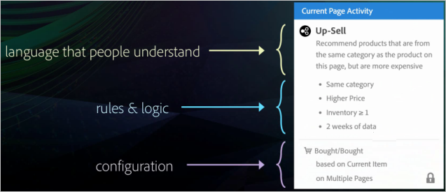

# Recommendations Classic jämfört med Recommendations-aktiviteter i [!DNL Target] Premium

Information som hjälper dig att välja mellan Recommendations Classic- och Recommendations-aktiviteter i Target Premium.

>[!NOTE]
>
>Recommendations-aktiviteter är tillgängliga som en del av lösningen [!DNL Target Premium]. De är inte tillgängliga i [!DNL Target Standard] utan en [!DNL Target Premium]-licens.

I den klassiska [!DNL Recommendations]-produkten visades rekommendationer genom att en mbox för datainsamling skapades på en sida och sedan lades en visningsruta till på en specifik sidplats. Med aktiviteten [!DNL Recommendations] i [!DNL Target Premium] kan du samla in besökarinformation och skapa dina rekommendationer var som helst på sidan utan att du behöver skapa en mbox för varje plats där du vill rekommendera produkter eller innehåll. Med en enkel JavaScript-referens i sidhuvudet kan du göra rekommendationer var som helst på sidan. Använd den här JavaScript-referensen om du vill skicka nycklar till den globala [!DNL Target]-rutan, till exempel `entity.id`- och `entity.categoryId`-nycklarna.

[!DNL Recommendations Classic] visas som ett eget kort i användargränssnittet för [!DNL Experience Cloud]. En [!DNL Recommendations]-aktivitet är tillgänglig från arbetsflödet [!DNL Target Premium].

[!DNL Recommendations Classic] användare kan fortsätta att använda sina [!DNL Recommendations]-rutor i [!DNL Target Recommendations]. De kan också kombinera de klassiska metoderna och [!DNL Target]-metoderna genom att behålla sina kryssrutor och använda JavaScript-koden i sidhuvudet för att aktivera [!DNL Recommendations] -funktionen för de andra elementen på sidan. För att få tillgång till alla funktioner i [!DNL Target] kanske [!DNL Recommendations Classic]-användare föredrar att ta bort sin gamla mbox och förlita sig enbart på [!DNL Target Recommendations].

Aktiviteten [!DNL Recommendations] i [!DNL Target] förbättras med [!DNL Recommendations Classic] i följande huvudområden:

## Recommendations som erbjudande

Du kan inkludera rekommendationer inuti [!UICONTROL A/B Test] (inklusive [!UICONTROL Auto-Allocate] och [!UICONTROL Auto-Target]) och [!UICONTROL Experience Targeting] (XT) aktiviteter.

Den här funktionen öppnar upp helt nya funktioner, som:

* Testa och målinrikta rekommendationer och innehåll som inte är rekommendationer inom samma aktivitet.
* Experimentera enkelt med olika rekommendationer på sidan, t.ex. i vilken ordning olika rekommendationer ska ges.
* Skicka automatiskt trafik till den bästa rekommenderade upplevelsen med [!UICONTROL Auto-Allocate].
* Tilldela besökare dynamiskt anpassade rekommendationer baserat på deras profil med [!UICONTROL Auto-Target].

Om du vill komma igång skapar du en [!UICONTROL A/B Test]- eller [!UICONTROL Experience Targeting]-aktivitet med [!UICONTROL Visual Experience Composer] och använder åtgärden [!UICONTROL Insert Before], [!UICONTROL Insert After] eller [!UICONTROL Replace With] för att lägga till rekommendationer till en upplevelse.

Mer information finns i [Recommendations som erbjudande](/help/main/c-recommendations/recommendations-as-an-offer.md).

## Kriterier {#section_117709846DAA404580EBE879FFCBD9BA}

[!DNL Target Recommendations] innehåller ett kriteriebibliotek som innehåller förpaketerade uppsättningar regler och konfigurationer. I [!DNL Recommendations Classic] skapades varje rekommendation manuellt genom att ett formulär fylldes i och sedan valdes i den stora listan med regler. När du skapar en [!DNL Recommendations]-aktivitet väljer du nu bara en förkonfigurerad villkorsuppsättning. Du kan fortfarande skapa anpassade rekommendationer, men kriteriebiblioteket innehåller många av de vanligaste konfigurationerna, fördefinierade för att förenkla processen och använda språk som folk förstår. Dessa förpaketerade villkor kan användas som de är eller kopieras och redigeras efter dina behov.

Kriterierna är förkonfigurerade och sorterade efter vertikaler, sidtyper och implementering i branschen. Du kan till exempel söka efter de villkor som gäller för vertikal försäljning, för användning på en produktsida, och visa produkter från en viss kategori (som definieras av parametern `entity.categoryID`).

Mer information om hur du använder och skapar villkor finns i [Kriterier](/help/main/c-recommendations/c-algorithms/algorithms.md).

## Arbetsflöde {#section_76B4A26297BF422382DE2C79A2713D3C}

Arbetsflödet för [!DNL Recommendations] har förenklats. Istället för att fylla i komplicerade formulär följer du ett visuellt arbetsflöde för att:

1. Välj villkor.
1. Välj en förkonfigurerad [design](/help/main/c-recommendations/c-design-overview/create-design.md#task_CC5BD28C364742218C1ACAF0D45E0E14).
1. Förhandsgranska de resulterande rekommendationerna.

## Visuell förhandsgranskning {#section_639B9E38C9EC4093BF9023EE0F2A15AC}

Du kan förhandsgranska dina rekommendationer när du har konfigurerat dem och göra nödvändiga ändringar utan att behöva skapa dem på sidan och sedan testa dem. Förhandsgranskningar är tillgängliga inifrån [!DNL Target].

## Målinriktning {#section_93295EA0DBA14210B8518AF4802A459F}

I [!DNL Recommendations Classic] fanns det sex målinriktningsalternativ. Recommendations-aktiviteter utnyttjar Target alla sina målinriktningsalternativ. Definiera en målgrupp med antingen [!DNL Target] eller andra [!DNL Adobe Experience Cloud] målgrupper (till exempel [!DNL Audience Manager] och [!DNL Analytics]), välj sedan procentandelen aktivitetsdeltagare som ser varje design och procentsatserna som ser kontrollen.

## Rapportering {#section_25C2FCCE4BC1488496C517C0470B5CD6}

I [!DNL Target] ger [!DNL Recommendations] förbättrad rapportering som utnyttjar funktionerna i [!DNL Target] och [!DNL Experience Cloud]. I stället för att bara visa lyften från [!DNL Recommendations] jämfört med resultaten utan dem, kan du visa fullständig information om din [!DNL Recommendations]-aktivitet.

