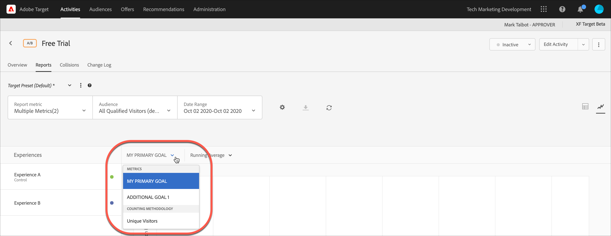

# Visa flera mätvärden i en rapport

Du kan välja flera mätvärden att visa i en [!DNL Adobe Target] rapport.

Tänk på följande när du arbetar med flera mätvärden i rapporter:

* Det finns möjlighet att visa flera mätvärden för [A/B-test](/help/main/c-activities/t-test-ab/test-ab.md), [Automatisk allokering](/help/main/c-activities/automated-traffic-allocation/automated-traffic-allocation.md), [Automatiskt mål](/help/main/c-activities/auto-target/auto-target-to-optimize.md)och [Experience Targeting](/help/main/c-activities/t-experience-target/experience-target.md) (XT) endast aktiviteter.
* Du kan inte lägga till mer än 20 mätvärden i en rapport för en aktivitet som använder [Analyser för Target](/help/main/c-integrating-target-with-mac/a4t/a4t.md) (A4T). Du kan lägga till så många mätvärden som du har i din aktivitet i rapporter för aktiviteter som *not* använd A4T.
* Du kan inte använda [Hämtningsalternativ](/help/main/c-reports/downloading-data-in-csv-file.md) för att hämta rapporter till CSV om du har valt flera mätvärden. Du måste välja ett enda mått för att aktivera [!UICONTROL Download] alternativ.
* Du kan inte visa flera mått för aktiviteter som skapats före juli 2015 [!DNL Target] version (30 juli 2015).

**Så här väljer du flera mätvärden som ska visas i rapporten:**

1. Om du vill visa en rapport klickar du på **[!UICONTROL Activities]** klickar du på önskad aktivitet i listan och sedan på **[!UICONTROL Reports]** -fliken.
1. Klicka på **[!UICONTROL Report Metric]** nedrullningsbar lista som visar [!UICONTROL Shown Metrics] och [!UICONTROL Hidden Metrics] listor.

   

   Du kan använda [!UICONTROL Search] för att snabbt hitta tillgängliga mätvärden att lägga till i [!UICONTROL Shown Metrics] lista.

   Observera att du kan välja flera mätvärden från båda [!UICONTROL Table View] och [!UICONTROL Graph View] rapportens lägen.

1. Håll muspekaren över önskade mätvärden i [!UICONTROL Hidden Metrics] lista och klicka sedan på **[!UICONTROL Select]** för att flytta dem till [!UICONTROL Shown Metrics] lista.

   eller

   Dra och släpp önskade mätvärden från [!UICONTROL Hidden Metrics] till [!UICONTROL Shown Metrics] lista.

   Det måste finnas minst ett mått i [!UICONTROL Shown Metrics] lista.

   Du kan ändra måtten genom att dra och släppa dem i önskad ordning i dialogrutan [!UICONTROL Shown Metrics] lista. Den valda ordningen visas i [!UICONTROL Table View] och [!UICONTROL Graph View]. Ta bort ett mått från [!UICONTROL Shown Metrics] håller muspekaren över måttet och klickar sedan på **X** ikon.

1. Klicka **[!UICONTROL Save]** när du är klar.
1. (Villkorligt) När du visar rapporten i [!UICONTROL Table View]placerar du muspekaren på kolumnrubriken för ett mått så att en blå pil visas. Klicka på pilen för att expandera tabellen så att [!UICONTROL Lift] och [!UICONTROL Confidence] för det måttet.

   

   Du kan bara expandera ett mått/en kolumn i taget. Klicka på pilen igen för att komprimera kolumnerna.

1. (Villkorligt) När du visar rapporten i diagramvyn kan du välja enskilda mått att visa i listrutan:

   
