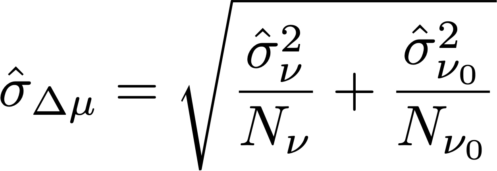

# Statistiska beräkningar i A/Bn-tester

I den här artikeln beskrivs de detaljerade statistiska beräkningar som används i manuella A/Bn-tester i [!DNL Adobe Target]. Definitioner anges för [!UICONTROL Conversion Rate], [!UICONTROL Confidence Interval of Conversion Rate], [!UICONTROL Lift], [!UICONTROL Confidence Interval for Lift] och [!UICONTROL Confidence].

>[!NOTE]
>
>Informationen i den här artikeln ersätter pdf-filen *Adobe Target Calculations for A/B Testing* som tidigare fanns tillgänglig för hämtning på den här webbplatsen.

![Målrapport som visar [!UICONTROL Conversion Rate], [!UICONTROL Average Lift and Confidence Interval] och [!UICONTROL Confidence] för en A/B-testaktivitet.](/help/main/c-reports/statistical-methodology/img/target_report.png)

## Genomsnittlig prestanda

I följande avsnitt förklaras beräkningarna som användes i föregående bild.

### Kampanjer för konverteringsgrad och intäkter per besökare

Följande bild visar [!UICONTROL Conversion Rate], [!UICONTROL Confidence Interval of Conversion Rate] och antalet [!UICONTROL Conversions] i en [!DNL Target]-rapport. Den första raden visar till exempel att för upplevelse A är [!UICONTROL Conversion Rate] 25,81 % med en [!UICONTROL Confidence Interval] på ±7,7 % och 32 konverteringar spelades in. Med tanke på att 124 besökare såg upplevelsen motsvarar detta 32/124 = 25,81 %.

<p style="text-align:center;"></p>

Konverteringsgraden eller **medelvärdet**, *μ<sub>ν</sub>* för varje upplevelse *ν* i ett experiment definieras som ett förhållande mellan summan av måttet och antalet enheter som tilldelats det måttet, *N<sub>ν</sub>*:

<p style="text-align:center;"></p>

Här,

* *Y<sub>ν</sub>* är värdet för måttet för varje enhet *i* som har tilldelats en viss upplevelse *ν*.

* Summan över enheterna *i* beror på valet av beräkningsmetod.

   * Om *[!UICONTROL Visitors]* används som beräkningsmetod är varje enhet en unik besökare definierad som en unik deltagare i aktiviteten under aktivitetens livstid.
   * Om *[!UICONTROL Visits]* används som beräkningsmetod är varje enhet ett unikt besök som definieras som en unik deltagare i en upplevelse under en [!DNL Target] -session (med en unik `sessionId`). När `sessionId` ändras eller besökaren kommer till konverteringssteget räknas ett nytt besök.
   * Om *[!UICONTROL Activity Impressions]* används som beräkningsmetod är varje enhet ett unikt intryck som definieras som varje gång en besökare läser in någon sida i aktiviteten.

## [!UICONTROL Confidence Interval of Mean]/[!UICONTROL Conversion Rate]

Konfidensintervallet för konverteringsgraden definieras intuitivt som ett intervall av möjliga konverteringsgrader som överensstämmer med underliggande data.

När du kör experiment är konverteringsgraden för en viss upplevelse en *uppskattning* av konverteringsgraden &quot;true&quot;. För att kvantifiera osäkerheten i den här uppskattningen använder [!DNL Target] ett konfidensintervall. [!DNL Target] rapporterar alltid ett 95-procentigt konfidensintervall, vilket innebär att i slutet inkluderar 95 % av de beräknade konfidensintervallen den verkliga konverteringsgraden för upplevelsen.

Ett 95 % konfidensintervall för konverteringsgraden *μ<sub>ν</sub>* definieras som värdeintervallet:

<p style="text-align:center;"></p>

Där standardfelet för medelvärdet definieras som

<p style="text-align:center;"></p>

Om en opartisk uppskattning av provets standardavvikelse används:

<p style="text-align:center;"></p>

När kampanjen är en kampanj med konverteringsgrad (dvs. konverteringsmåttet är binärt), minskar standardfelet till:

<p style="text-align:center;"></p>

## Lyft

Följande bild visar [!UICONTROL Lift] och [!UICONTROL Confidence Interval of Lift] i en [!DNL Target]-rapport. Siffran representerar medelvärdet av lyftomfånget och pilen reflekterar om lyften är positiv eller negativ. Pilen visas i grått tills förtroendet passerar 95%. När förtroendet passerat tröskelvärdet är pilen grön eller röd baserat på en positiv eller negativ lyft.

<p style="text-align:center;"></p>

Lyftet mellan en upplevelse *ν* och kontrollupplevelsen *ν<sub>0</sub>* är den relativa förändringen i konverteringsgrader, definierad som

<p style="text-align:center;"></p>

Om de enskilda konverteringssatserna är de som anges ovan. Enklare,

```
Lift(Experience N) = (Performance_Experience_N - Performance_Control)/ Performance_Control
```

Om konverteringsgraden för kontrollupplevelsen *ν<sub>0</sub>* är 0, finns det inget lyft.

## [!DNL Confidence Interval of Lift]

Kartongdiagrammet i kolumnen [!UICONTROL Average Lift and Confidence Interval] representerar det genomsnittliga värdet och 95 % [!UICONTROL Confidence Interval of Lift]. Kartongen är grå om konfidensintervallet för en viss okontrollupplevelse överlappar konfidensintervallet för kontrollupplevelsen. Kartongen är grön eller röd när intervallet för den givna upplevelsens konfidensintervall är över eller under konfidensintervallet för kontrollupplevelsen.

Standardfelet för lyften mellan en upplevelse *ν* och kontrollupplevelsen *ν<sub>0</sub>* definieras som:

<p style="text-align:center;"></p>

Därefter är 95% konfidensintervallet för lyften:

<p style="text-align:center;"></p>

Den här beräkningen använder metoden Delta och beskrivs [mer ingående i det här dokumentet](/help/main/assets/confidence_interval_lift.pdf)

## [!UICONTROL Confidence]

Den sista kolumnen visar förtroendet för en [!DNL Target]-rapport. Förtroendet hos en upplevelse är en sannolikhet (anges som en procentandel) att få ett resultat som är lika högt som det som observeras, med tanke på att nollhypotesen är sann. Värdet för p-värden är *1 - p-värde*. Intuitivt innebär ett högre förtroende att det är mindre troligt att upplevelsen av kontroll och icke-kontroll har samma konverteringsgrad.

I [!DNL Target] utförs en tvåsidig **Welchs t-test** mellan testupplevelsen och kontrollupplevelsen för att testa om metoderna för test- och kontrollupplevelsen är desamma. Eftersom vi vanligtvis inte vet om samplingsstorlekar och variationer för två grupper är desamma innan vi kör experimentet, och [!DNL Target] även tillåter att du får olika procentandelar av trafiken som skickas till varje upplevelse, antar vi inte att variationen för varje upplevelse är lika. Welchs t-test väljs alltså istället för Students t-test.

För att utföra Welchs t-test börjar vi med att beräkna t-värdet och antalet frihetsgrader och sedan köra ett tvåsidigt t-test för att generera p-värdet. Slutligen beräknar vi förtroendet baserat på p-värde.

*t*-statistiken definieras som skillnaden mellan medelvärdet för två oberoende slumpvariabler, *ν* och *ν<sub>0</sub>*, dividerat med standardfelet för skillnaden:

<p style="text-align:center;"></p>

Där *μ<sub>v</sub>* och *μ<sub>v0</sub>* är medelvärdet av *ν* respektive *ν<sub>0</sub>* och standardfelet för skillnaden mellan *μ<sub>v</sub>* och *μ<sub>v0</sub>* ges av:

<p style="text-align:center;"></p>

Där *σ<sup>2</sup><sub>v</sub>* och *σ<sup>2</sup><sub>v<sub>0</sub></sub>* är skillnaderna mellan två upplevelser *ν* och *ν<sub>0</sub>* respektive *N<sub>v</sub>* och *N* 8&rbrace;v<sub>0 </sub></sub>*är exempelstorlekar för*&#x200B;ν<sub> respektive *ν<sub>0</sub>*.

För Welchs t-test beräknas frihetsgraden enligt följande:

<p style="text-align:center;"></p>

Och frihetsgraden för *ν* och *ν<sub>0</sub>* definieras som:

<p style="text-align:center;"></p>

<p style="text-align:center;"></p>

Sedan kan p-värdet beräknas från området i svansen för *t*-fördelningen:

<p style="text-align:center;"></p>

Slutligen definieras förtroendet som rapporteras i [!DNL Target] som:

<p style="text-align:center;"></p>

## Utföra beräkningar offline

Den [hämtade CSV-rapporten](/help/main/c-reports/c-report-settings/downloading-data-in-csv-file.md) innehåller endast rådata och innehåller inte beräknade värden, t.ex. intäkter per besökare, lyft eller förtroende som används för A/B-tester.

Om du vill beräkna dessa statistiska kvantiteter hämtar du Excel-filen [!DNL Target] [Complete Confidence Calculator](/help/main/assets/complete_confidence_calculator.xlsx) för att ange aktivitetens värde.
