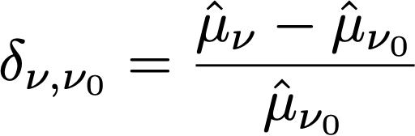

# Statistiska beräkningar i A/Bn-tester

På den här sidan visas detaljerade statistiska beräkningar som används vid manuella A/Bn-tester i [!DNL Adobe Target]. Definitioner finns för konverteringsgrad, konfidensintervall för konverteringsgrad, Lyft, konfidensintervall för Lyft och konfidensintervall.


## Genomsnittlig prestanda

I följande avsnitt förklaras beräkningarna som användes i föregående bild.

### Kampanjer för konverteringsgrad och intäkter per besökare

Följande illustrationer [!UICONTROL Conversion Rate], [!UICONTROL Confidence Interval of Conversion Rate]och antalet [!UICONTROL Conversions] i en [!DNL Target] rapport. Den första raden visar till exempel att för upplevelse A: den [!UICONTROL Conversion Rate] är 25,81 % med en [!UICONTROL Confidence Interval] av ±7,7 % och 32 konverteringar registrerades. Med tanke på att 124 besökare såg upplevelsen motsvarar detta 32/124 = 25,81 %.

<p style="text-align:center;"></p>

konverteringsgraden eller **medelvärde**, *μ<sub>ν</sub>* för varje upplevelse *ν* i ett försök definieras som förhållandet mellan summan av mätvärdet och antalet enheter som tilldelats mätvärdet, *N<sub>ν</sub>*:

<p style="text-align:center;"></p>

Här,

* *Y<sub>iν</sub>* är värdet för måttet för varje enhet, *i*, som har tilldelats en viss upplevelse *ν*.

* Summan över enheter *i* beror på valet av beräkningsmetod.

   * If *Besökare* används som beräkningsmetod, är varje enhet en unik besökare definierad som en unik deltagare i aktiviteten under aktivitetens livstid.
   * If *Besök* används som beräkningsmetod, är varje enhet ett unikt besök definierat som en unik deltagare i en upplevelse under en [!DNL Target] session (med en unik `sessionId`). När `sessionId` eller om besökaren kommer till konverteringssteget räknas ett nytt besök.
   * If *Aktivitetsexponeringar* används som beräkningsmetod, är varje enhet ett unikt intryck som definieras som varje gång en besökare läser in en sida i aktiviteten.

## Konfidensintervall för medelvärde/konverteringsgrad

Konfidensintervallet för konverteringsgraden definieras intuitivt som ett intervall av möjliga konverteringsgrader som överensstämmer med underliggande data.

När du kör experiment är den konverteringsgrad vi observerar för en viss upplevelse en *uppskattning* av konverteringsgraden&quot;true&quot;. För att kvantifiera osäkerheten i denna uppskattning kan vi använda ett konfidensintervall. [!DNL Target] alltid rapporterar ett 95% konfidensintervall, vilket betyder att i det långa loppet inkluderar 95% av de beräknade konfidensintervallen den verkliga konverteringsfrekvensen för upplevelsen.

Ett 95-procentigt konfidensintervall för konverteringsgraden *μ<sub>ν</sub>* definieras som värdeintervallet:

<p style="text-align:center;"></p>

där standardfelet för medelvärdet definieras som

<p style="text-align:center;"></p>

Om en opartisk uppskattning av provets standardavvikelse används:

<p style="text-align:center;"></p>

Observera att när kampanjen är en kampanj för konverteringsgrad (dvs. konverteringsmåttet är binärt), minskas standardfelet till:

<p style="text-align:center;"></p>

## Lyft

I följande bild visas Lyft och konfidensintervall för Lyft i en [!DNL Target] Rapport. Siffran representerar medelvärdet av lyftomfånget och pilen reflekterar om lyften är positiv eller negativ. Pilen visas i grått tills förtroendet passerar 95%. När förtroendet passerat tröskelvärdet är pilen grön eller röd baserat på en positiv eller negativ lyft.

<p style="text-align:center;"></p>

Lyften mellan en upplevelse  *ν* och kontrollupplevelsen *ν<sub>0</sub>* är relativ delta i konverteringsgrader, definierat som

<p style="text-align:center;"></p>

där de enskilda konverteringssatserna är de som anges ovan. Enklare,

```
Lift(Experience N) = (Performance_Experience_N - Performance_Control)/ Performance_Control
```

Om kontrollupplevelsens konverteringsgrad *ν<sub>0</sub>* är 0, det finns ingen hiss.

## Lyftets tillförlitlighetsintervall

Kartongdiagrammet i [!UICONTROL Average Lift and Confidence Interval] -kolumnen representerar det genomsnittliga värdet och 95 % konfidensintervall för Lyft. Kartongen är grå om konfidensintervallet för en viss okontrollupplevelse överlappar konfidensintervallet för kontrollupplevelsen och är grön eller röd när intervallet för den givna upplevelsens konfidensintervall är över eller under konfidensintervallet för kontrollupplevelsen.

Standardfelet mellan en upplevelse  *ν* och kontrollupplevelsen  *ν<sub>0</sub>* definieras som:

<p style="text-align:center;"></p>

Därefter är 95% konfidensintervallet för lyften:

<p style="text-align:center;"></p>

Den här beräkningen använder metoden &quot;Delta&quot; och beskrivs [mer ingående i det här dokumentet](/help/main/assets/confidence_interval_lift.pdf)

## Förtroende

I den sista kolumnen visas förtroendet för [!DNL Target] rapport. Förtroendet hos en upplevelse är en sannolikhet (anges som en procentandel) att få ett resultat som är mindre extrem än det som faktiskt observeras med tanke på att nollhypotesen är sann. När det gäller p-värden visas det förtroende som *1 - p-värde*. Intuitivt innebär ett högre förtroende att det är mindre troligt att upplevelsen av kontroll och icke-kontroll har samma konverteringsgrad.

I [!DNL Target], en tvåsidig **Welch&#39;s t-test** utförs mellan testupplevelsen och kontrollupplevelsen för att testa om metoderna för test- och kontrollupplevelser är desamma. eftersom vi vanligtvis inte vet om provstorlekar och variationer i två grupper är desamma innan vi kör experimentet, och [!DNL Target] gör det även möjligt för er att skicka olika mängder trafik till varje upplevelse, vi antar inte att variansen för varje upplevelse är lika. Welchs t-test väljs alltså istället för Students t-test.

För att utföra Welchs t-test börjar vi med att beräkna t-värdet och antalet frihetsgrader och sedan köra ett tvåsidigt t-test för att generera p-värdet. Slutligen beräknar vi förtroendet baserat på p-värde.

The *t*-statistik definieras som skillnaden mellan medelvärdet av två oberoende slumpmässiga variabler, *ν* och *ν<sub>0</sub>*, dividerat med standardfelet för skillnaden:

<p style="text-align:center;"></p>

där *μ<sub>v</sub>* och *μ<sub>v0</sub>* är *ν*  och *ν<sub>0</sub>* och standardfelet för skillnaden mellan *μ<sub>v</sub>* och *μ<sub>v0</sub>* ges av:

<p style="text-align:center;"></p>

där *σ<sup>2</sup><sub>v</sub>* och *σ<sup>2</sup><sub>v<sub>0</sub></sub>* är skillnaderna mellan två upplevelser *ν*  och *ν<sub>0</sub>* och *N<sub>v</sub>* och *N<sub>v<sub>0</sub></sub>* är samplingsstorlekar för *ν* och *ν<sub>0</sub>* respektive.

För Welchs t-test beräknas frihetsgraden enligt följande:

<p style="text-align:center;"></p>

och frihetsgraden för *ν*  och *ν<sub>0</sub>* definieras som:

<p style="text-align:center;"></p>

<p style="text-align:center;"></p>

Sedan kan p-värdet beräknas från området i bakgrunden av *t*-distribution:

<p style="text-align:center;"></p>

Slutligen rapporterades förtroendet i [!DNL Target] definieras som:

<p style="text-align:center;"></p>

## Utföra beräkningar offline

The [hämtad CSV-rapport](/help/main/c-reports/downloading-data-in-csv-file.md#concept_3F276FF2BBB2499388F97451D6DE2E75) innehåller endast rådata och omfattar inte beräknade värden, t.ex. intäkter per besökare, lyft eller förtroende som används för A/B-tester.

Om du vill beräkna de statistiska mängderna hämtar du målets [Slutför konfidensberäkning](/help/main/assets/complete_confidence_calculator.xlsx) Excel-fil som anger aktivitetens värde.