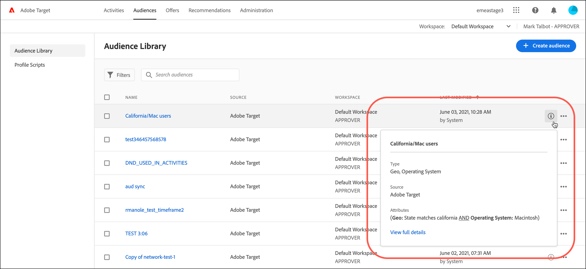

# Skapa målgrupper

Målgrupper i [!DNL Adobe Target] avgöra vilka som ser innehåll och upplevelser i en målinriktad aktivitet.

Målgrupperna används överallt där målgruppsanpassning finns tillgänglig. När du riktar in dig på en aktivitet har du följande alternativ:

* Välj en återanvändbar målgrupp på [!UICONTROL Audiences] list
* [Skapa en aktivitetsspecifik målgrupp](/help/main/c-target/creating-activity-only-audience.md) och rikta in dem
* [Kombinera flera målgrupper](/help/main/c-target/combining-multiple-audiences.md#concept_A7386F1EA4394BD2AB72399C225981E5) skapa en ad hoc-målgrupp

Du kan också använda målgruppsdata som samlats in av [!DNL Adobe Analytics] för målinriktning och personalisering i realtid i [!DNL Target] och andra [!DNL Adobe Experience Cloud] program. Se [Experience Cloud målgrupper](https://experienceleague.adobe.com/docs/core-services/interface/audiences/audience-library.html) i *Gränssnittskomponenter i Experience Cloud* guide.

Det finns två typer av målgrupper i [!DNL Target]:

* **Målgrupper:** Används för att leverera olika innehåll till olika typer av besökare.
* **Rapportera målgrupper:** Används för att avgöra hur olika typer av besökare svarar på samma innehåll så att du kan analysera testresultaten.

   I [!DNL Target]kan du bara konfigurera rapportmålgrupper om du använder [!DNL Target] som rapportkälla. Om du använder [Adobe Analytics som rapporteringskälla](/help/main/c-integrating-target-with-mac/a4t/a4t.md) (A4T) måste du konfigurera dina rapportmålgrupper inom [!DNL Analytics].

## Använd [!UICONTROL Audiences] list {#use-list}

Så här öppnar du [!UICONTROL Audiences] lista, klicka på **[!UICONTROL Audiences]** i den övre menyraden:

![[!UICONTROL Audiences] list](assets/audiences_list.png)

The [!UICONTROL Audiences] -listan innehåller de målgrupper som du kan använda i dina aktiviteter. Använd [!UICONTROL Audiences] skapa, redigera, duplicera, kopiera eller kombinera målgrupper. Listan visar också källan till målgruppen:

* [!DNL Adobe Target]
* [!DNL Adobe Target Classic]
* [!DNL Experience Cloud]
* [!DNL Adobe Experience Platform]

   >[!NOTE]
   >
   >The [!DNL Adobe Experience Platform] källan är tillgänglig för alla [!DNL Target] kunder som använder [Adobe Experience Platform Web SDK](/help/main/c-implementing-target/c-implementing-target-for-client-side-web/aep-web-sdk.md). Publiker som finns på [!DNL Adobe Experience Platform] kan användas som det är eller [kombinerat med befintliga målgrupper](/help/main/c-target/combining-multiple-audiences.md).
   >
   >Användarna måste ha [!UICONTROL Approver] eller ovanför status i [!DNL Target] för att konfigurera [!DNL Target] [!UICONTROL Destinations] kort i AEP/RTCDP ([!DNL Real-time Customer Data Platform]).
   >
   >Mer information finns i [Använda målgrupper från Adobe Experience Platform](#aep).

Fördefinierade målgrupper, till exempel[!UICONTROL New Visitors]&quot; och &quot;[!UICONTROL Returning Visitors],&quot; kan inte byta namn.

När du arbetar med målgrupper som ursprungligen skapades i [!DNL Experience Cloud] eller [!DNL Adobe Experience Platform], [!DNL Target] varnar dig om du refererar till en publik i [!DNL Target] aktiviteter som senare har tagits bort i [!DNL Experience Cloud] eller [!DNL Adobe Experience Platform].

* Om en målgrupp togs bort i [!DNL Experience Cloud] eller [!DNL Adobe Experience Platform], en varningsikon i båda [!UICONTROL Audience] -listan och publikväljaren visas. Ett verktygstips i [!DNL Target] Gränssnittet anger också att målgruppen togs bort i [!DNL Experience Cloud] eller [!DNL Adobe Experience Platform].
* Om du försöker kombinera flera målgrupper med en borttagen målgrupp, eller om du försöker spara en aktivitet som refererar till en borttagen målgrupp, visas ett varningsmeddelande.

Du kan också ange anpassade profilparametrar och `user.` parametrar. När du skapar en målgrupp drar du de attribut du vill använda för att rikta aktiviteten till målgruppsfönstret. Om det önskade attributet inte visas har attributet inte utlösts av en mbox. Andra anpassade mbox-parametrar är tillgängliga i [!UICONTROL Custom Parameters] nedrullningsbar lista.

Använd [!UICONTROL Filters] för att filtrera [!UICONTROL Audiences] lista efter källa: [!DNL Adobe Target], [!DNL Adobe Target Classic], [!DNL Experience Cloud]och [!DNL Adobe Experience Platform].

![Alternativet Filter i [!UICONTROL Audiences] list](assets/filters.png)

Använd [!UICONTROL Search audiences] sökruta [!UICONTROL Audiences] lista. Du kan söka efter valfri del av ett målgruppsnamn eller omge en viss sträng med citattecken.

Du kan sortera [!UICONTROL Audiences] efter målgruppsnamn eller efter det datum då den senast ändrades. Om du vill sortera efter namn eller datum klickar du på kolumnrubriken och väljer sedan att visa målgrupper i stigande eller fallande ordning.

## Visa målgruppsdefinitioner {#section_11B9C4A777E14D36BA1E925021945780}

Du kan visa information om målgruppsdefinitioner på ett popup-kort på olika platser i [!DNL Target] utan att öppna publiken. Den här funktionen gäller för målgrupper som skapats i [!DNL Target Standard/Premium] och målgrupper som importerats från [!DNL Target Classic] eller som har skapats via API.

Du kommer till exempel åt följande grafikkort genom att klicka på [!UICONTROL View Details] -ikon för den önskade publiken:

Du kommer åt följande målgruppsdefinitionskort genom att klicka på [!UICONTROL View Details] ikon på en aktivitets [!UICONTROL Overview] sida:

Målgruppsdefinitionskortet visar målgruppens typ, källa och attribut. Klicka **[!UICONTROL View full details]** för att se andra aktiviteter som hänvisar till den målgruppen, om tillämpligt. Om du visar ett målgruppsdefinitionskort från en aktivitets [!UICONTROL Overview] sida, klicka **[!UICONTROL Audience Usage]**.

Målgruppsinformationen kan hjälpa er att undvika oavsiktlig påverkan på andra aktiviteter samtidigt som ni redigerar målgrupper. Informationen innehåller [!UICONTROL Live Activities], [!UICONTROL Inactive Activities], [!UICONTROL Archived Activities]och [!UICONTROL Syncing Activities]. Den här funktionen är tillgänglig för alla målgrupper (biblioteksmålgrupper och [målgrupper endast för aktivitet](/help/main/c-target/creating-activity-only-audience.md#concept_A6BADCF530ED4AE1852E677FEBE68483)).

Om en publik [tillsammans med en annan målgrupp](/help/main/c-target/combining-multiple-audiences.md) och den kombinerade målgruppen används för att skapa en aktivitet, användarinformationen för båda målgrupperna listar den nyskapade aktiviteten.

<!--The following audience definition card is for an audience imported from the Adobe Experience Cloud. In this instance, the audience was imported from Adobe Audience Manager (AAM).

The following details are available for these imported audience types:

| Audience Type | Details |
|--- |--- |
|Mobile audience|Marketing Name, Vendor, and Model. The `matches | does not match` operator displays instead of `equals | does not equal` .|
|Visitor-behavior audience|**user.categoryAffinity:** `categoryAffinity` with `FAVORITE` parameter.  **Monitoring:** Monitoring service equals true. **No Monitoring Service:** Monitoring service equals false. |
|Audiences using the NOT operator|**Single Rule:** Target displays the audience in the format `[All Visitor AND [NOT [rule]`. Single NOT rule displays with AND with `AllVisitor` audience. |

Keep the following points in mind as you work with imported audiences:

* Expression target audiences are no longer supported in Target Standard/Premium. 
* Target Standard/Premium does not support some deprecated audiences or has improved operators for ease of use. Because of this, the definition of an imported audience, although working as per definition, does not mean that same is now available for creation in the Standard/Premium interface. For example, Social Audiences are visible with their rules but Target Standard/Premium does not allow social audiences to be created.-->

## Använd målgrupper från [!DNL Adobe Experience Platform] {#aep}

Använda målgrupper skapade i [!DNL Adobe Experience Platform] ge mer omfattande kunddata som leder till mer slagkraftig personalisering. The [Real-time Customer Data Platform](https://experienceleague.adobe.com/docs/experience-platform/rtcdp/overview.html){target=_blank} (RTCDP), inbyggt [!DNL Adobe Experience Platform], hjälper företag att samla in kända och anonyma data från flera olika källor. Med den här processen kan ni skapa kundprofiler som kan användas för att leverera personaliserade kundupplevelser över alla kanaler och enheter i realtid.

Genom att ansluta [!DNL Target] till [!DNL Real-time Customer Data Platform]kan kunderna förbättra sin webbpersonalisering genom att låsa upp nya segment som tidigare inte var tillgängliga för [!DNL Target] för att möjliggöra millisekundpersonalisering i realtid på första sidan av en kunds webbbesök. Använda målgrupper skapade i [!DNL Adobe Experience Platform] gör att du kan utöka de tillgängliga datapunkterna för bättre personalisering.

Den här integreringen låser upp viktiga användningsfall med RTCDP:

* Personalisering med samma sida/nästa träff
* Personalisering av okända användare

Viktiga funktioner:

* Integrering med Direct Target med RTCDP/[!DNL Adobe Experience Platform] på kanten (tar bort beroendet av [!DNL Audience Core services] - AAM)
* [!UICONTROL Target Edge Destinations Card] med tillsyn
* Kantsegmentering och kantprofil med enhetlig profil

Mer information finns i följande avsnitt:

* [Versionsinformation om destinationer](https://experienceleague.adobe.com/docs/experience-platform/release-notes/latest.html?lang=en#destinations){target=_blank} i *Versionsinformation för Adobe Experience Platform*
* [Konfigurera personaliseringsmål för personalisering på samma sida och nästa sida](https://experienceleague.adobe.com/docs/experience-platform/destinations/ui/activate/configure-personalization-destinations.html){target=_blank} i *Översikt över destinationer* guide.
* [Anpassad personaliseringsanslutning](https://experienceleague.adobe.com/docs/experience-platform/destinations/catalog/personalization/custom-personalization.html){target=_blank} i *Översikt över destinationer* guide
* [Adobe Target-anslutning](https://experienceleague.adobe.com/docs/experience-platform/destinations/catalog/personalization/adobe-target-connection.html){target=_blank} i *Översikt över destinationer* guide
* [Konfigurera anpassningsmål för användning av samma sida och nästa sida](https://www.adobe.com/go/destinations-edge-personalization-en){target=_blank} i *Översikt över destinationer* guide

### Ytterligare information

Tänk på följande information när du använder målgrupper från [!DNL Adobe Experience Platform]:

#### Användningsexempel för personalisering

Tabellen nedan visar vilka typer av användningsfall för personalisering (nästa session eller samma sida) som är tillgängliga när du använder [!DNL Adobe Experience Platform Web SDK] jämfört med att använda at.js:

| Implementering | Lösningar/användningsfall aktiverat |
| --- | --- |
| at.js | **Lösningar**:<ul><li>[!DNL Adobe Audience Manager] (AAM) och [!DNL Target]</li><li>[!DNL RTCDP] (Premium eller Ultimate) och [!DNL Target]</li><li>[!DNL RTCDP] (valfri SKU), [!DNL AAM]och [!DNL Target]</li></ul>**Användningsfall**:<ul><li>Anpassa nästa session</li></ul> |
| [!DNL Platform Web SDK] eller [!DNL AEP Server-Side API] | **Lösningar**:<ul><li>[!DNL RTCDP] (valfri SKU) och [!DNL Target]</li></ul>**Använd skiftläge**:<ul><li>Anpassa nästa session</li><li>Personalisering på samma sida via Edge</li><li>Styrning som upprätthålls vid delning av segment</li></ul>**Lösningar**:<ul><li>[!DNL RTCDP] (valfri SKU), [!DNL AAM]och [!DNL Target]</li></ul>**Använd skiftläge**:<ul><li>Anpassa nästa session</li><ul><li>[!DNL AAM] segment</li><li>Tredjepartssegment via [!DNL AAM]</li></ul><li>Personalisering på samma sida via Edge</li><ul><li>[!DNL RTCDP] segment</li><li>Styrning som upprätthålls vid delning av segment</li></ul> |
| Blandning av [!UICONTROL at.js] och [!DNL Platform Web SDK] | **Lösningar**:<ul><li>[!DNL RTCDP] (valfri SKU) och [!DNL Target]</li></ul>**Använd skiftläge**:<ul><li>Anpassa nästa session</li><ul><li>För alla sidor med [!UICONTROL at.js]</li></ul><li>Personalisering på samma sida</li><ul><li>För alla sidor med [!DNL Platform Web SDK]</li></ul></ul>**Lösningar**:<ul><li>[!DNL RTCDP] (valfri SKU), [!DNL AAM]och [!DNL Target]</li></ul>**Använd skiftläge**:<ul><li>Anpassa nästa session</li><ul><li>För alla sidor med [!UICONTROL at.js]</li><li>[!DNL AAM] segment</li><li>Tredjepartssegment via [!DNL AAM]</li></ul> |

#### Utvärderingstid för segment

I följande tabell visas segmentutvärderingstiden för händelser som kommer från olika implementeringsscenarier:

| Scenario | Kantsegment (millisekundutvärdering) | Strömningssegment (minututvärdering) | Utvärdering av batchsegment |
| --- | --- | --- | --- |
| Händelser/data från [!DNL Adobe Experience Platform] SDK | Ja | Ja | Ej tillämpligt |
| Händelser från [!UICONTROL at.js] | Nej | Ja | Ej tillämpligt |
| Händelser från [!DNL Target Mobile] SDK | Nej | Ja | Ej tillämpligt |
| Händelser från batchöverföring | Nej | Nej | Ja |
| Händelser från offlinedata (ström) | Nej | Ja | Ja |

### Video: Nästa steg i personaliseringen med CDP och [!DNL Adobe Target]{#RTCDP}

Läs om hur ni personaliserar nästa träff med [!DNL Real-time Customer Data Platform] och [!DNL Adobe Target]. The [!DNL Adobe Target] mål in [!DNL Real-time CDP] låter dig använda [!DNL Experience Platform] segment i [!DNL Adobe Target] för personalisering av samma sida och nästa sida med stöd för styrning och integritet.

Mer information finns i [Nästa steg i personaliseringen med CDP och Adobe Target i realtid](https://experienceleague.adobe.com/docs/platform-learn/tutorials/experience-cloud/next-hit-personalization.html){target=_blank} i *Platform Tutorials* guide.

>[!VIDEO](https://video.tv.adobe.com/v/340091?quality=12&learn=on)

### Adobe Target blogg och video:

[[!DNL Adobe] announces Same Page Enhanced Personalization with [!DNL Adobe Target] och [!DNL Real-time Customer Data Platform]](https://blog.adobe.com/en/publish/2021/10/05/adobe-announces-same-page-enhanced-personalization-with-adobe-target-real-time-customer-data-platform){target=_blank}

## Utbildningsvideo: Använda målgrupper 

Den här videon innehåller information om hur du använder målgrupper.

* Förklara termen&quot;publik&quot;
* Förklara de två sätt på vilka målgrupper används för optimering
* Hitta målgrupper i publiklistan
* Rikta en aktivitet mot en målgrupp
* Använd målgrupper för passiv rapportering i en aktivitet

>[!VIDEO](https://video.tv.adobe.com/v/17398)
