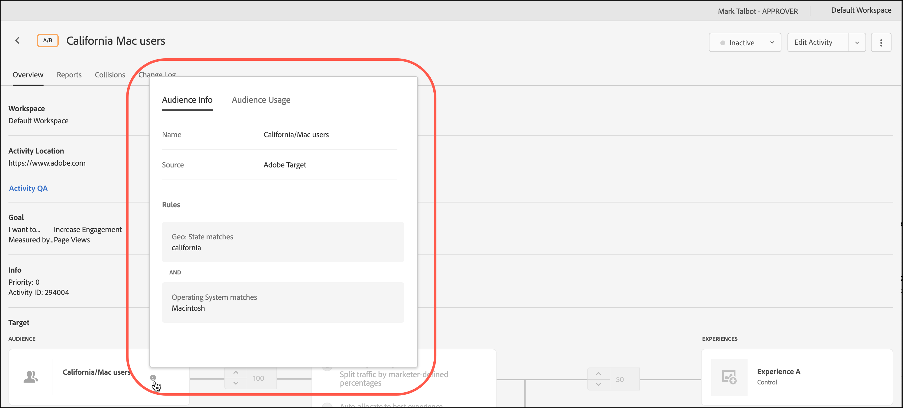

# Skapa målgrupper

Målgrupper i [!DNL Adobe Target] avgör vem som ser innehåll och upplevelser i en målinriktad aktivitet.

Målgrupperna används överallt där målgruppsanpassning finns tillgänglig. När du riktar in dig på en aktivitet har du följande alternativ:

* Välj en återanvändbar målgrupp i listan [!UICONTROL Audiences]
* [Skapa en aktivitetsspecifik målgrupp](/help/main/c-target/creating-activity-only-audience.md) och ange den som mål
* [Kombinera flera målgrupper](/help/main/c-target/combining-multiple-audiences.md#concept_A7386F1EA4394BD2AB72399C225981E5) för att skapa en ad hoc-målgrupp

Du kan också använda målgruppsdata som samlats in av [!DNL Adobe Analytics] för målinriktning och personalisering i realtid i [!DNL Target] och andra [!DNL Adobe Experience Cloud]-program. Se [Experience Cloud-målgrupper](https://experienceleague.adobe.com/docs/core-services/interface/audiences/audience-library.html?lang=sv-SE) i handboken *Experience Cloud Central Interface Components*.

Det finns två typer av målgrupper i [!DNL Target]:

* **Målgrupper:** Används för att leverera olika typer av besökare.
* **Rapportera målgrupper:** Används för att avgöra hur olika typer av besökare svarar på samma innehåll så att du kan analysera testresultaten.

  I [!DNL Target] kan du bara konfigurera rapportmålgrupper om du använder [!DNL Target] som rapportkälla. Om du använder [Adobe Analytics som rapportkälla](/help/main/c-integrating-target-with-mac/a4t/a4t.md) (A4T) måste du konfigurera dina rapportmålgrupper i [!DNL Analytics].

## Använd listan [!UICONTROL Audiences] {#use-list}

Du öppnar listan [!UICONTROL Audiences] genom att klicka på **[!UICONTROL Audiences]** i den övre menyraden:

![[!UICONTROL Audiences] lista &#x200B;](assets/audiences_list.png)

Listan [!UICONTROL Audiences] innehåller de målgrupper som du kan använda i dina aktiviteter. Använd listan [!UICONTROL Audiences] för att skapa, redigera, duplicera, kopiera eller kombinera målgrupper. Listan visar också källan till målgruppen:

* [!DNL Adobe Target]
* [!DNL Adobe Target Classic]
* [!DNL Experience Cloud]
* [!DNL Adobe Experience Platform]

  >[!NOTE]
  >
  >[!DNL Adobe Experience Platform]-källan är tillgänglig för alla [!DNL Target]-kunder som använder [Adobe Experience Platform Web SDK](https://experienceleague.adobe.com/docs/target-dev/developer/client-side/aep-web-sdk.html){target=_blank}. Publiker som är tillgängliga från [!DNL Adobe Experience Platform] kan användas som de är eller [kombineras med befintliga målgrupper](/help/main/c-target/combining-multiple-audiences.md).
  >
  >Användare måste ha statusvärdet [!UICONTROL Approver] eller högre i [!DNL Target] för att kunna konfigurera [!DNL Target] [!UICONTROL Destinations]-kort i AEP/RTCDP ([!DNL Real-time Customer Data Platform]).
  >
  >Mer information finns i [Använda målgrupper från Adobe Experience Platform](#aep).

Fördefinierade målgrupper, som [!UICONTROL New Visitors] och [!UICONTROL Returning Visitors], kan inte byta namn.

När du arbetar med målgrupper som ursprungligen skapades i [!DNL Experience Cloud] eller [!DNL Adobe Experience Platform] får du ett varningsmeddelande i [!DNL Target] om du refererar till en målgrupp i [!DNL Target] aktiviteter som senare har tagits bort i [!DNL Experience Cloud] eller [!DNL Adobe Experience Platform].

* Om en målgrupp togs bort i [!DNL Experience Cloud] eller [!DNL Adobe Experience Platform] visas en varningsikon både i listan [!UICONTROL Audience] och i målgruppsväljaren. Ett verktygstips i användargränssnittet för [!DNL Target] anger också att målgruppen togs bort i [!DNL Experience Cloud] eller [!DNL Adobe Experience Platform].
* Om du försöker kombinera flera målgrupper med en borttagen målgrupp, eller om du försöker spara en aktivitet som refererar till en borttagen målgrupp, visas ett varningsmeddelande.

Du kan också ange anpassade profilparametrar och `user.` parametrar som mål. När du skapar en målgrupp drar du de attribut du vill använda för att rikta aktiviteten till målgruppsfönstret. Om det önskade attributet inte visas har attributet inte utlösts av en mbox. Andra anpassade mbox-parametrar är tillgängliga i listrutan [!UICONTROL Custom Parameters].

Använd knappen [!UICONTROL Filters] för att filtrera listan [!UICONTROL Audiences] efter källa: [!DNL Adobe Target], [!DNL Adobe Target Classic], [!DNL Experience Cloud] och [!DNL Adobe Experience Platform].

![Alternativet Filter i [!UICONTROL Audiences]-listan](assets/filters.png)

Använd rutan [!UICONTROL Search audiences] för att söka i listan [!UICONTROL Audiences]. Du kan söka efter valfri del av ett målgruppsnamn eller omge en viss sträng med citattecken.

Du kan sortera listan [!UICONTROL Audiences] efter målgruppsnamn eller efter det datum då den senast ändrades. Om du vill sortera efter namn eller datum klickar du på kolumnrubriken och väljer sedan att visa målgrupper i stigande eller fallande ordning.

## Visa målgruppsdefinitioner {#section_11B9C4A777E14D36BA1E925021945780}

Du kan visa information om målgruppsdefinitioner på ett popup-kort på olika platser i [!DNL Target]-gränssnittet utan att öppna målgruppen. Den här funktionen gäller för målgrupper som skapats i [!DNL Target Standard/Premium] och målgrupper som importerats från [!DNL Target Classic] eller skapats via API.

Du kommer till exempel åt följande publikdefinitionskort genom att klicka på ikonen [!UICONTROL View Details] för den önskade publiken:

Du kommer åt följande målgruppsdefinitionskort genom att klicka på ikonen [!UICONTROL View Details] på en aktivitets [!UICONTROL Overview]-sida:

Målgruppsdefinitionskortet visar målgruppens typ, källa och attribut. Klicka på **[!UICONTROL View full details]** om du vill se andra aktiviteter som refererar till den målgruppen, om tillämpligt. Om du visar ett målgruppsdefinitionskort från en aktivitets [!UICONTROL Overview]-sida klickar du på **[!UICONTROL Audience Usage]**.

Målgruppsinformationen kan hjälpa er att undvika oavsiktlig påverkan på andra aktiviteter samtidigt som ni redigerar målgrupper. Informationen omfattar [!UICONTROL Live Activities], [!UICONTROL Inactive Activities], [!UICONTROL Archived Activities] och [!UICONTROL Syncing Activities]. Den här funktionen är tillgänglig för alla målgrupper (biblioteksmålgrupper och [endast aktivitetsmålgrupper](/help/main/c-target/creating-activity-only-audience.md#concept_A6BADCF530ED4AE1852E677FEBE68483)).

Om en målgrupp [kombineras med en annan målgrupp](/help/main/c-target/combining-multiple-audiences.md) och den kombinerade målgruppen används för att skapa en aktivitet, listas den nya aktiviteten i användningsinformationen för båda målgrupperna.

<!--The following audience definition card is for an audience imported from the Adobe Experience Cloud. In this instance, the audience was imported from Adobe Audience Manager (AAM).

The following details are available for these imported audience types:

| Audience Type | Details |
|--- |--- |
|Mobile audience|Marketing Name, Vendor, and Model. The `matches | does not match` operator displays instead of `equals | does not equal` .|
|Visitor-behavior audience|**user.categoryAffinity:** `categoryAffinity` with `FAVORITE` parameter.  **Monitoring:** Monitoring service equals true. **No Monitoring Service:** Monitoring service equals false. |
|Audiences using the NOT operator|**Single Rule:** Target displays the audience in the format `[All Visitor AND [NOT [rule]`. Single NOT rule displays with AND with `AllVisitor` audience. |

Keep the following points in mind as you work with imported audiences:

* Expression target audiences are no longer supported in Target Standard/Premium. 
* Target Standard/Premium does not support some deprecated audiences or has improved operators for ease of use. Because of this, the definition of an imported audience, although working as per definition, does not mean that same is now available for creation in the Standard/Premium interface. For example, Social Audiences are visible with their rules but Target Standard/Premium does not allow social audiences to be created.-->

## Använd målgrupper från [!DNL Adobe Experience Platform] {#aep}

Om målgrupper skapas i [!DNL Adobe Experience Platform] får du mer omfattande kunddata som leder till mer slagkraftig personalisering.

Mer information finns i [Använda målgrupper från [!DNL Adobe Experience Platform]](/help/main/c-integrating-target-with-mac/integrating-with-rtcdp.md#aep).

## Utbildningsvideo: Använda märket 

Den här videon innehåller information om hur du använder målgrupper.

* Förklara termen&quot;publik&quot;
* Förklara de två sätt på vilka målgrupper används för optimering
* Hitta målgrupper i publiklistan
* Rikta en aktivitet mot en målgrupp
* Använd målgrupper för passiv rapportering i en aktivitet

>[!VIDEO](https://video.tv.adobe.com/v/17398)
