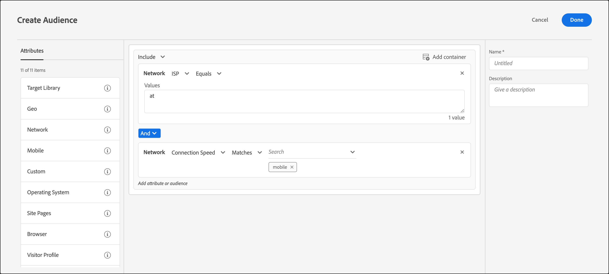

# Nätverk

Du kan skapa målgrupper i [!DNL Adobe Target] baserat på nätverksinformation som Internet-leverantör, domännamn och anslutningshastighet.

1. I [!DNL Target] gränssnitt, klicka **[!UICONTROL Audiences]** > **[!UICONTROL Create Audience]**.
1. Namnge målgruppen och lägg till en valfri beskrivning.
1. Dra och släpp **[!UICONTROL Network]** till målgruppsverktyget.
1. Klicka **[!UICONTROL Select]** väljer du sedan något av följande alternativ:

   * **Internetleverantör:** En Internet-leverantör är en organisation som ger internetåtkomst till sina prenumeranter, vanligen med en månads- eller årsavgift. Många internetleverantörer erbjuder ytterligare tjänster, som webbhotell eller e-post. Fältet Internet-leverantör är antingen en kommersiell Internet-leverantör (till exempel Comcast eller TimeWarner) eller en annan enhet som ett företag eller en utbildningsinstitution.

      Nedan följer några exempel på vanliga Internet-leverantörer i USA:

      | Populärt namn | ISP-namn | Domännamn | Exempel på IP-adress |
      |---|---|---|---|
      | Cablevision | Cablevision Systems Corp. | &#42;.optonline.net | 68.196.130.239 |
      | CenturyLink | Qwest Communications Company, LLC | &#42;.centurylink.net | 64.40.65.0 |
      | Stadskommunikation | Stadskommunikation | &#42;.charter.com | 71.85.225.124 |
      | Comcast | Comcast Cable Communications, Inc. | &#42;.comcast.net | 76.27.24.28 |
      | Cox | Cox Communications Inc. | &#42;cox.net | 68.224.174.22 |
      | Speakeasy | MegaPath Corporation | &#42;.högtaleasy.net | 66.93.240.0 |
      | Time Warner | Time Warner Cable Internet LLC | &#42;.res.rr.com | 72.229.28.185 |
      | Verizon FiOS | MCI Communications Services, Inc. d/b/a Verizon Business | &#42;.fios.verizon.net | 173.68.112.34 |
      | Vivint | Smartrove Inc. | &#42;.vivintWireless.net | 170.72.26.105 |
      | AT&amp;T Wireless | AT | &#42;.mycingular.net |  |
      | Sprint Mobile | Sprint Personal Communications Systems | IP-adress |  |
      | T-Mobile | T-Mobile USA, Inc. | IP-adress | 208.54.86.0 |
      | Verizon Wireless | Cellco Parternship DBA Verizon Wireless | &#42;.myvzw.com | 70.195.74.199 |

      >[!NOTE]
      >
      >Använd ISP-namnet, inte det populära namnet, när du riktar dig mot en Internet-leverantör. Se till att du skapar regeln så att den inte är skiftlägeskänslig eller alltid använder gemener.

      Du kan testa ISP- och domännamnsvärdena. [https://www.whoismyisp.org](https://www.whoismyisp.org) är en bra resurs för målinriktning. Du kan använda de exempeladresser som anges i tabellen ovan eller ange egna. Använd sedan `mboxOverride.browserIp= URL` parameter som härmar den IP-adressen.

   * **Domännamn:** Det här namnet är domännamnet för besökarens IP-adress. Det här namnet är inte domännamnet för webbplatsen som du använder med [!DNL Target]. Det här domännamnet är relaterat till besökarens IP-adress och kallas ibland för ett värdnamn. Det liknar Internet-leverantörens namn. Ibland refererar värdnamnet till äldre namn på företag som har ändrat namn på sin Internet-leverantör men inte domännamnet.
   * **Anslutningshastighet:** Den här hastigheten är hastigheten för besökarens internetanslutning. Alternativen är: bredband, kabel, dialup, mobile, oc3, oc12, satellit, t1, t2, trådlöst och xdsl.

      Det här fältet baseras på anslutningstypen och inte på själva hastigheten. [!DNL Target] kan inte fastställa den exakta anslutningshastigheten för anslutningar. Bredbandsanslutningstypen används när det inte finns några indikationer på andra anslutningstyper, så det går inte att välja en viss typ.

1. (Valfritt) Ange ytterligare regler för målgruppen.
1. Klicka på **[!UICONTROL Done]**.

Följande bild visar en målgrupp som riktar sig till besökare som använder AT&amp;T med en anslutningshastighet på [!UICONTROL Mobile].

## Utbildningsvideo: Skapa målgrupper

Den här videon innehåller information om hur du använder målgruppskategorier.

* Skapa målgrupper
* Definiera målgruppskategorier

>[!VIDEO](https://video.tv.adobe.com/v/17392)
