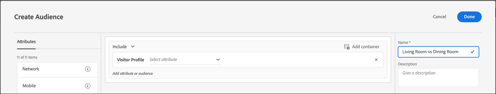

# Skapa en målgrupp för profilattributsjämförelse

Definiera en målgrupp i [!DNL Adobe Target] för att jämföra två profilattribut för [Målgruppsbibliotek](/help/main/c-target/c-audiences/audiences.md) eller i en [målgrupp endast för aktivitet](/help/main/c-target/creating-activity-only-audience.md). Med operatorer, till exempel större än, mindre än eller lika med, kan du definiera en målgrupp för att dynamiskt jämföra värdena för två olika profilattribut.

>[!NOTE]
>
>Den här funktionen är tillgänglig för [[!UICONTROL Visitor Profile]](/help/main/c-target/c-audiences/c-target-rules/visitor-profile.md#concept_E972690B9A4C4372A34229FA37EDA38E) endast kategori.

## Översikt {#section_303CBC78194D49A2A004945D425441E1}

Målgrupper definieras av regler som bestämmer vem som är inkluderad i eller utesluten från en [!DNL Target] aktivitet. En målgruppsdefinition kan innehålla flera regler, och varje regel kan innehålla flera parametrar. Om en av reglerna du inkluderar använder [!UICONTROL Visitor Profile] -kategori kan du definiera en regel baserat på ett besökarprofilattribut specifika värde eller jämföra värdet för det attributet med ett annat besökarprofilattribut.

Låt oss anta att du jobbar för ett möbelföretag och överförde två kundbenägenhetspoängen till [!DNL Target]:

* Sannolikheten att köpa möbler till matsalar under de kommande 90 dagarna
* Sannolikheten att köpa möbler för vardagsrumsmöbler under de kommande 90 dagarna

Du kan skapa en målgrupp som definieras som att benägenheten att köpa möbler för matsalar är större än sannolikheten att köpa möbler för vardagsrum. [!DNL Target] skulle sedan dynamiskt jämföra poängen för matsalen och livsrummets benägenhet för en viss besökare för att avgöra om besökaren uppfyller kraven för denna målgrupp.

Mer information finns i [Metoder för att hämta data till Target](https://developer.adobe.com/target/before-implement/methods-to-get-data-into-target/methods-to-get-data-into-target/).

## Skapa en målgrupp för profilattributsjämförelse {#section_7A62FD47D5C74C3EBC3417ACDBB85013}

1. Klicka på **[!UICONTROL Audiences]** > **[!UICONTROL Create Audience]**.
1. Namnge målgruppen och lägg till en valfri beskrivning.
1. Dra och släpp **[!UICONTROL Visitor Profile]** till målgruppsverktyget.
1. Från **[!UICONTROL Visitor Profile]** väljer du ett attribut:

   

1. Välj utvärderare:

   

1. Från **[!UICONTROL Choose Comparison Type]** nedrullningsbar lista, välja **[!UICONTROL Attribute]**.

   Jämförelsetypen för&quot;statiskt värde&quot; gör att du kan jämföra din besökarprofils attribut med specifika värden.

   

   >[!NOTE]
   >
   >Om du använder någon av standardkategorierna för besökarprofiler (till exempel Ny besökare eller Återkommande besökare) kan du bara välja alternativet för statiskt värde. Alternativen för dynamisk jämförelse är inte tillgängliga för standardkategorier. Andra exempel där alternativen för dynamisk jämförelse inte är tillgängliga är&quot;Första sidan av sessionen&quot;,&quot;Inte i andra tester&quot;,&quot;Inte första sidan av sessionen&quot; och&quot;Kategoritillhörighet&quot;.

1. Välj det ytterligare attribut du vill jämföra med det ursprungliga attributet.

   

1. Klicka på **[!UICONTROL Done]**.

## Utbildningsvideo  {#section_3BB8DBF3418F4520B3E274B6F40AF8F3}

Titta på följande video för mer information och ett scenario där du kan använda den här funktionen:

>[!VIDEO](https://video.tv.adobe.com/v/23218/)
