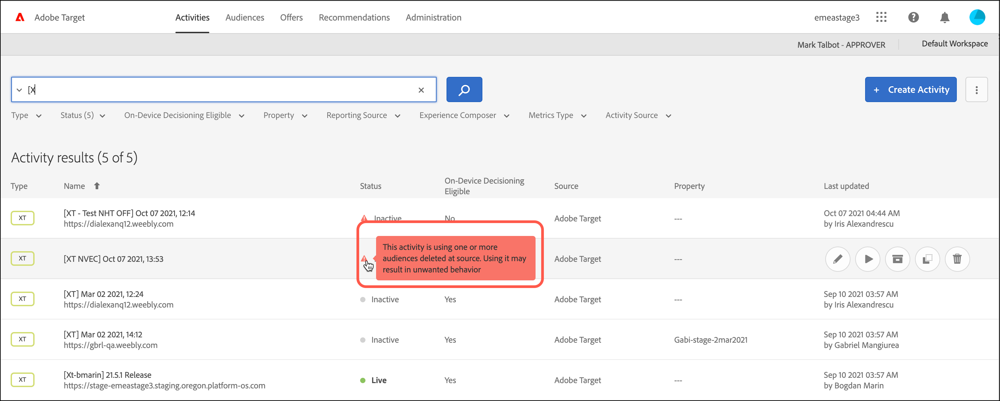
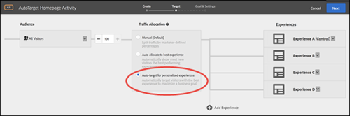

# Versionsinformation för tidigare versioner

Versionsinformation för tidigare [!DNL Adobe Target]-versioner, inklusive versionsinformation för [!DNL Target Standard/Premium], plattformen [!DNL Target] och [!DNL Target] JavaScript-biblioteket (at.js).

Versionsinformationen ordnas i fallande ordning efter månad och år då den släpptes.

>[!NOTE]
>
>Mer information om den aktuella månadens Target-utgåvor (plattform och Target Standard/Premium) finns i [Versionsinformation för mål (aktuell)](/help/main/r-release-notes/release-notes.md#reference_8FE40B43A5A34DDF8F26A53D55EE036A).

## Versionsinformation - 2025

### [!DNL Target Standard/Premium] 25.10.1 (22 oktober 2025)

Den här versionen innehåller följande uppdateringar och korrigeringar:

**Aktiviteter**

+++ Se detaljer
* **Ett användbarhetsproblem i det uppdaterade användargränssnittet** har åtgärdats. [!UICONTROL Observers] kan nu förhandsgranska aktiviteter med alternativet [!UICONTROL View Activity], precis som i det gamla användargränssnittet. (TGT-51741)
* **[!UICONTROL Observer]användare kan nu visa aktivitetsinnehåll i det uppdaterade användargränssnittet.** återställde synlighet för observatörsrollanvändare i det uppdaterade aktivitetsgränssnittet. Tidigare kunde observatörerna inte visa ändringar, erbjudanden och innehållsändringar - funktioner som fanns i det gamla användargränssnittet. (TGT-53785)
* **[!UICONTROL Approver]användare kan nu redigera aktivitetsmål utan redigeringsbehörighetsfel.** Löste ett behörighetsproblem i gränssnittet för att skapa aktivitet som hindrade användare på godkännarnivå från att spara ändringar i avancerade målinställningar. Berörda användare fick ett `403 Forbidden.Resource`-fel som krävde redigeringsbehörighet, trots att de har tillräcklig åtkomst. (TGT-53819)

+++

**Publiker**

+++Se detaljer
* **Markering av flera målgrupper har återställts i rapporten&quot;Endast den här aktiviteten&quot;.** Löste ett problem i gränssnittet för att skapa aktivitet som hindrade användare från att välja flera målgrupper under avsnittet [!UICONTROL This activity only] i [!UICONTROL Goals & Settings]. (TGT-53283)
* **Målgruppsbaserade rapportdiagram visar nu konverteringsdata korrekt.** Löste ett problem på fliken [!UICONTROL Reports] som orsakade att diagram inte fungerade när du valde målgrupper som inte var standard. Data och konfidensmått fanns tillgängliga, men det visuella diagrammet visade bara en solid linje, vilket försvårar analysen. (TGT-53769)
* **Gränssnittet [!UICONTROL Targeting] visar nu tydligt uteslutna målgruppsregler.** Löste ett problem i avsnittet [!UICONTROL Targeting] i användargränssnittet för att skapa aktivitet där målgruppsreglerna som är inställda på [!UICONTROL Exclude] inte visades tydligt. Detta ledde till förvirring när målgruppslogik granskades, särskilt för målgrupper som inte inkluderar specifika URL:er. (TGT-53809)
* **Målgruppsdefinitionsvärden kan nu markeras och kopieras på fliken [!UICONTROL Targeting].** Löste ett problem i gränssnittet Activity Create som hindrade användare från att markera och kopiera målgruppsregelvärden på fliken [!UICONTROL Targeting]. Den här funktionen var tillgänglig i det gamla användargränssnittet men saknas i det uppdaterade användargränssnittet. (TGT-53856)

+++

**Lokalisering**

+++Se detaljer
* **Felmatchningen av &quot;quote&quot; i sidredigerarkontexten zh_CN har korrigerats.** Korrigerade ett kontextuellt översättningsfel i zh_CN-språket där termen &quot;citat&quot; felaktigt översattes som &quot;报 价&quot;, vilket innebär en kommersiell prisoffert. I avsnittet Typografi > Rubrikformat > Blockcitat hänvisar den avsedda betydelsen till ett formateringselement - citattecken - inte priser. (TGT-53841)
* **Felmatchningen av &quot;quote removed&quot; i sidredigerarkontexten zh_CN har korrigerats.** Korrigerade ett översättningsfel i zh_CN-språket där &quot;citattecknet borttaget&quot; felaktigt återgavs som &quot;移 除 报 价&quot;, vilket innebär en kommersiell prisoffert. I avsnittet Typografi > Rubrikformat > Blockcitat hänvisar termen till ett formateringselement - citattecken - inte priser. (TGT-53843)
* **Felmatchningen av&quot;omarrangerat citattecken&quot; i sidredigerarkontexten zh_CN har korrigerats.** Korrigerade ett kontextuellt översättningsfel i zh_CN-språket där&quot;citattecknet omordnades&quot; felaktigt översattes som&quot;重 新 排 列 了 价&quot;, vilket innebär en kommersiell prisoffert. I avsnittet Typografi > Rubrikformat > Blockcitat hänvisar termen till ett formateringselement - citattecken - inte priser. (TGT-53844)
* **Felmatchningen av &quot;quote changed&quot; i sidredigerarkontexten zh_CN har korrigerats.** Korrigerade ett översättningsfel i zh_CN-språket där &quot;offerten har ändrats&quot; felaktigt återgavs som &quot;更 改 报 价&quot;, vilket tyder på en kommersiell prisoffert. I avsnittet Typografi > Rubrikformat > Blockcitat hänvisar termen till ett formateringselement - citattecken - inte priser. (TGT-53845)

+++

**Rekommendationer**

+++Se detaljer
* **CSS-väljarändringar för rekommendationer sparas nu korrekt.** Löste ett problem i gränssnittet för att skapa aktivitet som hindrade användare från att uppdatera CSS-väljaren för rekommendationsplaceringar. Ändringarna återställs efter att de sparats och uppdateringarna till behållarna för målanpassning blockeras. (TGT-53835)
* **Val av sidinläsningshändelse kvarstår nu i rekommendationsändringar.** Löste ett problem i gränssnittet för att skapa aktivitet som hindrade användare från att spara ändringar när en rekommendations händelsetyp ändrades från [!UICONTROL View] till [!UICONTROL Page Load]. Även om markeringen verkar vara slutförd återställs den efter att ha navigerat bort och blockerat aktivitetspublikationen. (TGT-53957)

+++

**Rapporter**

+++Se detaljer
* **[!UICONTROL Export order details to CSV] hämtar nu fullständiga data.** Löste ett problem i det uppdaterade [!UICONTROL Overview]-gränssnittet som orsakade att alternativet [!UICONTROL Export Order details to CSV] laddade ned tomma filer, även när det fanns giltiga rapportdata. (TGT-53787)

+++

**Säkerhet**

+++Se detaljer
* **IMS-förfiltret har lagts till för att skydda GQL-slutpunkter från dataexponering över grupper.** Löste ett säkerhetsproblem på fliken Admin som påverkar GraphQL-slutpunkterna licenseGroups och targetProperties. Problemet uppstod när JIL API användes med en Admin Client-token som skulle kunna utnyttjas för att få åtkomst till produktdata för flera organisationer. (TGT-53837)

+++

**Visual Experience Composer (VEC)**

+++Se detaljer
* **Redigeringsstabiliteten har återställts i gränssnittet för att skapa aktivitet.** Löste ett tillfälligt fel i VEC-gränssnittet som gjorde att redigering misslyckades och länkarna blev oväntat klickbara, vilket dirigerar om användare från sidan. (TGT-53153)
* **Redigering återställd för sparade aktiviteter i gränssnittet Skapa aktivitet.** Löste ett problem som hindrade användare från att redigera aktiviteter efter att ha sparat ändringarna. Aktiviteter som påverkas har fastnat i [!UICONTROL Applying initial modifications], vilket blockerar ytterligare uppdateringar och döljer knappen [!UICONTROL Cancel]. (TGT-53631)
* **VEC slutar inte längre att fungera på [!UICONTROL Applying initial modifications].** Löste ett prestandaproblem i VEC som orsakade långa fördröjningar vid inläsning av upplevelser med ett stort antal ändringar. De berörda användarna såg gränssnittet som fastnat på [!UICONTROL Applying initial modifications] i flera minuter, särskilt i Experience B-scenarier. (TGT-53727)
* **VEC läser nu in ändringar utan rotelement.**
Löste ett problem i VEC som gjorde att upplevelserna stacks när ändringar som saknade ett tydligt rotelement lästes in. Dessa ändringar gjorde att användargränssnittet hängde oändligt på &quot;A[!UICONTROL pplying initial modifications]&quot;. (TGT-53799)
* **Att spara ändringar i aktiviteter fungerar nu som förväntat.** Löste ett behörighetsrelaterat problem i det nya användargränssnittet som hindrade användare från att spara ändringar när de redigerade mål och avancerade inställningar i aktiviteter. De berörda användarna såg ett rött felband och ett&quot;Forbidden.Resource&quot;-meddelande, trots att de hade lämplig åtkomst. (TGT-53816)
* **VEC-gränssnittet bevarar nu upplevelseändringar i olika vyer.** Löste flera problem i den uppdaterade VEC som påverkade upplevelseutvecklingen. Ändringarna blev inte korrekta, särskilt när du använde HTML-erbjudanden eller växlade mellan vyer. (TGT-53825)
* **Alla vyer visas nu korrekt när en ändring sträcker sig över flera upplevelser.** Löste ett problem i gränssnittet för att skapa aktivitet där endast en vy visades när en ändring tillämpades på flera vyer. Verktygstipset för hovring kunde inte visa alla associerade vyer, även om ändringen tillämpades korrekt. (TGT-53827)
* **VEC:n stoppas inte längre regelbundet på [!UICONTROL Applying initial modifications].** Löste ett intermittent problem i VEC där upplevelserna inte kunde läsas in och fastnade på [!UICONTROL Applying initial modifications]. Detta beteende var inkonsekvent och utlöste ibland omdirigeringsslingor eller krävde manuell cacherensning. (TGT-53916)
* **VEC-inläsningsproblemet kunde inte reproduceras.** Ett rapporterat problem har utretts där VEC fastnade på [!UICONTROL Applying initial modifications] när befintliga aktiviteter redigerades. Beteendet misstänktes vara relaterat till HTML-innehåll som saknar ett överordnat element. Vi kommer att fortsätta övervaka för upprepning och rekommenderar att du använder strukturerade behållare för HTML för att säkerställa stabilitet. (TGT-53972)
* **[!UICONTROL Design]-läget i VEC fungerar inte längre som [!UICONTROL Browse]-läge ibland.** Löste ett problem i användargränssnittet där [!UICONTROL Design]-läget ibland betedde sig som [!UICONTROL Browse] , vilket tillåter klickbara `<a>`-länkar och förhindrar att element markeras. Detta gjorde att hovringsrutan stängdes och att ändringsarbetsflöden blockerades. (TGT-53136)
* **Knappklick i [!UICONTROL Composer]-läge utlöser inte längre sidomdirigering.** Löste ett problem i det uppdaterade VEC-gränssnittet där klickning på en knapp i [!UICONTROL Composer]-läge orsakade en oväntad omdirigering till knappens mål-URL. Detta hindrade användare från att redigera call-to-action-element (CTA) och störde redigeringsarbetsflödet. (TGT-53137)
* **Erbjud koduppdateringar i automatiserade personaliseringsaktiviteter och spara nu utan fel.** Löste ett problem i det nya användargränssnittet som orsakade felet [!UICONTROL Invalid user input] vid uppdatering av erbjudandekod i [!UICONTROL Automated Personalization]-aktiviteter. Felet hindrade användare från att spara ändringar, även när indata var giltiga. (TGT-53586)
* **[!UICONTROL Design]-läget i VEC blockerar nu länknavigering för redigerbara komponenter.** Löste ett problem i den uppdaterade VEC där klickbara element - som knappar och länkar - utlöste en sidomdirigering även i [!UICONTROL Design] -läge. Det här beteendet simulerade läget [!UICONTROL Browse] och hindrade användare från att ändra nyckelkomponenter. (TGT-53696)
* Måttet **[!UICONTROL Clicked an element] fungerar nu utan omdirigering eller fel.** Löste ett problem i det nya användargränssnittet som orsakade oväntade omdirigeringar och tomma skärmar när konverteringsmåttet [!UICONTROL Clicked an element] valdes. Om du klickar på en knapp under installationen utlöstes navigeringen i stället för att elementet registrerades, vilket resulterade i ett [!UICONTROL element not found]-fel. (TGT-53817)
* **Befintliga aktiviteter fastnar inte längre i en oändlig inläsningsloop under redigering.** Löste ett problem i det nya användargränssnittet där redigering av en befintlig aktivitet i VEC gjorde att sidan fastnade i en oändlig inläsningsloop. Problemet påverkade inte nyskapade aktiviteter och utlöstes av tidigare ändringar på sidan. (TGT-53913)
* **Befintliga aktivitetssidor med ändringar läses nu in korrekt i VEC.** Löste ett fel i den uppdaterade VEC som gjorde att sidor fastnade i inläsningsfasen när en befintlig aktivitet redigerades med sparade ändringar. Nya aktiviteter lästes in utan problem, men tidigare konfigurerade aktiviteter kunde inte återges. (TGT-53967)

+++

### [!DNL Target Standard/Premium] 25.9.3 (30 september 2025)

Den här versionen innehåller följande förbättringar och korrigeringar.

+++[!UICONTROL Audiences]

* **Reglerna för uteslutning av målgrupper visades felaktigt som inkludering i användargränssnittet i [!DNL Target].** Publiker som konfigurerats med undantagsregler visade sig vara inkluderade vid redigering av mål inom en aktivitet. Trots att exkluderingslogiken tillämpades korrekt under körningen kunde inte användargränssnittet återge regeln korrekt och utelämnade undantagsetiketten. Gränssnittet [!DNL Target] visar nu exkluderingsregler korrekt i både målgruppskonfigurationen och arbetsflöden för målinriktning, vilket ger tydlighet och konsekvens vid kampanjkonfigurationen. (TGT-53808)
* **Avsnittet [!UICONTROL Targeting] indikerade inte att en målgruppsregel har angetts till exclude.** Publiker som konfigurerats med exkluderingslogik visades felaktigt som inkludering i avsnittet [!UICONTROL Targeting] i användargränssnittet som skapats med aktivitet. Trots att backend-objektet tillämpade exkluderingsregeln korrekt kunde det inte representeras visuellt i användargränssnittet, och etiketten&quot;Uteslut&quot; utelämnades, vilket orsakade förvirring under kampanjkonfigurationen. Avsnittet [!UICONTROL Targeting] visar nu tydligt exkluderingsregler, vilket säkerställer konsekvens mellan målgruppskonfigurationen och målinriktningsvisualisering. (TGT-53809)

+++

+++Lokalisering

* **Korrigerade en terminologisk inkonsekvens i den förenklade kinesiska översättningen av vyn &quot;Fullständig information&quot;.**
Tidigare översattes termen &quot;Detaljer&quot; felaktigt som &quot;详 情&quot; i språket zh_CN (Simplified Chinese), vilket bröt mot vedertagna terminologinstruktioner. Detta har korrigerats till &quot;详 细 信 息&quot; för att säkerställa överensstämmelse med termbasen. (TGT-53741)

+++

+++[!UICONTROL Recommendations]

* **Det var svårt att hitta rekommendationsrutorna och välja dem i VEC.** När du har lagt till ett rekommendationserbjudande i (VEC) markerades eller rullades inte ändringen i den vänstra panelen till motsvarande rekommendationsruta på sidan. Det gjorde det svårt att hitta och redigera erbjudandet, särskilt när det är dolt under väljare eller formaterat minimalt. När du klickar på en rekommendationsändring markeras och rullas nu korrekt till det associerade elementet, vilket förbättrar användbarheten och redigeringseffektiviteten i den uppdaterade processen för att skapa aktiviteter. (TGT-52571)
* **Rekommendationsväljarna skrevs om felaktigt efter att en aktivitet sparats.** När du lade till en rekommendation till ett element i VEC var väljaren från början korrekt, men när aktiviteten sparades och öppnades igen ändrades den till en allmän väljare. Försök att manuellt återställa den ursprungliga väljaren resulterade i valideringsfel. Rekommendationsväljarna bevaras nu korrekt efter att de sparats, vilket garanterar tillförlitlig målinriktning och redigerbarhet i den uppdaterade processen för att skapa aktiviteter. (TGT-53709)
* **Det gick inte att redigera villkorsinnehållet när en befintlig aktivitet ändrades.** När en aktivitet redigerades inaktiverades innehållsavsnittet i [!UICONTROL Criteria], med knappar nedtonade och svarar inte. Problemet löstes genom att se till att [!UICONTROL Criteria] konfigurationer är fullt redigerbara under aktivitetsuppdateringar. Kunder kan nu ändra [!UICONTROL Criteria]-innehåll utan att behöva växla markeringar eller använda tillfälliga lösningar, vilket ökar flexibiliteten och användbarheten i den uppdaterade processen för att skapa aktiviteter. (TGT-53812)
* **Kriterierna kunde inte redigeras i en aktivitet.** Alternativen [!UICONTROL Edit Criteria] och [!UICONTROL Remove Criteria] inaktiverades vid åtkomst av villkor från en aktivitet. Samma villkor kan dock redigeras via fliken [!UICONTROL Recommendations]. Kriterierna är nu fullt redigerbara både från aktivitetsredigeringsarbetsflödet och fliken [!UICONTROL Recommendations], vilket ger en konsekvent och effektiv redigeringsupplevelse. (TGT-53814)

+++

+++[!UICONTROL Reports]

* **Generering av ad hoc-erbjudanden i A[!UICONTROL utomated Personalization]-aktiviteter orsakade inkonsekvenser i rapporteringen.** Användningen av funktionen Generera ad hoc-erbjudanden i [!UICONTROL Automated Personalization]-aktiviteter (AP) ledde till felaktig rapportering. Erbjudande-ID återanvändes i synnerhet på olika platser, vilket ledde till att rapporteringsdata skrevs fel eller skrevs över. Ad-hoc-erbjudanden genereras nu med distinkta identifierare per plats, vilket ger korrekt spårning och rapportering för alla konfigurerade upplevelser. (TGT-53757)
* **Det gick inte att läsa in aktivitetsrapporter på grund av ett JavaScript-fel.**-kunder påträffade ett meddelande om att något gick fel vid åtkomst till fliken [!UICONTROL Reports] för vissa aktiviteter. Felet orsakades av ett JavaScript-undantag: Det går inte att läsa egenskaper för undefined (läsa indexOf), som utlöstes under GraphQL-anropet `getAnalyticsReportSummary`. Rapporterna läses nu in korrekt och felhanteringen har förbättrats för att förhindra liknande fel i det uppdaterade arbetsflödet som skapar aktiviteter. (TGT-53797)
* **Rapporterna kraschar efter interaktion med rullningslisten.** När du klickade på rullningslisten på fliken [!UICONTROL Reports] kraschade sidan, följt av ett JavaScript-fel:
  `SyntaxError: Failed to execute 'querySelector' on 'Element': '[data-key="a-currentcopy"hiretalent""]' is not a valid selector.` rapporter läses nu in och rullas korrekt utan att utlösa fel eller krascher. (TGT-53828)
* **Rapporterna visade inte det primära måttet.** Det primära måttet, som konfigurerats som ett konverteringsmått med en mbox, saknades i aktivitetsrapporterna. Sökning efter metriskt namn eller mbox-namn gav inga resultat, vilket förhindrar synlighet i viktiga prestandadata. Primära mätvärden visas nu korrekt på fliken [!UICONTROL Reports], vilket ger korrekt spårning och analys av kampanjresultat. (TGT-53773)
* **Fliken [!UICONTROL Reports] i det uppdaterade användargränssnittet kraschade när den interagerade med den vågräta rullningslisten.** Vyn [!UICONTROL Reports] kraschade ibland med ett felmeddelande om att något gick fel när den vågräta rullningslisten användes för att visa mätvärden. Rullningslisten fungerar nu på ett tillförlitligt sätt, så att kunderna kan visa och analysera all mätinformation utan att behöva använda tillfälliga lösningar som att zooma ut eller använda skiftrullning. (TGT-53824)

+++

+++[!UICONTROL Visual Experience Composer] (VEC)

* **Redigeringsmenyn visades inte konsekvent när du klickade på vägbeskrivningar i VEC.**
När du markerar HTML-element via vägbeskrivningar i (VEC) kommer redigeringsmenyn ibland att misslyckas eller försvinna snabbt, vilket gör att elementmarkeringen inte är tillförlitlig. Redigera-menyn visas nu enhetligt när du navigerar via vägbeskrivningar, vilket förbättrar arbetsflödet för elementval i den uppdaterade processen att skapa aktivitet. (TGT-52873)
* **Det gick inte att visa snabbmenyn i VEC.** Snabbmenyn i det uppdaterade VEC-gränssnittet visades inte konsekvent när du klickade på element, vilket gör det svårt att komma åt redigeringsalternativen. Snabbmenyn visas nu på ett tillförlitligt sätt när du väljer element, vilket förbättrar redigeringsarbetsflödet och den övergripande användbarheten i den uppdaterade processen att skapa aktiviteter. (TGT-53015)
* **Det gick inte att visa snabbmenyn för vissa element i VEC.** Snabbmenyn visades inte när specifika element valdes i den uppdaterade VEC:n, vilket gör det svårt att använda ändringarna. Snabbmenyn visas nu enhetligt för alla element som stöds, vilket förbättrar tillförlitligheten och användbarheten för redigeringen i det uppdaterade arbetsflödet som skapar aktiviteter. (TGT-53248)
* **Snabbmenyn försvann första gången du klickar när du använder vägbeskrivningar i VEC.** Om du valde ett överordnat element via vägbeskrivningarna i VEC visades snabbmenyn snabbt och försvinner, vilket gör det svårt att komma åt redigeringsalternativen. Snabbmenyn är nu fortfarande synlig och funktionell när du navigerar bland element via vägbeskrivningar, vilket förbättrar tillförlitligheten i arbetsflödet för att välja element i den uppdaterade processen för att skapa aktivitet. (TGT-53424)
* **Snabbmenyn visades inte för element på den översta nivån i VEC.** Om du valde element på den översta nivån, till exempel `<div>` eller `<main>` taggar, via vägbeskrivningarna i VEC, utlöstes inte snabbmenyn, vilket förhindrar ytterligare redigeringsåtgärder. Snabbmenyn visas nu konsekvent för alla element som stöds, inklusive behållare på den översta nivån, vilket förbättrar flexibiliteten och användbarheten i arbetsflödet som skapar aktiviteter. (TGT-53770)
* **Element på en viss sida kunde inte redigeras i VEC.** Vissa element på sidan kunde inte markeras eller redigeras i den uppdaterade VEC:n. Problemet isolerades till den sidan och påverkade inte andra sidor på samma konto. Alla element på sidan kan nu markeras och redigeras som förväntat, vilket återställer alla funktioner i det aktivitetsskapande arbetsflödet. (TGT-53353)
* **Förbättrat arbetsflöde när underordnade element visas när element väljs i VEC.** VEC visar nu underordnade element när du hovrar över eller väljer ett överordnat HTML-element för att förbättra användbarheten och precisionen när aktiviteter skapas. Tack vare den här förbättringen kan kunderna bättre förstå sidans struktur och göra exaktare ändringar, vilket effektiviserar redigeringsarbetsflödet i det uppdaterade användargränssnittet. (TGT-53416)
* **Element i befintliga aktiviteter kunde inte redigeras med ändringsfältet.** När tidigare skapade aktiviteter redigerades gick det inte att aktivera ändringsfältet för vissa element på sidan, vilket förhindrar uppdateringar. Detta problem observerades främst i modifierade aktiviteter och var svårt att reproducera i nyskapade. Ändringsfältet visar nu konsekvent och tillåter redigering av alla element som stöds, vilket förbättrar tillförlitligheten och användbarheten i det uppdaterade arbetsflödet för att skapa aktiviteter. (TGT-53013)

+++

+++[!UICONTROL Workspaces]

* **Om en aktivitet klonas till en annan arbetsyta utlöstes felet&quot;Ogiltig användarinmatning&quot;.** Ett försök att klona en aktivitet från en arbetsyta till en annan resulterade i felet&quot;InvalidProperty.Json - det okända egenskapsnamnet&quot;content&quot;.&quot; Problemet orsakades av felaktig hantering av aktivitetsmetadata under kloningsprocessen. Aktiviteter kan nu klonas över arbetsytorna utan att utlösa valideringsfel, vilket ger smidigare arbetsflöden för aktivitetsdistribution. (TGT-53731 &amp; TGT-53736)

+++

### [!DNL Target Standard/Premium] 25.9.2 (22 september 2025)

Den här versionen innehåller följande korrigeringar och förbättringar:

**[!UICONTROL Audiences]**

+++Se detaljer
* **Ett problem där aktiviteter inte kunde kopieras på grund av ogiltiga målgrupps-ID har korrigerats.** Kunder som försöker kopiera aktiviteter i den uppdaterade processen för att skapa aktiviteter påträffade ett fel som orsakas av ogiltiga målgrupps-ID:n (till exempel -175272244307). Det här problemet med backend-validering förhindrade dubblering av aktiviteter inom samma arbetsyta. Problemet har lösts och aktiviteter kan nu kopieras utan målgruppsrelaterade fel. (TGT-53717)
* **Ett problem har korrigerats där ogiltiga användarindatafel påträffades för målgrupper som bara är aktivitetsaktiva i [!UICONTROL Automated Personalization]-aktiviteterna för [!UICONTROL Manage Content] modal.**-kunder påträffade ogiltiga användarindatafel när de konfigurerade målgrupper som bara är aktivitetsspecifika i [!UICONTROL  Manage Content] modal för AP-aktiviteter. Problemet uppstod trots att målgrupperna tidigare användes korrekt. Kombinerade målgruppskonfigurationer sparas nu korrekt utan att utlösa valideringsfel. (TGT-53749)

+++

**Dokumentation**

+++Se detaljer
* **Målspecifika SDK-dokumentationssidor har flyttats till Adobe Target-databasen.** Som en del av dokumentationsomstruktureringen för Web SDK har [!DNL Target]-specifikt innehåll migrerats från de allmänna SDK-dokumenten till [!DNL Adobe Target] [Utvecklarhandboken](https://experienceleague.adobe.com/en/docs/target-dev/developer/a4t/overview-a4t?lang=en){target=_blank}. Ändringen förbättrar innehållsidentifieringen och säkerställer att lösningsspecifik vägledning upprätthålls av rätt produktgrupp. (TGT-53374)

+++

**[!UICONTROL Offer Decisions]**

+++Se detaljer
* **Alternativet för beslut om erbjudande visas nu konsekvent när inledande aktivitet skapas.** Löste ett problem i det uppdaterade användargränssnittet där alternativet [!UICONTROL Offer Decision] inte kunde visas när A/B-aktiviteter skapades för första gången, särskilt när det används i inkognito-läge på klientorganisationer med aktiverade erbjudandebeslut. Alternativet visades endast efter navigering till [!UICONTROL Targeting]-steget och tillbaka till [!UICONTROL Experiences]. Med den här korrigeringen är alternativet [!UICONTROL Offer Decision] omedelbart tillgängligt under den första konfigurationen, vilket förbättrar användbarheten och minskar förvirringen. (TGT-51888)

+++

**[!UICONTROL Offers]**

+++Se detaljer
* **Korrigerade ett problem där omdirigeringserbjudandena inte inkluderade `redirectOptions` i nyttolasten när `includeContent=true`.** Kunder som hämtar omdirigeringserbjudanden med `includeContent=true ` saknade fältet `redirectOptions` i svarsnyttolasten. Inkonsekvensen påverkade arbetsflöden, t.ex. kopiering av erbjudanden och skapande av aktiviteter. Omdirigeringserbjudanden inkluderar nu `redirectOptions` korrekt när innehåll begärs. (TGT-53737)

+++

**[!DNL Recommendations]**

+++Se detaljer
* **Klickspårning har återställts för [!UICONTROL Recommendations] aktiviteter som har skapats i det uppdaterade användargränssnittet.** Löste ett problem där [!UICONTROL Recommendations] aktiviteter skapade i det uppdaterade användargränssnittet inte kunde registrera klickspårning, vilket resulterade i noll rapporterade konverteringar. Aktiviteter som byggts i det äldre användargränssnittet spårade klickningar korrekt och rapporterade konverteringar som förväntat. Med den här korrigeringen ser du till att rekommendationsaktiviteter som skapas i det uppdaterade användargränssnittet nu innehåller rätt spårningsattribut, återställer konverteringsrapportering och anpassning till A4T-värden. (TGT-53287)
* **Klickspårning återställd för rekommendationsaktiviteter.** Löste ett problem där [!UICONTROL Recommendations] aktiviteter skapade i det uppdaterade användargränssnittet inte kunde registrera klickspårning, vilket resulterade i noll rapporterade konverteringar. Det gamla användargränssnittet tillämpade ett spårnings-ID (`at-track-click`) på [!UICONTROL Recommendations]-innehåll korrekt, medan det uppdaterade användargränssnittet felaktigt infogade en platshållare (`__recsClickTrackIdPlaceholder__`), vilket förhindrar serverdelsspårning. Den här korrigeringen ser till att [!DNL Recommendations]-innehåll nu innehåller rätt spårnings-ID, återställer konverteringsrapportering och justering med A4T-mått. (TGT-53496)
* **Kraschen för samlingsredigeraren löstes i det uppdaterade användargränssnittet.** Korrigerade ett fel i det uppdaterade [!UICONTROL Visual Experience Composer] (VEC)-gränssnittet där sidan kraschade när en samling öppnades från redigeringspanelen med ett TypeError: Det går inte att läsa egenskaper för undefined (läsa customLocale). Det här felet inträffade i flera aktivitetstyper, inklusive [!UICONTROL Recommendations] och A/B-tester. (TGT-53703)
* **Alternativ för att ta bort den valda samlingen som har återställts i VEC.** Korrigerade ett fel i VEC där användare bara kunde ersätta en markerad samling i en [!UICONTROL Recommendations]-aktivitet, men inte kunde ta bort den helt. Den här begränsningen blockerade användningsfall som kräver en ren borttagning av samlingen utan ersättning. Med den här korrigeringen introduceras ett tydligt alternativ för att ta bort den valda samlingen, vilket ger större flexibilitet i aktivitetsinställningarna och anpassning till det gamla gränssnittets beteende. (TGT-53652)
* **Anpassade villkorssamlingar visas nu korrekt i [!UICONTROL Recommendations]-gränssnittet.** Korrigerade ett fel i gränssnittet Recommendations där samlingar som skapats med anpassade villkor inte kunde visa produktresultat. Standardattributbaserade samlingar fungerade som förväntat, men de som använder anpassade filter returnerade&quot;Inga resultat hittades&quot; trots giltiga katalogmatchningar. Den här korrigeringen ser till att samlingar som använder anpassade attribut nu fylls i korrekt på fliken [!UICONTROL Product] och återställer alla funktioner för anpassade rekommendationer. (TGT-53653)
* **Ett problem där samlingar inte visade produkter när sidan [!UICONTROL Products] öppnades har korrigerats.** Kunder som använder samlingar i avsnittet [!UICONTROL Recommendations] fick tomma produktresultat första gången sidan [!UICONTROL Products] öppnades. Problemet uppstod på grund av ett serverdelsfel i GraphQL-frågan, som inte kunde läsa in produktdata för samlingar med anpassade villkor. Problemet har lösts och produkterna visas nu korrekt utan att du behöver byta miljö. (TGT-53694)
* **Ett problem där samlingar inte kunde tas bort i formulärbaserade [!UICONTROL Recommendations]-aktiviteter har korrigerats.** Kunder som skapar [!UICONTROL Recommendations] aktiviteter med [!UICONTROL Form-Based Experience Composer] kunde inte avmarkera en tidigare vald samling. Användargränssnittet krävde att en samling skulle väljas innan den sparades, vilket hindrade användarna från att återgå till&quot;Alla samlingar&quot;. Detta beteende har uppdaterats för att matcha VEC-funktionen, vilket gör att kunderna kan spara utan en vald samling och som standard använda Alla samlingar som förväntat. (TGT-53708)
* **Korrigerade ett problem där kampanjer inte kunde anges av attribut på grund av att samlings- eller filtreringsregelvärden saknas.** Kunder som konfigurerar kampanjer efter attribut i processen för att skapa aktivitet påträffade ett fel som anger att en befordran saknade antingen ett samlings-ID eller filtreringsregelvärden. Det här verifieringsproblemet blockerade progression även när installationen verkade vara klar. Kampanjer kan nu sparas korrekt när de konfigureras med attribut. (TGT-53750)
* **Korrigerade ett problem där aktiviteter inte kunde sparas på grund av dubblerade upplevelsenamn.**-kunder påträffade ett ogiltigt användarindatafel när aktiviteter som innehöll specifika kombinationer av villkor och design sparades. Felet utlöstes av duplicerade upplevelsenamn, även när konfigurationen verkade vara giltig. Aktiviteter med distinkta konfigurationer kan nu sparas utan namnkonflikter. (TGT-53805)
* **Ett problem har korrigerats där valideringen var ogiltig för kampanjer som konfigurerats av attribut.**-kunder stötte på beständiga valideringsfel när de konfigurerade kampanjer efter attribut i processen för att skapa aktivitet, även när alla obligatoriska fält fylldes i korrekt. Problemet orsakades av felaktig verifieringslogik i arbetsflödet [!UICONTROL Recommendations]. Attributbaserade erbjudanden validerar nu och sparar som förväntat. (TGT-53811)
* **Ett problem har korrigerats där en befordran för en aktiv [!UICONTROL Recommendations]-aktivitet utlöste ett fel.** Kunder påträffade felet&quot;En befordran saknar antingen ett samlings-ID eller filtreringsregelvärden&quot; när de försökte tillämpa en frontbefordran på en aktiv [!UICONTROL Recommendations]-aktivitet, även efter att ha angett giltig konfigurationsinformation. Kampanjer kan nu tillämpas på aktiva aktiviteter utan att utlösa valideringsfel, vilket ger en smidigare upplevelse i det uppdaterade användargränssnittet för att skapa aktiviteter. (TGT-53738)
* **Ett problem där produkter inte var synliga i samlingar i användargränssnittet för [!UICONTROL Recommendations] har korrigerats.** Kunder från en enskild klientorganisation rapporterade att produktlistor inte kunde läsas in när de visade vissa samlingar i avsnittet [!UICONTROL Recommendations] i det nya användargränssnittet. Problemet löstes tillfälligt genom att olika miljöer ändrades, men den här lösningen ledde till en sämre användarupplevelse. Produktentiteter läses nu in konsekvent utan att miljön behöver växlas. (TGT-53783)
* **Ett problem har korrigerats där villkor och designer inte visades på en rad i gränssnittet för att skapa aktiviteter.** Tidigare visades kriterier och designer i processen för att skapa aktivitet i ett komprimerat format, vilket gjorde det svårt för kunder att visa och hantera enskilda objekt. Varje kriterium och design visas nu på sin egen rad, vilket förbättrar läsbarheten och användbarheten i det uppdaterade användargränssnittet. (TGT-53818)

+++

**Rapporter**

+++Se detaljer
* Mått **[!UICONTROL Total Revenue]ingår nu i CSV-exporter från aktivitetsrapporter.** Löste ett problem i det uppdaterade [!UICONTROL Overview]-gränssnittet där de totala intäkterna visades korrekt i aktivitetsrapportvyn men saknades i CSV-exporten, vilket visades som $0. Denna diskrepans förhindrade användare från att förlita sig på exporterade data för offlineanalys och rapportering. (TGT-53325)
* Mått **[!UICONTROL Total Sales]ingår nu i CSV-exporter från aktivitetsrapporter.** Löste ett problem i det uppdaterade användargränssnittet där [!UICONTROL Total Sales]-måttet visades korrekt i aktivitetsrapportvyn men saknades i CSV-exporten. Denna diskrepans förhindrade användare från att få tillgång till fullständiga prestandadata i hämtade rapporter. Den här korrigeringen ser till att [!UICONTROL Total Sales]-värden nu inkluderas korrekt i CSV-exporter, vilket återställer konsekvensen mellan apprapportering och offlineanalys. (TGT-53330)
* **Förbättrade felmeddelanden för [!UICONTROL Graph View] när mätvärden inte är aktiverade.** Korrigerade ett fel i VEC där [!UICONTROL Graph View] visade ett allmänt meddelande om att något gick fel när ett begärt mätvärde inte aktiverades i det associerade [!DNL Analytics]-rapportpaketet. Det här problemet utlöstes av ett `not_enabled_metric`-fel i GraphQL-svaret i serverdelen. Den här korrigeringen ersätter det otydliga felet med ett mer informativt meddelande som hjälper användare att identifiera konfigurationsproblem i [!DNL Analytics], vilket minskar förvirring och onödiga supporteskaleringar. (TGT-53577)
* **Ett problem har korrigerats där rapportens varaktighet överskred den tillåtna gränsen på 90 dagar.** kunder som använder filtret [!UICONTROL Last X Days] i avsnittet [!UICONTROL Reports] kunde välja längre tidsperioder än 90 dagar, vilket kan leda till prestandaproblem och ofullständiga data. Filtret har uppdaterats för att framtvinga ett maximalt intervall på 90 dagar, vilket ger en konsekvent och tillförlitlig rapportering. (TGT-53795)
* **Ett problem där CSV-rapporter för prestanda genererades med standardmiljön i stället för den valda har korrigerats.** Tidigare, när kunderna ändrade miljön i rapportinställningarna och genererade en prestandarapport, innehöll den resulterande CSV-filen data från standardmiljön i stället för den valda.  Gränssnittet skickar nu parametern `environmentId` korrekt och ser till att rapporten speglar den valda miljön. Dessutom har felhanteringen förbättrats. Om GraphQL-fel inträffar under CSV-genereringen visas nu ett tydligt felmeddelande i användargränssnittet i stället för att en tom CSV-fil skapas. (TGT-53064)
* **Ett problem har korrigerats där A4T-rapportering (Analytics for Target) inte kunde visa data i [!UICONTROL Graph View].** Kunder som använder [!DNL Target] med A4T-integrering påträffade ett felmeddelande om att något gick fel vid växling till diagramvyn på fliken Rapportering för A/B-testaktiviteter. Även om [!UICONTROL Table View] lästes in korrekt kunde [!UICONTROL Graph View] inte återge måtttrender över det valda tidsintervallet. [!UICONTROL Graph View] visar nu prestandadata som förväntat för alla mätvärden som stöds, vilket förbättrar synligheten och rapporteringsnoggrannheten i det uppdaterade användargränssnittet. (TGT-53573)

+++

**Visual Experience Composer (VEC)**

+++Se detaljer
* **Elementmetadata visas nu när du hovrar på den synliga menyn.** Förbättrade den synliga menyn i VEC så att ytterligare elementdetaljer som ID, klass och namn visas när du hovrar över ett objekt. Den här förbättringen gör det enklare att identifiera och skilja ut element under aktivitetsinställningarna. (TGT-53409)
* **Bakgrundshovring markerar nu motsvarande element i VEC.** Förbättrade [!UICONTROL Visual Experience Composer] så att motsvarande element markeras i redigeraren när du hovrar över objekt på den synliga menyn. Elementtypen visas också, till exempel behållare, fet text eller knapp. Det här beteendet gäller för element på samma nivå och utesluter typer som inte stöds, som SVG, baserat på valideringslistan. (TGT-53411)
* **Varning om osparade ändringar har återställts i arbetsflöden för VEC-ändringar.** Korrigerade ett fel i VEC där användare inte längre informerades om osparade ändringar i anpassade kodändringar. Till skillnad från det gamla användargränssnittet saknade den nya upplevelsen uppmaningar när personaliseringsredigeraren navigerades bort eller stängdes, vilket ledde till oavsiktlig förlust av framsteg. Med den här korrigeringen återställs varningar för alla ändringstyper, inklusive anpassad kod, och användarna varnas innan de avslutar utan att spara. (TGT-53435).
* **Anpassade kodändringar bevaras nu under siduppdatering i VEC.** Korrigerade ett fel i VEC där anpassade kodändringar förlorades under webbplatsuppdateringar. Detta problem uppstod på sidor med flera omladdningar, vilket gjorde att redigeraren återställde och återställer ändringar som inte sparats. Korrigeringen ser till att anpassade kodredigeringar förblir intakta även om sidan läses in igen under redigeringen, vilket förhindrar oavsiktlig förlust av förloppet. (TTGT-53501)
* **Inloggningsproblemet har lösts för webbplatsåtkomst inom VEC.** Korrigerade ett fel där användare inte kunde logga in på sin plats när de använde den via VEC. Inloggningsflödet dirigerade om användare till inloggningssidan upprepade gånger, vilket förhindrar att aktivitet konfigureras och förhandsgranskas. Med den här korrigeringen kan du vara säker på att VEC inte längre stör inloggningsbeteendet och återställa förväntad åtkomst för autentiserade användare. (TGT-53524)
* **Problem med cookie-dubbletter löstes i VEC Helper-tillägget.** Korrigerade ett fel där tillägget [!UICONTROL Adobe Experience Cloud Visual Editing Helper] duplicerade cookien `at_qa_mode` under QA via förhandsgranskningslänkar. När du växlade förhandsvisningsindex manuellt skapades flera cookies med motstridiga värden mellan domäner, vilket förhindrar att testare på ett tillförlitligt sätt byter varianter. Detta beteende observerades även utanför målgränssnittet och påverkade både interna konton och klientkonton. Med den här korrigeringen säkerställs en konsekvent hantering av cookies genom att dubblettposter förhindras och domänomfånget justeras, vilket möjliggör sömlös växling av varianter utan att manuell rensning av cookies krävs. (TGT-53579)
* **Ett problem har korrigerats där minnesläckor orsakades när du klickade på element på en viss hemsida.** Kunder som skapar aktiviteter på den här hemsidan fick minnesläckor när de interagerade med sidelement. Felet var kopplat till för många konsolvarningar och ökad minnesanvändning i delbildrutor, särskilt relaterade till felformaterade resursattribut. Minnesanvändningen är nu stabil under interaktionen. (TGT-53761)
* **Korrigerade ett fel där VEC kraschade och visade en tom skärm när vissa aktiviteter lästes in.** Kunder från en viss klientorganisation rapporterade att redigeraren inte kunde läsa in specifika aktiviteter. VEC fastnade fortfarande på&quot;Tillämpa initiala ändringar&quot; innan det kraschade och en tom skärm visades. VEC läser nu in påverkade aktiviteter utan fel i den uppdaterade processen för att skapa aktiviteter. (TGT-52932)
* **Ett problem har korrigerats där [!UICONTROL Manage Content] rail i [!UICONTROL Automated Personalization]-aktiviteter visade inkonsekventa platsetiketter.** kunder rapporterade att [!UICONTROL Manage Content]-fliken visade olika platsnummer på flikarna [!UICONTROL Experiences] och [!UICONTROL Offers]. (till exempel plats 2 och plats 4 i upplevelser och plats 1 och plats 2 i erbjudandet) även när bara två platser har konfigurerats. Platsetiketter är nu konsekventa och exakt mappade till ändringar, vilket gör att det blir lättare att använda och förtydliga när du skapar aktiviteter. (TGT-52934)
* **Korrigerade ett fel där ändringar i VEC förlorades efter sparande.**-kunder rapporterade att när en ändring har sparats i VEC uppdateras sidan och återställs till den tidigare versionen. Det här problemet gjorde att de senaste uppdateringarna gick förlorade om inte hela aktiviteten sparades omedelbart. Ändringarna bevaras nu korrekt när du har sparat och redigeraren återställer inte längre ändringarna oväntat, vilket ger en tillförlitlig upplevelse av arbetsflödet som skapats med aktivitet. (TGT-53500)
* **Utökad markering av element i VEC genom att visa elementtypen vid hovring och markering.** VEC dekorerar nu HTML-element med deras typ när de hovras över eller markeras för att förbättra användbarheten när aktiviteter skapas. Den här förbättringen gör det enklare för kunderna att identifiera och välja rätt element. Markerade element markeras med en tydlig färg och hovrade element markeras med blå kontur. Elementtypen visas också, vilket ger ett tydligare sammanhang vid redigering. (TGT-53502)

+++

### Datastream-uppdateringar (19 september 2025)

Kombinationen av dataström-ID och sandlåda måste vara unik för målanslutningarna [!DNL Adobe Target].

Verifieringslogik för målanslutningar för [!DNL Target] har uppdaterats för att tvinga fram att kombinationen av datastream-ID och sandlådenamn måste vara unik inom en IMS-organisation. Detta innebär:

* Det går inte att återanvända samma ID för datastream + sandlådenamn över flera [!DNL Target]-målanslutningar.
* Samma dataström-ID kan bara användas för olika anslutningar om de är konfigurerade i olika sandlådor.
* Den här regeln gäller för alla datastream-markeringar, även när&quot;Ingen&quot; har valts.

Denna uppdatering ger en konsekvent konfiguration och förhindrar konflikter mellan miljöer med flera sandlådor. Mer information finns i [Adobe Target-anslutning](https://experienceleague.adobe.com/en/docs/experience-platform/destinations/catalog/personalization/adobe-target-connection){target=_blank} i guiden *Experience Platform Destinations*.

### [!DNL Target Standard/Premium] 25.9.1 (5 september 2025)

Den här versionen innehåller följande uppdateringar och korrigeringar:

**[!UICONTROL Experience Fragments]**

+++Se detaljer
* **Förbättrad användarattribuering för [!UICONTROL AEM Experience Fragment] erbjudanden.** Löste ett fel i VEC där fältet [!UICONTROL Last updated] för [!UICONTROL AEM Experience Fragment] (XF) felaktigt visade ett kod-ID i stället för användarnamnet. Denna diskrepans inträffade när erbjudanden valdes i det uppdaterade användargränssnittet, vilket skapade inkonsekvens med det gamla användargränssnittet och HTML-erbjudandet, som korrekt visade namnet på den senaste redigeraren. Med den här programfixen får du konsekvent användarattribuering över olika erbjudandetyper, vilket förbättrar genomskinligheten och justerar det med förväntat beteende. (TGT-52880 &amp; TGT-52898)

+++

**Offer Decisioning**

+++Se detaljer
* **Fel vid beslut om erbjudande åtgärdat för ODE-erbjudanden.** Löste ett problem där ODE-erbjudanden (Offer Decision Engine) som injicerades via [!DNL Target] returnerade ett 400-fel på grund av saknade formatmetadata. Felmeddelandet visade att MIME-typen var null, vilket förhindrar att erbjudandebeslut kan bearbetas. Med den här programfixen får du en korrekt hantering av metadata för erbjudanden, återställer funktioner för personlig innehållsleverans och möjliggör oavbrutet genomförande av marknadsföringskampanjer. (TGT-53635)
* **Återgivningsproblemet för ODS-erbjudanden har åtgärdats.** Löste ett problem där [!DNL Offer Decision Service] (ODS) erbjudanden som skapats via [!DNL Adobe Journey Optimizer] (AJO) inte återgavs när aktiviteter skapades med VEC i det uppdaterade användargränssnittet. Samma konfiguration fungerade korrekt i det gamla användargränssnittet, vilket ledde till förvirring och blockerade kampanjkörningar. Med den här programfixen säkerställs att erbjudandet levereras enhetligt i båda användargränssnittsversionerna, vilket återställer förväntat beteende för AJO-driven personalisering.

+++

**Rapporter**

+++Se detaljer
* **Hämtningsalternativet har återställts i rapportavsnittet i det uppdaterade rapportöversiktsgränssnittet.** Löste ett problem i det nya översiktsgränssnittet där knappen [!UICONTROL Download] saknades i avsnittet Rapporter, vilket hindrade användare från att exportera prioritetspoäng för attribut. Den här uppdateringen återställer alla exportfunktioner, vilket ger smidig åtkomst till hämtningsbara data för analys och rapportering. (TGT-53222)
* **[!UICONTROL Download full CSV report]-knappen har återställts i vyn [!UICONTROL Important attributes].** Löste ett problem i det uppdaterade användargränssnittet för att skapa aktiviteter där knappen [!UICONTROL Download full CSV report] saknades i avsnittet [!UICONTROL Important Attributes] i rapportvyn. Med den här korrigeringen återställs åtkomsten till hämtningsbara insikter, vilket ger enhetliga funktioner i både det uppdaterade och det gamla användargränssnittet. (TGT-53238)
* **Löste gränssnittsproblem som påverkar [!UICONTROL Auto Target]-rapportering i det uppdaterade översiktsgränssnittet.** har åtgärdat flera gränssnittsproblem i det uppdaterade översiktsgränssnittet som påverkar [!UICONTROL Auto Target] aktivitetsrapportering. Bland dessa korrigeringar finns:

   * Saknade hissar- och förtroendevärden i sammanfattningsrapporter
   * Felaktig färgindikator för kryssrutan &quot;Modeller byggda&quot;
   * Icke-fungerande diagramrapport trots datavarians i [!DNL Analytics]
   * Hämtningslänk saknas för [!UICONTROL Automated Segments]- och [!UICONTROL Important Attributes]-rapporter
   * [!UICONTROL Automated Segments]-rapportvisning har brutits

  Dessa korrigeringar återställer förväntat rapporteringsbeteende och förbättrar synligheten för [!UICONTROL Auto Target]-prestanda i det uppdaterade användargränssnittet. (TGT-53484)

+++

**[!UICONTROL Visual Experience Composer]**

+++Se detaljer
* **Formulärvalideringen har korrigerats för parameternärvarovillkor i uppdaterat användargränssnitt.** Löste ett problem i det uppdaterade användargränssnittet där användaren felaktigt måste ange ett värde genom att välja [!UICONTROL Custom mbox parameter value is present] eller [!UICONTROL Parameter is present]. Det här beteendet står i konflikt med den avsedda logiken, som helt enkelt kontrollerar om det finns en parameter oavsett dess värde. Korrigeringen anpassar formulärvalidering till förväntat beteende, vilket ger smidigare aktivitetsinställningar och stöd för ett fullständigt införande av det uppdaterade användargränssnittet. (TGT-53638)
* **Formulärlogiken har korrigerats för regler för parameternärvaro vid sidleverans.&quot;** Löste ett problem i det uppdaterade användargränssnittet där användaren felaktigt måste ange ett ytterligare parametervärde när sidleveransregler som [!UICONTROL Parameter is present], [!UICONTROL Parameter is not present], [!UICONTROL Parameter value is present] eller [!UICONTROL Parameter value is not present] väljs. Detta beteende var inkonsekvent med det gamla användargränssnittet och motstod den avsedda logiken för att identifiera parameterförekomst utan att ange ett värde. Den här korrigeringen återställer förväntat regelkonfigurationsbeteende, effektiviserar aktivitetsinställningarna och förbättrar användbarheten. (TGT-53640)
* **Verifieringslogiken har förbättrats för regelbyggaren för flera sidor i det uppdaterade användargränssnittet.** Löste flera verifieringsproblem i regelbyggaren för flera sidor i det uppdaterade användargränssnittet. Bland dessa korrigeringar finns:

   * Förhindrar att regler skapas när parametern mbox är tom
   * Visa lämpliga felmeddelanden för ogiltiga regellägen
   * Korrigera valideringslogik för unära och parameterbaserade operatorer som inte kräver operandvärden
   * Aktivera hash-fragmentregler med unära operatorer genom att återställa sparfunktioner

  Uppdateringarna säkerställer korrekt regelkonfiguration och förbättrar användbarheten i komplexa sidleveransscenarier. (TGT-53722)
* **Platsens namnbytesproblem har lösts i A/B- och MVT-aktiviteter.** Korrigerade ett fel i det uppdaterade användargränssnittet där namnbytet av en plats i en [!UICONTROL A/B Test] - eller [!UICONTROL Multivariate Test] -aktivitet inte kvarstod efter navigering mellan platslistan, målplatsen och bakåt. Den här uppdateringen ser till att platsnamnändringar sparas och visas på ett konsekvent sätt i hela aktivitetsarbetsflödet. (TGT-52367)
* **Platsnamnbeständighet har åtgärdats för MVT- och AP-aktiviteter i det uppdaterade användargränssnittet.** Löste ett problem i det uppdaterade användargränssnittet där platsnamn som redigerades i [!UICONTROL Multivariate Test]- (MVT) och [!UICONTROL Automated Personalization] (AP) aktiviteter inte sparades korrekt. När namnet på en plats har ändrats återställs namnen till det tidigare läget när du navigerade mellan flikar, till exempel [!UICONTROL Targeting] och [!UICONTROL Experiences]. Med den här korrigeringen får du konsekvent platsnamn på olika flikar och blir tillförlitligare under aktivitetsinställningarna. (TGT-52927)
* **Platsetiketten har korrigerats på panelen Hantera upplevelser för MVT-aktiviteter.** Löste ett problem i det uppdaterade användargränssnittet där [!UICONTROL Manage Experiences]-panelaktiviteter i [!UICONTROL Multivariate Test] (MVT) visade inkonsekvent platsnumrering. Med den här korrigeringen säkerställs att platsetiketterna är sekventiella och korrekt anpassade till användardefinierade ändringar, vilket förbättrar klarheten och användbarheten vid inställning av upplevelser. (TGT-52929)

+++

### [!DNL Target Standard/Premium] 25.8.4 (1 september 2025)

Den här versionen innehåller följande uppdateringar och korrigeringar:

**[!UICONTROL Activities]**

+++Se detaljer
* **Kunder kunde inte kopiera aktivitets- eller dokumentnamn från[!UICONTROL Activity Overview]**: Tidigare kunde kunderna inte kopiera namnet på en aktivitet eller det associerade erbjudandet/dokumentet direkt från [!UICONTROL Activity overview] i den uppdaterade processen för att skapa aktiviteter. Den här begränsningen påverkar användbarheten, särskilt på mindre skärmar. Kunderna kan nu enkelt kopiera både aktivitets- och dokumentnamn utan temporära lösningar. (TGT-51850)
* **Proaktiv inmatning av förvaltade [!DNL Target] kunddata när aktiviteter skapades**: Förbättrade processen för att skapa aktivitet genom att aktivera proaktiv insamling av rapporter, innehåll och skärmbilder från [!DNL Target]-kunder. Den här förbättringen åtgärdar luckor i data som identifierats i befintliga användningsfall och hjälper till att få exaktare insikter under aktiviteten och experimentera med inställningarna. (TGT-52415)
* **AP-aktiviteter hämtade inte modellfärdiga data i [!UICONTROL Reports] section**: Kunder som visar Automated Personalization-aktiviteter (AP) i [!UICONTROL Reports]-avsnittet kunde inte se modellfärdiga indikatorer på rapportgrupps- och erbjudandenivå. Problemet uppstod eftersom modellfärdiga data inte hämtades korrekt från backend-objektet. Funktionen har återställts och modellfärdiga data visas nu som förväntat. (TGT-53600 &amp; TGT-53601)
* **Aktiviteter som schemalagts för framtiden visade felaktigt statusen [!UICONTROL Live] i [!UICONTROL Activity] översikten**: Kunder observerade att aktiviteter som schemalagts att starta i framtiden felaktigt markerades som [!UICONTROL Live] i översikten [!UICONTROL Activity]. Den här statusfelmatchningen löstes och schemalagda aktiviteter visas nu korrekt som [!UICONTROL Scheduled] utan att en siduppdatering krävs. (TGT-52835)

+++

**[!UICONTROL Recommendations]**

+++Se detaljer
* **Produktlistan var inte synlig i dialogrutan [!UICONTROL View Collection]:** Tidigare kunde kunderna inte se produktlistan när de visade en samling på fliken [!UICONTROL Recommendations]. Dialogrutan [!UICONTROL View Collection] visar nu de associerade produkterna korrekt, vilket förbättrar genomskinlighet och användbarhet i det uppdaterade [!UICONTROL Recommendations]-gränssnittet. (TGT-50531)
* **Korrigerade ett problem som orsakade skiftlägeskänslig filtrering i [!UICONTROL Product Catalog Search] avancerad sökning**: Den avancerade sökfiltreringen på [!UICONTROL Product Catalog Search]-sidan ignorerar nu skiftlägeskänslighet, vilket överensstämmer med beteendet hos både backend- och GraphQL-tjänster. Denna uppdatering ger enhetliga och korrekta förslagsresultat för kunder oavsett textindrag. (TGT-53585)
* **Avancerad sökning i det uppdaterade [!UICONTROL Product Catalog Search] användargränssnittet gav inga förslag**: Kunder som använder den avancerade sökfunktionen i det uppdaterade [!UICONTROL Product Catalog Search] användargränssnittet behövde ange exakta värden med korrekt stavning eftersom inga förslag visades. Det här problemet gjorde det svårt att hitta produkter på ett effektivt sätt. Förslag visas nu som förväntat vid avancerade sökningar. (TGT-52008)
* **Vissa godkännare kunde inte visa produkter i[!UICONTROL Product Catalog Search]**: Kunder med [!UICONTROL Approver] behörighet kunde inte se några produkter i [!UICONTROL Product Catalog Search], trots att andra användare med identiska roller har åtkomst. Problemet uppstod på grund av en behörighetsinkonsekvens som påverkar katalogsynligheten. Alla godkännare kan nu visa produkter i avsnittet [!UICONTROL Recommendations] som förväntat. (TGT-53617)

+++

**[!UICONTROL Reports]**

+++Se detaljer
* **Rapporterna kunde inte läsas in för målgruppen på skrivbordet på grund av ett ogiltigt målgruppsnamnfel**: Kunderna påträffade ett GraphQL-fel när de försökte visa rapporter för en målgrupp i processen att skapa aktiviteter. Systemet returnerade meddelandet&quot;Ogiltigt målgruppsnamn: XXXXX&quot;, vilket förhindrar åtkomst till rapportdata. Rapporterna läses nu in korrekt för datormålgruppen. (TGT-53371)
* **Om du växlar målgrupper på rapportsidan uppstod fel i målgränssnittet**: Kunderna påträffade fel när de valde vissa målgrupper i avsnittet [!UICONTROL Reports]. Problemet uppstod på grund av ogiltig målgruppshantering i GraphQL-anrop, vilket resulterade i oväntade fel och saknade data. Problemet har lösts och datormålgrupperna läses nu in utan fel - även när inga data är tillgängliga. (TGT-53370)
* **[!UICONTROL Graph view]i avsnittet [!UICONTROL Reports] visade inga värden från[!DNL Analytics]**: Kunder som använder [!UICONTROL Graph view] i avsnittet om eportar påträffade saknade data, och alla värden visade sig vara noll. Problemet orsakades av felaktig datahämtning från [!UICONTROL Analytics]. [!UICONTROL Graph view] visar nu exakta värden som förväntat. (TGT-52792)
+++

**[!UICONTROL Visual Experience Composer](VEC)**

+++Se detaljer
* **Det gick inte att klicka på Acceptera cookies med [!UICONTROL Enhanced Experience Composer] (EEC) eftersom en funktion saknas**: Kunder rapporterade att försök att acceptera cookies via EEC resulterade i ett konsolfel: `handleclickAcceptAllButton is not defined`. Funktionen för godkännande av cookies fungerar nu som förväntat och ger en smidigare upplevelse när aktiviteter skapas i det uppdaterade användargränssnittet. (TGT-52794)
* **Det nya EEG-gränssnittet kunde inte läsa in vissa sidor som tidigare hade stöd i det gamla användargränssnittet**: Kunder rapporterade att det nya EEG-gränssnittet inte kunde läsa in vissa sidor som var tillgängliga i det gamla användargränssnittet trots att det fanns kod för iframe-busting på webbplatsen. Den uppdaterade processen för att skapa aktivitet har nu stöd för inläsning av dessa sidor och återställer kompatibilitet för arbetsflöden som skapar aktiviteter. (TGT-53061)
* **VEC visade en tom vita skärm när upplevelser redigerades**: Kunder från en viss klientorganisation rapporterade att VEC-skärmen blev tom när de försökte redigera upplevelser i den uppdaterade VEC-webbplatsen. Problemet påverkade både nyskapade och äldre aktiviteter och förhindrar kontinuitet i arbetsflödet. VEC läses nu in korrekt, vilket gör att kunderna kan redigera upplevelser utan avbrott. (TGT-53547)
* **VEC kraschade och visade en tom skärm vid inläsning av vissa aktiviteter**: Kunder från en viss klientorganisation rapporterade att VEC inte kunde läsa in specifika aktiviteter. Experience Editor fastnade fortfarande i&quot;Använda initiala ändringar&quot; innan det kraschade och en tom skärm visades. Konsolfel indikerade ett fel vid läsning av odefinierade egenskaper. Redigeraren läser nu in de aktiviteter som påverkas utan fel i den uppdaterade VEC:n. (TGT-53548)
* **Om alla datumvärden rensades med Backsteg kraschade sidan**: Kundernas schemaläggningsaktiviteter i avsnittet [!UICONTROL Goals & Settings] kraschade när Backsteg användes för att rensa alla värden från fälten [!UICONTROL Specified Date & Time]. Problemet orsakades av ett null-referensfel i datumhanteringslogiken. Sidan hanterar nu tomma datuminmatningar utan att krascha. (TGT-53624)
* **Inga produkter visades i [!UICONTROL Product Catalog Search] på grund av en ogiltig nyttolast**: Kunder som öppnar avsnittet [!UICONTROL Recommendations] i [!UICONTROL Product Catalog Search] påträffade tomma resultat som orsakats av en ogiltig GraphQL-nyttolast. Det här serverdelsfelet förhindrade att produktdata lästes in korrekt. Produkterna visas nu som förväntat i det uppdaterade användargränssnittet. (TGT-53630)
* **[!DNL Scene7]bilder sparades med lägre upplösning i den uppdaterade VEC**: Kunder som redigerar upplevelser i den uppdaterade VEC märkte att [!UICONTROL Scene7] bild-URL:er sparades utan upplösningsparametrar, vilket resulterade i att bilder med låg kvalitet levererades (400 × 400 istället för de avsedda 800 × 800). Bild-URL:er behåller nu rätt parametrar för att säkerställa rätt upplösning. (TGT-52631)
* **live-aktiviteter kunde fortfarande redigeras i VEC**: Kunderna kunde komma åt redigeringsalternativ för live-aktiviteter i den uppdaterade VEC:n, vilket kunde leda till oavsiktliga ändringar. Problemet har åtgärdats genom att inaktivera redigeringsfunktionen för aktiva aktiviteter. Redigeringsknapparna är nu dolda i aktivitetslistan och översikten för redigerare, medan godkännare och andra roller inte påverkas. (TGT-53055)
* **Avbröt avsnittet [!UICONTROL Failed] och [!UICONTROL Draft] aktiviteter i det uppdaterade VEC**: Alternativen [!UICONTROL Failed] och [!UICONTROL Draft] aktiviteter har tagits bort från det uppdaterade VEC:t. Det nya användargränssnittet stöder inte längre utkastlägen och misslyckade kampanjer lagras inte i serverdelen. Dessa alternativ är inte längre relevanta. Relaterade filter och backend-fält (till exempel `uiSyncFailed`, `errorMessage`) har också tagits bort för att effektivisera aktivitetshanteringen. (TGT-53150)
* **Det går inte att logga in på VEC för en aktivitet**: Kunder som försöker logga in på sin webbplats via VEC omdirigerades upprepade gånger till inloggningssidan, vilket förhindrar åtkomst till aktivitetsredigering. Detta problem kunde inte reproduceras internt och kan ha relaterats till sessionshantering på plats. Inloggningsflödet har stabiliserats och kunderna kan nu komma åt VEC utan omdirigeringsfel. (TGT-53524)
* **Om du dubbeltryckte på bakåtknappen i [!UICONTROL Browse] -läge kraschade VEC**: Kunder som navigerade i [!UICONTROL Browse]-läget i VEC upplevde krascher när de tryckte på webbläsarens bakåtknapp två gånger. Det här problemet gjorde att redigeraren låstes och krävde en uppdatering av sidan. Redigeraren hanterar nu navigeringen på ett tillförlitligt sätt utan att krascha. (GT-53568)
* **Det gick inte att redigera aktiviteter på grund av odefinierade platsmappningar**: Kunderna påträffade ett fel när de försökte redigera aktiviteter, som orsakas av odefinierade plats-ID:n i logiken `LocationMapping.behaviorTargetedActivity`. Problemet resulterade i ett 400-fel och blockerade aktivitetsuppdateringar. Aktiviteter kan nu redigeras utan platsrelaterade valideringsfel. (TGT-53607)
* **När aktiviteter sparades utlöstes ett ogiltigt användarindatafel**: Kunderna påträffade ett ogiltigt användarindatafel när de försökte spara aktiviteter efter att ha gjort mindre ändringar i den uppdaterade VEC:n. Felet orsakades av felmatchade platsmappningar i serverdelens valideringslogik. Det går nu att spara aktiviteter utan att utlösa platsrelaterade fel. (TGT-53603)

+++

### [!DNL Target Standard/Premium] 25.8.3 (21 augusti 2025)

Den här versionen innehåller följande uppdateringar och korrigeringar:

**[!UICONTROL Activities]**

+++Se detaljer
* **Ett problem har korrigerats där sparande aktiviteter utlöste ett ogiltigt användarindatafel på grund av felaktiga egenskapsdata**: Kunderna påträffade ett kritiskt fel när de försökte spara befintliga aktiviteter. Felmeddelandet indikerade ogiltiga användarindata, som specifikt refererar till ett okänt egenskapsnamninnehåll i JSON-nyttolasten. Nya aktiviteter som använder samma egenskap sparades, vilket tyder på att problemet isolerades till äldre aktivitetsdata. Processen för att skapa aktivitet hanterar nu äldre egenskapskonfigurationer korrekt, vilket förhindrar ogiltiga indatafel och säkerställer konsekvent sparfunktion för nya och befintliga aktiviteter. (TGT-53507)
* **Ett fel som gjorde att kunderna inte kunde spara en aktivitet på grund av felet InvalidProperty.Json** har korrigerats: Kunderna påträffade ett fel när de försökte spara en aktivitet i det uppdaterade användargränssnittet, även utan att göra några ändringar. Felmeddelandet visade en ogiltig JSON-struktur: &quot;Ogiltig Json. Okänt egenskapsnamn &#39;content&#39;. Plats: rad - 1, kolumn - 432.&quot; Problemet orsakades av en okänd egenskap i nyttolasten för begäran och har nu lösts. Kunder kan spara aktiviteter utan att det här felet uppstår. (TGT-53513)
* **Korrigerade ett fel där schemalagda aktiviteter felaktigt visade statusen [!UICONTROL Live] tills sidan uppdaterades**: Kunder observerade att när de schemalägger en aktivitet att publiceras vid ett framtida datum och en framtida tidpunkt visades statusen omedelbart som [!UICONTROL Live] i stället för [!UICONTROL Scheduled]. Detta orsakade förvirring även om bekräftelsemeddelandet korrekt indikerade att aktiviteten schemalagdes. Om du uppdaterar sidan har statusvisningen korrigerats. Problemet har nu lösts och schemalagda aktiviteter visar korrekt schemalagd status utan att en uppdatering krävs. (TGT-52937)

+++

**[!UICONTROL Analytics for Target](A4T)**

+++Se detaljer
* **Ett problem har korrigerats där kunder inte kunde skriva rapportsvitnamn under processen för att skapa aktivitet**: Kunder som använder [!DNL Adobe Analytics] som rapportkälla under processen för att skapa aktivitet kunde inte skriva i listrutan [!UICONTROL Report Suite] för att söka efter specifika rapportsviter. Detta påverkade arbetsflödena för organisationer med ett stort antal rapportsviter, där manuell bläddring försenade konfigurationen avsevärt. Listrutan sorterades inte i bokstavsordning och svarade inte konsekvent på inmatningar, vilket gjorde det svårt att hitta rapportsviter som &quot;Office + Store - Webb - Produkt&quot;. Problemet har åtgärdats och kunderna kan nu söka effektivt genom att skriva namnen på rapportsviterna. (TGT-53345)

+++

**[!UICONTROL Audiences]**

+++Se detaljer
* **Korrigerade ett problem där målgrupper som gått ut med tidsram blockerade aktivitetssparande även efter borttagning**: Kunderna kunde inte spara aktiviteter i det uppdaterade användargränssnittet på grund av ett fel relaterat till utgångna målgrupper med tidsram. Felmeddelandet kvarstår även efter att den berörda publiken har tagits bort: &quot;Aktiviteten innehåller publik med ogiltig tidsram.&quot; Problemet uppstod eftersom systemet fortsatte att validera målgruppen med endast aktivitet, även när det inte längre användes. Beteendet komplicerades ytterligare av tidszonsavvikelser. Valideringslogiken har korrigerats och kunderna kan nu spara aktiviteter utan att detta fel uppstår. (TGT-53517)

+++

**[!UICONTROL Experience Fragment]s**

+++Se detaljer
* **Korrigerade ett fel som förhindrade kunder från att infoga Experience Fragments med [!UICONTROL Insert Before] eller [!UICONTROL Insert After] i användargränssnittet**. Ett fel uppstod när kunder försökte infoga [!UICONTROL Experience Fragments] i en aktivitet med hjälp av alternativen Infoga före eller Infoga efter i det uppdaterade användargränssnittet. Felmeddelandet som visades var:&quot;Erbjudandeinnehåll måste innehålla exakt ett HTML-element.&quot; Problemet var specifikt för det uppdaterade användargränssnittet och uppstod inte i den tidigare versionen. Problemet har nu lösts och kunderna kan infoga [!UICONTROL Experience Fragments] utan att detta fel uppstår. (TGT-53442)

+++

**[!UICONTROL Offer decisions]**

+++Se detaljer
* **Ett problem som hindrade kunder från att redigera beslutserbjudanden och välja specifika sidelement i det uppdaterade användargränssnittet** har korrigerats: I den uppdaterade processen för att skapa aktiviteter kunde kunderna inte redigera befintliga beslutserbjudanden eller välja specifika sidelement i Visual Experience Composer (VEC). Beslutserbjudandena visades felaktigt som erbjudanden från HTML och de ändringar som gjordes under redigeringen sparades inte. Dessutom gick det inte att läsa in vissa regionala URL:er, till exempel den japanska webbplatsen, korrekt i VEC, vilket blockerar skapande och uppdatering av aktiviteter. Besluten visas nu korrekt, sidelementen kan markeras som förväntat och regionala URL:er läses in korrekt i VEC, vilket återställer redigeringsfunktionerna. (TGT-53425)
* **Ett problem har korrigerats där [!UICONTROL Offer Decision] väljare inte kunde ändras och ändras oväntat efter att** sparats: I den uppdaterade processen för att skapa aktivitet kunde kunderna inte ändra [!UICONTROL Offer Decision]-väljaren som det var tänkt. Försöken att ändra väljaren misslyckades och väljaren återgick till ett felaktigt värde efter att den sparats. Detta beteende gjorde att beslutserbjudandet försvann från Visual Experience Composer (VEC), vilket blockerade ytterligare redigeringar. Ändringarna av väljaren bevaras nu korrekt, och beslutserbjudandena förblir synliga och redigerbara i VEC när de har sparats.(TGT-53433)
* **Korrigerade ett fel där [!UICONTROL Offer Decisions] försvann från aktiviteten efter att** sparats: [!UICONTROL Offer Decisions] som lades till under processen för att skapa aktivitet sparades inte efter att aktiviteten sparats och öppnats igen. Det här problemet uppstod när dynamiskt innehåll redigerades och [!UICONTROL Offer Decisions] infogades med specifika väljare och egenskaper. [!UICONTROL Offer Decisions] bevaras nu korrekt efter att du har sparat och väljarna förblir intakta, vilket garanterar konsekvent målinriktning och redigeringsbeteende. (TGT-53434)

+++

**[!DNL Recommendations]**

+++Se detaljer
* **Ett problem i [!DNL Recommendations]-gränssnittet där CSV-hämtning med anpassade villkor returnerade 404-fel** har korrigerats där kunderna inte kunde hämta CSV-filen med anpassade villkor i processen för att skapa aktiviteter. Hämtningslänken fungerar nu korrekt, så att kunderna kan exportera anpassade villkor som förväntat. (TGT-51966)
* **Inkonsekvent inläsning av bilder i[!UICONTROL Catalog Search]** har korrigerats: Ett problem där miniatyrbilder och bilder i [!UICONTROL  Catalog Search] inte lästes in konsekvent i processen där aktiviteten skapades har åtgärdats. Det gick inte att visa bilder om inte kolumnen &quot;Miniatyrbilds-URL&quot; var synlig och vissa produktbilder lästes in delvis eller inte alls efter navigerings- eller sökåtgärder. Bildinläsningsbeteendet har stabiliserats och miniatyrerna visas nu tillförlitligt oavsett om kolumnerna visas eller navigeras. (TGT-52778)
* **Ett problem har korrigerats där redigering av en rekommendation i en duplicerad upplevelse påverkade den ursprungliga upplevelsen**: Kunderna rapporterade att en rekommendation i en duplicerad upplevelse oavsiktligt ändrade den ursprungliga upplevelsen. I synnerhet efter att ha duplicerat Experience B i processen för att skapa aktiviteter och redigerat dess design eller kriterier, återspeglades samma ändringar i den ursprungliga Experience B, trots att de var separata enheter. Dubblerade upplevelser behåller nu separata konfigurationer, vilket säkerställer att redigeringar av en upplevelse inte påverkar originalet. (TGT-53369)
* **Ett problem har korrigerats där ändringar i en dubblerad upplevelse oavsiktligt påverkade den ursprungliga upplevelsen i en aktivitet**: Kunderna rapporterade att när de duplicerade en upplevelse i en aktivitet och tilldelar en ny publik, speglades även ändringar i den duplicerade upplevelsens design eller kriterier i den ursprungliga upplevelsen. Problemet uppstod trots att inga ändringar gjordes direkt i den ursprungliga versionen, vilket påverkade möjligheten att skapa oberoende variationer inom samma aktivitet. Processen för att skapa aktivitet isolerar nu duplicerade upplevelser korrekt och ser till att ändringar som görs i en upplevelse inte påverkar originalet. (TGT-53361)
* **Korrigerade ett fel där [!UICONTROL Recommendation Catalog] ibland inte kunde visa fullständiga produktattributdata**: I det uppdaterade [!DNL Recommendations] användargränssnittet uppstod ett problem där vissa produktattribut, som meddelande, inte visades konsekvent i [!UICONTROL Catalog Search]-resultaten, trots att data fanns i feeden. Det här problemet innebar att kunderna måste konfigurera om kolumnsynligheten manuellt för att kunna hämta de värden som saknas. [!UICONTROL Catalog Search] visar nu alla konfigurerade attribut på ett tillförlitligt sätt, vilket eliminerar behovet av manuella kolumnåterställningar. (TGT-52769)
* **Korrigerade ett problem där [!UICONTROL Front Promotion] inte kunde inaktiveras i en aktiv aktivitet**: Försök att inaktivera [!UICONTROL Front Promotion] i en aktiv aktivitet sparades inte. När du har markerat [!UICONTROL Change Promotion] och inaktiverat den förblev kampanjen aktiv när aktiviteten redigerades om, vilket förhindrar uppdateringar av rekommendationskonfigurationer. Kampanjinställningarna sparas nu korrekt så att kunderna kan inaktivera eller ändra kampanjer i aktiva aktiviteter som förväntat. (TGT-53231)
* **Ett problem har korrigerats där aktiveringen av [!DNL Recommendations] [!UICONTROL Promotion] utan data utlöste ett oklart felmeddelande**: Om du aktiverar [!UICONTROL Front] eller [!UICONTROL Back Promotion] i en [!DNL Recommendations]-aktivitet utan att ange obligatoriska värden, resulterade det i ett allmänt meddelande om&quot;Ogiltigt indatafel&quot;. Det underliggande problemet var ett saknat konfigurationsfält, men felmeddelandet visade inte orsaken, vilket gjorde felsökningen svår. Processen för att skapa aktivitet ger nu ett tydligt och åtgärdbart felmeddelande när obligatoriska fält, som `collectionId` eller regler, saknas, vilket hjälper kunderna att snabbt identifiera och lösa konfigurationsproblem. (TGT-52616)
* **Korrigerade ett fel som förhindrade att listan [!UICONTROL Product] visades i [!UICONTROL Edit] modal på fliken [!UICONTROL Recommendations]**: Kunderna kunde inte visa den filtrerade produktlistan när de redigerade en [!UICONTROL collection] eller [!UICONTROL exclusion] på fliken [!UICONTROL Recommendations]. Listan förväntades uppdateras i realtid baserat på tillämpade regler, men den såg inte ut som den var tänkt. Problemet har åtgärdats och produktlistan visas nu korrekt och uppdateras dynamiskt när reglerna ändras. (TGT-53481)
* **Ett problem med layouten i dialogrutan Visa detaljer i det uppdaterade användargränssnittet** har korrigerats: Layouten för spärrning av vydetaljer i det uppdaterade användargränssnittet har ändrats för att förbättra tydligheten och användbarheten. Dialogrutan innehåller nu två flikar:
   * Fliken [!UICONTROL Details]: Visar all relevant information för det markerade objektet.
   * Fliken [!UICONTROL Inventory]: Visar alla produkter som filtrerats enligt de aktuella reglerna för samling och undantag.

  Den här förbättringen gör det enklare för kunderna att navigera och förstå artikelspecifika data och lagersammanhang i aktivitetsskapandeprocessen. (TGT-53503)

   * **Korrigerade ett problem där borttagna erbjudanden i rekommendationsaktiviteter återkom efter att ha sparat**: Kunder rapporterade att när [!UICONTROL front] eller [!UICONTROL back] erbjudanden togs bort från [!DNL Recommendations] aktiviteter och aktiviteten sparades, fortsatte kampanjerna att visas när de öppnades igen. Problemet uppstod både i staging- och produktionsmiljöer och påverkade den uppdaterade processen att skapa aktivitet. Problemet har lösts. Kampanjer som tas bort från en aktivitet bevaras nu korrekt när de har sparats. (TGT-53490)

+++

**Rapporter**

+++Se detaljer
* **Ett problem har korrigerats där [!UICONTROL Automated Segments]-rapporten visade null-målgruppsvärden**: Kunderna rapporterade att [!UICONTROL Automated Segments] i aktivitetsrapporter visade null för målgruppsdata, vilket förhindrar en korrekt analys av segmentets prestanda. Det här problemet uppstod vid åtkomst till avsnittet [!UICONTROL Reports] och val av [!UICONTROL Automated Segments], även om giltiga målgruppsdata förväntades. [!UICONTROL Automated Segments] visar nu målgruppsvärden korrekt, vilket ger tillförlitliga rapporter och segmenteringsinsikter. (TGT-52793)

+++

**Single Page Applications (SPA)**

+++Se detaljer
* **Korrigerade ett problem där växling mellan [!UICONTROL Browse] - och [!UICONTROL Design]-lägen återställde SPA-läget i det uppdaterade användargränssnittet**: Kunder rapporterade att växling mellan [!UICONTROL Browse] - och [!UICONTROL Design] -lägen i det uppdaterade användargränssnittet gjorde att webbredigeraren lästes in igen och att SPA-lägena återställdes. Detta störde arbetsflödena och krävde att kunderna skrev in informationen igen. Problemet har lösts. SPA-läget bevaras nu när du växlar mellan lägen, vilket ger en jämnare och mer konsekvent upplevelse när du skapar aktiviteter. (TGT-53074)

+++

**[!UICONTROL Visual Experience Composer](VEC)**

+++Se detaljer
* **Ett problem har korrigerats i processen för att skapa aktivitet som blockerade progression till [!UICONTROL Targeting]-steget i AP-aktiviteter**: Ett fel i processen för att skapa aktivitet där kunderna inte kunde fortsätta till [!UICONTROL Targeting]-steget i [!UICONTROL Automated Personalization]-aktiviteter (AP) har korrigerats om inte två platser lades till. Detta beteende skilde sig från den tidigare upplevelsen, där en enda plats med flera erbjudanden var tillräckligt. Kravet har korrigerats, vilket gör att kunderna kan fortsätta använda inställningar för en plats som en del av sina AP-arbetsflöden. (TGT-53426)
* **Ett problem har korrigerats där den nya processen för att skapa aktivitet inte angav parametern fmt=png-alpha för genomskinliga bilder**: I det uppdaterade användargränssnittet ingick parametern `fmt=png-alpha` inte längre i bilder som infogades under processen för att skapa aktivitet. Detta resulterar i att genomskinligheten går förlorad. Det här beteendet skiljer sig från det tidigare användargränssnittet, som automatiskt lägger till parametern i bild-URL:er och bevarar genomskinliga bakgrunder. Processen för att skapa aktivitet använder nu parametern `fmt=png-alpha` korrekt på bild-URL:er när genomskinlighet krävs, vilket ger en konsekvent återgivning av genomskinliga resurser. (TGT-52615)
* **Korrigerade ett problem som hindrade kunder från att söka efter rapportsviter i det uppdaterade användargränssnittet**: i det uppdaterade användargränssnittet tillät inte listrutan [!UICONTROL Report Suites] i avsnittet [!UICONTROL Goals & Settings] kunderna att skriva och söka, vilket gjorde det svårt att hitta specifika rapportsviter, särskilt för klientorganisationer med ett stort antal poster. Till skillnad från det tidigare användargränssnittet sorterades inte listan och ingen indatabaserad filtrering saknades. Problemet har åtgärdats. Kunder kan nu skriva för att söka efter och filtrera rapportsviter och återställa de funktioner som finns i det gamla användargränssnittet. (TGT-53514)

+++

**[!UICONTROL Workspaces]**

+++Se detaljer
* **Ett problem har korrigerats där en kund som är begränsad till en enda arbetsyta kunde visa aktiviteter från andra arbetsytor**: Kunder med begränsad åtkomst till en arbetsyta kunde oväntat visa aktiviteter över alla arbetsytor när de valde [!UICONTROL All Workspaces] i processen för att skapa aktiviteter. Detta innebar en risk för oavsiktliga ändringar i andra arbetsytor, vilket kan påverka webbplatsens prestanda. Åtkomstkontrollerna i Workspace har förbättrats för att säkerställa att kunderna bara kan visa och interagera med aktiviteter på sin tilldelade arbetsyta. (TGT-53101)
* **Korrigerade ett problem där en kund kunde visa aktiviteter från [!UICONTROL Default Workspace] utan åtkomst:** En kund med begränsad åtkomst till arbetsytan för mellanlagring kunde visa aktiviteter från [!UICONTROL Default Workspace] via processen för att skapa aktiviteter. Detta beteende inträffade trots korrekt serverdelskonfiguration och åtkomsträttigheter. Åtkomstkontrollerna i Workspace har förbättrats för att säkerställa att kunderna bara kan visa aktiviteter på sin tilldelade arbetsyta.(TGT-53297)

+++

### [!DNL Target Standard/Premium] 25.8.2 (14 augusti 2025)

Den här versionen innehåller följande korrigeringar och uppdateringar:

**[!UICONTROL Activities]**

+++Se detaljer
* **Ett problem med aktivitetsinläsning i det uppdaterade [!DNL Target] användargränssnittet** har korrigerats i det uppdaterade användargränssnittet i [!DNL Target] där vissa aktiviteter inte kunde läsas in vid redigering. Det här problemet gjorde att kunderna lämnade användarna på en obegränsad inläsningsskärm. Problemet påverkade flera aktiviteter och rapporterades inträffa inkonsekvent mellan olika kunder. Med den här korrigeringen läses de påverkade aktiviteterna in korrekt, vilket ger smidig redigering och minskar störningarna i aktivitetsarbetsflödena. (TGT-53209)
* **Ett fel vid sparande i aktivitetsskapandeprocessen på grund av `optionLocalId` validering** har korrigerats: Ett fel i aktivitetsskapandeprocessen som gjorde att kunder inte kunde spara ändringar på grund av ett serverdelsvalideringsfel har korrigerats: `OptionLocalIdReferentialIntegrity.ABActivity - Invalid optionLocalIds:` Detta problem uppstod när specifika element i en aktivitet ändrades, vilket resulterade i en misslyckad sparningsåtgärd. Korrigeringen ser till att `optionLocalId`-referenser nu valideras korrekt, vilket gör att kunder kan spara aktiviteter utan att detta fel påträffas. (TGT-53293)
* **Korrigerad krasch i process för att skapa aktivitet på grund av ogiltiga alternativreferenser vid växling av sidor**: Korrigerade ett fel i processen för att skapa aktivitet som gjorde att användargränssnittet kraschade efter växling av sidor tre gånger under redigering. Kraschen utlöstes av ogiltiga alternativreferenser, vilket resulterade i konsolfel som &quot;Option with localId &#39;7&#39; not found.&quot; Med den här uppdateringen kan kunderna nu växla mellan sidor och tillämpa ändringar utan att stöta på systemfel eller avbrott. (TGT-53295)
* **Ett fel vid sparande i aktivitetsskapandeprocessen som orsakades av ogiltig användarinmatning vid redigering av upplevelser** har korrigerats i aktivitetsskapandeprocessen där kunderna inte kunde spara ändringar i en aktivitet på grund av ett ogiltigt användarinmatningsfel. Felet uppstod när upplevelser i det uppdaterade användargränssnittet ändrades, vilket förhindrar att uppdateringar implementeras. Aktiviteten kan nu sparas utan avbrott så att kunderna kan redigera och publicera. (TGT-53267)
* **Ett inläsningsproblem i en aktivitetsskapandeprocess som blockerade redigering i det uppdaterade användargränssnittet** har korrigerats: ett fel i aktivitetsskapandeprocessen där kunderna inte kunde redigera aktiviteter i det uppdaterade användargränssnittet på grund av en kontinuerlig inläsningsskärm har åtgärdats. Kunder kan nu öppna och ändra aktiviteter utan att stöta på inläsningsfel. (TGT-53415)
* **Kravet på åtgärdad upplevelse i processen för att skapa aktivitet för AP-aktiviteter i det uppdaterade användargränssnittet**: Korrigerade ett fel i processen för att skapa aktivitet där [!UICONTROL Automated Personalization] (AP)-aktiviteter krävde två platser i stället för två upplevelser i det uppdaterade användargränssnittet. Detta beteende blockerade användningsfall där kunderna konfigurerade en enda plats med flera erbjudanden, som tidigare stöddes. Kravet har korrigerats så att det matchar den ursprungliga funktionen, vilket gör att kunderna kan fortsätta med AP-aktiviteter med två upplevelser oavsett antalet platser. (TGT-53429)
* **Spårat elementfältbeteende i läget Klickspår har korrigerats för att förhindra osparade indata och för att förbättra klarheten**: Korrigerat ett problem i processen där fältet [!UICONTROL Tracked Element] i läget [!DNL Click Track] kunde redigeras men det angivna namnet inte kunde sparas, vilket orsakade förvirring för kunderna. Fältet är nu inaktiverat för att förhindra indata som inte har sparats, och namngivningen av valda element har klargjorts för att förbättra målkonfigurationen och spårningskvaliteten.** (TGT-53458)
* **Ett problem har korrigerats i aktivitetsskapandeprocessen som blockerade namngivning av spårade komponenter i [!UICONTROL Click Track] mode**: Korrigerade ett fel i aktivitetsskapandeprocessen där kunderna inte kunde namnge spårade komponenter i [!UICONTROL Click Track]-läge. När du angett ett namn verkade fältet redigerbart, men innehöll inte indata. Som standard används generiska etiketter som &quot;MY PRIMARY GOAL 0&quot; i redigeringsläge. Det spårade elementfältet är nu inaktiverat och namnbeteendet har klargjorts för att förbättra målkonfigurationen och spårningsnoggrannheten. (TGT-51396)

+++

**Upplevelsefragment (XF)**

+++Se detaljer
* **Ett problem har korrigerats i aktivitetsskapandeprocessen som tillät oavsiktlig HTML-redigering av AEM-exporterade fragment**: Korrigerade ett fel i aktivitetsskapandeprocessen som gjorde att kunder kunde redigera HTML för [!DNL Experience Fragments] (XF) som exporterades från [!DNL Adobe Experience Manager] (AEM) i [!DNL Target]. Detta beteende var oavsiktligt eftersom XF:er ska förbli låsta för redigering när de har publicerats från AEM. Korrigeringen ser till att alternativet&quot;Redigera HTML&quot; inte längre är tillgängligt för AEM-exporterade fragment, vilket bevarar innehållets integritet och förväntade styrning. (TGT-53286)
* **Ett intermittent förhandsgranskningsproblem för XF-innehåll i aktivitetsskapandeprocessen i det uppdaterade användargränssnittet har korrigerats**: Ett fel i aktivitetsskapandeprocessen där XF-innehåll ibland inte kunde återges i förhandsgranskningsläge i det uppdaterade användargränssnittet har korrigerats. Även om innehållet levererades korrekt visades inte förhandsgranskningen konsekvent, vilket gjorde det svårt för kunderna att validera konfigurationen av erbjudandet. XF-förhandsgranskningar läses nu in tillförlitligt, vilket ökar förtroendet och effektiviteten under aktivitetskonfigurationen. (TGT-53318)

+++

**QA-läge**

+++Se detaljer
* **Korrigerat problem i aktivitetsskapandeprocessen där inledande mellanslag i URL:er orsakade brutna QA-länkar**: Korrigerade ett fel i aktivitetsskapandeprocessen där inledande mellanslag i aktivitets-URL:en inte trimmades korrekt när de sparades. Detta orsakade ogiltiga QA-länkar och felaktig formatering i serverdelen. Efter uppdateringen sparas URL:er nu korrekt, vilket förhindrar brutna länkar och förbättrar tillförlitligheten i QA-arbetsflöden för kunder. (TGT-53427)

+++

**[!UICONTROL Recommendations]**

+++Se detaljer
* **Korrigerat problem i katalogsökgränssnittet där avancerad sökning inte gav några förslag**: Korrigerade ett fel i det nya [!UICONTROL Catalog Search]-gränssnittet där [!UICONTROL Advanced Search]-funktionen inte gav några förslag. Användarna måste ange exakta värden med exakt stavning, vilket gör sökningen krånglig och felbenägen. Med den här korrigeringen ger [!UICONTROL Advanced Search] nu relevanta förslag när användare skriver, vilket förbättrar användbarheten och minskar friktionen vid sökning av produkter. (TGT-52008)
* **Flera användargränssnittsproblem och filtreringsproblem har åtgärdats för att förbättra svarstiderna och entitetsinteraktionen**: Flera problem har åtgärdats, bl.a. bristande svarstider för villkorsinformation på enheter med liten skärm, brist på resultat när du valde Alla värdgrupper i miljöfiltret samt oförmåga att interagera med entiteter som inte har något namn. Dessa korrigeringar förbättrar användbarheten i olika skärmstorlekar, säkerställer korrekt filtrering och möjliggör fullständig interaktion med alla produktenheter, vilket förbättrar den övergripande upplevelsen för användarna. (TGT-52992)
* **Saknade produkt-ID:n i vyn Rekommendationer har korrigerats när aktiviteten skapades**: Ett problem i [!DNL Recommendations]-processen där produkt-ID:n saknades i skärmen med produktinformation har korrigerats, vilket gör det svårt för kunder att kopiera eller referera till produkt-ID:n under arbetsflöden. Produkt-ID:n visas nu tydligt i detaljvyn, vilket ger bättre synlighet och stöd för effektivare produkthantering för kunder. (TGT-51964)
* **Ett problem har korrigerats i aktivitetsskapandeprocessen där produktmeddelanden inte kunde visas i rekommendationsvyn**: Korrigerade ett fel i aktivitetsskapandeprocessen där [!UICONTROL Message] -kolumnen i [!DNL Recommendations]-vyn inte visade produktdata trots att meddelanden fanns. Kunderna var tvungna att ta bort kolumnen manuellt och lägga till den på nytt för att tillfälligt visa innehållet, som ofta skulle försvinna igen vid bläddring eller sökning. Den här uppdateringen återställer konsekvent synlighet för produktmeddelanden, vilket förbättrar katalognavigering och arbetsflöden för granskning. (TGT-52777)
* **Ett problem i aktivitetsskapandeprocessen där alternativet Alla värdgrupper returnerades inga resultat i rekommendationsvyn** har korrigerats i aktivitetsskapandeprocessen där det inte gick att få några resultat när miljön Alla värdgrupper valdes i vyn [!DNL Recommendations]. Kunderna kan nu visa produktdata i alla värdgrupper som förväntat, vilket förbättrar synligheten och filtreringsnoggrannheten under aktivitetsinställningarna. (TGT-53006)
* **Ett problem i aktivitetsskapandeprocessen där växling mellan framhävning inte kvarstod efter att** sparats har korrigerats: Ett fel i aktivitetsskapandeprocessen där inaktiveringen av växling mellan framhävning och aktivitetsinställningar inte kvarstod efter att aktivitetsinställningarna sparats har åtgärdats. Kunder som försökte ta bort frontkampanjen återaktiverades när aktiviteten granskades, vilket förhindrade en korrekt anpassning. Med den här uppdateringen kan ändringar sparas på ett tillförlitligt sätt, vilket ger kunderna full kontroll över kampanjinställningarna. (TGT-53215)
* **En inkonsekvent sortering efter [!UICONTROL Last Updated] kolumn:** har korrigerats i aktivitetsskapandeprocessen där sortering av katalogen efter [!UICONTROL Last updated]-kolumnen gav inkonsekventa resultat. Kunderna kunde inte på ett tillförlitligt sätt organisera produktdata baserat på tidsstämplar för uppdateringar, vilket försvårade granskning och hantering av kataloger. Nu fungerar sorteringen som förväntat, vilket förbättrar noggrannheten och användbarheten i det uppdaterade användargränssnittet. (TGT-53116)

+++

**Visual Experience Composer (VEC)**

+++Se detaljer
* **Åtgärdad inläsning av aktivitet och [!UICONTROL Cancel] knappproblem i process för att skapa aktivitet**: Korrigerade ett fel i processen för att skapa aktivitet där vissa aktiviteter inte kunde läsas in, vilket medförde att kunderna inte kunde komma åt ändringarna. Dessutom svarade inte knappen [!UICONTROL Cancel], vilket förhindrar kunder från att stoppa inläsningen eller avsluta redigeringsvyn. Med den här korrigeringen kan du nu läsa in aktiviteter tillförlitligt och knappen [!UICONTROL Cancel] fungerar som förväntat, vilket förbättrar den övergripande stabiliteten och användarupplevelsen i Visual Experience Composer. (VEC)(TGT-53218)
* **Ett problem med växling av upplevelser i det uppdaterade VEC-gränssnittet som blockerade redigering och inaktiverade [!UICONTROL Cancel] button** har åtgärdats i det uppdaterade VEC-gränssnittet där ändringar inte lästes in när de växlade mellan upplevelser i en XT-aktivitet (Experience Targeting). Kunderna kunde inte redigera upplevelser utöver den som de ursprungligen angav, och knappen [!UICONTROL Cancel] saknades eller svarade inte. Den här korrigeringen ser till att ändringar nu läses in korrekt i alla upplevelser och att knappen [!UICONTROL Cancel] fungerar tillförlitligt, även utan tillägget Helper, vilket förbättrar redigeringsarbetsflödena och minskar frustrationen. (TGT-53256)
* **Ett problem med vita skärmar när du växlade mellan flera upplevelser i en process som skapats med aktivitet har åtgärdats**: Ett problem där växling mellan olika upplevelser orsakade en vita skärm har korrigerats. Dessutom har ett problem korrigerats i processen där kunderna skapade en vitskärm när de försökte ändra flera upplevelser i en aktivitet. Detta problem uppstod efter att ändringar gjorts i två upplevelser och sedan valt en tredje upplevelse, vilket förhindrar ytterligare redigeringar. Uppdateringen säkerställer smidiga övergångar mellan upplevelserna, så att kunderna kan göra ändringar utan avbrott. (TGT-53266)
* **Ett problem har korrigerats i VEC där anpassade kodändringar inte sparades på ett tillförlitligt sätt under redigeringssessioner**: Ett problem har korrigerats där anpassade kodändringar som gjorts i VEC (Visual Experience Composer) inte sparades på ett tillförlitligt sätt i ett enda försök. Kunder rapporterade att ändringar, som formatuppdateringar eller HTML-redigering, ibland saknades på webbplatsen och i QA-URL:er, även efter att ha använt både [!UICONTROL Edit Content]- och [!UICONTROL Save]-knapparna. Den här regressionen har åtgärdats och säkerställer att alla anpassade kodändringar bevaras som förväntat mellan redigeringssessionerna.** (TGT-53418)
* **Korrigerade saknad `triggerViews` i uppdaterat användargränssnitt när aktiviteten skapades**: Korrigerade ett fel i aktivitetsskapandeprocessen där `triggerViews` inte visades i det uppdaterade användargränssnittet, trots att de implementerades korrekt på sidan. Detta påverkade flera kunder och gjorde det svårt att validera vybaserade utlösare under aktivitetsinställningarna. `TriggerViews` visas nu som förväntat, vilket gör att kunderna kan slutföra och testa sina konfigurationer på ett tillförlitligt sätt. (TGT-53239)
* **Ett problem med inläsning av vy i aktivitetsskapandeprocessen för specifika webbsidor i det uppdaterade användargränssnittet** har korrigerats i aktivitetsskapandeprocessen där vyer inte lästes in i det uppdaterade användargränssnittet för specifika webbsidor, trots att de implementerats korrekt och är synliga vid leverans- eller interaktionsanrop. Detta påverkade flera kunder och gjorde det svårt att validera vybaserad målgruppsanpassning. Vyer visas nu enhetligt på alla sidor som stöds, vilket ökar tillförlitligheten under aktivitetsinställningarna. (TGT-53246)
* **Ett problem med inläsning av intermittent vy i aktivitetsskapandeprocessen i det uppdaterade användargränssnittet** har korrigerats i aktivitetsskapandeprocessen där det ibland inte gick att visa vyer i det uppdaterade användargränssnittet vid aktivitetsredigering. Även om rätt vynamn fanns i nätverksnyttolasten identifierades det inte konsekvent i gränssnittet, vilket påverkade kundernas möjlighet att konfigurera vybaserad personalisering. Vyer visas nu på ett tillförlitligt sätt, med stöd för smidigare arbetsflöden för konfiguration och validering. (TGT-53223)
* **Korrigerat problem i aktivitetsskapandeprocessen där spårade åtgärdsnamn inte sparades i det uppdaterade användargränssnittet**: Korrigerade ett fel i aktivitetsskapandeprocessen där spårade åtgärdsmått inte kunde sparas i det uppdaterade användargränssnittet. När du har namngett ett spårat element och sparat aktiviteten återställs namnet till en standardetikett när det öppnas igen, vilket kan orsaka förvirring och störa målkonfigurationen. Spårade åtgärder behåller nu sina tilldelade namn, vilket gör att kunderna kan ange och hantera konverteringsvärden korrekt. (TGT-53453)

+++

### [!DNL Target Standard/Premium] 25.8.1 (7 augusti 2025)

Den här versionen innehåller följande förbättringar och korrigeringar:

**Aktiviteter**

+++Se detaljer
* Korrigerade flera problem med det uppdaterade användargränssnittet, bland annat fel vid borttagning av sidtyper på grund av mellanrum i indatavärden, otillförlitlig aktivitetskopiering mellan arbetsytor och felfungerande regler för sidleverans i QA-miljöer. (TGT-52703)
* Ett problem har korrigerats i det uppdaterade användargränssnittet för [!DNL Target] där användare med rollen [!UICONTROL Editor] kunde komma åt och försöka redigera aktiva aktiviteter, vilket borde begränsas. Aktivitetslistan och översiktsskärmarna visade felaktigt redigeringsalternativ för aktiva aktiviteter, vilket kan leda till oavsiktliga ändringar. (TGT-53055)
* Ett problem har korrigerats i användargränssnittet för [!UICONTROL Advanced Search] där användaren uppmanades att ange en operand genom att välja &quot;värdet finns&quot; eller &quot;värdet finns inte&quot;, vilket inte bör vara nödvändigt för dessa villkor. (TGT-51961)
* Korrigerade ett problem i det uppdaterade användargränssnittet där försök att kopiera aktiviteter från mellanlagringen till produktionsytan genomgående misslyckades, även i sandlådemiljöer. Kunderna fick olika felmeddelanden, bland annat&quot;Anonym publik som redan används av aktiviteten&quot; och&quot;Ogiltigt målar-ID&quot;, trots att giltiga konfigurationer och lämpliga behörigheter för arbetsytan används. (TGT-52394)

+++

**Upplevelsefragment (XF)**

+++Se detaljer
* Ett problem har korrigerats där Experience Fragment-innehåll (XF) inte kan återges i förhandsvisningen av [!UICONTROL Visual Experience Composer] (VEC) trots att det fungerar korrekt vid innehållsleverans. (TGT-53318)

+++

**Lokalisering**

+++Se detaljer
* Ett lokaliseringsfel har korrigerats där knappen&quot;Lägg till erbjudande&quot; i avsnittet&quot;Kampanjer&quot; inte fanns översatt i flera språkmiljöer i QA-klienten. (TGT-53263)

+++

**Erbjudanden**

+++Se detaljer
* Ett problem har korrigerats där redigering av ett befintligt HTML-erbjudande via Visual Experience Composer (VEC) gjorde att alla ändringar togs bort från innehållsleveransen. Ändringarna visas som nedtonade på ändringsfliken och återspeglas inte i QA-förhandsvisningar, trots att de tillämpas korrekt i det äldre användargränssnittet. (TGT-52863)
* Korrigerade ett fel i det uppdaterade användargränssnittet för [!DNL Target] där HTML inte längre erbjuder ändringar gjorda i [!UICONTROL Visual Experience Composer] (VEC) efter att du navigerat från fliken [!UICONTROL Targeting] till [!UICONTROL Experiences]. (TGT-52874)
* Korrigerade ett fel i det uppdaterade användargränssnittet för [!DNL Target] där infogning av ett HTML-erbjudande före och ett annat efter samma väljare orsakade felaktig platsgenerering. När kunder returnerades från fliken [!UICONTROL Targeting] till fliken [!UICONTROL Experience] kvarstod bara en väljare, vilket resulterade i förlorade ändringar och bruten innehållsleverans. Det här beteendet skiljer sig från det gamla användargränssnittet, som bevarar båda ändringarna korrekt med distinkta platsidentifierare. (TGT-52891)
* Korrigerade ett problem i det uppdaterade användargränssnittet för [!DNL Target] där ett klickat på ett tillagt erbjudande i [!UICONTROL Modifications] -rälen fick den högra panelen [!UICONTROL Configuration] att visas och försvinna då och då, vilket gjorde det svårt att interagera med erbjudandeinställningarna. (TGT-53288)
* Ett problem har korrigerats där HTML erbjudanden som lagts till i målgruppsspecifika variationer i en aktivitet inte sparades konsekvent eller visades i ändringsavsnittet. Efter att ha växlat mellan olika målgrupper under redigeringen försvinner eller misslyckas tidigare erbjudanden, vilket stör valideringen och försenar beredskapen för aktiviteter. (TGT-53440)
* Ett problem har korrigerats där kopiering av en aktivitet som innehöll erbjudanden resulterade i att dubblerade erbjudanden skapades i den nya aktiviteten. Det här beteendet orsakade onödig störning och förvirring, särskilt när du flyttade aktiviteter mellan arbetsytor. Korrigeringen säkerställer att [!DNL Target] erbjudanden nu kopieras korrekt till målarbetsytan utan dubbletter, vilket effektiviserar aktivitetshanteringen och förbättrar arbetsflödets effektivitet. (TGT-53454)

+++

**Single Page Applications (SPA)**

+++Se detaljer
* Korrigerade ett fel i den uppdaterade VEC som förhindrade kunder från att tillämpa ändringar i [!UICONTROL Single Page Application]-vyer (SPA). Aktiviteter som skapats i det gamla användargränssnittet har stöd för vyspecifik målanpassning, men det nya användargränssnittet kunde inte identifiera eller tillåta redigering av dessa vyer. Kontrollerna för visningsväxling är inaktiverade. (TGT-52556)

+++

**Visual Experience Composer (VEC)**

+++Se detaljer
* Ett problem har korrigerats där ändringar som gjorts i upplevelser i [!UICONTROL Visual Experience Composer] antingen inte var synliga eller visades inkonsekvent i användargränssnittet. (TGT-TGT-53381)
* Korrigerade ett fel i den uppdaterade VEC där avsnittet [!UICONTROL Manage Content] inte kunde visa alternativ text för upplevelseminiatyrer. Det här problemet gjorde det svårt för användare att identifiera dokument, särskilt när filnamnen var långa eller trunkerade. (TGT-52291)
* Ett fel har korrigerats där kunder påträffade felaktiga valideringsfel när [!UICONTROL page delivery]-regler konfigurerades i VEC-aktiviteter. Operatorer som &quot;equals any of&quot; och &quot;does not equal any of&quot; utlöste &quot;Invalid input for the operator type&quot; vid inmatning av textvärden, trots att text bör stödjas. (TGT-52629)
* Korrigerade flera problem som orsakade inkonsekvent beteende på panelen [!UICONTROL Modifications] i det uppdaterade användargränssnittet när erbjudanden valdes med knappen Välj ett erbjudande. I stället för att ersätta det befintliga erbjudandet lade användargränssnittet till en dubblett, och försöket att interagera med båda erbjudandena resulterade i konsolfel som `selectorNotFound`. Dessutom visas inte knappen Välj ett erbjudande i vissa erbjudanden, där endast redigerbara egenskaper visas. (TGT-53321)
* Korrigerade ett fel i det uppdaterade användargränssnittet för [!DNL Target] där HTML-kodändringar som gjorts under aktivitetsinställningarna inte fanns kvar på variantsidorna trots att de sparades korrekt för kontrollgrupper. Trots flera försök och återskapande av tester utan sidgrupperingar misslyckades variationssidorna genomgående att behålla ändringarna, vilket påverkade innehållsleveransen och QA-valideringen. (TGT-53436)
* Korrigerade ett fel i den uppdaterade VEC där &quot;equals any of&quot;-operatorn i regler för sidleverans inte accepterar indatavärden. När kundparametrar konfigurerades för alla kryssrutor resulterade valet av den här operatorn i felet&quot;Ogiltig inmatning&quot;, vilket förhindrar att regler skapas. (TGT-52623)

+++

**Arbetsytor**

+++Se detaljer
* Förbättrat arbetsflöde vid kopiering av aktiviteter mellan arbetsytor. Kopiera aktiviteter mellan arbetsytor som tidigare ledde till synkroniseringsfel på grund av att målgrupper saknas och egenskaper som inte tilldelats. Uppdateringen innehåller ett smartare och mer intuitivt arbetsflöde som säkerställer att kopierade aktiviteter är korrekt konfigurerade och klara för publicering. (TGT-47094)
* Ett problem har korrigerats där kunder inte kunde kopiera aktiviteter mellan arbetsytor på grund av ett fel i mutationen `copyActivityBatchOperations`. Försök att duplicera aktiviteter resulterade i ett serverfel (500) och en nyttolast som var null. (TGT-52405)
* Korrigerade ett problem där aktiviteter inte kunde synkroniseras när erbjudanden som refereras i konfigurationen inte var tillgängliga på den valda arbetsytan. Detta orsakade publiceringsfel och lämnade aktiviteter i ett felaktigt tillstånd. (TGT-52535)
* Flera problem har korrigerats vid kopiering av aktiviteter mellan arbetsytor i det uppdaterade [!DNL Target]-gränssnittet. Kunderna påträffade fel relaterade till målgruppsåtkomst, särskilt med liveaktiviteter, och felaktig behörighetsvalidering, även när användaren hade [!UICONTROL Approver]-roller i både käll- och målarbetsytan. (TGT-53002)
* Korrigerade ett problem i det uppdaterade användargränssnittet där kopieringsaktiviteter inom samma arbetsyta i onödan duplicerade associerade erbjudanden och målgrupper. (TGT-53457)
* Ett problem har korrigerats som åtgärdar fall där ad hoc-målgrupper (anonyma) inte kopierades korrekt mellan icke-standardarbetsytor eller från icke-standardarbetsytor. Tidigare uppdateringar säkerställde korrekt duplicering för standardscenarier och scenarier med samma arbetsyta, men förbättringen fokuserade på att bevara kombinerade målgruppskonfigurationer som sträcker sig över flera arbetsytor. Korrigeringen säkerställer ett konsekvent målgruppsbeteende och korrekt målgruppsanpassning för alla arbetsyteövergångar. (TGT-53268)

+++

### [!DNL Target Standard/Premium] 25.7.4 (1 augusti 2025)

Den här versionen löser problem som nyligen inträffat, främst orsakade av komplexa kundanpassningar, och innehåller följande korrigeringar och förbättringar:

**Aktiviteter**

+++Se detaljer
* Ett problem har korrigerats där en kund påträffade ett fel av typen &quot;Ogiltig användarinmatning&quot; vid försök att spara en aktiv aktivitet, även utan att göra några ändringar. GraphQL-svaret indikerar ett duplicerat LocalId-problem. (TGT-53329 &amp; TGT-53373 &amp; TGT-53195)
* Ett problem som gjorde att det inte gick att skapa en omdirigeringsupplevelse i det uppdaterade VEC har åtgärdats. Omdirigerings-URL:en ignorerades och originalsidan visades i stället. (TGT-53306)

+++

**Lokalisering**

+++Se detaljer
* Ett lokaliseringsfel i modala [!UICONTROL Create Criteria] har korrigerats. När du valde alternativet &quot;mellan följande värden&quot; i listrutan [!UICONTROL Choose Price Rule] togs strängen &quot;to&quot; bort i avsnittet [!UICONTROL Inclusion Rules]. (TGT-49754)
* Ett lokaliseringsfel med strängen [!UICONTROL All host groups] i listrutan [!UICONTROL Environment] i guiden Skapa feeds har korrigerats. (TGT-46737)

+++

**QA**

+++Se detaljer
* Korrigerade ett problem där QA-miljön inte kunde läsa in data på flera flikar, vilket gjorde gränssnittet oanvändbart. (TGT-53377)
* Ett problem som gjorde att en aktivitet i QA-miljön inte kunde skapas har åtgärdats. Processen omdirigerades till sidan [!UICONTROL Activities] i stället för att slutföras. (TGT-53328)

+++

**Rekommendationer**

+++Se detaljer
* Ett problem har korrigerats där hovring över operanden för&quot;djuplärande&quot; när en samling skapades i [!DNL Recommendations] orsakade att sidan kraschade. (TGT-53305)
* Ett problem har korrigerats där filterförslagen i [!UICONTROL Catalog Search] i det uppdaterade användargränssnittet var felaktiga. (TGT-52007)
* Ett problem har korrigerats i användargränssnittet för [!DNL Recommendations] där filtret Operander visas när operatorerna &quot;value is present&quot; eller &quot;value is not present&quot; används, även om det ska döljas. (TGT-53012)

+++

**Visual Experience Composer (VEC)**

+++Se detaljer
* Ett problem har korrigerats när en användare klickar på [!UICONTROL Manage Content] och sedan klickar på [!UICONTROL Done] när en Automated Personalization-aktivitet (AP) redigeras. Sidan är tom och svarar inte. (TGT-53047 &amp; TGT-52993)
* Ett problem har korrigerats där sidans krasch orsakades av att konverteringsmåttet [!UICONTROL Viewed an mbox] valdes under [!UICONTROL Goals & Settings]. (TGT-53346, TGT-53343 och TGT-53348)
* Ett problem har korrigerats där funktionen [!UICONTROL Redirect to URL] inte fungerar som förväntat. Ingen omdirigering sker ens med giltiga URL:er. (TGT-53307)

+++

**Arbetsytor**

+++Se detaljer
* Ett problem har korrigerats vid kopiering av aktiviteter mellan arbetsytor som orsakade dubblettposter av typen &quot;Audience Copy&quot; och ID-konflikter. Målgrupper kopieras nu med unika ID:n, arbetsytekontext och rekursiv hantering för kombinerade målgrupper (upp till 5 nivåer). (TGT-53081)
* Ett problem har korrigerats när arbetsytan är inställd på [!UICONTROL All Workspaces]. Om du kopierar en aktivitet som redan finns i standardarbetsytan uppstår ett felaktigt fel:

  &quot;Minst en egenskap bör inkluderas för icke-standardarbetsytor.&quot;

  Eftersom kopian finns i standardarbetsytan behöver du inte ange någon egenskap. Försök att lägga till en egenskap och spara resulterar i ett andra fel:

  &quot;Ogiltig användarinmatning&quot;

+++

### [!DNL Target Standard/Premium] 25.7.3 (24 juli 2025)

På grund av nyligen identifierade problem, som främst gäller komplexa kundanpassningar, innehåller den här versionen följande korrigeringar och uppdateringar:

**Aktiviteter**

+++Se detaljer
* Ett problem har korrigerats där metoden `buildViews` i Builder-klassen felaktigt angav `viewMaxLocalId` till det totala antalet vyer, i stället för till det högsta `viewLocalId` som tilldelats. (TGT-53207)
* Korrigerade ett problem i det uppdaterade användargränssnittet för [!DNL Target] där raderade erbjudanden i [!UICONTROL Automated Personalization] (AP) aktiviteter visades som `Deleted option with ID: X` i stället för deras ursprungliga namn (till exempel `Offer Name [Deleted]` enligt det gamla användargränssnittet). Med den här korrigeringen återställs meningsfulla etiketter för borttagna erbjudanden, vilket gör rapporteringen tydligare och mer användarvänlig. (TGT-52921)
* Ett problem har korrigerats där vissa aktiviteter som migrerades från [!DNL Target]-fronten till [!DNL Target] Central hade inkonsekventa mätkonfigurationer på grund av ett tidigare korrigerat synkroniseringsfel. Aktiviteter som ursprungligen använde ett konverteringsmått och som senare uppdaterades till ett analysbaserat mått, lagrades inaktuella värden i fälten `primaryMetricType` och `successCriteria`. (TGT-52643)
* Ett problem har korrigerats där hela innehållet på en QA-förhandsgranskningssida blev redigerbart på grund av att attributet `contentEditable` oavsiktligt inkluderades i HTML-ändringar. På så sätt kan användare klicka och redigera text på sidan, vilket kan orsaka layoutproblem och förvirring under kvalitetskontrollen. (TGT-53247)
* Ett problem har korrigerats där en ändring från [!DNL Page Load] till en [!UICONTROL View] orsakade att ändringen duplicerades, vilket fanns kvar i [!UICONTROL Page Load] samtidigt som den visades i [!UICONTROL View]. Om du dessutom tar bort ändringen från [!UICONTROL View] tas den även bort felaktigt från [!UICONTROL Page Load]. (TGT-53270)

+++

**API:er**

+++Se detaljer
* Korrigerade ett problem i det permanenta bakgrundslagret där borttagna alternativ lagrades korrekt men inte var tillgängliga via befintliga API-slutpunkter. Därför kunde klientprogram inte hämta beskrivande namn för borttagna alternativ, vilket påverkade historiska rapportvyer. Den här korrigeringen ser till att bevarade borttagna alternativdata nu kan visas korrekt i användargränssnittet. (TGT-52973)
* Implementerade en ny migreringsslutpunkt som stöder överföring av borttagna aktivitetsalternativ från JCR-baserade aktiviteter till [!DNL Target] Central. Den här funktionen gör det möjligt att följa upp och rapportera konsekvent mellan olika system. Den här funktionen ser till att borttagna alternativ bevaras och synkroniseras över [!DNL Target] frontend och backend, vilket förbättrar den historiska rapporteringen och dataintegriteten. (TGT-53217)
* En ny API-slutpunkt introducerades som gör att användare kan återställa tidigare borttagna aktivitetsalternativ från en sekundär databas. Den här funktionen utnyttjar den befintliga infrastrukturen som tillhandahålls av klasserna `RemovedCampaignElements` och `RemovedOptionInfo`, vilket säkerställer smidig återintegrering av borttagna alternativ i aktiva aktiviteter. (TGT-52903)
* Ett problem har korrigerats där [!DNL Recommendations] aktiviteter som innehåller måttnamn som är längre än 25 tecken inte kunde öppnas eller redigeras på grund av API-begränsningar. Den här korrigeringen säkerställer kompatibilitet med metriska namn som överskrider teckengränsen och återställer fullständig åtkomst till berörda aktiviteter. (TGT-52839)

+++

**Formulärbaserad Experience Composer**

+++Se detaljer
* Korrigerade ett fel i [!UICONTROL Form-Based Experience Composer] som gjorde att redigeraren kraschade efter att du klickade på ikonen **[!UICONTROL Manage Content]** (  ) när du skapade eller redigerade en [!UICONTROL Automated Personalization] -aktivitet. (TGT-53047)

+++

**Rekommendationer**

+++Se detaljer
* Korrigerade ett problem som förhindrade [!UICONTROL Catalog Search] från att läsa in ytterligare resultat vid bläddring längst ned i listan, vilket återställde beteenden som överensstämmer med det tidigare användargränssnittet. (TGT-53088)
* Ett problem som blockerade borttagning av objekt från dialogrutan [!UICONTROL Criteria Details] har korrigerats. (TGT-53245)
* Korrigerade ett problem som förhindrade att produkter som inte hade något namn öppnades eller interagerade. Det här problemet uppstod när miljöer som returnerade namnlösa resultat valdes, vilket förhindrar åtkomst till produktinformation. (TGT-53007)
* Korrigerade ett problem som gjorde att sidan [!UICONTROL Catalog Search] kraschade och att en tom skärm visades när vissa produkter valdes. (TGT-53087)
* Ett problem har korrigerats där användare inte kunde redigera aktiviteten site_cart_z1 [!DNL Recommendation] i användargränssnittet för [!DNL Target]. Ett försök att öppna aktiviteten utlöste ett fel på sidan [!UICONTROL Overview], vilket blockerade åtkomst till redigeraren. (TGT-53221)

+++

**Rapportering**

+++Se detaljer
* Ett problem har korrigerats där sandlådefältet i aktivitetsdatabasen inte rensades när rapportkällan växlades från [!DNL Customer Journey Analytics] eller [!DNL Analytics] till [!DNL Target]. Tidigare skickade användargränssnittet en korrekt sandlåda: null, men backend ignorerade det här värdet och lämnade inaktuella sandlådedata på plats. Backend rensar nu sandlådefältet korrekt när null tas emot. (TGT-52798)
* Återimplementerade det borttagna alternativbeständiga lagret i målserverdelen för att stödja korrekt historikrapportering i [!UICONTROL Automated Personalization] (AP)-aktiviteter. Tidigare, när ett alternativ togs bort, gick dess namn förlorat, vilket gjorde det svårt att tolka tidigare prestandadata.

  **Viktiga förbättringar**:

   * Borttagna alternativ spåras nu med den befintliga `RemovedCampaignElements`- och `RemovedOptionInfo`-infrastrukturen.
   * När ett alternativ tas bort från en AP-aktivitet bevaras dess metadata (till exempel ID och namn).
   * Rapporteringsgränssnittet kan nu visa det ursprungliga alternativnamnet (till exempel `Option Name [Deleted]`) tillsammans med historiska värden, vilket förbättrar klarheten och användbarheten.

  Denna uppdatering ger en konsekvent och meningsfull rapportering, även efter det att alternativen har tagits bort från en aktivitet. (TGT-52986)

+++

**Visual Experience Composer (VEC)**

+++Se detaljer
* Korrigerade ett fel i VEC där en ändring av en vy orsakade duplicering och utlöste ett fel av typen&quot;Ogiltig användarinmatning&quot;. (TGT-52886)
* Ett problem med funktionen [!UICONTROL Undo] för alternativen [!UICONTROL Insert Before] och [!UICONTROL Insert After] har korrigerats vid konfiguration av bilderbjudanden i VEC.

  Om du tidigare ångrar en [!UICONTROL Insert Before]- eller [!UICONTROL Insert After]-åtgärd för bilderbjudanden uppstod ett inkonsekvent beteende eller ett fel uppstod när ändringen skulle återställas korrekt, särskilt i aktiviteter som skapades i det äldre [!DNL Target]-gränssnittet. Det här problemet har lösts för att säkerställa att ångra-åtgärder nu fungerar tillförlitligt för dessa ändringar. (TGT-52809)

* Ett problem har korrigerats där attributet `contentEditable` oavsiktligt hade angetts till true och sparades i sparat HTML-innehåll. Denna uppdatering säkerställer renare, förväntade HTML-utdata utan oönskat redigeringsbeteende. (TGT-52319)
* För att förhindra permanent förlust av borttagna alternativ och för att säkerställa ett konsekvent beteende för alla tjänster har funktionen för mjuk borttagning implementerats för alternativ i användargränssnittet och relaterade mikrotjänster.

  **Viktiga ändringar**:

   * Alternativen tas inte längre bort permanent. I stället markeras de med en ny borttagen: true-flagga i parameterns XML-objekt.
   * Den här flaggan används endast av det uppdaterade användargränssnittet för [!DNL Target] för att utesluta borttagna alternativ från återgivning och för att förhindra att de skickas till kanttjänster.
   * Borttagna alternativ är fortfarande en del av aktivitetens nyttolast under redigeringar, vilket säkerställer spårbarhet samtidigt som man undviker att ge kunderna obefintliga alternativ.

  Uppdateringen förbättrar dataintegriteten och är anpassad efter bästa praxis för hantering av borttagningar i distribuerade system. (TGT-52726)

+++

**Arbetsytor**

+++Se detaljer
* Ett problem har korrigerats vid kopiering av en aktivitet från en icke-standardarbetsyta eller mellan icke-standardarbetsytor. Erbjudandena är nu dubblerade med förbättrad spårning och namngivning för att förhindra konflikter.

  **Viktiga förbättringar**:
   * Erbjudandena återskapas i målarbetsytan med uppdaterade ID:n och metadata.
   * Kopierade erbjudanden får nya namn i formatet:&quot;Erbjudandekopia&quot; plus ett slumpmässigt nummer eller en tidsstämpel för att säkerställa att de är unika.
   * Systemet uppdaterar erbjudanden och aktivitetstillstånd för att återspegla de nya ID:n.
   * Den här funktionen förhindrar fel som orsakas av flera identiska&quot;Erbjudandekopia&quot;-namn vid upprepade kopieringsåtgärder.
   * Erbjudandena kanske inte visas omedelbart i erbjudandelistan för målarbetsytan, utan bearbetas och visas på rätt sätt.

  Den här uppdateringen förbättrar tillförlitligheten och spårbarheten när erbjudanden hanteras på flera arbetsytor. (TGT-53080)

+++

### [!DNL Target Standard/Premium] 25.7.2 (18 juli 2025)

På grund av nyligen identifierade problem, som främst gäller komplexa kundanpassningar, innehåller den här versionen följande korrigeringar och uppdateringar:

**Aktiviteter**

+++Se detaljer
* En ytterligare bekräftelsemeddelande har lagts till när aktivitetsredigeringar avbryts med osparade ändringar:&quot;Vill du spara den här aktiviteten? Om du inte sparar kommer alla ändringar att gå förlorade.&quot; Det här meddelandet hjälper till att förhindra dataförlust av misstag. (TGT-52865)
* Äldre funktioner återställdes till skjutreglaget [!UICONTROL Priority] i [!UICONTROL Goals & Settings], vilket gör att kunderna kan ange ett numeriskt värde direkt, vilket stöds i det äldre användargränssnittet. (TGT-53185 &amp; TGT-53219)

+++

**Publiker**

+++Se detaljer
* Korrigerade ett problem som förhindrade att aktiviteter som innehöll anpassade målgrupper sparades eller redigerades. Kunderna fick felmeddelandet&quot;Vi kan inte slutföra din begäran. Kontakta [!DNL Adobe Client Care] om problemet kvarstår.&quot; när du försöker spara ändringar, eller till och med spara utan ändringar, i vissa aktiviteter. (TGT-53189)

+++

**[!UICONTROL Analytics for Target](A4T)**

+++Se detaljer
* Ett problem har korrigerats när kunder visade rapporter för specifika aktiviteter på sidan [!UICONTROL Goals & Settings]. Länken [!UICONTROL View in Analytics] pekar felaktigt på QA-miljön i stället för produktionsmiljön. (TGT-53163)

+++

**[!UICONTROL Experiences]och[!UICONTROL Offers]**

+++Se detaljer
* Ett problem har korrigerats där anrop av `triggerView` via anpassad kod orsakade en oändlig loop. (TGT-52885)
* Ett problem som orsakade avvikelser mellan `LocalIds` som definierats för aktiviteter och de `LocalIds` som används i upplevelsedefinitioner har korrigerats. (TGT-52669)
* Korrigerade ett problem där måttnamn saknades på sidan för aktiviteten [!UICONTROL Overview]. Endast erbjudandet visades i stället för det korrekta måttnamnet. (TGT-53054)

+++

**Formulärbaserad Experience Composer**

+++Se detaljer
* Korrigerade ett fel i [!UICONTROL Form-Based Experience Composer] som hindrade aktivitetssparandet och utlöste felmeddelandet: &quot;Det går inte att läsa egenskaper för undefined (läser &#39;map&#39;)&#39;. (TGT-53145)

+++

**Rekommendationer**

+++Se detaljer
* Ett problem har korrigerats där felet&quot;Det gick inte att hämta produktinformation&quot; visades när du klickade på en produkt från [!UICONTROL Catalog Search] och en modal öppnades utan ett stängningsalternativ. (TGT-53082)
* Ett problem har korrigerats där [rekommendationer som erbjudanden](/help/main/c-recommendations/recommendations-as-an-offer.md) i [!UICONTROL A/B Test] aktiviteter inte uppdaterades korrekt när samlingar eller kampanjer ändrades. (TGT-52884)
* Korrigerade ett problem i produktionsmiljön där ett fel visades när användaren klickade på en enhet i det uppdaterade användargränssnittet: &quot;Det gick inte att hämta produktinformation. Kontakta [!DNL Adobe Client Care] om problemet kvarstår.&quot; (TGT-53071)

+++

**Rapporter**

+++Se detaljer
* Ett problem har korrigerats där information om sparad order till en CSV-fil resulterade i en tom fil. (TGT-52225)

+++

**[!UICONTROL Visual Experience Composer](VEC)**

+++Se detaljer
* Löste ett problem på sidan [!UICONTROL Goals & Settings] där väljare som används i flera upplevelser inte markerades konsekvent som valda. (TGT-53062)
* Korrigerade ett problem som förhindrade aktivitetsredigering och utlöste felmeddelandet:&quot;Det går inte att läsa egenskaper för undefined (läsa &#39;map&#39;)&#39;. (TGT-53161)

+++

**Arbetsytor**

+++Se detaljer
* Förbättrad hantering av ad hoc-erbjudanden vid växling av arbetsytor.
   * När du växlar från standardarbetsytan till en icke-standardarbetsyta (eller mellan icke-standardarbetsytor) kopieras ad hoc-erbjudanden nu korrekt. Under initieringen uppdateras arbetsytans kontext och ett nytt ID tilldelas till erbjudandet för att säkerställa att det är unikt.
   * Det sker inga ändringar när du stannar inom samma arbetsyta. (TGT-53079)
* Ett problem som gjorde att kunder inte kunde [kopiera aktiviteter mellan olika arbetsytor](/help/main/c-activities/edit-activity.md#section_45A92E1DD3934523B07E71EF90C4F8B6) har korrigerats. (TGT-52753 &amp; TGT-47094)
* Ett problem har korrigerats vid ändring av egenskaper mellan arbetsytor.
   * Om den aktuella egenskapen finns i målarbetsytan bevaras egenskapen när du växlar mellan standardarbetsytan och en icke-standardarbetsyta.
   * Om en varning visas i listan [!UICONTROL Properties] (vilket troligtvis anger att vissa egenskaper inte är kompatibla) och kunden klickar på [!UICONTROL Add] eller [!UICONTROL Remove] och sedan klickar på [!UICONTROL Save] tas alla egenskaper som inte finns i målarbetsytan bort. Om kunden klickar på [!UICONTROL Cancel] finns alla egenskaper kvar, även om de inte finns på målarbetsytan. (TGT-47094)
   * Om du stannar kvar på samma arbetsyta eller växlar från en icke-standardarbetsyta till standardarbetsytan eller en annan arbetsyta, förblir allt som det är. (TGT-53078)
* Verifieringslogiken för entiteten har uppdaterats för att ta hänsyn till aktivitetens ursprungliga arbetsytekontext. Enheter som [!UICONTROL Experience Fragments] (XF) valideras nu baserat på arbetsytan som aktiviteten ursprungligen skapades i. Om det till exempel finns en XF-fil på standardarbetsytan och aktiviteten kopieras från arbetsytan X till arbetsytan Y, går valideringen ändå så länge som XF-filen är giltig på den ursprungliga arbetsytan (standardarbetsytan). (TGT-53196)
* Förbättrat stöd för kopiering av ad hoc-målgrupper vid duplicering av aktiviteter.
   * Ad hoc-målgrupper, inklusive statistik, rapportering, sida och endast aktivitet, kopieras nu automatiskt i följande scenarier:
      * När du kopierar en aktivitet från standardarbetsytan till en icke-standardarbetsyta.
      * När du kopierar en aktivitet inom samma arbetsyta. (TGT-53197)

+++

### [!DNL Target Standard/Premium] 25.7.1 (11 juli 2025)

På grund av nyligen identifierade problem, som främst gäller komplexa kundanpassningar, innehåller den här versionen följande korrigeringar och uppdateringar:

**Aktiviteter**

+++Se detaljer
* Ett problem har korrigerats där URL:en [!UICONTROL Activity QA] innehöll en onödig frågeparameter: `at_preview_evaluate_as_true_audience_ids`. (TGT-52907)
* Ett problem har korrigerats där URL:er för förhandsgranskning felaktigt inkluderade fler målgrupper än den som användaren uttryckligen angav. Detta beteende har korrigerats för att säkerställa att endast den angivna målgruppen används när en QA- eller förhandsgranskningslänk genereras. (TGT-52912)
* Korrigerade ett problem som förhindrade användare från att skapa [!UICONTROL Auto-Target] (AT) aktiviteter om [!UICONTROL Auto-Allocate] (AA) väljs först under konfiguration av trafikallokering. Säkerhetsluckan resulterade i ett serverdelsvalideringsfel som förhindrar att aktiviteten sparas. (TGT-53096)

+++

**Publiker**

+++Se detaljer
* Ett problem har korrigerats där användare med rollen [!UICONTROL Approver] inte kunde lägga till eller spara målgruppsförbättringar enbart för aktivitet. Ett försök att göra detta resulterade i ett 403-fel som anger att privilegiet [editor] krävdes, även om användaren hade tillräcklig behörighet för att godkänna och hantera aktiviteter. (TGT-52984)
* Ett problem har korrigerats när en aktivitetsspecifik målgrupp tas bort med alternativet [!UICONTROL Remove Audience Refinement]. Publiken visas inte längre i målgruppslistan för omval inom samma aktivitet. Det här beteendet hindrade användare från att lägga till samma målgrupp på nytt om de inte återskapar den från grunden. (TGT-52979)
* Korrigerade ett problem där endast aktivitetsspecifika målgruppsförbättringar försvann från användargränssnittet omedelbart efter att de tagits bort från en plats, även innan aktiviteten sparades. Detta beteende stred mot den förväntade funktionen och riktlinjerna för verktygstips, som anger:&quot;Alla oanvända målgrupper från det här biblioteket tas bort när aktiviteten sparas.&quot; (TGT-52982)
* Ett problem har korrigerats vid försök att tilldela en annan målgrupp än [!UICONTROL All Visitors] till en aktivitet. När du sparar visas följande felmeddelande:&quot;Vi kan inte slutföra din begäran. Kontakta [!UICONTROL Adobe Client Care] om problemet kvarstår.&quot; (TGT-53008)
* Korrigerade ett problem som blockerade sparandet av en aktivitet efter att en ny målgrupp har skapats och tilldelats i aktivitetsredigeraren. Felmeddelandet som visades var:&quot;Vi kan inte slutföra din begäran. Kontakta [!UICONTROL Adobe Client Care] om problemet kvarstår.&quot; (TGT-52977)

+++

**[!UICONTROL Analytics for Target](A4T)**

+++Se detaljer
* Ett problem har korrigerats där kopiering av en befintlig aktivitet och ändring av rapportkällan till [!DNL Adobe Analytics] (A4T) skulle resultera i ett felaktigt indatafel. Felet utlöstes när vissa måttåtgärder som är inkompatibla med [!DNL Analytics]-rapportering, som `restart_same_experience`, `restart_random_experience` och `restart_new_experience`, behålls från den ursprungliga aktiviteten. (TGT-52900)
* Korrigerade ett problem som hindrade kunder från att skapa eller spara en aktivitet när de valde [!DNL Adobe Analytics] (A4T) som rapportkälla i [!UICONTROL Goals & Settings] -steget. Problemet uppstod när ett [!UICONTROL Custom Event]-mått valdes (till exempel &quot;Egen händelse 16&quot;), vilket resulterade i följande fel: &quot;Ogiltigt användarinvärde.&quot; (TGT-52910)
* Ett problem har korrigerats där användaren omdirigerades till hemsidan i stället för till den avsedda [!UICONTROL View in Analytics]-instrumentpanelen när användaren klickade på länken [!DNL Analytics]. (TGT-53092 &amp; TGT-53093)
  <!-- * Fixed an issue when cloning an existing activity and changing the reporting source from [!DNL Target] to [!DNL Adobe Analytics], users encounter a "400 - Invalid User Input" error, preventing the activity from being saved. (TGT-52875)-->
* Ett problem som uppstod när en [!DNL Recommendations]-aktivitet skulle visas i det uppdaterade [!UICONTROL Overview]-gränssnittet, kunde inte läsas in i [!UICONTROL Goals & Settings]-avsnittet när [!DNL Adobe Analytics] (A4T) har valts som rapportkälla har åtgärdats. Följande felmeddelande visades: &quot;Något gick fel. Vi kan inte slutföra din begäran. Kontakta Adobe Client Care om problemet kvarstår.&quot; (TGT-52999)

+++

**[!UICONTROL Experiences]och[!UICONTROL Offers]**

+++Se detaljer
<!-- * Fixed an issue where using the [!UICONTROL Manage Content] feature in [!UICONTROL Automated Personalization] (AP) activities caused the page to crash and remain blank. This issue occurred after clicking [!UICONTROL Done] in the content manager, particularly in activities created or edited in the updated UI. (TGT-53047)-->
* Ett problem har korrigerats där funktionen [!UICONTROL Manage Content] inte validerade läget för en plats korrekt efter att alla innehållsalternativ tagits bort. Detta kan leda till inkonsekvent beteende eller fel när du försöker spara eller fortsätta med aktivitetskonfigurationen. (TGT-52801)
* Korrigerade ett problem där användare påträffade ett &quot;Ogiltigt indatafel&quot; när de lade till en ny sida och tog bort specifika element i olika upplevelser. Felet utlöses av att dubbletten `LocalIds` genereras under elementredigering, särskilt när du växlar mellan upplevelser och ändrar delade sidstrukturer. (TGT-52720)
* Ett problem har korrigerats där funktionen [!UICONTROL Generate Adhoc Offer] resulterade i att odefinierade platser visades på panelen [!UICONTROL Manage Content]. (TGT-53076 &amp; TGT-53070)
* Beteendet klarlades för kunden där ändringar som gjorts med ett HTML-erbjudande verkar saknas vid navigering från [!UICONTROL Targeting]-steget tillbaka till [!UICONTROL Experiences]. För den här kunden genererade den berörda webbplatsen dynamiskt flera DOM-väljare som ändrades vid inläsningen av varje sida. Därför går det inte att hitta den väljare som ursprungligen användes för ändringen när redigeraren öppnas igen, vilket gör att ändringen verkar saknas eller vara ogiltig. Scenariot fungerar som det ska. För att ändringarna ska finnas kvar visuellt i redigeraren rekommenderar vi att kunderna använder stabila, konsekventa väljare som inte ändras vid sidomladdning. (TGT-52874)
* Ett problem har korrigerats där ett försök att ta bort eller inaktivera ett erbjudande som var en del av en utesluten upplevelse utlöste felet&quot;Ogiltig användarinmatning&quot;. Problemet uppstod trots att erbjudandet inte användes aktivt i de inkluderade upplevelserna. (TGT-52917)

+++

**Formulärbaserad Experience Composer**

+++Se detaljer
* Korrigerade ett problem i formulärbaserade aktiviteter där dubblering av en upplevelse och redigering av den anpassade koden i en av de duplicerade upplevelserna oavsiktligt skulle tillämpa dessa ändringar på alla duplicerade upplevelser. Varje upplevelse behåller nu sin egen anpassade kod oberoende av varandra efter duplicering. (TGT-51600)

+++

**Lokalisering**

+++Se detaljer
* Uppdaterade lokaliseringssträngar i det nya användargränssnittet för franska (fr_FR), tyska (de_DE), italienska (it_IT), koreanska (ko_KO) och förenklad kinesiska (zh_CN).

+++

**[!DNL Recommendations]**

+++Se detaljer
* En ny [!DNL Recommendations] feed [status](/help/main/c-recommendations/c-products/feeds.md#status) har lagts till: [!UICONTROL Partial Import Failed]. (KB-2215)
* Ett problem som påverkade arbetsflödet för aktivitetsskapande när [!DNL Recommendations] lades till med [!UICONTROL promotions] har korrigerats. När användare markerade [!UICONTROL Promote by Attribute] och lade till en filtreringsregel (till exempel [!UICONTROL Parameter Matching]), behålldes inte den valda regeltypen och operandvärdena efter att aktiviteten sparats och redigerats om. När filterregeltypen öppnas igen ändras den oväntat och operandvärden saknas. (TGT-53059)
* Korrigerade ett fel i användargränssnittet för [!DNL Recommendations] där en befordran som skapats med en enskild regel tolkades felaktigt och visades som en erbjudandetyp för&quot;Lista över artiklar&quot;, oavsett regelns logik. (TGT-53063)
* Ett problem har korrigerats när det uppdaterade [!UICONTROL Overview]användargränssnittet [!UICONTROL Download Recommendations Data]-knappen saknades för [!UICONTROL Experience Targeting] (XT)-aktiviteter som innehåller [!DNL Recommendations]. (TGT-52730 &amp; TGT-52756)
* Tidigare visades bara antalet enheter som importerades från en feed i gränssnittet Rekommendationer. Däremot innehåller backend-meddelandeformatet både antalet importerade entiteter och det totala antalet entiteter i formatet: `# of entities imported / # of total entities`. På grund av den här diskrepansen kunde användare bara se det första värdet (antal importerade) i användargränssnittet, vilket ledde till förvirring. Nu visas båda talen i användargränssnittet. (TGT-53073)
* Ett problem har korrigerats där kunder inte kunde spara en filtreringsregel när en [!UICONTROL Promote by attribute]-kampanj konfigurerades i en formulärbaserad A/B-aktivitet med rekommendationer. När aktiviteten har sparats och öppnats igen saknades filtreringsregeln och det gick inte att spara aktiviteten. (TGT-53057)

  +++

**Rapporter**

+++Se detaljer
* Ett problem har korrigerats där [!UICONTROL Export order details to CSV] från sidan [!UICONTROL Reports] resulterade i att en tom fil hämtades. Problemet uppstod även när giltiga orderdata fanns i aktiviteten. (TGT-52225)
* Ett problem som uppstod när en aktivitet skulle sparas efter att en ny rapportpublik har skapats och tilldelats. Felmeddelandet som returnerades var: &quot;Åtkomst nekad. För att kunna utföra den här åtgärden krävs alla följande behörigheter: [editor].&quot; Problemet uppstod trots att användaren har åtkomst på godkännarnivå. (TGT-53103)

+++

**[!UICONTROL Visual Experience Composer](VEC)**

+++Se detaljer
* Ett problem har åtgärdats där en ändring av en vy skulle medföra att vyn dupliceras och att aktiviteten returnerade ett &quot;Ogiltigt indatafel från användaren&quot;. Med den här korrigeringen säkerställs att vyändringarna tillämpas på rätt sätt utan att utlösa duplicerings- eller valideringsfel. (TGT-52886)
* Ett problem har korrigerats där anpassade kodändringar felaktigt visades för fel upplevelse. I synnerhet har förändringar avsedda för en upplevelse visat sig i en annan upplevelse, vilket lett till förvirring och potentiell misskonfiguration av aktiva aktiviteter. (TGT-52776)
* Ett problem som gjorde att det inte gick att redigera eller spara anpassade kodändringar i det nya VEC-gränssnittet har korrigerats. Mer specifikt:

   * När du har redigerat ett anpassat kodblock och sparat återspeglas inte ändringarna i användargränssnittet eller i QA-förhandsvisningen.
   * I vissa fall gick det inte att ta bort ändringarna om inte aktiviteten stängdes och öppnades igen.
   * Som en tillfällig lösning måste användarna kopiera koden, ta bort ändringen och återskapa den manuellt med det uppdaterade innehållet. (TGT-53072)

* Ett problem har korrigerats där redigering och sparande av anpassad kod gjorde att panelen [!UICONTROL Modifications] inte svarade. (TGT-53075)
* Ett problem har korrigerats där ändringar av anpassad kod i olika upplevelser av misstag återspeglades i [!UICONTROL Control]-upplevelsen. Detta orsakade oönskade förändringar av leveransbeteendet. [!UICONTROL Control]-upplevelsen är nu fortfarande isolerad från anpassade kodredigeringar som gjorts i andra upplevelser. (TGT-52413)
* Korrigerade ett problem där ändringar som gjorts i en upplevelse (till exempel Experience B) oavsiktligt duplicerades till en annan upplevelse (Experience A) om användaren klickade på den andra upplevelsen innan redigeraren var helt inläst. Detta beteende kan också leda till att ändringar går förlorade om den upplevelse som du valde först inte hade några ändringar. (TGT-52597)
* Ett problem har korrigerats där ändringar som gjorts i steget [!UICONTROL Modifications] när aktiviteten skapades inte sparades konsekvent. När du har slutfört alla steg och klickat på [!UICONTROL Save] återspeglas i vissa fall inte det anpassade skript som lagts till i avsnittet [!UICONTROL Modifications] på den aktiva webbplatsen, trots att inga synliga fel uppstod under sparandet. (TGT-52661)
* Korrigerade ett problem där anpassade kodändringar inte sparades korrekt och av misstag speglades över flera upplevelser inom samma aktivitet. Dessutom stötte användare på åtkomstproblem när vissa aktiviteter öppnades eller uppdaterades, vilket resulterade i tomma skärmar. Dessa problem har nu åtgärdats för att säkerställa stabil aktivitetsredigering och korrekt upplevelseisolering. (TGT-52594)
* Ett problem har korrigerats där användare inte kunde bläddra till en annan URL i [!UICONTROL Browse Mode]. Detta hindrade testare och redigerare från att validera eller förhandsgranska alternativa sidor i samma aktivitetssession. (TGT-53052)
* Ett problem har korrigerats där flera [!UICONTROL Visual Experience Composer] (VEC)-instanser öppnades samtidigt när aktiviteten skapades. Problemet uppstod när användare inaktiverade [!UICONTROL Enhanced Experience Composer] (EEC) och tog bort det avslutande snedstrecket från webbplatsens URL i [!UICONTROL Page Delivery]-steget. (TGT-52782)
* Ett problem har korrigerats där den [!UICONTROL Revenue]-metriska listrutan i [!UICONTROL Goals & Settings]-steget felaktigt skulle ha standardvärdet [!UICONTROL Revenue per Visit] (RPVISIT), även efter att användaren har valt ett annat mått.  Problemet uppstod när panelen för metrisk konfiguration komprimerades och utökades på nytt, vilket gjorde att det tidigare valda värdet återställdes. (TGT-52811 &amp; TGT-52878)
* Flera problem har korrigerats i arbetsflödet för att skapa aktivitet relaterade till namngivning och innehållsöversättning i [!UICONTROL Automated Personalization] (AP) och [!UICONTROL Multivariate Testing] (MVT)-aktiviteter:

  Viktiga problem som åtgärdats:

   * Om du skapade flera HTML-erbjudanden med samma namn (till exempel &quot;Upplevelse&quot;) utlöstes felet &quot;Duplicera erbjudandenamn tillåts inte&quot;, men gränssnittet visade inte tydligt vilka erbjudanden som orsakade konflikten.
   * När du ändrade namn på erbjudanden via den högra panelen uppdaterades namnet i användargränssnittet, men ändringen återspeglades inte på fliken [!UICONTROL Manage Content] eller [!UICONTROL Offers], vilket orsakar permanenta valideringsfel.
   * I MVT-aktiviteter, trots att dubblettnamnsfelet inte kvarstod efter namnbytet, kunde användargränssnittet fortfarande inte återge uppdaterade erbjudandenamn på ett konsekvent sätt på alla flikar. (TGT-52933)

  +++

### [!DNL Target Standard/Premium] 25.6.4 (27 juni 2025)

Den här versionen innehåller följande korrigeringar och uppdateringar:

* Alternativet [!UICONTROL Rearrange] har lagts till i det uppdaterade användargränssnittet för [!UICONTROL Visual Experience Composer] (VEC) för att anpassas till funktioner som är tillgängliga i det äldre VEC. (TGT-46957 &amp; TGT-52876)
* Ett problem har korrigerats där ändringar som gjorts i variantupplevelser (till exempel upplevelse B) i en [!UICONTROL A/B Test]-aktivitet inte sparades. Efter att ha bytt mellan upplevelser försvinner ändringarna till varianten. Problemet påverkade inte kontrollupplevelsen. (TGT-52664)
* Ett problem har korrigerats där vissa kunder inte kunde skapa eller spara aktiviteter, medan andra kunde utföra samma åtgärder utan problem. Problemet var inkonsekvent mellan konton.(TGT-52842)
* Ett problem har korrigerats där användare i det uppdaterade VEC inte kunde flytta ändringar till [!UICONTROL Page Load event], en funktion som fanns i det gamla användargränssnittet. (TGT-52617)
* Korrigerade ett problem i det uppdaterade användargränssnittet där [!UICONTROL page load] händelser inte var synliga i [!DNL Target] när ändringar skapades. Uppdateringar tillämpades bara på vyer. (TGT-52604)
* Ett problem som förhindrade att vissa aktivitetsändringar visades korrekt i den uppdaterade VEC har åtgärdats. (TGT-52818)
* Ett null-pekarundantag som inträffade när rapportdata hämtades för [!UICONTROL Automated Personalization] (AP)-aktiviteter har åtgärdats. (TGT-52362)
* Ett problem har korrigerats som förhindrade att information på erbjudandenivå visas i .CSV-filen för [!UICONTROL Automated Personalization] (AP)-aktiviteter. (TGT-52675)
* Ett problem har korrigerats när ändringar tillämpades i den uppdaterade VEC-konfigurationen. Ändringarna visades ursprungligen korrekt, inklusive [!UICONTROL Experience Fragment]. Men när du byter upplevelser eller gör ytterligare redigeringar kan vissa ändringar inte tillämpas på grund av väljarproblem. (TGT-52679)
* Ett problem har korrigerats där QA-länkarna i den klonade aktiviteten felaktigt bevarade sidans URL:er från den ursprungliga aktiviteten när en ny aktivitet skapades genom kloning. (TGT-52775)
* Korrigerade ett problem som oavsiktligt förhindrade [!UICONTROL On-device Decisioning] från att vara tillgänglig i den uppdaterade VEC:n. (TGT-52371)
* Ett problem som gjorde att en produkt [!DNL Recommendations] inte kunde redigeras har åtgärdats. När du försöker få åtkomst till VEC via målgränssnittet uppstod ett fel på sidan [!UICONTROL Overview] som förhindrar redigeringar. (TGT-52823)
* Korrigerade ett problem som gjorde att en [!DNL Recommendations]-aktivitet inte kunde sparas när upplevelsenamnen överskrider 50 tecken. (TGT-52619)
* Ett problem har korrigerats där kunderna inte kunde spara aktiviteten Rekommendationer efter att ha ändrat villkoren i det nya användargränssnittet. Problemet verkar vara behörighetsrelaterat och påverkar inte alla användare med liknande roller. (TGT-52816)
* Ett problem har korrigerats där användare med rollen [!UICONTROL Editor] inte kunde redigera en [!DNL Recommendations]-aktivitet. Försök att ändra design och spara aktiviteten resulterade i ett 403-fel som anger att privilegiet [editor] krävdes, även om användaren redan hade den rollen i den relevanta arbetsytan. (TGT-52836)

### [!DNL Target Standard/Premium] 25.6.3 (20 juni 2025)

Den här versionen innehåller följande korrigeringar och uppdateringar:

* Ett problem har korrigerats där kopiering av en aktivitet från en arbetsyta till en annan arbetsyta utlöste fel som &quot;får inte vara null&quot; eller &quot;något gick fel&quot;. (TGT-52474)
* Ett problem har korrigerats där [!UICONTROL Automated Segments] och [!UICONTROL Important Attributes] rapporter inte genererades för vissa aktiviteter. (TGT-52904)
* Ett problem har korrigerats i den uppdaterade VEC där standardinnehållshanteringen i [!UICONTROL Automated Personalization] (AP)-aktiviteter inte matchade det gamla användargränssnittet. Systemet lägger nu automatiskt till standardinnehållet `optionGroup` med namnet&quot;Standardinnehåll&quot; med `optionGroupLocalId = 0` när ingen grupp läggs till. Den här gruppen innehåller standardalternativet (till exempel `optionLocalId: 0`). Om standardinnehållet tas bort tas även motsvarande alternativgrupp bort. (TGT-52651)
* Korrigerade ett problem i [!UICONTROL Multivariate Test] (MVT)-aktiviteter där återanvändning av en `experienceLocalId` från tidigare borttagna upplevelser inte tillåts korrekt. (TGT-52672)
* Korrigerade ett problem som förhindrade kopiering eller redigering av aktiviteter som innehöll ett upplevelsefragment. Detta utlöste felet: `Enum "AemOfferType" cannot represent value: "html"`. (TGT-52635)
* Ett problem har korrigerats där URL:er på aktivitetsplatser inte kunde visa frågeparametrar på grund av ogiltiga tecken, till exempel snedstreck (/). (TNT52845)
* Förbättrade valideringsfelmeddelandet för [!DNL A/B Test] aktivitetsuppdateringar via backend-API:t. När det finns duplicerade platsnamn anges nu tydligt: &quot;Dubblettnamn tillåts inte&quot; för `locations.selectors`. (TGT-52589)
* Korrigerade ett fel som uppstod när en aktiv [!UICONTROL Recommendations]-aktivitet uppdaterades på grund av en okänd egenskap i nyttolasten för begäran. Systemet hanterar nu &quot;Ogiltig JSON&quot; korrekt. Okänt egenskapsnamn. (TGT-52723)
* Ett problem som gjorde att en [!DNL Recommendations]-design inte kunde skapas har åtgärdats. Om du klickar på [!UICONTROL Create] utlöstes meddelandet: &quot;Det ska finnas minst 1 entitetsvariabel i skriptet.&quot; (TGT-52395 &amp; TGT-52899)
* Ett problem har korrigerats där en [!DNL Recommendations]-design utan ändringar blockerades. (TGT-52879)
* Korrigerade ett fel för backend-validering som orsakade felet&quot;400 - felaktig begäran&quot; när en [!UICONTROL Recommendations]-aktivitet sparades. (TGT-52716)
* Korrigerade ett problem i [!UICONTROL Form-Based Experience Composer] där hovring över en mbox med specialtecken i listrutan [!UICONTROL Location] gjorde att redigeraren blev tom och utlöste ett&quot;Failed to execute &#39;querySelector&#39; on &#39;Element&#39;.&quot; fel. (TGT-52717)
* Förbättrad exakthet i feed-status med en ny &quot;PARTIALLY_IMPORTED&quot;-indikator. Tidigare markerades feeds som&quot;lyckade&quot; även om inte alla rader i en fil importerades, vilket var vilseledande. (TGT-52892)
* Korrigerade ett fel där vissa API-anrop till `/admin/rest/ui/v1/campaigns` returnerade klientfel (HTTP 4xx) efter migrering till AP V2. (TGT-52721)

### [!DNL Target Standard/Premium] 25.6.2 (12 juni 2025)

Den här versionen innehåller följande korrigeringar och uppdateringar:

* En [ny artikel med vanliga frågor och svar](/help/main/c-intro/updated-ui-faq.md) har lagts till som åtgärdar vanliga frågor om det uppdaterade [!DNL Target] användargränssnittet och [!UICONTROL Visual Experience Composer] (VEC).
* Ett problem har korrigerats där regeln [!UICONTROL URL - does not contain] i [!UICONTROL Page Delivery] inte fungerade, vilket gör att innehåll kan visas även när det borde ha blockerats. (TGT-52754)
* Ett problem har korrigerats där [!UICONTROL Page Delivery] felaktigt visade felmeddelandet: &quot;Duplicerade sidadresser tillåts inte. (TGT-52765)
* Korrigerade ett problem där målgrupper för [!UICONTROL Page Delivery] URL:er som innehåller upplevelsefragment skapades med # felaktigt tillagt. (TGT-52786)
* Ett problem har korrigerats där [!UICONTROL Goals and Settings]-gränssnittet inte svarade när en aktivitet kopierades och inställningarna för redigering på sidan [!DNL Target] ändrades. (TGT-52797)
* Korrigerade ett fel i den uppdaterade [!UICONTROL Visual Experience Composer] (VEC) som felaktigt tillät omdirigering av ytterligare en sida i en [!UICONTROL A/B Test]-aktivitet till samma URL. (TGT-51838)
* Ett problem har korrigerats där ändringar av mätvärden på sidan [!UICONTROL Goals and Settings] inte sparades när en aktivitet redigerades. (TGT-52799)
* Ett problem har korrigerats där tillägg av en ny upplevelse medan webbredigeraren fortfarande lästes in orsakade att den nya upplevelsen duplicerade innehåll från den tidigare upplevelsen. (TGT-51397)
* Möjligheten att använda anpassad kod utanför `<head>`-taggen återställdes, vilket är en funktion som tidigare fanns i det äldre målgränssnittet. (TGT-52304 &amp; TGT-52300)
* Onödig validering togs bort när standardarbetsytan valdes när aktiviteten skapades. Obligatorisk egenskapsvalidering gäller inte längre för standardarbetsytan, men finns kvar för icke-standardarbetsytor. (TGT-52449)
* Korrigerade ett problem i den uppdaterade [!UICONTROL Visual Experience Composer] (VEC) där `triggerView()` anrop inte kunde identifieras. (TGT-52575)
* Korrigerade ett fel i den uppdaterade [!UICONTROL Visual Experience Composer] (VEC) som gjorde att användare inte kunde lägga till ändringar i SPA-vyer ([!UICONTROL Single Page Application]). (TGT-52556)
* Ett problem i det uppdaterade användargränssnittet för [!DNL Target] som gjorde att kunderna inte kunde visa erbjudandeinformationen har åtgärdats. (TGT-52607)
* Ett problem har korrigerats där uppdateringar av erbjudanden i [!UICONTROL Offers Library] inte återspeglades i den uppdaterade versionen av [!UICONTROL Visual Experience Composer] (VEC). (TGT-52637)
* Ett problem som gjorde att offertavsnittet inte kunde visas korrekt när en aktivitet skapades har åtgärdats. (TGT-52773)
* Valideringen har lagts till för att säkerställa att alla `optionLocalIds` som refereras i `optionGroups` finns i alternativarrayen. Ogiltiga referenser tas automatiskt bort när aktiviteten skapas. (TGT-52687)
* Ett problem har korrigerats där rapporteringsgrupper och undantag inte behölls efter att ett nytt erbjudande lagts till. (TGT-52728)
* Ett problem har korrigerats där aktiviteter utan knappen [!UICONTROL Activity QA] visade en tom alternativväljare. (TGT-52733)
* Korrigerade ett problem där QA-länkar inte kunde återge innehåll korrekt. (TGT-52718)
* Ett problem har korrigerats där det inte gick att ersätta ett element med ett upplevelsefragment på rätt sätt i QA-miljön. (TGT-52762)
* Korrigerade ett fel i den uppdaterade [!UICONTROL Visual Experience Composer] (VEC) som orsakade felet &quot;Ogiltig inmatning&quot; när användare försökte lägga till upplevelsefragment. (TGT-52701)
* Korrigerade ett problem där spärrmetoden Redigera publik verkade tom vid redigering av målgruppsanpassning i den uppdaterade [!UICONTROL Visual Experience Composer] (VEC). (TGT-52749)
* Ett meddelande har lagts till som informerar användare när en entitet inte är tillgänglig på den valda arbetsytan. (TGT-52767)
* Ett problem har korrigerats där användargränssnittet inte kunde tillåta manuell tilldelning av ett miljö-ID till ett villkor. I stället används ID:t för värdgruppen [!UICONTROL Product Catalog Search] som standard. Med den här korrigeringen säkerställs att villkorsändringar nu tillämpas i alla miljöer, inte bara som standard. (TGT-52817)
* Ett problem har korrigerats där alternativet [!UICONTROL Download Recommendations data] saknades för [!UICONTROL Experience Targeting] (XT)-aktiviteter med rekommendationer. (TGT-52730 &amp; TGT-52756)

### [!DNL Target Standard/Premium] 25.6.1 (6 juni 2025)

Den här versionen innehåller följande korrigeringar och uppdateringar:

* Ett problem har korrigerats där QA-länkar inte gav rätt upplevelse för den associerade aktiviteten. (TGT-52163 &amp; TGT-52790)
* Ett problem har korrigerats där QA-länkar saknade det associerade målar-ID:t. (TGT-52722)
* Ett problem har korrigerats för att säkerställa att upplevelserna levereras endast när de konfigurerade villkoren för sidleverans-URL uppfylls korrekt. (TGT-52696)
* Ett problem som gjorde att kunder inte kunde skapa en [!DNL Recommendations]-designmall har korrigerats. Om du försöker skapa en mall utlöstes felet:&quot;Det ska finnas minst en entitetsvariabel i skriptet.&quot; (TGT-52395)
* Ett problem som gjorde att [!DNL Recommendations] designer inte kunde sparas med hjälp av hastighetsmatriser har åtgärdats. Felmeddelandet&quot;Det måste finnas minst en entitetsvariabel i skriptet&quot; utlöstes felaktigt. (TGT-52734)
* Korrigerade ett problem där ändringar inte var tillgängliga i [!UICONTROL Visual Experience Composer] (VEC) när sidan inte kunde läsas in för interna webbsidor. (TGT-52488 &amp;TGT-52470)
* Ett problem har korrigerats där panelen [!UICONTROL Modifications] inte var synlig på mindre skärmstorlekar i VEC. (TGT-52470)
* Korrigerade ett problem i den uppdaterade VEC där växling från läget [!UICONTROL Browse] till läget [!UICONTROL Design] orsakade ett konsolfel och förhindrade ytterligare interaktion. (TGT-52532)
* Korrigerade ett fel i VEC där storleken på vissa element oavsiktligt utökades när du klickade på dem. (TGT-52497)
* Korrigerade ett problem där vissa sidelement inte kunde läsas in eller identifieras i VEC, vilket förhindrade interaktioner som att välja knappar eller banners och störa korrekt händelsespårning i aktiviteter. (TGT-52663)
* Ett problem som gjorde att kunder inte kunde ta bort eller ta bort erbjudanden i [!UICONTROL Automated Personalization] (AP)-aktiviteter har åtgärdats. (TGT-52690)
* Korrigerade ett problem som orsakade inkonsekvent aktivitetskvalificeringsbeteende i flersidiga aktiviteter. (TGT-52694)
* Ett problem som orsakade att aktivitetens [!UICONTROL Overview]-sida visade en ogiltig URL för [!UICONTROL Activity Location] har korrigerats. (TGT-52695)
* Korrigerade ett problem i det uppdaterade användargränssnittet för [!DNL Target] som gjorde att dubblettposter visades för aktivitetsplatser. (TGT-52693)
* Korrigerade ett problem som utlöste ett `getAudiencesV3`-fel, vilket förhindrade kunder från att redigera eller kopiera aktiviteter. (TGT-52709)
* Korrigerade ett problem som orsakade ett ogiltigt nyttolastfel när [!UICONTROL Experience Fragments] eller HTML-erbjudanden lades till i en aktivitet. (TGT-52779 &amp; TGT-52773)
* Korrigerade ett fel i det uppdaterade [!DNL Target]-användargränssnittet där E[!UICONTROL xperience Fragments] inte kunde visas korrekt på grund av ett ogiltigt indatafel. (TGT-52701)
* Ett problem som gjorde att kunder inte kunde redigera aktiviteter i [!UICONTROL Form-based Experience Composer] på grund av ett ogiltigt användarfel har korrigerats. (TGT-52470)
* Korrigerade ett lokaliseringsfel på koreanskt språk där tidigare översättningar använde tecken utanför det grundläggande flerspråkiga planet. Den uppdaterade översättningen använder lämpliga tecken som förmedlar den avsedda innebörden korrekt. (TGT-52508 &amp; TGT-52509)
* Korrigerade ett lokaliseringsfel på koreanskt språk där översättningen för &quot;date&quot; var inkonsekvent när start- och slutdatum för en aktivitet valdes. (TGT-52510)

### [!DNL Target Standard/Premium] 25.5.4 (29 maj 2025)

Den här versionen innehåller följande korrigeringar och uppdateringar:

* Ett problem som gjorde att URL:er inte kunde läggas till eller redigeras i QA-läge har åtgärdats. (TGT-51941)
* En inställning för QA-lägestrafik har lagts till under [!UICONTROL Reports] > [!UICONTROL Report Settings] (  ) för att anpassa den till funktioner från det äldre [!DNL Target]-gränssnittet. (TGT-52228 och TGT-52329)
* Ett problem har korrigerats där den formulärbaserade aktiviteten genererade felaktiga QA-länkar. Aktivitets-URL:en/platsen innehöll en oavsiktlig &quot;1&quot; i slutet, som nu har tagits bort för att säkerställa korrekt länkning. (TGT-52355 &amp; TGT-52358)
* Ett problem har korrigerats där den formulärbaserade aktiviteten genererade felaktiga QA-länkar. Aktivitets-URL:en innehöll en oavsedd `http://pid-ppc` i början av URL:en, som nu har tagits bort för att säkerställa korrekt länkning. (TGT-52557)
* Ett problem har korrigerats där [!DNL Target] genererade ogiltiga QA-länkar för formulärbaserade aktiviteter. (TGT-52528 och TGT-52603)
* Ett problem har korrigerats där en ändrad aktivitet verkade bearbetas men aldrig slutföras, och inget felmeddelande visades i [!DNL Target]. (TGT-52461)
* Ett problem där det uppdaterade [!UICONTROL Visual Experience Composer] (VEC) inte kunde identifiera värdet `at_property` automatiskt har korrigerats. (TGT-52347)
* Korrigerade ett problem som gjorde att två ändringar spelades in när bara en ändring förväntades efter växling mellan [!UICONTROL Browse]- och [!UICONTROL Design]-lägen i VEC när ett formulärelement interagerades. (TGT-52455)
* Ett problem har korrigerats som gjorde att det inte gick att välja inställningen [!UICONTROL Clicked an Element] i den uppdaterade VEC-inställningen på grund av ett fel som anger att väljaren var ogiltig, redan användes eller inte synlig. (TGT-52467)
* Ett problem har korrigerats där en [!UICONTROL Recommendation Offer]-ruta i den uppdaterade VEC orsakade att dubblettrutor (spökrutor) visades. Om du växlar mellan Experience A och B flera gånger har fler spökrutor lagts till. (TGT-52505 &amp; TGT-52519)
* Korrigerade ett fel i det uppdaterade användargränssnittet för [!DNL Target] där ändringar i ett HTML-erbjudande som gjorts via menyn [!UICONTROL Offer] inte återspeglades i den associerade aktiviteten, och vice versa. Det här beteendet matchar nu det gamla användargränssnittet, där uppdateringarna synkroniseras korrekt mellan [!UICONTROL Offer]-menyn och aktiviteten. (TGT-52540 &amp; TGT-52541)
* Ett problem har korrigerats där de senaste uppdateringarna av [!UICONTROL Experience Fragments] i [!UICONTROL Offers Library] inte reflekterades när de försökte använda dem i en aktivitet. (TGT-52659)
* Korrigerade ett lokaliseringsfel i den förenklade kinesiska översättningen av ett bekräftelsemeddelande. I den tidigare versionen saknades citattecken runt platsnamnet och i stället användes ett informellt språk, i motsats till kundens formatguide. Den uppdaterade översättningen använder nu rätt interpunktion och en formell ton. (TGT-52364)

### [!DNL Target Standard/Premium] 25.5.3 (22 maj 2025)

Den här versionen innehåller följande korrigeringar och uppdateringar:

* Ett problem har korrigerats där funktionen Sök efter namn i listan [!UICONTROL Activities] inte fungerade korrekt med flerordsfrågor. (TGT-52529)
* Ett problem som förhindrade att upplevelser från [!UICONTROL Automated Personalization] (AP)-aktiviteter exkluderades har korrigerats. (TGT-52383)
* Ett problem har korrigerats där alternativet [!UICONTROL Contains] saknades i [!UICONTROL Filter Rules] vid hantering av innehåll i AP-aktiviteter. (TGT-52384)
* Korrigerade en rapportinkonsekvens i [!UICONTROL Automated Personalization] (AP)-aktiviteter, specifikt relaterat till hur standarderbjudanden spåras och rapporteras med hjälp av `optionLocalId`-värden från [!DNL Target]:s interna system.
* Korrigerade ett problem där QA-länkar inte kunde leverera den avsedda aktivitetsupplevelsen. (TGT-52163)
* Ett problem har korrigerats där användare med [!UICONTROL Approver] behörigheter felaktigt blockerades från redigering av aktiva aktiviteter och ett felmeddelande om nekad åtkomst mottogs. (TGT-52416)
* Ett problem har korrigerats där målgruppsförbättringar inte kunde visas för vissa aktiviteter i det uppdaterade användargränssnittet för [!DNL Target]. (TGT-52057)
* Korrigerade ett problem som medförde att målgruppsförbättringar och aktivitetspubliker hämtades i det uppdaterade användargränssnittet. (TGT-52158)
* Korrigerade ett problem där generering av ad hoc-erbjudanden resulterade i dubbla erbjudanden. (TGT-51938)
* Korrigerade ett problem som blockerade uppdateringar av erbjudanden och felaktigt visade ett fel av typen&quot;Ogiltig användare&quot;. (TGT-52361)
* Ett problem som gjorde att befintliga aktiviteter inte kunde sparas har korrigerats. Felet &quot;Ogiltigt användarindata&quot; utlöstes. (TGT-52422)
* Korrigerade ett problem som blockerade redigering av befintliga HTML-erbjudanden och utlöste ett fel av typen&quot;Ogiltig användarinmatning&quot; vid sparande, även när inga kodändringar gjordes. (TGT-52351)
* Korrigerade ett fel som gjorde att [!DNL Target] inte kunde identifiera tecknet&quot;#&quot; i webbplatsens URL. (TGT-52093)
* Korrigerade ett problem som förhindrade redigering av [!DNL Recommendations] aktiviteter för att lägga till eller uppdatera kampanjer, vilket orsakade fel vid sparande och dubblettkampanjer. (TGT-52343)
* Korrigerade ett problem som förhindrade ändringar av villkor eller design i [!DNL Recommendations]-aktiviteter, vilket resulterade i ett &quot;ogiltigt JSON: okänt egenskapsnamn&quot;-fel. (TGT-52375)
* Ett problem har korrigerats där sekvensvillkor inte kunde visas korrekt i [!UICONTROL Visual Experience Composer] (VEC) för [!DNL Recommendations]-aktiviteter. (TGT-52435)
* Ett problem har korrigerats där vyer inte identifierades korrekt på SPA-sidor när [!DNL Adobe Experience Platform Web SDK] användes. (TGT-52106)
* Ett problem har korrigerats där ODS-information (On-Device Decisioning) inte sparades korrekt trots att den ingick i batchdriftens nyttolast. (TGT-52406)
* Ett `audienceMetadata`-fält har lagts till i aktiviteter, vilket gör att det kan läsas och uppdateras under redigeringen. (TGT-51004)
* Ett felmeddelande har lagts till för att varna användare när en målgruppstid är ogiltig. (TGT52522)
* Aktivitetsstrukturen har uppdaterats med stöd för duplicerade målgrupper av olika typer. (TGT-51200)

### [!DNL Adobe Target] [!DNL AI Assistant] (16 maj 2025)

Vi är glada över att kunna meddela att [!DNL AI Assistant] har startats i [!DNL Adobe Target]! Den här kraftfulla gränssnittsfunktionen är utformad för att hjälpa dig att enkelt navigera och förstå [!DNL Target]-koncept. Finns för flera produkter i [!DNL Adobe Experience Cloud], inklusive [!DNL Target], [!DNL AI Assistant] är här för att revolutionera din upplevelse.

[!DNL AI Assistant] i [!UICONTROL Target] är ett konversationsverktyg som du kan använda för att snabba upp dina arbetsflöden med [!DNL Experience Platform] program och tjänster. Använd [!DNL AI Assistant] för att öka produktiviteten och förbättra din förståelse för produktkunskaper

I [!DNL Target] innehåller den första fasen av [!DNL AI Assistant] ovärderlig produktkunskap baserad på [!DNL Experience League]-dokumentation. Oavsett om du konfigurerar ett profilskript, felsöker fel eller funderar på att uppgradera till AEP Web SDK har [!DNL AI Assistant] det som behövs.

Mer information finns i [Översikt över Adobe Experience Platform AI Assistant](/help/main/c-intro/ai-assistant.md).

### [!DNL Target Standard/Premium] 25.5.2 (8 maj 2025)

Den här versionen innehåller följande korrigeringar och uppdateringar:

* [!DNL Target] användare med [!UICONTROL Product Administrator]- och [!UICONTROL System Administrator]-behörighet kan nu redigera alla inställningar på [!UICONTROL Administration]-sidorna, oavsett deras roll i [!DNL Target]. Användare utan dessa behörigheter har skrivskyddad åtkomst till de här inställningarna. Den här uppdateringen ger striktare åtkomstkontroll över [administrationsinställningarna](/help/main/administrating-target/administrating-target.md). (TGT-48179)
* Korrigerade ett cachelagringsproblem som förhindrade att aktiviteten [Webbplatsinställningar](/help/main/c-experiences/c-visual-experience-composer/viztarget-options.md#settings) sparades. (TGT-52213)
* Ett problem har korrigerats där kunderna inte kunde aktivera val efter ID och klass i avsnittet [!UICONTROL Site Preferences] efter att webbplatsen lästs in i VEC. Inställningen [!UICONTROL Site Preferences] återställs automatiskt till inaktiverad även efter att den har aktiverats. (TGT-52207)
* Ett problem har korrigerats där [!UICONTROL Visual Experience Composer] (VEC) inte kunde visa rätt sida när [URL:er för sidleverans](/help/main/c-experiences/c-visual-experience-composer/viztarget-options.md#settings) avslutades med ett snedstreck (/). (TGT-52237)
* Ett problem som förhindrade borttagning av anpassade kodändringar när upplevelser ändrades har åtgärdats. (TGT-52240)
* Ett problem har korrigerats där HTML ändringar i VEC överlappade befintliga sidelement. (TGT-52265)
* Ett problem har korrigerats som gjorde att det inte gick att redigera anpassad kod i den uppdaterade VEC-koden eftersom den befintliga anpassade koden inte var synlig i redigeraren. (TGT-52272)
* Korrigerade ett problem som orsakade felmeddelandet&quot;Duplicerade namn är inte tillåtna&quot; när en rekommendationsaktivitet sparades. (TGT-52318)
* Ett problem i den uppdaterade VEC som gjorde att kunderna inte kunde redigera textelement eller ta bort behållarobjekt har åtgärdats. (TGT-52348)
* Ett problem som gjorde att [!DNL Customer Journey Analytics] inte kunde visas korrekt på en aktivitetssida för [!UICONTROL Overview] har korrigerats. (TGT-52359)
* Korrigerade ett problem som förhindrade rapportgrupper från att finnas kvar i [!UICONTROL Automated Personalization] (AP) aktiviteter. (TGT-52368)
* Korrigerade ett problem som förhindrade att aktiviteter som innehöll offertsbeslut sparades. (TGT-52390)
* Ett problem har korrigerats där standarderbjudandet valdes, men annat erbjudandeinnehåll visades i [!UICONTROL Automated Personalization] (AP)- och [!UICONTROL Multivariate Test] (MVT)-aktiviteter. (TGT-52372)
* GET-behörighetslogik för kontroll med OR har korrigerats mellan fullständig organisationsåtkomst och specifik åtkomst för organisation + användare. (TGT-52374)
* Korrigerade ett problem där målgruppsnamn inte visades efter att en målgrupp har valts för [!UICONTROL Managed Content] och [!UICONTROL Reporting Audiences], trots att [!UICONTROL Show Only Selected] var aktiverat. (TGT-52393)

### [!DNL Target Standard/Premium] 25.5.1 (5 maj 2025)

Den här versionen innehåller följande korrigeringar och uppdateringar:

* Korrigerade ett problem som hindrade målgruppsförbättringar från att visas för vissa aktiviteter i det uppdaterade användargränssnittet. (TGT-52057)
* Ett problem som förhindrade användning av kombinerade målgrupper i aktiviteter har korrigerats. (TGT-52346)
* Ett problem som gjorde att det inte gick att skapa en ny aktivitet på en arbetsyta som inte är standard med en målgrupp som bara har aktiviteten från samma arbetsyta har åtgärdats. (TGE-52349)
* Korrigerade ett problem som gjorde att målgrupper med endast aktivitet försvann från det uppdaterade användargränssnittet efter att ha skapat och valt en ny målgrupp. (TGT=52091)
* Ett problem som förhindrade användning av dubblettmålgrupper i aktiviteter har korrigerats. (TGT-51200 &amp; TGT-52057)
* Korrigerade ett problem som medförde att målgruppsförbättringar och aktivitetspubliker hämtades i det uppdaterade användargränssnittet. (TGT-52158)
* Korrigerade ett problem som förhindrade att en ny aktivitet skapades på grund av användarindatafel: &quot;icke-standardarbetsyta tillåts inte för den här användaren.&quot; (TGT-52267)
* Korrigerade ett problem som förhindrade att erbjudanden visas i det uppdaterade användargränssnittet för både standardarbetsytor och icke-standardarbetsytor. [!DNL Target] visar nu erbjudanden från båda arbetsytorna. (TGT-52339)
* Ett problem har korrigerats där [!DNL Target] inte varnade kunderna när de redigerade en aktivitet och ändrade ett ändrat webbplatselement. (TGT-52100)
* Ett problem har korrigerats där ett erbjudande med ad hoc-erbjudanden skapade ett nytt erbjudande i stället för att uppdatera det befintliga. (TGT-52135)
* Korrigerat ett problem som orsakade ett ogiltigt nyttolastfel när erbjudanden flyttades till mappar. (TGT-52325)
* Korrigerat ett problem som orsakade ett användarindatafel när erbjudanden flyttades till mappar. (TGT-52296)
* Ett `audienceMetadata`-fält har lagts till för varje aktivitet och det har lästs och uppdaterats när aktiviteten redigeras. (TGT-51004)

### [!DNL Target Standard/Premium] 25.4.5 (25 april 2025)

Den här versionen innehåller följande korrigeringar och uppdateringar:

* Korrigerade ett problem som orsakade skillnader i målgruppslistor mellan inställningssidan [!UICONTROL Activity] och översiktssidan [!UICONTROL Reporting]. (TGT-52203)
* Korrigerade ett problem som förhindrade att en ny sida lades till i en aktivitet på grund av ett ogiltigt användarinmatningsfel. (TGT-52263)
* Korrigerade ett problem som gjorde att `OptionLocalIDs` ökade felaktigt när alternativet inte ändrades. (TGT-52187)
* Korrigerade ett problem som gjorde att `location` och `OptionLocalIDs` ökade felaktigt när alternativet inte ändrades. (TGT-52188)
* Ett problem som gjorde att platsen på aktivitetens [!UICONTROL Overview]-sida blev felaktig har korrigerats. (TGT-52182)
* Korrigerade ett problem där en ogiltig väljarvarning inte visades för en ogiltig plats. (TGT-52110)
* Ett problem har korrigerats så att hämtade rapportfiler korrekt visar data i rapportgränssnittet. (TGT-52068)
* Ett problem har korrigerats så att gruppåtgärder inte misslyckas efter att sidleveransregler har lagts till. (TGT-52097)
* Ett problem som gjorde att [!DNL Target] trimmade alla frågeparametrar från webbplatsens URL har åtgärdats. (TGT-52100)
* Ett konsolfel som hindrade kunder från att skapa aktiviteter i det gamla och uppdaterade [!DNL Target]-gränssnittet har åtgärdats. (TGT-52181)
* Korrigerade ett problem som hindrade kunder från att lägga till nya sidor, vilket orsakade ett ogiltigt användarinmatningsfel. (TGT-52258)
* Korrigerade ett problem som gjorde att ändringar försvann efter att du lagt till ytterligare sidor och sedan navigerade tillbaka till fliken [!UICONTROL Experiences]. (TGT-52264)
* Korrigerade ett problem som hindrade kunder från att ändra målgrupp i en [!UICONTROL Experience Targeting] (XT)-aktivitet. (TGT-52191)
* Korrigerade ett fel som förhindrade redigering av en XT-aktivitet på grund av en gränssnittsregel som inte stöds. (TGT-52273)
* Korrigerade ett fel i den uppdaterade [!UICONTROL Visual Experience Composer] (VEC) där vägbeskrivningar inte alltid visades längst ned i redigeraren, vilket medförde problem med att välja element exakt. (TGT-52169)
* Ett problem har korrigerats där listrutan [!UICONTROL Audience] inte kunde visa alla målgrupper på grund av sidnumrering. (TGT-52204)
* Ett problem som orsakade ett ogiltigt användarindatameddelande när nya erbjudanden lades till i [!UICONTROL Automated Personalization] (AP)-aktiviteter har åtgärdats. (TGT-52210)
* Korrigerade ett problem där [!UICONTROL Analytics for Target] (A4T) felaktigt valdes som rapportkälla, trots att kunden inte hade åtkomst till A4T. (TGT-52226)
* Ett problem som gjorde att en aktivitet med URL-måttet [!UICONTROL View a Page] inte kunde sparas har åtgärdats. (TGT-52260)
* Korrigerade ett problem som hindrade kunder från att välja arbetsytor när de skapade erbjudanden i en aktivitet. (TGT-52289)
* Ett problem som hindrade kunder från att skapa aktiviteter på alla arbetsytor har korrigerats. (gt-52218)
* Ett problem har korrigerats där ändringar från en upplevelse visades felaktigt när de växlades till en annan upplevelse. (TGT-52184)
* Ett problem har korrigerats där standarderbjudandet felaktigt visades i användargränssnittet för [!DNL Target] när aktiviteten öppnades. (TGT-52198)

### Uppdatering av målbehörigheter (22 april 2025)

Den här framtida uppdateringen förbättrar organisationskontrollen över [!DNL Target] instanskonfigurationer och förhindrar oavsiktliga uppdateringar som kan påverka aktivitetsleveransen i olika testnings- och personaliseringsteam.

Från och med den 22 april 2025 kan bara [!UICONTROL Product]- och [!UICONTROL Solutions]-administratörer uppdatera inställningarna i [!UICONTROL Administration] -avsnitten, oavsett vilka roller de har i [!DNL Target] -arbetsytorna. Användare utan den här behörigheten har skrivskyddad åtkomst till [!UICONTROL Administration]-avsnitten.

Mer information finns i [Administrera mål](/help/main/administrating-target/start-target.md).

### [!DNL Target Standard/Premium] 25.4.4 (17 april 2025)

Den här versionen innehåller följande korrigeringar och uppdateringar:

* Ett felmeddelande har lagts till som hjälp för användarna när de vill lösa dubblettalternativ i en aktivitet. (TGT-51927)
* Ett problem har korrigerats där `ClickTrack` väljare inte togs bort när sidor eller upplevelser med omdirigeringserbjudanden togs bort. (TGT-51952)
* Ett problem som orsakats av att tomma `ClickTrack` väljare tillåts har korrigerats. [!DNL Target] kräver nu att väljarfältet inte får vara tomt. (TGT-52107)
* Korrigerade ett problem som felaktigt tillät mätvärden med dubblettnamn. Mätvärden kräver nu unika namn. (TGT-52201)
* Ett problem har korrigerats där målgruppsdefinitioner inte var synliga vid redigering av målgruppsanpassning på erbjudandenivå i [!UICONTROL Automated Personalization] (AP)-aktiviteter. (TGT-52148)
* Ett problem som gjorde att kunder med [!UICONTROL Editor] rättigheter inte kunde spara aktiviteter har korrigerats. (TGT-5227)
* `OptionLocalIDs` ökar inte längre felaktigt när alternativet inte ändras. (TGT-52139)
* Korrigerade ett problem som orsakade ett ogiltigt `optionLocalIds`-meddelande när en aktivitet skulle skapas. (TGT-52154)
* Skillnader mellan `OptionLocalIDs` som har definierats för en aktivitet och de som används för att definiera upplevelser har korrigerats. (TGT-52215)
* Korrigerade ett problem som orsakade ett valideringsfel som inträffade när en A/B-aktivitet skulle skapas. (TGT-51923)

### [!DNL Target Standard/Premium] 25.4.3 (11 april 2025)

Den här versionen innehåller följande korrigeringar och uppdateringar:

* Ett fel som gjorde att kunderna inte kunde öppna popup-fönstret för målgruppsinformation för vissa [!UICONTROL Experience Targeting] (XT)-aktiviteter har åtgärdats. (TGT-52049)
* Ett problem har korrigerats där målgruppsinställningen återgick till [!UICONTROL All Visitors] efter ändringar i [!UICONTROL Visual Experience Composer] (VEC). (TGT-52132)
* Ett problem har korrigerats där målgruppsförbättringar inte visades för specifika aktiviteter (TGT-52057)
* Ett problem som gjorde att kunder inte kunde infoga [!UICONTROL Experience Fragment] i standardarbetsytan har korrigerats. (TGT-52073)
* Korrigerade ett problem där ett erbjudande visades som &quot;Innehåll hittades inte&quot; och inte visades på sidan [!UICONTROL Offers] för en [!UICONTROL Automated Personalization]-aktivitet (AP). (TGT-52150)
* Lagt till möjlighet att tillåta duplicerade målgrupper inom en aktivitet. (TGT-51200)
* Ett problem har korrigerats där fel mbox-namn visades på sidan [!UICONTROL Goals & Settings] för en XT-aktivitet efter redigering. (TGT-52026)
* Ett problem har korrigerats där `defaultContent` visades i alternativ trots att `experiences/optionLocations` inte fanns. (TGT-52036)
* Ett problem har korrigerats som säkerställer att tomma strängar inte konverteras till null-värden. (TGT-52037)
* Korrigerade ett problem som krävde att kunderna konfigurerade om [!UICONTROL Optimization Goal] i [!UICONTROL Reporting Settings] på sidan [!UICONTROL Goals & Settings] efter redigeringar. (TGT-52071)
* Ett problem har korrigerats där en aktivitet utan sidleveransregler visade flera regler på sidan [!UICONTROL Overview]. (TGT-52084)
* Ett felmeddelande har lagts till för användare som försöker spara ett erbjudande med tecken utanför det grundläggande flerspråkiga planet, till exempel känslolägesikoner. (TGT-52105)
* Ett problem har korrigerats där öppnandet av en aktivitet utlöste felmeddelandet:&quot;Den här aktiviteten använder en eller flera målgrupper som har tagits bort från källan.&quot; (TGT-52120)
* Ett problem har korrigerats där ClickTrack-mått inte visades i den uppdaterade [!UICONTROL Visual Experience Composer] (VEC) under redigeringen. (TGT-52152)
* Ett problem har korrigerats där en URL med en frågeparameter som aktivitetsplatsen inte visade frågeparametern på aktivitetens [!UICONTROL Overview]-sida. (TGT-51635)
* Korrigerade ett problem som förhindrade att hela upplevelsens URL visades i [!UICONTROL Browse mode] i [!UICONTROL Visual Experience Composer] (VEC). (TGT-52101)
* Korrigerade ett problem där redigering av en aktivitet orsakade att sidans leverans lade till &quot;/&quot; i slutet av URL:en, vilket gjorde den ogiltig. (TGT-52114)
* Ett problem har korrigerats där länken [!UICONTROL Activity QA] i [!UICONTROL Form-Based Experience Composer] felaktigt omdirigerades till hemsidan [!DNL Adobe Experience Cloud]. (TGT-52055)
* Ett problem har korrigerats där ytterligare sidor som lagts till i aktiviteten [!UICONTROL A/B Test] inte sparades när de sparades och öppnades igen. (TGT-51994)
* Ett problem som gjorde att kunder inte kunde ta bort format i avsnittet med infogade format har korrigerats. (TGT-52070)
* Åtkomsten till [målgruppsdefinitionskort](/help/main/c-target/c-audiences/audiences.md#section_11B9C4A777E14D36BA1E925021945780) i dialogrutan [!UICONTROL Activity QA] återställdes, ungefär som det gamla användargränssnittet. (TGT-52056)
* Det uppdaterade användargränssnittet sparade inte sidor eller målgrupper utan ändringar. Om kunderna har lagt till nya sidor eller målgrupper i en aktivitet men inte har gjort några ändringar i dem, ignorerade [!DNL Target] de oförändrade målgrupperna när de sparades. Meddelanden har lagts till på relevanta platser för att informera användarna om detta. (TGT-52104)

### [!DNL Target Standard/Premium] 25.4.1 (2 april 2025)

Den här versionen innehåller följande korrigeringar och uppdateringar:

* Korrigerade ett problem som gjorde att upplevelsemålgrupperna försvann från aktiviteter. (TGT-52003)
* Korrigerade ett problem som orsakade oväntade element under leveransen. (TGT-52011)
* Korrigerade ett problem som hindrade kunder från att visa målgruppen i måldiagrammet på Ove[!UICONTROL r]view-sidan och under aktivitetsredigering. (TGT-52050)
* Ett problem som gjorde att kunderna inte kunde ändra ordning på upplevelserna har korrigerats i prioritetsordning i [!UICONTROL Experience Targeting] (XT)-aktiviteter har åtgärdats. (TGT-52054)
* Korrigerade ett problem som orsakade felaktig återgivning när textstilen ändrades. (TGT-51876)
* Ett problem har korrigerats som innebär att när ett omdirigeringserbjudande ändras tas även alla [!DNL Target]-väljare som är associerade med det erbjudandet bort av [!UICONTROL ClickTrack]. (TGT-51936)
* Korrigerade ett problem som gjorde att [!DNL Target] felaktigt sparade väljaren när [!UICONTROL ClickTrack] avbröts. (TGT-51937)
* Korrigerade ett problem som utlöste ett ogiltigt namnfel efter att mbox-väljaren öppnats och stängts på sidan [!UICONTROL Goals & Settings] utan att några ändringar gjorts. (TGT-51983)
* Korrigerade ett problem som blockerade redigering av ad hoc-erbjudanden som skapades i det gamla [!DNL Target]-gränssnittet. (TGT-51984)
* Ett problem som blockerade redigeringsaktiviteter med ad hoc-erbjudanden som innehåller anpassad kod har korrigerats. (TGT-51995)
* Korrigerade ett problem som gjorde att undantagsregler visades som inkluderingsregler när kombinerade målgruppsdefinitioner redigerades. (TGT-51999)
* Ett problem som gjorde att anpassad kod inte kunde visas korrekt vid redigering av upplevelser har åtgärdats. (TGT-52005)
* Ett problem som gjorde att alternativet [!UICONTROL Insert Before] inte var tillgängligt för infogning av innehåll före navigeringsfältet har korrigerats. (TGT-52031)
* Korrigerade ett problem som förhindrade att standardupplevelsen markerades korrekt vid rapportering. (TGT-51716)
* Korrigerade ett problem som utlöste ett `default message [Invalid optionLocalIds: xx]]`-meddelande när en aktivitet skapades. (TGT-52038)

### at.js version 2.11.8 (31 mars 2025)

* Åtgärdade en CodeQL-identifierad säkerhetslucka i strängsuffixvalidering för att förhindra kantfall vid storleksändrings- och flyttningsåtgärder. (TNT-51516)

### [!DNL Target Standard/Premium] 25.3.8 (28 mars 2025)

Den här versionen innehåller följande korrigeringar och uppdateringar:

* Ett problem som gjorde att sidan [!UICONTROL Activities] lästes in långsamt har åtgärdats. (TGT-51151)

### [!DNL Target Standard/Premium] 25.3.7 (26 mars 2025)

Den här versionen innehåller följande korrigeringar och uppdateringar:

* Ett problem som blockerade sparande av flersidiga aktiviteter om en sida togs bort efter ändringar har åtgärdats. (TGT-51988)
* Ett fel som uppstod när en aktivitet redigerades: `default message [Invalid optionLocalIds: xx]]` har åtgärdats. (TGT-51985)
* Ett problem där nya ändringar i en aktivitet togs bort när befintliga ändringar lades till har åtgärdats. (TGT-51981)
* Ett problem där felet&quot;Duplicera målgrupper tillåts inte&quot; uppstod när en målgrupp skulle ersättas med [!UICONTROL All visitors]&quot; när aktiviteten skapades eller redigerades. (TGT-51978)
* Ett problem som orsakade ett fel av typen &quot;Ogiltig användarinmatning&quot; när en [!UICONTROL A/B Test]-aktivitet sparades har åtgärdats. (TGT-51976)
* Ett problem som gjorde att beräknade värden inte kunde visas korrekt på sidan [!UICONTROL Goals & Settings] har åtgärdats. (TGT-51975)
* Löste ett problem som förhindrade matchning av `companyName` och `reportSuite` i [!DNL Analytics]-konfigurationen för måttet `pageviews`. (TGT-51965)
* Löste ett problem där växling av upplevelser i en aktivitet tog bort ändringar. (TGT-51945)
* Ett problem har korrigerats där [!UICONTROL ClickTrack] väljare togs bort när en sidpublik togs bort. (TGT-51935)
* Ett problem som gjorde en aktivitet icke-redigerbar efter att sidan [!UICONTROL Overview] öppnades har åtgärdats. (TGT-51931)
* Ett problem som orsakade ett `[Unused optionLocalIds: 0]]`-fel när aktiviteten skapades har åtgärdats. (TGT-51920)
* Ett problem där vissa ändringar inte översattes korrekt efter att textformatsändringar hade tagits bort har åtgärdats. (TGT-51876)
* Ett problem som hindrade målgrupper från att uppdatera korrekt i [!UICONTROL Form-Based Experience Composer] har åtgärdats. (TGT-51845)
* Ett problem har korrigerats där URL:en i [!UICONTROL Visual Experience Composer] inte uppdaterades korrekt under aktivitetsnavigeringen. (TGT-51832)
* Ett problem som gjorde att erbjudanden inte kunde visas i användargränssnittet för [!UICONTROL Offers] har åtgärdats, trots att de visades korrekt när en aktivitet skapades och erbjudanden lades till. (TGT-51805)
* Ett problem där vissa aktiviteter saknade en reservskärm för att visa standardinnehåll när det inte gick att leverera anpassat eller målinriktat innehåll har åtgärdats. (TGT-51638)
* Ett problem som gjorde att direkterbjudanden och vissa mappar inte kunde visas korrekt i användargränssnittet för [!UICONTROL Offers] har åtgärdats. (TGT-51628)
* Ett problem som gjorde att vissa URL-strängar och goURL:er inte kunde lokaliseras korrekt har åtgärdats. (TGT-35741)
* Ett problem som gjorde att roller ([!UICONTROL Approver], [!UICONTROL Editor] och [!UICONTROL Observer]) inte kunde lokaliseras korrekt i användargränssnittet för [!DNL Target] har åtgärdats. (TGT-29925)

### [!DNL Target Standard/Premium] 25.3.6 (14 mars 2025)

Den här versionen innehåller följande korrigeringar och uppdateringar:

* Löste ett fel om ogiltig användarinmatning i [!UICONTROL Visual Experience Composer] (VEC)-aktiviteter med [!UICONTROL Click Tracking] aktiverat när samma [!UICONTROL ClickTrack]-väljare används flera gånger. (TGT-51921)
* Felet &quot;Ogiltig användarinmatning&quot; i VEC-aktiviteter med delade platser (till exempel HEAD-väljare) och identiska erbjudanden har åtgärdats. (TGT-51879)
* Ett problem som orsakade att upplevelseändringar delades mellan olika målgrupper har åtgärdats. (TGT-51815)
* Löste valideringsfel när aktiviteter skapades på grund av konflikter mellan segment-ID. Felen uppstod när [!DNL Target] upptäckte befintliga aktiviteter med anonyma segment. (TGT-51784)
* Ett problem som förhindrar [!DNL Target] från att spara aktiviteter med undantagsregler i en målgrupp har åtgärdats. (TGT-51581)
* Ett problem som gjorde att kunder inte kunde skapa, ta bort eller flytta mappar utan åtkomst till standardarbetsytan har åtgärdats. (TGT-51499)
* Ett problem som medförde att GET-begäranden misslyckades när [!DNL Analytics]-mätningslistan hämtades har åtgärdats. (TGT-51106)

### [!DNL Target Standard/Premium] 25.3.5 (11 mars 2025)

Den här versionen innehåller följande korrigeringar och uppdateringar:

* Ett problem som hindrade användare från att ändra erbjudanden på panelen [!UICONTROL Modifications] har åtgärdats. (TGT-51800)
* Ett problem där funktionsmakron visades felaktigt i den vänstra panelen för upplevelser och målgrupper, inklusive i [!UICONTROL ClickTrack]-läge, har åtgärdats. (TGT-51895)
* Ett problem där [!UICONTROL ClickTrack] väljare inte tillämpades på rätt målgruppssida har åtgärdats. (TGT-51871)

### [!DNL Target Standard/Premium] 25.3.4 (7 mars 2025)

Den här versionen innehåller följande korrigeringar och uppdateringar:

* Ett problem har korrigerats där målgrupper som bara har aktiviteten inte var synliga på panelen [!UICONTROL Audiences], vilket förhindrar redigering eller återanvändning. (TGT-51860)
* Ett problem som blockerade [!DNL Target Standard]-kunder från att skapa aktiviteter med hjälp av [!UICONTROL Analytics for Target] (A4T)-rapportering har åtgärdats. (TGT-51854)
* Korrigerade ett problem som uteslöt lokala ID-räknare från nyttolasten under gruppskapnings- och redigeringsåtgärder. (TGT-51867)

### [!DNL Target Standard/Premium] 25.3.2 (6 mars 2025)

Den här versionen innehåller följande korrigeringar och uppdateringar:

* Ett problem har korrigerats där kopiering av en aktivitet med en målgrupp som endast är aktiv inte kunde skapa en ny aktivitet. Den ursprungliga aktivitetens målgrupp användes av misstag. (TGT-51855)
* Korrigerade ett problem som förhindrade redigering av [!UICONTROL Experience Targeting] (XT)-aktiviteter med enbart aktivitet. (TGT-51846)
* Ett problem har korrigerats där [!UICONTROL Visual Experience Composer] (VEC) inte kunde använda ändringar på en upplevelse korrekt vid den första redigeringen. (TGT-51843)
* Ett problem som utlöste ett ID-fel när du klickade på vissa element i VEC har korrigerats. (TGT-51814)
* Felhanteringen i VEC uppdaterades när aktiviteten skapades. (TGT-51759)
* Korrigerade ett problem där en vy som saknas på panelen [!UICONTROL Modifications] orsakade ett fel av typen ogiltig användarinmatning när aktiviteten sparades. (TGT-51827)
* Ett problem som gjorde att rekommendationskriterier inte kunde skapas har korrigerats. (TGT-51834)
* Ett bekräftelsemeddelande lades till innan omdirigering till en annan URL. (TGT-51703)
* Problem med GraphQL integrationstester i erbjudanden och mappar har åtgärdats. (TGT-51839)

### [!DNL Target Standard/Premium] 25.3.1 (3 mars 2025)

Den här versionen innehåller följande korrigeringar och uppdateringar:

* En kombinerad målgrupp kan innehålla undergrupper, där var och en innehåller flera målgrupper. Den här versionen åtgärdade ett problem som förhindrade att undergrupper kunde visas i dialogrutan [!UICONTROL Rules]. (TGT-51813)
* Ett problem där vissa upplevelsemålgrupper ersattes med [!UICONTROL All Visitors] när äldre aktiviteter öppnades har åtgärdats. (TGT-51812)
* Löste ett problem som förhindrade redigering av aktiviteter med enbart aktivitetsgrupper. (TGT-51807)
* Ett problem som förhindrade redigering av sidhuvudets ändringar i det uppdaterade [!DNL Target]-gränssnittet har åtgärdats. (TGT-51797)
* Ett null-fel som uppstod när en upplevelse skulle dupliceras, en annan upplevelse tas bort och sedan försöker spara aktiviteten har åtgärdats. (TGT-51796)
* Ett problem som förhindrade att regler för målgruppsundantag visades i målgruppens informationspanel under [!UICONTROL Targeting]-steget för att skapa aktiviteter har åtgärdats. (TGT-51579)
* Uppdaterade felmeddelanden på koreanska. (TGT-51701 &amp; TGT-51699)

### [!DNL Target Standard/Premium] 25.2.3 (26 februari 2025)

Den här versionen innehåller följande uppdateringar:

* Ett problem som förhindrade aktivitetsuppdateringar efter [!DNL Target] 25.2.1-utgåvan för vissa aktiviteter har åtgärdats. (TGT-51781)
* Ett problem där alla ändringar av målgrupper i det aktuella läget togs bort när processen att skapa aktiviteten avbröts (välj [!UICONTROL Cancel] i stället för [!UICONTROL Add Audience]) har åtgärdats. (TGT-51769 &amp; TGT-51770)
* Ett problem där [!UICONTROL Visual Experience Composer] (VEC) inte kunde läsas in för vissa aktiviteter har åtgärdats, särskilt när anpassad kod användes.  ett problem uppstod när VEC visade en tom skärm eller gränssnittet [!DNL Target] återgick till den äldre versionen. (TGT-51758)
* Ett problem där ändringar togs bort efter redigering av sidleverans för målgrupper har åtgärdats. (TGT-51756)
* Ett problem där alla icke-mätbara målgrupper (sid- och upplevelsemålgrupper) togs bort från aktiviteter när en måtttyp ändrades på sidan [!UICONTROL Goals & Settings] har åtgärdats. (TGT-51753)
* Ett problem där klickning på [!UICONTROL Cancel] när en aktivitet redigerades gick till [!UICONTROL Activities List] i stället för sidan [!UICONTROL Activity Details] i målgränssnittet. (TGT-51731)
* Ett problem som hindrade kunder från att hämta rapporter via alternativet [!UICONTROL Export Reports to CSV] har åtgärdats. (TGT-51708)
* Löste ett problem i den formulärbaserade Experience Composer där [!DNL Target Standard] kunder felaktigt visades använda funktionen [!UICONTROL Properties], en [!DNL Target Premium]. (TGT-51678)
* Korrigerade ett problem som blockerade [!DNL Adobe Experience Platform] attribut från att visas när nya erbjudanden skapades. (TGT-51665)
* Alla aktiva filter för [!DNL Recommendations]-lagret flyttades till snabbsökningen och användargränssnittet justerades med [!UICONTROL Catalog Search] i stället för [!UICONTROL Filter]. (TGT-50723)

### at.js version 2.11.7 (26 februari 2025)

Den här versionen innehåller följande uppdatering:

* Loggning av telemetri när `localStorage` inte är tillgänglig har åtgärdats. Telemetry orsakade ett problem för vissa kunder som hade `localStorage` inaktiverat i sina webbläsare.

Mer information om detta och tidigare at.js-versioner finns i [at.js versionsinformation](https://experienceleague.adobe.com/en/docs/target-dev/developer/client-side/at-js-implementation/target-atjs-versions){target=_blank}.

### Target Standard/Premium 25.2.1 (17 februari 2025) {#ui-update-2}

Den här versionen innehåller följande uppdateringar:

* [!UICONTROL Activities] uppdatering av användargränssnittet
* [!DNL Recommendations] uppdatering av användargränssnittet

#### [!UICONTROL Activities] uppdatering av användargränssnittet

I takt med att moderniseringen av användargränssnittet i [!DNL Adobe Target] fortsätter är vi glada att kunna meddela att det uppdaterade [!UICONTROL Activities]-användargränssnittet är allmänt tillgängligt.

>[!NOTE]
>
>Från och med den 17 februari får kunderna gradvis tillgång till det nya [!UICONTROL Activities]-gränssnittet. För att säkerställa en sömlös driftsättning för alla kunder kommer den här versionen att distribueras i kontrollerade faser. I det första steget uppgraderas den första gruppen med [!DNL Target] kunder till det nya [!UICONTROL Activities]-gränssnittet. Efterföljande steg kommer att uppgradera de återstående kunderna.

>[!IMPORTANT]
>
>Viktig information om användargränssnittets [!DNL Target]-version som växlar förfalloplanen finns i [[!DNL Target] Inaktivering av användargränssnittets version ](/help/main/r-release-notes/release-notes.md#toggle).

Uppdateringen är baserad på det senaste [!DNL Adobe Spectrum]-designsystemet och standardiserar tidigare inkonsekventa designmönster, samtidigt som nya förbättringar läggs till, till exempel:

* [Omdesignad rapportering](/help/main/administrating-target/reporting.md) för bättre insikter i aktivitetsresultat.
* [[!UICONTROL Updated Change Log]](/help/main/c-activities/change-log.md)-sidan hämtar nu information från [[!DNL Audit Query API]](https://experienceleague.adobe.com/en/docs/experience-platform/landing/governance-privacy-security/audit-logs/audit-api/overview){target=_blank} för realtidsinsikter.
* [Anpassningsbara listvyer](/help/main/c-activities/activities.md) för bättre flexibilitet i olika teambehov.
* [Förbättrade snabbinformations- och detaljskärmar](/help/main/c-activities/activities.md) för enklare åtkomst till information.
* [Alternativ för beständig sökning och filtrering av sessioner](/help/main/c-activities/activities.md).
* Fullt [har omskapats [!UICONTROL Visual Editing Composer]](/help/main/c-experiences/c-visual-experience-composer/visual-experience-composer.md) med stöd för de senaste säkerhetsuppdateringarna från webbläsarproviders och ett modernt användargränssnitt.

  Mer information om hur den uppdaterade VEC skiljer sig från den tidigare versionen finns i:

   * [Ändringar i Visual Experience Composer](/help/main/c-experiences/c-visual-experience-composer/vec-changes.md)
   * [Alternativ för Visual Experience Composer](/help/main/c-experiences/c-visual-experience-composer/viztarget-options.md)

* [Uppdaterat [!DNL Chrome] tillägg](/help/main/c-experiences/c-visual-experience-composer/r-troubleshoot-composer/visual-editing-helper-extension.md) som stöder manifest V3 för ökad säkerhet och förbättrat stöd för cookies från första part.


#### [!DNL Recommendations] uppdatering av användargränssnittet

I takt med att moderniseringen av användargränssnittet i [!DNL Adobe Target] fortsätter är vi glada att kunna meddela att det uppdaterade [!DNL Recommendations]-användargränssnittet är allmänt tillgängligt.

>[!NOTE]
>
>Från och med den 17 februari får kunderna gradvis tillgång till det nya [!UICONTROL Recommendations]-gränssnittet. För att säkerställa en sömlös driftsättning för alla kunder kommer den här versionen att distribueras i kontrollerade faser. I det första steget uppgraderas den första gruppen med [!DNL Target] kunder till det nya [!UICONTROL Activities]-gränssnittet. Efterföljande steg kommer att uppgradera de återstående kunderna.

Uppdateringen är baserad på det senaste [!DNL Adobe Spectrum]-designsystemet och standardiserar tidigare inkonsekventa designmönster, samtidigt som nya förbättringar läggs till, till exempel:

* [produktkatalogsökningen](/help/main/c-recommendations/c-products/catalog-search.md) innehåller nu en uppdaterad databas som tillåter en realtidssynkronisering av produkter.
* [!UICONTROL Recommendations] objekt ([!UICONTROL Criteria], [!UICONTROL Designs], [!UICONTROL Collections] och [!UICONTROL Exclusions]) [ som skapats över API är nu tillgängliga i gränssnittet ](/help/main/c-recommendations/c-recommendations-faq/recommendations-faq.md).
* [Rekommendationsinställningar](/help/main/administrating-target/recommendations-settings.md) har konsoliderats under avsnittet [!UICONTROL Administration].
* Anpassningsbara listvyer för bättre flexibilitet i olika teambehov.
* Uppdaterade HTML- och JSON-kodredigerare med [syntaxmarkering och radnumrering](/help/main/c-experiences/c-manage-content/create-json-offer.md).
* Förbättrad snabbinformation och detaljskärmar för enklare åtkomst till information.
* Alternativ för sessionsbeständig sökning och filtrering.


### Target Standard/Premium 25.1.1 (9 januari 2025) {#ui-update-1}

Den här versionen innehåller följande uppdateringar:

#### [!UICONTROL Offers Library] uppdatering av användargränssnittet

För att förbättra användarupplevelsen för [!DNL Adobe Target]-användare uppdaterar den här versionen användargränssnittet för [!UICONTROL Offers Library].

>[!NOTE]
>
>För att säkerställa en sömlös driftsättning för alla kunder kommer den här versionen att distribueras i kontrollerade faser. Den första fasen uppgraderade den första gruppen av Target-kunder till det nya gränssnittet för erbjudanden. Efterföljande steg kommer att uppgradera de återstående kunderna.

>[!IMPORTANT]
>
>Viktig information om användargränssnittets [!DNL Target]-version som växlar förfalloplanen finns i [[!DNL Target] Inaktivering av användargränssnittets version ](/help/main/r-release-notes/release-notes.md#toggle).

Med det senaste [!DNL Adobe Spectrum]-designsystemet standardiserar den här uppdateringen inkonsekventa designmönster och introducerar nya förbättringar, bland annat följande:

* **Hantering av masserbjudanden**: Markera och ta bort eller flytta flera erbjudanden samtidigt.

* **[!UICONTROL Code Editor]uppgraderingar**: Uppdaterade HTML- och JSON-redigerare med syntaxmarkering och radnumrering.

* **Förbättrade kort för erbjudanden**: Förbättrade kort för snabb information och detaljer för enklare åtkomst till information.

* **Beständig sökning och filter**: Lägger till alternativ för beständig sökning och filtrering för sessioner.

Mer information finns i [Erbjudanden](/help/main/c-experiences/c-manage-content/manage-content.md) och underartiklarna i det här avsnittet. Alla artiklar i det här avsnittet har uppdaterats för att återspegla de här gränssnittsändringarna.

Här är ett kort videoklipp som visar förändringarna i den här versionen:


## Versionsinformation - 2024

### [!DNL Adobe Experience Platform Web SDK] `__view__` scopeoptimering (22 oktober 2024)

Mellan den 22 juli 2024 och den 15 augusti 2024 optimerade [!DNL Target]-teamet `__view__`-omfattningen och ökade noggrannheten för aktivitetsindikering, besök och besökarrapportering. Optimeringen syftar till att automatiskt samla in rapporteringsdata för automatiskt återgivna annonser och bör vara genomskinlig för de flesta konton.

Den här optimeringen kommer att vara aktiverad för alla nya [!DNL Adobe Experience Platform Web SDK]-kunder. Optimeringen har dock inaktiverats för kunder som migrerat från at.js och inte följt implementeringsstegen nedan. Vi uppmanar dessa kunder att granska sina implementeringar senast den 3 februari 2025. Efter detta datum kommer vi att aktivera optimering för alla kunder. Underlåtenhet att granska och justera implementeringar innan dess kan påverka rapporter, vilket anges nedan. Kontakta [!DNL Adobe Customer Care] om du behöver bekräfta om implementeringen påverkas eller om du behöver mer tid för att justera implementeringen.

>[!IMPORTANT]
>
>Om du inte kan slutföra implementeringsgranskningen och åtgärda eventuella problem före 3 februari 2025 kan du begära en förlängning på en gång i sex månader. Se till att din ansökan har skickats in senast den 31 januari 2025. Adobe granskar och fattar beslut om din ansökan.

Om du vill dra nytta av den här optimeringen vid manuell förslagsåtergivning granskar du [[!DNL Platform Web SDK implementation]](https://experienceleague.adobe.com/en/docs/target-dev/developer/client-side/aep-web-sdk){target=_blank} för att kontrollera att du skickar meddelanden efter manuell återgivning eller när du använder metoden `applyPropositions` (eller motsvarande [!DNL Launch]-åtgärd som en hjälpreda) för att återge upplevelser.

De vanligaste scenarierna när upplevelser återges manuellt är:

* Använda JSON-erbjudanden
* Använda ett anpassat beslutsområde i en aktivitet som skapats i [[!UICONTROL Form-Based Experience Composer]](/help/main/c-experiences/form-experience-composer.md)
* Använder inte `renderDecisions: true` vid hämtning av en aktivitet som skapats med [!UICONTROL Form-Based Experience Composer] som använder det globala `__view__`-omfånget

Om meddelanden inte implementeras enligt beskrivningen i [Återge anpassat innehåll](https://experienceleague.adobe.com/en/docs/experience-platform/web-sdk/personalization/rendering-personalization-content){target=_blank} i guiden *Datainsamling* kan rapportdata saknas i [!DNL Target] och i [Analytics för målrapportering](/help/main/c-integrating-target-with-mac/a4t/a4t.md) (A4T). I vissa scenarier kanske du märker en felaktig trafikdelning eftersom rapportdata inte hämtas. Eller, i andra scenarier, rapportera samma händelse upprepade gånger.

Beroende på implementeringen kan du kontrollera om [!DNL Analytics] och A4T har någon inverkan på rapporteringen.

[!DNL Platform Web SDK] har stöd för två implementeringstyper för återgivning av upplevelser och personaliseringar:

* **Ett samtal för personalisering och mätning.**

  Inledningsvis rekommenderades att metoden med ett anrop för [!DNL Platform Web SDK] är inaktuell till förmån för metoden med delat anrop. Adobe rekommenderar alla nya implementeringar att använda den nya metoden för delad anrop och rekommenderar att befintliga kunder också övergår till metoden delad anrop.

  Om du fortsätter att använda metoden med ett samtal kan du se följande oväntade ändringar i dina [!DNL Analytics]-rapporter:

   * En nedgång i studsar.
   * A4T och [!UICONTROL Page View] träffar inte ihop, vilket gör det svårt att utföra vissa indelningar och korrelationer i A4T-rapporter med hjälp av [!DNL Analytics] eVars och events.

* **Dela anrop (kallas även för sidans övre och nedre del).**

  Den här implementeringstypen är den nya [metoden för delad anrop](https://experienceleague.adobe.com/en/docs/experience-platform/web-sdk/use-cases/top-bottom-page-events){target=_blank} som rekommenderas av [!DNL Adobe]. Med den här metoden påverkar inte den nya optimeringen [!DNL Analytics]- eller A4T-rapporter.

Kontakta [Adobe kundtjänst](/help/main/cmp-resources-and-contact-information.md##reference_ACA3391A00EF467B87930A450050077C) om du har frågor. (KB-2179)

### at.js version 2.11.6 (29 september 2024)

* Korrigerade ett problem som förhindrade [!DNL Target] från att fungera korrekt med omdirigeringserbjudanden i [!UICONTROL Visual Experience Composer] (VEC) eller [!UICONTROL Form-Based Experience Composer].

Mer information om at.js-versioner finns i [at.js versionsinformation](https://experienceleague.adobe.com/en/docs/target-dev/developer/client-side/at-js-implementation/target-atjs-versions){target=_blank} i *Adobe Target Developer Guide*.

### [!DNL Target] rapporterar i [!DNL Adobe Customer Journey Analytics] (8 maj 2024)

Integrationen mellan [Adobe Customer Journey Analytics](https://experienceleague.adobe.com/en/docs/customer-journey-analytics){target=_blank} och [!DNL Target] ger kraftfulla analys- och tidsbesparande verktyg för optimeringsprogrammet.

De främsta fördelarna med att använda [!DNL Customer Journey Analytics] som rapportkälla för [!DNL Target] är:

* Marknadsförarna kan när som helst dynamiskt tillämpa [!DNL Customer Journey Analytics]-framgångsmått på [!DNL Target]-aktivitetsrapporter. Du behöver inte ange allt innan du kör aktiviteten.
* Marknadsförarna kan utnyttja [!DNL Customer Journey Analytics] funktioner, som [Experimentationspanelen](https://experienceleague.adobe.com/en/docs/analytics-platform/using/cja-workspace/panels/experimentation){target=_blank}, för att ytterligare analysera webbplatspersonaliseringen.

Mer information finns i [Målrapportering i Adobe Customer Journey Analytics](/help/main/c-integrating-target-with-mac/cja/target-reporting-in-cja.md).

### [!UICONTROL Visual Experience Composer] hjälptillägg (23 april 2024)

Det gamla hjälptillägget [!DNL Target] för Visual Experience Composer skapades med Manifest V2. [!DNL Google] meddelade att tillägg som skapats med Manifest V2 inte längre tillåts från och med juni 2024. Mer information finns i [[!UICONTROL Visual Experience Composer] hjälptillägg](/help/main/c-experiences/c-visual-experience-composer/r-troubleshoot-composer/vec-helper-browser-extension.md).

[!DNL Adobe] rekommenderar att kunderna går över till det nyare [hjälptillägget för visuell redigering](/help/main/c-experiences/c-visual-experience-composer/r-troubleshoot-composer/visual-editing-helper-extension.md) så snart som möjligt.

### Uppdateringar för `Browser:iPad` och `Browser:iPhone` i [!UICONTROL Browser] målgruppsattribut (30 april 2024)

| Uppdateringar | Information |
|--- |--- |
| [!UICONTROL Browser:iPad] och [!UICONTROL Browser:iPhone] har uppdaterats i [Webbläsarattribut](/help/main/c-target/c-audiences/c-target-rules/browser.md) som används när målgrupper skapas. | Med [!DNL Adobe Target] kan du [ange mål för ett av flera kategoriattribut](/help/main/c-target/c-audiences/c-target-rules/target-rules.md), inklusive besökare som använder en viss [webbläsare eller webbläsaralternativ](/help/main/c-target/c-audiences/c-target-rules/browser.md) när de besöker din sida.<P>Från och med [!DNL Target] Standard/Premium 24.3.1 (4-6 mars 2024) kommer inbyggda målgrupper som skapats med målgränssnittet, som `Browser:iPad` och `Browser:iPhone`, att uppdateras för att kunna utföra korrekt målinriktning för [!DNL iPad] och [!DNL iPhone] med `profile.mobile.deviceVendor`, `profile.mobile.isMobilePhone` och `profile.mobile.isTablet`.<P>Uppdateringen kräver inga åtgärder från kundens sida.<p><B>Viktigt</b>: För att kunder ska kunna utföra korrekt målinriktning för [!DNL iPad] och [!DNL iPhone] i profilskript (och JavaScript-segment) måste kunden göra manuella ändringar senast den **30 april 2024**. Exempel på alternativa inställningar som måste ändras manuellt finns i [Uppdateringar för  [!DNL iPad]  och  [!DNL iPhone]  i [!UICONTROL Browser] målgruppsattribut](/help/main/c-target/c-audiences/c-target-rules/browser.md#updates). |

### [!UICONTROL Visual Editing Helper]-tillägg (14 mars 2024)

Den här versionen innehåller följande förbättringar och korrigeringar för tillägget [[!DNL Adobe Experience Cloud Editing Helper]](/help/main/c-experiences/c-visual-experience-composer/r-troubleshoot-composer/visual-editing-helper-extension.md) för [!DNL Google Chrome]:

* Förbättrade inläsningsfunktionen för iFrame när du redigerar på kundernas webbplatser.
* Korrigerade ett problem som gjorde att tillägget dubblerade cookies när redigering utfördes i [!UICONTROL Visual Experience Composer] (VEC).

### [!DNL Target] Standard/Premium 24.3.1 (4-6 mars 2024)

Den här versionen innehåller följande förbättringar och korrigeringar:

* Åtgärdade logiken som beräknar antalet unika väljare i en aktivitet. (TGT-47878)
* Ett problem som orsakade att [!UICONTROL Multivariate] (MVT)-aktiviteter som konfigurerats med [!UICONTROL Analytics for Target] (A4T)-rapportering inte visades korrekt har åtgärdats. (TGT-47490)
* Förbättrade varningsmeddelandet som visas i rapporter när en upplevelse utan trafik används som kontrollupplevelse. (TGT-47537)
* Flera åtgärder för backend och lokalisering har lagts till.

### [!DNL Target] Standard/Premium 24.1.1 (22 januari, 23 och 25 januari 2024)

Den här versionen innehåller följande förbättringar och korrigeringar:

* [!UICONTROL Analytics for Target] (A4T)-aktiviteter med intäktsmålmått visade inte &quot;Intäkter&quot; eftersom kolumnnamnet och intäktsmåttet inte visades i ($)-format vid rapportering. Detta var en kosmetisk fråga som har åtgärdats. (TGT-46995)
* Korrigerade ett problem som gjorde att rapportdatumintervaller inte fungerade korrekt. (TGT-47396)
* Korrigerade ett problem som gjorde att fel status visades på sidan [!UICONTROL All Activities] efter att kunderna aktiverade eller inaktiverade en aktivitet med hjälp av ikonen [!UICONTROL More Actions] . (TGT-47367)
* Korrigerade ett problem som gjorde att rapporten [!UICONTROL Important Attributes] inte visades för en enskild kund. (TGT-47272)
* Korrigerade ett problem som orsakade att ett meddelande om ogiltig nyttolast visades när en enskild kund försökte aktivera&quot;Kräv autentisering&quot;. (TGT-47195)
* Flera lokaliserade strängar i användargränssnittet för [!DNL Target] har uppdaterats.

## Versionsinformation - 2023

### [!DNL Target] Standard/Premium 23.11.1 (13 och 14 november 2023)

Den här versionen är schemalagd för följande dagar:

* **13 november**: Asien-Stillahavsregionen (APAC)
* **14 november**: Amerika-region
* **14 november**: Europa, Mellanöstern och Afrika (EMEA) region

Den här versionen innehåller följande förbättringar och korrigeringar:

* Förbättrade funktionen [Activity QA](/help/main/c-activities/c-activity-qa/activity-qa.md) som stöder [att inte tillåta dubbletterbjudanden](/help/main/c-activities/t-automated-personalization/managing-exclusions.md) för upplevelser i [!UICONTROL Automated Personalization]-aktiviteter. (TGT-46627)
* Ett verktygstips har lagts till i användargränssnittet för [!DNL Target] för att hjälpa kunderna att förstå varför det kanske inte finns data tillgängliga i aktivitetsrapporter om ingen trafik har allokerats till kontrollupplevelsen. En länk till mer information finns i verktygstipset: [Varför finns det inga data tillgängliga för min aktivitetsrapport?](/help/main/c-reports/reporting-frequently-asked-questions.md#section_E4722F6445884130951DF79981C8289B). (TGT-46610)
* Korrigerade ett problem som förhindrade att aktiviteter visas korrekt på sidan [!UICONTROL Activities] för några kunder. (TGT-46830)
* Åtgärdade följande problem som påverkade aktiviteter som använder [[!UICONTROL Analytics for Target]](/help/main/c-integrating-target-with-mac/a4t/a4t.md) (A4T) som rapportkälla:
   * Ett problem som gjorde att vissa kunder inte kunde visa rapporteringsdata har korrigerats. (TGT-46557)
   * Ett problem som ibland orsakade att länken [!UICONTROL View in Analytics] på aktivitetsrapporteringssidor inte fungerade korrekt har korrigerats. (TGT-46731)
   * Korrigerade ett problem som förhindrade att data för [!UICONTROL Lift] och [!UICONTROL Confidence] visades korrekt i [!DNL Target]-gränssnittet. (TGT-46592, TGT-46554 och TGT-46586)

### [!UICONTROL Activities] uppdatering av sidans användargränssnitt (25 oktober 2023)

Som en del av [!DNL Adobe Target]-teamets pågående arbete med att förbättra användarupplevelsen för [!DNL Target]-användare, uppdaterar den här versionen sidan [!UICONTROL Activities] i [!DNL Target]-gränssnittet. Uppdateringen förenar och standardiserar designmönster som tidigare varit inkonsekventa, samtidigt som nya förbättringar läggs till.

Från och med onsdagen den 25 oktober har en procentandel av kunderna tillgång till det nya användargränssnittet och fler kunder får tillgång till det under de kommande dagarna.

Mer information finns i [Aktiviteter](/help/main/c-activities/activities.md).

### [!DNL Target] Standard/Premium 23.10.2 (24 oktober 2023)

Den här versionen innehåller följande förbättringar och korrigeringar:

* Det nya [!UICONTROL Activities]-gränssnittet har förbättrats så att [!UICONTROL Visual Experience Composer] (VEC) öppnas med standardinställningarna för `selectorCriteria` när en ny aktivitet skapas. (TGT-46586)
* Ett problem som gjorde att vissa kunder inte kunde redigera element i läget [!UICONTROL Composer] när de använde VEC har korrigerats. (TGT-46470)
* Lagt till möjlighet att ange en allmän föredragen väljare när du använder anpassade attribut. (TGT-46545)
* Ett problem som ibland förhindrade att en [!UICONTROL Auto-Target]-rapport som använder [!UICONTROL Analytics for Target] (A4T) visades i [!DNL Target]-gränssnittet har korrigerats, även om rapporten visades korrekt i [!DNL Adobe Analysis Workspace]. (TGT-46494)
* Uppdaterade olika lokaliserade strängar i målgränssnittet. (TGT-18899)

### [!DNL Target] Standard/Premium 23.9.4 (4-6 oktober 2023)

Den här versionen innehåller följande förbättringar och korrigeringar:

| Funktion | Information |
| --- | --- |
| [!DNL Recommendations] implementeringsmönster | Implementeringsmönstret *Recommendations som använder at.js*-artiklar hjälper dig att förstå och skapa din [!DNL Adobe Target Recommendations]-implementering när du använder JavaScript-biblioteket at.js.<P>Mer information finns i [Rekommendationer och implementeringsmönster med hjälp av at.js-översikten](https://experienceleague.adobe.com/docs/target-dev/developer/implementation-patterns/atjs/recs-implementation-pattern-atjs.html){target=_blank} i *Adobe Target Developer Guide*. |

* [!UICONTROL Visual Experience Composer] (VEC) förbättringar har lagts till för dynamiska ramverk. (TGT-44064)
* Ett problem som gjorde att det valda datumet i `getViewInAnalyticsId`-begäran inte uppdaterades korrekt har korrigerats. Den här korrigeringen hjälper till att beräkna om länken [!DNL Analytics] i rapporter när inställningarna för datumintervall och mätningsrapporter ändras. (TGT-46246)

### [!DNL Target] Standard/Premium 23.9.3 (18 september 2023)

Den här versionen innehåller följande förbättringar och korrigeringar:

* Förbättrade [!UICONTROL Visual Experience Composer] (VEC) med stöd för Lightning Web Components (Light DOM). (TGT-45422)
* Korrigerade ett problem som gjorde att VEC-åtgärder tillämpades i fel ordning. I vissa fall tillämpade VEC vissa ändringar asynkront och när extra ändringar lades till i ett element uppstod fel om det elementet visas efter en [!UICONTROL Insert]-åtgärd. Korrigerar även den VEC-URL som nu uppdateras när du klickar på ankarlänkar. (TGT-45983)
* Ett problem med funktionen VEC [!UICONTROL Overlay] som nu stöder element i skugg-DOM har korrigerats. (TGT-45202 &amp; TGT-45262)
* Ett problem som uppstod när en SPA-sida (Single Page Application) skulle öppnas i VEC och sedan gå till [!UICONTROL Browse]-läget gjorde att bakåt- och framåtpilarna inte fungerade korrekt. (TGT-45956)
* Ett problem som gjorde att vissa webbsidor inte kunde läsas in i VEC har korrigerats. (TGT-45983)

### [!DNL Target] Standard/Premium 23.9.2 (12-14 september 2023)

Den här versionen innehåller följande förbättringar och korrigeringar:

* API:t [!DNL Analytics] har ändrats till den nya API-versionen för [!DNL Analytics] 2.0. (TGT-45345)
* Problem som påverkade [!UICONTROL Automated Personalization] (AP)-aktiviteter för vissa kunder har korrigerats, bland annat att synkronisera aktiviteten på [!DNL Target]-serverdelen i rätt tid och leverera den förväntade upplevelsen i förhandsgranskningslänkar. (TGT-46202)

### [!DNL Target] Standard/Premium 23.9.1 (6-11 september 2023)

Den här versionen innehåller följande förbättringar och korrigeringar:

* Ett problem som orsakade inkonsekventa rapporteringsdata i användargränssnittet för [!DNL Target] och användargränssnittet för [!DNL Adobe Analytics] för [!UICONTROL Auto-Allocate]-aktiviteter som använder [!UICONTROL Analytics for Target] (A4T) som rapportkälla har korrigerats. (TGT-46112)
* Ökade tidsgränsen för PUT-anrop till Target Delivery API till 15 sekunder för att undvika timeoutfel. (TGT-46091)
* Ett problem som gjorde att URL:en inte kunde uppdateras konsekvent vid bläddring via en SPA-webbplats (Single Page Application) har åtgärdats. (TGT-45417)

### [!DNL Adobe Target] Edge planerade infrastrukturuppgradering {#edge}

Den planerade uppgraderingen av Edge-infrastrukturen kräver att ytterligare IP-domäner eller domäner är tillåtna. Granska och tillåt-lista NAT och IP/domäner för edge-distributioner 41-48. Uppgraderingar av infrastrukturen börjar 9 augusti 2023.

Mer information finns i [Tillåtslista målkantnoder](https://experienceleague.adobe.com/docs/target-dev/developer/implementation/privacy/allowlist-edges.html){target=_blank} i *Adobe Target Developer Guide*.

### [!DNL Target] Standard/Premium 23.8.1 (9 augusti 2023)

Den här versionen innehåller följande förbättringar och korrigeringar:

* Korrigerade ett problem som ibland förhindrade aktiviteter från att synkroniseras korrekt, vilket visas i kolumnen [!UICONTROL Status] på listsidan för [!UICONTROL Activity]. (TGT-46010 &amp; TGT-44831)
* Korrigerade ett problem som ibland förhindrade att länken [!UICONTROL View in Analytics] visades på [!UICONTROL Reports]-sidan med aktiviteter som använder [!UICONTROL Analytics for Target] (A4T) som rapportkälla. (TGT-45808)
* Justerade presentationen av värden i tabeller så att de visas som procenttal i stället för siffror med decimaler. Till exempel 8 % i stället för 0,08. (TGT-45548)
* Ett problem som gjorde att kunder inte kunde använda tangentbordsfokus för att gå till nästa element på sidan [!UICONTROL Goals & Settings] för [!UICONTROL Experience Targeting] (XT)-aktiviteter har åtgärdats. (TGT-44526)
* Ett problem som orsakade att tangentbordsfokus gick förlorat efter att dialogrutan [!UICONTROL Add audiences] öppnades när en aktivitet skapades har åtgärdats. (TGT-44525)

### [!DNL Target] Standard/Premium 23.7.1 (24-26 juli)

Den här versionen innehåller följande förbättringar och korrigeringar:

* Förbättrad sökning när [element navigeras med DOM-sökvägen ](/help/main/c-experiences/c-visual-experience-composer/viztarget-options.md#dom-path) i [!UICONTROL Visual Experience Composer] (VEC) för att inkludera skuggade DOM-element. (TGT-45262)
* Ett problem som gjorde att inställningen [Ändra övertäckning](/help/main/c-experiences/c-visual-experience-composer/visual-experience-composer.md) inte fungerade korrekt har korrigerats. (TGT-45202)
* Korrigerade ett problem som förhindrade vissa kunder från att hämta aktivitetsrapporter efter att ha fått följande felmeddelande: &quot;Användaren har inte behörighet att komma åt rapporten.&quot; (TGT-45724 och TGT-45747)

### [!DNL Target] Standard/Premium 23.6.1 (27-29 juni)

Den här versionen innehåller följande förbättringar:

| Funktion | Information |
|--- |--- |
| [!UICONTROL QA mode] för [!UICONTROL Automated Personalization] aktiviteter | [!DNL Adobe Target] [!UICONTROL QA mode] är nu tillgängligt för [!UICONTROL Automated Personalization]-aktiviteter och ersätter [!UICONTROL Preview links]-funktionen.<P>Mer information finns i [Activity QA](/help/main/c-activities/c-activity-qa/activity-qa.md). |

* Prestandaförbättringar som förhindrar dubblettfunktioner (inklusive minskning av inläsningstiden) när [undantag](/help/main/c-activities/t-automated-personalization/managing-exclusions.md#concept_4EF78013F80E48EFA024AE0274C9F037) hanteras i [!UICONTROL Automated Personalization]-aktiviteter.

### [!DNL Target] Standard/Premium 23.5.2 (31 maj 2023)

Den här versionen innehåller följande förbättringar och korrigeringar:

* Korrigerade ett problem som gjorde att en tom sida visades när en auktoriseringstoken för profil-API genererades. (TGT-45387 &amp; TGT-45423)
* Korrigerade ett fel som förhindrade att en bild visades på panelen [!UICONTROL Create Design] om bildnamnet innehåller GB 18030 tecken. (TGT-44614)
* Korrigerade ett problem där några GB 18030-symboltecken felaktigt undantogs i text/HTML i upplevelser. (TGT-44600)
* Korrigerade ett problem som gjorde att rapporter om [!UICONTROL Auto Personalization] aktiviteter frystes under analysen. (TGT-44820)
* Ett problem som gjorde att det inte gick att söka efter en aktivitet på sidan [!UICONTROL Activity] om aktivitetsnamnet innehåller en hakparentes ( [ eller] ) har åtgärdats. (TGT-44777)
* Korrigerade ett problem som förhindrade en aktivitet från att synkroniseras om aktivitetens mål innehåller specialtecken. (TGT-44982)
* Korrigerade ett problem som gjorde att inga aktiviteter visades i användargränssnittet för [!DNL Target] för standardarbetsytan för vissa kunder. (TGT-45286)
* Beteendet för flaggan Tillåt inte dubbletter har uppdaterats. Uteslutna upprepade erbjudandeflaggor uppdateras för att tillåta upprepade erbjudanden om de är standarderbjudandet (för API:er v3, v4) och tillåter dubblettalternativ om alternativen refererar till standarderbjudandet och inte har några definierade mallar. (TNT-46617)
* Ett problem där en frågeparameter lades till i en URL som förhindrade att sidan lästes in i [!UICONTROL Visual Experience Composer] (VEC) har åtgärdats. (TGT-44873)
* Flera lokaliseringskorrigeringar har gjorts i [!DNL Target]-gränssnittet.

### Real-Time CDP-profilattribut som delas med [!DNL Target] [!UICONTROL Real-Time CDP Profile Attributes] (13 juni 2023)

Den här versionen innehåller följande förbättringar:

| Funktion | Information |
|--- |--- |
| Real-Time CDP-profilattribut som delas med [!DNL Target] | [!UICONTROL Real-Time CDP Profile Attributes] kan delas med [!DNL Target] för användning i HTML- och JSON-erbjudanden.<P>Mer information finns i [Dela Real-Time CDP-profilattribut med [!DNL Target]](/help/main/c-integrating-target-with-mac/integrating-with-rtcdp.md#rtcdp-profile-attributes). |

### [!DNL Target] Standard/Premium 23.5.1 (23-25 maj 2023)

Den här versionen innehåller följande nya förbättringar och korrigeringar:

* Ett problem som hindrade vissa kunder från att skapa målgrupper med besökarprofiler med operatorerna &quot;större än&quot; eller &quot;mindre än&quot; har åtgärdats. (TGT-45271)
* Flera lokaliseringskorrigeringar har gjorts i [!DNL Target]-gränssnittet.
* Målgränssnittet uppdaterades på olika platser för en kommande gränssnittsuppdatering (ändringarna ligger bakom en funktionsflagga tills uppdateringarna släpps).

### [!DNL Target] Standard/Premium 23.4.1 (25-27 april 2023)

Den här versionen innehåller säkerhetsuppdateringar och följande nya funktioner:

| Funktion | Information |
|--- |--- |
| AEM [!UICONTROL Content Fragments] för headless-personalisering och -experiment | Använd [!DNL Adobe Experience Manager] (AEM) [!UICONTROL Content Fragments] i [!DNL Target] aktiviteter. Kombinera användarvänligheten och kraften i AEM med kraftfulla artificiella intelligens (AI) och maskininlärningsfunktioner (ML) i [!DNL Target] för att underlätta headless personalisering och experimenterande.<P>Mer information finns i [AEM [!UICONTROL Content Fragments]](/help/main/c-integrating-target-with-mac/aem/content-fragments-aem.md). |
| [*Adobe Target Developer Guide*](https://experienceleague.adobe.com/docs/target-dev/developer/overview.html){target=_blank} | *Adobe Target Developer Guide* har flyttats till *[!UICONTROL Adobe Experience League]*. Flytten till *[!UICONTROL Experience League]* hjälper till att lokalisera text på ytterligare språk, gör sökningen inom *Experience League* enhetlig och omfattar sökresultat både från *[!UICONTROL Adobe Target Business Practitioner Guide]* och *[!UICONTROL Adobe Target Developer Guide]*, och ger ytterligare fördelar.<P>Du omdirigeras automatiskt från den tidigare platsen till *[!UICONTROL Experience League]*. Uppdatera bokmärkena efter behov. |

### [!DNL Target] Standard/Premium 23.3.1 (28-30 mars 2023)

Den här versionen innehåller följande nya funktioner, förbättringar och korrigeringar:

| Funktion | Information |
|--- |--- |
| Optimerade A4T-mått för [!UICONTROL Auto-Allocate] och [!UICONTROL Auto-Target]<p>(Releasedatum 30 mars 2023) | Med [!DNL Target] kan du välja mätvärden baserat på binomiala händelser eller mätvärden baserade på kontinuerliga händelser när du använder [!UICONTROL A4T] för [!UICONTROL Auto-Allocate] - och [!UICONTROL Auto-Target]-aktiviteter.<P>Observera följande ändring av mätvärden som stöds:<ul><li>[!DNL Target] bevarade det tidigare beteendet för befintliga aktiviteter fram till 9 september 2023. Efter detta datum kommer aktiviteter som använder mätvärden som inte stöds att avbrytas för att tvinga befintlig aktivitetsmigrering till det nya beteendet.</li></ul>Mer information finns i&quot;Målmått som stöds&quot; i [A4T-stöd för [!UICONTROL Auto-Allocate] och [!UICONTROL Auto-Target] aktiviteter](/help/main/c-integrating-target-with-mac/a4t/a4t-at-aa.md#supported).<br>Med den här funktionen har följande självstudier uppdaterats:<ul><li>[Konfigurera A4T-rapporter i [!DNL Analysis Workspace] för [!UICONTROL Auto-Allocate] aktiviteter](https://experienceleague.adobe.com/docs/target-learn/tutorials/integrations/set-up-a4t-reports-in-analysis-workspace-for-auto-allocate-activities.html){target=_blank}</li><li>[Konfigurera A4T-rapporter i [!DNL Analysis Workspace] för [!UICONTROL Auto-Target] aktiviteter](https://experienceleague.adobe.com/docs/target-learn/tutorials/integrations/set-up-a4t-reports-in-analysis-workspace-for-auto-target-activities.html){target=_blank}</li></ul> |

* Förbättrad målgrupps- och aktivitetssynkronisering så att objekt som skapats i [!DNL Adobe Experience Platform] och [!DNL Adobe Audience Manager] blir tillgängliga i [!DNL Target]-gränssnittet snabbare. (TGT-44568)
* Förbättrat användargränssnitt så att användare kan ta bort [!UICONTROL Default URL] under [!UICONTROL Administration] > [!UICONTROL Visual Experience Composer] > [!UICONTROL Default URL]. Med den här ändringen kan kunderna ändra standard-URL:en tillbaka till en tom sträng, vilket tidigare inte var möjligt efter den initiala konfigurationen. (TGT-44577)
* Tog bort begränsningar som hindrade kunderna från att redigera eller ta bort körklara målgrupper (målgrupper med reserverade namn). (TGT-44655)
* Alternativet [!UICONTROL Done] inaktiverades när uppringare lästes in var synligt i [!DNL Target]-gränssnittet när [kombinerade målgrupper](/help/main/c-target/combining-multiple-audiences.md) skapades. (TGT-44079)
* Åtgärdade länken [!UICONTROL Language] längst ned på sidan [!UICONTROL Audiences] så att den länkar till sidan [!UICONTROL Account communication preferences] korrekt. (TGT-43562)
* Löste ett problem som ibland förhindrade kunder från att skapa [!UICONTROL A/B Test]-aktiviteter efter att ha valt alternativet [!UICONTROL Adobe Analytics] under [!UICONTROL Administration] > [!UICONTROL Reporting] > [!UICONTROL Reporting Experience Cloud Solution]. (TGT-44844)
* Ett problem som gjorde att kunder inte kunde visa den senaste upplevelsen i en [!UICONTROL Multivariate Test]-aktivitet med många upplevelser från [!UICONTROL Visual Experience Composer] (VEC) har åtgärdats. [DOM-sökvägen](/help/main/c-experiences/c-visual-experience-composer/viztarget-options.md#dom-path) längst ned i VEC hindrade ibland kunderna från att se den senaste upplevelsen. (TGT-44578)
* Korrigerade ett problem som gjorde att Bläddra-URL:en i VEC inte reflekterade den aktuella sidan som är synlig i en normal webbläsarsession om sidan kräver auktorisering eller anropar omdirigeringar. (TGT-44350)
* Ett problem som gjorde att kunderna inte kunde ändra inställningen [!UICONTROL Filter Incompatible Criteria] i [!UICONTROL Recommendations] > [!UICONTROL Settings] har korrigerats. (TGT-44398)
* Ett problem som orsakade att POST-begäranden om att skapa [!DNL Recommendations]-feeds misslyckades när [!UICONTROL Analytics Classifications] användes med rapportsviter med punkter i deras namn har åtgärdats. (TGT-44598)
* Länkarna i användargränssnittet för [!DNL Target] har uppdaterats så att de pekar på det nya [hjälptillägget för visuell redigering](/help/main/c-experiences/c-visual-experience-composer/r-troubleshoot-composer/visual-editing-helper-extension.md). (TGT-44459)
* Förbättrat skydd för att förhindra SSRF-försök (Server-Side Request Forgery) i [!DNL Recommendations]-feeds. (TGT-43769)
* Flera lokaliseringskorrigeringar har gjorts i [!DNL Target]-gränssnittet.

### at.js version 2.10.2 (7 mars 2023)

* Korrigerade ett problem som gjorde att funktionen `trackEvent` alltid returnerade ett fel.

Mer information om alla at.js-versioner finns i [at.js versionsinformation](https://experienceleague.adobe.com/docs/target-dev/developer/client-side/at-js-implementation/target-atjs-versions.html){target=_blank} i [Adobe Target Developer Guide](https://experienceleague.adobe.com/docs/target-dev/developer/overview.html){target=_blank}.

### [!DNL Target] Standard/Premium 22.15.1 (8 och 9 mars 2023)

Den här versionen kommer att vara tillgänglig enligt följande uppdelade schema:

* **8 mars**: Amerikanskt område
* **9 mars**: Europa, Mellanöstern och Afrika (EMEA) region
* **9 mars**: Asien-Stillahavsregionen (APAC)

Den här versionen innehåller följande korrigeringar:

* Uppdateringar för anpassad redigering av webbkomponenter med [!UICONTROL Visual Experience Composer] (VEC):

   * Skugga-DOM-elementmarkeringen i VEC har korrigerats genom att redigeringsprocessen har förbättrats så att det inte finns något beroende av [!DNL Target]-implementeringstypen när skuggroten redigeras. Nu ska det fungera för alla webbplatser att välja Shadow DOM-element i VEC.
   * Korrigerade ett problem som förhindrade inläsning av HTML-element med #Shadow DOM i VEC. (TGT-35801)
   * Korrigerade VEC-problem med SPA-webbplatser med ShadowDOM. (TGT-43169)
   * Korrigerade ett problem med optimeringsmålet:&quot;klickade på ett element&quot; som inte kunde identifiera CSS-väljaren i ShadowDOM korrekt.

>[!NOTE]
>
>Kontrollera att du använder en [!DNL Target] SDK ([at.js](https://experienceleague.adobe.com/docs/target-dev/developer/client-side/at-js-implementation/target-atjs-versions.html){target=_blank} eller [Adobe Experience Platform Web SDK](https://experienceleague.adobe.com/docs/experience-platform/edge/release-notes.html){target=_blank} (alloy.js) med en version som är större än 2.8 för att säkerställa att ändringarna som har skapats i VEC levereras.

**Känt fel**: Klickspårning för ett skuggrotelement när [!DNL Adobe Experience Platform Web SDK] används fungerar inte korrekt. (TNT-47012)

### at.js version 2.10.2 (7 mars 2023)

* Korrigerade ett problem som gjorde att funktionen `trackEvent` alltid returnerade ett fel.

Mer information om alla at.js-versioner finns i [at.js versionsinformation](https://experienceleague.adobe.com/docs/target-dev/developer/client-side/at-js-implementation/target-atjs-versions.html){target=_blank} i [Adobe Target Developer Guide](https://experienceleague.adobe.com/docs/target-dev/developer/overview.html){target=_blank}.

### [!DNL Target] Standard/Premium 22.14.5 (13-15 februari 2023)

Den här versionen kommer att vara tillgänglig enligt följande uppdelade schema:

* **13 februari**: Amerika-region
* **15 februari**: Europa, Mellanöstern och Afrika (EMEA) region
* **15 februari**: Asien-Stillahavsregionen (APAC)

Den här versionen innehåller följande korrigeringar:

* Ett problem som orsakade följande felmeddelande har korrigerats trots att en egenskap angavs i Automated Personalization-aktiviteter (AP): &quot;Fel: Minst en egenskap måste tillhöra en icke-standardarbetsyta&quot; (TGT-44607)
* Korrigerade ett potentiellt säkerhetsproblem som påverkade feeds för rekommendationer på serversidan. (TGT-43769)

### at.js version 2.10.1 (2 februari 2023)

* Korrigerade ett fel där aktiviteter som innehåller målgruppsregler som innehåller parametrar med punkter i namnen inte returnerade den förväntade upplevelsen för enhetsbeslut.
* Korrigerade ett fel som introducerades i at.js 2.6.0 där at.js utlöste ett leveransanrop, även när `mboxDisable` aktiverades.

Mer information om alla at.js-versioner finns i [at.js versionsinformation](https://experienceleague.adobe.com/docs/target-dev/developer/client-side/at-js-implementation/target-atjs-versions.html){target=_blank} i [Adobe Target Developer Guide](https://experienceleague.adobe.com/docs/target-dev/developer/overview.html){target=_blank}.

### [!DNL Target] Standard/Premium 22.13.3 (25-26 januari 2023)

Den här versionen kommer att vara tillgänglig enligt följande uppdelade schema:

* **25 januari**: Europa, Mellanöstern och Afrika (EMEA) region
* **25 januari**: Asien-Stillahavsregionen (APAC)
* **26 januari**: Amerika-region

Den här versionen innehåller följande nya funktioner, förbättringar och korrigeringar:

| Funktion | Information |
| --- | --- |
| [JSON-erbjudande](/help/main/c-experiences/c-manage-content/create-json-offer.md)-stöd i Automated Personalization (AP) | Stöd för JSON har lagts till i [!UICONTROL Automated Personalization] (AP)-aktiviteter med den formulärbaserade Experience Composer. (TGT-41460) |
| [AEM Experience fragments](/help/main/c-experiences/c-manage-content/aem-experience-fragments.md) | Lagt till möjlighet att skilja mellan [!DNL Adobe Experience Manager] fragmenttyper (AEM XF) som exporteras till [!DNL Target]. I stället för alternativet Experience Fragment kan du nu filtrera och söka med HTML XF och JSON XF i [!DNL Target]. (TGT-44132) |

* Korrigerade ett problem som orsakade felet 500 i [!UICONTROL A/B Test]- och [!UICONTROL Experience Targeting] (XT)-aktiviteter som innehåller rekommendationer. Problemet uppstod när [!DNL Target] inte kunde ta bort villkorsobjekt från [!DNL Target] användargränssnittet och [!DNL Recommendations]-serverdelen som inte längre används. (TGT-44383)
* Platsen har tagits bort från det erbjudandenamn som visas i rapporten [!UICONTROL Offer Level] för [!UICONTROL Automated Personalization]-aktiviteter. Den här ändringen gör rapporten mer läsbar. (TGT-44294)
* Alternativen för 45- och 90-dagars kalender har tagits bort från AP- och [!UICONTROL Auto-Target] [!UICONTROL Personalization Insights]- och [!UICONTROL Important Attributes]-rapporterna i [!DNL Target]-gränssnittet. På grund av användningsmönster och för att förbättra prestanda har datumintervallen tagits bort. Gränssnittet har uppdaterats för att återspegla de aktuella tillåtna intervallen: 15, 30 och 60 dagar. (TGT-39357)
* Det går inte att ändra inställningen [!UICONTROL Same as Optimization Goal] på sidan [!UICONTROL Goals & Settings] efter att aktiviteten är aktiv. (TGT-43923)
* Ett problem som orsakade problem med standardarbetsytan i backend-modulen [!DNL Target] vid uppgradering från [!DNL Target Standard] till [!DNL Target Premium] har korrigerats. (TGT-44081 &amp; TGT-44306)
* Har ändrats så att [!DNL Analytics] rapportsviter som innehåller ett punkttecken &quot;.&quot; tillåts. i sina namn som ska användas i användargränssnittet för [!DNL Target] för att skapa [!DNL Analytics] klassificeringsfeeds.
* Länken på [!UICONTROL Implementation]-sidan ([!UICONTROL Administration] > [!UICONTROL Implementation]) för Implementeringsmetoder med On-Device Decisioning har ändrats till en punkt på sidan som förklarar hur du använder enhetsbeslut för alla SDK:er som stöds: Node.js, Java, .NET och Python. Mer information finns i [Komma igång med mål-SDK](https://experienceleague.adobe.com/docs/target-dev/developer/server-side/getting-started.html){target=_blank} i [Adobe Target Developer Guide](https://experienceleague.adobe.com/docs/target-dev/developer/overview.html){target=_blank}.
* Ett problem som orsakade problem med filöverföring när [!DNL Scene7] och [!DNL Target] användes har korrigerats.
* Förbättrade tillgängligheten för [!DNL Target]-gränssnittet för personer med funktionshinder genom att använda resultat från en intern användbarhetsgranskning. Dessa tillgänglighetsförbättringar inkluderar åtkomst till funktioner som tidigare inte var tillgängliga via tangentbordet, alt-text-förbättringar, möjlighet att zooma delar av användargränssnittet så att de blir mer användbara, förbättrat tangentbordsfokus med mera.   (TGT-42759)
* Flera lokaliseringskorrigeringar har gjorts i [!DNL Target]-gränssnittet.

## Versionsinformation - 2022

### Models API-version (23 november 2022)

Med det nya API:t för [!DNL Adobe Target]-modeller, som även kallas API för Blockeringslista, kan användare visa och hantera listan med funktioner som används i maskininlärningsmodeller för [!UICONTROL Automated Personalization]- (AP) och [!UICONTROL Auto-Target] (AT)-aktiviteter.

Mer information finns i [Översikt över API-modeller](https://experienceleague.adobe.com/docs/target-dev/developer/api/models-api/models-api.html){target=_blank} i *Adobe Target Developer Guide*.

### [!DNL Target] Standard/Premium 22.10.3 (version 25-27 oktober 2022)

Den här versionen innehåller följande korrigeringar:

* Verktygstips har lagts till i användargränssnittet för [!DNL Target] för att hjälpa kunderna att navigera effektivare i målgruppsbyggaren och för att lära sig hur de kan använda funktioner som inte är kända. (TGT-44139)
* Funktioner har lagts till för att hindra kunder från att redigera en aktivitet som inaktiverats av [!DNL Target] eftersom den använder statistik som inte stöds. Ett meddelande i användargränssnittet uppmanar kunderna att duplicera aktiviteten och sedan uppdatera konverteringsmåttet.

  I den här versionen `averagetimespentonsite`, `bouncerate` och `entries` i [!DNL Target]-aktiviteter kommer att bli inaktuella för nya aktiviteter. Befintliga aktiviteter kan fortsätta att använda dessa mått fram till maj 2023.

* Ett verktygstips har lagts till i användargränssnittet för [!DNL Target] som hjälper kunderna att välja ett optimeringsvillkor när de skapar eller redigerar en [!UICONTROL Auto-Target] -aktivitet som använder A4T.

### [!DNL Target] Standard/Premium 22.10.1 (version 10-13 oktober 2022)

Den här versionen innehåller följande nya funktioner, förbättringar och korrigeringar:

| Funktion | Information |
| --- | --- |
| [!DNL Adobe Experience Manager] (AEM) upplevelsefragment | Bland uppdateringarna av AEM Experience fragments funktioner finns följande:<ul><li>Lagt till möjlighet att filtrera AEM Experience Frments efter typ (HTML eller JSON) i listan [!UICONTROL Offers]. (TGT-43121)</li><li>Ett problem som gjorde att kunder kunde infoga JSON [!UICONTROL Experience Fragment]-erbjudanden när VEC användes har korrigerats, vilket inte stöds. JSON-erbjudanden kan bara infogas när du använder [!UICONTROL Form-Based Experience]-dispositionen. (TGT-43846)</li></ul>Mer information finns i AEM [Experience fragments](/help/main/c-experiences/c-manage-content/aem-experience-fragments.md). |
| Nytt [!UICONTROL Visual Experience Composer]-tillägg för Google Chrome | Ett nytt [!DNL Adobe Target] [!UICONTROL Visual Experience Composer]-tillägg (VEC) för Chrome finns i Chrome Web Store.<br>Från och med januari 2023 kommer det aktuella [!DNL Target] VEC Helper-tillägget att sluta fungera i Google Chrome eftersom Google inte tillåter tillägg med Manifest V2. Hämta det nya tillägget om du vill fortsätta att skapa dina webbplatser visuellt i [!DNL Target] från och med det nya året.<br>Följande länkar visar de två tilläggen i Chrome Web Store:<ul><li>[Nytt tillägg](https://chrome.google.com/webstore/detail/adobe-experience-cloud-vi/kgmjjkfjacffaebgpkpcllakjifppnca){target=_blank}</li><li>[Gammalt tillägg](https://chrome.google.com/webstore/detail/adobe-target-vec-helper/ggjpideecfnbipkacplkhhaflkdjagak){target=_blank}</li></ul>Mer information finns i [Hjälptillägg för visuell redigering](/help/main/c-experiences/c-visual-experience-composer/r-troubleshoot-composer/visual-editing-helper-extension.md). |

* Ett problem som gjorde att målgruppsregelinformation inte kunde visas korrekt i informationsfönstret [!UICONTROL Audiences Refinements] har korrigerats. (TGT-43917)
* Förbättrade prestanda för [!DNL Target]-gränssnittet vid inläsning av målgrupper som närmar sig den [rekommenderade gränsen för målregler](/help/main/r-troubleshooting-target/target-limits.md#targeting-rules). (TGT-43675)
* Korrigerade ett problem som gjorde att vissa komponenter inte visades korrekt på panelen [!UICONTROL Modifications] på sidan [!UICONTROL Experiences] när aktiviteter skapades eller redigerades i VEC efter växling från [!UICONTROL Compose] till [!UICONTROL Browse] läge. (TGT-43300)
* Ett problem som gjorde att vissa kunder inte kunde arkivera [!UICONTROL A/B Test]-aktiviteter som använder [!UICONTROL Auto-Target] har korrigerats. (TGT-40978)
* Lagt till möjlighet att automatiskt använda ett enda erbjudande på flera platser inom en enda rapporteringsgrupp. (TGT-40689)

### [!DNL Target] Standard/Premium 22.9.1 (staggered release 13-15 september 2022)

Den här versionen kommer att vara tillgänglig enligt följande uppdelade schema:

* **13 september**: Europa, Mellanöstern och Afrika (EMEA) region
* **14 september**: Amerika
* **15 september**: Asien-Stillahavsregionen (APAC)

Den här versionen innehåller följande förbättringar och korrigeringar:

* Ett [!UICONTROL Cross-Domain]-alternativ lades till vid hämtning på .js 2.10.0 (och senare) för att tillåta eller inaktivera inställning av cookies från tredje part. (TGT-43674)
* Meddelanden i användargränssnittet för [!DNL Target] har uppdaterats för att informera kunderna om importen av [!DNL Recommendations]-feeds misslyckas. (TGT-35811)
* Ett problem som gjorde att [!UICONTROL Decision Offers] inte fungerade korrekt i [!UICONTROL Visual Experience Composer] (VEC) har åtgärdats. (TGT-43866)
* Ett problem som orsakade att ett felmeddelande visades när konverteringsmålet [!UICONTROL Clicked an Element] valdes när en [!UICONTROL Multivariate Testing]-aktivitet (MVT) skapades har åtgärdats. (TGT-43842)
* Ett problem som gjorde att kolumnen [!UICONTROL Impressions] inte kunde visas i den hämtade CSV-rapportfilen för [!UICONTROL Automated Personalization] (AP)-aktiviteter har åtgärdats. (TGT-43780)
* Korrigerade ett problem som hindrade kunder från att redigera HTML/JSON-erbjudanden efter att ha duplicerat upplevelser när de använde [!UICONTROL Form-Based Experience Composer]. (TGT-43633)
* Ett problem som gjorde att kunder inte kunde kopiera en [!UICONTROL A/B Test]-aktivitet från en icke-standardarbetsyta till en annan icke-standardarbetsyta har korrigerats. (TGT-41910)
* Ett problem har korrigerats för att säkerställa att kunder kan visa användning av [!DNL Recommendations] objekt (design, villkor, samlingar o.s.v.) i [!UICONTROL A/B Test]- och [!UICONTROL Experience Targeting] (XT)-aktiviteter som innehåller rekommendationer och även ta bort kriterieobjekt som inte längre används från [!DNL Target] användargränssnittet och [!DNL Recommendations] backend. (TGT-42331)
* Ett problem som orsakade att en timeout-varning för nätverk visades i användargränssnittet för [!DNL Target] när parametrar hämtades har åtgärdats. (TGT-43737)
* Uppdaterat gränssnitt som ser till att vissa dra och släpp-åtgärder är tillgängliga via tangentbordet. (TGT-42969)
* Uppdaterat användargränssnitt för att säkerställa att textinställningarna är korrekt lokaliserade.

### at.js version 2.10.0 (13 september 2022)

* Ett [!UICONTROL Cross-Domain]-alternativ lades till vid hämtning på .js 2.10.0 (och senare) för att tillåta eller inaktivera inställning av cookies från tredje part. (TGT-43674)

### [!DNL Target Standard/Premium] 22.8.1 (utgåva från 17-18 augusti 2022)

Den här underhållsversionen innehåller programrättningar för backend och lokalisering.

### [!DNL Target] plattformsversion (20 juli 2022)

Den här versionen innehåller följande funktioner, förbättringar och korrigeringar:

| Funktion | Beskrivning |
| --- | --- |
| Förbättrad noggrannhet vid utvärdering av målgrupper och reducerad fördröjning för slutanvändare via IPv6-stöd (TNT-43364, TNT-44692) | Besökarnas geografiska platser bestäms nu av IPv6-adresser, om sådana finns, i motsats till enbart IPv4-adresser. Leverans-API:er har också stöd för IPv6-indataparametrar. Filtrering och listning av tillåtna adresser har stöd för både IPv4- och IPv6-adresser. IPv6-stödet i den här versionen innebär att besökare inkluderas mer korrekt i målgrupperna (mer korrekt kvalificerar sig för aktiviteter eller inkluderas i filtreringskriterierna). Det förbättrar också datalatensen eftersom IPv6-klienter dirigeras direkt och undviker overheadkostnaderna för IPv6-till-IPv4-gatewayen. |
| Korrigerat problem med hantering av nyttolast på klientsidan (TNT-44926) | Om Adobe Target identifierar att en begäran kommer från en robot, vidarebefordras inte nyttolasten till Analytics med integreringen av A4T-servern och det finns ingen mod_stats-händelse i loggarna [!DNL Target]. I den här versionen har A4T-loggning på klientsidan förbättrats så att beteendet för A4T-nyttolasten är detsamma som för A4T-serversidan: Besökare som identifieras som bottar exkluderas från [!DNL Target]-inventering/rapportering. (Observera att det aktuella problemet var begränsat till implementeringar som använde nyttolasthantering på klientsidan. Serversidan påverkades inte. I den här versionen är funktionen nu konsekvent för hantering av nyttolast på både serversidan och klientsidan.) |

### [!DNL Target Standard/Premium] 22.6.2 (30 juni 2022)

Den här versionen innehåller följande funktioner, förbättringar och korrigeringar:

| Funktion | Beskrivning |
| --- | ---  |
| Meddelanden i produkten | Få följande relevanta produktmeddelanden:<ul><li>**Aktiviteter**: Meddelanden för alla aktivitetstyper när en aktivitet godkänns eller inaktiveras, antingen manuellt eller när start- eller slutdatumet nås. Meddelandet innehåller namnet på aktiviteten med en länk till aktivitetens översiktssida.</li><li>**Profilskript** Meddelanden när ett profilskript aktiveras eller inaktiveras, antingen manuellt eller av Target.</li><li>**Rekommendationsfeeds**: Meddelanden när en rekommendationsfeed aktiveras eller inaktiveras, antingen manuellt eller av Target. Meddelanden skickas också när en rekommendationsfeed misslyckas.</li></ul> Som standard får produktadministratörer, utgivare och godkännare meddelanden. Meddelanden kan konfigureras i inställningarna för Experience Cloud.<br>Mer information finns i [Meddelanden och meddelanden](/help/main/c-intro/understand-the-target-ui.md#notifications-announcements). |
| *Adobe Target Developer Guide* | *Adobe Target Developer Guide* konsoliderar allt [!DNL Target]-utvecklarinnehåll i en och samma guide. Guiden innehåller information om implementering av [!DNL Target], [!DNL Recommendations], [!DNL Target] SDK:er och [!DNL Target] API:er.<br>Mer information finns i [Adobe Target Developer Guide](https://experienceleague.adobe.com/docs/target-dev/developer/overview.html){target=_blank}. |

* Användare med rollen [!UICONTROL Editor] kan inte längre redigera målgrupper i aktiva aktiviteter. (TGT-43582)
* Ett varningsmeddelande visas om en kund försöker spara en publik med ett utropstecken ( ! ) som första tecken i publikens namn (till exempel !London). (TGT-43643)
* Korrigerade ett problem som gjorde att vissa kunders definitionskort visade att en avslutad aktivitet fortfarande är aktiv. (TGT-43527)

### [!DNL Target Standard/Premium] 22.6.1 (staggerad version: 7-9 juni 2022)

Den här versionen kommer att vara tillgänglig enligt följande uppdelade schema:

* **7 juni**: Asien-Stillahavsregionen (APAC)
* **8 juni**: Amerikanskt område
* **9 juni**: Europa, Mellanöstern och Afrika (EMEA) region

Den här versionen innehåller följande förbättringar och korrigeringar:

* En förbättring levererades för den nya [!UICONTROL Audiences]-sidan för att förhindra ett inkonsekvent tillstånd mellan den gamla databasen där målgrupperna lagrats tidigare och den nya arkitekturen som hämtar informationen direkt från serverdelen. (TGT-43552)
* Korrigerade ett problem som hindrade vissa kunder från att spara kombinerade målgrupper som orsakats av att målgränssnittet skapade tomma behållare. (TGT-43588)

### Målinställd plattformsversion (25 maj 2022)

Den här versionen innehåller följande förbättringar och korrigeringar:

* [Stöd för klienttips för användaragent](https://experienceleague.adobe.com/docs/target-dev/developer/client-side/user-agent-and-client-hints.html){target=_blank} har lagts till.
* Ett problem som orsakade timeout vid återgivning av [!UICONTROL Offer Decisions] i [!UICONTROL Experience Targeting] (XT)-aktiviteter har korrigerats. (TNT-44611)

### at.js version 2.9.0 (27 maj 2022)

* [Stöd för klienttips för användaragent](https://experienceleague.adobe.com/docs/target-dev/developer/client-side/user-agent-and-client-hints.html){target=_blank} har lagts till.
* Korrigerade ett fel där flera mbox-förfrågningar på samma sida har olika ID:n för intrycket.

### [!DNL Target Standard/Premium] 22.5.1 (staggerad version; 11-13 maj 2022)

Den här versionen kommer att vara tillgänglig enligt följande uppdelade schema:

* **11 maj**: Asien-Stillahavsregionen (APAC)
* **12 maj**: Amerika
* **13 maj**: Europa, Mellanöstern och Afrika (EMEA) region

Den här versionen innehåller följande förbättringar och korrigeringar:

* Korrigerade ett problem som orsakade ett JavaScript-fel och förhindrade vissa kunder från att komma åt aktivitetsinformationen för vissa [!UICONTROL Automated Personalization] (AP)-aktiviteter. (TGT-43526)
* Ett problem som gjorde att vissa kunder inte kunde lägga till (eller redigera) ett specifikt erbjudande i en AP-aktivitet har åtgärdats. (TGT-43503)
* Korrigerade ett fel i användargränssnittet för [!DNL Target] som visade följande felmeddelande: &quot;Din globala mbox kanske inte är synkroniserad. Försök att spara om den.&quot; Det här problemet var ett gränssnittsproblem och påverkade inte kundernas implementeringar. (TGT-43475)
* Korrigerade ett problem som förhindrade en kund från att redigera förbättringar på erfarenhetsnivå och målgrupper för en aktivitet om förbättringarna och målgrupperna skapades innan det nya [!UICONTROL Audiences]-gränssnittet distribuerades. (TGT-43433)
* Korrigerade ett problem som gjorde att kunder kunde välja duplicerade [!DNL Adobe Audience Manager] (AAM) målgrupper när de redigerade rapportmålgrupper för en aktivitet. (TGT-43430)
* Korrigerade ett problem som hindrade kunder från att skapa dubblerade målgrupper, men i olika arbetsytor. (TGT-43423)
* Ett problem som gjorde att kunder inte kunde ta bort platser med ad hoc-erbjudanden i aktiviteter som skapats i [!UICONTROL Form-Based Experience Composer] har åtgärdats. (TGT-43315)
* Korrigerade ett problem som förhindrade kunder från att få tillgång till koderbjudanden efter att ha klickat på bilderbjudanden och sedan uppdaterat användargränssnittet. (TGT-43566)
* Korrigerade ett problem som fick redigeringar av profilskript att återgå till det ursprungliga oredigerade skriptet efter att skriptet redigerats, aktiverats och sedan inaktiverats. Profilskriptet förblir nu redigerat. (TGT-43249)
* Korrigerade ett problem som orsakade följande fel när en målgrupp skulle flyttas till en annan arbetsyta:&quot;Vi kan inte slutföra din begäran. Kontakta Adobe Client Care om problemet kvarstår.&quot; (TGT-43212)
* Korrigerade ett fel som orsakade ett fel vid kloning av anpassade kodändringar för SPA-sidor (Single Page App). (TGT-43137)
* Korrigerade ett problem som gjorde att den ursprungliga kampanjen påverkades efter att en upplevelse duplicerats och sedan befordringen redigerades. (TGT-41775)

### [!DNL Target Standard/Premium] 22.4.1 (28 april 2022)

Den här versionen innehåller följande korrigering:

* Korrigerade ett problem som gjorde att tre kundvagnsbaserade algoritmer använde samma villkor för köp/köp på [!DNL Target]-serverdelen. (TGT-43456)
* [!DNL Target]-gränssnittstokenuppdatering har aktiverats för organisationer som har aktiverats med [Business ID-konton](https://helpx.adobe.com/enterprise/using/identity.html){target=_blank} och principbaserad autentisering (PBA). (TGT-42590)

### [!DNL Target] plattformsversion (27 april 2022)

Den här versionen innehåller följande ändring:

* Med den här versionen kan du förhämta innehåll för [!UICONTROL Auto Personalization] (AP) och [!UICONTROL Auto-Target] (AT) aktiviteter (som inte returnerats av [!DNL Target]). Detta kan ändra de upplevelser som slutanvändarna ser i händelse av ett förhämtningsanrop (inga ändringar i körningsflödet) om en AP/AT-aktivitet finns på leveransvägen och har högre prioritet än andra AB/XT-aktiviteter som använder samma plats för innehållsleverans.

### [!DNL Target] plattformsversion (30 mars)

Den här versionen innehåller följande förbättringar:

* Klickspårsmått inkluderar analysnyttolast i förfrågningar från leverans-API för aktiviteter som använder Analytics som rapportkälla (A4T) och processhändelser på klientsidan. (TNT-43073)

### [!DNL Target Standard] Publiker uppdateras (28 mars)

Den här versionen innehåller följande uppdatering:

* Det nya användargränssnittet för [!UICONTROL Audiences] aktiveras för alla [!DNL Target Standard]-kunder.

### Target Standard/Premium - kundkonstruktionsfixar (22 mars 2022)

Den här underhållsversionen innehåller följande förbättringar:

* Funktioner som returnerar [!DNL Analytics] nyttolastdata för `prefetch`-vyer och `pageLoad` klickvärden har lagts till när [!UICONTROL Delivery API] används med aktiviteter som använder [!UICONTROL Analytics as the reporting source] (A4T). (TNT-43198)
* Robotfiltreringslistan för användaragenter har uppdaterats så att en webbläsartyp som används ofta i Japan tillåts. (TNT-43867)

### Target Standard/Premium 22.2.1 (1 februari 2022)

Den här underhållsversionen innehåller följande korrigeringar och förbättringar för det nya [!UICONTROL Audiences]-gränssnittet som presenterades i Target Standard/Premium 22.1.2-versionen som kommer ut till kunder i alla regioner under de kommande sex veckorna. Dessa korrigeringar justerar funktionaliteten för målgrupper som skapats i [!DNL Adobe Target Standard/Premium].

* Korrigerade ett problem som förhindrade importerade målgrupper från [!DNL Adobe Experience Platform], [!DNL Adobe Experience Cloud] och [!DNL Adobe Target Classic] från att tilldelas som rapportmålgrupper. (TGT-43140)
* Ett [!UICONTROL Delete]-alternativ har lagts till i listan [!UICONTROL Audiences] för importerade målgrupper från [!DNL Adobe Experience Platform], [!DNL Adobe Experience Cloud] och [!DNL Adobe Target Classic]. Dessutom lades flera funktioner för massborttagning till. (TGT-42914)

### at.js version 2.8.1 (28 januari 2022)

* Korrigerade att `pageLoad` inte mappas till målglobal-mbox i hybridkörningsläget [!UICONTROL On Device Decisioning] (ODD).
* Ett problem med analysinformation för mbox-begäran har korrigerats.
* Uppgraderade utvecklingsberoenden för att åtgärda säkerhetsproblem.

### [!DNL Target Standard/Premium] 22.1.2 (26 januari 2022)

| Funktion | Information |
| --- | --- |
| [!DNL Adobe Experience Platform] målgrupper i [!DNL Target] | Du kan nu använda och använda [!DNL Adobe Experience Platform] målgrupper i [!DNL Target]. [!DNL Target]-teamet, [!DNL Experience Platform] [!DNL Destinations]-teamet och [!DNL Unified Profile Service]-teamet har nöjet att meddela att det finns en allmän tillgänglighet för Personalization-användningsfall för samma sida/nästa sida.<br>Om du använder målgrupper som skapats i [!DNL Adobe Experience Platform] får du mer omfattande kunddata, vilket leder till mer slagkraftig personalisering. Med [Real-time Customer Data Platform](https://experienceleague.adobe.com/docs/experience-platform/rtcdp/overview.html){target=_blank} (RTCP), som bygger på [!DNL Adobe Experience Platform], kan företag samla in kända och anonyma data från flera företagskällor för att skapa kundprofiler som kan användas för att leverera personaliserade kundupplevelser över alla kanaler och enheter i realtid.<br>Mer information finns i [Använda målgrupper från Adobe Experience Platform](/help/main/c-target/c-audiences/audiences.md#aep) i *Skapa målgrupper*.<br>Läs Adobe-bloggen och se videon: [[!DNL Adobe] presenterar samma sida Förbättrad Personalization med [!DNL Adobe Target] och [!DNL Real-time Customer Data Platform]](https://blog.adobe.com/en/publish/2021/10/05/adobe-announces-same-page-enhanced-personalization-with-adobe-target-real-time-customer-data-platform){target=_blank}. |
| [!UICONTROL Audiences] gränssnittsuppdatering | Som en del av [!DNL Adobe Target]-teamets pågående arbete med att förbättra användarupplevelsen för [!DNL Target]-användare, uppdaterar den här versionen [!UICONTROL Audiences]- och [!UICONTROL Profile Scripts]-sidorna i [!DNL Target]-användargränssnittet. Uppdateringen förenar och standardiserar designmönster som tidigare varit inkonsekventa, samtidigt som nya förbättringar läggs till, till exempel:<ul><li>Möjlighet att markera och ta bort flera målgrupper samtidigt</li><li>En uppdaterad [målgruppsbyggare](/help/main/c-target/c-audiences/create-audience.md)</li><li>Stöd för undantagsregel i biblioteksregelverktyget [!UICONTROL Audience]</li><li>Ett nytt Audience Source-filter som ger snabbare målgruppsidentifiering</li><li>Alternativ för beständig sökning och filtrering av sessioner</li><li>Möjlighet att flytta målgrupper mellan arbetsytor för [!DNL Target Premium]-kunder.</li></ul>Mer information finns i [Publiker](/help/main/c-target/target.md).<br>**Obs!** Den här funktionen kommer att lanseras för kunder i olika regioner under de kommande åtta veckorna. |
| [!UICONTROL Profile Scripts] gränssnittsuppdatering | Biblioteket [!UICONTROL Profile Scripts] uppdaterades också och innehåller ett uppdaterat gränssnitt samt flera produktivitetsuppdateringar:<ul><li>Möjlighet att markera och ta bort flera profilskript samtidigt</li><li>En ny kodredigerare för profilskript</li><li>Syntaxmarkering och felkontroll inuti kodredigeraren</li><li>Fyll i tokens-parametrar automatiskt (mbox eller profile) via kortkommandon</li></ul>Mer information finns i [Besöksprofiler](/help/main/c-target/c-visitor-profile/visitor-profile.md).<br>**Obs!** Den här funktionen kommer att lanseras för kunder i olika regioner under de kommande åtta veckorna. |

### [!DNL Target Standard/Premium] 22.1.1 (12 januari 2022)

Den här versionen innehåller felkorrigeringar och nödvändiga funktioner för framtida integreringar.

### Target Platform-release (13 april 2022)

Den här versionen innehåller följande uppdatering:

* Ett problem har korrigerats som säkerställer att den sista oktetten med IP-adresser döljs korrekt när de hämtas med profilskript. (TNT-44076)

### [!DNL Target Standard/Premium] 22.3.1 (5 april 2022)

Den här versionen innehåller följande ändringar och förbättringar:

* Korrigerade ett problem som gjorde att alternativen [!UICONTROL Include] och [!UICONTROL Exclude] inaktiverades för kombinerade målgrupper när en aktivitet redigerades. (TGT-43422)
* Ett problem som gjorde att vissa kunder inte kunde se listan över tillgängliga målgrupper när en aktivitet redigerades har åtgärdats. (TGT-43404)
* Ett problem som gjorde att vissa kunder inte kunde ta bort en IP-adress från listan [!UICONTROL IPs to exclude from [!DNL Target] reporting data] i [!UICONTROL Administration] > [!UICONTROL Reporting] har åtgärdats. (TGT-43384)
* Korrigerade ett problem som förhindrade användning av negativa tal i målgruppskriteriet som kontrollerar att variabeln är &quot;större än&quot;, &quot;större än eller lika med&quot;, &quot;mindre än&quot; eller &quot;mindre än eller lika med&quot;. (TGT-43367)
* Ett problem som gjorde att kunderna inte kunde se [!UICONTROL Audience Details]-kortet när de skapade kombinerade målgrupper har korrigerats. (TGT-43303)

### at.js version 2.8.0 (7 januari 2022)

JavaScript-biblioteket [!DNL Target] at.js samlar nu in telemetridata för funktionsanvändning och prestanda. Personuppgifter samlas inte in. Avanmäl dig för den här funktionen genom att ange `telemetryEnabled` till false i `targetGlobalSettings`. Mer information finns i [telemetryEnabled i targetGlobalSettings](https://experienceleague.adobe.com/docs/target-dev/developer/client-side/at-js-implementation/functions-overview/targetglobalsettings.html){target=_blank}.

## Versionsinformation - 2021

### at.js version 2.7.0 (28 oktober 2021)

Den här versionen innehåller följande förbättringar:

* Stöd för [webbkomponenter](https://developer.mozilla.org/en-US/docs/Web/Web_Components) har lagts till. Den här versionen av at.js krävs för att skapa och testa personaliserade upplevelser och erbjudanden på anpassade element och på element inuti anpassade element. Den här funktionen ingår i [!DNL Target Standard/Premium] 21.10.5-versionen.

### [!DNL Target Standard/Premium] 21.10.5 (28 oktober 2021)

Den här underhållsversionen innehåller följande förbättringar:

| Funktion | Information |
| --- | --- |
| [!UICONTROL Visual Experience Composer] (VEC) | Stöd för [webbkomponenter](https://developer.mozilla.org/en-US/docs/Web/Web_Components) har lagts till. Personaliserade upplevelser och erbjudanden kan skapas och testas utifrån anpassade element och på element inuti anpassade element.<br>Mer information finns i [Alternativ för Visual Experience Composer](/help/main/c-experiences/c-visual-experience-composer/viztarget-options.md#custom). |

### [!DNL Target Standard/Premium] 21.10.4 (21 oktober 2021)

Den här underhållsversionen innehåller följande förbättringar:

| Funktion | Information |
| --- | --- |
| Cart-baserade rekommendationer | En ny familj algoritmer har lagts till för att leverera rekommendationer baserat på innehållet i besökarens kundvagn.<br>Mer information finns i&quot;kundvagnsbaserad&quot; i [Skapa villkor](/help/main/c-recommendations/c-algorithms/create-new-algorithm.md),&quot;kundvagnen lägger till/kundvagn visar/checkar ut sidor&quot; och&quot;Uteslut objekt som redan finns i kundvagnen&quot; i [Planera och implementera rekommendationer](https://experienceleague.adobe.com/docs/target-dev/developer/recommendations.html){target=_blank}, och&quot;kundvagnsbaserad&quot; i [Basera rekommendationen på en rekommendationsnyckel](/help/main/c-recommendations/c-algorithms/base-the-recommendation-on-a-recommendation-key.md). |

### [!DNL Target Standard/Premium] 21.10.3 (19 oktober 2021)

Den här underhållsversionen innehåller följande förbättringar, korrigeringar och ändringar:

* Korrigerade problem som hindrade kunder från att öppna panelen [!UICONTROL A4T] i [!DNL Analysis Workspace] genom att klicka på knappen [!UICONTROL View in Analytics] i [!DNL Target] aktivitetsrapportering. (TGT-42099, TGT-42100)
* Korrigerade ett problem som gjorde att knappen [!UICONTROL Edit Design] inte visades när [!UICONTROL A/B Test]- och [!UICONTROL Experience Targeting] (XT)-aktiviteter redigerades med [!UICONTROL Form-Based Experience Composer]. (TGT-41980)
* Ett problem som gjorde att kryssrutan [!UICONTROL Compatible] inte kunde visas i villkorsvalet när en ny [!UICONTROL Recommendations]-aktivitet skapades har åtgärdats. (TGT-42053)
* Korrigerade ett felaktigt felmeddelande som visades när det inte gick att välja [!DNL Analytics] som rapportkälla (A4T) på grund av att behörigheten [!DNL Analytics] saknas. (TGT-41954)
* Flera tillgänglighetskorrigeringar har implementerats för att förbättra tangentbordsnavigeringen i [!DNL Target]-gränssnittet.

### [!DNL Target Standard/Premium] 21.10.2 (13 oktober 2021)

Följande förbättringar har lagts till när [!DNL Target] [!UICONTROL Audiences] används med [!DNL Adobe Experience Platform Web SDK]:

* Varningsikoner, poseringar och meddelanden på olika platser i användargränssnittet för [!DNL Target] har lagts till för att ange att målgruppen togs bort från källan och inte längre är tillgänglig för användning i [!DNL Target]-aktiviteter.

  Följande bilder visar några av de platser där ikonerna, poseringarna och meddelandena visas:

   * [!UICONTROL Activity] listsida

     

   * [!UICONTROL Overview]-sidor för aktivitet:

     

   * [!UICONTROL Experiences] steg i arbetsflödet för att skapa aktivitet:

     ![Målgruppen togs bort i källmeddelandet på [!UICONTROL Experiences] sidan ](assets/deleted-at-source-experiences.png)

   * [!UICONTROL Targeting] steg i arbetsflödet för att skapa aktivitet:

     ![Målgruppen togs bort i källmeddelandet på [!UICONTROL Targeting] sidan ](assets/deleted-at-source-targeting.png)

   * [!UICONTROL Goals & Settings] steg i arbetsflödet för att skapa aktivitet:

     ![Målgruppen togs bort i källmeddelandet på [!UICONTROL Goals & Settings]-sidan ](assets/deleted-at-source-goals-settings.png)

   * Målgruppsförbättringar ([!UICONTROL Replace Audience] i steget [!UICONTROL Targeting] i arbetsflödet för att skapa aktiviteter):

* Om du försöker använda funktionen Kombinera målgrupper och en av målgrupperna togs bort från källan, inaktiveras [!UICONTROL Save].

### [!DNL Target Standard/Premium] 21.10.1 (6 oktober 2021)

Den här versionen innehåller följande nya funktioner:

| Funktion | Information |
| --- | --- |
| [!UICONTROL Audiences] gränssnittsuppdatering | Som en del av [!DNL Adobe Target]-teamets pågående arbete med att förbättra användarupplevelsen för [!DNL Target]-användare, uppdaterar den här versionen [!UICONTROL Audiences]- och [!UICONTROL Profile Scripts]-sidorna i [!DNL Target]-användargränssnittet. Uppdateringen förenar och standardiserar designmönster som tidigare varit inkonsekventa, samtidigt som nya förbättringar läggs till, till exempel:<ul><li>Möjlighet att markera och ta bort flera målgrupper samtidigt</li><li>En uppdaterad [målgruppsbyggare](/help/main/c-target/c-audiences/create-audience.md)</li><li>Stöd för undantagsregel i biblioteksregelverktyget [!UICONTROL Audience]</li><li>Ett nytt Audience Source-filter som ger snabbare målgruppsidentifiering</li><li>Alternativ för beständig sökning och filtrering av sessioner</li></ul>Mer information finns i [Publiker](/help/main/c-target/target.md). |
| [!UICONTROL Profile Scripts] gränssnittsuppdatering | Biblioteket [!UICONTROL Profile Scripts] uppdaterades också och innehåller ett uppdaterat gränssnitt samt flera produktivitetsuppdateringar:<ul><li>Möjlighet att markera och ta bort flera profilskript samtidigt</li><li>En ny kodredigerare för profilskript</li><li>Syntaxmarkering och felkontroll inuti kodredigeraren</li><li>Fyll i tokens-parametrar automatiskt (mbox eller profile) via kortkommandon</li></ul>Mer information finns i [Besöksprofiler](/help/main/c-target/c-visitor-profile/visitor-profile.md). |
| [!BADGE Premium]{type=Positive url="/help/main/c-intro/intro.md#premium newtab=true" tooltip="Se vad som ingår i Target Premium."} Rekommendationsvillkor skapa och redigera | Arbetsflödet för att skapa och redigera [!UICONTROL Recommendations Criteria] har strömlinjeformats för att förenkla valet av rätt rekommendationsalgoritm och inställningar för att uppnå dina mål.<br>Mer information finns i [Skapa villkor](/help/main/c-recommendations/c-algorithms/create-new-algorithm.md). |
|  Förbättringar av rekommendationsfönstret och algoritmens uppdateringsfrekvens | Nu kan du köra algoritmerna&quot;Mest visade&quot; och&quot;Mest visade&quot; säljare&quot; med ett sextimmars uppslagsfönster för att fånga det innehåll som är mest aktuellt. När du har valt ett sextimmars uppslagsfönster uppdateras dina rekommendationer var 3:e till 6:e timme under hela dagen.<br>Mer information finns i [Data Source](/help/main/c-recommendations/c-algorithms/create-new-algorithm.md#data-source) i *Skapa villkor*. |

### [!DNL Target Standard/Premium] 21.9.1 (14 september 2021)

Den här underhållsversionen innehåller följande förbättringar, korrigeringar och ändringar.

* Problem som medförde att kunder inte kunde logga in på [!UICONTROL Visual Experience Composer] (VEC) på grund av nya säkerhetsprinciper för cookies från tredje part i vissa webbläsare har åtgärdats. Problemet diskuterades i&quot;Sidor som inte läses in i Visual Experience Composer (VEC) eller Enhanced Experience Composer (EEC) när du använder Google Chrome version 80+&quot; i [Felsökning av problem relaterade till Visual Experience Composer och Enhanced Experience Composer](/help/main/c-experiences/c-visual-experience-composer/r-troubleshoot-composer/issues-related-to-the-visual-experience-composer-vec-and-enhanced-experience-composer-eec.md).
* Ett problem som gjorde att erbjudandenamn i VEC visades i stället för erbjudandets egna namn har åtgärdats. (TGT-41300)
* Upplevelsenamn visas nu i [!DNL Analysis Workspace] för A4T-aktiviteter (TGT-38674)
* Korrigerade ett problem i [!DNL Recommendations] som felaktigt tillämpade ändringar av enhets-ID i en kampanj i en dubblettaktivitet till den ursprungliga aktiviteten. (TGT-41482)
* Ett problem som gjorde att knappen Redigera villkor inte kunde visas korrekt på sidan [!UICONTROL Experiences] för [!DNL Recommendations]-aktiviteter i VEC har åtgärdats. (TGT-39512)
* Korrigerade ett problem som förhindrade synkronisering av aktiviteter när de duplicerades och kopierades till en testarbetsyta. (TGT-40686)
* Korrigerade ett problem som förhindrade ändringar i en väljare med [upplevelsefragment](/help/main/c-experiences/c-manage-content/aem-experience-fragments.md) när [!UICONTROL Insert After] användes i VEC. (TGT-41802)
* Korrigerade ett problem som förhindrade att tomt JSON-innehåll i ett erbjudande skickades till serverdelen. [!DNL Target] skickar nu JSON-objektet trots att det är tomt. (TGT-41555)
* Korrigerade ett problem som gjorde att äldre [!DNL Analytics]-rapportering öppnades i stället för [!DNL Analysis Workspace] när kunderna klickade på [!UICONTROL View in Analytics] när de visade en rapport. (TGT-41867)
* Ytterligare klargöranden har lagts till i det visade gränssnittsmeddelandet när en kund försöker välja [!DNL Analytics] som rapportkälla (A4T) för en [!UICONTROL Automated Personalization]-aktivitet. Meddelandet anger att [!DNL Target] är den enda källan som stöds för [!UICONTROL Automated Personalization]-aktiviteter. (TGT-41954)
* Ytterligare förtydliganden har lagts till i felmeddelandet när kunderna försöker att separera värdar med&quot;newline&quot; i stället för kommatecken. (TGT-40671)
* Ett problem som orsakade att vissa aktiviteters [!UICONTROL Last Updated]-datum skilde sig från det engelska användargränssnittet för spanska och japanska kunder (när användargränssnittet visades på spanska och japanska) har korrigerats. (TGT-38980)

### kl. 2.6.1 (16 augusti 2021)

* Felkorrigering för &quot;Ingen cachelagrad artefakt tillgänglig för hybridläge&quot; vid användning av enhetsbeslut.

### [!DNL Target] node.js SDK 2.2.0 (11 augusti 2021)

* SDK telemetridatainsamling har lagts till
* Öppen API-kodegen för automatisk leverans

Mer information om den här och tidigare versioner finns i [Ändringsloggen](https://github.com/adobe/target-nodejs-sdk/blob/main/CHANGELOG.md) i [SDK-dokumentationen för Target node.js ](https://github.com/adobe/target-nodejs-sdk) på Github.

### [!DNL Target Standard/Premium] 21.8.1 (10 augusti 2021)

Den här underhållsversionen innehåller många backend-förbättringar, bland annat följande kundtillvända ändring:

* Ett problem som orsakade att rapporter för [!UICONTROL Auto Personalization] aktiviteter som skapats i [!UICONTROL Form-Based Experience Composer] refererade till borttagna erbjudanden i rapporter har korrigerats. Det här meddelandet orsakade att följande felmeddelande visades:&quot;Det går inte att hämta data för den här rapporten. Kontakta Adobe Client Care om problemet kvarstår.&quot; (TGT-41028)

### Target Delivery API (3 augusti 2021)

Den här versionen innehåller följande förbättringar:

* Gränsen för mbox-parametrar har ökats till 100 parametrar. Den tidigare gränsen var 50 parametrar. (TNT-41717)
* Gränsen för `categoryId` har ökats till 256 tecken. Den tidigare gränsen var 128 tecken.
* Följande [!DNL Adobe Audience Manager] (AAM) information har lagts till i leverans-API:

   * AAM UUID: Det interna AAM-ID som används för att unikt identifiera en användare.
   * dataPartnerId: ID:t för en datapartner.
   * dataPartnerUserId: Det användar-ID som anges av en datapartner.

  Tidigare ingick endast `dcsLocationHint` och `blob` i leverans-API:t. (TNT-41644)

### [!DNL Target Standard/Premium] 21.6.1 (30 juni 2021)

Den här versionen innehåller följande nya funktioner och förbättringar. Utfärdandenumren inom parentes är avsedda för intern [!DNL Adobe]-användning.

| Funktion | Information |
| --- | --- |
| [!UICONTROL Analytics for Target] (A4T) | Om du klickar på länken [!UICONTROL View in Analytics] på sidan [!UICONTROL Reports] från en aktivitet som använder [!DNL Analytics] som rapportkälla (A4T), öppnas [!DNL Analysis Workspace] nu. Tidigare öppnade länken [!DNL Analytics]-rapportering. (TGT-36959) |

### Python SDK 1.0.0 (16 juni 2021)

Den nya [!DNL Adobe Target] Python SDK med beslutsfunktioner på enheter är nu tillgänglig. Det här senaste tillägget ger stöd åt sviten [!DNL Target] på serversidan. Dessa SDKS hjälper dig att integrera med [!DNL Target] och gör det snabbare att få värde på det språk du väljer. Integrationer på serversidan blir ett populärt val eftersom marknaden nu övergår till en cookie-fri värld där förstapartsdata är värdefulla. SDK:er finns i de populäraste programmeringsspråken på marknaden (Python, Java, JavaScript, C# / .Net).

Mer information finns i [dokumentationen för Python SDK](https://experienceleague.adobe.com/docs/target-dev/developer/server-side/python/overview.html){target=_blank} i [Adobe Target Developer Guide](https://experienceleague.adobe.com/docs/target-dev/developer/overview.html){target=_blank}.

### Target Standard/Premium 21.5.1 (7 juni 2021)

Den här versionen innehåller följande förbättringar:

| Funktion | Information |
| --- | --- |
|  [!DNL Recommendations] [!UICONTROL Catalog Search] API | Sök i din [!DNL Recommendations]-produkt och innehållskatalog programmatiskt via API för att identifiera objekt som matchar ett sökvillkor och förenkla katalogadministrationen.<br>**Begränsningar och anteckningar**:<ul><li>Katalogsökning via API stöds inte i miljöer med fler än 2 000 000 objekt.</li><li>Katalogsökresultat via API uppdateras snabbare än katalogsökresultat via användargränssnittet i [!DNL Target]. Katalogsökningen i användargränssnittet för [!DNL Target] kan ta ytterligare tid att återspegla de senaste resultaten.</li></ul>Mer information finns i [Söka efter entiteter](https://developers.adobetarget.com/api/recommendations/#tag/Searching-Entities) i *[!DNL Adobe Target][!DNL Recommendations] API* -handboken. |

Den här versionen innehåller följande korrigeringar.

* Ett problem som gjorde att standardarbetsytan ändrades till en annan arbetsyta när sidan [!UICONTROL Audiences] uppdaterades har åtgärdats. (TGT-38871)
* Korrigerade ett fel i [!UICONTROL Administration] > [!UICONTROL Implementation] som ibland orsakade ett felmeddelande med texten &quot;Din globala mbox kanske inte är synkroniserad. Försök att spara om den.&quot;

###  [!DNL Adobe Experience Platform Web SDK] version 2.5.0 (1 juni 2021)

Den här versionen av [!DNL Platform Web SDK] har stöd för följande:

| Funktion | Information |
| --- | --- |
| Omdirigeringsstöd med [!UICONTROL Analytics for Target] (A4T) | Platform Web SDK har nu stöd för [!DNL Target] omdirigeringar när [A4T](/help/main/c-integrating-target-with-mac/a4t/a4t.md) används.<br>Mer information finns i [Analyser för  [!DNL Target] implementering](/help/main/c-integrating-target-with-mac/a4t/a4timplementation.md). |

### at.js version 2.5.0 (13 maj 2021)

Den här versionen av at.js innehåller följande förbättringar och ändringar:

* [Enhetsbeslut](https://experienceleague.adobe.com/docs/target-dev/developer/server-side/on-device-decisioning/overview.html){target=_blank} har stöd för at.js.
* [Förhandsgranska länkar](/help/main/c-activities/c-activity-qa/activity-qa.md) - stöd för Automated Personalization-aktiviteter

Den här versionen tar också bort stöd för Microsoft Internet Explorer 10, Internet Explorer 11 och alla äldre versioner. Microsoft Edge stöds fortfarande i at.js 2.5.0 och senare.

### Target Standard/Premium 21.4.1 (19 april 2021)

Den här versionen innehåller följande nya funktioner och förbättringar. Utfärdandenumren inom parentes är avsedda för intern [!DNL Adobe]-användning.

| Funktion | Information |
| --- | --- |
| Beslutsstöd på enheten för at.js<br> (datum ska tillkännages) | Med enhetsbaserad beslutsfattande kan marknadsförare och utvecklare leverera experiment och personalisering i en användares webbläsare med nästan nolltidsfördröjning.<br>Mer information finns i [Enhetsbeslut för at.js.](https://experienceleague.adobe.com/docs/target-dev/developer/server-side/on-device-decisioning/overview.html){target=_blank} |
|  Listbaserade operatorer för entitetsfiltreringsregler | [!DNL Target Recommendations] stöder nya listbaserade operatorer för entitetsfiltreringsregler. (TGT-39234)<br>Operatorer som lagts till nyligen omfattar:<br><ul><li>Finns i listan</li><li>Finns inte i listan</li><li>Listan innehåller ett objekt i</li><li>Listan innehåller inget objekt i</li><li>Listan innehåller alla objekt i</li><li>Listan innehåller inte alla objekt i</li></ul>Mer information finns i&quot;Tillgängliga operatorer&quot; i [Använd dynamiska och statiska inkluderingsregler](/help/main/c-recommendations/c-algorithms/use-dynamic-and-static-inclusion-rules.md#operators). |

Den här versionen innehåller följande korrigeringar.

* Ett problem som förhindrade en aktivitet från att synkroniseras efter att målgruppen ändrades till [!UICONTROL All Visitors] har åtgärdats. (TGT-40259)
* Korrigerade ett problem som förhindrade att erbjudanden dupliceras när de användes på olika platser i [!UICONTROL Automated Personalization]-aktiviteter trots att alternativet [!UICONTROL Disallow Duplicates] är aktiverat. (TGT-39567)
* Ett problem som gjorde att sidan [!UICONTROL Administration] > [!UICONTROL Scene7 configuration] inte kunde läsas in korrekt har åtgärdats. (TGT-39918)
* Korrigerade ett problem som gjorde att egenskaper mappades till fel arbetsyta. (TGT-39869)
* Korrigerade ett problem som orsakade oändlig inläsning om begäran misslyckas efter att miljön ändrats och ett rekommendationsundantag skapades. (TGT-39948)

### kl. 2.4.1 (23 mars 2021)

Den här versionen av at.js är en underhållsrelease och innehåller följande förbättringar och korrigeringar:

* Ett problem med att `targetPageParams` togs med i mbox-begäranden har korrigerats. `targetPageParams` ska endast inkluderas i `pageLoad`-begäranden. (TNT-40247)
* Korrigerade ett problem med globala dokument- och fönsterobjekt i tillägget [!DNL Adobe Experience Platform Launch] genom att ersätta Platform Launch globala objektberoenden med direkta referenser till dem. (TNT-37124)

### IP-adressändringar för rekommendationsservrar för flödeshantering (16 mars 2021)

IP-adresserna för [!DNL Target Recommendations]-servern för feed-processing uppdaterades den 16 mars 2021. Mer information finns i [IP-adresser som används av rekommendationsservrar för flödeshantering](/help/main/c-recommendations/c-recommendations-faq/ip-addresses-marketing-cloud.md).

### Target Standard/Premium 21.2.1 (9 mars 2021)

Den här underhållsversionen innehåller följande förbättringar, korrigeringar och ändringar.

Utfärdandenumren inom parentes är avsedda för intern [!DNL Adobe]-användning.

* Ökade den tillåtna erbjudandestorleken (TGT-38304):

  | Typ | Föregående gräns | Ny gräns |
  | --- | --- | --- |
  | HTML | 256 kB | 1024 kB |
  | Visuella erbjudanden från målgränssnittet | 64 kB | 1 024 kB för varje upplevelse |
  | Via API | 512 kB | 1024 kB |

* [!UICONTROL Personalization Insights] rapporter för [!UICONTROL Auto-Target] (AT) och [!UICONTROL Automated Personalization] (AP) aktiviteter produceras nu dagligen. Du kan välja en rapport med [!UICONTROL Automated Segments] eller [!UICONTROL Important Attributes] för de senaste 15, 30 och 60 dagarna. Alternativen för 45 dagar och 90 dagar har tagits bort så att de andra inställningarna för uppslagsfönstret kan köras dagligen. (TGT-39472)
* Korrigerade ett problem som gjorde att det aktuella beroendet inte visades när kunderna klickade på [!UICONTROL Edit Dependency] på en aktivitets [!UICONTROL Goals & Settings]-sida. (TGT-39340)
* Ett problem har korrigerats vid uppdatering av [!UICONTROL Audience Library] för en arbetsyta. Före uppdateringen visas målgrupperna för den valda arbetsytan. Efter uppdateringen visas [!UICONTROL Default Workspace] och dess målgrupper. Den aktuella arbetsytan och dess målgrupper finns kvar efter uppdateringen. (TGT-38871)
* Ett problem har korrigerats vid kopiering av en [!UICONTROL Recommendations]-aktivitet och senare redigering av den ursprungliga aktiviteten genom att villkorssekvensen ändrades. Ändringen i villkorssekvensen i den ursprungliga aktiviteten tillämpades också felaktigt på den kopierade aktiviteten. (TGT-39155)
* Korrigerade ett problem som gjorde att fel antal produkter visades för [!UICONTROL Recommendations] undantag. (TGT-39599)

### Target Standard/Premium 21.1.1 (19 januari 2021)

Den här underhållsversionen innehåller följande förbättringar, korrigeringar och ändringar.

Utfärdandenumren inom parentes är avsedda för intern [!DNL Adobe]-användning.

* En varning lades till när ett [!DNL Adobe Analytics]-mått valdes när [!UICONTROL Analytics as the reporting source] (A4T) användes i en [!UICONTROL Auto-Target]-aktivitet. [!UICONTROL Auto-Target] modeller har optimerats för att fungera med binära (konverteringsbaserade) mått. Om du väljer ett kontinuerligt mätvärde, t.ex. intäkt, kan resultatet bli suboptimalt och [!UICONTROL Personalization Insights]-rapporterna kanske inte är korrekta. (TGT-38926)
* En statusikon har lagts till i rapporten [!UICONTROL Auto-Target Summary] för [!UICONTROL Auto-Target] aktiviteter som använder A4T. Den gröna bockikonen bredvid varje upplevelse i rapporten anger att en anpassad maskininlärningsmodell har skapats för den upplevelsen. Klockikonen anger att det inte finns tillräckligt med trafik för att skapa modellen. (TGT-38925)
* [!UICONTROL Automated Segments]- och [!UICONTROL Important Attributes]-rapporterna för [!UICONTROL Auto-Target]-aktiviteter som använder A4T- och [!DNL Analytics]-konverteringsmått genereras och ser likadana ut som när [!DNL Target] används som rapportkälla. (TGT-38931)
* Ett miljöfilteralternativ har lagts till i listan [!UICONTROL Recommendations] [!UICONTROL Collections]. (TGT-38353)
* Korrigerade ett problem som gjorde att felaktigt produktantal visades i [!UICONTROL Recommendations] samlingar. (TGT-39162)
* Ett [!UICONTROL Last Updated]-filter har lagts till i [!UICONTROL Recommendations] [!UICONTROL Catalog Search]. (TGT-38340)
* Korrigerade ett fel i [!UICONTROL Recommendations] som gjorde att sidan [!UICONTROL Create Sequence] hängde efter att branschens vertikala ändrats. (TGT-38160)
* Ett problem som hindrade användare från att ta bort en målgrupp från ett erbjudande i en [!UICONTROL Automated Personalization]-aktivitet (AP) har åtgärdats. (TGT-39058)
* Korrigerade ett problem som gjorde att fel tidsram (start- och slutdatum) visades i [!UICONTROL Audience Info] kort för vissa kunder. (TGT-39150)
* Ett problem som gjorde att vissa kunder inte kunde se aktivitetslistan i [!UICONTROL Default Workspace] har korrigerats. (TGT-38526)

### at.js 2.4.0 (14 januari 2021)

Den här versionen av at.js är en underhållsrelease och innehåller följande korrigeringar:

* Lägger till stöd för ett enhetligt profil-/plattforms-ID i leverans-API customerIds.
* Korrigerar ogiltig stiltaggsinmatning.

## Versionsinformation - 2020

### Target Standard/Premium 20.10.1 (27 oktober 2020)

Den här versionen innehåller följande nya funktioner:

| Funktion | Information |
| --- | --- |
| Enhetsbeslut | Med enhetsbaserad beslutsfattande kan både marknadsförare och produktutvecklare leverera experimenterande och maskininlärningsdriven personalisering inifrån en användares enhet, över flera kanaler, med nästan nolltidsfördröjning.<br>Snabbhet och prestanda är viktiga - kundinsikter och användarnöjdhet.<br>Med enhetsspecifik beslutsfattande kan du kompilera viktiga instruktioner för personalisering och experiment i aktivitetstyperna A/B Test och Experience Targeting (XT) till optimeringsartefakter: JSON-objekt som läses in till kundenheter via CDN. Och eftersom enhetsbeslut kan anslutas direkt till [!DNL Adobe Experience Cloud]-produkter får [!DNL Target] användare snabb analys och snabbare upplevelseiterationer.<br>Mer information finns i *[Enhetsbeslut för at.js](https://experienceleague.adobe.com/docs/target-dev/developer/client-side/at-js-implementation/on-device-decisioning/on-device-decisioning.html){target=_blank} och [Introduktion till enhetsbeslut](https://experienceleague.adobe.com/docs/target-dev/developer/server-side/on-device-decisioning/overview.html){target=_blank} för serversidan. |

Den här versionen innehåller följande förbättringar, korrigeringar och ändringar:

* Ett problem som gjorde att [!UICONTROL Average Lift Confidence Interval] och [!UICONTROL Confidence] inte kunde visas i [!DNL Auto-Target]-rapporter för raden [!UICONTROL Total] har korrigerats. Mätningar som visas korrekt för alla enskilda upplevelser. (TGT-37301)
* Korrigerade ett problem som påverkade [!DNL Adobe Target Premium] användares [!UICONTROL Auto-Target]-rapportering från den 15 september 2:30 till den 6 oktober kl. 9:25 kl. (PDT). När rapporter visas för de konverteringsvärden som påverkas (konfigureras med antingen alternativet [!UICONTROL Viewed a page] eller [!UICONTROL Clicked on mbox]) rapporteras konverteringsfrekvenserna felaktigt. Det finns för närvarande inget känt leveransproblem.
* En valbar [!UICONTROL Last Updated At]-kolumn i tabellen [!UICONTROL Catalog Search] och ett [!UICONTROL Last Updated At]-filter har lagts till. Den här förbättringen sparar tid och arbete eftersom du inte behöver öppna varje enskilt objekt för att se när det uppdaterades senast och du kan filtrera efter det datum då objekten uppdaterades senast.

  

* Uppdateringar har gjorts för att göra målgränssnittet kompatibelt med [riktlinjerna för webbinnehållstillgänglighet](https://www.w3.org/WAI/standards-guidelines/wcag/) 2.0 nivå A och AA Success Criteria (WCAG 2.0 AA). (TGT-34384 &amp; TGT-24679)
* Förbättrad CSP (Content Security Policy). (TGT-37035)
* Introducerade ett sätt att ange klientkoden som en parameter för kunder som använder CNAME. (TNT-38571)
* Dokumentationen för [!DNL Adobe Experience Cloud] flyttas till [!DNL Experience League]. Under oktober kommer alla versionsinformation, artiklar, videoklipp och självstudiekurser att flyttas från den aktuella platsen `docs.adobe.com` till [!DNL Experience League]. Detta säkerställer att allt utbildningsmaterial, självhjälp, hjälpmedel och communityinnehåll hanteras från ett och samma ställe. När den här ändringen inträffar behöver du inte göra något eftersom alla länkar kommer att omdirigeras till [!DNL Experience League]. Vi uppdaterar versionsinformationen när hämtningen börjar.

### Target Standard/Premium 20.9.1 (30 september 2020)

Den här underhållsversionen innehåller följande förbättringar, korrigeringar och ändringar:

* Förbättrad navigering och funktionalitet för användare som bara använder tangentbordet. (TGT-34487, TGT-34516, TGT-34517, TGT-34514)
* Etiketter har lagts till i användargränssnittet för att underlätta för användare som använder hjälpmedelstekniker. (TGT-34500, TGT-34501, TGT-34502, TGT-24504)
* Förbättrad text och färgkontrast för bilder och text i användargränssnittet. (TGT-34513)

### Target Standard/Premium 20.8.3 (15 september 2020)

| Funktion | Information |
| --- | --- |
|  Analytics for Target-stöd (A4T) för Automatiskt mål-aktiviteter | [!UICONTROL Auto-Target] aktiviteter har nu stöd för [Analytics för Target](/help/main/c-integrating-target-with-mac/a4t/a4t.md).<br>Med den här integreringen kan du använda den [!UICONTROL Auto-Target] enemble-algoritmen för maskininlärning för att välja en bästa upplevelse för varje besökare utifrån deras profil, beteende och kontext.<br>Om du redan har [implementerat A4T](/help/main/c-integrating-target-with-mac/a4t/a4timplementation.md) för A/B Test- och Experience Targeting-aktiviteter är allt klart!<br>Mer information finns i [Stöd för Automatisk allokering och Automatiskt mål ](/help/main/c-integrating-target-with-mac/a4t/a4t-at-aa.md). |

### Target Standard/Premium 20.8.2 (10 september 2020)

| Funktion | Information |
| --- | --- |
|  Kontrollera rekommendationer inom villkorssekvenser | Med villkorssekvenser kan du nu styra antalet platser som tas upp av varje rekommendationsvillkor, vilket gör att du kan blanda och matcha olika typer av objekt eller olika algoritmlogik.<br>Mer information finns i [Skapa villkorssekvenser](/help/main/c-recommendations/c-algorithms/create-criteria-sequence.md#sequence). |

### Target Standard/Premium 20.8.1 (2 september 2020)

Den här versionen innehåller följande förbättringar, korrigeringar och ändringar:

* Korrigerade ett problem som orsakade att fel visades när de nya [!UICONTROL Administration] sidorna lästes in efter byte av organisationer. (TGT-37730)
* Korrigerade ett visningsproblem som gjorde att fel klientkod visades på sidan [!UICONTROL Administration > Implementation]. (TGT-37849)
* Korrigerade ett problem som ibland förhindrade användare från att använda redigeringsfunktionerna i [!UICONTROL Visual Experience Composer] (VEC) efter att ha läst in VEC. (TGT-37162)
* Korrigerade ett problem som förhindrade att sidor lästes in i VEC och Enhanced Experience Composer (EEC) trots att VEC Helper-tillägget installerades. Detta berodde på förändringar i Google Chrome 80+. Hämta det [uppdaterade VEC Helper-tillägget](/help/main/c-experiences/c-visual-experience-composer/r-troubleshoot-composer/issues-related-to-the-visual-experience-composer-vec-and-enhanced-experience-composer-eec.md). (TGT-37893)
* Korrigerade ett problem som ibland förhindrade användare från att hämta at.js från sidan [!UICONTROL Administration > Implementation] efter byte av organisationer. (TGT-37668)
* Hämta-knappen at.js är nu inaktiverad vid inläsning för att förhindra att [!DNL Target] skickar flera begäranden om användare klickar på hämtningsknappen flera gånger. (TGT-37633)
* Korrigerade ett problem i [!UICONTROL Experience Targeting] (XT)-aktiviteter som gjorde att upplevelser visade &quot;hämtningsresultat&quot; under en längre tid. (TGT-37684)
* Förbättrad navigering och funktionalitet för användare som bara använder tangentbordet. (TGT-34479 &amp; TGT-34473)
* Etiketter har lagts till i användargränssnittet för att underlätta för användare som använder hjälpmedelstekniker. (TGT-34480)
* Förbättrade felmeddelandet när en mobil visningsruta som används i en aktivitet tas bort. Felmeddelandet lyder nu:&quot;Den här visningsrutan är för närvarande kopplad till en eller flera aktiviteter. Du måste ta bort visningsrutan från dessa aktiviteter innan du kan ta bort den.&quot; (TGT-37030)
* Stöd har lagts till i VEC för klickspårning på en CSS-väljare som matchar mer än ett element på sidan. (TGT-37323)
* Ett problem som gjorde att vissa användare inte kunde visa listan [!UICONTROL Activity] har korrigerats. Följande felmeddelande visades: &quot;Det gick inte att hämta URL-förslag.&quot; Felet uppstod för användare som använder vagnreturer i FirstName (FirstName/r/n) i Adobe Backend-systemet. (TGT-37330)
* Ett problem som gjorde att användare inte kunde visa sidan [!UICONTROL Activity] har korrigerats om arbetsytans namn (angivet i [!UICONTROL Adobe Admin Console for Enterprise]) innehåller en apostrof. (TGT-37709)
* Korrigerade ett problem i [!UICONTROL Auto-Allocate] aktiviteter när optimerings- och konverteringsmått valdes, där ett felmeddelande felaktigt informerade användare att välja en rapportserie, trots att en rapportserie redan hade angetts. (TGT-37689)
* Korrigerade ett problem som ibland orsakade att mätvärden på sidan [!UICONTROL Goals and Settings] var tomma efter att ha navigerat till sidan [!UICONTROL Targeting] och sedan tillbaka. (TGT-37691)
* Korrigerade ett problem som orsakade ett felaktigt värde för [!DNL Recommendations]-villkor som senast ändrades. (TGT-37666)
* Korrigerade ett problem som gjorde att mbox-ID:n visades i listrutan Mboxes i stället för i mbox-namn. (TGT-37739)

### .js 2.3.2 (24 juli 2020)

Den här versionen av at.js är en underhållsversion och innehåller följande korrigering:

* Korrigerade ett fel när ett skript eller en kod lägger till en standardegenskap i fönstret eller dokumentet.

### Target Standard/Premium 20.7.1 (27 juli 2020)

Den här versionen innehåller följande ändringar:

#### Gränssnittsuppdatering för avsnittet [!UICONTROL Administration]

Vi skriver gradvis om hela användargränssnittet i [!DNL Target] med en ny teknisk stack för att kunna erbjuda bättre prestanda, minska den underhållstid som krävs när nya funktioner släpps och för att förbättra användarupplevelsen i hela produkten. Det första avsnittet som har uppdaterats är avsnittet [!UICONTROL Setup], som har bytt namn till [!UICONTROL Administration].

Som en del av den här uppdateringen kan du enkelt utföra många åtgärder med hjälp av sidorna i avsnittet [!UICONTROL Administration], som:

* Hämta den senaste at.js-filen från fliken [!UICONTROL Implementation] (**[!UICONTROL Administration]** > **[!UICONTROL Implementation]**).
* Anpassa dina at.js-inställningar och granska enkelt dina ändringar (**[!UICONTROL Administration]** > **[!UICONTROL Implementation]**).
* Ändra förbättrade rapportinställningar, t.ex. standardvaluta och tidszon, IP-adresser som ska uteslutas från rapportering osv. (**[!UICONTROL Administration]** > **[!UICONTROL Reporting]**)
* Begränsa besökarens IP-adresser av sekretesskäl (**[!UICONTROL Administration]** > **[!UICONTROL Implementation]**)
* Visa den befintliga listan över användare per arbetsyta och deras roller innan du hanterar dem i Adobe Admin Console (**[!UICONTROL Administration]** > **[!UICONTROL Users]**).
* Sök och filtrera alla tabeller i avsnittet [!UICONTROL Administration].

Mer information finns i [Administrera målöversikt](/help/main/administrating-target/administrating-target.md).

#### Förbättringar, korrigeringar och ändringar

Den här versionen innehåller följande förbättringar, korrigeringar och ändringar:

* Ett problem som gjorde att platsinställningarna inte kunde behållas efter uppdateringen har åtgärdats. (TGT-37239)
* Korrigerade ett problem som gjorde att [!UICONTROL Insert After] > [!UICONTROL Image] inte kunde fungera korrekt med SVG-bilder (Scalable Vector Graphics). (TGT-37242)
* Ett problem har korrigerats för användare med rollen [!UICONTROL Publisher] som förhindrade att utkast till aktiviteter togs bort. (TGT-37358)
* Ett problem som gjorde att användare inte kunde redigera en aktivitet när [!UICONTROL All My Workspaces] valdes har åtgärdats. (TGT-37276)

### Target Standard/Premium 20.5.1 (17 juni 2020)

| Funktion/förbättring | Beskrivning |
| --- | --- |
| Analyser för målstöd (A4T) för [!UICONTROL Auto-Allocate]-aktiviteter | [!UICONTROL Auto-Allocate] aktiviteter har nu stöd för [Analytics för Target](/help/main/c-integrating-target-with-mac/a4t/a4t.md).<br>Med den här integreringen kan du använda funktionen [!UICONTROL Auto-Allocate] för beväpnade bandit för att driva trafik till vinnande upplevelser, samtidigt som du använder [!UICONTROL Adobe Analytics] målmått och/eller [!UICONTROL Adobe Analytics] rapporterings- och analysfunktioner.<br>Om du redan har [implementerat A4T](/help/main/c-integrating-target-with-mac/a4t/a4timplementation.md) för A/B Test- och Experience Targeting-aktiviteter är allt klart!<br>Mer information finns i [Stöd för Automatisk allokering och Automatiskt mål ](/help/main/c-integrating-target-with-mac/a4t/a4t-at-aa.md). |
| Svarstoken för trafikallokeringsmetod för aktiviteter som Automatiskt mål och Automated Personalization | Två [svarstoken ](/help/main/administrating-target/response-tokens.md) har lagts till i [!UICONTROL Auto-Target]- och [!UICONTROL Automated Personalization]-aktiviteter för att göra det möjligt att avgöra om en besökare har fått en viss upplevelse som ett resultat av att han eller hon har tilldelats till &quot;control&quot; eller till &quot;target&quot;-trafik.<ul><li>`experience.trafficAllocationId` returnerar 0 om en besökare har fått en upplevelse av att vara i kontrolltrafik och 1 om en besökare har fått en upplevelse av den riktade trafikfördelningen.</li><li>`experience.trafficAllocationType` returnerar &quot;control&quot; eller &quot;target&quot;.</li></ul>Mer information om kontroll kontra riktad trafik finns i [Välja kontroll för din Automated Personalization- eller Automatiskt mål-aktivitet](/help/main/c-activities/t-automated-personalization/experience-as-control.md). |
| Rollen [!UICONTROL Publisher] | Den nya rollen liknar den aktuella [!UICONTROL Observer]-rollen (kan visa aktiviteter, men kan inte skapa eller redigera dem). Rollen [!UICONTROL Publisher] har dock ytterligare behörighet att aktivera aktiviteter.<br>Mer information finns i: <ul><li>**Target Standard-användare**: [Ange roller och behörigheter](/help/main/administrating-target/c-user-management/c-user-management/user-management.md#roles-permissions) i *Användare*.</li><li>**Target Premium-användare**: [Steg 6: Ange roller och behörigheter](/help/main/administrating-target/c-user-management/property-channel/properties-overview.md#section_8C425E43E5DD4111BBFC734A2B7ABC80) i *Konfigurera företagsbehörigheter*.</li></ul> |
| Stöd för A4T i [!DNL Analysis Workspace]<br>25 juni 2020 | [!UICONTROL Anaytics for Target] (A4T) stöds nu i [!DNL Analysis Workspace]. Med [!UICONTROL Analytics for Target (A4T) panel] kan du analysera dina [!DNL Adobe Target]-aktiviteter och -upplevelser i [!DNL Analysis Workspace].<br>Mer information finns i [Rapporter i analyser](/help/main/c-integrating-target-with-mac/a4t/reporting.md) i *A4T-rapportering* och [Analyser för mål-panelen (A4T)](https://experienceleague.adobe.com/docs/analytics/analyze/analysis-workspace/panels/a4t-panel.html) i *Analysverktygshandboken*. |

**Förbättringar, korrigeringar och ändringar**

* Korrigerade ett problem som gjorde att &quot;besökarmåttet&quot; lagrades i aktivitetens definition i stället för &quot;UniqueVisitors&quot;. (TGT-37098)
* Korrigerade ett fel i användargränssnittet för [!DNL Target] som gjorde att den lodräta rullningslisten inte fungerade korrekt på sidan [!UICONTROL Audiences]. (TGT-36968)

### version 1.8.2 och 2.3.1 (15 juni 2020)

Följande förbättringar och korrigeringar har gjorts i [!DNL Target] at.js-biblioteken:

| Funktion/förbättring | Beskrivning |
| --- | --- |
| at.js 1.8.2 | Den här versionen av at.js är en underhållsversion och innehåller följande korrigering:<ul><li>Korrigerade ett problem vid användning av CNAME och kantåsidosättning, at.js 1.*x* kan skapa serverdomänen felaktigt, vilket resulterade i att [!DNL Target]-begäran misslyckades. (TNT-35064)</li></ul>Mer information finns i [versionsinformation för at.js](https://experienceleague.adobe.com/docs/target-dev/developer/client-side/at-js-implementation/target-atjs-versions.html){target=_blank}. |
| at.js 2.3.1 | Den här versionen av at.js är en underhållsrelease och innehåller följande förbättringar och korrigeringar:<ul><li>Inställningen `deviceIdLifetime` kunde åsidosättas via [targetGlobalSettings](https://experienceleague.adobe.com/docs/target-dev/developer/client-side/at-js-implementation/functions-overview/targetglobalsettings.html){target=_blank}. (TNT-36349)</li><li>Korrigerade ett problem vid användning av CNAME och kantåsidosättning, at.js 2.*x* kan skapa serverdomänen felaktigt, vilket resulterade i att [!DNL Target]-begäran misslyckades. (TNT-35065)</li><li>Ett problem har korrigerats när tillägget [!DNL Target] [!DNL Launch] v2 och tillägget [!DNL Adobe Analytics] [!DNL Launch] användes, [!DNL Target] fördröjde anropet till [!DNL Analytics] `sendBeacon`. (TNT-36407, TNT-35990, TNT-36000)</li></ul>Mer information finns i [versionsinformation för at.js](https://experienceleague.adobe.com/docs/target-dev/developer/client-side/at-js-implementation/target-atjs-versions.html){target=_blank}. |

### Ändringar i API:t för gruppstatus v2 (14 maj 2020)

I versionen från 20 maj returnerar status för profilgrupp endast feldata på radnivå som går framåt (data om lyckade åtgärder returneras inte). Misslyckade profil-ID:n returneras av API:t som fortsätter.

Föregående och nya API-svar är följande:

`ProfileBatchStatus Api`
`http://<<edge>>/m2/<<client>>/profile/batchStatus?batchId=<batchid>`

**För närvarande ser vi svaret som:**

```
<response>
 
    <batchId>samplebatch-1585929692655-59449976</batchId>
 
    <status>complete</status>
 
    <batchSize>164</batchSize>
 
    <profile>
 
        <id>1514187733806-729395</id>
 
        <status>success</status>
 
    </profile>
 
    <profile>
 
        <id>1573612762055-214017</id>
 
        <status>success</status>
 
    </profile>
 
    <profile>
 
        <id>some profile id</id>
 
        <status>failed</status>
 
    </profile>
 
</response>
```

**Efter 4 maj är svaret:**

```
<response>
 
    <batchId>samplebatch-1585929692655-59449976</batchId>
 
    <status>complete</status>
 
    <batchSize>164</batchSize>
 
    <profile>
 
        <id>some profile id</id>
 
        <status>failed</status>
 
    </profile>
 
</response>
```

### Target Standard/Premium 20.4.1 (6 maj 2020)

Den här versionen innehåller följande förbättringar, korrigeringar och ändringar:

* Korrigerade ett problem som felaktigt kvalificerade en enhet och webbläsartyp för en målgrupp. (TGT-36266)
* Korrigerade ett problem som förhindrade rapportdata från att visas när de visades på skärmar som var mindre än 963 pixlar breda. (TGT-36549)
* Korrigerade ett problem som fick Auto Personalization-rapporter att inte återges korrekt. (TGT-36619)
* Ett problem har korrigerats som gjorde att inkompatibla mått kunde väljas i Automatisk allokering och Automatisk målaktiviteter som använder Analytics för mål (A4t). (TGT-36646)
* Korrigerade ett problem som gjorde att vissa alternativ i Visual Experience Composer (VEC) inte visades korrekt. (TGT-36571)
* Korrigerade ett problem i målgränssnittet som gjorde att andra rekommendationer erbjuder förhandsvisningar för att visa det redigerade innehållet efter att en användare har ersatt innehållet i en enda upplevelse. (TGT-36053 &amp; TGT-36894)
* Ett problem som gjorde att vissa användare inte kunde ta bort objekt från en rekommendationskatalog har korrigerats. (TGT-36455)
* Ett problem har korrigerats som gjorde att användare inte kunde spara rekommendationskriterier för en flersidig aktivitet. (TGT-36249)
* Korrigerade ett problem som gjorde att alternativknapparna för datakällan för beteendedata försvann när villkoret redigerades en andra gång i rad. (TGT-36796)
* Korrigerade ett visningsfel som medförde att en rekommendationsalgoritm visade &quot;hämtningsresultat&quot; under en längre period. (TGT-36550 &amp; TGT-36551)
* Uppdaterade många gränssnittssträngar som är lokaliserade på olika språk.

### Target at.js (25 mars 2020)

Följande nya versioner av JavaScript-biblioteken Target at.js är tillgängliga:

* at.js version 2.3.0
* at.js version 1.8.1

Mer information finns i [versionsinformation för at.js](https://experienceleague.adobe.com/docs/target-dev/developer/client-side/at-js-implementation/target-atjs-versions.html){target=_blank}.

### Target Standard/Premium 20.2.1 (23 mars 2020)

Den här versionen innehåller följande förbättringar, korrigeringar och ändringar:

* Korrigerade ett problem som hindrade kunder från att välja en samling när de gjorde en katalogsökning. (TGT-36230)
* Korrigerade ett problem där ett villkor som skapats via API, men som inte refererats av en aktivitet som skapats i målgränssnittet, felaktigt kunde tas bort från gränssnittet. (TGT-35917)
* Implementerade säkerhetsförbättringar i Content Security Policy (CSP). (TGT-36190)
* Korrigerade ett problem som gjorde att &quot;NaN%&quot; visades när procentfältet för attributviktning flyttades längst till vänster. (TGT-36211)
* Löste lokaliseringsproblem så att gränssnittstext på olika språk visas korrekt.
* Vi har standardiserat listan med tillgängliga mätvärden från Adobe Analytics för Target-aktiviteter (A4T) genom att ta bort Adobe Analytics-statistik som inte stöds i den aktuella versionen av Adobe Analytics API:er. Detta gör att vi kan utöka vår A4T-support i framtida versioner av Adobe Target.

  Följande ändringar har gjorts:

   * &quot;Genomsnittlig tid spenderad på sidan&quot; har ersatts med &quot;Genomsnittlig tid spenderad på webbplatsen.&quot; Alla aktiviteter som använder det här som mått för det primära målmåttet har &quot;Genomsnittlig tid spenderad på platsen&quot; (Obs! mäts i minuter i stället för sekunder) markerats som primärt målmått nästa gång aktiviteten redigeras.
   * &quot;Besökare&quot; har ersatts med &quot;unika besökare&quot;. Alla aktiviteter som använder det här måttet som primärt målmått kommer att ha &quot;Unika besökare&quot; valt som primärt målmått nästa gång aktiviteten redigeras.

* Följande mått har tagits bort och kan inte längre väljas som primärt målmått när en ny A4T-aktivitet skapas.

  | Föråldrade mått | Föreslagna ersättningsmått |
  |--- |--- |
  | Dagliga besökare, timbesökare, månatliga besökare, kvartalsbesök, veckobesökare och årsbesök | Unika besökare |
  | Genomsnittligt besöksdjup | Ej tillämpligt. Ej rekommenderat som primärt målmått |
  | Bots | Ej tillämpligt. Ej rekommenderat som primärt målmått |
  | Kraschfrekvens för mobiler, genomsnittlig tidigare sessionslängd för mobiler, genomsnittlig App Store-gradering för mobilappar, kraschfrekvens för prestanda för mobilappar, genomsnittlig App Store-gradering för mobiler | Ej tillämpligt. Ej rekommenderat som primärt målmått |

### Adobe Experience Cloud navigering (22 februari 2019)

* När du loggar in på [!DNL Adobe Experience Cloud] dirigeras du till den nya rubriknavigeringen. Den ser ut ungefär som den tidigare navigeringen med det svarta fältet högst upp, men har följande förbättringar:

   * Enklare växling mellan [!DNL Identity Management System] (IMS)-organisationer eller till en annan lösning.
   * Förbättrad användarhjälp: Sökresultaten inkluderar resultat från produktdokumentationen för [!DNL Target], liksom communityforum och mer videoinnehåll, vilket ger dig enklare åtkomst till mer innehåll för att få ut så mycket som möjligt av [!DNL Target]. Vi har också lagt till en feedbackmekanism direkt på menyn [!UICONTROL Help], vilket gör det enklare att rapportera problem eller dela med dig av dina idéer.

   * Förbättrad feedback för NPS (Net Promoter Score), så att undersökningen inte stör arbetsflödet.

   * Meddelanden för [!DNL Target] är för närvarande inte tillgängliga i listrutan [!UICONTROL Notifications] i sidhuvudet.

  >[!NOTE]
  >
  >Som en del av utrullningen av det nya navigeringsfältet kommer du även att märka vissa URL-ändringar. Alla tidigare länkar med bokmärken fortsätter att fungera, men vi rekommenderar att du bokmärker nya länkar för snabbare öppning.

### Target Standard/Premium 20.1.1 (4 februari 2020)

Target Standard/Premium 20.1.1 är en underhållsrelease med backend-förbättringar och förbättringar. Dessutom ingår följande korrigeringar:

* Korrigerade ett problem som gjorde att fältet för Adobe Analytics-spårningsservern var tomt på sidan Mål och inställningar för befintliga Adobe för målaktiviteter (A4T). (TGT-35960)
* Korrigerade ett problem i användargränssnittet som gjorde att ditt val i den andra listrutan inte visades när en målgrupp skapades för kategoritillhörighet. (TGT-36098)

## Versionsinformation - 2019 {#releases-2019}

### Target Java SDK version 1.1.0 (16 december 2019)

* Stöd för proxykonfiguration har lagts till på grund av ett öppen källkodsbidrag från @hisham-hassan.

### Mål Java SDK version 1.0.1 (11 november 2019)

Följande problem har åtgärdats i version 1.0.1:

* Skicka ytterligare data-ID i en Target-begäran även när det inte finns någon Visitor API-cookie.

### Målplattform (31 oktober 2019)

| Funktion/förbättring | Beskrivning |
| --- | --- |
| Java SDK | Med Java SDK [!DNL Target] kan du distribuera [!DNL Target] på serversidan. Detta Java SDK hjälper dig att enkelt integrera [!DNL Target] med andra [!DNL Adobe Experience Cloud]-lösningar, som [!DNL Adobe Experience Cloud Identity Service], [!DNL Adobe Analytics] och [!DNL Adobe Audience Manager].<br>Java SDK introducerar bästa praxis och eliminerar komplexitet när det integreras med [!DNL Target] via vårt leverans-API så att dina tekniker kan fokusera på affärslogik. Följande är viktiga funktioner som vi introducerar i den senaste versionen:<ul><li>Stöd för förhämtning och meddelanden som gör att du kan optimera prestanda via cachning.</li><li>Stöd för optimering av prestanda när du har en hybridintegrering av [!DNL Target] på både dina webbsidor och serversidan. Vi introducerar en inställning med namnet `serverState` som fylls i av upplevelser som hämtats via servern så att at.js 2.2 inte längre gör ett ytterligare serveranrop för att hämta upplevelserna. Med den här metoden optimeras sidans laddningsprestanda.</li><li>Stöd för hämtning av VEC-skapade aktiviteter via Java SDK, som blir möjligt med det nya API:t Delivery.</li><li>Öppen källkod så att utvecklarna kan bidra till [Target Java SDK](https://github.com/adobe/target-java-sdk).</li></ul>Läs mer om Target Java SDK i Adobe Tech Blog - [Serveroptimering med nya Target Java SDK](https://medium.com/adobetech/server-side-optimization-with-the-new-target-java-sdk-421dc418a3f2). |

### Target Standard/Premium 19.10.2 (31 oktober 2019)

| Funktion/förbättring | Beskrivning |
| --- | --- |
|  Flervärdesattribut | Ibland vill du arbeta med ett fält med flera värden. Titta på följande exempel:<ul><li>Du erbjuder filmer till användare. En viss film har flera skådespelare.</li><li>Du säljer biljetter till konserter. En viss användare har flera favoritband.</li><li>Du säljer kläder. En skjorta finns i flera storlekar.</li></ul>Om du vill hantera rekommendationer i de här scenarierna kan du skicka data med flera värden till Target Recommendations och använda speciella operatorer med flera värden.<br>Mer information finns i [Arbeta med attribut med flera värden](/help/main/c-recommendations/c-algorithms/work-with-multi-value-attributes.md). |

### Target Standard/Premium 19.10.1 (22 oktober 2019)

| Funktion/förbättring | Beskrivning |
| --- | --- |
|  Användarbaserade rekommendationer <br> (24 oktober 2019) | Rekommenderar objekt baserat på varje besökares webbsurfning, visning och köphistorik. De här objekten kallas vanligtvis&quot;Rekommenderas för dig&quot;.<br>Med det här kriteriet kan ni leverera personaliserat innehåll och personaliserade upplevelser till både nya och återkommande besökare. Listan med rekommendationer vägs mot besökarens senaste aktivitet och uppdateras under sessionen och blir mer personlig när besökaren surfar på webbplatsen.<br>Mer information finns i&quot;Användarbaserade rekommendationer&quot; i [Villkor/algoritmer](/help/main/c-recommendations/c-algorithms/algorithms.md#criteria-algorithms). |

**Adobe Experience Cloud-navigering**

* När du loggar in på [!DNL Adobe Experience Cloud] dirigeras du till den nya rubriknavigeringen. Den ser ut ungefär som den tidigare navigeringen med det svarta fältet högst upp, men har följande förbättringar:

   * Enklare växling mellan [!DNL Identity Management System] (IMS)-organisationer eller till en annan lösning.
   * Förbättrad användarhjälp: Sökresultaten inkluderar resultat från produktdokumentationen för [!DNL Target], liksom communityforum och mer videoinnehåll, vilket ger dig enklare åtkomst till mer innehåll för att få ut så mycket som möjligt av [!DNL Target]. Vi har också lagt till en feedbackmekanism direkt på menyn [!UICONTROL Help], vilket gör det enklare att rapportera problem eller dela med dig av dina idéer.

   * Förbättrad feedback för NPS (Net Promoter Score), så att undersökningen inte stör arbetsflödet.

   * Meddelanden för [!DNL Target] är för närvarande inte tillgängliga i listrutan [!UICONTROL Notifications] i sidhuvudet.

  >[!NOTE]
  >
  >De här funktionerna kommer inte att lanseras samtidigt och kommer inte heller att lanseras för alla kunder tillsammans. Vi kommer att lansera de här funktionerna under de kommande veckorna, med början i version [!DNL Target Standard/Premium] 19.10.1 (22 oktober 2019).
  >
  >Som en del av utrullningen av det nya navigeringsfältet kommer du även att märka vissa URL-ändringar. Alla tidigare länkar med bokmärken fortsätter att fungera, men vi rekommenderar att du bokmärker nya länkar för snabbare öppning.

### at.js version 2.2 och 1.8 (10 oktober 2019)

| Funktion/förbättring | Beskrivning |
| --- | --- |
| at.js version 2.2<br>och<br>at.js version 1.8 | Dessa versioner av at.js innehåller:<ul><li>Förbättrade prestanda när du använder både Experience Cloud ID Service (ECID) v4.4 och at.js 2.2 eller at.js 1.8 på dina webbsidor.</li><li>Tidigare gjorde ECID två blockerande anrop innan at.js kunde hämta upplevelser. Detta har reducerats till ett enda samtal, vilket avsevärt förbättrar prestandan.</li></ul> För att kunna utnyttja dessa prestandaförbättringar kan du uppgradera till at.js 2.2 eller at.js 1.8 tillsammans med ECID Library v4.4.<br>at.js 2.2:<ul><li>**serverState**: En inställning som är tillgänglig i at.js v2.2+ som kan användas för att optimera sidprestanda när en hybridintegrering av Target implementeras. Hybrid-integrering innebär att du använder både at.js v2.2+ på klientsidan och leverans-API:t eller en Target-SDK på serversidan för att leverera upplevelser. `serverState` ger at.js v2.2+ möjlighet att tillämpa upplevelser direkt från innehåll som hämtas på serversidan och returneras till klienten som en del av sidan som skickas.<br>Mer information finns i &quot;serverState&quot; i [targetGlobalSettings](https://experienceleague.adobe.com/docs/target-dev/developer/client-side/at-js-implementation/functions-overview/targetglobalsettings.html){target=_blank}.</li></ul> |

### Målplattform (9 oktober 2019)

| Funktion/förbättring | Beskrivning |
| --- | --- |
| Node.js SDK version 1.0 | Med Target Node.js SDK kan du distribuera på målserversidan.<br>Denna Node.js SDK hjälper dig att enkelt integrera Target med andra Experience Cloud-lösningar, som Adobe Experience Cloud Identity Service, Adobe Analytics och Adobe Audience Manager.<br>Node.js SDK introducerar bästa praxis och eliminerar komplexitet när det integreras med Adobe Target via vårt leverans-API, så att dina tekniker kan fokusera på affärslogik. Följande är viktiga funktioner som vi introducerar i den senaste versionen:<ul><li>Stöd för förhämtning och meddelanden som gör att du kan optimera prestanda via cachning.</li><li>Stöd för optimering av prestanda när du har en hybridintegrering av Target på både dina webbsidor och på serversidan. Vi introducerar en inställning med namnet `serverState` som fylls i av upplevelser som hämtas via serversidan så att at.js 2.2 inte längre gör ett ytterligare serveranrop för att hämta upplevelserna. Med den här metoden optimeras sidans laddningsprestanda.</li><li> Stöd för hämtning av VEC-skapade aktiviteter via Node.js SDK, vilket blir möjligt med det nya Delivery API.</li><li>Open sourced så att utvecklarna kan bidra till Node.js SDK.</li></ul> |
| Leverans-API | En helt ny leverans-API-slutpunkt (/v1/delivery) är tillgänglig i produktionen. Betydelbara funktioner är:<ul><li>En slutpunkt för att hämta upplevelser för en eller flera kryssrutor.</li><li>Hämta VEC-skapade aktiviteter via API:t.</li><li>Stöd för ett helt nytt objekt, Vyer, som används för SPA-program (Single Page Applications) och mobilprogram.</li></ul> |

### Target Standard/Premium 19.9.2 (30 september 2019)

Den här underhållsversionen innehåller följande förbättringar:

* Flera säkerhetskorrigeringar, bland annat en säkerhetsuppdatering av RTF-redigeraren i Visual Experience Composer (VEC). (TGT-35383)
* Rekommendationserbjudanden kan nu läggas till andra element än DIV (t.ex. P, UL, H1), utöver DIV, i A/B-test- och Experience Targeting-aktiviteter. (TGT-34333)
* Händelsemeddelanden (klockikonen i målgränssnittet) är inte längre tillgängliga. Ett nytt sätt att se på meddelanden kommer snart.

### Target Standard/Premium 19.9.1 (10 september 2019)

| Funktion/förbättring | Beskrivning |
| --- | --- |
|  - företagsbehörigheter | Med Target från september 2019 får kunder med Enterprise Permissions följande åtkomstkontroller:<UL><li>Du kan välja vilka arbetsytor som integreringen kan användas på.</li><li>Du kan använda en roll för Adobe I/O-integreringen: Godkännare, Redigerare eller observatör.</li></ul>Stegvisa instruktioner och mer information finns i [Bevilja Adobe I/O-integreringar åtkomst till arbetsytor och tilldela roller](/help/main/administrating-target/c-user-management/property-channel/configure-adobe-io-integration.md). |

### Target Standard/Premium 19.7.1 (24 juli 2019) {#tgt-19-7-1}

Den här versionen innehåller följande nya funktioner och förbättringar:

(Numren inom parentes är avsedda för intern användning i Adobe.)

| Funktion/förbättring | Beskrivning |
| --- | --- |
| <br>Rekommendationer i XT-aktiviteter (A/B Test and Experience Targeting) | Statusen för erbjudandet Rekommendationer (algoritm) visas på sidan Översikt för A/B-tester och XT-aktiviteter som innehåller rekommendationer. Statusen är: Resultatklar, Resultat inte klara och Matningsfel. (TGT-33649)<br>Se [Rekommendationer som ett erbjudande](/help/main/c-recommendations/recommendations-as-an-offer.md#status). |
| Spårning mellan domäner för at.js 2.0+ via Experience Cloud ID-biblioteket (ECID) | Tidigare stöds inte spårning mellan domäner i at.js 2.*x*. I den här versionen kan kunder som använder at.js 2.0 eller senare nu använda domänövergripande spårning via ECID-biblioteket. ECID-biblioteket måste installeras på sidan tillsammans med at.js 2.0 eller senare för att spårning mellan domäner ska fungera. [Experience Cloud ID-bibliotek 4.3.0+](https://experienceleague.adobe.com/docs/id-service/using/release-notes/release-notes.html) måste användas.<br>Se [Stöd för domänövergripande spårning i at.js 2.x](https://experienceleague.adobe.com/docs/target-dev/developer/client-side/at-js-implementation/target-atjs-versions.html){target=_blank}. |
| Målstöd för Apple ITP 2.1 och ITP 2.2 via Experience Cloud ID (ECID) library 4.3 | Idag kan Target-kunder minska Apple ITP 2.1 och ITP 2.2 genom att utnyttja Adobe CNAME-certifieringsprogram.<br>I den här versionen introducerar Target en sömlös integrering med ECID-biblioteket 4.3, som använder en cookie på serversidan för att minska risken för ITP 2.1 och ITP 2.2. Vi rekommenderar starkt att Target-kunder distribuerar [ ECID-bibliotek 4.3+](https://experienceleague.adobe.com/docs/id-service/using/release-notes/release-notes.html) tillsammans med Target JavaScript-bibliotek för att minska risken för framtida ITP-releaser. ECID-biblioteket kommer att fortsätta att innehålla förbättringar som ger en stabil lösning på de ständigt föränderliga cookie-profiler som webbläsarna har infört.<br>Se [Apple Intelligent Tracking Prevention (ITP) 2.x](https://experienceleague.adobe.com/docs/target-dev/developer/implementation/privacy/apple-itp-2x.html){target=_blank}. |

**Förbättring, korrigeringar och ändringar**

* Korrigerade ett problem som förhindrade att undantagsvärden i rekommendationer rensades när dubblettvärden lades till. (TGT-34996)
* Du kan nu ta bort en design i en rekommendationsaktivitet från målsidan (steg 2 i det guidade arbetsflödet i tre delar). Observera att om du vill ta bort en symbol måste du markera flera. (TGT-35118)
* Korrigerade ett problem som förhindrade att anpassade kriteriekort lästes in korrekt i Target-gränssnittet eller kunde redigeras. (TGT-35170)

### at.js version 2.1.1 (24 juli 2019)

Den här versionen av at.js är en underhållsrelease och innehåller följande förbättringar och korrigeringar:

(Numren inom parentes är avsedda för intern användning i Adobe.)

* Korrigerade ett problem som gjorde att flera fyrar stacks när användaren använde metoden för klickspårning på sidan Mål och inställningar i Visual Experience Composer (VEC). (TNT-32812)
* Korrigerade ett problem som gjorde att `triggerView()` inte återgav erbjudanden mer än en gång. (TNT-32780)
* Ett problem med `triggerView()` har korrigerats för att kontrollera att begäran innehåller information om Marketing Cloud ID (MCID). (TNT-32776)
* Korrigerade ett problem som förhindrade att meddelandet `triggerView()` utlöstes även om det inte finns några sparade vyer. (TNT-32614)
* Korrigerade ett problem som orsakade ett fel på grund av användningen av decodeURIcomponent som orsakade problem när URL:en innehåller en felformaterad frågesträngsparameter. (TNT-32710)
* Beacon-flaggan är nu inställd på true i samband med leveransbegäranden som skickas via API:t `Navigator.sendBeacon()`. (TNT-32683)
* Ett problem som hindrade rekommendationserbjudanden från att visas på webbplatser för ett fåtal kunder har korrigerats. Kunderna kunde se erbjudandeinnehållet i API-anropet, men erbjudandet tillämpades inte på webbplatsen. (TNT-32680)
* Korrigerade ett problem som gjorde att klickspårning över flera upplevelser inte fungerade som förväntat. (TNT-32644)
* Korrigerade ett problem som förhindrade at at at.js från att använda det andra måttet efter att återgivningen av det första måttet misslyckades. (TNT-32628)
* Korrigerade ett problem när `mboxThirdPartyId` skickades med funktionen `targetPageParams` som gjorde att nyttolasten för begäran inte fanns i frågeparametrarna eller i nyttolasten för begäran. (TNT-32613)
* Korrigerade ett problem som gjorde att visnings- och klickmeddelanderesvar blockerades i Chromium-baserade webbläsare (inklusive Google Chrome). (TNT-32290)

Mer information om detta och tidigare versioner av at.js finns i [at.js versionsinformation](https://experienceleague.adobe.com/docs/target-dev/developer/client-side/at-js-implementation/target-atjs-versions.html){target=_blank}.

### Target Standard/Premium 19.6.1 (26 juni 2019) {#tgt-19-6-1-historical}

Den här versionen innehåller följande nya funktioner och förbättringar:

(Numren inom parentes är avsedda för intern användning i Adobe.)

| Funktion/förbättring | Beskrivning |
| --- | --- |
| Visual Experience Composer (VEC) | **Nya alternativ på VEC-menyn**: När du klickar på ett sidelement i VEC visas de alternativ som är tillgängliga för den elementtypen på en meny.<ul><li>Du kan nu använda alternativet [!UICONTROL Styles > Background] för att ändra bakgrundsbilden och färgen för det markerade elementet. (TGT-15001)</li></ul>Se *Format* i [Alternativ för visuell upplevelse](/help/main/c-experiences/c-visual-experience-composer/viztarget-options.md#styles).<br>**Förbättrad klickspårning**: Vi har förbättrat processen för att konfigurera klickspårning i VEC och SPA (Single Page Application) VEC.<ul><li>När du markerar element som ska användas i klickspårning visas namnen på alla tillgängliga element på panelen Ändringar till höger, vilket gör det snabbt och enkelt att markera de önskade elementen.</li><li>Sidan [!UICONTROL Goals & Settings] i det guidade arbetsflödet med tre delar visar ett tal som representerar det antal element som valts för klickspårning. Du kan hålla muspekaren över det här talet för att se namnen på alla markerade element. (TGT-33878)</li></ul>Se [Klickspårning](/help/main/c-activities/r-success-metrics/click-tracking.md). |
| Single Page App Visual Experience Composer (SPA VEC) | **Guidat arbetsflöde**: Ett nytt guidat arbetsflöde hjälper dig att förstå hur inställningar för sidleverans/regel ska konfigureras för att köra och köra en aktivitet för din Single Page-app. (TGT-33718)<br> Se [Visual Experience Composer för en sida (SPA)](/help/main/c-experiences/spa-visual-experience-composer.md#page-delivery-settings).<br>**Klona ändringar**: Nu kan du definiera en ändring med SPA VEC och sedan klona ändringen för användning i andra vyer i Single Page App. (TGT-33882)<br>Se [Visual Experience Composer för en sida (SPA)](/help/main/c-experiences/spa-visual-experience-composer.md). |
|  Automated Personalization (AP) och Automatiskt mål | **Specifik upplevelse som kontroll**: Du kan välja en upplevelse som ska användas som kontroll när du skapar en AP- eller Automatiskt mål-aktivitet. Med den här funktionen kan du dirigera hela kontrolltrafiken till en viss upplevelse, baserat på den procentandel av trafikallokeringen som har konfigurerats i aktiviteten. Sedan kan ni utvärdera prestandarapparna för den personaliserade trafiken mot kontrolltrafiken till den upplevelsen. Det nuvarande kontrollalternativet (slumpmässigt hanterade upplevelser) är fortfarande tillgängligt. (TGT-32801, TGT-26572 och TGT-26571)<br>Se [Markera kontrollen för din Automated Personalization- eller Automatisk målaktivitet](/help/main/c-activities/t-automated-personalization/experience-as-control.md).<br>**Personalization Insights-rapporter**: Marknadsvänliga namn på attribut när en besökare ser ett visst innehåll på en viss plats ger mer meningsfull information. (TGT-33421 och TGT-34957)<br>Se [Datainsamling för målpersonaliseringsalgoritmerna](/help/main/c-activities/t-automated-personalization/ap-data.md). |
|  - rekommendationer | Du kan använda reglaget Rekommendera tidigare inköpta artiklar när du skapar logiken för nyligen visade objekt. (TGT-34030)<br>Mer information finns i [Nyligen visade objekt](/help/main/c-recommendations/c-algorithms/create-new-algorithm.md#previously-purchased) i Skapa villkor. |
| Google Chrome SameSite cookie-principer | Google meddelade nyligen att från och med Chrome 76, som lanseras i en version från den 30 juli 2019, måste utvecklare uttryckligen ange vilka cookies som kan användas på olika webbplatser och vilka cookies som kan spåra användare.<br>I takt med att branschen strävar efter att skapa en säkrare webbsajt för konsumenterna är Target helt engagerat i att leverera personaliserade upplevelser och samtidigt uppfylla och överträffa besökarnas förväntningar på integriteten.<br>Se [cookie-principer för Google Chrome SameSite](https://experienceleague.adobe.com/docs/target-dev/developer/implementation/privacy/google-chrome-samesite-cookie-policies.html){target=_blank}. |

### at.js version 2.1.0 (3 juni 2019) {#atjs-210}

Vi är stolta över att kunna meddela följande spännande funktioner i at.js 2.1.0:

| Funktion/förbättring | Beskrivning |
| --- | --- |
| Stöd för deltagande i Adobe | Adobe Opt-In är ett sätt att förenkla integreringen av Adobe-lösningar med plattformar för samtyckeshantering.<br>Mer information om Adobe-deltagande finns i [Sekretess och allmänna dataskyddsförordningen (GDPR)](https://experienceleague.adobe.com/docs/target-dev/developer/implementation/privacy/cmp-privacy-and-general-data-protection-regulation.html){target=_blank}. |
| CSP enligt branschstandard | at.js använder inte längre eval() för att köra JavaScript. |
| Loggning av analys på klientsidan | Ger kunderna full kontroll över hur de vill skicka analysdata till Adobe Analytics, oavsett om det gäller klient- eller serversidan.<br>Mer information finns i [Loggning av analys på klientsidan](/help/main/c-integrating-target-with-mac/a4t/before-implement.md#client-side) i *Innan du implementerar*. |
| Skicka meddelanden | Tillåter utvecklare att skicka meddelanden när en upplevelse återges av koden i stället för att använda `applyOffer()` eller `applyOffers()`.<br>Mer information finns i [adobe.target.sendNotifications(options)](https://experienceleague.adobe.com/docs/target-dev/developer/client-side/at-js-implementation/functions-overview/adobe-target-sendnotifications-atjs-21.html){target=_blank}. |
| Minskad filstorlek | Storleken på at.js reduceras med cirka 24 %. Den mindre filstorleken förbättrar sidans inläsningsprestanda och minskar tiden för att ladda ned at.js på sidan. |
| at.js dokumentationsuppdateringar | En fullständig lista över alla artiklar som har uppdaterats på grund av version at.js 2.1.0 finns i posterna 3 juni 2019 i [Dokumentationsändringar](/help/main/r-release-notes/doc-change.md). |

### [!DNL Target] Standard/Premium 19.5.1 (21 maj 2019) {#tgt-19-5-1-historical}

(Numren inom parentes är avsedda för intern [!DNL Adobe]-användning.)

#### Uppdateringar av funktioner

| Funktion/förbättring | Beskrivning |
| --- | --- |
| Single Page App Visual Experience Composer (SPA VEC) | SPA VEC innehåller följande förbättringar som gör arbetet snabbare och effektivare:<ul><li>Om du klickar på en åtgärd i SPA markeras elementet på platsen där den här åtgärden ska tillämpas. Varje VEC-åtgärd som skapas under en vy har fyra motsvarande ikoner: Information, Redigera, Flytta och Ta bort. Med den nya funktionen &quot;Flytta&quot; i den här versionen kan du flytta åtgärden till en sidinläsningshändelse eller någon annan vy som redan finns på panelen Ändringar. (TGT-33746)</li><li>Du kan utföra många åtgärder innan sidan läses in i VEC, eller även om sidan inte läses in helt (t.ex. om anpassad kod inte längre fungerar). Åtgärder som inte kan redigeras innan webbplatsen läses in inaktiveras i målgränssnittet. (TGT-33851 &amp; TGT-34149)</li></ul>Mer information finns i [Single Page App (SPA) Visual Experience Composer](/help/main/c-experiences/spa-visual-experience-composer.md). |

#### Förbättring, korrigeringar och ändringar

* Verktygsfältsikonerna visas korrekt när du avbryter inläsningen av en sida i VEC. Om specifika åtgärder inte kan utföras förrän sidan har lästs in helt inaktiveras de associerade verktygsfältsikonerna. (TGT-33811)

### [!DNL Target] Standard/Premium 19.4.2 (30 april 2019) {#release-19-4-2}

Den här versionen innehåller följande funktioner, ändringar och förbättringar:

(Numren inom parentes är avsedda för intern [!DNL Adobe]-användning.)

#### Uppdateringar av funktioner

| Funktion/förbättring | Beskrivning |
| --- | --- |
| [!UICONTROL Visual Experience Composer] | [!UICONTROL Visual Experience Composer] (VEC) innehåller följande förbättringar som gör ditt arbete snabbare och effektivare:<ul><li>DOM-sökvägsfunktionen är nu tillgänglig när du ställer in klickspårning.<br>Mer information finns i [Klickspårning](/help/main/c-activities/r-success-metrics/click-tracking.md#considerations).</li><li>Använd formatpanelen om du vill visa eller redigera värdet för befintliga format för det markerade elementet. Du kan också lägga till ytterligare format.<br>Du öppnar formatpanelen genom att klicka på ett sidelement i VEC-filen och sedan klicka på [!UICONTROL Edit] > [!UICONTROL Styles].<br>Panelen Format visas till höger om VEC. Panelen innehåller en lista med format som du kan använda för att redigera eller lägga till i det markerade elementet. Med en CSS-redigerare i realtid kan du visa ändringar och lägga till format om du känner dig bekväm med att använda CSS (Cascading Style Sheets) eller om du tar emot kod från utvecklaren.<br>Mer information finns i [Stilar](/help/main/c-experiences/c-visual-experience-composer/viztarget-options.md#styles) i *Alternativ för Visual Experience Composer*.</li><li>RTF-redigeraren har nu stöd för kapslade HTML5-element.<br>HTML5-specifikationerna tillåter nya kombinationer av taggar för kapsling. Den tidigare versionen av RTF-redigeraren hade inte stöd för ny kapsling av taggar enligt specifikationen för HTML5. Därför hanterades inte kapslade element som valdes i VEC korrekt, vilket ledde till oönskade HTML-ändringar. (TGT-33618)<br>Mer information finns i [Redigera text/HTML](/help/main/c-experiences/c-visual-experience-composer/viztarget-options.md#edit-text-html) i *Alternativ för Visual Experience Composer*.</li> |

#### Förbättring, korrigeringar och ändringar

* Vi förbättrade arbetsflödet när du tog bort resurser med VEC. Borttagna resurser tas nu bort från [!UICONTROL Offers library] och från [!DNL Scene7] (om tillämpligt). Borttagna resurser visas inte längre i sökresultaten. (TGT-31981)
* Du kan nu ta bort resursmappar även om de innehåller bilder (mappar som inte är tomma). (TGT-33265)

  Tidigare gick det inte att ta bort en mapp som inte är tom från målbildsbiblioteket ([!UICONTROL Offers] > [!UICONTROL Image Offers]). Du får då ett meddelande om att mappen inte är tom. när du försöker ta bort mappen från användargränssnittet.  Med den här funktionen lägger vi till en funktion som gör att du kan ta bort en hel mapp som innehåller valfritt antal resurser och undermappar. Den här funktionen är tillgänglig i målgränssnittet och i användargränssnittet för Adobe Experience Cloud Assets.

   * Mappar som inte är tomma i bilderbjudandebiblioteket kan tas bort. Om inga referenser finns till alla bilder i mappen i någon aktivitet tas hela mappen och dess innehåll bort. Om det finns referenser till vissa bilder i mappen i någon aktivitet, tas alla bilder som inte refereras bort, men refererade bilder och mappar som innehåller dessa bilder behålls.
   * Rendering av bildeerbjudanden i Image Asset-väljaren går snabbare och effektivare.

  Mer information finns i [Arbeta med innehåll i biblioteket](/help/main/c-experiences/c-manage-content/assets-working.md). (TGT-32897)

* Vi förbättrade återgivningen av bilderbjudandena i Assets-väljaren. Nu går det snabbare och effektivare att visa och välja ut bilderbjudanden. (TGT-32897)
* Vi förbättrade hanteringen av omdirigeringar till URL:er när du avbryter inläsningen av en sida i VEC. (TGT-33815)
* När du har valt en [!UICONTROL Recommendations]-samling i samlingsväljaren måste du nu klicka på knappen [!UICONTROL Save]. Det här arbetsflödet är konsekvent med andra arbetsflöden i [!DNL Target]. (TGT-33205)
* Korrigerade ett problem som fick en liten uppsättning Insights-rapporter att returnera 0 % konverteringsgrader i stället för de faktiska konverteringsfrekvenserna. (TNT-32125)

### [!DNL Target] Standard/Premium 19.4.1 (15 april 2019) {#release-19-4-1}

Den här versionen är en underhållsrelease och innehåller följande ändring:

(Numren inom parentes är avsedda för intern [!DNL Adobe]-användning.)

* Gränssnittet [!DNL Adobe Experience Cloud] har uppdaterats för att återspegla varumärke och produktändringar. (TGT-33546, TGT-33272 och TGT-3331)

#### [!DNL Target] Standard/Premium 19.3.1 (29 mars 2019) {#release-19-3-1}

Den här versionen innehåller följande funktioner, ändringar och förbättringar:

(Numren inom parentes är avsedda för intern [!DNL Adobe]-användning.)

| Funktion/förbättring | Beskrivning |
| --- | --- |
| Visual Experience Composer | Visual Experience Composer (VEC) innehåller följande förbättringar som gör arbetet snabbare och effektivare:<ul><li>Du kan nu avbryta inläsningen av en webbplats i VEC för att ta bort blockeringen för redigering av en aktivitet. Den här förbättringen är användbar om du t.ex. vill göra en liten redigering av aktiviteten, granska dess inställningar eller lägga till anpassad kod och du inte vill vänta på att webbplatsen ska läsas in. (TGT-31288)<br>Se [Avbryt inläsning av en sida i VEC](/help/main/c-experiences/c-visual-experience-composer/visual-experience-composer.md#cancel-loading).</li><li>Du kan utföra många åtgärder innan sidan läses in i VEC, eller även om sidan inte läses in helt (t.ex. om anpassad kod inte längre fungerar). Åtgärder som inte kan redigeras innan webbplatsen läses in inaktiveras i målgränssnittet. (TGT-31288, TGT-31611 och TGT-32602)<br>Se [Redigera en sida när sidan läses in eller när sidan inte kan läsas in](/help/main/c-experiences/c-visual-experience-composer/visual-experience-composer.md#loading).</li><li>VEC visar DOM-sökvägen så att du enkelt kan välja rätt element när du skapar eller redigerar upplevelser. (TGT-13422)<br>Se [Navigera i element med DOM-sökvägen](/help/main/c-experiences/c-visual-experience-composer/viztarget-options.md#dom-path).</li></ul> |

### at.js version 2.0.1 (19 mars 2019) {#atjs201}

Det här är en underhållsrelease och innehåller följande förbättringar och korrigeringar:

(Numren inom parentes är avsedda för intern [!DNL Adobe]-användning.)

* Korrigerade ett konkurrensvillkor i DOM-avsökningskoden som orsakade JavaScript-undantag för vissa kunder. (TNT-31869)
* Meddelanden om att vyer har renderats har kopplats bort från händelsehanterare för klickspårning. Inledningsvis skickade inte Target meddelanden om klickhändelsehanterare som tillhör en återgiven vy inte kunde bifogas. Målet skickar nu ett vymeddelande även när klickelementen inte hittas. (TNT-31969)
* Korrigerade ett problem som gjorde att omdirigeringsflaggan för händelsen som slutfördes alltid hade angetts till true. (TNT-31907)
* Korrigerade ett problem som gjorde att VEC-ändringsåtgärden loggades som lyckad, även när element saknades. (TNT-31924)
* Korrigerade ett problem som gjorde att meddelanden till vissa kunder inte innehöll egenskapstoken för företagsbehörigheter. (TNT-31999)

>[!NOTE]
>
>Om du behöver [!DNL Adobe]-stöd för Opt-in-stöd för den allmänna dataskyddsförordningen (GDPR) bör du implementera at.js 1.7.1. Stöd för deltagande stöds för närvarande inte i at.js 2.*x*.

### at.js version 1.7.1 (19 mars 2019) {#atjs171}

Det här är en underhållsrelease och innehåller följande korrigering:

(Numren inom parentes är avsedda för intern [!DNL Adobe]-användning.)

* Korrigerade ett konkurrensvillkor i DOM-avsökningskoden som orsakade JavaScript-undantag för vissa kunder. (TNT-31869)

### Plattformsändringar (19 februari 2019) {#atjs2}

| Funktion/förbättring | Beskrivning |
| --- | --- |
| at.js version 2.0.0<br>19 februari 2019 | at.js 2.x finns nu att köpa.<br>Den senaste versionen av at.js innehåller många funktioner som gör det möjligt för ditt företag att utföra personalisering på nästa generations klienttekniker. Den nya versionen fokuserar på att uppgradera at.js för att få harmonisk interaktion med single page-applikationer (SPA).<br>Här är några fördelar med att använda at.js 2.x som inte finns i tidigare versioner:<ul><li>Möjligheten att cachelagra alla erbjudanden på sidan för att minska antalet serveranrop till ett enda serveranrop.</li><li>Förbättra slutanvändarnas upplevelser enormt på er webbplats, eftersom erbjudandena visas direkt via cachen utan den fördröjning som traditionella serversamtal ger.</li><li>Enkel kodrad och engångsinstallation av utvecklare så att era marknadsförare kan skapa och köra A/B- och Experience-aktiviteter (XT) via Visual Experience Composer (VEC) i era single page-applikationer.</li></ul>at.js 2.x innehåller följande nya funktioner:<ul><li>getOffers()</li><li>applyOffers()</li><li>triggerView()</li></ul>Följande funktioner har tagits bort i och med introduktionen av at.js 2.x:<ul><li>mboxCreate()</li><li>mboxDefine</li><li>registerExtension()</li></ul>Mer information finns i [Uppgradera från at.js 1.x till at.js 2.x](https://experienceleague.adobe.com/docs/target-dev/developer/client-side/at-js-implementation/target-atjs-versions.html){target=_blank} och [at.js-funktioner](https://experienceleague.adobe.com/docs/target-dev/developer/client-side/at-js-implementation/target-atjs-versions.html){target=_blank}.<br>**Obs!** Om du behöver Adobe-stöd för [Allmänna dataskyddsförordningen](https://experienceleague.adobe.com/docs/target-dev/developer/implementation/privacy/cmp-privacy-and-general-data-protection-regulation.html){target=_blank} (GDPR){target=_blank} måste du för närvarande använda at.js 1.7.0. Stöd för deltagande stöds inte i at.js 2.x. |
| at.js version 1.7.0<br>14 februari 2019 | at.js 1.7.0 finns att köpa.<br>Den här versionen har stöd för Adobe-deltagande. Adobe Opt-In är ett sätt att förenkla integreringen av Adobe-lösningar med plattformar för samtyckeshantering.<br>Mer information om Adobe-deltagande finns i [Sekretess och allmänna dataskyddsförordningen](https://experienceleague.adobe.com/docs/target-dev/developer/implementation/privacy/cmp-privacy-and-general-data-protection-regulation.html){target=_blank} (GDPR){target=_blank}.<br>Den här versionen åtgärdar också ett fel där Target kan åsidosätta omdirigerings-URL-parametrar med parametrar som kommer från omdirigerings-URL:en.<br>**Obs!** Om du behöver stöd för Adobe Opt-in för GDPR måste du använda at.js 1.7.0. Stöd för deltagande stöds inte i at.js 2.x.<br>En lista över alla versioner finns i [ at.js versionsinformation ](https://experienceleague.adobe.com/docs/target-dev/developer/client-side/at-js-implementation/target-atjs-versions.html){target=_blank} . |

### [!DNL Target] Standard/Premium 19.2.1 (19 februari 2019) {#target-19-2-1}

Den här versionen innehåller följande funktioner, ändringar och förbättringar:

(Numren inom parentes är avsedda för intern [!DNL Adobe]-användning.)

| Funktion/förbättring | Beskrivning |
| --- | --- |
| Visual Experience Composer för enkelsidig app | Med Visual Experience Composer (VEC) för Single Page Apps (SPA) kan marknadsförare skapa tester och personalisera innehåll på SPA på ett sätt som gör det själv utan kontinuerliga utvecklingsberoenden. VEC kan användas för att skapa aktiviteter på de vanligaste ramverken, som React och Angular. (TGT-27916)<br>Mer information finns i [ Visual Experience Composer för Single Page (SPA) ](/help/main/c-experiences/spa-visual-experience-composer.md) och [Integrering av Single Page-program ](https://experienceleague.adobe.com/docs/target-dev/developer/client-side/at-js-implementation/deploy-at-js/target-atjs-single-page-application.html){target=_blank}.<br>Förutom ovanstående artikel finns det många ämnen som rör SPA och at.js som behandlar den här funktionen och hur den implementeras. Mer information finns i [Dokumentationsändringar](/help/main/r-release-notes/doc-change.md). |
| Visual Experience Composer | Visual Experience Composer (VEC) innehåller följande förbättringar som gör arbetet snabbare och effektivare:<ul><li>Du kan nu använda alternativen Infoga före och Infoga efter i VEC när du infogar [AEM Experience fragments](/help/main/c-experiences/c-manage-content/aem-experience-fragments.md). Se [Alternativ för Visual Experience Composer](/help/main/c-experiences/c-visual-experience-composer/viztarget-options.md). (TGT-32385)</li><li>Med webbläsartillägget [!DNL Adobe Target] VEC Helper för Google Chrome kan du läsa in webbplatser tillförlitligt i VEC för att snabbt skapa och skapa QA-webbupplevelser. Se [Hjälptillägg för Visual Experience Composer](/help/main/c-experiences/c-visual-experience-composer/r-troubleshoot-composer/vec-helper-browser-extension.md). (TGT-32746)</li></ul> |
| <br>Rekommendationer i [!UICONTROL A/B Test] och [!UICONTROL Experience Targeting] aktiviteter | Du kan nu inkludera rekommendationer inuti [!UICONTROL A/B Test] (inklusive [!UICONTROL Auto-Allocate] och [!UICONTROL Auto-Target]) och [!UICONTROL Experience Targeting] (XT) aktiviteter. Detta öppnar upp helt nya funktioner, som:<ul><li>Testa och målinrikta rekommendationer och innehåll som inte är rekommendationer inom samma aktivitet.</li><li>Experimentera enkelt med olika rekommendationer på sidan, t.ex. i vilken ordning olika rekommendationer ska ges.</li><li>Skicka automatiskt trafik till den bästa rekommenderade upplevelsen med [!UICONTROL Auto-Allocate].</li><li>Tilldela besökare dynamiskt anpassade rekommendationer baserat på deras individuella profiler med [!UICONTROL Auto-Target].</li></ul>Om du vill komma igång skapar du en [!UICONTROL A/B Test]- eller [!UICONTROL Experience Targeting]-aktivitet med VEC och använder åtgärden [!UICONTROL Insert Before], [!UICONTROL Insert After] eller [!UICONTROL Replace With] för att lägga till rekommendationer till en upplevelse. (RECS-6166)<br>Mer information finns i [Rekommendationer som ett erbjudande](/help/main/c-recommendations/recommendations-as-an-offer.md). |
| <br>Stöd för företagsbehörigheter i mål-API:er | [Adobe Target Admin API:er](https://developers.adobetarget.com/api/#admin-apis) kommer nu att utnyttja samma funktioner för företagsbehörigheter i målgränssnittet fullt ut. Från och med **21 februari 2019** kan systemadministratörer programmässigt komma åt rapportdata samt skapa och hantera aktiviteter, erbjudanden och målgrupper inom alla arbetsytor. Dessa åtgärder var tidigare begränsade till standardarbetsytan. Stöd för Automated Personalization-aktiviteter kommer i en kommande version. |

**Förbättring, korrigeringar och ändringar**

* För att förbättra säkerheten förhindrar nu [!DNL Target] åtkomst till Amazon Web Services-metadataslutpunkter (AWS) när VEC läses in. (TGT-33129)

### Plattformsändringar (januari 2019) {#platform-19-1-previous}

| Funktion/förbättring | Beskrivning |
| --- | --- |
| Målinriktad<br>25 januari 2019 | Ändrat hur målanpassning matchar funktionen för&quot;lika&quot;-jämförelser med icke-decimala och decimala värden som returneras av profilskript eller andra indatakällor, som mbox-parametrar, profilparametrar osv.<br>Mer information finns i [Målgrupper och målgrupper](/help/main/c-target/c-troubleshooting-targets-and-audiences/troubleshooting-targets-and-audiences.md) - frågor och svar. |
| Profilskript<br>17 januari 2019 | Av prestandaskäl rekommenderar vi ett returvärde på högst 256 tecken.<br>Om returvärdet för en sträng är större än 2 048 tecken är skriptet inaktiverat.<br>Om storleken på de sammanfogade värdena i arrayen överstiger 2 048 tecken inaktiveras skriptet av systemet för ett arrayreturvärde.<br>Mer information om teckenbegränsningar och andra begränsningar (erbjudandestorlek, målgrupper, profiler, värden, parametrar osv.) som påverkar aktiviteter och andra element i Target finns i [Gränser](/help/main/r-troubleshooting-target/target-limits.md). |
| kl.js<br>16 januari 2019 | at.js 1.6.4 är en underhållsrelease som åtgärdar följande problem:<ul><li>Korrigerade ett tävlingsvillkorsmanifest i Microsoft Internet Explorer 11 som gjorde att dubblerade erbjudanden tillämpades. (TNT-31374)</li><li>Korrigerade ett problem som påverkade klickspårning när det finns ett standarderbjudande med en klicktoken och html-erbjudanden. (TNT-31493)</li><li>Utökade mboxEdgeCluster-cookien med varje Target-begäran. Detta används bara när mboxEdgeOverride är aktiverat. (TNT-31485)</li></ul> |

### [!DNL Target] Standard/Premium 19.1.1 (22 januari 2019) {#release-19-1-1-previous}

Den här versionen innehåller följande funktioner, ändringar och förbättringar:

(Numren inom parentes är avsedda för intern användning i Adobe.)

| Funktion/förbättring | Beskrivning |
| --- | --- |
| <br/>[!UICONTROL Enterprise Permissions] i [!DNL Target] API:er | [Adobe Target Admin API:er](https://developers.adobetarget.com/api/#admin-apis) kommer nu att utnyttja samma funktioner för företagsbehörigheter i målgränssnittet fullt ut. Från och med **21 februari 2019** kan systemadministratörer programmässigt komma åt rapportdata samt skapa och hantera aktiviteter, erbjudanden och målgrupper inom alla arbetsytor. Dessa åtgärder var tidigare begränsade till standardarbetsytan. Stöd för Automated Personalization-aktiviteter kommer i en kommande version. |
| <br/>[!UICONTROL Recommendations]: filtrera samlingar och undantag efter miljö (värdgrupp) | Du kan nu förhandsgranska innehållet i [!UICONTROL Recommendations] samlingar och undantag för en vald miljö (värdgrupp).<br/>Tidigare när du visade en samling eller ett undantag var de visade objekten resultat för standardvärdgruppen (anges i [!UICONTROL Recommendations > Settings > Default Host Group]).<br/>När du skapar eller uppdaterar en samling eller ett undantag kan du nu använda [!UICONTROL Environment]-väljaren för att välja miljön för att förhandsgranska resultaten. Det nya [!UICONTROL Environment]-filtret sparar tid och arbete eftersom du inte längre behöver navigera till [!UICONTROL Settings]-sidan för att välja rätt standardvärdgrupp innan du skapar eller redigerar samlingar och undantag.<br/>**Obs!** När du har ändrat den valda miljön måste du klicka på [!UICONTROL Search] för att uppdatera de returnerade resultaten.<br/>Det nya [!UICONTROL Environment]-filtret är tillgängligt från följande platser i [!DNL Target]-gränssnittet:<ul><li>[!UICONTROL Catalog Search] ([!UICONTROL Recommendations > Catalog Search])</li><li>dialogrutan [!UICONTROL Create Collection] ([!UICONTROL Recommendations > Collections > Create New])</li><li>dialogrutan [!UICONTROL Update Collection] ([!UICONTROL Recommendations > Collections > Edit])</li><li>dialogrutan [!UICONTROL Create Exclusion] ([!UICONTROL Recommendations > Exclusions > Create New])</li><li>dialogrutan [!UICONTROL Update Exclusion] ([!UICONTROL Recommendations > Exclusions > Edit])</li></ul><br>Mer information finns i följande avsnitt:<uL><li>[Samlingar](/help/main/c-recommendations/c-products/collections.md)</li><li>[Undantag](/help/main/c-recommendations/c-products/exclusions.md)</li><li>[Katalogsökning](/help/main/c-recommendations/c-products/catalog-search.md)</li><li>[Inställningar](https://experienceleague.adobe.com/docs/target-dev/developer/recommendations.html){target=_blank}</li><li>[Rekommendationer: filtrera samlingar och undantag efter miljö (värdgrupp)](/help/main/administrating-target/hosts.md)</li></ul>(TGT-20622)</ul> |

**Förbättring, korrigeringar och ändringar**

* Korrigerade ett problem som gjorde att knappen Spara fortfarande var inaktiverad när användaren loggade in via popup-dialogrutan för inloggning när sessionen gick ut när en målgrupp redigerades. (TGT-32722)

## Versionsinformation - 2018 {#reference_36ACC83E135A41F28104C44755C26D5B}

### Plattform (15 november 2018) {#section_484A56774E004282B98FFFF851E4E670}

<table id="table_7320E43397D2471FA313A9D6FC21E55F"> 
 <thead> 
  <tr> 
   <th colname="col1" class="entry"> Funktion/förbättring </th> 
   <th colname="col2" class="entry"> Beskrivning </th> 
  </tr>
 </thead>
 <tbody> 
  <tr> 
   <td colname="col1"> <p>at.js 1.6.3 </p> </td> 
   <td colname="col2"> <p>at.js version 1.6.3 finns nu att köpa. </p> <p> 
     <ul id="ul_2C7CB74B1AAF4B52B6EB382977F7DC28"> 
      <li id="li_07CF8EDB25E24A7AB9B7A0F3402BAEB1"> <p>Väljarna är nu CSS-escape-konverterade om de innehåller ID:n eller CSS-klasser som börjar med en siffra, två bindestreck eller ett bindestreck följt av en siffra (till exempel #-123). (TNT-31061) </p> </li> 
      <li id="li_6504E90D7C534A1BB9A2DE8510CE3B90"> <p>Korrigerade ett fel som introducerades i punkt 1.6.2 där VEC (Visual Experience Composer) erbjuder från olika aktiviteter som gäller för samma CSS-väljare inte respekterade aktivitetsprioriteten. (TNT-31052) </p> </li> 
      <li id="li_D347CA513F1240E4BF79D757287AB30C"> <p>Korrigerade ett problem med timing out a promise i miljöer där det inte fanns något inbyggt stöd för löften. (TNT-30974) </p> </li> 
      <li id="li_17F41A84CCFF41D7993E35DE10F87066"> <p>Problem registreras nu korrekt och rapporteras via händelsen misslyckad innehållsåtergivning. Tidigare kunde man ha rapporterat att JavaScript fungerade som det skulle, även om så inte var fallet. (TNT-30599) </p> </li> 
     </ul> </p> <p>Mer information finns i <a href="https://experienceleague.adobe.com/docs/target-dev/developer/client-side/at-js-implementation/target-atjs-versions.html" format="dita" scope="local"> at.js Versionsinformation</a>. </p> </td> 
  </tr> 
 </tbody> 
</table>

### Target Standard/Premium 18.11.1 (12 november 2018) {#section_6BBA8B1EE9D241C28E12856A375E97F6}

[!DNL Target] Standard/Premium-utgåvan den 12 november innehåller backend-förbättringar, korrigeringar och ändringar. [!UICONTROL Personalization Insights]-rapporterna blir tillgängliga den 14 november.

<table id="table_EF529199D1C741F7BDBC9C41A37B7D26"> 
 <thead> 
  <tr> 
   <th colname="col1" class="entry"> Funktion/förbättring </th> 
   <th colname="col2" class="entry"> Beskrivning </th> 
  </tr>
 </thead>
 <tbody> 
  <tr> 
   <td colname="col1" class="premium"> <p>Personalization Insights-rapporter </p> <p> <p>Obs! Tillgänglig 14 november 2018. </p> </p> </td> 
   <td colname="col2"> <p>Två specialrapporter är tillgängliga för användare av <span class="wintitle"> Automated Personalization- (AP)</span> - och <span class="wintitle"> AT-aktiviteter (Auto-Target)</span>: </p> <p> 
     <ul id="ul_C338AC34C57C49E1A8DFA471167EC40A"> 
      <li id="li_2329BFC8CC524EBBA99C2F8EDC745B90"> <p><b><span class="wintitle"> Automatiska segment </span>:</b> Olika besökare svarar annorlunda på erbjudanden/upplevelser i din AP/AT-aktivitet. Den här rapporten visar hur olika automatiserade segment som definierats av Target personaliseringsmodeller svarade på erbjudandena/upplevelserna i aktiviteten. </p> </li> 
      <li id="li_48556C9BAD48476DA00DD666F5265E2B"> <p><b><span class="wintitle"> Viktiga attribut </span>:</b> I olika aktiviteter är olika attribut mer eller mindre viktiga för hur modellen bestämmer sig för att personalisera. Den här rapporten visar de viktigaste attributen som påverkade modellen och deras relativa betydelse. </p> </li> 
     </ul> </p> <p>Se <a href="/help/main/c-reports/c-personalization-insights-reports/personalization-insights-reports.md#concept_A897070E1EDC403EB84CFB7A6ECAD767" format="dita" scope="local"> Personalization Insights-rapporter</a>. </p> </td> 
  </tr> 
 </tbody> 
</table>

### Target Standard/Premium 18.10.1 (24 oktober 2018) {#section_FA37BF4E840B424E8BC4791D7234FE2A}

Den här versionen innehåller följande funktioner och förbättringar:

(Numren inom parentes är avsedda för intern användning i Adobe.)

<table id="table_B1911F55CCE1428881D258380A8254A9"> 
 <thead> 
  <tr> 
   <th colname="col1" class="entry"> Funktion/förbättring </th> 
   <th colname="col2" class="entry"> Beskrivning </th> 
  </tr> 
 </thead>
 <tbody> 
  <tr> 
   <td colname="col1"> <p>Erfarenheter </p> </td> 
   <td colname="col2"> <p>Nu kan du kopiera en upplevelse i en XT-aktivitet (Experience Targeting) så att du kan göra smärre ändringar i den utan att behöva skapa en helt ny upplevelse. Den här funktionen var redan tillgänglig för A/B-tester. (TGT-31504) </p> <p>Se <a href="https://experienceleague.adobe.com/docs/target/using/activities/experience-targeting/create-targeting/xt-add-experience.html" format="html" scope="external"> Skapa upplevelse </a>. </p> </td> 
  </tr> 
  <tr> 
   <td colname="col1" class="premium"> <p>Erbjudanden i Automated Personalization (AP) </p> </td> 
   <td colname="col2"> <p>I versionen från september 2018 har vi lagt till en förbättring som gör att du kan filtrera erbjudanden efter rapporteringsgrupper. Nu kan du filtrera efter ej tilldelade erbjudanden så att du kan tilldela en rapporteringsgrupp till ett erbjudande som för närvarande inte är tilldelat någon rapporteringsgrupp. (TGT-31882) </p> <p>Se <a href="https://experienceleague.adobe.com/docs/target/using/activities/automated-personalization/create-ap-activity.html" format="html" scope="external"> Skapa en Automated Personalization-aktivitet </a>. </p> </td> 
  </tr> 
  <tr> 
   <td colname="col1"> <p>Rapporteringskälla för aktiviteter </p> </td> 
   <td colname="col2"> <p>I <span class="wintitle"> Administration </span> &gt; <span class="wintitle"> Visual Experience Composer </span> kan du välja rapportkälla för dina aktiviteter, antingen <span class="keyword"> Target </span> eller <span class="keyword"> Adobe Analytics </span>. Du kan också välja att välja rapportkälla per aktivitet. </p> <p>Från och med den här versionen finns det några viktiga arbetsflödeshändelser du bör vara medveten om när du väljer rapportkälla i <span class="wintitle"> Inställningar </span> eller per aktivitet.</p></td> 
  </tr> 
 </tbody> 
</table>

**Förbättringar, korrigeringar och ändringar**

Den här [!DNL Target]-versionen innehåller följande förbättringar, korrigeringar och ändringar:

* Förbättrad hantering av målgrupper som refereras i Target-aktiviteter som har tagits bort i Adobe Audience Manager (AAM). (TGT-23338)

   * Om en målgrupp har tagits bort i AAM visas en varningsikon både i listan [!UICONTROL Audience] och i målgruppsväljaren. Ett verktygstips i användargränssnittet anger också att målgruppen har tagits bort i AAM.
   * Om du försöker kombinera flera målgrupper med en borttagen målgrupp, eller om du försöker spara en aktivitet som refererar till en borttagen målgrupp, visas ett varningsmeddelande.

  Se [Om målgrupper](https://experienceleague.adobe.com/docs/target/using/audiences/create-audiences/audiences.html).

* Ett problem som gjorde att användare i vissa situationer inte kunde skapa en aktivitet när Adobe Analytics valdes som rapportkälla på sidan [!UICONTROL Administration] har åtgärdats. Användarna såg meddelandet&quot;Välj en rapportsserie&quot; trots att de inte fick möjligheten att välja rapportsviten. (TGT-31968)

### Plattform (19 oktober 2018)

<table id="table_7320E43397D2471FA313A9D6FC21E55F"> 
 <thead> 
  <tr> 
   <th colname="col1" class="entry"> Funktion/förbättring </th> 
   <th colname="col2" class="entry"> Beskrivning </th> 
  </tr> 
 </thead>
 <tbody> 
  <tr> 
   <td colname="col1"> <p>at.js 1.6.2 </p> </td> 
   <td colname="col2"> <p>Detta är en underhållsrelease som åtgärdar följande problem: </p> <p> 
     <ul id="ul_2C7CB74B1AAF4B52B6EB382977F7DC28"> 
      <li id="li_07CF8EDB25E24A7AB9B7A0F3402BAEB1"> <p>Korrigerade ett problem som på vissa kundsajter ledde till en oändlig asynkron slinga. </p> </li> 
     </ul> </p> <p> <p>Viktigt: Dessutom innehåller version 1.6.2 av at.js även alla förbättringar och korrigeringar som ingår i version 1.6.1 och 1.6.0 av at.js. Dessa versioner är inte längre tillgängliga för hämtning. Du bör uppgradera till version 1.6.2 om du använder 1.6.1 eller 1.6.0. </p> </p> <p>Mer information finns i <a href="https://experienceleague.adobe.com/docs/target-dev/developer/client-side/at-js-implementation/target-atjs-versions.html" format="html" scope="external"> at.js Versionsinformation </a>. </p> </td> 
  </tr> 
 </tbody> 
</table>

### Target Standard/Premium 18.9.1 (26 september 2018) {#section_95CF405C95E44DBEA3CB308FDD5071CD}

<!-- 

target/r_release-notes-2018.xml

 -->

Den här versionen innehåller följande funktioner och förbättringar:

>[!NOTE]
>
>Utgivningsnumren inom parenteser är avsedda för intern Adobe-användning.

<table id="table_7ABC8E7477194D4C8C9E82ECE60E3498"> 
 <thead> 
  <tr> 
   <th colname="col1" class="entry"> Funktion/förbättring </th> 
   <th colname="col2" class="entry"> Beskrivning </th> 
  </tr> 
 </thead>
 <tbody> 
  <tr> 
   <td colname="col1" class="premium"> <p>Erbjudanden i Automated Personalization (AP) </p> </td> 
   <td colname="col2"> <p> 
     <ul id="ul_9C39ACD865CE4167BDBAA093EDFD3B68"> 
      <li id="li_19710BA5965E4F858B128E1E9FF89471"> <p>Nu kan du använda flera erbjudanden från samma plats i en exkluderingsgrupp. För ett stort antal undantag (i ordningen 1 000-tal) kan du även se snabbare inläsning av dialogrutan Hantera innehåll och förhandsgranskningssidan när du redigerar en Automated Personalization-aktivitet (AP). (TGT-31329) Se <a href="/help/main/c-activities/t-automated-personalization/managing-exclusions.md#topic_30B4E4F89C914EB2B20B038C0299ED2E" format="dita" scope="local"> Hantera undantag </a>. </p> </li> 
      <li id="li_542C66E2998541BC87D0A96F4672C665"> <p>Nu kan du filtrera erbjudanden efter rapporteringsgrupper. (TGT-31643) Se <a href="/help/main/c-activities/t-automated-personalization/create-ap-activity.md#task_8AAF837796D74CF893CA2F88BA1491C9" format="dita" scope="local"> Skapa en Automated Personalization-aktivitet </a>. </p> </li> 
     </ul> </p> </td> 
  </tr> 
  <tr> 
   <td colname="col1"> <p>Visual Experience Composer (VEC) </p> </td> 
   <td colname="col2"> <p>Vi har lagt till åtgärden <span class="wintitle"> Infoga före </span> i (VEC). Detta liknar det tidigare befintliga alternativet <span class="wintitle"> Infoga efter </span>. När du markerar ett element på sidan kan du klicka på <span class="wintitle"> Infoga före </span> och välja om du vill infoga en bild, HTML eller text. Det infogade elementet visas före det markerade elementet. (TGT-30473) Se <a href="/help/main/c-experiences/c-visual-experience-composer/viztarget-options.md#reference_3BD1BEEAFA584A749ED2D08F14732E81" format="dita" scope="local"> Alternativ för Visual Experience Composer </a>. </p> </td> 
  </tr> 
 </tbody> 
</table>

**Förbättringar, korrigeringar och ändringar**

Den här [!DNL Target]-versionen innehåller följande förbättringar, korrigeringar och ändringar:

* Vi har uppdaterat utseendet och känslan hos kriteriekort så att de blir mer intuitiva och användarvänliga. (TGT-30469)
* Prestandaförbättringar i användargränssnittet för snabbare inläsning av sidor.

### Target Standard/Premium 18.8.1 (21 augusti 2018) {#section_66A0030993D54565BE30E56AC9CAC1DA}

Den här versionen innehåller följande funktioner och förbättringar:

>[!NOTE]
>
>Utgivningsnumren inom parenteser är avsedda för intern Adobe-användning.

<table id="table_4785030753B24AA1A973E1DF790B83DD"> 
 <thead> 
  <tr> 
   <th colname="col1" class="entry"> Funktion/förbättring </th> 
   <th colname="col2" class="entry"> Beskrivning </th> 
  </tr> 
 </thead>
 <tbody> 
  <tr> 
   <td colname="col1" class="premium"> <p>Personalization Insights-rapporter </p> </td> 
   <td colname="col2"> <p>Få tillgång till specialrapporter för dina Automated Personalization- (AP) och AutoTarget-aktiviteter (AT): </p> <p> 
     <ul id="ul_54652C5AE0984657BB9A0E46673CB2F1"> 
      <li id="li_0807959BA7D94114BE47A43D3454CAB4"> <p><b>Automatiska segment:</b> Se hur olika automatiserade segment som definieras av Target personaliseringsmodeller svarar på erbjudanden/upplevelser i din aktivitet. </p> </li> 
      <li id="li_48210B1E4EB24288B96CDECAF1CEE34A"> <p><b>Modellattributrankning:</b> Se de toppattribut som påverkade Target personaliseringsmodeller och den relativa betydelsen av varje attribut. </p> </li> 
     </ul> </p> <p> <p>Obs! Den här funktionen kommer snart att vara tillgänglig. Håll dig uppdaterad och få information om exakt när den här funktionen är klar att användas. </p> </p> <p>Se <a href="/help/main/c-reports/c-personalization-insights-reports/personalization-insights-reports.md#concept_A897070E1EDC403EB84CFB7A6ECAD767" format="dita" scope="local"> Personalization Insights-rapporter </a>. </p> </td> 
  </tr> 
  <tr> 
   <td colname="col1"> <p>Visual Experience Composer (VEC) </p> </td> 
   <td colname="col2"> <p> 
     <ul id="ul_406B95728467496CA6CC5892F88B69FE"> 
      <li id="li_6D717868FB204A3A95832E709773B424"> <p>Du kan docka panelen Ändringar lodrätt längs sidan av målgränssnittet eller vågrätt längst ned. </p> <p>Se <a href="/help/main/c-experiences/c-visual-experience-composer/c-vec-code-editor/vec-code-editor.md#concept_B3A6E9EE3A60406DB640E205EA1745B5" format="dita" scope="local"> ändringar </a>. </p> </li> 
      <li id="li_27750AFBCB3E4CB8B0B53592B2447E59"> <p>Vi har grupperat olika VEC-åtgärder för att göra ditt jobb snabbare och effektivare. (TGT-30472) </p> <p>Se <a href="/help/main/c-experiences/c-visual-experience-composer/viztarget-options.md#reference_3BD1BEEAFA584A749ED2D08F14732E81" format="dita" scope="local"> Alternativ för Visual Experience Composer </a>. </p> </li> 
      <li id="li_27FEBEE245E64ADF9ADF561C6CBBDE8F"> <p>Du kan redigera erbjudanden effektivare tack vare ett större redigeringsfönster. (TGT-31052) </p> </li> 
     </ul> </p> </td> 
  </tr> 
  <tr> 
   <td colname="col1"> <p>Tips och tricks </p> </td> 
   <td colname="col2"> <p>Få ut mesta möjliga av Adobe Target genom att lära dig mer om olika funktioner och se varför du bör testa dem. Funktionen Tips och tricks visas på aktivitetslistsidan och innehåller länkar till videoklipp, användningsfall, bloggar, dokumentation och mycket annat. Bli en målstyrd användare! </p> <p>Se <a href="/help/main/c-activities/activities.md#section_F77F30A246A14B538D9363B7F3639F97" format="dita" scope="local"> Tips och tricks </a>. </p> </td> 
  </tr> 
  <tr> 
   <td colname="col1"> <p>Target Basics Webinar Series </p> </td> 
   <td colname="col2"> <p>Delta i nya Target Basics Webinar Series, en Customer Success Webinar Series som kommer från gemenskapen. </p> <p> Nästa webbinarium, Best Practices in Reporting &amp; Value Socialization, är planerad till 22 augusti 2018 mellan 8 och 9.00 (PDT). </p> <p>Se <a href="/help/main/cmp-resources-and-contact-information.md#concept_11902FAC95C64479AABE020557A7EEE4" format="dita" scope="local"> Webbseminarieserie om grundläggande mål </a>. </p> </td> 
  </tr> 
 </tbody> 
</table>

**Förbättringar, korrigeringar och ändringar**

Den här [!DNL Target]-versionen innehåller följande förbättringar, korrigeringar och ändringar:

* Vi har lagt till flera förbättringar som gör Target ännu säkrare än tidigare. (TGT-31090, TGT-31089, TGT-31143)

### Target Standard/Premium 18.7.1 (25 juli 2018) {#section_A4A9C20EB677455F84FF0BA389F645E5}

Den här versionen innehåller följande funktioner och förbättringar:

>[!NOTE]
>
>Utgivningsnumren inom parenteser är avsedda för intern Adobe-användning.

<table id="table_7E3513EABA4948DC92EADCCE0234A9FF"> 
 <thead> 
  <tr> 
   <th colname="col1" class="entry"> Funktion/förbättring </th> 
   <th colname="col2" class="entry"> Beskrivning </th> 
  </tr> 
 </thead>
 <tbody> 
  <tr> 
   <td colname="col1"> <p>A/B- och Experience Targeting-aktiviteter (XT) </p> </td> 
   <td colname="col2"> <p>Redigera och ta bort upplevelser direkt i aktivitetsdiagrammet. Nu kan du gå direkt till Visual Experience Composer (VEC) för en viss upplevelse eller ta bort en upplevelse direkt från diagrammet. </p> <p>  </p> <p>Se: </p> <p> 
     <ul id="ul_CB0C1146716F4C09BF924CF3DFA7DC1A"> 
      <li id="li_3767DD36F597481FB312CC577CD668F0"> <p>A/B-aktivitet: <a href="/help/main/c-activities/t-test-ab/t-test-create-ab/ab-add-experience.md#task_454646F2895242D3B92DC395A0CE1A00" format="dita" scope="local"> Lägg till upplevelse </a> </p> </li> 
      <li id="li_E2990CA178C6446BA7206643A3164FEF"> <p>XT-aktivitet: <a href="/help/main/c-activities/t-experience-target/t-xt-create/xt-add-experience.md#task_454646F2895242D3B92DC395A0CE1A00" format="dita" scope="local"> Skapa upplevelse </a> </p> </li> 
     </ul> </p> <p>(TGT-30229) </p> </td> 
  </tr> 
  <tr> 
   <td colname="col1"> <p>Målgrupper </p> </td> 
   <td colname="col2"> <p>Jämför ett profilattribut med ett annat profilattribut i stället för med ett statiskt tal. </p> <p>Se <a href="/help/main/c-target/c-audiences/creating-a-profile-attribute-comparison-audience.md#concept_4C2124B79A5B4556A6C1D10C0F5E40A0" format="dita" scope="local"> Skapa en målgrupp för profilattributsjämförelse </a>. </p> <p> (TGT-28406) </p> </td> 
  </tr> 
  <tr> 
   <td colname="col1"> <p>Egen kod </p> </td> 
   <td colname="col2"> <p>"Anpassad kod" är nu tillgängligt från panelen "Lägg till ändringar" i stället för att ha en egen flik. Du kan också lägga till mer än en anpassad kod och eventuellt namnge varje anpassad kod. (TGT-28504) </p> <p>Se <a href="/help/main/c-experiences/c-visual-experience-composer/c-vec-code-editor/vec-code-editor.md#concept_B3A6E9EE3A60406DB640E205EA1745B5" format="dita" scope="local"> ändringar </a>. </p> </td> 
  </tr> 
  <tr> 
   <td colname="col1" class="premium"> <p>Rekommendationer </p> </td> 
   <td colname="col2"> <p> 
     <ul id="ul_371C18DFC6D24E94B3D4FFFD83FC8D3A"> 
      <li id="li_9D11939014E7479AB7FD8910852A5386"> <p>Visa en lista med aktiviteter som refererar till ett valt villkor på kriteriekortet. Kortet innehåller aktiva och inaktiva aktiviteter. (TGT-27672) </p> </li> 
      <li id="li_B97BF9305EB04F6D8B1F6178B2E0CB34"> <p>Från aktivitetsdiagrammet visas nu kriteriekorten när resultaten är klara att visas. (TGT-27673) </p> <p>Se <a href="/help/main/c-recommendations/c-algorithms/algorithms.md" format="dita" scope="local">-villkor </a>. </p> </li> 
     </ul> </p> </td> 
  </tr> 
  <tr> 
   <td colname="col1"> <p>Experience Templates </p> </td> 
   <td colname="col2"> <p>Adobe Target Experience Templates är förkodade erbjudandeexempel med konfigurerbara indata som kan användas i Target för att köra vissa vanliga användningsfall för marknadsförare. Dessa upplevelsemallar är kostnadsfria för utvecklare och marknadsförare som en startpunkt för att köra vissa vanliga externa användningsfall i Adobe Target, antingen via Visual Experience Composer eller formulärbaserad Experience Composer. Anpassning kan behövas för att du ska kunna integrera med din webbsida eller plattformsarkitektur. </p> <p>Se <a href="/help/main/c-experiences/c-visual-experience-composer/c-vec-code-editor/experience-templates.md#concept_109BBD7EABC04DD39E6B7B1687786652" format="dita" scope="local"> Experience Templates </a>. </p> </td> 
  </tr> 
  <tr> 
   <td colname="col1"> <p>Target Basics Webinar Series </p> </td> 
   <td colname="col2"> <p>Delta i den nya <a href="/help/main/cmp-resources-and-contact-information.md#concept_11902FAC95C64479AABE020557A7EEE4" format="dita" scope="local"> Target Basics Webinar-serien </a>, en webbseminarieserie för nöjda kunder som kommer från gemenskapen. </p> </td> 
  </tr> 
 </tbody> 
</table>

**Förbättringar, korrigeringar och ändringar**

Den här [!DNL Target]-versionen innehåller följande förbättringar, korrigeringar och ändringar:

* Ökade modalstorleken för Rich Text Editor för bättre användbarhet. (TGT-24775)
* Diagrammen i målsteget (steg 2 i det guidade trestegsarbetsflödet) för Automated Personalization- (AP) och MVT-aktiviteter (Multivariate Test) har gjorts om så att de överensstämmer med designen som används för A/B-, Experience Targeting- (XT) och Recommendations-aktiviteter. (TGT-30712)
* Måttvärdet för MVT-platsbidragsrapporten (Multivariate Test) är nu mer konsekvent med värdena för andra mätvärden, som avrundas till två decimaler. (TGT-30921)

### at.js Version 1.5.0 (22 juni 2018) {#section_53C622F4978F4BC9ACD932D4B7194C12}

<table id="table_B332A93D4A6E4568BA3F7FA8EC0787F4"> 
 <thead> 
  <tr> 
   <th colname="col1" class="entry"> Funktion/förbättring </th> 
   <th colname="col2" class="entry"> Beskrivning </th> 
  </tr> 
 </thead>
 <tbody> 
  <tr> 
   <td colname="col1"> <p>at.js </p> </td> 
   <td colname="col2"> <p>at.js version 1.5.0 finns nu att köpa. </p> <p> <p>Obs! Utgivningsnumren inom parentes är avsedda för intern användning i Adobe. </p> </p> <p> 
     <ul id="ul_41FE0EED2D8B4ADE84FC4CA0FA0CE8A0"> 
      <li id="li_2DC17381CB7949AFA35B054B9CA723FA"> <p>Information om <span class="codeph">-händelsen </span> som har slutförts på begäran innehåller omdirigeringsflaggan. Den här flaggan kan användas för att avgöra om sidan kommer att omdirigeras till en annan URL. Om du vill veta URL:en prenumererar du på <span class="codeph"> at-content-rendering-redirect </span>. (TNT-29834) </p> </li> 
      <li id="li_2852878862724BB2BD475C8FC7BF20DA"> <p>Korrigerade ett problem som gjorde att <span class="codeph"> window.targetGlobalSettings.enabled </span> misslyckades med ett körningsundantag om värdet är false. (TNT-29829) </p> </li> 
      <li id="li_96E5E409B36444F1B0E3E2606DC03996"> <p>Korrigerade ett problem som gjorde att sidan inte kunde läsas in i Visual Experience Composer (VEC) om anpassad kod användes i en global mbox-begäran och brödtext gömdes. (TNT-29795) </p> </li> 
      <li id="li_818AA4EDDAC04D8B9BB4BA708D6BEF99"> <p>Stöd för <span class="codeph"> screenOrientation </span>, <span class="codeph"> devicePixelRatio </span> och <span class="codeph"> webGLRenderer </span> har lagts till. Dessa nya parametrar för Target-begäran används för iPhone X och annan modern enhetsidentifiering. Mer information finns i <a href="/help/main/c-target/c-audiences/c-target-rules/mobile.md#concept_2A794199DC1A4D349FFFBC7DCF1FEB89" format="dita" scope="local"> Mobile </a>. (TNT-29781) </p> </li> 
      <li id="li_87E3FB8B423C472AB1EE0DF2D7C64885"> <p>Ett problem har korrigerats där platstipset för Adobe Audience Manager (AAM) inte alltid skickades. (TNT-29695) </p> </li> 
      <li id="li_E9E5A5035AC24F54ADEF5447E3F15D3B"> <p>För webbläsare som har stöd för det växlar at.js 1.5.0 till MutationObserver för avsökning av väljare. Versioner före at.js 1.0.0 använde en MutationObserver-polyfill, som visade sig vara problematisk. För att undvika problem med polyfyllning använder version 1.5.0 följande pseudokod för att avgöra vilken schemaläggningsmekanism som ska användas: </p> <p> 
        <code>
          if MutationObserver is supported scheduler = MutationObserver else if document is visible scheduler = requestAnimationFrame else scheduler = setTimeout 
        </code> </p> </li> 
     </ul> </p> </td> 
  </tr> 
 </tbody> 
</table>

### Target Standard/Premium 18.6.1 (20 juni 2018) {#section_B63C660815B245DA9922BE33E03734A1}

Den här versionen innehåller följande funktioner och förbättringar:

>[!NOTE]
>
>Utgivningsnumren inom parenteser är avsedda för intern Adobe-användning.

<table id="table_5A60FFE5E86148F4BDC6A7031D03D6BA"> 
 <thead> 
  <tr> 
   <th colname="col1" class="entry"> Funktion/förbättring </th> 
   <th colname="col2" class="entry"> Beskrivning </th> 
  </tr> 
 </thead>
 <tbody> 
  <tr> 
   <td colname="col1"> <p>Visual Experience Composer (VEC) </p> </td> 
   <td colname="col2"> <p>När du klickar på en åtgärd på panelen Ändringar rullar VEC automatiskt webbsidan och motsvarande element markeras. Du behöver inte längre rulla nedåt manuellt för att hitta det HTML-element som påverkades av ändringen. </p> <p>  </p> <p>(TGT-30441) </p> </td> 
  </tr> 
  <tr> 
   <td colname="col1"> <p>Webbläsare som stöds </p> </td> 
   <td colname="col2"> <p>Microsoft Edge har nu stöd för användargränssnittet i Target och för innehållsleverans. </p> <p>Mer information finns i . <a href="https://experienceleague.adobe.com/docs/target-dev/developer/implementation/supported-browsers.html" format="dita" scope="local"> webbläsare som stöds </a> (TGT-14102) </p> </td> 
  </tr> 
  <tr> 
   <td colname="col1" class="premium"> <p>Rekommendationer </p> </td> 
   <td colname="col2"> <p>Kriterierna för nyligen visade objekt returnerar nu resultat som är specifika för en angiven <a href="/help/main/administrating-target/hosts.md#concept_516BB01EBFBD4449AB03940D31AEB66E" format="dita" scope="local">-miljö </a>. Om två platser tillhör olika miljöer och en besökare växlar mellan de två platserna, visar varje plats endast nyligen visade objekt från rätt plats. Om två platser finns i samma miljö och en besökare växlar mellan de två platserna, kommer besökaren att se samma nyligen visade objekt för båda platserna. </p></td> 
  </tr> 
 </tbody> 
</table>

**Förbättringar, korrigeringar och ändringar**

Den här [!DNL Target]-versionen innehåller följande förbättringar, korrigeringar och ändringar:

* Säkerhetskopieringsraden i CSV-nedladdningen Recommendations har nu inledande &#42; (dubbla citattecken som omger en asterisk) i stället för &#42; (en enkel asterisk).
* Raden Översta sålda/Översta visade i CSV-nedladdningen Recommendations har inte längre något inledande kommatecken.

### Ändringar av målplattform (19 juni 2018) {#section_0638BD69F3C640479A2A258AD78C0884}

Den här versionen innehåller följande förbättringar:

>[!NOTE]
>
>Utgivningsnumren inom parenteser är avsedda för intern Adobe-användning.

* Enhetslistan har uppdaterats med de senaste telefonmodellerna. Lagt till funktioner för att leverera riktat innehåll till specifika iPhone-modeller med hjälp av Device Marketing Name eller Device Model.

  Kunder som använder Mobile SDK behöver inte göra något för att utnyttja den här funktionen. Kunder som använder at.js måste uppgradera till at.js version 1.5.0.

  Mer information finns i [Mobile](/help/main/c-target/c-audiences/c-target-rules/mobile.md#concept_2A794199DC1A4D349FFFBC7DCF1FEB89). (TNT-26714 &amp; TNT-28288)

### Target Download API (5 juni 2018) {#section_B8729DA10F18433C8D8E01B04F308ED2}

Du kan använda API:t för att hämta rekommendationer i en CSV-fil som kan visas i ett kalkylblad eller en textredigerare. För förbättrad säkerhet blockerar Target HTTP-begäranden från och med den **5 juni 2018** och tillåter bara HTTPS-begäranden.

### Target Standard/Premium 18.5.1 (22 maj 2018) {#section_7C1427793C2A48DBAC39F8290717DC5B}

Den här versionen innehåller följande funktioner och förbättringar:

>[!NOTE]
>
>Utgivningsnumren inom parenteser är avsedda för intern Adobe-användning.

<table id="table_1C51F61184684072BC69AD15BA68BEBB"> 
 <thead> 
  <tr> 
   <th colname="col1" class="entry"> Funktion </th> 
   <th colname="col2" class="entry"> Beskrivning </th> 
  </tr> 
 </thead>
 <tbody> 
  <tr> 
   <td colname="col1"> <p>Rapporter </p> </td> 
   <td colname="col2"> <p> 
     <ul id="ul_8D08FE4AC7D748EFB2BBFF87DBDC5CE5"> 
      <li id="li_B8929C19276D42168A28A3775CDEDFB3"> <p>Du kan spara upp till tio olika förinställningar för en enskild aktivitets rapport efter att du har konfigurerat den som du vill (mått, målgrupper, avancerade inställningar osv.). Alla målanvändare kan visa, redigera och ta bort de olika förinställningarna, oavsett vem som skapade dem. (TGT-21268) </p> </li> 
      <li id="li_7ADA62F2ACA049C9B4A8986B09A9F4AA"> <p>Du kan konfigurera rapporten för en enskild aktivitet efter behov och sedan spara konfigurationen som standard-/favoritförinställning. Det här är vyn som visas när du visar aktivitetens rapport som fortsätter. (TGT-10082) </p> </li> 
      <li id="li_DC63C04F3A884BDDA55B5515E4643B7B"> <p>Varningar och meddelanden i rapporter visar om en (eller flera) målgrupp, mätvärden, värdgrupp eller upplevelse har tagits bort från en tidigare konfigurerad förinställd rapport. Varningen eller meddelandet instruerar dig att välja en annan målgrupp, mätare, värdgrupp eller upplevelse för att göra en förinställning igen. (TGT-29424) </p> </li> 
     </ul> </p> <p>Mer information finns i avsnittet Målförinställning i <a href="/help/main/c-reports/c-report-settings/report-settings.md#concept_3A80D5A394EC4B639DC715E06085BDB0" format="dita" scope="local"> Rapportinställningar </a>. </p> </td> 
  </tr> 
  <tr> 
   <td colname="col1"> <p>Profilskript </p> </td> 
   <td colname="col2"> <p> 
     <ul id="ul_F382C8E7708846A08676E1534BC92878"> 
      <li id="li_70E89504525C4119B588C230DCE772E8"> <p>Du kan visa profilskriptinformationskort på ungefär samma sätt som informationskort. Dessa profilskriptinformationskort gör att du kan visa en lista över aktiviteter som refererar till det valda profilskriptet, tillsammans med andra användbara metadata. (TGT-28253) </p> <p>Mer information finns i avsnittet Viewing Profile Script Information Cards i <a href="/help/main/c-target/c-visitor-profile/profile-parameters.md#concept_8C07AEAB0A144FECA8B4FEB091AED4D2" format="dita" scope="local"> Profile Script Attributes </a>. </p> </li> 
     </ul> </p> </td> 
  </tr> 
  <tr> 
   <td colname="col1"> <p>Målgrupper </p> </td> 
   <td colname="col2"> <p> 
     <ul id="ul_DFEB778393024E3EBBC482F31A5B39BC"> 
      <li id="li_4049E334A38F4F94842FF1E35F177FE9"> <p>Nu går det att använda mbox-parametern direkt utan att du behöver ange mbox-namnet. Nu är mbox-namnet valfritt. Med den här ändringen kan du använda parametrar från flera rutor eller referera till en parameter som ännu inte har registrerats på kanten. Du kan också filtrera på mbox-parametern med mbox-namnfiltret. </p> <p>Samma förbättring har även utökats till att omfatta regler för rekommendationer, rekommendationer och malltestning. </p> </li> 
     </ul> </p> <p>Mer information finns i <a href="/help/main/c-target/c-audiences/c-target-rules/custom-parameters.md#concept_C4C6E00D7C5A4BE9B72D471DB2E3027B" format="dita" scope="local"> Egna parametrar </a>. </p> </td> 
  </tr> 
  <tr> 
   <td colname="col1" class="premium"> <p>Rekommendationer </p> </td> 
   <td colname="col2"> <p> 
     <ul id="ul_7765B69E679D4C94B1E863E340DFDE15"> 
      <li id="li_F2AF7E1AFBD6461990EF1D83D1989582"> <p>När du väljer rekommendationskriterier i den formulärbaserade Experience Composer finns det nu en direktlänk till det valda kriteriekortet så att du snabbt och enkelt kan redigera villkoren. (TGT-28483) </p> <p>Mer information finns i <a href="/help/main/c-experiences/form-experience-composer.md#task_FAC842A6535045B68B4C1AD3E657E56E" format="dita" scope="local"> Formulärbaserad Experience Composer </a>. </p> </li> 
      <li id="li_517F0A174587416B8621D6F710C1AC48"> <p>Nu kan du använda mbox-parametern direkt utan att obligatoriskt ange mbox-namnet genom att skapa rekommendationer, rekommendationer och testregler för mallar. Nu är mbox-namnet valfritt. Med den här ändringen kan du använda parametrar från flera rutor eller referera till en parameter som ännu inte har registrerats på kanten. Du kan också filtrera på mbox-parametern med mbox-namnfiltret. </p> <p>Samma förbättring har även utökats till att omfatta Skapa anpassad publik. </p> <p>Mer information finns i <a href="/help/main/c-recommendations/c-recommendations-faq/recommendations-faq.md#concept_EF272DE4AC6C47B19026BFBE816F5DB8" format="dita" scope="local"> Rekommendationer, frågor och svar </a>. </p> </li> 
      <li id="li_AAB242830D1E47B78E58A980B717C736"> <p>Uppdaterade gränssnittet för rekommenderat designkort. </p> </li> 
     </ul> </p> </td> 
  </tr> 
 </tbody> 
</table>

**Förbättringar, korrigeringar och ändringar**

Den här [!DNL Target]-versionen innehåller följande förbättringar, korrigeringar och ändringar:

* Gränssnittet för steg 2 i det guidade arbetsflödet i tre steg för Target som används för att skapa eller redigera en A/B-test, Experience Targeting (XT) eller Recommendations-aktivitet. (TGT-18911)

### Target Standard/Premium 18.4.1 (25 april 2018) {#section_445DBC5402BA456BAF2D24AEA33A91C9}

Den här versionen innehåller följande funktioner och förbättringar:

>[!NOTE]
>
>Utgivningsnumren inom parenteser är avsedda för intern Adobe-användning.

<table id="table_6D99C48B72D24728BF623608053931D3"> 
 <thead> 
  <tr> 
   <th colname="col1" class="entry"> Funktion </th> 
   <th colname="col2" class="entry"> Beskrivning </th> 
  </tr> 
 </thead>
 <tbody> 
  <tr> 
   <td colname="col1"> <p>Adobe Experience Manager (AEM) Experience Fragments </p> </td> 
   <td colname="col2"> <p>Genom att använda upplevelsefragment som skapats i AEM i Target-aktiviteter kan ni kombinera enkelheten och kraften i AEM med kraftfulla funktioner för automatiserad intelligens (AI) och maskininlärning (ML) i Target för att testa och personalisera upplevelser i stor skala.&amp;nbsp;&amp;nbsp; </p> <p>AEM sammanför allt innehåll och alla resurser på en central plats för att stärka er personaliseringsstrategi. Med AEM kan du enkelt skapa innehåll för datorer, surfplattor och mobila enheter på ett och samma ställe utan att behöva skriva kod. Du behöver inte skapa sidor för alla enheter - AEM justerar automatiskt varje upplevelse med ditt innehåll. </p> <p> Med Target kan ni leverera personaliserade upplevelser i stor skala baserat på en kombination av regelbaserade och AI-drivna maskininlärningsstrategier som innehåller beteendevariabler, sammanhangsbaserade variabler och offlinevariabler.&amp;nbsp; med Target kan du enkelt konfigurera och köra A/B- och Multivariate-aktiviteter för att fastställa de bästa erbjudandena, innehållet och upplevelserna. </p> <p>Experience fragments utgör ett stort steg framåt för att länka samman innehållsskapare och ansvariga för upplevelser med optimerings- och personaliseringsproffs som driver affärsresultaten med Target. </p> <p>Mer information finns i <a href="/help/main/c-experiences/c-manage-content/aem-experience-fragments.md#topic_1E1E4EA01F074349B2CF8785387B5FE8" format="dita" scope="local"> AEM Experience Fragments </a>. </p> </td> 
  </tr> 
  <tr> 
   <td colname="col1"> <p>Rapporter </p> </td> 
   <td colname="col2"> 
    <ul id="ul_EAB90C510EA04D6A8AEFF23A77DB2337"> 
     <li id="li_47DA6EB92CC84FFDBFDC9CC9386AF654"> <p>Du kan nu uppdatera en rapport om du vill uppdatera rapportens tabell- och diagramvy utan att uppdatera hela sidan, dess konfiguration eller dess datumintervall. (TGT-28125) </p> <p>Mer information finns i <a href="/help/main/c-reports/c-report-settings/report-settings.md#concept_3A80D5A394EC4B639DC715E06085BDB0" format="dita" scope="local"> Rapportinställningar </a>. </p> </li> 
     <li id="li_AB2DE7A45D914FD7AEB0832187AF3844"> <p>Kalendern i rapporter innehåller nu fördefinierade datumintervall, som Senaste 7 dagarna, Senaste 15 dagarna och så vidare. (TGT-29171) </p> <p>Mer information finns i <a href="/help/main/c-reports/c-report-settings/report-settings.md#concept_3A80D5A394EC4B639DC715E06085BDB0" format="dita" scope="local"> Rapportinställningar </a>. </p> </li> 
     <li id="li_46DF9037E0ED4935B3BCDB35E8BED065"> <p>Kolumnbredden för tabellvyn ändrades för att minska den vågräta rullningen när flera mätvärden används. (TGT-26575) </p> </li> 
    </ul> </td> 
  </tr> 
  <tr> 
   <td colname="col1"> <p>UI-lokalisering </p> </td> 
   <td colname="col2"> <p>Målgränssnittet finns nu på följande språk: </p> <p> 
     <ul id="ul_DB6C771FCFDF43F498F8754920A70BCD"> 
      <li id="li_A65D07DF66844AC8BEEC1D413F214191"> <p>Förenklad kinesiska </p> </li> 
      <li id="li_5986DD06AF5B4F76B3A02CFBF2DC3644"> <p>Traditionell kinesiska </p> </li> 
      <li id="li_341FDC1CEC2B4C4BBD45CB2A0A54F2A3"> <p>Koreanska </p> </li> 
      <li id="li_A4C31539B98E42348D5F1A18C63EAB6C"> <p>Italienska </p> </li> 
      <li id="li_97E3E0A916B64601BBF601AAED581174"> <p>Portugisiska </p> </li> 
     </ul> </p></td> 
  </tr> 
  <tr> 
   <td colname="col1"> <p>Målgrupper </p> </td> 
   <td colname="col2"> <p>När du skapar en anpassad målgrupp baserat på en mbox-parameter uppmanar <span class="codeph"> mboxParameter </span> dig inte längre att ange <span class="codeph"> mboxName </span>. Nu är mbox-namnet valfritt. Med den här ändringen kan du använda parametrar från flera rutor eller referera till en parameter som ännu inte har registrerats på kanten. (TGT-25807) </p> <p> <p>Obs! Den här funktionen är synlig i målgränssnittet men inaktiverad. Den här funktionen aktiveras snart (datum som ska meddelas). </p> </p> 
  </td> 
  </tr> 
 </tbody> 
</table>

**Förbättringar, korrigeringar och ändringar**

Den här [!DNL Target]-versionen innehåller följande förbättringar, korrigeringar och ändringar:

* TLS (Transport Layer Security) är det vanligaste säkerhetsprotokoll som används idag för webbläsare och andra program som kräver att data utbyts säkert över ett nätverk. Adobe har standarder för säkerhetsefterlevnad som kräver att äldre protokoll upphör att gälla och kräver att TLS 1.2 används för att få den senaste och säkraste versionen att använda. Från och med Target 18.4.1 (25 april 2018) kommer Adobe Target att vidta åtgärder för att gå mot TLS 1.2-kryptering och fasa ut stödet för TLS 1.0-kryptering helt före 12 september 2018. Det är viktigt att du går igenom detaljerna och planerar ändringarna för en smidig övergång. Mer information finns i [TLS-krypteringsändringar (Transport Layer Security)](https://experienceleague.adobe.com/docs/target-dev/developer/implementation/tls-transport-layer-security-encryption.html){target=_blank}.
* Gränssnittet för rekommendationer har förbättrats för att bli bättre att använda. (TGT-27829)

### at.js (3 april 2018) {#section_932DF1004F4648668FE4984BFAF2EC49}

Den här versionen innehåller följande funktioner och förbättringar:

<table id="table_76576D9D931B4DA99900F2C03175938E"> 
 <thead> 
  <tr> 
   <th colname="col1" class="entry"> Funktion </th> 
   <th colname="col2" class="entry"> Beskrivning </th> 
  </tr> 
 </thead>
 <tbody> 
  <tr> 
   <td colname="col1"> <p>at.js </p> </td> 
   <td colname="col2"> <p>at.js version 1.3.0 finns nu att köpa. Mer information finns i <a href="https://experienceleague.adobe.com/docs/target-dev/developer/client-side/at-js-implementation/deploy-at-js/implement-target-without-a-tag-manager.html" format="dita" scope="local"> Hämta på.js </a> och <a href="https://experienceleague.adobe.com/docs/target-dev/developer/client-side/at-js-implementation/target-atjs-versions.html" format="dita" scope="local"> at.js Versionsinformation </a>. </p> <p> 
     <ul id="ul_349BEB37B6C94FF0801F121042037803"> 
      <li id="li_4C2F82F4DD394ED5A0BFF978B15FEDDF"> <p>Följande nya händelser är tillgängliga för att hjälpa dig att spåra, felsöka och anpassa interaktion med at.js: </p> <p> 
        <ul id="ul_EFF7E2FCEA0D42298779DDE13B54503F"> 
         <li id="li_6A2B06A522004EDE96D9A552571A7C30"> <p>LIBRARY_LOADED </p> </li> 
         <li id="li_61AA203A21DF4B7EAE075374A09C8FF0"> <p>REQUEST_START </p> </li> 
         <li id="li_DAF9CC1E86834C62B93419429B43A2CB"> <p>CONTENT_RENDERING_START </p> </li> 
         <li id="li_A52DC337115248A1BE5AF5B358BE5A9A"> <p>CONTENT_RENDERING_NO_OFFERS </p> </li> 
         <li id="li_7D71E48016B1446995493EBBF7D32447"> <p>CONTENT_RENDERING_REDIRECT </p> </li> 
        </ul> </p> <p>Mer information finns i <a href="https://experienceleague.adobe.com/docs/target-dev/developer/client-side/at-js-implementation/functions-overview/atjs-functions.html" format="dita" scope="local"> at.js anpassade händelser </a>. </p> </li> 
      <li id="li_E2704294F8BA47FFAABE7572F67FB5C0"> <p>Du kan utöka en at.js-begäran med ytterligare parametrar från dataleverantörer. Dataleverantörer bör läggas till i <span class="codeph"> window.targetGlobalSettings </span> under <span class="codeph"> dataProviders-nyckeln </span>. </p> <p>Mer information finns i"Data Providers" i <a href="https://experienceleague.adobe.com/docs/target-dev/developer/client-side/at-js-implementation/functions-overview/atjs-functions.html" format="dita" scope="local"> targetGlobalSettings() </a>. </p> </li> 
      <li id="li_02EAFE6DA0D44CF88980184FD14226A5"> <p>at.js-begäranden använder nu GET, men det växlar till POST när URL-storleken överskrider 2 048 tecken. Det finns en ny egenskap med namnet <span class="codeph"> urlSizeLimit </span> där du kan öka storleksgränsen om det behövs. Med den här ändringen kan Target justera at.js mot AppMeasurement, som använder samma teknik. </p> </li> 
      <li id="li_43363A4F3A764394AA88D2595F93D8C0"> <p>Målet framtvingar nu att nyckeln <span class="codeph"> mbox </span> i funktionen <span class="codeph"> adobe.target.applyOffer(options) </span> används. Den här nyckeln har krävts tidigare, men Target använder den nu för att säkerställa att Target har korrekt validering och att kunderna använder funktionen korrekt. </p> <p>Mer information finns i <a href="https://experienceleague.adobe.com/docs/target-dev/developer/client-side/at-js-implementation/functions-overview/atjs-functions.html" format="dita" scope="local"> adobe.target.applyOffer(options) </a> . </p> </li> 
      <li id="li_7336D8D48A894291A378E0BB212B7F9B"> <p>at.js har förbättrat funktionerna för händelsespårning och klickning. at.js använder <span class="codeph"> navigator.sendBeacon() </span> för att skicka händelsespårningsdata och återgår till synkron XHR när <span class="codeph"> navigator.sendBeacon() </span> inte stöds. Detta gäller oftast Internet Explorer 10 och 11 samt vissa versioner av Safari. Safari kommer att lägga till stöd för <span class="codeph"> navigator.sendBeacon() </span> i iOS 11.3. </p> </li> 
      <li id="li_28D7324137B14C75BF6F1EA0B2487C9B"> <p>at.js kan nu återge erbjudanden även när en sida öppnas i bakgrundsflikar. Vissa målkunder stötte på ett problem när <span class="codeph"> requestAnimationFrame() </span> inaktiverades på grund av webbläsarbegränsningsbeteendet för bakgrundsflikar. </p> </li> 
      <li id="li_3278979E1C6C41DEA7E8025AEB337985"> <p>Den här versionen innehåller många prestandaförbättringar, bland annat kortare anropsstackar när du inspekterar en Chrome CPU-profil. </p> </li> 
      <li id="li_AAA9C0DCC3354DFA8907968C8E6427F6"> <p>at.js 1.3.0 stöder inte längre innehållsleverans i Microsoft Internet Explorer 9. En lista över webbläsare som stöds finns i <a href="https://experienceleague.adobe.com/docs/target-dev/developer/implementation/supported-browsers.html" format="dita" scope="local"> Webbläsare som stöds </a>. Framöver utförs alla begäranden via <span class="codeph"> XMLHttpRequest </span> med CORS-stöd utan JSONP-begäranden. Den här förändringen förbättrar säkerheten avsevärt. </p> </li> 
     </ul> </p> </td> 
  </tr> 
 </tbody> 
</table>

### Target Standard/Premium 18.3.1 (20 mars 2018) {#section_880706BE15544A03A2C951F267F4AEC5}

Den här versionen innehåller följande funktioner och förbättringar:

>[!NOTE]
>
>Utgivningsnumren inom parenteser är avsedda för intern Adobe-användning.

<table id="table_AE38682151A948AEA21E35A353F18D76"> 
 <thead> 
  <tr> 
   <th colname="col1" class="entry"> Funktion </th> 
   <th colname="col2" class="entry"> Beskrivning </th> 
  </tr> 
 </thead>
 <tbody> 
  <tr> 
   <td colname="col1" class="premium"> <p>Popularitet efter entitetsattribut </p> </td> 
   <td colname="col2"> <p><b>Nytt: 22 mars 2018</b> </p> <p>Du kan nu välja attributet Popularitet efter entitet i det befintliga flödet när ett anpassat attribut väljs som nyckel. </p> <p>När du har valt önskad nyckel (i det här fallet ett anpassat profilattribut) för "Rekommendationslogik" kan du välja två nya alternativ: </p> <p> 
     <ul id="ul_7A6F2398ADE846EF8A7A3110C2736BF7"> 
      <li id="li_66BFF016564749B298B88F6B9638B64E"> <p>Mest visade </p> </li> 
      <li id="li_937FE5C40ED8471391B282D1ACE8C133"> <p>De viktigaste säljarna </p> </li> 
     </ul> </p></td> 
  </tr> 
  <tr> 
   <td colname="col1"> <p>Målgrupper </p> </td> 
   <td colname="col2"> <p>När du visar en målgrupps definitionskort (till exempel från målgruppsbiblioteket) kan du nu se andra aktiviteter som refererar till den målgruppen, om tillämpligt. På så sätt kan du undvika oavsiktlig påverkan på aktiviteter när du redigerar målgrupper. </p> <p>När du tidigare försökte ta bort en målgrupp som aktiviteterna refererade till, visades en varning som talar om att målgruppen inte kan tas bort med högst 10 aktiviteter som refererar till målgruppen. </p> <p>Mer information finns i <a href="/help/main/c-target/c-audiences/audiences.md#concept_65BE870D290E412D8BBF557EEA67C271" format="dita" scope="local"> Om målgrupper </a>. </p> </td> 
  </tr> 
  <tr> 
   <td colname="col1"> <p>Rapporter </p> </td> 
   <td colname="col2"> <p>Förbättrad information om lyft och gränser i rapporter som är mer omfattande och användbar, inklusive ett verktygstips som förklarar hur gränserna beräknas. (TGT-28729) </p> <p>Mer information finns i <a href="/help/main/c-reports/statistical-methodology/statistical-calculations.md" format="dita" scope="local"> Genomsnittligt lyft, Lyft-gränser och konfidensintervall </a>. </p> </td> 
  </tr> 
  <tr> 
   <td colname="col1" class="premium"> <p>Automated Personalization- (AP) och Automatiskt mål-aktiviteter </p> </td> 
   <td colname="col2"> <p>Ytterligare vägledning finns i användargränssnittet och i hjälpen för att hjälpa dig att fördela trafikprocentsatser mer effektivt i Automated Personalization- (AP) och Automatiskt mål-aktiviteter. </p> <p>Mer information finns i <a href="/help/main/c-activities/auto-target/auto-target-to-optimize.md" format="dita" scope="local"> Bestämma trafikallokering </a> och <a href="/help/main/c-activities/t-automated-personalization/create-ap-activity.md#task_8AAF837796D74CF893CA2F88BA1491C9" format="dita" scope="local"> Skapa en Automated Personalization-aktivitet </a>. </p> </td> 
  </tr> 
  <tr> 
   <td colname="col1" class="premium"> <p>Rekommendationer: Inkluderingsregler, samlingar och undantag för anpassade kriterier </p> </td> 
   <td colname="col2"> <p>Du kan nu filtrera i realtid ovanpå dina egna utdata för anpassade kriterier. Du kan t.ex. begränsa dina rekommenderade objekt till endast de som finns i en besökares favoritkategori eller varumärke. Detta ger dig möjlighet att kombinera offlineberäkningar med realtidsfiltrering. </p> <p>Med tillägg av inkluderingsregler för anpassade kriterier förvandlas annars statiska rekommendationer till dynamiska rekommendationer baserade på besökarens intressen. </p> <p> 
     <ul id="ul_BDD55AB34F4A43C691D2399C16AA3D6C"> 
      <li id="li_133C33E0D02E4861A4C855BD8A492E69"> <p>Anpassade kriterier kan nu konfigureras, precis som andra villkor i rekommendationer. </p> </li> 
      <li id="li_AC201F0917BF465C985E8947635F762E"> <p>Du kan använda samlingar, uteslutningar och inkluderingar (inklusive de särskilda reglerna för Pris och Lager) på samma sätt som andra villkor. Samlingar och undantag stöds redan. Den här versionen innehåller tillägg. </p> </li> 
     </ul> </p> <p>Mer information finns i <a href="/help/main/c-recommendations/c-algorithms/algorithms.md" format="dita" scope="local"> Kriterier </a>. </p> <p>(TGT-28488) </p> </td> 
  </tr> 
  <tr> 
   <td colname="col1" class="premium"> <p>Rekommendationer: Inkluderingsregler, samlingar och undantag för nyligen visade villkor </p> </td> 
   <td colname="col2"> <p>Nyligen visade objekt kan nu filtreras så att endast objekt med ett visst attribut visas. Ett flernationellt företag med flera företag kan till exempel ha besökarvisningsobjekt över flera digitala resurser. I det här fallet kan du begränsa antalet senast visade objekt så att de bara visas för respektive egenskap som de visades i. Detta förhindrar att nyligen visade objekt visas på en annan digital egenskaps webbplats. </p> <p> 
     <ul id="ul_A2D260F01CA047EEA72EF56BD0EE88FA"> 
      <li id="li_DB107DD357B741CCB2B7A4FDAD16F9D6"> <p>Det går nu att konfigurera nyligen visade villkor, precis som andra villkor i rekommendationerna. </p> </li> 
      <li id="li_85452C03F0924D4C8D854509F1293021"> <p>Du kan använda samlingar, uteslutningar och inkluderingar (inklusive de särskilda reglerna för Pris och Lager) på samma sätt som andra villkor. Samlingar och undantag stöds redan. Den här versionen innehåller tillägg. </p> </li> 
     </ul> </p> <p>Mer information finns i <a href="/help/main/c-recommendations/c-algorithms/algorithms.md" format="dita" scope="local"> Kriterier </a>. </p> <p>(TGT-22843) </p> </td> 
  </tr> 
  <tr> 
   <td colname="col1"> <p>Måltillägg för Adobe Launch </p> </td> 
   <td colname="col2"> <p>Launch är nästa generation av tagghanteringsfunktioner från Adobe. Launch ger kunderna ett enkelt sätt att driftsätta och hantera alla analyser, marknadsförings- och annonstaggar som behövs för att driva relevanta kundupplevelser. </p> <p>Med Target-tillägget kan du snabbt och enkelt implementera Target i din miljö. </p> <p>Mer information finns i <a href="https://experienceleague.adobe.com/docs/target-dev/developer/client-side/at-js-implementation/deploy-at-js/implement-target-using-adobe-launch.html" format="dita" scope="local"> Implementera mål med Adobe Launch </a>. </p> </td> 
  </tr> 
 </tbody> 
</table>

**Förbättringar, korrigeringar och ändringar**

Den här [!DNL Target]-versionen innehåller följande förbättringar, korrigeringar och ändringar:

* När du skapar eller redigerar A/B- och Experience Targeting-aktiviteter (XT) sparar Target information om den senast öppnade upplevelsen, sidan eller upplevelseversionen (via flera målgrupper) och öppnar rätt sida nästa gång du öppnar målgränssnittet. (TGT-28225)
* Säkerhetskorrigeringar har gjorts för att uppfylla kraven.

### Target Standard/Premium 18.2.1 (15 februari 2018) {#section_837CBBB7A89D45D99855A8C5F5E7BFFB}

Den här versionen innehåller följande funktioner och förbättringar:

<table id="table_1C7A462AE8D4492FA5555F060031F665"> 
 <thead> 
  <tr> 
   <th colname="col1" class="entry"> Funktion </th> 
   <th colname="col2" class="entry"> Beskrivning </th> 
  </tr> 
 </thead>
 <tbody> 
  <tr> 
   <td colname="col1"> <p>Adobe Marketing Cloud har fått ett nytt varumärke och kallas nu Adobe Experience Cloud. </p> </td> 
   <td colname="col2"> <p>Experience Cloud är Adobe integrerade program för digital marknadsföring. Det är också ett intuitivt gränssnitt som gör att du snabbt kan komma åt dina molnlösningar och bastjänster. </p> <p>Omprofilering och gränssnittsändringar: Adobe Marketing Cloud har omprofilerats och kallas nu Adobe Experience Cloud. Dessutom visas gränssnittsändringar i målgränssnittet och i lösningsväljaren. </p></td> 
  </tr> 
 </tbody> 
</table>

**Förbättringar, korrigeringar och ändringar**

Den här [!DNL Target]-versionen innehåller vissa backend-förbättringar, korrigeringar och ändringar.

### Target Platform (18 januari 2018) {#section_F6A0DC31636D403F92BDB9DCE7A3F6ED}

Den här versionen innehåller följande funktioner och förbättringar:

<table id="table_0F5BF9370E214302BDFE0AC2D66EC773"> 
 <thead> 
  <tr> 
   <th colname="col1" class="entry"> Funktion </th> 
   <th colname="col2" class="entry"> Beskrivning </th> 
  </tr> 
 </thead>
 <tbody> 
  <tr> 
   <td colname="col1"> <p>at.js </p> </td> 
   <td colname="col2"> <p>at.js 1.2.3 har stöd för JSON-erbjudanden. JSON-erbjudanden stöds endast i aktiviteter som skapats med den formulärbaserade Experience Composer. För närvarande är det enda sättet att använda JSON-erbjudanden via direkta API-anrop. Se <a href="/help/main/c-experiences/c-manage-content/create-json-offer.md#concept_63C7BEE1F0DB4A7596D997219B7C136D" format="dita" scope="local"> Skapa JSON-erbjudande </a>. </p> </td> 
  </tr> 
  <tr> 
   <td colname="col1"> <p>Andra ändringar </p> </td> 
   <td colname="col2"> <p>Uteslutningsregler, kataloger, inkluderingsregler för algoritmer och körningsfiltrering är nu skiftlägeskänsliga. </p> </td> 
  </tr> 
 </tbody> 
</table>

### Target Standard/Premium 18.1.1 (23 januari 2018) {#section_3A2216543B064D6F82EC03E1F8AEC74D}

Den här versionen innehåller följande funktioner och förbättringar:

>[!NOTE]
>
>Utgivningsnumren inom parenteser är avsedda för intern Adobe-användning.

<table id="table_872FE2BE61CC4A5CA369D9A6C730686E"> 
 <thead> 
  <tr> 
   <th colname="col1" class="entry"> Funktion </th> 
   <th colname="col2" class="entry"> Beskrivning </th> 
  </tr> 
 </thead>
 <tbody> 
  <tr> 
   <td colname="col1"> <p>Målgrupper </p> </td> 
   <td colname="col2"> <p> 
     <ul id="ul_42D7C86043C94A7BBA5ED405B2902E3A"> 
      <li id="li_50F2A7D05AB244E18D263A476BD906B3"> <p>Nu kan du skapa målgrupper för tidsramar utan start- och slutdatum. På så sätt kan du använda samma målgrupp i flera aktiviteter (utan att göra en kopia av målgruppen) samtidigt som du styr start- och slutdatum på aktivitetsnivå. Se <a href="/help/main/c-target/c-audiences/c-target-rules/time-frame.md#concept_0FE1E8DACD104F8B870B0BADE3197F0A" format="dita" scope="local"> Tidsram </a>. (TGT-25975) </p> </li> 
      <li id="li_6F08D63BC4F040859D51C47C3521C5E1"> <p>Funktionerna Kopiera och Redigera är tillgängliga för målgrupper som bara har aktiviteten när du hovrar över en målgrupp på sidan Välj publik &gt; Endast aktivitet. Tidigare fanns den här funktionen bara för bibliotekets målgrupper. Se <a href="/help/main/c-target/creating-activity-only-audience.md#concept_A6BADCF530ED4AE1852E677FEBE68483" format="dita" scope="local"> Skapa en målgrupp med endast aktivitet </a>. (TGT-27410) </p> </li> 
      <li id="li_A8CF45E6DC37401AA273F7D6CF617524"> <p>Målgrupper som bara har aktiviteten över olika aktiviteter kan ha samma namn. Tidigare skulle dubblettnamn resultera i att tidsstämplar läggs till - en dubblettpublik med namnet"Target on Weekday" skulle sparas som"Target on Weekday-1456732099201". </p> <p>Biblioteksmålgrupperna behöver fortfarande unika namn. (TGT-17967) </p> </li> 
     </ul> </p> </td> 
  </tr> 
  <tr> 
   <td colname="col1"> <p>Rapporter </p> </td> 
   <td colname="col2"> <p> 
     <ul id="ul_C595EEF916494342AD99FF0FDF999927"> 
      <li id="li_8C74478D3480406591DC876F69C19329"> <p>Nu kan du visa konfidensintervall för kontinuerliga variabler. (TGT-22085) </p> </li> 
      <li id="li_21B31F91685C46CAA47688FDE5735312"> <p>Target visar nu lyftgränser när det är statistiskt signifikant i rapporter.(TGT-27301, TGT-27794 och TGT-26387) </p> </li> 
     </ul> </p> <p>Se <a href="/help/main/c-reports/c-report-settings/report-settings.md#concept_4BB6A7FDAB6F4806A632F9CD989B8BFA" format="dita" scope="local"> Rapportinställningar </a>. </p> </td> 
  </tr> 
  <tr> 
   <td colname="col1"> <p>Erbjudanden </p> </td> 
   <td colname="col2"> <p> 
     <ul id="ul_BD0C5B260E7E4F139FBC1FBA286C0B81"> 
      <li id="li_FCDBABE6C5034A3596F5BBF024245FB9"> <p>Target har nu stöd för att skapa JSON-erbjudanden i Erbjudandebiblioteket som kan användas i den formulärbaserade Experience Composer. Se <a href="/help/main/c-experiences/c-manage-content/create-json-offer.md#concept_63C7BEE1F0DB4A7596D997219B7C136D" format="dita" scope="local"> Skapa JSON-erbjudande </a>. (TGT-27064) </p> </li> 
      <li id="li_5500AE7DCF4146E88E4619382CE8E836"> <p>Nu kan du visa aktiviteter som refererar till ett koderbjudande i varje erbjudande på ett definitionskort. Den här funktionen gäller inte bilderbjudanden. Se <a href="/help/main/c-experiences/c-manage-content/manage-content.md#concept_17874A6FCBB743AA84C5988E8571CCF3" format="dita" scope="local"> erbjudanden </a>. (TGT-26277) </p> </li> 
     </ul> </p> </td> 
  </tr> 
  <tr> 
   <td colname="col1" class="premium"> <p>Rekommendationer </p> </td> 
   <td colname="col2"> <p> 
     <ul id="ul_63613AD2D744442AA12CD23F4DAC75B4"> 
      <li id="li_4DD5CF06D93A4083BCB34A4FFA293C89"> <p>Gränssnittet visar nu status för överföring av anpassade algoritmdata för rekommendationer. Se <a href="/help/main/c-recommendations/c-algorithms/recommendations-csv.md#task_1BBA49883E794670A09F0ABE1B3F4288" format="dita" scope="local"> Överför anpassade villkor </a>. (TGT-23891) </p> </li> 
      <li id="li_14FCFDD0A0E84B47AF1488DB4DDF197B">Värdet är närvarande och värdet är inte närvarande, operatorer är nu tillgängliga när algoritminkluderingsregler skapas. Se <a href="/help/main/c-recommendations/c-algorithms/use-dynamic-and-static-inclusion-rules.md#concept_4CB5C0FA705D4E449BD0B37B3D987F9F" format="dita" scope="local"> Använd regler för dynamisk och statisk inkludering </a>. (TGT-24110) </li> 
     </ul> </p> </td> 
  </tr> 
  <tr> 
   <td colname="col1"> <p>Adobe Target Insider nyhetsbrev </p> </td> 
   <td colname="col2"> <p>Adobe Target Insider är ett månatligt nyhetsbrev för medlemmar i Adobe Target community. Läs om produktuppdateringar och framtida planer, tips och tricks för personalisering och optimering, nöjda kunder, kommande event, informationsfyllda rapporter, populära blogginlägg med mera. Läs meddelandet <a href="https://theblog.adobe.com/stay-optimized-adobe-target-insider-newsletter/" format="https" scope="external"> </a> om du vill veta mer. </p> <p> <a href="https://www.adobe.com/subscription/adobe_target_newsletter.html" format="html" scope="external"> Prenumerera på nyhetsbrevet </a> för att hjälpa dig att leverera de exceptionella kundupplevelser som leder till affärsframgångar. </p> </td> 
  </tr> 
 </tbody> 
</table>

**Förbättringar, korrigeringar och ändringar**

Den här [!DNL Target]-versionen innehåller följande förbättringar, korrigeringar och ändringar som riktas mot kunden:

* Nu kan du bläddra på sidan och ordna om upplevelserna i steg 2 i det guidade arbetsflödet i tre steg när du skapar aktiviteter. (TGT-27652)
* Du kan högerklicka på en aktivitet i aktivitetslistan för att öppna aktiviteten på en ny flik. I Firefox högerklickar du till exempel på önskad aktivitet > Öppna länk på ny flik. (TGT-27409)
* Förbättrade prestanda på sidan Design (Rekommendationer > Design). Snabbheten för att visa och söka efter design har förbättrats. (TGT-21792)
* at.js är nu standardimplementeringsalternativet som ska hämtas. (TGT-24676)
* URL-verifiering tillåter nu användning av dubbla bindestreck i URL:en. Tidigare gick det inte att läsa in en URL med dubbla bindestreck i Visual Experience Composer (VEC). (TGT-28176)
* Flera korrigeringar av gränssnittslokalisering för språk som stöds.

## Utgåvor 2017 {#reference_59C7622A111C4147804A8AAC6D27BB8D}

### Target Platform (8 november 2017) {#section_536B3C0F32ED441C8D82704B94F6AF7E}

Den här versionen innehåller följande funktioner och förbättringar:

<table id="table_793CDDF1BD9E48BDBABBF6CD979BE186"> 
 <thead> 
  <tr> 
   <th colname="col1" class="entry"> Funktion </th> 
   <th colname="col2" class="entry"> Beskrivning </th> 
  </tr> 
 </thead>
 <tbody> 
  <tr> 
   <td colname="col1"> <p>at.js </p> </td> 
   <td colname="col2"> <p>at.js version 1.2.2 finns nu att köpa. Mer information finns i <a href="https://experienceleague.adobe.com/docs/target-dev/developer/client-side/at-js-implementation/deploy-at-js/implement-target-without-a-tag-manager.html" format="dita" scope="local"> Hämta på.js </a>. </p> <p> 
     <ul id="ul_3C4C9385A0F3489AA2137A2C88AE93CF"> 
      <li id="li_E658799D930547E6901ACFBF7C541F1F"> <p>Ett problem som returnerade ett JavaScript-fel när målbiblioteket lästes in på en sida i QUIRKS-läge har åtgärdats. (TNT-28312) </p> </li> 
      <li id="li_050620115ED84CBDA736D94E9AAC6550"> <p>Korrigerade ett problem som gjorde att klickspårning i Target bröt samtalet om insamling av analysdata. (TNT-28261) </p> </li> 
      <li id="li_97BC1B7295364ACDAD3FB07005ED592F"> <p>Korrigerade ett problem som gjorde att <span class="codeph"> getOffer()-parametrar </span> misslyckades när <span class="codeph"> targetPageParams() </span> returnerade en tom sträng. (TNT-28359) </p> </li> 
      <li id="li_B542D4A4E37141BA8BE79D416E1B58DB"> <p>Ett problem med generering av sessions-ID har korrigerats när endast x användes. (TNT-28361) </p> </li> 
     </ul> </p> <p>Standardtidsgränsen för at.js ändras från 15 sekunder till 5 sekunder. </p> <p>Om den aktuella inställningen är 15 sekunder uppdateras den till den nya standardinställningen på 5 sekunder. Om du tidigare har ändrat inställningen till något annat påverkas inte inställningen. </p> </td> 
  </tr>  
 </tbody> 
</table>

### Target Standard/Premium 17.11.1 (8 november 2017) {#section_324A9B1DA0B14F5999FEE41F15B13A44}

Den här versionen innehåller följande funktioner och förbättringar (nummer på utgåvor inom parentes är avsedda för intern användning i Adobe):

<table id="table_6ADDF3552AD04666B76F2D3F457BB042"> 
 <thead> 
  <tr> 
   <th colname="col1" class="entry"> Funktion </th> 
   <th colname="col2" class="entry"> Beskrivning </th> 
  </tr> 
 </thead>
 <tbody> 
  <tr> 
   <td colname="col1"> <p>Erbjudanden </p> </td> 
   <td colname="col2"> <p> Om en användare har behörigheten "Redigerare" kan den användaren inte redigera ett erbjudande som refereras till en aktiv eller schemalagd aktivitet. </p> <p> <p>Obs! För Target Premium-kunder som använder <a href="https://experienceleague.adobe.com/docs/target/using/administer/manage-users/enterprise/property-channel.html" format="html" scope="external"> Enterprise-användarbehörigheter </a> använder Target den högsta behörigheten från användaren på arbetsytorna om en användare väljer alternativet Alla arbetsytor. Om den högsta behörigheten är "Editor" begränsar målet redigering enligt ovan </p>. </p> <p>Dessa begränsningar gäller alla erbjudanden, inte bara erbjudanden som skapats i Target. (TGT-27276) </p> </td> 
  </tr> 
  <tr> 
   <td colname="col1"> <p>Svarstoken </p> </td> 
   <td colname="col2"> <p>Följande inbyggda parametrar har lagts till: </p> <p> 
     <ul id="ul_17AD5B9788514E9DB14ED435A4224BFE"> 
      <li id="li_334F10A5B7934215B4D37278901BAF96"> <p>profile.tntId </p> </li> 
      <li id="li_AA9B4611035344549CC933FFC499289F"> <p>profile.marketingCloudVisitorId </p> </li> 
      <li id="li_DD751027371D4293BF9DB872278BD1B3"> <p>profile.thirdPartyId </p> </li> 
      <li id="li_B6D983A1B68D49AAA40CB401437676F1"> <p>profile.categoryAffinity </p> </li> 
      <li id="li_F5E86BFD14CA4C198F36F3F9987750F9"> <p>profile.categoryAffinities </p> </li> 
     </ul> </p> <p>Mer information finns i <a href="/help/main/administrating-target/response-tokens.md#concept_2B21B222F6A344D68CA5929817E836C4" format="dita" scope="local"> Svarstoken </a>. </p> </td> 
  </tr> 
 </tbody> 
</table>

### Target Standard/Premium 17.10.1 (25 oktober 2017) {#section_EF74751744024C209A02F45322642D37}

Den här versionen innehåller följande funktioner och förbättringar (nummer på utgåvor inom parentes är avsedda för intern användning i Adobe):

<table id="table_307DF0CD143048BC9E419444C556B8FB"> 
 <thead> 
  <tr> 
   <th colname="col1" class="entry"> Funktion </th> 
   <th colname="col2" class="entry"> Beskrivning </th> 
  </tr> 
 </thead>
 <tbody> 
  <tr> 
   <td colname="col1"> <p>Målgrupper </p> </td> 
   <td colname="col2"> <p> 
     <ul id="ul_6E91AEC68A6E45D8B2907C77E752FEC6"> 
      <li id="li_A5778B528358433DB31D700D8F9BCB79"> <p>Du kan skapa målgrupper endast för aktivitet i det guidade arbetsflödet i tre steg när du skapar en aktivitet. Den här målgruppen kan användas på andra platser inom samma aktivitet, men lagras inte i publikbiblioteket för användning i andra aktiviteter. (TGT-25474) </p> <p>  </p> <p>Mer information finns i <a href="/help/main/c-target/creating-activity-only-audience.md#concept_A6BADCF530ED4AE1852E677FEBE68483" format="dita" scope="local"> Skapa en målgrupp med endast aktivitet </a>. </p> </li> 
      <li id="li_691812682A5B42C0941324F2BC7D5740"> <p>För alla aktiviteter kan du välja ett framgångsmått som kvalificerar användaren för målgruppen. Tidigare var Target kvalificerade användare för en viss målgrupp när de började aktiviteten, men nu kan ni välja när ni ska utvärdera målgruppen genom att välja ett framgångsmått. (TGT-15805) </p> <p>  </p> </li> 
     </ul> </p> <p>Mer information finns i <a href="/help/main/c-target/apply-reporting-audience-success-metric.md#concept_5F11149ACCA84FE79C7B9F766B6B0595" format="dita" scope="local"> Använda en rapportpublik på ett framgångsmått </a>. </p> </td> 
  </tr> 
  <tr> 
   <td colname="col1" class="premium"> <p>Automatiskt mål </p> </td> 
   <td colname="col2"> <p> 
     <ul id="ul_6F89BD36373E47C4B3A6F8584D431D82"> 
      <li id="li_5F7B590AF8F24066ADD270E9F75CB12F"> <p>AutoTarget-aktiviteter har nu stöd för rapportering på segmentnivå. (TGT-22777) </p> <p>Mer information finns i <a href="/help/main/c-activities/auto-target/auto-target-to-optimize.md" format="dita" scope="local"> Automatiskt mål för personaliserade upplevelser </a>. </p> </li> 
      <li id="li_35042E7D6BB04265B42F08A23A774E92"> <p>Du kan ändra kontrollprocenten för Automatiskt mål-aktiviteter. (TGT-26467) </p> <p>  </p> <p>Mer information finns i <a href="/help/main/c-activities/auto-target/auto-target-to-optimize.md" format="dita" scope="local"> Automatiskt mål för personaliserade upplevelser </a>. </p> </li> 
     </ul> </p> </td> 
  </tr> 
  <tr> 
   <td colname="col1"> <p>Erbjudanden </p> </td> 
   <td colname="col2"> <p> 
     <ul id="ul_667DDEDDC5284C8393F8BCA5CD9EF12A"> 
      <li id="li_E00DB93297EC4100B46E42D867757DAA"> <p>Nu kan du visa offertdefinitionsinformation på ett popup-kort i offertbiblioteket utan att öppna erbjudandet. (TGT-26377) </p> <p>  </p> <p>Mer information finns i <a href="/help/main/c-experiences/c-manage-content/manage-content.md#concept_17874A6FCBB743AA84C5988E8571CCF3" format="dita" scope="local"> Erbjudanden </a>. </p> </li> 
      <li id="li_F71AC4FDAC0E4BEE81D39490E82686C0"> <p>Du kan kopiera och redigera erbjudanden och mappar i erbjudandeväljaren när du skapar en aktivitet. (TGT-26936) </p> <p>  </p> <p>Mer information finns i <a href="/help/main/c-experiences/c-manage-content/manage-content.md#concept_17874A6FCBB743AA84C5988E8571CCF3" format="dita" scope="local"> Erbjudanden </a>. </p> </li> 
     </ul> </p> </td> 
  </tr> 
  <tr> 
   <td colname="col1"> <p>Formulärbaserad Experience Composer </p> </td> 
   <td colname="col2"> <p>I den formulärbaserade Experience Composer har förbättringarna ersatts med full målgruppsfunktionalitet. Förfiningar av befintliga aktiviteter har migrerats till målgrupper som bara är aktiva. (TGT-13646) </p> <p>Mer information finns i <a href="/help/main/c-experiences/form-experience-composer.md#task_FAC842A6535045B68B4C1AD3E657E56E" format="dita" scope="local"> Formulärbaserad Experience Composer </a>. </p> </td> 
  </tr> 
  <tr> 
   <td colname="col1"> <p>Svarstoken </p> </td> 
   <td colname="col2"> <p>Nu kan du skapa svarstoken från Target utan att vänta på att de ska skapas i eller importeras till Target. Tidigare kunde du i användargränssnittet för svarstoken bara se token som skapats via API. Om du ändrar den här funktionen kan du också undvika att behöva använda variabler för svar. (TGT-26534) </p> <p>Mer information finns i <a href="/help/main/administrating-target/response-tokens.md#concept_2B21B222F6A344D68CA5929817E836C4" format="dita" scope="local"> Svarstoken </a>. </p> </td> 
  </tr> 
 </tbody> 
</table>

**Förbättringar, korrigeringar och ändringar**

Den här [!DNL Target]-versionen innehåller följande förbättringar, korrigeringar och ändringar som riktas mot kunden:

* Du kan ta bort importerade målgrupper (Target Classic, Experience Cloud osv.) från målgruppsbiblioteket. Target varnar dig om du försöker ta bort en målgrupp som används för en aktiv aktivitet. (TGT-25171)
* Publiker som importeras från Target Classic får nu etiketten Adobe Target Classic i målgruppsbiblioteket. Tidigare skiljde sig inte användargränssnittet mellan Target Standard/Premium och Target Classic. (TGT-27093)
* Samlingar gäller nu för alla villkor (inklusive nyligen visade objekt). (TGT-26646)
* Du kan filtrera efter Workspace i målgruppsbiblioteket och erbjudandebiblioteket (gäller för Target Premium-användare med Enterprise-användarbehörigheter). (TGT-26813)
* Förbättrat rapportgränssnitt för bättre bläddring i tabeller och placeringar i listrutor med filter. (TGT-23713 &amp; TGT-26819)

### Ändringar av målplattform (13 oktober 2017) {#section_6C298C5C3D01415CB4B658EB2166096C}

<table id="table_8457FAE3508F454F9DFDEF093FBD7E40"> 
 <thead> 
  <tr> 
   <th colname="col1" class="entry"> Ändra </th> 
   <th colname="col2" class="entry"> Information </th> 
  </tr> 
 </thead>
 <tbody> 
  <tr> 
   <td colname="col1"> <p> <span class="filepath"> at.js </span> </p> </td> 
   <td colname="col2"> <p><b>13 oktober 2017</b> </p> <p> <span class="filepath"> at.js </span> version 1.2.1 är nu tillgänglig. Mer information finns i <a href="https://experienceleague.adobe.com/docs/target-dev/developer/client-side/at-js-implementation/target-atjs-versions.html" format="dita" scope="local"> at.js Versionsinformation </a>. </p> <p> 
     <ul id="ul_14D6BB3B51974789BBFC036A45B7A56B"> 
      <li id="li_AE9826C8FC4A4DF4BE61BB72C2946C93"> <p>Ett problem har korrigerats när klickspårning på en länk med target="_blank" förhindrade att Target öppnade länken på en ny flik. </p> </li> 
     </ul> </p> </td> 
  </tr> 
 </tbody> 
</table>

### Target Standard/Premium 17.9.1 (25 september 2017 &amp; 12 oktober 2017) {#section_ECC5DD8B6ED443788B46F53E25FC896E}

Den här versionen innehåller följande funktioner och förbättringar (nummer på utgåvor inom parentes är avsedda för intern användning i Adobe):

<table id="table_0A8817F64F434875A485FD671C6988AB"> 
 <thead> 
  <tr> 
   <th colname="col1" class="entry"> Funktion </th> 
   <th colname="col2" class="entry"> Beskrivning </th> 
  </tr> 
 </thead>
 <tbody> 
  <tr> 
   <td colname="col1"> <p> Förhandsvisning av mobil upplevelse </p> </td> 
   <td colname="col2"> <p><b>Uppdaterad: 12 oktober 2017</b> </p> <p> Nu kan du välja flera aktiviteter för mobilappar i användargränssnittet och förhandsgranska dem på din enhet. Med den här funktionen kan du registrera dig för flera olika upplevelser för förhandsgranskning och kvalitetskontroll utan att förlita dig på speciella testversioner och simulatorer. </p> <p>Den här funktionen kräver att du hämtar och installerar rätt 4.14-version (eller senare) av Adobe Mobile SDK. </p> <p>Mer information finns i <a href="https://experienceleague.adobe.com/docs/target-dev/developer/mobile-apps/target-mobile-preview.html" format="dita" scope="local"> Mobilförhandsvisning för mål </a>. </p> </td> 
  </tr> 
  <tr> 
   <td colname="col1"> <p>Batch- och förhämtningsleverans för mobila enheter </p> </td> 
   <td colname="col2"> <p><b>Uppdaterad: 12 oktober 2017</b> </p> <p> Innehåll för flera kartor kan förhämtas i ett enda anrop och cachas lokalt på enheten utan att man behöver oroa sig för hur, när och om slutanvändaren ska se innehållet. </p> <p>Den här funktionen kräver att du hämtar och installerar rätt 4.14-version (eller senare) av Adobe Mobile SDK. </p> <p>Mer information finns i <a href="https://experienceleague.adobe.com/docs/target-dev/developer/mobile-apps/version-4/prefetch-offer-content.html" format="dita" scope="local"> Förhämta erbjudandeinnehåll </a>. </p> </td> 
  </tr> 
  <tr> 
   <td colname="col1"> <p>Verksamhet </p> </td> 
   <td colname="col2"> <p>Följande förbättringar har gjorts i arbetsflödet för att skapa aktiviteter: </p> <p> 
     <ul id="ul_2D251AC11FC54E86AE84DEFFB6FDF43C"> 
      <li id="li_AB8F12B3CF654120BD16EAE570517741"> <p>När du redigerar en aktivitet kan du göra önskade ändringar i det steg som visas, klicka på listrutan på delningsknappen och sedan välja <span class="wintitle"> Nästa </span> för att gå vidare till nästa steg, klicka på <span class="wintitle"> Spara och stäng </span> för att spara ändringarna och visa aktivitetens <span class="wintitle"> översiktssida </span> eller klicka på <span class="wintitle"> Spara </span> för att spara ändringarna och stanna kvar på det steget. </p> <p>  </p> <p>Mer information finns i <a href="/help/main/c-activities/edit-activity.md#concept_BB064C0D4A194BD1A1AE7CCA1E6BB8F0" format="dita" scope="local"> Redigera en aktivitet</a>. </p> </li> 
      <li id="li_4C71E2570ECF4BBAB08443D89230CE82"> <p>När du redigerar en aktivitet kan du öppna det önskade arbetsflödessteget, göra ändringarna (till exempel upplevelseprocent, målgrupper osv.) och sedan spara eller stänga aktiviteten utan att behöva gå igenom det guidade arbetsflödet i tre steg. </p> <p>  </p> <p>Mer information finns i <a href="/help/main/c-activities/edit-activity.md#concept_BB064C0D4A194BD1A1AE7CCA1E6BB8F0" format="dita" scope="local"> Redigera en aktivitet</a>. </p> </li> 
      <li id="li_36EF9AD13B2D40ADB99343C9F758D5FD"> <p>Nu kan du redigera eller kopiera en målgrupp genom att hovra över den önskade målgruppen i dialogrutan <span class="wintitle"> Välj publik </span> samtidigt som du väljer mål i steg 2 i det guidade arbetsflödet i tre steg. </p> <p>  </p> </li> 
     </ul> </p> <p>Mer information finns i <a href="/help/main/c-activities/t-test-ab/t-test-create-ab/ab-audience.md#concept_A268236C1224451DB7844BF67F41A087" format="dita" scope="local"> Välja publik </a>. </p> </td> 
  </tr> 
  <tr> 
   <td colname="col1"> <p>Rapportering </p> </td> 
   <td colname="col2"> <p>Följande nya funktioner och förbättringar är tillgängliga för rapportering: </p> <p> 
     <ul id="ul_2D1AF91D1B4E478FBFFA0B83EE30075E"> 
      <li id="li_98E67A4DA8BF4CFF90C279FAC12F4C54"> <p>Du kan välja beräkningsmetod för diagram i rapporter. Observera att detta inte stöds i Auto-Target- och Automated Personalization-aktiviteter (AP). </p> <p>Mer information finns i raden Räkningsmetod i <a href="/help/main/c-reports/c-report-settings/report-settings.md#concept_4BB6A7FDAB6F4806A632F9CD989B8BFA" format="dita" scope="local"> Rapportinställningar </a>. </p> </li> 
      <li id="li_5803CE90DB764C9E983702CB6C1AFEE3"> <p>Du kan visa flera mätvärden i en enda rapport för A/B-aktiviteter med Automatiskt mål. (TGT-23464) </p> <p>Mer information finns i <a href="/help/main/c-reports/c-report-settings/view-multiple-metrics.md#concept_9E3C3F6F3EC1412FAF252975AC0720B7" format="dita" scope="local"> Visa flera mått i en rapport </a>. </p> </li> 
     </ul> </p> </td> 
  </tr> 
  <tr> 
   <td colname="col1"> <p>Målgrupper </p> </td> 
   <td colname="col2"> <p>Nu kan du visa definitioner för målgrupper som importerats från Target Classic eller skapats via API. (TGT-22630) </p> <p>  </p> <p>Mer information finns i"Visa målgruppsdefinitioner" i <a href="/help/main/c-target/c-audiences/audiences.md#concept_65BE870D290E412D8BBF557EEA67C271" format="dita" scope="local"> Om målgrupper </a>. </p> </td> 
  </tr> 
  <tr> 
   <td colname="col1"> <p>Kodredigeraren </p> </td> 
   <td colname="col2"> <p>Den formulärbaserade Experience Composer och HTML erbjuder nu samma kodredigerare som används i Visual Experience Composer (VEC) i anpassad kod. (TGT-25808) </p> <p>Den här förbättringen ger dig följande funktioner när du använder kodredigeraren i den formulärbaserade Experience Composer och när du skapar HTML-erbjudanden: </p> <p> 
     <ul id="ul_CBB17806FBF34774A8160A61204ED014"> 
      <li id="li_22665F583F1742E280D5BC7EC4203007"> <p>Radnummer visas nu för bättre användbarhet. </p> </li> 
      <li id="li_B0D863CDAD2E46A4B133BB86886EB527"> <p>Syntaxmarkering hjälper dig att undvika felaktig syntax för erbjudanden från HTML. </p> </li> 
     </ul> </p> <p>Mer information finns i <a href="/help/main/c-experiences/c-visual-experience-composer/c-vec-code-editor/vec-code-editor.md#concept_B3A6E9EE3A60406DB640E205EA1745B5" format="dita" scope="local"> Kodredigeraren </a>. </p> </td> 
  </tr> 
  <tr> 
   <td colname="col1"> <p>Geo Targeting </p> </td> 
   <td colname="col2"> <p>Nu kan du använda latitud och longitud för geoanpassning. (TGT-12129) </p> <p>Mer information finns i <a href="/help/main/c-target/c-audiences/c-target-rules/geo.md#concept_5B4D99DE685348FB877929EE0F942670" format="dita" scope="local"> Geo </a>. </p> </td> 
  </tr> 
  <tr> 
   <td colname="col1"> <p>Node.JS SDK </p> </td> 
   <td colname="col2"> <p>Du kan installera SDK node.js från <a href="https://www.npmjs.com/package/@adobe/target-node-client" format="https" scope="external"> npm @adobe/target-node-client </a> för att enkelt implementera och köra servertest på dina node.js-program. Tjänsten VisitorID är aktiverad i noden SDK för att ansluta alla dina Adobe-data och du kan använda Adobe Analytics som rapportkälla (A4T). </p> </td> 
  </tr> 
 </tbody> 
</table>

**Förbättringar, korrigeringar och ändringar**

Den här [!DNL Target]-versionen innehåller följande kundtillvända förbättringar, korrigeringar och ändringar (nummer inom parentes är avsedda för intern Adobe-användning):

* Användare med behörigheten Godkännare kan nu generera och aktivera autentiseringstoken för profil-API. (TGT-24074)

  Mer information finns i [Profil-API-inställningar](https://experienceleague.adobe.com/docs/target-dev/developer/implementation/methods/profile-api-settings.html){target=_blank}.

* När du skapar en aktivitet i Visual Experience Composer och användaren läser in sidan igen, behålls aktivitets-URL:en och tillhörande egenskaper i användargränssnittet. Behovet av att läsa in på nytt kan uppstå om aktiviteten använder blandat innehåll (säkert och osäkert innehåll) eller om det finns behörighetsproblem. (TGT-28230)
* Förbättrade meddelanden när en aktivitet använder blandat innehåll (säkert och osäkert innehåll). Meddelandet innehåller information som hjälper användare att utföra de steg som krävs för att öppna en HTTP-webbplats eller en webbplats med blandade anrop (HTTPS och HTTP). (TGT-26271)

Mer information finns i [Aktivera blandat innehåll i webbläsaren](/help/main/c-experiences/c-visual-experience-composer/r-troubleshoot-composer/mixed-content.md#concept_46D022D50280468C9EF6D5DF6EFC911C).

* Förbättrat arbetsflöde när en användares Target-session tar slut när alternativ konfigureras på sidorna Administratör, Publiker och Rekommendationer. När användaren klickar på Spara visas det meddelande som har gått ut för sessionen, men efter inloggningen visas en dialogruta som informerar användaren om att inloggningen lyckades och användargränssnittet finns kvar på samma sida i Target utan att några data går förlorade. (TGT-2557)

### Ändringar av målplattform (27 september 2017) {#section_AC32516DFBA64AD2AC9A74171D452778}

<table id="table_701D8D53D1DF4F28ADAC6EC221B0208A"> 
 <thead> 
  <tr> 
   <th colname="col1" class="entry"> Ändra </th> 
   <th colname="col2" class="entry"> Information </th> 
  </tr> 
 </thead>
 <tbody> 
  <tr> 
   <td colname="col1"> <p> <span class="filepath"> at.js </span> </p> </td> 
   <td colname="col2"> <p><b>27 september 2017</b> </p> <p> <span class="filepath"> at.js </span> version 1.2.0 är nu tillgänglig som en underhållsrelease som i huvudsak innehåller felkorrigeringar. Mer information finns i <a href="https://experienceleague.adobe.com/docs/target-dev/developer/client-side/at-js-implementation/target-atjs-versions.html" format="dita" scope="local"> at.js Versionsinformation </a>. </p> <p> 
     <ul id="ul_D11024549C3643C7A756988087498D24"> 
      <li id="li_E1B3994125B64F6AB20B29FE8BCD8459"> <p>Korrigerade ett problem som förhindrade standardåtgärder för specialfall för klickspårning. (TNT-28089) </p> </li> 
      <li id="li_53806C902AA04B31B59AA87A1E707348"> <p>Korrigerade ett problem vid klickspårning på en länk med <span class="codeph"> target="_blank" </span> som gjorde att länken inte kunde öppnas på en ny flik. (TNT-28072) </p> </li> 
      <li id="li_94F5794330D14C71BA07B3F17D0705FD"> <p> IP-adresser kan användas som cookie-domän. (TNT-28002) </p> </li> 
      <li id="li_7D2A11B17672419583F9632CDA00D28F"> <p>Korrigerade ett problem som orsakade flimmer i omdirigeringserbjudanden med en global mbox eller andra regionala mbox. (TNT-27978) </p> </li> 
      <li id="li_BA27A749A7A242478080F3D8E04148FC"> <p> Korrigerade ett problem i konfigurationen av Experience Targeting-aktivitet som misslyckades i VEC vid växling mellan Browse och Compose. (TNT-27942) </p> </li> 
      <li id="li_FA11ABA5B9CD435080426805C5359A51"> <p> Felaktig hantering av flimmerstilklasser för klickspårselement har korrigerats. (TNT-27896) </p> </li> 
      <li id="li_E2DFBAE52FCA4996BA083868CBFCCD10"> <p>Korrigerade ett problem som gjorde att globala mbox-parametrar blandades ihop med alla mbox-parametrar. (TNT-27846) </p> </li> 
      <li id="li_B3153BBD66AA4D51AE81EF6C903CF78D"> <p>Utför ändringar för att säkerställa att hanterarfält, Mustache och andra mallbibliotek på klientsidan hanteras korrekt av <span class="filepath"> at.js </span>. (TNT-27831) </p> </li> 
      <li id="li_B859939C1B5A4DF78CF8ADF236B88306"> <p>Ändringarna har gjorts för att säkerställa att <span class="codeph"> didParamExpiry </span> initieras korrekt och skickas till Visitor-API:t. Det här är en regression som har lagts till i <span class="codeph"> at.js 1.1.0 </span>. Tidigare <span class="filepath"> at.js </span>-versioner påverkas inte. Detta påverkar bara klienter som använder omdirigeringserbjudanden och A4T. (TNT-27791) </p> </li> 
      <li id="li_24A748DFB7824AE6AC7331B7EA940BFF"> <p>Utför ändringar för att säkerställa att <span class="codeph"> SCRIPT </span> körs oavsett vilket typattribut som används. (TNT-27865) </p> </li> 
     </ul> </p> </td> 
  </tr> 
  <tr> 
   <td colname="col1"> <p>Experience Targeting (XT) </p> </td> 
   <td colname="col2"> <p><b>21 september 2017</b> </p> <p>I den nya versionen den 21 september kommer Target att förändra det sätt på vilket användarna placeras i upplevelser i XT-aktiviteter (Experience Targeting) (Landing Page campaign i Target Classic). För alla nya och befintliga aktiviteter i både Target Standard/Premium och Target Classic måste användarna uppfylla reglerna för upplevelseanpassning för varje intryck för att kunna fortsätta att se upplevelsens innehåll och räknas i rapporter. Tidigare, om användaren inte längre är kvalificerad för någon upplevelse, skulle användaren fortsätta att se innehållet från och räknas i rapporter för den senaste upplevelsen som han/hon kvalificerat sig för. </p> <p>Den här ändringen sker automatiskt som en del av releasen för alla befintliga aktiviteter och för alla nya aktiviteter som skapas efter lanseringen. Om den föregående metoden (före den 21 september) önskas kan du skapa målgrupper med hjälp av profilskript så att användaren bara måste uppfylla ett villkor en gång för att kunna fortsätta inkräkta på den målgruppen i framtiden. Använd sedan dessa målgrupper för varje upplevelse i aktiviteten. </p> </td> 
  </tr> 
 </tbody> 
</table>

### Target Standard/Premium 17.8.1 (22 augusti 2017) {#section_71A554D072F04B18B359C1626529E5D8}

<table id="table_AAC16F89060D4CC09762A370B86C0885"> 
 <thead> 
  <tr> 
   <th colname="col1" class="entry"> Funktion </th> 
   <th colname="col2" class="entry"> Beskrivning </th> 
  </tr> 
 </thead>
 <tbody> 
  <tr> 
   <td colname="col1" class="premium"> <p>Enterprise-användarbehörigheter för Target Premium </p> </td> 
   <td colname="col2"> <p>Skapa separata arbetsytor i Target och tilldela sedan användarna olika roller och behörigheter för enskilda digitala egenskaper. </p> <p>Mer information finns i <a href="/help/main/administrating-target/c-user-management/property-channel/property-channel.md#concept_E396B16FA2024ADBA27BC056138F9838" format="dita" scope="local"> Enterprise-användarbehörigheter </a>. </p></td> 
  </tr> 
  <tr> 
   <td colname="col1"> <p>QA-läge </p> </td> 
   <td colname="col2"> <p>Utför enkelt verksamhets-QA med förgranskningslänkar som aldrig ändras, målgruppsanpassning som tillval och QA-rapportering som förblir segmenterad från liveaktivitetsdata. </p> <p>Mer information finns i <a href="/help/main/c-activities/c-activity-qa/activity-qa.md" format="dita" scope="local"> Activity QA </a>. </p> </td> 
  </tr> 
 </tbody> 
</table>

**Förbättringar, korrigeringar och ändringar**

Den här [!DNL Target]-versionen innehåller följande kundtillvända förbättringar, korrigeringar och ändringar: (nummer inom parentes är avsedda för intern Adobe-användning):

* Vi har lagt till fler platser där du kan visa information om målgruppsdefinitioner på ett popup-kort i målgränssnittet utan att öppna målgruppen. Observera att den här funktionen endast gäller för målgrupper som skapats i [!DNL Target Standard/Premium. (TGT-25772)]
* Nu kan du visa definitioner av ad hoc-målgrupper när du skapar/översiktar aktiviteter. (TGT-25570)
* Följande variabler är nu tillgängliga som [hastighetsmatriser](/help/main/c-recommendations/c-design-overview/customizing-a-template.md#concept_94F1554C3F2E4CDB9A2C3D78F10EDA59): `entiites` och `entityN.categoriesList`.

### Ändringar av målplattform (3 augusti 2017) {#section_FA5BF6808EA74F3A9E8E941530879208}

<table id="table_1B43199F1AE64E69AE65313B23741444"> 
 <thead> 
  <tr> 
   <th colname="col1" class="entry"> Ändra </th> 
   <th colname="col2" class="entry"> Information </th> 
  </tr> 
 </thead>
 <tbody> 
  <tr> 
   <td colname="col1"> <p> <span class="filepath"> at.js </span> </p> </td> 
   <td colname="col2"> <p><b>3 augusti 2017</b> </p> <p> <span class="filepath"> at.js </span> version 1.1 är nu tillgänglig. Mer information finns i <a href="https://experienceleague.adobe.com/docs/target-dev/developer/client-side/at-js-implementation/deploy-at-js/implement-target-without-a-tag-manager.html" format="dita" scope="local"> Hämta på.js </a>. </p> <p>Följande förbättringar och korrigeringar ingår i <span class="filepath"> at.js </span> version 1.1: </p> <p> 
     <ul id="ul_B7408267413347888938E2E7D48ABDBD"> 
      <li id="li_4DDF6DCFE6014C6795B6A9C9DFB54C21"> <p>Förbättrad hantering av svarstoken. Mer information finns i <a href="/help/main/administrating-target/response-tokens.md#concept_2B21B222F6A344D68CA5929817E836C4" format="dita" scope="local"> Svarstoken </a>. </p> </li> 
      <li id="li_741CD22B7D074FBA90180B2E36FACE0D"> <p>Ett problem som innebar att <span class="codeph"> document.currentScript polyfill </span> inte stör Angular 1.X har åtgärdats. </p> </li> 
      <li id="li_EF1B3D3DCC7F4D2490D2BFE660EC661C"> <p>Ändringarna görs för att säkerställa att klickspårning inte stör synlighetsegenskapen. Klickspårningselement markeras med CSS-klassen <span class="codeph"> at-element-click-tracking </span> i stället för <span class="codeph"> at-element-marker </span>. </p> </li> 
     </ul> </p> </td> 
  </tr> 
 </tbody> 
</table>

### Target Standard/Premium 17.7.3 (3 augusti 2017) {#section_D90CB766679442C7A0642E5D79657674}

<table id="table_C81EA97B251547169BC9681E5DDB4B8F"> 
 <thead> 
  <tr> 
   <th colname="col1" class="entry"> Funktion </th> 
   <th colname="col2" class="entry"> Beskrivning </th> 
  </tr> 
 </thead>
 <tbody> 
  <tr> 
   <td colname="col1"> <p>Svarstoken </p> </td> 
   <td colname="col2"> <p>Med svarstoken kan du automatiskt generera valbara variabler (t.ex. profilattribut) i Target-svar som levererar aktiviteter (t.ex. visningsrutor). Svarstoken kan användas för felsökning eller för integrering med tredjepartsleverantörer (till exempel Clicktale). </p> <p>Svarstoken liknar <span class="keyword"> Adobe Target Classic </span>-serverplugin-program och tillhandahåller funktionsparitet mellan de två lösningarna. </p> <p> <p>Obs! Svarstoken är tillgängliga med <span class="filepath"> at.js </span> 1.1 eller senare.</span>. </p> </p> <p>Mer information finns i <a href="/help/main/administrating-target/response-tokens.md#concept_2B21B222F6A344D68CA5929817E836C4" format="dita" scope="local"> Svarstoken </a>. </p> </td> 
  </tr> 
 </tbody> 
</table>

### Target Standard/Premium 17.7.2 (27 juli 2017) {#section_6980EC04D3CF4A00919953B9B10BC472}

<table id="table_DB51BD66756F4EBD875ED008B2C7C5D0"> 
 <thead> 
  <tr> 
   <th colname="col1" class="entry"> Funktion </th> 
   <th colname="col2" class="entry"> Beskrivning </th> 
  </tr> 
 </thead>
 <tbody> 
  <tr> 
   <td colname="col1" class="premium"> <p>Automatiskt mål </p> </td> 
   <td colname="col2"> <p>Auto-Target in är nu tillgängligt för alla Target Premium-kunder. </p> <p>Auto-Target använder avancerad maskininlärning för att identifiera flera högpresterande marknadsföringsdefinierade upplevelser och levererar den mest anpassade upplevelsen till varje besökare baserat på deras individuella kundprofil och beteendet hos tidigare besökare med liknande profiler, för att personalisera innehåll och driva konverteringar. </p> <p>När du skapar en A/B-aktivitet med det guidade arbetsflödet i tre steg kan du välja att tilldela trafik med alternativet <span class="wintitle"> Automatiskt mål för personaliserade upplevelser </span> : </p> <p>  </p> <p>Mer information finns i <a href="/help/main/c-activities/auto-target/auto-target-to-optimize.md" format="dita" scope="local"> Automatiskt mål för personaliserade upplevelser </a>. </p> </td> 
  </tr> 
 </tbody> 
</table>

### Target Standard/Premium 17.7.1 (20 juli 2017) {#section_BB75DE30174F4ADD963451909FB81D74}

<table id="table_BCE36E0D56804E7B8861858DCF2F380E"> 
 <thead> 
  <tr> 
   <th colname="col1" class="entry"> Funktion </th> 
   <th colname="col2" class="entry"> Beskrivning </th> 
  </tr> 
 </thead>
 <tbody> 
  <tr> 
   <td colname="col1"> <p>Målgrupper </p> </td> 
   <td colname="col2"> <p>Nu kan du visa information om målgruppsdefinitioner på ett popup-kort på olika platser i målgränssnittet utan att öppna målgruppen. Observera att den här funktionen endast gäller för målgrupper som skapats i <span class="keyword"> Target Standard/Premium. </span> </p> <p>  </p> </td> 
  </tr> 
  <tr> 
   <td colname="col1"> <p>Framgångsmått </p> </td> 
   <td colname="col2"> <p>Tidigare tillät Target beroenden av ett enskilt mått och det måttet måste nås innan antalet ökades. Du kan nu ange beroende av flera mätvärden tillsammans med flexibiliteten att välja om mätvärdet ska nås eller inte för att antalet ska ökas. </p> <p>Funktionen för multimetriskt beroende stöds inte för följande: </p> <p> 
     <ul id="ul_EC856F910B704D648065EA7DA13EE5B0"> 
      <li id="li_1A82414FE50B414CAA1A0A88E80BCC1B"> <p>Rekommendationsaktiviteter. Den här funktionen stöds för alla andra aktivitetstyper. </p> </li> 
      <li id="li_2D6CF42264D445FCB6C400ED321DE952"> <p>Om du använder Analytics som rapportkälla (A4T). </p> </li> 
      <li id="li_E3A983A70BB04AE8B25A7CEC1F5FE1D9"> <p>Mättypen Visad sida. </p> </li> 
      <li id="li_9AAF6BB275F7489BA691676E308172D5"> <p>Mättypen"Click an an Element" för VEC-aktiviteter (Visual Experience Composer). </p> </li> 
     </ul> </p> <p>Mer information finns i följande avsnitt: </p> <p> 
     <ul id="ul_4B0EFFDD257C42579E19569DCBE15BE3"> 
      <li id="li_2402575F27F547968BD536C460BF81B5"> <p>A/B: <a href="/help/main/c-activities/t-test-ab/t-test-create-ab/ab-goals-and-settings.md#reference_B25389FD6F3A4989801E740364B089CC" format="dita" scope="local"> Mål och inställningar </a> </p> </li> 
      <li id="li_FB5E7CBC0154406C989F5A5C6CAA0C8F"> <p>Automated Personalization (AP): <a href="/help/main/c-activities/t-automated-personalization/create-ap-activity.md#task_8AAF837796D74CF893CA2F88BA1491C9" format="dita" scope="local"> Skapa en Automated Personalization-aktivitet </a> </p> </li> 
      <li id="li_57C36A7945A24A52BCBD62CA0F15B668"> <p>Experience Targeting (XT): <a href="/help/main/c-activities/t-experience-target/t-xt-create/xt-goals-and-settings.md#reference_B25389FD6F3A4989801E740364B089CC" format="dita" scope="local"> Mål och inställningar </a> </p> </li> 
      <li id="li_06674A3152A547268A1AE5EE818EF1A5"> <p>Multivariat (MVT): <a href="/help/main/c-activities/c-multivariate-testing/t-create-multivariate-test/goals-and-settings.md#reference_B25389FD6F3A4989801E740364B089CC" format="dita" scope="local"> Mål och inställningar </a> </p> </li> 
     </ul> </p> </td> 
  </tr> 
  <tr> 
   <td colname="col1"> <p>Rapportering (autoallokera A/B-tester) </p> </td> 
   <td colname="col2"> <p>Nu kan du visa flera mätvärden för automatisk fördelning av A/B-aktiviteter. </p> <p>Mer information finns i <a href="/help/main/c-reports/c-report-settings/view-multiple-metrics.md#concept_9E3C3F6F3EC1412FAF252975AC0720B7" format="dita" scope="local"> Visa flera mått i en rapport </a>. </p> </td> 
  </tr> 
  <tr> 
   <td colname="col1"> <p>Målgrupper </p> </td> 
   <td colname="col2"> <p>Sidtyper och jämförelseoperatorer för målgrupper matchar nu typer och jämförelseoperatorer i Target Classic. </p> <p>Nu kan du skapa målgrupper för webbplatssidor med hjälp av en egen"användardefinierad frågeparameter" eller"användardefinierad rubrik". </p> <p>Mer information finns i <a href="/help/main/c-target/c-audiences/c-target-rules/site-pages.md#concept_6425D5304568490899E8340CC94798A9" format="dita" scope="local"> Webbplatssidor </a>. </p> </td> 
  </tr> 
  <tr> 
   <td colname="col1"> <p>Verksamhet </p> </td> 
   <td colname="col2"> <p>Med aktivitetslistan kan du nu filtrera aktivitetstyperna Automatisk allokering och Automatiskt mål. </p> <p>Mer information finns i <a href="/help/main/c-activities/activities.md#concept_D317A95A1AB54674BA7AB65C7985BA03" format="dita" scope="local"> aktiviteter </a>. </p> </td> 
  </tr> 
  <tr> 
   <td colname="col1" class="premium"> <p>Rekommendationskriterier och kampanjer </p> </td> 
   <td colname="col2"> <p>Du kan nu hantera tomma värden när du filtrerar efter entitetsattributmatchning, profilattributmatchning och parametermatchning. </p> <p>Mer information finns i <a href="/help/main/c-recommendations/c-algorithms/use-dynamic-and-static-inclusion-rules.md#concept_4CB5C0FA705D4E449BD0B37B3D987F9F" format="dita" scope="local"> Använda regler för dynamisk och statisk inkludering </a>. </p> </td> 
  </tr> 
 </tbody> 
</table>

Den här [!DNL Target]-versionen innehåller följande kundtillvända förbättringar och korrigeringar: (nummer inom parentes är för intern Adobe-användning):

* Förbättrade arbetsflödet när en användares [!DNL Target]-session tar slut när en aktivitet eller ett erbjudande skapas eller redigeras. När användaren klickar på [!UICONTROL Save] visas det meddelande som har upphört att gälla för sessionen, men efter inloggningen visas en dialogruta som informerar användaren om att inloggningen lyckades och användargränssnittet finns kvar på samma sida i [!DNL Target] utan att några data går förlorade.

  Om en användare utför en intermittent åtgärd på en [!DNL Target]-sida och upplever en sessionstimeout, dirigeras användaren till inloggningen på nytt och dirigeras sedan till den sista sidan som bearbetades i [!DNL Target]-gränssnittet.

* Korrigerade ett problem som gjorde att anpassade kodändringar gick förlorade om användaren bläddrar bort (ändrar upplevelser, växlar sida, byter målgrupp, klickar på Nästa, osv.) och glömmer att spara ändringar. Användaren uppmanas nu att spara ändringarna. (TGT-23766)
* När en aktivitet arkiveras visas&quot;Arkiverad aktivitet&quot; i stället för&quot;Uppdatera aktiviteten&quot;. (KB-1517)
* Den nedrullningsbara listrutan på följande platser i målgränssnittet har ersatts med funktioner för automatisk komplettering för att förbättra hastighet och prestanda: (TGT-22939)

   * Aktivitetssida > *aktivitet* > Steg3 > Report Suite-väljare
   * Publiker > Skapa publik > Besökarprofil
   * Recommendations > Feed Creation > When source type > Analytics > Report Suite picker

* Förbättrat felmeddelande när en webbplats har &quot;X-Frame-options&quot; inställt på SAMEORIGIN och webbplatsen inte kan läsas in i Visual Experience Composer (VEC). Meddelandet uppmanar användaren att växla till Förbättrad Experience Composer i Administration > Visual Experience Composer. (TGT-17356)
* Rapporterna i Target Standard/Premium visas nu i ditt kontos tidszon i stället för i målserverns tidszon (US EST). (TGT-24868)
* Om aktiviteter som skapats i [!DNL Target] uppdateras utanför [!DNL Target] (till exempel via Adobe I/O) importeras följande aktivitetsattribut tillbaka till [!DNL Target]:

  `thirdpartyId`

  `startDate`

  `endDate`

  `status`

  `priority`

  `marketingCloudMetadata(remoteModifiedBy)`

  Det här importjobbet körs när aktivitetssidan öppnas, med en maximal fördröjning på tio minuter. (KB-1526)

### Target Standard/Premium 17.6.2 (22 juni 2017) {#section_F0372B07B56E454CB048CE79FF56E9CD}

<table id="table_8C4DB1B83B874E4C85CE9FF352E7B857"> 
 <thead> 
  <tr> 
   <th colname="col1" class="entry"> Funktion </th> 
   <th colname="col2" class="entry"> Beskrivning </th> 
  </tr> 
 </thead>
 <tbody> 
  <tr> 
   <td colname="col1" class="premium"> <p>Automated Personalization (AP)-aktiviteter </p> </td> 
   <td colname="col2"> <p> 
     <ul id="ul_F5BB1074DD4140C798CB55D68DEEF824"> 
      <li id="li_9596AABA14C64DEEB2E70E8ADED8AA74">Automated Personalization-aktiviteter kan skapas med den formulärbaserade dispositionen. </li> 
      <li id="li_315F5FF590404670A677FEA6E4E0DF5D">Nya konfidensnummer för Automated Personalization </li> 
     </ul> </p> </td> 
  </tr> 
  <tr> 
   <td colname="col1" class="premium"> <p>Rekommendationer: Villkor och kampanjer </p> </td> 
   <td colname="col2"> <p> Nu kan du skapa dynamiska villkor och kampanjer baserat på profilattributsmatchning och parametermatchning. </p> <p>  </p> <p> <p>Obs! Om du känner till hur inkluderingsregler konfigurerades före Target 17.6.1-versionen (juni 2017) kommer du att märka att vissa alternativ och operatorer har ändrats. Endast de operatorer som kan användas för den valda alternativvisningen och vissa operatorer har bytt namn ("match" är nu lika med) för att vara mer konsekventa och intuitiva. Alla befintliga undantagsregler som skapades före den här versionen migrerades automatiskt till den nya strukturen. Ni behöver inte göra någon omstrukturering. </p> </p> </td> 
  </tr> 
  <tr> 
   <td colname="col1"> <p>Förbättringar av VEC-kodredigeraren </p> </td> 
   <td colname="col2"> <p> Om sidformatet ändras och åtgärder inte kan tillämpas visas nu en varning bredvid varje misslyckad åtgärd. Tidigare har ett allmänt fel meddelat användaren att sidstrukturen har ändrats. Nu markerar kodredigeraren varje misslyckad åtgärd. </p> </td> 
  </tr> 
 </tbody> 
</table>

Den här [!DNL Target]-versionen innehåller följande förbättringar och korrigeringar som riktas mot kunden:

* Förbättrade prestanda för värdgrupper och rekommendationer för entitetssöksidor.
* Mer beskrivande felmeddelanden i Target, särskilt när det gäller synkroniseringsfel.
* Korrigerade ett problem som gjorde att antalet i aktivitetsdiagrammet ibland var felaktigt i användargränssnittet när automatisk borttagning används efter att exkluderingsgrupper har skapats.
* Ett problem har korrigerats där manuella inkluderingar kanske inte återspeglas korrekt i användargränssnittet när en befintlig aktivitet med exkluderingsgrupp redigeras.

### Target Standard/Premium 17.6.1 (8 juni 2017) {#section_1D05FE23CE3744DDB5D28E933341F575}

<table id="table_47117524922A472AA977C652B581B356"> 
 <thead> 
  <tr> 
   <th colname="col1" class="entry"> Funktion </th> 
   <th colname="col2" class="entry"> Beskrivning </th> 
  </tr> 
 </thead>
 <tbody> 
  <tr> 
   <td colname="col1"> <p>XT-aktiviteter (Experience Targeting) </p> </td> 
   <td colname="col2"> <p>Med dra-och-släpp-funktionen kan du ordna målgrupper och upplevelser i önskad ordning när du skapar eller redigerar XT-aktiviteter. Besökarna kommer att utvärderas för sina upplevelser i ordning, uppifrån och ned. </p> <p>  </p> <p>Mer information finns i <a href="/help/main/c-activities/t-experience-target/t-xt-create/xt-add-experience.md#task_454646F2895242D3B92DC395A0CE1A00" format="dita" scope="local"> Skapa upplevelse </a>. </p> </td> 
  </tr> 
  <tr> 
   <td colname="col1"> <p>Rapportering: A/B, XT och rekommendationer </p> </td> 
   <td colname="col2"> <p>Rapporterna om A/B-, XT- och Recommendations-aktiviteter innehåller visuella representationer som gör att du kan se konfidensintervallet och lyfta så att du kan avgöra en vinnare på ett mer exakt sätt. Du kan föra musen över representationerna för att se de faktiska siffrorna. Den här funktionen är inte tillgänglig för aktiviteter som använder Analytics som rapportkälla (A4T). </p> <p>  </p> <p>Mer information finns i <a href="/help/main/c-reports/c-report-settings/report-settings.md#concept_4BB6A7FDAB6F4806A632F9CD989B8BFA" format="dita" scope="local"> Rapportinställningar </a>. </p> </td> 
  </tr> 
  <tr> 
   <td colname="col1" class="premium"> <p>Automated Personalization (AP)-aktiviteter </p> </td> 
   <td colname="col2"> <p>Du kan skapa exkluderingsgrupper i AP-aktiviteter för att se till att upplevelser med de angivna erbjudandena automatiskt utesluts. </p> </td> 
  </tr> 
  <tr> 
   <td colname="col1" class="premium"> <p>Rekommendationer: Villkor och kampanjer </p> </td> 
   <td colname="col2"> <p><b>(Schemalagd att släppas den 22 juni 2017)</b> Du kan nu skapa dynamiska villkor och kampanjer baserat på profilattributsmatchning och parametermatchning. </p> <p>  </p> <p>Mer information finns i <a href="/help/main/c-recommendations/c-algorithms/use-dynamic-and-static-inclusion-rules.md#concept_4CB5C0FA705D4E449BD0B37B3D987F9F" format="dita" scope="local"> Använda regler för dynamisk och statisk inkludering </a>. </p> <p> <p>Obs! Om du känner till hur inkluderingsregler konfigurerades före Target 17.6.1-versionen (juni 2017) kommer du att märka att vissa alternativ och operatorer har ändrats. Endast de operatorer som kan användas för den valda alternativvisningen och vissa operatorer har bytt namn ("match" är nu lika med) för att vara mer konsekventa och intuitiva. Alla befintliga undantagsregler som skapades före den här versionen migrerades automatiskt till den nya strukturen. Ni behöver inte göra någon omstrukturering. </p> </p> </td> 
  </tr> 
  <tr> 
   <td colname="col1"> <p>Namngivningsaktiviteter </p> </td> 
   <td colname="col2"> <p>Du uppmanas nu att ge aktiviteten ett namn innan du sparar. Du kan inte spara en aktivitet utan ett namn. </p> </td> 
  </tr> 
  <tr> 
   <td colname="col1"> <p>Ny plats för målforum </p> </td> 
   <td colname="col2"> <p> Målforumet har flyttats till den nya <a href="https://experienceleaguecommunities.adobe.com/t5/adobe-target/ct-p/adobe-target-community" format="https" scope="external"> Adobe Community Platform </a>. </p> </td> 
  </tr> 
 </tbody> 
</table>

### Target Standard/Premium 17.4.1 (27 april 2017) {#section_24E6889AF1E0405497F6F77A407A9A46}

Den här versionen innehåller följande funktioner och förbättringar:

<table id="table_9554D0094421417C88548BDC97B710F5"> 
 <thead> 
  <tr> 
   <th colname="col1" class="entry"> Funktion </th> 
   <th colname="col2" class="entry"> Information </th> 
  </tr> 
 </thead>
 <tbody> 
  <tr> 
   <td colname="col1"> Rapportering </td> 
   <td colname="col2"> <p><b>Visa flera mål/mätvärden:</b> Nu kan du visa flera mätvärden i A/B- och Experience Targeting-aktiviteter (XT), med undantag för <a href="/help/main/c-activities/automated-traffic-allocation/automated-traffic-allocation.md#concept_A1407678796B4C569E94CBA8A9F7F5D4" format="dita" scope="local"> Automatisk allokering </a> och <a href="/help/main/c-activities/auto-target/auto-target-to-optimize.md" format="dita" scope="local"> Automatiskt mål </a> A/B-aktiviteter. </p> <p>Mer information finns i <a href="/help/main/c-reports/c-report-settings/view-multiple-metrics.md#concept_9E3C3F6F3EC1412FAF252975AC0720B7" format="dita" scope="local"> Visa flera mått i en rapport </a>. </p> </td> 
  </tr> 
 </tbody> 
</table>

Den här [!DNL Target]-versionen fokuserar på back-end-korrigeringar och innehåller följande kundrelaterade förbättringar och korrigeringar: (nummer inom parentes är avsedda för intern Adobe-användning):

* Korrigerade ett problem som gjorde att inställningen Öka antal, Frigör användare och Tillåt återinträde i Avancerade inställningar för aktiviteter inte fungerade korrekt. (TNT-26556)
* Ett problem som gjorde att kundattributdata inte kunde tas bort från Target efter att ha uppdaterats med NULL i Experience Cloud användargränssnitt har åtgärdats. (TNT-26462)

### Ändringar av målplattform (13 april 2017) {#section_B59C26405EB7482AA80820D6D39B9C44}

<table id="table_6167ECB7B44F40DCADF299F46F1F795C"> 
 <thead> 
  <tr> 
   <th colname="col1" class="entry"> Ändra </th> 
   <th colname="col2" class="entry"> Information </th> 
  </tr> 
 </thead>
 <tbody> 
  <tr> 
   <td colname="col1"> <p> <span class="filepath"> at.js </span> </p> </td> 
   <td colname="col2"> <p> <span class="filepath"> at.js </span> version 0.9.6 är nu tillgänglig. Mer information finns i <a href="https://experienceleague.adobe.com/docs/target-dev/developer/client-side/at-js-implementation/deploy-at-js/implement-target-without-a-tag-manager.html" format="dita" scope="local"> Hämta på.js </a>. </p> <p>Följande förbättringar och korrigeringar ingår i <span class="filepath"> at.js </span> version 0.9.6: </p> <p> 
     <ul id="ul_108DF85393614C69988E299485D338FD"> 
      <li id="li_4117C900982240B5AFFCFE1B2716A443"> <p>Stöd för omdirigeringserbjudande för A4T. När du har hämtat och installerat <span class="filepath"> at.js </span> version 0.9.6 kan du använda omdirigeringserbjudanden i aktiviteter som använder <span class="keyword"> Adobe Analytics </span> som Reporting Source för <span class="keyword"> Target </span> (A4T). Förutom <span class="filepath"> at.js </span> version 0.9.6 finns det andra minimikrav som din implementering måste uppfylla för att kunna använda omdirigeringserbjudanden och A4T. Mer information och ytterligare viktig information som du bör känna till finns i <a href="/help/main/c-integrating-target-with-mac/a4t/r-a4t-faq/a4t-faq-redirect-offers.md#concept_21BF213F10E1414A9DCD4A98AF207905" format="dita" scope="local"> Omdirigeringserbjudanden - A4T FAQ </a>. </p> </li> 
      <li id="li_DA5321D72E81496DB7C49D589E1A59C4"> <p>Före <span class="filepath"> at.js </span> 0.9.6, när Visitor-API:t fanns på sidan och inställningen <span class="codeph"> visitorApiTimeout </span> var för aggressiv, kunde Target hamna i en situation när inga MCID-data skickades i <span class="keyword"> Target </span> -begäran. Detta kan leda till problem som osydda träffar i <span class="keyword"> Analytics </span> när A4T används. </p> <p>Det här beteendet har ändrats i <span class="filepath"> at.js </span> 0.9.6, även om <span class="codeph"> visitorApiTimeout </span> är inställt på 1 ms, försöker Target samla in SDID, spårningsservrar och kunddata och skicka data i Target-begäran. </p> </li> 
      <li id="li_B11CE11D9A594CB1ABB85BD0D93C4A15"> <p>Inställningen <span class="codeph"> selectorsPollingTimeout </span> har lagts till. Mer information finns i <a href="https://experienceleague.adobe.com/docs/target-dev/developer/client-side/at-js-implementation/functions-overview/atjs-functions.html" format="dita" scope="local"> targetGlobalSettings() </a>. </p> </li> 
      <li id="li_D6F862099A374FE394F4DA3520A1BBF0"> <p>Svarets format från <span class="codeph"> getOffer() </span> har ändrats. Mer information finns i <a href="https://experienceleague.adobe.com/docs/target-dev/developer/client-side/at-js-implementation/functions-overview/atjs-functions.html" format="dita" scope="local"> adobe.target.getOffer(options) </a>. </p> </li> 
      <li id="li_80166567ED8945ECB37FEEE2C5F06ACE"> <p>Konsolloggning har lagts till för <span class="codeph"> &lt;!DOCTYPE&gt; </span>-deklarationer som inte stöds. </p> </li> 
      <li id="li_02904EBAE8D3400092B762F0B28B0C86"> <p>Ett problem har korrigerats där <span class="keyword"> Target Classic </span>-plugin-program inte tillämpades korrekt när flera standarderbjudanden levererades till en enda mbox. (TGT-22664)</p> </li> 
      <li id="li_7016022D9DDE4529B77984F195825AB7"> <p>Förbättrad cookie-inställning för två TLD-domäner (top-level-domains) för två bokstäver för att säkerställa att mbox-cookien är korrekt inställd för dessa domäner (till exempel <span class="filepath"> test.no </span>, <span class="filepath"> autodrive.ca </span> och så vidare). </p> </li> 
      <li id="li_3B1F618DEC744056B5BB172C4DBB359A"> <p>Algoritmen för extrahering av toppnivådomänen som ska användas när cookies sparas har ändrats i <span class="codeph"> at.js </span> version 0.9.6. På grund av den här ändringen kan cookies inte sparas i adresser som använder IP. För det mesta används IP-adresser i testsyfte, men som tillfälliga lösningar kan du använda DNS-poster eller justera värdfilen i en lokal ruta. </p> </li> 
      <li id="li_A52181499E63402DB4E16E33E36A9400"> <p>Åtgärdade flytt- och omarrangeringsåtgärder när egenskaper är strängvärden i stället för heltal. </p> </li> 
     </ul> </p> <p>Mer information om detta och tidigare versioner av <span class="filepath"> at.js </span> finns i <a href="https://experienceleague.adobe.com/docs/target-dev/developer/client-side/at-js-implementation/target-atjs-versions.html" format="dita" scope="local"> at.js Versionsinformation </a>. </p> </td> 
  </tr> 
 </tbody> 
</table>

### Target Standard/Premium 17.3.1 (30 mars 2017 - uppdaterad 13 april 2017) {#section_5C13660A8AA34F35A9CBEFEEC88738D0}

Den här versionen innehåller följande funktioner och förbättringar:

<table id="table_4BA8DA701BC64427957355E144570EFE"> 
 <thead> 
  <tr> 
   <th colname="col1" class="entry"> Funktion </th> 
   <th colname="col2" class="entry"> Beskrivning </th> 
  </tr> 
 </thead>
 <tbody> 
  <tr> 
   <td colname="col1"> <p>Analyser för mål (A4T) </p> <p>Omdirigeringserbjudanden </p> </td> 
   <td colname="col2"> <p><b>Uppdaterad 13 april 2017.</b> </p> <p>Du kan nu använda omdirigeringserbjudanden i aktiviteter som använder <span class="keyword"> Analytics </span> som rapportkälla. </p> <p>Dessa bibliotek måste finnas på både sidan med omdirigeringserbjudandet och den sida som besökaren omdirigeras till. Som en del av den här ändringen läggs nya URL-parametrar automatiskt till i dina omdirigerings-URL:er om besökar-ID-tjänsten implementeras på din webbplats, oavsett om du använder Analytics som rapportkälla för den aktiviteten eller inte. </p> <p>Mer information finns i <a href="/help/main/c-integrating-target-with-mac/a4t/r-a4t-faq/a4t-faq-redirect-offers.md#concept_21BF213F10E1414A9DCD4A98AF207905" format="dita" scope="local"> Omdirigeringserbjudanden - Vanliga frågor om A4T </a>. </p> </td> 
  </tr> 
  <tr> 
   <td colname="col1"> <p>Målgrupper </p> </td> 
   <td colname="col2"> <p>Följande förbättringar har gjorts för målgruppsanpassning: </p> <p> 
     <ul id="ul_C920198404654C97A33190A29ACA6990"> 
      <li id="li_DB52EF909C9640649981940460CDF2B5"> <p><b>Vecka- och dagdelning:</b> Du kan ange alternativen för <span class="wintitle"> Vecka och Dag-delning </span> för att skapa återkommande mönster för målgruppsanpassning. </p> <p>Mer information finns i <a href="/help/main/c-target/c-audiences/c-target-rules/time-frame.md#concept_0FE1E8DACD104F8B870B0BADE3197F0A" format="dita" scope="local"> Tidsram </a>. </p> </li> 
      <li id="li_2541A6EF2D604CE098012A16909C237E"> <p><b> Undantag i kombinerade målgrupper:</b> Du kan nu lägga till exkluderingsregler och exkludera målgrupper när du kombinerar flera målgrupper. </p> <p>Mer information finns i <a href="/help/main/c-target/combining-multiple-audiences.md#concept_A7386F1EA4394BD2AB72399C225981E5" format="dita" scope="local"> Kombinera flera målgrupper </a>. </p> </li> 
     </ul> </p> </td> 
  </tr> 
  <tr> 
   <td colname="col1" class="premium"> <p>Rekommendationer </p> </td> 
   <td colname="col2"> <p><b>Dynamiska kampanjer:</b> Målrekommendationer stöder nu dynamiska matchningar för kampanjer. </p> <p>Mer information finns i <a href="/help/main/c-recommendations/c-algorithms/use-dynamic-and-static-inclusion-rules.md#concept_4CB5C0FA705D4E449BD0B37B3D987F9F" format="dita" scope="local"> Använda regler för dynamisk och statisk inkludering </a>. </p> </td> 
  </tr> 
 </tbody> 
</table>

>[!NOTE]
>
>Möjligheten att visa flera mätvärden i en rapport, som ingår i Target 17.3.1 (30 mars 2017), har tagits bort på grund av oväntat beteende. Den här funktionen kommer att vara tillgänglig igen i en kommande version.

Den här [!DNL Target]-versionen innehåller följande förbättringar och korrigeringar:

* Användargränssnittet [!DNL Target] har uppdaterats för att stödja omdirigeringserbjudanden i aktiviteter som använder [!UICONTROL Analytics for Target] (A4T) som rapportkälla. Den här funktionen kräver [!DNL at.js] 0.9.6, som kommer att vara tillgänglig snart.
* Användargränssnittet [!DNL Target] har uppdaterats på vissa platser:

   * I rapporter och aktiviteter finns det nu vissa alternativ ( [!UICONTROL Edit], [!UICONTROL Share to Feed], [!UICONTROL View Experience URLs] osv.) genom att klicka på ikonen [!UICONTROL More Options] (  )

     ).
   * Erbjudandena visas nu i en lista i stället för som kort i biblioteket [!UICONTROL Offers]. Andra mindre gränssnittsändringar gjordes i användargränssnittet för [!UICONTROL Offers]-biblioteket.

* Avsevärt förbättrade prestanda i listorna [!UICONTROL Activity] och [!UICONTROL Audience]. Inläsningstiderna för sökresultaten returneras också avsevärt snabbare.
* Vyer är nu besök i [!UICONTROL Offer Level Report] för [!UICONTROL Automated Personalization]-rapporter.
* [!DNL Target] har nu stöd för växling av miljöer (värdgrupper) för [!UICONTROL Automated Personalization]-aktiviteter.
* [!UICONTROL Automated Personalization] aktiviteter har nu stöd för värdgrupper.

### Target Standard/Premium 17.2.1 (21 februari 2017) {#section_FC6412353DE64E848FFD5E8EFF72C7C7}

>[!NOTE]
>
>[!DNL Adobe Experience Manager] 6.2 med FP-11577 (eller senare) har nu stöd för [!DNL at.js] implementeringar med dess [!UICONTROL Adobe Target Cloud Services]-integrering. Mer information finns i [Funktionspaket](https://experienceleague.adobe.com/docs/) och [Integrera med Adobe Target](https://experienceleague.adobe.com/docs/) i *Adobe Experience Manager 6.2* -dokumentationen.

Den här [!DNL Target]-versionen fokuserar på användbarhets- och prestandaförbättringar och innehåller följande förbättringar och korrigeringar (utgåvor inom parentes är avsedda för intern användning i Adobe):

* Ytterligare objekt har lagts till på Hjälp-menyn som du kan komma åt från det övre högra hörnet av användargränssnittet i [!DNL Target]. De nya alternativen är: &quot;Bloggar&quot; och &quot;Videor&quot;. Alternativet &quot;Adobe Experience Cloud Status&quot; är nu &quot;Adobe Target Standard/Premium Status&quot;. (TGT-22629)
* När en målgrupp tas bort visar [!DNL Target] en lista över aktiviteter som refererar till den målgruppen. Användarna kan klicka på varje aktivitet i listan för att visa sidan [!UICONTROL Overview]. (TGT-17997)
* Förbättrade `user.activeCampaigns` för att returnera kampanj-ID för alla kampanjer/aktiviteter som användaren är inne i, även om han eller hon inte har interagerat med kampanjen/aktiviteten i den aktuella sessionen. (TNT-26237)
* Knappen [!UICONTROL Create Activity] på sidan [!UICONTROL Activities] är nu aktiv innan alla aktivitetsnamn har lästs in i listan. Tack vare den här förbättringen kan användare skapa nya aktiviteter snabbare, särskilt när kontot har många konfigurerade aktiviteter. (TGT-21470)
* Förbättrade e-postfunktioner (Enhanced Experience Composer, EEC) för att förbättra inläsningstiden för webbplatser som kör HTTPS och som nås via proxy. Målet hämtar inte längre statiska resurser via proxy. (TGT-21793)
* Prestandaförbättringar har gjorts på sidan [!UICONTROL Goals & Settings], särskilt inläsningstid när många mått har definierats för en aktivitet. (TGT-21654)
* Ett verktygstips har lagts till på sidan [!UICONTROL Goals & Settings] för alla aktiviteter som använder [!UICONTROL Analytics for Target] (A4T) som informerar användarna om att det inte krävs någon spårningsserver om aktivitetens sidor har at.js (version 0.9.1 eller senare) inläst. (TGT-22607)
* Måttnamn visas nu på sidan [!UICONTROL Goals & Settings] utan att användare behöver expandera varje mätvärde för att kunna visa hela måttnamnet. Tack vare den här förbättringen kan användarna redigera mätvärden snabbare och effektivare. (TGT-21276)
* Nu kan du använda inkluderingsregler för [!DNL Recommendations] på anpassade villkor (som överförs via CSV), precis som andra villkor. (TGT-21896)
* Förbättrat användargränssnitt och användbarhet för sidan [!UICONTROL Offers], särskilt när du skapar eller hanterar mappar och skapar erbjudanden. (TGT-22509 och TGT-22187)
* Förbättrade användarupplevelsen i [!UICONTROL Visual Experience Composer] (VEC) när objekt som ska döljas markeras.
(TGT-2224)
* Förbättrade användarupplevelsen när aktiviteter skapades med [!UICONTROL Form-Based Experience Composer]. När du väljer en mbox-plats förblir valideringsramen markerad efter att du klickat på [!UICONTROL Next]. (TGT-2221)
* Förbättrade nedladdade rapporter för att skilja mellan aktiva och raderade erbjudanden. (TGT-22449)
* Korrigerade ett problem som förhindrade att äldre resurser visades i listan över oändligt rullningsbara resurser i Experience Cloud Assets huvudanvändargränssnitt. (TGT-19733)
* Korrigerade ett problem där den extrema orderinställningen inte respekteras i hämtade CSV-rapporter. (TGT-21871)
* Ett problem har korrigerats där extrema order inte markerades korrekt i den hämtade [!UICONTROL Order Details]CSV-rapporten. (TGT-22500)
* Korrigerade ett problem som gjorde att fel ordertid visades i den hämtade CSV-rapporten [!UICONTROL Campaign Audit], trots att rapporten visade rätt orderdatum. (TNT-26469)
* Ett problem som gjorde att alternativet [!UICONTROL Disable JavaScript] inte fungerade korrekt på flersidiga aktiviteter har korrigerats. (TGT-15130)
* Om du använder den formulärbaserade Experience Composer med en annan ruta än den automatiskt skapade globala mbox ( `target-global-mbox`) och sedan väljer ett engagemangsmått som ett framgångsmått, ökas måtten bara på sidor där mbox används i aktiviteten. Om din mbox är `homepage_mbox` är måttet [!UICONTROL Pages Per Visit] antalet träffar för `homepage_mbox` under besöket.

  Om detta inte är vad du vill ha kan du lägga till en annan plats till aktiviteten och tilldela den globala mbox till den platsen och ge den standardinnehåll. Den här lösningen kopplar den globala mbox till aktiviteten och gör att Target kan räkna måttet för rapportering.

### Ändringar av målplattform (18 januari 2017) {#section_EA41802B2B24426FBA88D25E17DBE360}

<table id="table_3A2CD47252894F119B0E60BF6A9285B0"> 
 <thead> 
  <tr> 
   <th colname="col1" class="entry"> Ändra </th> 
   <th colname="col2" class="entry"> Information </th> 
  </tr> 
 </thead>
 <tbody> 
  <tr> 
   <td colname="col1"> <p> <span class="codeph"> at.js </span> version 0.9.4 </p> </td> 
   <td colname="col2"> <p>18 januari 2017 </p> <p> <span class="codeph"> at.js </span> version 0.9.4 innehåller följande ändringar: </p> <p> 
     <ul id="ul_8F149C28E2D946B9888B4D2F45167C3C"> 
      <li id="li_93E866BBFE374E93BCDB65BCFAC33B62"> <p> Nu kan mbox-namn innehålla specialtecken, inklusive et-tecken ( &amp; ). (TNT-26144) </p> <p>Mer information finns i <a href="https://experienceleague.adobe.com/docs/target-dev/developer/client-side/at-js-implementation/deploy-at-js/implement-target-without-a-tag-manager.html" format="dita" scope="local"> at.js-konfigurationer </a>. </p> </li> 
      <li id="li_99309046030B4D93B59113C01A8789DA"> <p><span class="codeph"> secureOnly </span>-inställning har lagts till som anger om <span class="codeph"> at.js </span> endast ska använda HTTPS eller tillåtas växla mellan HTTP och HTTPS baserat på sidprotokollet. Det här är en avancerad inställning som har standardvärdet False och kan åsidosättas via <span class="codeph"> targetGlobalSettings </span>. (TNT-26183) </p> <p>Mer information finns i <a href="https://experienceleague.adobe.com/docs/target-dev/developer/client-side/at-js-implementation/functions-overview/atjs-functions.html" format="dita" scope="local"> targetGlobalSettings() </a>. </p> </li> 
      <li id="li_D84D578C43A24D4896795999F841CEB8"> <p>Alternativet <span class="wintitle"> Stöd för äldre webbläsare </span> finns i <span class="codeph"> at.js </span> version 0.9.3 och tidigare. Det här alternativet har tagits bort i <span class="codeph"> at.js </span> version 0.9.4. </p> <p>Mer information finns i <a href="https://experienceleague.adobe.com/docs/target-dev/developer/client-side/at-js-implementation/deploy-at-js/implement-target-without-a-tag-manager.html" format="dita" scope="local"> at.js-konfigurationer </a>. </p> </li> 
     </ul> </p> <p>Mer information om ändringarna i varje version av <span class="codeph"> at.js </span> finns i <a href="https://experienceleague.adobe.com/docs/target-dev/developer/client-side/at-js-implementation/target-atjs-versions.html" format="html" scope="external"> at.js Versionsinformation </a>. </p> </td> 
  </tr> 
 </tbody> 
</table>

### Target Standard/Premium 17.1.1 (19 januari 2017) {#section_88AFA2F54CF24DF7822CFEBB07DFABE2}

Den här versionen innehåller följande funktioner och förbättringar:

<table id="table_4F7D4A71F5DF4E8782C7DBEEEF24AD04"> 
 <thead> 
  <tr> 
   <th colname="col1" class="entry"> Funktion </th> 
   <th colname="col2" class="entry"> Beskrivning </th> 
  </tr> 
 </thead>
 <tbody> 
  <tr> 
   <td colname="col1"> <p>Innehåll/erbjudanden </p> </td> 
   <td colname="col2"> <p>Följande förbättringar är nu tillgängliga för erbjudanden: </p> <p> 
     <ul id="ul_7D8E81443E0F48B6A0C1D1DF6F27D292"> 
      <li id="li_EA529EF4EBC2416E9D3B9E7251E7AAAB"> <p>Sidan Innehåll har bytt namn till Erbjudanden. Dessutom finns det nu två flikar på den högra sidan för att skilja olika erbjudanden från bilder. </p> <p>Om du hade kod och bilder i samma mapp före den här versionen delas de upp i två dubblettmappar. </p> </li> 
      <li id="li_9574FA6BDCFB4BAB938273BF7F4B21C8"> <p>Erbjudanden som skapats via Target Classic, Adobe Experience Manager (AEM), Adobe Mobile Services (AMS) och API:er visas nu i användargränssnittet i Target Standard/Premium. Erbjudanden som skapats i Target Classic kan redigeras i Target Standard/Premium. (TGT-15738) </p> <p> Erbjudanden som uppdaterats under de senaste två åren med dessa metoder kommer att synas i Target Standard/Premium (dvs. januari 2015 och senare). </p> </li> 
      <li id="li_CAD67C9EBB564525ABD2269D918275F8"> <p>Nu kan du filtrera erbjudanden efter källa och typ. </p> </li> 
     </ul> </p> <p>Mer information finns i <a href="/help/main/c-experiences/c-manage-content/manage-content.md#concept_17874A6FCBB743AA84C5988E8571CCF3" format="dita" scope="local"> Erbjudanden </a>. </p> <p>Följande förbättringar har gjorts av geografisk lokalisering: </p> <p> 
     <ul id="ul_DD8B50F980B8447A8C37EA96530D8949"> 
      <li id="li_348E04AB29B14E6F83E3A7E7BF7D75B8"> <p>Du kan nu använda <span class="codeph"> profile.geolocation </span>-värden direkt som tokens i erbjudanden, plugin-program och så vidare. (TNT-25967) </p> </li> 
     </ul> </p> <p>Mer information finns i <a href="/help/main/c-target/c-audiences/c-target-rules/geo.md#concept_5B4D99DE685348FB877929EE0F942670" format="dita" scope="local"> Geo </a>. </p> </td> 
  </tr> 
  <tr> 
   <td colname="col1"> <p>Rapportering </p> <p> <p>Obs! Dessa förbättringar gäller inte för A4T-rapporter (Analytics for Target). </p> </p> </td> 
   <td colname="col2"> <p>Följande rapportförbättringar är nu tillgängliga för Target-rapporter. </p> <p> 
     <ul id="ul_ACFCA821B120419EA252EF5031309D52"> 
      <li id="li_0B634602BB044AEDB26DAF78189AB833"> <p>Användargränssnittet för rapporter har omarbetats. </p> </li> 
      <li id="li_309435D10AE84E8795C4CCC1F36747F7"> <p>Målrapporter har nu ett alternativ för att återställa rapportdata för att ta bort gamla data. (TGT-5933) </p> </li> 
      <li id="li_9D30BFCC4CD6461B9DDCD5797A5E2B3A"> <p>I beräkningsmetodiken för rapportering finns besökare (standard), besök och aktivitetsimpressioner. (TGT-10002) </p> </li> 
     </ul> </p> <p>Mer information finns i <a href="/help/main/c-reports/statistical-methodology/statistical-calculations.md" format="dita" scope="local"> Rapportinställningar </a> och <a href="/help/main/c-reports/statistical-methodology/statistical-calculations.md" format="dita" scope="local"> Räkningsmetod </a>. </p> <p>Följande rapportförbättringar är nu tillgängliga för hämtningsbara CSV-rapporter: </p> <p> 
     <ul id="ul_18B0636A41B94F9F903ABFE3E13285DA"> 
      <li id="li_2422075AA0A34F868809C5D580FC5D4B"> <p>CSV-rapporten på erbjudandenivå innehåller nu ytterligare information om varje erbjudande. (TGT-18995) </p> </li> 
      <li id="li_659D126E846348D4BE4544962F41539F"> <p>Hämtade CSV-filer på erbjudandenivå innehåller nu alltid data från kontroll- och målsegment för <span class="wintitle"> Automated Personalization </span> -rapporter. (TGT-22000) </p> </li> 
     </ul> </p> <p>Följande rapportförbättringar är nu tillgängliga för Automated Personalization-rapporter (AP). </p> <p> 
     <ul id="ul_5743684487CD4905BA998C298FD423D7"> 
      <li id="li_EB48BA21E00C4878B4408D24DD23BA9C"> <p>Förbättrad rapporteringstid för Automated Personalization-aktiviteter. </p> </li> 
      <li id="li_B8ECCE250A674B83A66705AD5C45B9C3"> <p>Konfidensintervallet för kontinuerliga variabler (intäkt- och engagemangsmåttstyper) visas nu i Automated Personalization (AP) sammanfattningsrapporter. </p> </li> 
     </ul> </p> </td> 
  </tr> 
  <tr> 
   <td colname="col1"> <p>Verksamhet </p> </td> 
   <td colname="col2"> <p>Följande förbättringar är nu tillgängliga för målaktiviteter: </p> <p> 
     <ul id="ul_436556860E6C4AEEB35411A02E78A199"> 
      <li id="li_5CC3B995D0AF4B658B3D6C3F6895AA41"> <p>Aktiviteter som har skapats i <span class="keyword"> Adobe Mobile Services </span> visas nu i användargränssnittet för <span class="keyword"> Target Standard/Premium </span> . (TGT-10806) </p> <p>Mer information finns i <a href="/help/main/c-activities/activities.md#concept_D317A95A1AB54674BA7AB65C7985BA03" format="dita" scope="local"> aktiviteter </a>. </p> </li> 
      <li id="li_684F9FC5CF414F4A892E6495352B5939"> <p>När du skapar multivariata tester kan du nu exkludera mer än 10 procent av upplevelserna från testet, förutsatt att du anger att du måste använda offlinerapporter för analys. (TGT-21719) </p> <p>Mer information finns i <a href="/help/main/c-activities/c-multivariate-testing/t-create-multivariate-test/preview-experiences.md#task_21A700587E88453A9FC2210C0DE53A28" format="dita" scope="local"> Förhandsvisa upplevelser för ett multivariattest </a>. </p> </li> 
      <li id="li_B2FC7414C76848B39AD6EA20EE483F06"> <p>Kampanj-ID:t visas nu på sidan Översikt för varje aktivitet. Detta är användbart för API- och felsökningsåtgärder. (TGT-20928) </p> </li> 
      <li id="li_5A9880AFE5FB46168D92255AA088B854"> <p>Designen för kollisioner och ändringsloggsidor har förbättrats. </p> </li> 
      <li id="li_1489EA6C30C94B2AB394189E5FAFF6F6"> <p>Den högsta tillåtna längden för anonyma erbjudandenamn i Automated Personalization-aktiviteter (AP) har ökats från 30 till 250 tecken. </p> </li> 
     </ul> </p> </td> 
  </tr> 
  <tr> 
   <td colname="col1"> <p>Målgrupper </p> </td> 
   <td colname="col2"> <p>Följande förbättringar är nu tillgängliga för målgrupper: </p> <p> 
     <ul id="ul_F1D1F97266134D4ABE627CF2DCE2C6D4"> 
      <li id="li_99A611FCC1254D229D79B8FD075B952A"> <p> <span class="wintitle"> Namn på enhetsmarknadsföring </span> är nu tillgängligt som ett inbyggt alternativ i listrutan när målgrupper skapas för mobila enheter. </p> <p>Med den här ändringen kan du enkelt välja ett enhetsmodellnamn i stället för att söka efter rätt enhetsmodellnummer. Till exempel är namnet på Galaxy S7:s marknadsföringsenhet"Samsung Galaxy S7 Edge", medan enhetsmodellen är"SM-G9350". (TGT-18393) </p> <p>Mer information finns i <a href="/help/main/c-target/c-audiences/c-target-rules/mobile.md#concept_2A794199DC1A4D349FFFBC7DCF1FEB89" format="dita" scope="local"> Mobile </a>. </p> </li> 
     </ul> </p> </td> 
  </tr> 
  <tr> 
   <td colname="col1" class="premium"> <p>Rekommendationer </p> </td> 
   <td colname="col2"> <p>Följande förbättringar har gjorts i rekommendationerna: </p> <p> 
     <ul id="ul_9D3644890C0C472D8B485DE9A52898B3"> 
      <li id="li_1E5662348F6E4ABDB2B74FE3326F2FD3"> <p>Resultatraden för säkerhetskopieringsalgoritmen finns nu med i CSV-nedladdningar som visas överst och som köpts överst. Rekommendationen för säkerhetskopiering börjar med "*," </p> </li> 
      <li id="li_91DFD809378D4C20918F8F875747CE07"> <p>Med ytterligare statusvärden kan du ta reda på hur rekommendationsflödena fortskrider. </p> <p>Mer information finns i <a href="/help/main/c-recommendations/c-products/feeds.md#concept_1228B31E3D0B483B9DD42C5E2AE436E3" format="dita" scope="local"> Feeds </a>. </p> </li> 
     </ul> </p> </td> 
  </tr> 
  <tr> 
   <td colname="col1"> <p>Förbättrad Visual Experience Composer (VEC) </p> </td> 
   <td colname="col2"> <p>IP-adresserna för Enhanced Visual Experience Composer (VEC) har uppdaterats. </p> <p>Om du tillåtslista IP-adresser som används för VEC lägger du till de nya IP-adresserna. </p> <p>Mer information finns i <a href="/help/main/c-experiences/c-visual-experience-composer/r-troubleshoot-composer/troubleshoot-composer.md#reference_77743144F10143A3A89D56E116D296E4" format="dita" scope="local"> Felsöka Visual Experience Composer </a>. </p> </td> 
  </tr> 
 </tbody> 
</table>

## Utgåvor 2016 {#reference_607661929B504CCFAB3791B13C0DCDBE}

### Target Standard/Premium 16.10.2 (8 november 2016) {#section_2FDEFB3D56CC4BD7BC04DBEECFF6E942}

**Korrigeringar**

Den här versionen innehåller följande korrigeringar:

* Korrigerade ett problem i [!DNL Recommendations] där feeds inte kunde skapas för miljöer som inte är standardmiljöer (värdgrupper).
* Flera förbättringar har gjorts för att minska antalet aktivitetssynkroniseringsfel.
* Du kan inte längre skapa omdirigeringserbjudanden för aktiviteter med [!DNL Analytics for Target] (A4T).

### Target Standard/Premium 16.10.1 (25 oktober 2016) {#section_F76F7329FCAC452FB88F8BE0BA727044}

Den här versionen innehåller följande funktioner och förbättringar:

<table id="table_F8C01B2A9F07443490DB3025AC3AAC2A"> 
 <thead> 
  <tr> 
   <th colname="col1" class="entry"> Funktion </th> 
   <th colname="col2" class="entry"> Beskrivning </th> 
  </tr> 
 </thead>
 <tbody> 
  <tr> 
   <td colname="col1"> Automatisk fördelning: Winner Badge </td> 
   <td colname="col2"> <p>Vi har nu gjort det enklare att fastställa en vinnare i en automatisk tilldelning av A/B-aktivitet. </p> <p>Många marknadsförare gör misstag genom att i förväg deklarera en vinnande upplevelse innan resultatet visar på den tydliga vinnaren. </p> <p>När funktionen <span class="wintitle"> Automatiserad trafikallokering </span> används, visar <span class="keyword"> Target </span> ett märke längst upp på aktivitetens sida som anger "Ingen vinnare än" tills aktiviteten når det minsta antalet konverteringar med tillräcklig säkerhet. När en klar vinnare deklareras visar <span class="keyword"> Target </span>"Winner: Experience X". </p> <p>Mer information finns i <a href="/help/main/c-activities/automated-traffic-allocation/automated-traffic-allocation.md#concept_A1407678796B4C569E94CBA8A9F7F5D4" format="dita" scope="local"> Automatisk trafikallokering </a> och <a href="/help/main/c-activities/automated-traffic-allocation/determine-winner.md#concept_5741A89ED7224E1285A3BC34B2CCD0F9" format="dita" scope="local"> Bestämma en vinnare </a>. </p> <p> <p>Obs! Automatisk allokering av A/B-aktiviteter stöds inte längre i A4T (Analytics for Target). I den här versionen växlas alla aktiva A/B-aktiviteter med A4T aktiverat automatiskt till <span class="wintitle"> Manuellt </span> läge (lika trafikallokering). </p> </p> </td> 
  </tr> 
  <tr> 
   <td colname="col1"> Anpassa mobila enheter efter leverantör </td> 
   <td colname="col2"> <p>Skapa en målgrupp för mobila enheter baserade på mobiloperatör (Verizon, Sprint, AT&amp;T, T-Mobile osv.). Alternativet <span class="wintitle"> Mobile Carrier </span> finns under inställningarna för <span class="wintitle"> Geo </span> . </p> <p>Mer information finns i <a href="/help/main/c-target/c-audiences/c-target-rules/geo.md#concept_5B4D99DE685348FB877929EE0F942670" format="dita" scope="local"> Geo </a>. </p> </td> 
  </tr> 
  <tr> 
   <td colname="col1"> Generera autentiseringstoken för mboxTrace från målanvändargränssnittet </td> 
   <td colname="col2"> <p>Aktivera avancerade felsökningsverktyg för <span class="keyword"> mål </span> genom att skapa en tillfällig autentiseringstoken. </p> <p>Klicka på <span class="uicontrol"> Generera autentiseringstoken </span> på sidan <span class="wintitle"> Implementeringsinformation </span> ( <span class="uicontrol"> Administration </span> &gt; <span class="uicontrol"> Implementering </span>). Du kan sedan lägga till den resulterande parametern i webbsidans URL-adresser i felsökningssyfte. </p> <p>Mer information finns i"Hämta behörighetstoken att använda med felsökningsverktyg" i <a href="/help/main/c-activities/c-troubleshooting-activities/content-trouble.md#concept_D2548B486C984B1E97ED7A72075B8EEA" format="dita" scope="local"> Felsökning av innehållsleverans </a>. </p> </td> 
  </tr> 
  <tr> 
   <td colname="col1" class="premium"> Rekommendationer: villkorsuppsättning för sekvenser </td> 
   <td colname="col2"> <p>Använd uppsättningar med upp till fem färdiga kriterier i en och samma upplevelse för att få bättre kontroll över de rekommendationer som läggs fram för besökarna. </p> <p>Mer information finns i <a href="/help/main/c-recommendations/c-algorithms/create-criteria-sequence.md"> Skapa villkorssekvenser </a>. </p> </td> 
  </tr> 
  <tr> 
   <td colname="col1" class="premium"> Rekommendationer: Infoga externa kampanjer </td> 
   <td colname="col2"> <p>Lägg till framhävda objekt och styr placeringen av dem i dina rekommendationer. </p> <p>Mer information finns i <a href="/help/main/c-recommendations/t-create-recs-activity/adding-promotions.md#task_CC5BD28C364742218C1ACAF0D45E0E14" format="dita" scope="local"> Lägga till kampanjer </a>. </p> </td> 
  </tr> 
  <tr> 
   <td colname="col1" class="firstlook"> <p><b>Första utseendet</b> </p> Automatisk anpassning i A/B-aktiviteter </td> 
   <td colname="col2"> <p> <p>Obs! Det här"First Look"-erbjudandet är aktiverat för ett fåtal kunder i den här versionen för testning och feedback. </p> </p> <p>Rikta automatiskt in upplevelserna i A/B-tester för att leverera rätt upplevelse till rätt besökare. </p> <p>Mer information finns i <a href="/help/main/c-activities/auto-target/auto-target-to-optimize.md" format="dita" scope="local"> Automatiskt mål för personaliserade upplevelser </a>. </p> </td> 
  </tr> 
 </tbody> 
</table>

### Ändringar av målplattform (10 oktober 2016) {#section_0761AED70C3E44EA9D8546107B162CC1}

<table id="table_E3E52A4362724D05A8472DB5F51A2429"> 
 <thead> 
  <tr> 
   <th colname="col1" class="entry"> Ändra </th> 
   <th colname="col2" class="entry"> Information </th> 
  </tr> 
 </thead>
 <tbody> 
  <tr> 
   <td colname="col1"> <p> <span class="codeph"> at.js </span> version 0.9.3 </p> </td> 
   <td colname="col2"> <p>10 oktober 2016 </p> <p> <span class="codeph"> at.js </span> version 0.9.3 är tillgänglig. </p> <p> 
     <ul id="ul_E4D300700390433E9EF8D5C9D3AA7669"> 
      <li id="li_E916EB3A77ED4CFF90CF6B4D30F188B1"> <p>Ser till att mbox-anrop utlöses i Microsoft Internet Explorer 11 när äldre webbläsare är inaktiverade i inställningarna för <span class="codeph"> at.js </span> . </p> </li> 
      <li id="li_1130509832CE429DB6DE636404CC54E1"> <p>Ser till att standardinnehåll återges om ett dynamiskt fjärrerbjudande misslyckas (till exempel om URL:en är felaktig och returnerar ett 404-fel). </p> </li> 
      <li id="li_21B5225D894B43CB863A775C937F66F4"> <p>Ser till att element snabbt visas när VEC-klickningsspårningsväljare inte kan hittas i DOM. </p> </li> 
     </ul> </p> <p>Mer information finns i <a href="https://experienceleague.adobe.com/docs/target-dev/developer/client-side/at-js-implementation/target-atjs-versions.html" format="dita" scope="local"> at.js Versionsinformation </a>. </p> </td> 
  </tr> 
 </tbody> 
</table>

### Target Standard/Premium 16.9.1 (22 september 2016) {#section_3CD20678B6254DE1A9BD41FDD2255DDD}

Den här versionen innehåller följande funktioner och förbättringar:

<table id="table_FED049F97C054CA895E0AEA3F2B180BF"> 
 <thead> 
  <tr> 
   <th colname="col1" class="entry"> Funktion </th> 
   <th colname="col2" class="entry"> Beskrivning </th> 
  </tr> 
 </thead>
 <tbody> 
  <tr> 
   <td colname="col1"> Kombinera målgrupper </td> 
   <td colname="col2"> <p>Kombinera flera målgrupper (inklusive <span class="keyword"> Adobe Experience Cloud </span> -målgrupper och <span class="keyword"> målgrupper </span>) direkt när du skapar aktiviteter. </p> <p>Du kan till exempel rikta in alla lojalitetskunder genom att inkludera ett specifikt <span class="keyword"> Audience Manager </span> -segment för lojalitetsstatus och kombinera det med ett <span class="keyword"> Target </span> -segment som består av personer som registrerade sig för ditt lojalitetsprogram under den aktuella sessionen, i stället för att skapa en tredje permanent målgrupp. </p> <p>Mer information finns i <a href="/help/main/c-target/combining-multiple-audiences.md#concept_A7386F1EA4394BD2AB72399C225981E5" format="dita" scope="local"> Kombinera flera målgrupper </a>. </p> </td> 
  </tr> 
  <tr> 
   <td colname="col1"> Rikta besökarna under en viss tidsperiod </td> 
   <td colname="col2"> <p>Lägg till start- och slutdatum för att rikta in er på en viss målgrupp. </p> <p>Med hjälp av de nya kombinerade ad hoc-målgrupperna ovan kan ni inrikta er på lågfrekventa kunder med specifikt innehåll under de tre dagarna fram till Black Friday och annat innehåll efter Black Friday. </p> <p>Mer information finns i <a href="/help/main/c-target/c-audiences/c-target-rules/time-frame.md#concept_0FE1E8DACD104F8B870B0BADE3197F0A" format="dita" scope="local"> Tidsram </a>. </p> </td> 
  </tr> 
  <tr> 
   <td colname="col1"> Spara smarta samlingar </td> 
   <td colname="col2"> <p>Sökfunktionen på <span class="wintitle"> Content </span> -sidan innehåller nu sparade mappar, så kallade smarta samlingar, som sparar tid när liknande sökningar utförs. </p> <p>Mer information finns i <a href="/help/main/c-experiences/c-manage-content/filter-and-search-content.md#concept_3B59B8F025BF4CEA82ECC5199D365276" format="dita" scope="local"> Söka efter innehåll och Skapa smarta samlingar </a>. </p> </td> 
  </tr> 
  <tr> 
   <td colname="col1"> Formulärbaserad Experience Composer </td> 
   <td colname="col2"> <p>Lägg till en länk till en bild. Länken kan vara en klickbar länk, en mållänk eller en landningslänk. </p> <p>Mer information finns i <a href="/help/main/c-experiences/form-experience-composer.md#task_FAC842A6535045B68B4C1AD3E657E56E" format="dita" scope="local"> Formulärbaserad Experience Composer </a>. </p> </td> 
  </tr> 
 </tbody> 
</table>

**Förbättringar**

Den här versionen innehåller följande förbättringar:

| Förbättring | Beskrivning |
|---|---|
| Visual Experience Composer (VEC) | Förbättrade felmeddelanden. |

**Kända fel**

* Alternativet [!UICONTROL Render Using JavaScript] stöds för närvarande inte om det används tillsammans med anpassad kod i Visual Experience Composer.

### Ändringar av målplattform (september 2016) {#section_1955146045A247D393DB824669A2A916}

<table id="table_8FDAEED5D84C4C718AB863BD6C383F20"> 
 <thead> 
  <tr> 
   <th colname="col1" class="entry"> Ändra </th> 
   <th colname="col2" class="entry"> Information </th> 
  </tr> 
 </thead>
 <tbody> 
  <tr> 
   <td colname="col1"> <p> <span class="codeph"> at.js </span> version 0.9.2 </p> </td> 
   <td colname="col2"> <p>21 september 2016 </p> <p> <span class="codeph"> at.js </span> version 0.9.2 är tillgänglig. </p> <p> 
     <ul id="ul_0778A9049C9D48A7B6CB4B79A95F0F4C"> 
      <li id="li_689FF306179F4EC3B391DEE3C53F4B1D"> <p>En <span class="codeph"> optoutEnabled </span>-inställning har lagts till för att aktivera eller inaktivera Device Graph-avanmälan. Om den här inställningen är inställd på <span class="codeph"> true </span> och besökaren har valt bort spårning, kommer besökarens webbläsare inte att göra några mbox-anrop. Device Graph finns för närvarande i Beta. Den här inställningen är inställd på <span class="codeph"> false </span> som standard, men måste anges till <span class="codeph"> true </span> om du använder Device Graph.</p> </li> 
      <li id="li_663462C0680049F89CA8FE1853F31807"> <p><span class="codeph"> CustomEvent </span>-stöd har lagts till för meddelandefunktionen. Tidigare gick det inte att använda händelsemeddelandefunktionen <span class="codeph"> at.js </span> via standard-DOM-API:er, till exempel <span class="codeph"> document.addEventListener() </span>. Nu kan du använda <span class="codeph"> document.addEventListener() </span> för att prenumerera på <span class="codeph"> at.js </span> -händelser, till exempel begäranhändelser och innehållsrenderingshändelser. </p> </li> 
      <li id="li_3FB2914F8D2F4AFFAA9B4622E8CA1EFF"> <p>Ett problem som rör erbjudanden som har skapats i Visual Experience Composer (VEC) har korrigerats. Före den här versionen dolde Target väljarna och gömde dem bara när alla väljare matchade. I <span class="codeph"> at.js </span> 0.9.2 Target tas väljarna bort så snart de matchar. </p> </li> 
     </ul> </p> <p>Mer information finns i <a href="https://experienceleague.adobe.com/docs/target-dev/developer/client-side/at-js-implementation/target-atjs-versions.html" format="dita" scope="local"> at.js Versionsinformation </a>. </p> </td> 
  </tr> 
 </tbody> 
</table>

### Target Standard/Premium 16.9.1 (22 september 2016) {#section_60ADF842E4A0424E8D2A81FB8B813A7A}

Den här versionen innehåller följande funktioner och förbättringar:

<table id="table_896218AECE4C4EC691B76E79CC7DC356"> 
 <thead> 
  <tr> 
   <th colname="col1" class="entry"> Funktion </th> 
   <th colname="col2" class="entry"> Beskrivning </th> 
  </tr> 
 </thead>
 <tbody> 
  <tr> 
   <td colname="col1"> Kombinera målgrupper </td> 
   <td colname="col2"> <p>Kombinera flera målgrupper (inklusive <span class="keyword"> Adobe Experience Cloud </span> -målgrupper och <span class="keyword"> målgrupper </span>) direkt när du skapar aktiviteter. </p> <p>Du kan till exempel rikta in alla lojalitetskunder genom att inkludera ett specifikt <span class="keyword"> Audience Manager </span> -segment för lojalitetsstatus och kombinera det med ett <span class="keyword"> Target </span> -segment som består av personer som registrerade sig för ditt lojalitetsprogram under den aktuella sessionen, i stället för att skapa en tredje permanent målgrupp. </p> <p>Mer information finns i <a href="/help/main/c-target/combining-multiple-audiences.md#concept_A7386F1EA4394BD2AB72399C225981E5" format="dita" scope="local"> Kombinera flera målgrupper </a>. </p> </td> 
  </tr> 
  <tr> 
   <td colname="col1"> Rikta besökarna under en viss tidsperiod </td> 
   <td colname="col2"> <p>Lägg till start- och slutdatum för att rikta in er på en viss målgrupp. </p> <p>Med hjälp av de nya kombinerade ad hoc-målgrupperna ovan kan ni inrikta er på lågfrekventa kunder med specifikt innehåll under de tre dagarna fram till Black Friday och annat innehåll efter Black Friday. </p> <p>Mer information finns i <a href="/help/main/c-target/c-audiences/c-target-rules/time-frame.md#concept_0FE1E8DACD104F8B870B0BADE3197F0A" format="dita" scope="local"> Tidsram </a>. </p> </td> 
  </tr> 
  <tr> 
   <td colname="col1"> Spara smarta samlingar </td> 
   <td colname="col2"> <p>Sökfunktionen på <span class="wintitle"> Content </span> -sidan innehåller nu sparade mappar, så kallade smarta samlingar, som sparar tid när liknande sökningar utförs. </p> <p>Mer information finns i <a href="/help/main/c-experiences/c-manage-content/filter-and-search-content.md#concept_3B59B8F025BF4CEA82ECC5199D365276" format="dita" scope="local"> Söka efter innehåll och Skapa smarta samlingar </a>. </p> </td> 
  </tr> 
  <tr> 
   <td colname="col1"> Formulärbaserad Experience Composer </td> 
   <td colname="col2"> <p>Lägg till en länk till en bild. Länken kan vara en klickbar länk, en mållänk eller en landningslänk. </p> <p>Mer information finns i <a href="/help/main/c-experiences/form-experience-composer.md#task_FAC842A6535045B68B4C1AD3E657E56E" format="dita" scope="local"> Formulärbaserad Experience Composer </a>. </p> </td> 
  </tr> 
 </tbody> 
</table>

**Förbättringar**

Den här versionen innehåller följande förbättringar:

| Förbättring | Beskrivning |
|---|---|
| Visual Experience Composer (VEC) | Förbättrade felmeddelanden. |

**Kända fel**

* Alternativet [!UICONTROL Render Using JavaScript] stöds för närvarande inte om det används tillsammans med anpassad kod i Visual Experience Composer.

### Adobe [!DNL Target] Standard/Premium 16.8.1 (23 augusti 2016) {#section_A8854D4EDF014AEBB81F49EB104D4A20}

Adobe Target Standard/Premium 16.8.1 (23 augusti 2016) innehåller följande funktioner och förbättringar:

<table id="table_AE048CB9EA1C4C7BBC2E9D90D26F7395"> 
 <thead> 
  <tr> 
   <th colname="col1" class="entry"> Funktion </th> 
   <th colname="col2" class="entry"> Beskrivning </th> 
  </tr> 
 </thead>
 <tbody> 
  <tr> 
   <td colname="col1"> <p>Hantering av värdar och miljöer (värdgrupp) </p> </td> 
   <td colname="col2"> <p>Organisera sajter och förproduktionsmiljöer för enkel hantering och separat rapportering. </p> <p>Värdar paketeras i miljöer för enkel hantering. I förinställda miljöer ingår produktion, mellanlagring och utveckling. Du kan också lägga till nya miljöer. </p> <p>Den här funktionen uppnår funktionsparitet med <span class="keyword"> Target Classic </span>. </p> <p>Mer information finns i <a href="/help/main/administrating-target/hosts.md#concept_516BB01EBFBD4449AB03940D31AEB66E" format="dita" scope="local"> Värdar </a>. </p> </td> 
  </tr> 
  <tr> 
   <td colname="col1"> <p>Kategoritillhörighet </p> </td> 
   <td colname="col2"> <p>Kategoritillhörighetsfunktionen fångar automatiskt in kategorierna som en användare besöker och beräknar användarens tillhörighet för kategorin så att den kan användas och segmenteras. Detta bidrar till att säkerställa att innehållet är riktat till besökare som är mest benägna att agera på den informationen. </p> <p>Den här funktionen uppnår funktionsparitet med <span class="keyword"> Target Classic </span>. </p> <p>Mer information finns i <a href="/help/main/c-target/c-visitor-profile/category-affinity.md#concept_75EC1E1123014448B8B92AD16B2D72CC" format="dita" scope="local"> Kategoritillhörighet </a>. </p> </td> 
  </tr> 
  <tr> 
   <td colname="col1"> <p>Aktivera/inaktivera Förbättrad Experience Composer på aktivitetsnivå </p> </td> 
   <td colname="col2"> <p>Aktivera/inaktivera <span class="wintitle"> Förbättrad Experience Composer </span> på kontonivån (gäller för alla aktiviteter som skapas i kontot) eller på den enskilda aktivitetsnivån. </p> <p>Tidigare kunde du bara aktivera/inaktivera Förbättrad Experience Composer på kontonivå. </p> <p>Mer information finns i <a href="/help/main/c-experiences/experiences.md#concept_A2E10F6AFB3D4AEAB6951EE14688848D" format="dita" scope="local"> upplevelser </a>. </p> </td> 
  </tr> 
  <tr> 
   <td colname="col1"> <p class="premium">Automated Personalization: Resultatrapport för erbjudanden </p> </td> 
   <td colname="col2"> <p>Ladda ned en rapport om hur väl erbjudandet fungerar med alla Automated Personalization-aktivitetssiffror. </p> </td> 
  </tr> 
 </tbody> 
</table>

**Förbättringar**

Den här versionen innehåller följande förbättringar:

<table id="table_E2E4BE72BD79413A821C6A6D1A3AB0F8"> 
 <thead> 
  <tr> 
   <th colname="col1" class="entry"> Förbättring </th> 
   <th colname="col2" class="entry"> Beskrivning </th> 
  </tr> 
 </thead>
 <tbody> 
  <tr> 
   <td colname="col1"> <p>Omdesign av kodredigeringsgränssnittet </p> </td> 
   <td colname="col2"> <p>Kodredigerarens användargränssnitt har uppdaterats för att vara mer intuitivt och enklare att använda. </p> <p>Mer information finns i <a href="/help/main/c-experiences/c-visual-experience-composer/c-vec-code-editor/vec-code-editor.md#concept_B3A6E9EE3A60406DB640E205EA1745B5" format="dita" scope="local"> Kodredigeraren </a>. </p> </td> 
  </tr> 
 </tbody> 
</table>

Följande kända fel har rapporterats:

* En del av gränssnittstexten för funktionen [!UICONTROL Category Affinity] visas endast på engelska. Text på andra språk är tillgänglig i versionen från september [!DNL Target].

### Ändringar av målplattform (juli 2016) {#section_09C18773707B4059852A41C764F817E4}

<table id="table_33B60910EAE24BAFA778F280F72FB683"> 
 <thead> 
  <tr> 
   <th colname="col1" class="entry"> Ändra </th> 
   <th colname="col2" class="entry"> Information </th> 
  </tr> 
 </thead>
 <tbody> 
  <tr> 
   <td colname="col1"> <p> <span class="filepath"> at.js </span> version 0.9.1 </p> </td> 
   <td colname="col2"> <p>14 juli 2016 </p> <p> <span class="filepath"> at.js </span> version 0.9.1 är nu tillgänglig. </p> <p>Mer information finns i <a href="https://experienceleague.adobe.com/docs/target-dev/developer/client-side/at-js-implementation/target-atjs-versions.html" format="dita" scope="local"> at.js Versionsinformation </a>. </p> </td> 
  </tr> 
 </tbody> 
</table>

### Adobe [!DNL Target] Standard/Premium 16.7.1 (21 juli 2016) {#section_DB583EF9A30247A488EE319583911F22}

Adobe Target Standard/Premium 16.7.1 (21 juli 2016) innehåller följande funktioner och förbättringar:

<table id="table_EBA34BD2F5C745DD9EC5231AD79F6C00"> 
 <thead> 
  <tr> 
   <th colname="col1" class="entry"> Funktion </th> 
   <th colname="col2" class="entry"> Beskrivning </th> 
  </tr> 
 </thead>
 <tbody> 
  <tr> 
   <td colname="col1"> Prioritetsinställningar för aktiviteter </td> 
   <td colname="col2"> <p>Du kan nu ange prioritetsnivåer för aktiviteter från 0-999 för att få bättre kontroll över vilken aktivitet som visas om flera aktiviteter tilldelas till samma plats med samma målgrupp. </p> <p>Det här alternativet måste vara aktiverat i <span class="wintitle"> Administration </span> &gt; <span class="wintitle"> Rapportering </span> . </p> <p>Det finkorniga prioritetsalternativet gäller för A/B-tester, Automated Personalization-, Experience Targeting- och Multivariate Test-aktiviteter. </p> <p>Mer information finns i följande avsnitt: </p> <p> 
     <ul id="ul_FD92CD06CF25480887AC171274262E18"> 
      <li id="li_D321FAED82944D2685DA69EB310D80BE"><b>A/B-test: </b> <a href="/help/main/c-activities/t-test-ab/t-test-create-ab/ab-goals-and-settings.md#reference_B25389FD6F3A4989801E740364B089CC" format="dita" scope="local"> Mål och inställningar </a> </li> 
      <li id="li_12ECDFD71DB94E22A85AB13B487E8503"><b>Automated Personalization: </b> <a href="/help/main/c-activities/t-automated-personalization/automated-personalization.md#task_8AAF837796D74CF893CA2F88BA1491C9" format="dita" scope="local"> Automated Personalization </a> </li> 
      <li id="li_84B893C214994246AB36E28E84C51460"><b>Experience Targeting: </b> <a href="/help/main/c-activities/t-experience-target/t-xt-create/xt-goals-and-settings.md#reference_B25389FD6F3A4989801E740364B089CC" format="dita" scope="local"> Mål och inställningar </a> </li> 
      <li id="li_26533B659C0E49D6A6D3B3FEBE9CA930"><b>Multivariata tester: </b> <a href="/help/main/c-activities/c-multivariate-testing/t-create-multivariate-test/goals-and-settings.md#reference_B25389FD6F3A4989801E740364B089CC" format="dita" scope="local"> Mål och inställningar </a> </li> 
      <li id="li_FBACF2B73B2E491BBB85618153AC4568"><b>Aktiviteter: </b> <a href="/help/main/c-activities/activity-settings.md#task_C6B2FF8374724933BE79A83549B9CD02" format="dita" scope="local"> Aktivitetsinställningar </a> </li> 
     </ul> </p> </td> 
  </tr> 
  <tr> 
   <td colname="col1" class="premium"> Rekommendationsattribut med flera värden </td> 
   <td colname="col2"> <p>Alla anpassade <span class="keyword"> Recommendations </span> -attribut kan nu innehålla flera entitetsvärden. </p> <p>Mer information finns i <a href="/help/main/c-recommendations/c-products/custom-entity-attributes.md#concept_E5CF39BCAC8140309A73828706288322" format="dita" scope="local"> Anpassade entitetsattribut </a>. </p> </td> 
  </tr> 
  <tr> 
   <td colname="col1"> Dynamiskt/fjärranslutet erbjudande </td> 
   <td colname="col2"> <p>Dynamiskt innehåll kan vara en del av valfri formulärbaserad aktivitet i <span class="keyword"> Target Standard/Premium </span>. Dynamiskt innehåll lagras utanför <span class="keyword">-målet </span>. </p> <p>Mer information finns i <a href="/help/main/c-experiences/c-manage-content/about-remote-offers.md#concept_657016A0E6174C22B89036E9C8A0170F" format="dita" scope="local"> Skapa fjärrerbjudanden </a>. </p> </td> 
  </tr> 
  <tr> 
   <td colname="col1"> Kopiera målgrupper och profilskript </td> 
   <td colname="col2"> <p>Nu kan du kopiera en befintlig målgrupp som du sedan kan redigera för att skapa en liknande målgrupp. </p> <p>Mer information finns i <a href="/help/main/c-target/c-audiences/create-audience.md#task_E18BD77A9A8F4ED0AC50569F94556558" format="dita" scope="local"> Skapa en publik </a>. </p> <p>Du kan också kopiera befintliga profilskript. </p> <p>Mer information finns i <a href="/help/main/c-target/c-visitor-profile/profile-parameters.md#concept_8C07AEAB0A144FECA8B4FEB091AED4D2" format="dita" scope="local"> Profilskriptattribut </a>. </p> </td> 
  </tr> 
  <tr> 
   <td colname="col1"> Använd klasser för att fastställa elementväljare </td> 
   <td colname="col2"> <p>Elementväljare kan nu baseras på klasser eller ID:n i Automated Personalization- och Multivariate Test-aktiviteter. I tidigare versioner var det här alternativet endast tillgängligt för A/B-testaktiviteter. </p> <p>Mer information finns i <a href="/help/main/c-experiences/c-visual-experience-composer/vec-selectors.md#concept_4EB7663E255F439B8D24079D23479337" format="dita" scope="local"> Elementväljare som används i Visual Experience Composer </a>. </p> </td> 
  </tr> 
  <tr> 
   <td colname="col1" class="premium"> Rekommendationer: Likhet i innehåll </td> 
   <td colname="col2"> <p> Använd regler för innehållets likhet om du vill göra rekommendationer baserat på objekt- eller medieattribut. </p> </td> 
  </tr> 
 </tbody> 
</table>

<table id="table_699755B33F8F48ECABB6FC7E78289A79"> 
 <thead> 
  <tr> 
   <th colname="col1" class="entry"> Förbättring </th> 
   <th colname="col2" class="entry"> Beskrivning </th> 
  </tr> 
 </thead>
 <tbody> 
  <tr> 
   <td colname="col1"> <p>Förbättrade rapporter </p> </td> 
   <td colname="col2"> <p>Resultatmätningsrapporter visar nu mått- och segmentnamn i stället för ID:n. </p> </td> 
  </tr> 
  <tr> 
   <td colname="col1" class="premium"> Utvärdera mbox-villkor för varje begäran i Automated Personalization-aktiviteter </td> 
   <td colname="col2"> <p>I Automated Personalization-aktiviteter utvärderas tävlingskriterier (URL-adress, mallregler, målgruppsmål) för varje förfrågan för mer korrekt leverans av erbjudanden. </p> <p>Mer information finns i <a href="/help/main/c-activities/t-automated-personalization/automated-personalization.md#task_8AAF837796D74CF893CA2F88BA1491C9" format="dita" scope="local"> Automated Personalization </a>. </p> </td> 
  </tr> 
 </tbody> 
</table>

### Adobe [!DNL Target] Standard/Premium 16.6.1 (16 juni 2016) {#section_C1E9F43111BF4160AF31482CD53E00BD}

Det finns ingen kundinriktad release planerad till juni.

**Korrigeringar**

Den här versionen innehåller följande korrigeringar:

* Korrigerade ett problem där vissa kunder såg en vitskärm när de försökte redigera sin sida i Visual Experience Composer.

**Kända fel**

Följande kända fel har rapporterats:

* När&quot;Inaktivera JavaScript&quot; har valts för sida A i en flersidig aktivitet inaktiveras JavaScript överallt, även om&quot;Inaktivera JavaScript&quot; inte har valts på andra sidor.
* Problem med URL:er för förhandsgranskning av upplevelser för upplevelser med en omdirigering. Du kan lösa det genom att klicka på **[!UICONTROL Configure]** i Experience Composer, välja **[!UICONTROL Multiple Audiences]** och lägga till **[!UICONTROL All visitors]** som den enda målgruppen. Fortsätt spara aktiviteten. Detta påverkar inte leveransen av din aktivitet, men tillåter förhandsgranskning. Detta kommer att rättas till i juliversionen av Adobe Target.

* Dokumentationen visar det förväntade beteendet för kryssrutan Omdirigerings-URL. På grund av ett fel visas dock inte kryssrutan som vald som standard. Den här defekten kommer snart att åtgärdas.

  Om du vill kontrollera det här alternativet i en befintlig aktivitet med ett omdirigeringserbjudande använder du följande lösning:

   1. Öppna popup-fönstret Omdirigera till URL.
   1. Ändra URL:en till en dummy-URL och spara den.
   1. Ändra dummy-URL:en igen till kampanjens förväntade omdirigerings-URL.
   1. Markera alternativet Inkludera aktuella frågeparametrar och spara.

  Om du markerar alternativet när du skapar ett nytt omdirigeringserbjudande kan du förvänta dig att dina frågeparametrar inkluderas i omdirigeringen.

  Om det här alternativet är markerat i aktivitetens upplevelsedisposition för äldre aktiviteter innebär det att din omdirigering kommer att innehålla frågeparametrarna. Om den inte är markerad inkluderas inte aktuella frågeparametrar i omdirigeringen.

### Adobe [!DNL Target] Standard/Premium 16.5.1 (19 maj 2016) {#section_406CE09317994F55A26C2FDB77C77FEA}

Adobe Target Standard/Premium 16.5.1 (19 maj 2016) innehåller följande funktioner och förbättringar:

<table id="table_DDC5356FD6B8443EAA6EB81C03ADF73A"> 
 <thead> 
  <tr> 
   <th colname="col1" class="entry"> Funktion </th> 
   <th colname="col2" class="entry"> Beskrivning </th> 
  </tr> 
 </thead>
 <tbody> 
  <tr> 
   <td colname="col1"> Experience Versions </td> 
   <td colname="col2"> <p>Versioner som riktar sig till olika målgrupper kan nu skapas med upplevelser i A/B-aktiviteter. </p> <p>Se <a href="/help/main/c-activities/t-test-ab/t-test-create-ab/target-experience-to-multiple-audiences.md#task_0138112E283A4A5B9F8AB9AAF2FBC2FF" format="dita" scope="local"> Skapa en upplevelse för flera målgrupper </a>. </p> </td> 
  </tr> 
  <tr> 
   <td colname="col1" class="premium"> Rekommendationer, anpassade algoritmer </td> 
   <td colname="col2"> <p>Anpassade algoritmmappningar kan överföras i en CSV-fil. Du behöver inte längre använda det XML-baserade API:t. </p> <p>Se <a href="/help/main/c-recommendations/c-algorithms/recommendations-csv.md#task_1BBA49883E794670A09F0ABE1B3F4288" format="dita" scope="local"> Överför anpassade villkor </a>. </p> </td> 
  </tr> 
  <tr> 
   <td colname="col1"> Analyser för Target: Analysspårningsserver </td> 
   <td colname="col2"> <p>För att rapporteringen ska bli korrekt måste du ange en spårningsserver när du skapar eller redigerar aktiviteter som använder Analytics for Target (A4T). Befintliga aktiviteter fortsätter att köras med aktuella inställningar. </p> <p>Se <a href="/help/main/c-integrating-target-with-mac/a4t/analytics-tracking-server.md#task_72077BA7E93C4A65A715A18F32228823" format="dita" scope="local"> Använda en analysspårningsserver </a>. </p> </td> 
  </tr> 
  <tr> 
   <td colname="col1"> Nya instruktionsvideor </td> 
   <td colname="col2"> <p>Följande instruktionsvideor har lagts till som hjälp: </p> <p> 
     <ul id="ul_47BAE946E764404497B7D81EE4C5D076"> 
      <li id="li_E16E50F94D3748E2985FB78F75140626">Använda DTM för att skicka parametrar till den globala mbox </li> 
      <li id="li_A8CCDE3EFF25430580E6C372000CF964">Använda DTM för att distribuera Target </li> 
      <li id="li_8897F7B5930B448D87274CEDFCC75AE4">Ställa in ett multivariat test </li> 
      <li id="li_2573DF52CE974ED0AF9EA433C97BC4C0">Skapa en A/B-aktivitet </li> 
      <li id="li_52F28040D54D43E787B763E6AA998614">Förstå aktivitetstyper </li> 
      <li id="li_577C8DDEB4CE429CA3C14BE5655F6E11">Konfigurera aktivitetsinställningar </li> 
      <li id="li_2F7FCA657FD04E02ADD6E6964A8EA1F0">Målinrikta en aktivitet </li> 
      <li id="li_A08B8AFF48764D1B9EA706977F72AA66">Skapa målgrupper </li> 
      <li id="li_493CDC3BEA5F4EA0821B971579177E03">Använda målgrupper </li> 
      <li id="li_19045C86E1524649B56F82416934EF13">Använda innehållsbiblioteket </li> 
      <li id="li_8E89F3691A6F4400A2DFDFE5186DFA83">Använda profilskript </li> 
      <li id="li_2EBB2B61BFA24F5FB858C0551AB20F70">Ange kontoinställningar </li> 
      <li id="li_E1886818C7BF4F36B07EC293F1A45911">Förstå visuella Experience Composer-lägen </li>  
      <li id="li_A87B876298344B2987BDC5FFD5580EC0">Skapa och hantera målanvändare </li> 
      <li id="li_F90E1083444E4DBAA8C406AC293C0FD6">Ställa in framgångsmått </li> 
     </ul> </p> </td> 
  </tr> 
  <tr> 
   <td colname="col1"> Förbättrat användargränssnitt </td> 
   <td colname="col2"> <p>Förbättrat användargränssnitt har gjorts i sökningen Visual Experience Composer och Recommendations. </p> </td> 
  </tr> 
  <tr> 
   <td colname="col1" class="premium"> CSV-hämtning för rekommendationer </td> 
   <td colname="col2"> <p>CSV-hämtningar har nu en linje för alla miljöer, inklusive de som inte har entitetsrekommendationer (till exempel: 
     <code>
       # environment: 1724 
     </code>). </p> </td> 
  </tr> 
 </tbody> 
</table>

**Förbättringar**

Förbättringar har gjorts för att förbättra A4T-provisioneringsprocessen.

**Kända fel**

Följande kända fel har rapporterats:

* När&quot;Inaktivera JavaScript&quot; har valts för sida A i en flersidig aktivitet inaktiveras JavaScript överallt, även om&quot;Inaktivera JavaScript&quot; inte har valts på andra sidor.
* Problem med URL:er för förhandsgranskning av upplevelser för upplevelser med en omdirigering. Du kan lösa det genom att klicka på **[!UICONTROL Configure]** i Experience Composer, välja **[!UICONTROL Multiple Audiences]** och lägga till **[!UICONTROL All visitors]** som den enda målgruppen. Fortsätt spara aktiviteten. Detta påverkar inte leveransen av din aktivitet, men tillåter förhandsgranskning. Detta kommer att rättas till i juliversionen av Adobe Target.

### Nytt implementeringsbibliotek för [!DNL Target], kl. 0.8.0 (5 maj 2016) {#section_6A44C277E82D409AB6DCD0901F43794A}

at.js är ett nytt implementeringsbibliotek för Target som är utformat för både vanliga webbimplementeringar och ensidiga program.

Bland annat har at.js förbättrat sidinläsningstiderna för webbimplementeringar, förbättrat säkerheten och erbjuder bättre implementeringsalternativ för enkelsidiga applikationer.

at.js innehåller komponenterna som ingick i target.js, så det finns inte längre något anrop till target.js.

Tänk på följande när du implementerar at.js:

* Omdirigeringar för Visual Experience Composer fungerar inte.
* Tidigare versioner än 8 av Internet Explorer stöds inte.
* Asynkron implementering innebär att äldre integreringar som plugin-programmet Test&amp;Target till SiteCatalyst kanske inte fungerar.
* Alla anrop till Target görs via XMLHTTPRequest och innehållet returneras via JSON.

### Adobe [!DNL Target] Standard/Premium 16.4.1 Fix (5 maj 2016) {#section_70552F61E83140C7B4D2A245198B630E}

* at.js v 0.8.0 kan nu laddas ned från Target-gränssnittet.
* Mål-API har ändrats. `applyOffer` kräver nu `mbox param [0]`.

  ```
  adobe.target.applyOffer({ 
      "mbox": "target-global-mbox", 
   "params": {"test": "true"}, 
      "selector": ".banner-text", 
      "offer": offer 
  });
  ```

### Adobe [!DNL Target] Standard/Premium 16.4.1 (21 april 2016) {#section_C968860FAB81485BA12BD588F4ECA401}

Den här versionen innehåller följande funktioner och förbättringar:

<table id="table_162CC5A0DB324B38A8A4252A18976686"> 
 <thead> 
  <tr> 
   <th colname="col1" class="entry"> Funktion </th> 
   <th colname="col2" class="entry"> Beskrivning </th> 
  </tr> 
 </thead>
 <tbody> 
  <tr> 
   <td colname="col1"> Förbättringar av användargränssnittet </td> 
   <td colname="col2"> <p>Användargränssnittet har ändrats avsevärt i den här versionen. Bland de mest märkbara ändringarna finns: </p> <p> 
     <ul id="ul_28F382C60ADE43F5A3A4BD0CD5A5CE52"> 
      <li id="li_C47240826E5844D6843314F453F042FC">Navigeringen har flyttats från vänster till överst </li> 
      <li id="li_3BB03504E98C40CC85583DCD9A4CEA06">Förbättrade dialogrutor </li> 
      <li id="li_AE71506DF1E748A788C40E1F09951732">Förbättrat arbetsflöde för att skapa aktiviteter </li> 
     </ul> </p> <p>Det sätt på vilket Experience Cloud lösningar, inklusive Target, väljs har också ändrats. Klicka på menyikonen för att få åtkomst till Experience Cloud lösningar och tjänster: </p> <p>  </p> <p>Mer information om hur du kommer åt Target och gör Target till standardsida efter att du har loggat in på Experience Cloud finns i <a href="/help/main/c-intro/target-access-from-mac.md#task_5467C72DAFCB4BB583762CAAFC00A5CF" format="dita" scope="local"> Åtkomstmål från Adobe Experience Cloud </a>. </p></td> 
  </tr> 
  <tr> 
   <td colname="col1" class="premium"> Inkluderingsregler kan inaktiveras för säkerhetskopieringsrekommendationer </td> 
   <td colname="col2"> <p>När du har aktiverat rekommendationer för säkerhetskopiering kan du välja att inte tillämpa inkluderingsregler för dina rekommendationer för säkerhetskopiering. . </p>  </td> 
  </tr> 
  <tr> 
   <td colname="col1" class="premium"> Rekommendationer: Nya felsökningsfunktioner i textområdet via <span class="codeph"> mboxTrace </span> </td> 
   <td colname="col2"> <p>Om du lägger till <span class="codeph"> &amp;mboxTrace </span> i en URL ersätts den sidans rekommendationer med felsökningsinformation, inklusive information om serverade rekommendationer, villkor, design, undantag, inkluderingar, rekommendationer för säkerhetskopiering med mera. </p> </td> 
  </tr> 
  <tr> 
   <td colname="col1" class="premium"> Rekommendations-API: Överför en CSV för anpassade villkor </td> 
   <td colname="col2"> <p>Du kan överföra en CSV-fil för anpassade villkor via API. </p> <p>Den här möjligheten kommer att läggas till i Target Premium användargränssnitt i en kommande version. </p>  </td> 
  </tr> 
  <tr> 
   <td colname="col1" class="premium"> Rekommendations-API: nya design-API:er </td> 
   <td colname="col2"> <p>Med nya design-API:er kan du hantera dina rekommendationer via API. </p>  </td> 
  </tr> 
  <tr> 
   <td colname="col1" class="premium"> AP: Beroende framgångsmått </td> 
   <td colname="col2"> Automated Personalization stöder nu möjligheten att begränsa antalet lyckade försök till att endast räkna om ett tidigare framgångsmått redan har uppfyllts. <p>Mer information finns i <a href="/help/main/c-activities/r-success-metrics/success-metrics.md#reference_D011575C85DA48E989A244593D9B9924" format="dita" scope="local"> Success Metrics </a>. </p> </td> 
  </tr> 
  <tr> 
   <td colname="col1" class="premium"> AP: Rapportsammanfattningsvy hämta </td> 
   <td colname="col2"> Hämtningsalternativet tillåter nu användare att hämta en sammanfattningsvy (dvs. jämföra Control och Automated Trafiken) uppdelad efter alla tillgängliga framgångsvärden. </td> 
  </tr> 
  <tr> 
   <td colname="col1"> Kundattribut kan användas som token i erbjudanden </td> 
   <td colname="col2"> <p>Tidigare kunde kundattribut refereras i profilskript som formaterats som <span class="codeph"> crs.get('&lt; <span class="varname"> Datasource Name </span>&gt;.&lt; <span class="varname"> Attributnamn </span>&gt;') </span>. </p> <p>Attributen är nu tillgängliga som token i profilskript och direkt i erbjudanden utan att först behöva ett profilskript. Token ska ha formatet: <span class="codeph"> $crs. <span class="varname"> datakällans namn </span>. <span class="varname"> attributeName </span> </span>. </p> <p>Se <a href="/help/main/c-target/c-visitor-profile/variables-profiles-parameters-methods.md#section_62B4821EB6564FF4A14159A837AD4EDB" format="dita" scope="local"> CRS-token </a>. </p> </td> 
  </tr> 
  <tr> 
   <td colname="col1"> Förbättrad anpassad kod </td> 
   <td colname="col2"> Anpassad kod kan nu köra JavaScript-koden i taggen <span class="codeph"> &lt;head&gt; </span>. Kodkörningen väntar inte längre på att taggen <span class="codeph"> &lt;body&gt; </span> ska finnas i DOM. Tidigare var väljaren bara det första elementet i taggen <span class="codeph"> &lt;body&gt; </span>. </td> 
  </tr> 
  <tr> 
   <td colname="col1"> Nya instruktionsvideor </td> 
   <td colname="col2"> Instruktionsvideor har lagts till som hjälp. För närvarande kan du visa videofilmer om <a href="/help/main/c-experiences/experiences.md#concept_A2E10F6AFB3D4AEAB6951EE14688848D" format="dita" scope="local"> Visual Experience Composer och formulärbaserad Experience Composer </a>. Fler videor kommer att läggas till under de kommande veckorna. </td> 
  </tr> 
 </tbody> 
</table>

**Korrigeringar**

Den här versionen innehåller följande korrigeringar:

* Problemet som introducerades i Chrome version 48 och som fick Visual Experience Composer att fungera felaktigt i Chrome har åtgärdats. Uppdatera till Chrome version 50 om du vill utnyttja den här programfixen.

**Kända fel**

Följande kända fel har rapporterats:

* När&quot;Inaktivera JavaScript&quot; har valts för sida A i en flersidig aktivitet inaktiveras JavaScript överallt, även om&quot;Inaktivera JavaScript&quot; inte har valts på andra sidor.

### Adobe [!DNL Target] Standard/Premium 16.3.1 (15 mars 2016) {#section_A5A9B03A5CCD4213AD656BE722B5FF67}

Den här versionen innehåller följande funktioner och förbättringar:

<table id="table_F2A89DF1EAB443B4B4C7E0BC6118384B"> 
 <thead> 
  <tr> 
   <th colname="col1" class="entry"> Funktion </th> 
   <th colname="col2" class="entry"> Beskrivning </th> 
  </tr> 
 </thead>
 <tbody> 
  <tr> 
   <td colname="col1"> <p>First Look: </p> <p>New Target implementation library, at.js </p> </td> 
   <td colname="col2"> <p> <p>Obs! Det här"First Look"-erbjudandet är tillgängligt via API-nedladdning. Den kommer att vara tillgänglig via Target-gränssnittet i en kommande version. Under tiden kan du ladda ned biblioteket at.js, testa det i din miljö och driftsätta det i din implementering av produktionsmål. </p> </p> <p> at.js är ett nytt implementeringsbibliotek för Target som är utformat för både vanliga webbimplementeringar och ensidiga program. </p></p> <p>Bland annat har at.js förbättrat sidinläsningstiderna för webbimplementeringar, förbättrat säkerheten och erbjuder bättre implementeringsalternativ för enkelsidiga applikationer. </p> <p>at.js innehåller komponenterna som ingick i target.js, så det finns inte längre något anrop till target.js. </p> <p>Tänk på följande när du implementerar at.js: </p> <p> 
     <ul id="ul_8C50C669AA7B4464A5FDECFCFD8662ED"> 
      <li id="li_6065B208480D46178055B40A2654E0C6">Omdirigeringar för Visual Experience Composer fungerar inte. </li> 
      <li id="li_A2FABD3C21994511A45DED84283E526E">Tidigare versioner än 8 av Internet Explorer stöds inte. </li> 
      <li id="li_04499B391F784B89B09A1D6329B1C790">Asynkron implementering innebär att äldre integreringar som plugin-programmet Test&amp;Target till SiteCatalyst kanske inte fungerar. </li>  
     </ul> </p> </td> 
  </tr> 
  <tr> 
   <td colname="col1"> Beroende framgångsmått </td> 
   <td colname="col2"> <p>Den här funktionen ger möjlighet per framgångsmått att räkna någon som uppnår framgångsmåttet endast om de tidigare har nått ett annat framgångsmått. </p> <p> Ett test kan till exempel ändra hjältebilden på hemsidan. Marknadsföraren kanske bara vill räkna konverteringar för personer som klickat på hjältebilden. Marknadsföraren kan alltså ange ett framgångsmått för"klickad på en hemsidhjälte" och sedan ett annat köpmått. Sedan kan marknadsföraren lägga till en regel för"köpmåttet" för att se till att besökarna först har nått framgångsmåttet"klickat på startsidans hjälte". </p> <p> <p>Obs! Om målgruppsanpassning har angetts för en plats i ett framgångsmått stöds inte den här funktionen för det måttet. </p> </p> <p> Beroende Success Metrics stöds endast i AB-, XT- och MVT-aktiviteter. Support för Automated Personalization och Recommendations kommer att finnas senare. </p> <p>Mer information finns i <a href="/help/main/c-activities/r-success-metrics/success-metrics.md#reference_D011575C85DA48E989A244593D9B9924" format="dita" scope="local"> Success Metrics </a>. </p> </td> 
  </tr> 
  <tr> 
   <td colname="col1"> Automatisk allokering av förbättringar av användbarheten </td> 
   <td colname="col2"> <p>När modellen för en automatisk allokeringsaktivitet är klar tillåts inte följande åtgärder från användargränssnittet: </p> <p> 
     <ul id="ul_52B790B2B0D746769A3471E09CE1A122"> 
      <li id="li_B9F0FFF019CE4CB697F5D0B60061DC27">Växla läget"Trafikallokering" till"Manuell" </li> 
      <li id="li_C271B0BE4C5C4B06BB21703239E7B061">Ändra rapportkällan från"Adobe Target" till"Analytics" och vice versa </li> 
      <li id="li_E023DDA7ED9142B58D54F42904ADC994">Ändra målmåttstyp </li> 
      <li id="li_619F4765CEEC48E0A45E1821C282A082">Ändra alternativ på panelen Avancerade inställningar </li> 
     </ul> </p> <p>Mer information om automatisk fördelning finns i <a href="/help/main/c-activities/automated-traffic-allocation/automated-traffic-allocation.md#concept_A1407678796B4C569E94CBA8A9F7F5D4" format="dita" scope="local"> Automatisk trafikallokering </a>. </p> </td> 
  </tr> 
 </tbody> 
</table>

**Kända fel**

Följande kända fel har rapporterats:

* När&quot;Inaktivera JavaScript&quot; har valts för sida A i en flersidig aktivitet inaktiveras JavaScript överallt, även om&quot;Inaktivera JavaScript&quot; inte har valts på andra sidor.
* Vissa gränssnittsproblem kan uppstå i Internet Explorer 10, bland annat skärmflimmer och eventuell långsamhet.
* Uppdateringen av Chrome version 48 introducerade ett problem som gör att Visual Experience Composer inte fungerar korrekt i Chrome. Google arbetar på en lösning. Mer information finns i [https://code.google.com/p/chromium/issues/detail?id=582603](https://code.google.com/p/chromium/issues/detail?id=582603). Så här undviker du problemet:

   * Använd Firefox eller Internet Explorer.
   * Aktivera Förbättrad Experience Composer, som kan konfigureras från fliken **[!UICONTROL Administration]** > **[!UICONTROL Visual Experience Composer]**.

### Adobe [!DNL Target] Standard/Premium 16.2.1 (18 februari 2016) {#section_47E5CEE2EED24CB3B71D7457673F3200}

Den här versionen innehåller följande funktioner och förbättringar:

| Funktion | Beskrivning |
|---|---|
| Målinriktning för aktivitetspost efter procent. | Du kan nu begränsa inmatningar till aktiviteter av typen [A/B](/help/main/c-activities/t-test-ab/t-test-create-ab/test-create-ab.md) och [multivariate](/help/main/c-activities/c-multivariate-testing/t-create-multivariate-test/create-multivariate-test.md#task_BF870FA60A8245AB8F0B775BE32EA710) till en procentandel besökare eller målgruppsmedlemmar. Du kan t.ex. begränsa antalet deltagare till 50 % av alla besökare eller 45 % av alla dina&quot;Kalifornier&quot;-målgrupper. |
| Stöd för intäkter, beställningar och engagemang i Automatisk fördelning | Nu kan du välja Inkomster (RPV), Order och Engagement Metrics (Inköpsmätningar) som mål för A/B-aktiviteter när Automatisk allokering är valt. Tidigare stöddes endast konverteringsmått. Se [Automatisk trafikallokering](/help/main/c-activities/automated-traffic-allocation/automated-traffic-allocation.md#concept_A1407678796B4C569E94CBA8A9F7F5D4). |
| Filtrera efter källa | Du kan nu filtrera aktivitetslistan efter källan som aktiviteten skapades i. Valet är Adobe Target och Adobe Experience Manager. Se [aktiviteter](/help/main/c-activities/activities.md#concept_D317A95A1AB54674BA7AB65C7985BA03). |
| Automated Personalization prestandaförbättringar | Automated Personalization har fått en ny design för att prestera bättre med ett stort antal kombinationer av erbjudanden och platser. |

**Kända fel**

Följande kända fel har rapporterats:

* När&quot;Inaktivera JavaScript&quot; har valts för sida A i en flersidig aktivitet inaktiveras JavaScript överallt, även om&quot;Inaktivera JavaScript&quot; inte har valts på andra sidor.
* Vissa gränssnittsproblem kan uppstå i Internet Explorer 10, bland annat skärmflimmer och eventuell långsamhet.
* Uppdateringen av Chrome version 48 introducerade ett problem som gör att Visual Experience Composer inte fungerar korrekt i Chrome. Google arbetar på en lösning. Mer information finns i [https://code.google.com/p/chromium/issues/detail?id=582603](https://code.google.com/p/chromium/issues/detail?id=582603). Så här undviker du problemet:

   * Använd Firefox eller Internet Explorer.
   * Aktivera Förbättrad Experience Composer, som kan konfigureras från fliken **[!UICONTROL Administration]** > **[!UICONTROL Visual Experience Composer]**.

### Adobe [!DNL Target] Standard/Premium 16.1.1 (28 januari 2016) {#section_8BF7705B452C449F961AEFC568A0778C}

Den här versionen innehåller följande funktioner och förbättringar:

<table id="table_8525ECC9B6D0435ABEF8C27F747B7A0C"> 
 <thead> 
  <tr> 
   <th colname="col1" class="entry"> Funktion </th> 
   <th colname="col2" class="entry"> Beskrivning </th> 
  </tr> 
 </thead>
 <tbody> 
  <tr> 
   <td colname="col1"> Förbättrat användargränssnitt. </td> 
   <td colname="col2"> <p>Designen för aktivitetslistan och målgruppslistan har förbättrats, liksom sök- och sorteringsfunktionen. Ytterligare ändringar i användargränssnittet kommer att ingå i kommande versioner. </p> <p>Se <a href="/help/main/c-activities/activities.md#concept_D317A95A1AB54674BA7AB65C7985BA03" format="dita" scope="local"> aktiviteter </a>. </p> </td> 
  </tr> 
  <tr> 
   <td colname="col1"> "Supermålgrupper" </td> 
   <td colname="col2"> <p>Använd kapslad AND/OR-logik när du konfigurerar målgrupper. </p> <p>Se <a href="/help/main/c-target/c-audiences/create-audience.md#task_E18BD77A9A8F4ED0AC50569F94556558" format="dita" scope="local"> Skapa en publik </a>. </p> </td> 
  </tr> 
  <tr> 
   <td colname="col1"> Välj värdgrupper i rapporter </td> 
   <td colname="col2"> <p>Värdgrupper är tillgängliga i rapporter. </p> <p> <p>Obs! Det här alternativet är inte tillgängligt för Automated Personalization. </p> </p> </td> 
  </tr> 
  <tr> 
   <td colname="col1"> Stöd för Internet Explorer 11 </td> 
   <td colname="col2"> <p>Internet Explorer 11 stöds nu i Target-gränssnittet. </p> <p>Se <a href="https://experienceleague.adobe.com/docs/target-dev/developer/implementation/supported-browsers.html" format="dita" scope="local"> webbläsare som stöds </a>. </p> </td> 
  </tr> 
  <tr> 
   <td colname="col1"> Visa konfidensintervall i målrapporter för kontinuerliga variabler </td> 
   <td colname="col2"> <p>Visa intervallet för konfidensintervall för intäktsmåttstypen (RPV, AOV, Sales, Orders) och för interaktionsmått. </p> <p>Om RPV = 200.00 och CI Range = 50.00 ska detta visas för RPV: 200.00 +/- 50.00 </p> <p>Den här ändringen gäller A/B-, Experience Targeting- och Multivariate-tester. </p> <p>Se <a href="/help/main/c-reports/statistical-methodology/statistical-calculations.md" format="dita" scope="local"> Konfidensnivå och konfidensintervall </a>. </p> </td> 
  </tr> 
  <tr> 
   <td colname="col1"> Förbättrade URL-regler för Visual Experience Composer </td> 
   <td colname="col2"> <p>Tidigare formade URL-mallreglerna i Visual Experience Composer ett OR-villkor med sidans URL. Nu kan du välja AND eller OR när du anger flera URL:er. ELLER är standardvärdet. </p> </td> 
  </tr> 
  <tr> 
   <td colname="col1"> <p class="premium">Rekommendationer: </p> <p>Ändring i leveranskod för globala mbox </p> </td> 
   <td colname="col2"> <p>När du skapar en design är det nu standard att kapsla in en HTML-design i ett <span class="codeph"> &lt;div&gt; </span> -element. </p> <p>Mer information om hur du skapar en design finns i <a href="/help/main/c-recommendations/c-design-overview/create-design.md#task_CC5BD28C364742218C1ACAF0D45E0E14" format="dita" scope="local"> Skapa en design </a>. </p> </td> 
  </tr> 
  <tr> 
   <td colname="col1"> <p>Teknik för förstärkning av maskininlärning med LTV-värde (Life Time Value) </p> </td> 
   <td colname="col2"> <p>Den nya algoritmen fokuserar på långsiktig konvertering i många sessioner i stället för att fokusera på att förbättra konverteringen just under den här sessionen. Den här tekniken är lämplig för webbplatser med många återkommande besökare, eftersom den optimerar den totala intäkten för hela interaktionen med besökaren. </p> <p>Se <a href="/help/main/c-activities/t-automated-personalization/automated-personalization.md#task_8AAF837796D74CF893CA2F88BA1491C9" format="dita" scope="local"> Automated Personalization </a>. </p> </td> 
  </tr> 
  <tr> 
   <td colname="col1"> <p>Förbättring: Tillåt målanpassning för hash-fragment (#) </p> </td> 
   <td colname="col2"> <p>Nu kan du ange mål för den del av en URL som följer efter ett hash-värde (#). </p> <p>Se <a href="/help/main/c-experiences/c-visual-experience-composer/temtest.md#task_2539D51A18044F82B0D9895636546781" format="dita" scope="local"> Inkludera samma upplevelse på liknande sidor </a> och andra relevanta ämnen. </p> </td> 
  </tr> 
  <tr> 
   <td colname="col1"> <p> Ladda ned rapporten om framgångsmått </p> </td> 
   <td colname="col2"> <p> Ladda ned en enda csv-fil med alla framgångsmätningar listade, i stället för en rapport som bara hade det slutliga aktivitetsmålet. </p> <p>Se <a href="/help/main/c-reports/reports.md" format="dita" scope="local"> rapporter </a>. </p> </td> 
  </tr> 
 </tbody> 
</table>

**Korrigeringar**

Den här versionen innehåller följande korrigeringar:

* Korrigerade ett problem som orsakade alla AEM-baserade aktiviteter som XT-aktiviteter (Experience Targeting). AEM använder nu rätt aktivitetstyper för A/B- och XT-aktiviteter.
* Tog bort ett alternativ för att använda icke-konverteringsmått som mål i nya Automatiskt allokerade aktiviteter. Begränsningen kommer att hävas i en kommande version.
* Korrigerade ett problem som förhindrade att ett profilskript som skapats i Target Classic togs bort från Target Standard.
* Korrigerade ett problem som kapslade en mall som inte är HTML Recommendations i ett `<div>`-element när den användes i ett formulärbaserat arbetsflöde.
* Ett problem som orsakade att kollisionsberäkningar orsakade timeout för ett stort antal aktiviteter har åtgärdats.
* Korrigerade ett problem som resulterade i att CSV-nedladdningen visade sammanfattningsrapporten i stället för rapporten Success Metrics.
* Popup-meddelandet&quot;Unikt ID&quot; som ibland visades när element redigerades togs bort.

**Kända fel**

Följande kända fel har rapporterats:

* När&quot;Inaktivera JavaScript&quot; är aktiverat för pageA i en flersidig aktivitet är JavaScript fortfarande aktiverat för alla sidor, men funktionen är fortfarande inaktiverad.
* Vissa gränssnittsproblem kan uppstå i Internet Explorer 10, bland annat skärmflimmer och eventuell långsamhet.
* Uppdateringen av Chrome version 48 introducerade ett problem som gör att Visual Experience Composer inte fungerar korrekt i Chrome. Google arbetar på en lösning. Mer information finns i [https://code.google.com/p/chromium/issues/detail?id=582603](https://code.google.com/p/chromium/issues/detail?id=582603). Så här undviker du problemet:

   * Använd Firefox eller Internet Explorer.
   * Aktivera Förbättrad Experience Composer, som kan konfigureras från fliken **[!UICONTROL Administration]** > **[!UICONTROL Visual Experience Composer]**.

## Utgåvor 2015 {#reference_8E940F500A374F9FBCD68CDE9E7E1A00}

### Adobe [!DNL Target] Standard/Premium 15.10.1 (2 november 2015) {#section_B5135D75FA0D42A1A3C2711CA3A1B812}

<!-- 

target/r_release-notes-2015.xml

 -->

Den här versionen innehåller följande funktioner och förbättringar:

<table id="table_EE13D9B959DA4FB0AD6BC03FBF78AEF6"> 
 <thead> 
  <tr> 
   <th colname="col1" class="entry"> Funktion </th> 
   <th colname="col2" class="entry"> Beskrivning </th> 
  </tr> 
 </thead>
 <tbody> 
  <tr> 
   <td colname="col1"> <p>Automatisk fördelning i A/B-tester </p> </td> 
   <td colname="col2"> <p> Nu kan ni tilldela trafik automatiskt för att öka den övergripande kampanjökningen och hitta vinnande upplevelser snabbare. Den här algoritmen ökar den övergripande kampanjprestandan samtidigt som integriteten för ett A/B-test bibehålls. </p> <p>Algoritmen bygger på uppmätta prestanda (t.ex. konverteringsgrad) och konfidensintervall för att ge en trafikfördelning som ändras upp till två gånger per timme. </p> <p>Viktiga fördelar </p> <p> 
     <ul id="ul_A41C74C0C7C844F3A923CD6EA5D5D952"> 
      <li id="li_86D3C6A4993F4DC0907BF42986E6CCD1">Bevarar integriteten i ett A/B-test genom att säkerställa att besökarna behåller samma upplevelse, som i ett manuellt A/B-test </li> 
      <li id="li_B849EB2709F84831A1B7A4F312EAFA7E">Hittar en statistiskt signifikant vinnare snabbare än ett manuellt A/B-test </li> 
      <li id="li_3F258C6DEB7245E2924115C5628BC3C6">Ger högre genomsnittlig kampanjlyft än ett manuellt A/B-test </li> 
      <li id="li_C9E82388B93E4A298000984B69CBAEDE">Växla till ett manuellt test när du vill </li> 
     </ul> </p> <p>Se <a href="/help/main/c-activities/automated-traffic-allocation/automated-traffic-allocation.md#concept_A1407678796B4C569E94CBA8A9F7F5D4" format="dita" scope="local"> Automatisk trafikallokering </a>. </p> </td> 
  </tr> 
  <tr> 
   <td colname="col1"> <p>Kundattribut </p> </td> 
   <td colname="col2"> <p> Ladda upp data från första part, så kallade kundattribut, med Experience Cloud bastjänst och välj attribut att dela till Target. Den här funktionaliteten lanserades i mars för Analytics och är nu direkt integrerad med Target. </p> <p> Du kan till exempel använda kunddata som medlemskapsstatus (guld, silver osv.), inköpshistorik, favoritdestination, lokal butik osv. i CRM- eller eCommerce/POS-systemet. Nu kan du överföra dessa data till Experience Cloud. När användaren har autentiserats på webbplatsen kan Target matcha dessa data med deras webbbeteende. </p> <p>Se <a href="https://experienceleague.adobe.com/docs/core-services/interface/customer-attributes/attributes.html" format="https" scope="external"> kundattribut </a>. </p> </td> 
  </tr> 
  <tr> 
   <td colname="col1"> <p>Flera företag är tillgängliga när de väljer Analytics som rapportkälla för Target. </p> </td> 
   <td colname="col2"> <p>När du väljer Analytics som rapportkälla för Target väljer du en Analytics-rapportsserie som tar emot Target-aktivitetsdata. För att göra detta väljer du först något av Analytics-företagen som ditt konto är knutet till och väljer sedan lämplig rapportsvit för aktiviteten. Endast rapportsviter som har etablerats för att ansluta till Adobe Target kan väljas. Om du inte ser de rapportsviter du förväntar dig kan du först logga ut och logga in på Adobe Experience Cloud för att försöka igen. Kontakta kundtjänst om rapportsviten fortfarande saknas i listan. </p> </td> 
  </tr> 
  <tr> 
   <td colname="col1"> <p>Nya inbyggda alternativ för att skapa målgrupper </p> </td> 
   <td colname="col2"> <p>Det finns nya inbyggda målgruppsalternativ: </p> <p> 
     <ul id="ul_16E7B53E324B4FB79E1B1E97A1CE65AC"> 
      <li id="li_60B55A81119E48FE83639B9740A2FD21">Rikta besökarna baserat på vilket språk de använder i webbläsaren. Detta är mer exakt än geografisk språkanpassning. </li> 
      <li id="li_84CAAE7E02CA48FA9C7C00C0415046B6">Rikta besökarna baserat på webbläsarversion, inte bara vilken webbläsare som används. </li> 
      <li id="li_AAF8170CAF4C45BB965D1A9A4E9204D5">Nu kan du ange flera webbläsare som mål i stället för bara en. </li> 
     </ul> </p> <p>Se <a href="/help/main/c-target/c-audiences/c-target-rules/browser.md#concept_221D8EEF53CC45AEACEB17CF336A3658" format="dita" scope="local"> Webbläsaralternativ </a>. </p> </td> 
  </tr> 
  <tr> 
   <td colname="col1" class="premium"> <p class="Premium">Rekommendationer </p> <p class="Premium">Exkludera tidigare köp </p> </td> 
   <td colname="col2"> <p>Målet utesluter nu automatiskt tidigare inköpta artiklar från en besökares rekommendationer. Det här alternativet kan inaktiveras för alla villkor. </p> <p>Alla körklara villkor har nu det här alternativet aktiverat, inklusive de som användes i aktiviteter som kördes före den här versionen. Om du inte vill utesluta tidigare inköp bör du redigera dessa aktiviteter. </p> </td> 
  </tr> 
  <tr> 
   <td colname="col1" class="premium"> <p class="Premium">Rekommendationer </p> <p> Attributviktning </p> </td> 
   <td colname="col2"> <p> Regler för rekommenderad rankning har ändrats för kriterier. Ändringen påverkar befintliga rekommendationer. </p> <p> Använd attributviktning för att knuffa algoritmen. Marknadsförarna kan påverka algoritmen baserat på viktig beskrivning eller metadata om innehållskatalogen. Använd en högre viktning på dessa artiklar som säljs så att de visas oftare i rekommendationen. Ej sålda artiklar exkluderas inte helt, men visas mindre ofta. Flera viktningar kan tillämpas på samma algoritm och viktningarna kan testas på delad trafik i rekommendationen. </p> <p>Dessa nya vikter har automatiskt tillämpats på alla aktiviteter. </p></td> 
  </tr> 
  <tr> 
   <td colname="col1" class="premium"> <p class="Premium">Rekommendationer </p> <p>Ange tid för matbearbetning </p> </td> 
   <td colname="col2"> <p>Ange den tidpunkt då du vill att en feed ska uppdateras. </p> <p>Se <a href="/help/main/c-recommendations/c-products/feeds.md#task_C6CD9EA905744C2CA0BB8259BB74C867" format="dita" scope="local"> Skapa feed </a>. </p> </td> 
  </tr> 
  <tr> 
   <td colname="col1" class="premium"> <p class="Premium">Rekommendationer </p> <p>Använd feedlistan för att ange att en feed aldrig ska köras </p> </td> 
   <td colname="col2"> <p>I matningslistan anger du att en feed aldrig ska köras om du inte vill uppdatera den matningen. </p> <p>Se <a href="/help/main/c-recommendations/c-products/feeds.md#task_C6CD9EA905744C2CA0BB8259BB74C867" format="dita" scope="local"> Skapa feed </a>. </p> </td> 
  </tr> 
  <tr> 
   <td colname="col1" class="premium"> <p class="Premium">Rekommendationer </p> <p>Ange en ny villkorstyp baserad på innehållets likhet </p> </td> 
   <td colname="col2"> <p>Ett objektbaserat villkor som kan användas för följande: </p> <p> 
     <ul id="ul_86BDF2DE0FCE4665A2985D0C56E50A53"> 
      <li id="li_D83669F9019B431891E072C973B317D7">Aktuella objekt med liknande attribut </li> 
      <li id="li_4E45848423F2450999C699C64E0EE9E2">Senast köpta artikel med liknande attribut </li> 
      <li id="li_901D4AAF7BE244FCB9277DC7EDD91E32">Anpassade attribut som matchar en angiven entitet.id och använder objekt med liknande attribut </li> 
      <li id="li_49D52B0182F346E982C11A0C2DA50B4F">Senast visade objekt med liknande attribut </li> 
      <li id="li_2DBAF32476AC435EB57D08D96CB55683">Mest visade objekt med liknande attribut </li> 
     </ul> </p> </td> 
  </tr> 
  <tr> 
   <td colname="col1"> Nya filter för aktivitetslista </td> 
   <td colname="col2"> <p>Flera filter har lagts till för att hjälpa dig att visa de aktiviteter du är mest intresserad av i aktivitetslistan. </p> <p>Se <a href="/help/main/c-activities/activities.md#concept_D317A95A1AB54674BA7AB65C7985BA03" format="dita" scope="local"> aktiviteter </a>. </p> </td> 
  </tr> 
  <tr> 
   <td colname="col1" class="premium"> <p class="Premium">Rekommendationer </p> <p>Förbättring: Konfiguration av kriterier som är relevanta för branschen </p> </td> 
   <td colname="col2"> <p>Orelevanta alternativ under installationen har tagits bort. Tidigare var vissa konfigurationsalternativ för vissa vertikala branscher, som Media, inte alltid relevanta. </p> </td> 
  </tr> 
  <tr> 
   <td colname="col1" class="premium"> <p class="Premium">Rekommendationer </p> <p>Nya färdiga villkor </p> </td> 
   <td colname="col2"> <p> 
     <ul id="ul_47E67312A04E414EB797F9AE2A1F7599"> 
      <li id="li_5EDF9006145B4498B2EAD95D642057C5">Fler videoklipp som detta </li> 
      <li id="li_6A8DAACE7CD741D0BB766EBCB52BCD88">Fler artiklar som detta </li> 
      <li id="li_1B44AB35B045416B8D8B72C428750822">Mer innehåll som detta </li> 
      <li id="li_FEC84CCF3DF3444DAB39F4764DE897B0">Fler bildspel som det här </li> 
      <li id="li_5E874ACB5B004CACBDB4F8FF217BC593">Fler produkter som detta </li> 
     </ul> </p> <p>Se <a href="/help/main/c-recommendations/c-algorithms/algorithms.md" format="dita" scope="local">-villkor </a>. </p> </td> 
  </tr> 
  <tr> 
   <td colname="col1"> Förbättring: Förbättrad rapportinformation som visas när Analytics används som rapportkälla. </td> 
   <td colname="col2"> <p>Den information som visas som standard i en Analytics-rapport när A4T används matchar nu den information som visas i Target-rapporten. </p> </td> 
  </tr> 
 </tbody> 
</table>

**Korrigeringar**

Den här versionen innehåller följande korrigeringar:

* Korrigerade ett fel i Global Experience Composer som gjorde att ett hörn inte kunde dras för att ändra storlek på en anpassad visningsruta.

**Kända fel**

Följande kända fel har rapporterats:

* När&quot;Inaktivera javascript&quot; är aktiverat för pageA i en flersidig aktivitet är JavaScript fortfarande aktiverat för alla sidor, men funktionen är fortfarande inaktiverad.

### Adobe [!DNL Target] Standard/Premium 15.9.1 (30 september 2015) {#section_A54204291A99476688E8C0BD8255F93C}

Den här versionen innehåller följande funktioner och förbättringar:

<table id="table_907A952F54084C2A9C61F10E2B7A7BFF"> 
 <thead> 
  <tr> 
   <th colname="col1" class="entry"> Funktion </th> 
   <th colname="col2" class="entry"> Beskrivning </th> 
  </tr> 
 </thead>
 <tbody> 
  <tr> 
   <td colname="col1"> Mobile Web Experience Composer </td> 
   <td colname="col2"> <p> Visa webbplatsen som den ser ut på olika mobila enheter och olika skärmstorlekar. Ange responsiva brytpunkter för webbplatsen en gång och använd dem i alla dina aktiviteter för att säkerställa att optimeringsaktiviteterna ser bra ut på alla enheter som besökarna använder. </p> <p>Se <a href="/help/main/c-experiences/c-visual-experience-composer/mobile-viewports.md#concept_8E45527C4ABC41D59AA3553BEDC76FA5" format="dita" scope="local"> Mobile Viewports för responsiva upplevelser </a>. </p> </td> 
  </tr> 
  <tr> 
   <td colname="col1"> Platsbaserad målinriktning när formulärbaserad aktivitet skapas </td> 
   <td colname="col2"> <p> Använd målinriktning på dina mbox-platser för att begränsa var aktiviteten visas. </p> <p>Se <a href="/help/main/c-experiences/form-experience-composer.md#task_FAC842A6535045B68B4C1AD3E657E56E" format="dita" scope="local"> Formulärbaserad Experience Composer </a>. </p> </td> 
  </tr> 
  <tr> 
   <td colname="col1"> Markering av bakgrundsfärg i Visual Experience Composer för MVT- och Automated Personalization-aktiviteter </td> 
   <td colname="col2"> <p>Med en färgväljare kan du ange bakgrundsfärger när du redigerar Automated Personalization och Multivariate Test-aktiviteter. </p> <p>Den här funktionen var tidigare bara tillgänglig för A/B- och Experience Targeting-aktiviteter. </p> <p>Se <a href="/help/main/c-experiences/c-visual-experience-composer/viztarget-options.md#reference_3BD1BEEAFA584A749ED2D08F14732E81" format="dita" scope="local"> Alternativ för Visual Experience Composer </a>. </p> </td> 
  </tr> 
  <tr> 
   <td colname="col1"> RTF och HTML-redigering i Visual Experience Composer för MVT och Automated Personalization </td> 
   <td colname="col2"> <p> Text- och HTML-formatering i ett ordprocessorliknande fönster när du redigerar Automated Personalization och Multivariate Test-aktiviteter. </p> <p> Den här funktionen var tidigare bara tillgänglig för A/B- och Experience Targeting-aktiviteter. </p> <p>De här åtgärderna ger möjlighet till textredigering genom att lägga till HTML-taggar eller använda format. De här ändringarna av RTF-redigeraren för alla åtgärder kan visas i källvyn. Användare kan trycka på HTML-knappen i textredigeraren för att se källvyn. De format som läggs till av RTF-redigeraren kan störa kundernas webbplatsformat. I det här fallet kan användarna gå till källvyn och redigera ändringarna för att justera dem efter webbplatsens format. </p> <p>Se <a href="/help/main/c-experiences/c-visual-experience-composer/viztarget-options.md#reference_3BD1BEEAFA584A749ED2D08F14732E81" format="dita" scope="local"> Alternativ för Visual Experience Composer </a>. </p> </td> 
  </tr> 
  <tr> 
   <td colname="col1" class="premium"> <p class="Premium">Rekommendationer </p> <p class="Premium">Formulärbaserade rekommendationer </p> </td> 
   <td colname="col2"> <p> Skapa rekommendationer för andra platser än platsen, inklusive e-post, konsoler, kioskdatorer osv. </p> <p>Se <a href="/help/main/c-experiences/form-experience-composer.md#task_FAC842A6535045B68B4C1AD3E657E56E" format="dita" scope="local"> Formulärbaserad Experience Composer </a>. </p> </td> 
  </tr> 
  <tr> 
   <td colname="col1" class="premium"> <p class="Premium">Rekommendationer </p> <p> Visa information om nyckeln i designen </p> </td> 
   <td colname="col2"> <p>Visa nyckelobjektet i din rekommendationsdesign. </p></td> 
  </tr> 
  <tr> 
   <td colname="col1" class="premium"> <p class="Premium">Automated Personalization </p> <p>Konverteringsbaserad rapport </p> </td> 
   <td colname="col2"> <p> Om optimeringsmålet är ett konverteringsmått visar rapporten Erbjudandedetalj nu effekten av de översta prediktiva variablerna i lyft och inkrementella konverteringar. Den här rapporten var bara intäktsbaserad tidigare, så den här möjligheten säkerställer att aktiviteter utan intäktsdata fortfarande ger relevanta och åtgärdbara insikter. </p> <p>Se <a href="/help/main/c-reports/personalization-reports/reports-ap.md" format="dita" scope="local"> Automated Personalization-rapporter </a>. </p> </td> 
  </tr> 
  <tr> 
   <td colname="col1"> Adobe Campaign e-postintegrering med Target Standard </td> 
   <td colname="col2"> <p> Tidigare var det nödvändigt att använda Target Classic för att skapa en riktad e-postkampanj med Adobe Campaign. I och med lanseringen av två nya funktioner i Target Standard (blankettbaserade aktivitetsskapande och omdirigeringserbjudanden) är det nu möjligt att använda Target Standard för att skapa en riktad e-postkampanj med Adobe Campaign.</p></td> 
  </tr> 
  <tr> 
   <td colname="col1"> Omdirigera erbjudanden när formulärbaserad aktivitet skapas </td> 
   <td colname="col2"> <p> Stöd för omdirigering innehåller funktioner i Target Classic som lagts till i det formulärbaserade arbetsflödet för att skapa Target Standard-aktiviteter. </p> <p>Se <a href="/help/main/c-experiences/form-experience-composer.md#task_FAC842A6535045B68B4C1AD3E657E56E" format="dita" scope="local"> Formulärbaserad Experience Composer </a>. </p> </td> 
  </tr> 
  <tr> 
   <td colname="col1"> Förbättring: URL:er för upplevelser i aktiviteter använder inte längre cookie-filer på plats </td> 
   <td colname="col2"> <p> URL:er för förhandsgranskning som är tillgängliga per aktivitet är nu mer tillförlitliga. Kopiera enkelt webbadresserna och dela dem med andra teammedlemmar, även om de inte använder Adobe Target. </p> <p> <p>Obs! Uppdaterade URL:er för upplevelser fungerar endast för aktiviteter som skapats efter 30 juli 2015. Äldre aktiviteter fortsätter att använda den cookie-baserade förhandsvisningsfunktionen. </p> </p> </td> 
  </tr> 
  <tr> 
   <td colname="col1"> <p> Rapportförbättring för Analytics som rapportkälla för Target </p> </td> 
   <td colname="col2"> <p> Klicka för att visa den fullständiga analysrapporten direkt från aktivitetsrapportsidan. </p></td> 
  </tr> 
  <tr> 
   <td colname="col1"> Prestandaförbättringar för aktivitetslista </td> 
   <td colname="col2"> <p>Förbättrade inläsningstiden avsevärt för aktiviteter i listan. Sökning och filtrering går mycket snabbare, särskilt när det finns många aktiviteter i listan. </p> </td> 
  </tr> 
 </tbody> 
</table>

**Korrigeringar**

Den här versionen innehåller följande korrigeringar:

* Ett problem som gjorde att Target-rapportsviter inte kunde visas i Target-rapportsvitväljaren har korrigerats efter att de har aktiverats för Analytics for Target.
* Ett problem som gjorde att det inte gick att söka efter aktiviteter via URL har korrigerats.

**Kända fel**

Följande kända fel har rapporterats:

* När&quot;Inaktivera javascript&quot; är aktiverat för pageA i en flersidig aktivitet är JavaScript fortfarande aktiverat för alla sidor, men funktionen är fortfarande inaktiverad.

### Adobe [!DNL Target] Standard/Premium 15.8.1 (20 augusti 2015) {#section_1C26CB72316A404DB655EBE655F5B8C1}

Målet med den här versionen är att tillhandahålla funktionsparitet med Target Classic. De vanligaste funktionerna i Target Classic finns nu i Target Standard.

Den här versionen innehåller följande funktioner och förbättringar:

<table id="table_DF5B434D639345B4ACE2467B8966A908"> 
 <thead> 
  <tr> 
   <th colname="col1" class="entry"> Funktion </th> 
   <th colname="col2" class="entry"> Beskrivning </th> 
  </tr> 
 </thead>
 <tbody> 
  <tr> 
   <td colname="col1"> Skapa och redigera profilskript </td> 
   <td colname="col2"> <p>Profilskript kör profilattributet "catchers" på varje mbox-begäran. När en mbox-begäran tas emot kör Target alla relevanta profilskript, fastställer vilken aktivitet som ska köras och visar innehåll som är lämpligt för den aktiviteten och den upplevelsen, och spårar sedan aktivitetens framgång. På så sätt kan du spåra information om besöket, t.ex. besökarens plats, tid på dagen, antal gånger besökaren har besökt webbplatsen, om han eller hon har köpt den tidigare och så vidare. Den här informationen läggs sedan till i besökarprofilen så att du bättre kan spåra besökarens aktivitet på webbplatsen. </p> <p>Se <a href="/help/main/c-target/c-visitor-profile/profile-parameters.md#concept_01A30B4762D64CD5946B3AA38DC8A201" format="dita" scope="local"> profilattribut </a>. 
     <!--(Copy help from Classic)--> </p> </td> 
  </tr> 
  <tr> 
   <td colname="col1"> Konfidensintervall för binära mått </td> 
   <td colname="col2"> <p>Uppdaterade rapporter med Target-baserade data visar lyftets konfidensintervall jämfört med kontrollen. </p> <p>Se <a href="/help/main/c-reports/statistical-methodology/statistical-calculations.md" format="dita" scope="local"> Konfidensnivå och konfidensintervall </a>. </p> </td> 
  </tr> 
  <tr> 
   <td colname="col1"> Hämta rapportdata för exportaktivitet </td> 
   <td colname="col2"> <p>Hämta data i CSV-format för snabb import till Excel eller andra dataanalysprogram. Den här funktionen fungerar för A/B-, Experience Targeting- och Multivariate-aktiviteter. </p> <p>Se <a href="/help/main/c-reports/reports.md#section_3099BC87DCAE46A2B075E1FF5B6552A6" format="dita" scope="local"> Hämtar rapporter </a>. </p> </td> 
  </tr> 
  <tr> 
   <td colname="col1"> RTF och HTML-redigering i Visual Experience Composer </td> 
   <td colname="col2"> <p>Textformateringsalternativ är tillgängliga när du redigerar text och HTML för A/B- och Experience Targeting-aktiviteter i Visual Experience Composer. Du kan välja ett teckensnitt, välja ett teckensnittsformat, ändra textjustering och andra standardalternativ för textformatering. När du ändrar HTML kan du växla mellan kodvyn och redigeringsvyn för HTML. </p> <p>Se <a href="/help/main/c-experiences/c-visual-experience-composer/viztarget-options.md#reference_3BD1BEEAFA584A749ED2D08F14732E81" format="dita" scope="local"> Alternativ för Visual Experience Composer </a>. </p> </td> 
  </tr> 
  <tr> 
   <td colname="col1"> Markering av bakgrundsfärg i Visual Experience Composer </td> 
   <td colname="col2"> <p>Med en färgväljare kan du ange bakgrundsfärger när du redigerar A/B- och Experience Targeting-aktiviteter i Visual Experience Composer. Det här alternativet är inte tillgängligt om en bakgrundsbild har angetts. </p> <p>Se <a href="/help/main/c-experiences/c-visual-experience-composer/viztarget-options.md#reference_3BD1BEEAFA584A749ED2D08F14732E81" format="dita" scope="local"> Alternativ för Visual Experience Composer </a>. </p> </td> 
  </tr> 
  <tr> 
   <td colname="col1"> Arkivera aktivitet </td> 
   <td colname="col2"> <p>Skicka en aktivitet till arkivet. Du kan godkänna en arkiverad aktivitet och göra den aktiv igen. Aktiviteter i arkivet visas inte som standard i listan Aktiviteter. </p> <p>Se <a href="/help/main/c-activities/activities.md#concept_D317A95A1AB54674BA7AB65C7985BA03" format="dita" scope="local"> aktiviteter </a>. </p> </td> 
  </tr> 
  <tr> 
   <td colname="col1" class="premium"> <p>Automated Personalization </p> <p>Målinriktning på erbjudandenivå </p> </td> 
   <td colname="col2"> <p>Marknadsförare kan tillämpa regler för målinriktning på erbjudanden i Automated Personalization. Gör det möjligt att utesluta vissa erbjudanden från att visas för en viss grupp personer. </p> <p>Se <a href="/help/main/c-activities/t-automated-personalization/ap-target-offers.md#task_F207ED7A41B84FD39BB6FCBFABF4B23E" format="dita" scope="local"> mål-AP-erbjudanden </a>. </p> </td> 
  </tr> 
  <tr> 
   <td colname="col1" class="premium"> <p>Recommendations Premium </p> <p>Visa antal aktiviteter som använder design </p> </td> 
   <td colname="col2"> <p>Designbiblioteket visar hur många aktiva och inaktiva aktiviteter som använder varje design. </p></td> 
  </tr> 
  <tr> 
   <td colname="col1" class="premium"> <p>Recommendations Premium </p> <p>Anpassade dynamiska rubriker visas i designen </p> </td> 
   <td colname="col2"> <p>Välj en titel som ska visas när du använder en viss design. Den här titeln behöver inte matcha den rubrik som visas för besökare på sidan. </p></td> 
  </tr> 
  <tr> 
   <td colname="col1" class="premium"> <p>Recommendations Premium </p> <p>API-token </p> </td> 
   <td colname="col2"> <p>Du kan ställa in din klient-API-token från Recommendations Premium. </p></td> 
  </tr> 
  <tr> 
   <td colname="col1"> Förbättring: URL:er som används ofta </td> 
   <td colname="col2"> När du anger en URL för en aktivitet eller en ny sida i en aktivitet visas de senaste och oftast använda URL-adresserna på en meny. </td> 
  </tr> 
  <tr> 
   <td colname="col1"> Nya målinriktningsalternativ för mobila enheter </td> 
   <td colname="col2"> <p>Nu kan du ha flera mobila enheter som mål utan att behöva använda ett profilskript. </p> <p>Se <a href="/help/main/c-target/c-audiences/c-target-rules/mobile.md#concept_2A794199DC1A4D349FFFBC7DCF1FEB89" format="dita" scope="local"> Mobile </a>. </p> </td> 
  </tr> 
 </tbody> 
</table>

### Adobe [!DNL Target] Standard/Premium 15.7.1 (30 juli 2015) {#section_9C888BFD04A94DD58616D3F67D209CCC}

Den här versionen innehåller följande funktioner och förbättringar:

<table id="table_46FF5AF77D824ADC941B1E472234F05C"> 
 <thead> 
  <tr> 
   <th colname="col1" class="entry"> Funktion </th> 
   <th colname="col2" class="entry"> Beskrivning </th> 
  </tr> 
 </thead>
 <tbody> 
  <tr> 
   <td colname="col1"> Logg för aktivitetsändring </td> 
   <td colname="col2"> <p>Ändringsloggen innehåller en lista över ändringar som gjorts i en aktivitet. Åtgärden och användaren listas med en tidsstämpel för varje ändring. </p> <p>Se <a href="/help/main/c-activities/change-log.md#task_D6F224E8CE8346699187D21CD9A2B4AB" format="dita" scope="local"> Logg för aktivitetsändring </a>. </p> </td> 
  </tr> 
  <tr> 
   <td colname="col1"> Flersidig aktivitet </td> 
   <td colname="col2"> <p>Med en flersidig aktivitet kan du skapa en artikel över flera sidor, med en design som är specifik för varje sida. </p> <p>Du kanske vill testa ett erbjudande om fri frakt med inköp över ett visst belopp. Du kanske vill att erbjudandet ska visas på landningssidan, på en kategorisida och på vissa produktsidor, men du vill att det ska vara olika stort och på olika platser för varje sidtyp. Du kan visa ett framträdande erbjudande på din hemsida och sedan förstärka erbjudandet med mindre erbjudanden på andra relevanta sidor. </p> <p>Du kan också använda en flersidig aktivitet för att definiera olika layouter för mobilsajter på datorn och för mobilsajter som inte svarar. </p> <p>Se <a href="/help/main/c-experiences/c-visual-experience-composer/multipage-activity.md#concept_277E096063E14813AC5D8EDFA1D2ED48" format="dita" scope="local"> Flersidig aktivitet </a>. </p> </td> 
  </tr> 
  <tr> 
   <td colname="col1"> Skapa blankettbaserade aktiviteter </td> 
   <td colname="col2"> <p>Skapa en aktivitet utan att använda Visual Experience Composer. Välj i stället platser och erbjudanden via ett formulär. Med detta kan Target Standard-aktiviteter levereras i e-postmeddelanden, mobilappar, kioskdatorer och andra platser som inte fungerar med en Visual Experience Composer. </p> <p>Se <a href="/help/main/c-experiences/form-experience-composer.md#task_FAC842A6535045B68B4C1AD3E657E56E" format="dita" scope="local"> Formulärbaserad Experience Composer </a>. </p> </td> 
  </tr> 
  <tr> 
   <td colname="col1"> Konfigurerbara framgångsmått </td> 
   <td colname="col2"> <p> Med finkorniga alternativ kan ni avgöra hur många som är framgångsrika. Du kan bland annat räkna mätvärdena per intryck eller en gång per besökare och välja om du vill behålla användaren i aktiviteten eller ta bort dem. Detta motsvarar de"avancerade alternativ" som finns i Target Classic. </p> <p>Se <a href="/help/main/c-activities/r-success-metrics/success-metrics.md#reference_D011575C85DA48E989A244593D9B9924" format="dita" scope="local"> framgångsmått </a>. </p> </td> 
  </tr> 
  <tr> 
   <td colname="col1"> Förbättring: Experience Targeting-upplevelsegränsen har tagits bort. </td> 
   <td colname="col2"> Den tidigare gränsen på tio upplevelser i Experience Targeting har tagits bort. </td> 
  </tr>  
  <tr> 
   <td colname="col1"> Synkronisering av profiler i realtid för data från 3rdPartyId </td> 
   <td colname="col2"> När en besökare loggar in i mitten av sessionen och får ett 3D-partyId är alla tidigare inlästa profilattribut som är kopplade till 3rdPartyId nu omedelbart tillgängliga. Se <a href="/help/main/c-target/c-audiences/c-target-rules/visitor-profile.md#concept_E972690B9A4C4372A34229FA37EDA38E" format="dita" scope="local"> besökarprofil </a>. </td> 
  </tr> 
  <tr> 
   <td colname="col1" class="premium"> Recommendations Premium: Facet Name Search </td> 
   <td colname="col2"> Nu kan du söka efter ett ansiktsnamn. </td> 
  </tr> 
  <tr> 
   <td colname="col1" class="premium"> Automated Personalization: Mätspårning efter mål </td> 
   <td colname="col2"> <p> Tidigare startade Target om en upplevelse när besökaren nådde modelleringsmålet. Nu kan användare hållas kvar i aktiviteten i spårningssyfte efter att ha nått modelleringsmålet. </p> <p> En Automated Personalization-aktivitet används till exempel ofta för att förbättra klickfrekvensen, och detta anges som modelleringsmål. Men det är viktigt att se hur ökade klickfrekvenser leder till slutgiltig konvertering, så att det är viktigt att spåra genom den slutliga konverteringen. </p> Se <a href="/help/main/c-activities/t-automated-personalization/automated-personalization.md#task_8AAF837796D74CF893CA2F88BA1491C9" format="dita" scope="local"> Automated Personalization </a>. </td> 
  </tr> 
 </tbody> 
</table>

**Korrigeringar**

Den här versionen innehåller följande korrigeringar:

* Analyser som rapportkälla för Target stöds nu för XT-aktiviteter.
* Korrigerade ett problem som fick kontrollupplevelsen som visades i Analytics att ändras när aktiviteten blev aktiv.
* Ett problem har korrigerats där värden efter # i en URL ansågs vara en del av sökvägen när målgrupp/segment skapades.

**Kända fel**

Följande kända fel har rapporterats:

* När&quot;Inaktivera javascript&quot; är aktiverat för pageA i en flersidig aktivitet är JavaScript fortfarande aktiverat för alla sidor, men funktionen är fortfarande inaktiverad.

### Adobe [!DNL Target] Standard/Premium 15.6.1 (25 juni 2015) {#section_43FEA310830E4E8E853FAB56B12B1301}

Den här versionen innehåller följande funktioner och förbättringar:

<table id="table_C0B37E1730014ADA8C36310093F5C43A"> 
 <thead> 
  <tr> 
   <th colname="col1" class="entry"> Funktion </th> 
   <th colname="col2" class="entry"> Beskrivning </th> 
  </tr> 
 </thead>
 <tbody> 
  <tr> 
   <td colname="col1"> <p>Kompatibilitetsförbättringar för Visual Experience Composer </p> </td> 
   <td colname="col2"> <p> En ny kontoövergripande inställning som gör det enklare för Target att generera rätt CSS-väljare. Det kan till exempel anges om Target ska använda klasser eller ID:n. Detta förbättrar kompatibiliteten med AEM. Den här inställningen kan åsidosättas per aktivitet </p> </td> 
  </tr> 
  <tr> 
   <td colname="col1"> <p>Experience Targeting-stöd för Analytics som rapportkälla </p> </td> 
   <td colname="col2"> <p>Nu kan ni använda Analytics som en rapportkälla för Experience Targeting-aktiviteter. </p></td> 
  </tr> 
  <tr> 
   <td colname="col1" class="premium"> <p>Automated Personalization: Visuell indikation på modellstatus </p> </td> 
   <td colname="col2"> <p> När en prediktiv modell har godkänt de kvalitetskriterier som krävs och anses vara giltig, anses den vara färdig och används för att beräkna en personaliserad poäng för anbudsbeslut. En klockikon ändras till en bock när modellen är klar och Target kan börja leverera personaliserat innehåll. Eftersom lift (lift) förväntas först när modellerna är klara kan du med den visuella indikeringen ställa in rätt förväntningar. Använd trafikuppskattaren i Visual Experience Composer för att få en riktlinje för när modellerna ska vara klara. </p></td> 
  </tr> 
  <tr> 
   <td colname="col1" class="premium"> <p>Premium Recommendations: Browse and Navigate in the Visual Experience Composer </p> </td> 
   <td colname="col2"> <p> Gör att du kan öppna den visuella upplevelsedispositionen på en sida och sedan följa länkar och inskickade formulär för att nå andra sidor på webbplatsen, till exempel en kundvagn. När du är på den sida du vill testa vänder du visuella upplevelsedisposition tillbaka till läget Komponera och skapar dina upplevelser. Du kan till exempel ändra ett meddelande på sidan Leverans och sedan testa det mot standardmeddelandet. </p> </td> 
  </tr> 
  <tr> 
   <td colname="col1" class="premium"> <p>Premium Recommendations: Faceted Catalog Search </p> </td> 
   <td colname="col2"> <p> Gör det enklare att söka i katalogen. Det blir också enklare att begränsa sökresultaten till mycket specifika produkter. </p> </td> 
  </tr> 
  <tr> 
   <td colname="col1"> <p> Visa externa kampanjer i listan Target Standard-aktiviteter </p> </td> 
   <td colname="col2"> <p> Nu visas Target Classic-kampanjer i listan med Target Standard-aktiviteter. Om du vill filtrera bort Target Classic-kampanjer och bara visa Target Standard kan du använda sökfilteralternativet"Source". Om du till exempel bara vill visa Adobe Target Standard-aktiviteter väljer du källfiltret och skriver"Adobe Target" som källa. Möjligheten att visa aktiviteter som skapats i Recommendations Classic eller Adobe Mobile Services kommer att läggas till i en kommande version. </p> <p>Du kan aktivera och inaktivera aktiviteter som skapats i andra lösningar med hjälp av användargränssnittet i Target. För alla andra ändringar måste du redigera aktiviteterna i källlösningen. </p> <p> För aktiviteter som skapats i andra lösningar visas inte målgruppsinformationen på sidan Översikt. Visa målgruppsinformationen i den lösning där aktiviteten skapades. </p> <p>Se <a href="/help/main/c-activities/activities.md#concept_D317A95A1AB54674BA7AB65C7985BA03" format="dita" scope="local"> aktiviteter </a>. </p> </td> 
  </tr> 
 </tbody> 
</table>

**Korrigeringar**

Den här versionen innehåller följande korrigeringar:

* Ett meddelande har lagts till som anger att en aktivitet som inte kan visas är tillgänglig för visning i Target Classic.
* Korrigerade ett problem som gjorde att URL:er omdirigerades långsamt.
* Korrigerade ett problem som gjorde att klickspårningsvärdena inte fungerade om andra framgångsmått i aktiviteten togs bort.
* Ett problem har korrigerats där bilden som överfördes till rekommendationsdesignen inte visades korrekt i Visual Experience Composer.
* Korrigerade ett problem med trafikuppskattaren i Automated Personalization-aktiviteter där antalet kombinationer användes istället för summan av erbjudanden mellan olika platser.
* Korrigerade ett problem där mbox-parametrar inte alltid visas på målgruppsskärmarna.
* Ett problem som blockerade uppdateringar på miniatyrbilden för rekommendationsdesign har korrigerats.

### Adobe [!DNL Target] Standard/Premium 15.5.1_programfix (28 maj 2015) {#section_D751F55A3812417FAA72BD6872AE3C2A}

Den här snabbkorrigeringsversionen innehåller följande korrigeringar:

* Ett problem har korrigerats där kryssrutan Uppskattat lyft i intäkt inte var synlig.
* Ett problem som gjorde att knappen Skapa aktivitet inte kunde visas korrekt för vissa användare har åtgärdats.
* Ett problem som gjorde att textrutan Aktivitetsnamn försvann i Visual Experience Composer när A/B-aktiviteter redigerades och Experience Targeting-aktiviteter har åtgärdats.

### Adobe [!DNL Target] Standard/Premium 15.5.1 (21 maj 2015) {#section_FF0F959908784AF0906EFB9E8324F207}

Den här versionen innehåller följande funktioner och förbättringar:

<table id="table_3985F758176F4884A94AFDFB78B24209"> 
 <thead> 
  <tr> 
   <th colname="col1" class="entry"> Funktion </th> 
   <th colname="col2" class="entry"> Beskrivning </th> 
  </tr> 
 </thead>
 <tbody> 
  <tr> 
   <td colname="col1"> <p>Anpassad kodpost och redigering i Visual Experience Composer </p> </td> 
   <td colname="col2"> <p>Gör att du kan visa, redigera och lägga till nya åtgärder med en kodredigerare i Visual Experience Composer. </p> <p>Mer information finns i <a href="/help/main/c-experiences/c-visual-experience-composer/c-vec-code-editor/vec-code-editor.md#concept_B3A6E9EE3A60406DB640E205EA1745B5" format="dita" scope="local"> Kodredigeraren </a>. </p> </td> 
  </tr> 
  <tr> 
   <td colname="col1"> <p>Lägg till JavaScript och CSS högst upp på sidan </p> </td> 
   <td colname="col2"> <p> Lägg till JavaScript-kod på sidan/sidorna direkt under taggen <span class="codeph"> &lt;body&gt; </span>, utan att du behöver välja ett element på sidan. </p> <p>Mer information finns i <a href="/help/main/c-experiences/c-visual-experience-composer/c-vec-code-editor/vec-code-editor.md#concept_B3A6E9EE3A60406DB640E205EA1745B5" format="dita" scope="local"> Kodredigeraren </a>. </p> </td> 
  </tr> 
  <tr> 
   <td colname="col1"> <p>Alternativ för att skapa nya målgrupper </p> </td> 
   <td colname="col2"> <p>Nu kan du ange följande som mål (finns i avsnittet Geo när du skapar en målgrupp): </p> <p> 
     <ul id="ul_FE1E3605FB8042E9B5E80C0DB0C6C2AD"> 
      <li id="li_6D112A4DB2344B4E9F1B84E943A43DD8">ISP </li> 
      <li id="li_5C95F3F55D194D81905F8138FB546288">Nätverksdomän </li> 
      <li id="li_63E3606516BC4FFC8C91E49297542464">Anslutningshastighet (alternativ är: bredband, uppringning, mobil, t1, t3, satellit) </li> 
     </ul> </p> <p>Se <a href="/help/main/c-target/c-audiences/audiences.md#concept_65BE870D290E412D8BBF557EEA67C271" format="dita" scope="local"> Publiker </a>. </p> </td> 
  </tr> 
  <tr> 
   <td colname="col1" class="premium"> <p>Recommendations Premium New Features </p> </td> 
   <td colname="col2"> <p> 
     <ul id="ul_6DC206CB52E34498BC762FCCF77807AA"> 
      <li id="li_B26568D642974F17B4B2D6E42CFDC5B9"> <p>Nytt förhandsgranskningsläge för att visa design med JavaScript </p></li> 
      <li id="li_B8D1ADE874D244F198CBD3387ED3E310"> <p>Katalogsökningen har nu stöd för kostnadsfri sökning på engelska </p> </li> 
      <li id="li_EB8D595EA8A84B37A3262F76543E1B05"> <p>Stöd på kontonivå för att ange en statisk bas-URL som ska användas som prepend för alla relativa värden för <span class="codeph"> entity.thumbnailUrl </span> </p></td> 
  </tr> 
  <tr> 
   <td colname="col1" class="premium"> <p class="Premium"> Recommendations Premium Enhancements </p> </td> 
   <td colname="col2"> <p> 
     <ul id="ul_1CF5F2D0CDE84DDC9C445B5CD878EEAA"> 
      <li id="li_EB225752776449C6B21C2B2514B508C5"> <p>Förbättringar av förhandsgranskning av design i VEC </p> </li> 
      <li id="li_2CD8267EF166421DBB6EFBF704625848"> <p>Förbättrad layout för färdiga layouter </p> </li> 
      <li id="li_D737754C200844638B536A3BE02E9C5F"> Samling som visas i målgruppsdiagram</li> 
     </ul> </p> </td> 
  </tr> 
  <tr> 
   <td colname="col1" class="premium"> <p class="Premium"> Rekommendationer Klassisk funktionalitet stöds nu i Recommendations Premium </p> </td> 
   <td colname="col2"> <p> 
     <ul id="ul_E0D6A9C12B514DE3B3EA753BB4D56662"> 
      <li id="li_2A728C8938834162A0C0C1C926AC5DD9"> Delvis mallåtergivning <p>Se <a href="/help/main/c-recommendations/c-algorithms/create-new-algorithm.md#content" format="dita" scope="local"> Innehållsinställningar </a>. </p> </li> 
      <li id="li_B1DFC829D19B4570AB5A7F937C7EF2CC"> Ange regler för säkerhetskopiering enligt villkor </li> 
      <li id="li_F8C9690CEC974E37B72A85C2FACFAA6D"> Stöd för FTPS för produktflöden</li> 
      <li id="li_3C0FA493C87345E4BE994936DF0D0162"> Anpassade algoritmer visas nu automatiskt som villkor</li> 
      <li id="li_5B074C9FB3CB46EBA6EB4D8B1098480E"> Automatisk omindexering av produktkataloger per timme för kunder utan feeds </li> 
     </ul> </p> </td> 
  </tr> 
  <tr> 
   <td colname="col1" class="premium"> <p>Automated Personalization: QA-länkar har lagts till </p> </td> 
   <td colname="col2"> <p> Nu kan ni förhandsgranska hur upplevelserna kommer att se ut när de levereras. Visa och dela länkar till era AP-upplevelser på er webbplats för att få en"riktig förhandsvisning" av upplevelserna utanför Target Visual Experience Composer. </p> <p>Se <a href="/help/main/c-activities/t-automated-personalization/automated-personalization.md#task_8AAF837796D74CF893CA2F88BA1491C9" format="dita" scope="local"> Automated Personalization </a>. </p> </td> 
  </tr> 
  <tr> 
   <td colname="col1"> <p>Analysdriven MVT: Preview Experience from Performance report </p> </td> 
   <td colname="col2"> <p>När du använder Analytics som rapportkälla för multivariata tester kan du förhandsgranska dina MVT-aktiviteter från resultatrapporten. </p> </td> 
  </tr> 
  <tr> 
   <td colname="col1"> <p> A/B-tester och Experience Targeting: tre steg för att skapa aktivitet </p> </td> 
   <td colname="col2"> <p> <a href="/help/main/c-activities/t-test-ab/t-test-create-ab/test-create-ab.md" format="dita" scope="local"> Skapa A/B </a>- och <a href="/help/main/c-activities/t-experience-target/t-xt-create/xt-create.md#task_D6B3429AC31549E1A70EDF04B3DDC765" format="dita" scope="local"> Experience Targeting </a>-aktivitet i tre steg i stället för fyra. Den här ändringen gör processen att skapa de här aktiviteterna mer lik arbetsflödet för andra aktivitetstyper, som Automated Personalization och Multivariate Tests. </p> </td> 
  </tr> 
  <tr> 
   <td colname="col1"> <p>Analyser som rapportkälla är tillgängliga med de flesta aktivitetstyper. </p> </td> 
   <td colname="col2"> <p> Aktivitetstypen A/B med Analytics finns inte längre. Alternativet att använda Analytics som rapportkälla finns nu på sidan Mål och inställningar för alla aktivitetstyper utom Automated Personalization och Experience Targeting. Därför finns det inte längre någon separat aktivitetstyp som kallas A/B-test med analysdata. </p> </td> 
  </tr> 
  <tr> 
   <td colname="col1"> <p> Visa externa kampanjer i listan Target Standard-aktiviteter </p> </td> 
   <td colname="col2"> <p> Nu visas Target Classic-kampanjer i listan med Target Standard-aktiviteter. Om du vill filtrera bort Target Classic-kampanjer och bara visa Target Standard kan du använda sökfilteralternativet"Source". Om du till exempel bara vill visa Adobe Target Standard-aktiviteter väljer du källfiltret och skriver"Adobe Target" som källa. Möjligheten att visa aktiviteter som skapats i Recommendations Classic eller Adobe Mobile Services kommer att läggas till i en kommande version. </p> <p>Se <a href="/help/main/c-activities/activities.md#concept_D317A95A1AB54674BA7AB65C7985BA03" format="dita" scope="local"> aktiviteter </a>. </p> </td> 
  </tr> 
  <tr> 
   <td colname="col1"> <p> Exportera orderrevideringsrapport </p> </td> 
   <td colname="col2"> <p> Möjlighet att exportera/hämta ordergranskningsrapport som lagts till i Target-rapporter. </p> </td> 
  </tr> 
  <tr> 
   <td colname="col1"> <p>Beta: A4T lift and trust </p> </td> 
   <td colname="col2"> <p> Lyft och tillförsikt finns nu för Analytics standardvärden och anpassade händelser. </p> </td> 
  </tr> 
 </tbody> 
</table>

**Korrigeringar**

Den här versionen innehåller följande korrigeringar:

* Korrigerade ett problem i målgruppsgenereringen där operatorer tog bort attributvärden.
* Förbättringar som gör att anpassade, kodade regionala mrutor kan markeras i Visual Experience Composer.
* Ett problem har korrigerats i Rekommendationer där attribut med dubbelbytetecken (för flerspråkiga fall) åsidosatte inkluderingsfilterregler.
* Alla aktivitetstyper har nu stöd för aktivitetsnamn som är högst 200 tecken långa.

### Adobe [!DNL Target] Standard/Premium15.3.1 (26 mars 2015) {#section_591371851693496C820175753F588E73}

Den här versionen innehåller följande funktioner och förbättringar:

<table id="table_5A2F2058ACFB455E9F69484CA0C8D3DE"> 
 <thead> 
  <tr> 
   <th colname="col1" class="entry"> Funktion </th> 
   <th colname="col2" class="entry"> Beskrivning </th> 
  </tr> 
 </thead>
 <tbody> 
  <tr> 
   <td colname="col1"> <p>Förbättringar i Visual Experience Composer </p> </td> 
   <td colname="col2"> <p>Innehåll som bara visas vid hovring, t.ex. utfällbara menyer och minikort, kan nu markeras för redigering i Visual Experience Composer. </p> <p>Se <a href="/help/main/c-experiences/experiences.md#concept_A2E10F6AFB3D4AEAB6951EE14688848D" format="dita" scope="local"> upplevelser </a>. </p> </td> 
  </tr> 
  <tr> 
   <td colname="col1"> <p class="premium">Automated Personalization: Trafikberäkning </p> </td> 
   <td colname="col2"> <p>Traffic Estimator, som tidigare bara fanns i aktivitetstypen Multivariate Test, är nu tillgänglig för Automated Personalization-aktiviteter. </p> <p>Se <a href="/help/main/c-activities/t-automated-personalization/ap-traffic-estimator.md#task_71AA6922AFD447EA8C5E610A78ABA714" format="dita" scope="local"> Uppskatta trafiken som krävs för att lyckas </a>. </p> </td> 
  </tr> 
  <tr> 
   <td colname="col1"> <p class="premium">Automated Personalization: Visual Preview </p> </td> 
   <td colname="col2"> <p>Förhandsgranska alla innehållskombinationer i Visual Experience Composer. </p> <p>Se <a href="/help/main/c-activities/t-automated-personalization/ap-preview-experiences.md#task_21A700587E88453A9FC2210C0DE53A28" format="dita" scope="local"> Förhandsvisa upplevelser för ett Automated Personalization-test </a>. </p> </td> 
  </tr> 
  <tr> 
   <td colname="col1"> <p class="premium">Rekommendationer: Förbättrad visning av innehåll </p> </td> 
   <td colname="col2"> <p>Nu kan du se alla objekt som uppfyller kraven för en samling eller exkludering när du visar eller redigerar samlingen. </p></td> 
  </tr> 
  <tr> 
   <td colname="col1"> <p class="premium">Rekommendationer: Förbättrade sökresultat </p> </td> 
   <td colname="col2"> <p>Det totala antalet objekt som uppfyller varje söksträng visas. </p>  </td> 
  </tr> 
  <tr> 
   <td colname="col1"> <p>Ladda upp kundattribut i Adobe Analytics </p> </td> 
   <td colname="col2"> <p>Analysanvändare som samlar in företagsdata i en CRM-databas kan överföra dessa data till Experience Cloud. </p> <p>När data finns i Experience Cloud kan ni till exempel skapa ett målgruppssegment i Analytics som innehåller kundattribut i segmentdefinitionen och sedan dela målgruppen med Target. </p> <p> <p>Obs! Target kan ännu inte förbruka råa kundattribut direkt. </p> </p></td> 
  </tr> 
 </tbody> 
</table>

**Korrigeringar**

Den här versionen innehåller följande korrigeringar:

* För Analytics för Target-baserade aktiviteter är kolumnerna Lyft och Konfidentiellt dolda för Analytics-mått, där beräkningarna inte kan utföras.
* Ett problem har korrigerats där det korta formatet för metataggen `charset` inte kändes igen i Förbättrad Experience Composer

**Kända fel**

* Målbaserade konverteringshändelser för multivariata tester i Target Standard/Premium rapporteras inte när Analytics används som rapportkälla för Target. Problemet förväntas bli åtgärdat snart.

### Adobe [!DNL Target] 15.2.1 (19 februari 2015) {#section_9AA19B060D814E08A673FB752E21D0C3}

Den här versionen innehåller följande funktioner och förbättringar:

<table id="table_1558E5A5BAB64CC281C193F5A49E2ECE"> 
 <thead> 
  <tr> 
   <th colname="col1" class="entry"> Funktion </th> 
   <th colname="col2" class="entry"> Beskrivning </th> 
  </tr> 
 </thead>
 <tbody> 
  <tr> 
   <td colname="col1"> <p class="premium">Ny aktivitetstyp: Rekommendationer </p> </td> 
   <td colname="col2"> <p>Rekommendationsaktiviteter visar automatiskt produkter eller innehåll som kan intressera dina kunder baserat på tidigare användaraktiviteter. Rekommendationer hjälper kunderna att hänvisa till relevanta objekt som de annars kanske inte känner till. </p> <p>Rekommendationer ingår i Target Premium. Det ingår inte i Target Standard utan licens för Target Premium. </p> </td> 
  </tr> 
 </tbody> 
</table>

**Korrigeringar**

Den här versionen innehåller följande korrigeringar:

* Korrigerade ett fel som gjorde att ett omdirigeringserbjudande inte fungerade när en sida startades om.

### Adobe [!DNL Target] 15.1.1 (22 januari 2015) {#section_059F9B41804B4FA58D05C4485EDF926D}

Den här versionen innehåller följande funktioner och förbättringar:

<table id="table_5D4C3C5695BA4A88BC65E2721CFB073A"> 
 <thead> 
  <tr> 
   <th colname="col1" class="entry"> Funktion </th> 
   <th colname="col2" class="entry"> Beskrivning </th> 
  </tr> 
 </thead>
 <tbody> 
  <tr> 
   <td colname="col1"> Ny aktivitetstyp: Multivariata tester </td> 
   <td colname="col2"> <p> I ett multivariat helfaktoriellt test jämförs alla möjliga kombinationer av erbjudanden i ert innehållsområde för att hjälpa er att fastställa den bästa möjliga kombinationen av innehåll. Multivariata tester visar också vilket innehåll inom vilka områden som bidrar mest till att aktiviteten blir framgångsrik. Ett vanligt sätt att använda multivariata tester är att optimera en hel sida efter att du har använt ett A/B-test för att fastställa en optimal layout. Med multivariata tester kan du optimera de enskilda resurserna på sidan (till exempel huvudbilden, rubrikerna eller reklaminnehållet). </p> <p>En introduktionsvideo finns på <a href="https://my.adobeconnect.com/p2k6u8iiu6l/" format="https" scope="external"> https://my.adobeconnect.com/p2k6u8iiu6l/ </a>. </p> </td> 
  </tr> 
  <tr> 
   <td colname="col1"> Bläddra till sidor och sidelement i Visual Experience Composer </td> 
   <td colname="col2"> <p> Gör att du kan öppna den visuella upplevelsedispositionen på en sida och sedan följa länkar och inskickade formulär för att nå andra sidor på webbplatsen, till exempel en kundvagn. När du är på den sida du vill testa vänder du visuella upplevelsedisposition tillbaka till läget Komponera och skapar dina upplevelser. Du kan till exempel ändra ett meddelande på sidan Leverans och sedan testa det mot standardmeddelandet. </p> <p> I bläddringsläget kan du även interagera med en sida för att komma till rätt läge, till exempel genom att gå igenom en bildkarusell, öppna en minivagn eller stänga ett popup-fönster. När sidan är i det läge du behöver kan du växla till"Disponera"-läge och skapa ett test. </p> <p> Fungerar för närvarande med A/B-tester, målinriktning av upplevelser och A/B-tester med Analytics. </p> <p>Mer information finns i <a href="/help/main/c-experiences/experiences.md#concept_A2E10F6AFB3D4AEAB6951EE14688848D" format="dita" scope="local"> upplevelser </a>. </p> </td> 
  </tr> 
  <tr> 
   <td colname="col1"> Målinriktning för mobila enheter </td> 
   <td colname="col2"> Du kan välja alternativ för mobila enheter när du skapar en målgrupp. <p>Mer information finns i <a href="/help/main/c-target/c-audiences/audiences.md#concept_65BE870D290E412D8BBF557EEA67C271" format="dita" scope="local"> Publiker </a>. </p> </td> 
  </tr> 
  <tr> 
   <td colname="col1"> Klickspårning (Automated Personalization) </td> 
   <td colname="col2"> <p>Nu kan du spåra klick i Automated Personalization. </p> </td> 
  </tr> 
  <tr> 
   <td colname="col1"> mboxTrace-felsökningsverktyg </td> 
   <td colname="col2"> <p> Granska information om målsidans implementering och aktivitets-/upplevelseleveransstatus för förbättrad felsökning. </p> <p>Mer information finns i <a href="/help/main/c-activities/c-troubleshooting-activities/content-trouble.md#concept_D2548B486C984B1E97ED7A72075B8EEA" format="dita" scope="local"> Felsöka innehållsleverans </a>. </p> </td> 
  </tr> 
 </tbody> 
</table>

**Korrigeringar**

Den här versionen innehåller följande korrigeringar:

* Korrigerade ett problem där rullning inte fungerade korrekt i IE10.

## Utgåvor 2014 {#reference_A841709C803C4ECEB236F62E6513EB0F}

### Adobe [!DNL Target] 14.10.2 (6 november 2014) {#section_E7036B45DF974FB7B81E67261357A01B}

<!-- 

target/r_release-notes-2014.xml

 -->

Den här mindre versionen fokuserar främst på serverstabilitet. Det finns inga nya funktioner som ingår i den här korrigeringen.

### Adobe [!DNL Target] 14.10.1 (30 oktober 2014) {#section_D557CB331A004155B91CFE5B197076F3}

Den här versionen innehåller följande funktioner och förbättringar:

| Funktion | Beskrivning |
|---|---|
| Omdirigeringserbjudanden | Omdirigera en upplevelse till en annan URL så att du kan testa en sida mot en annan. Se [Skapa ett omdirigeringserbjudande](/help/main/c-experiences/c-visual-experience-composer/redirect-offer.md#task_9578678D42784F5EB9638F8AC8C911FA). |
| Använd målinriktning på framgångsmått | Välj en sparad målgrupp att använda på ett framgångsmått. Med den här funktionen kan du begränsa vilka åtgärder som ska räknas för en viss händelse. Ett exempel kan vara att begränsa konverteringar till när beställningen är större än $0, eller att bara räkna när en användare visar en viss sida i samma session som aktiviteten. |
| Automated Personalization: Välj och rapportera mot RPV/AOV-värden | Nu kan du välja RPV- och AOV-värden i Automated Personalization när du skapar upplevelser. Mer information om hur du skapar en Automated Personalization-aktivitet finns i [Automated Personalization](/help/main/c-activities/t-automated-personalization/automated-personalization.md#task_8AAF837796D74CF893CA2F88BA1491C9). |
| Förbättrade behörighetskontroller | Endast användare med tillräcklig behörighet kan redigera målgrupper. |

Den här versionen innehåller följande förbättringar:

* Översikt visar aktivitetens mål.
* En varning visas när JavaScript anges i redigeringsrutan för HTML.

### Adobe [!DNL Target] 14.9.1 (19 september 2014) {#section_681F27FBFDFF46FE8A1A8E24A50A26F4}

Den här versionen innehåller följande funktioner och förbättringar:

| Funktion/förbättring | Beskrivning |
|---|---|
| Tillåt infogning och redigering av JavaScript | Lagt till möjligheten att redigera och injicera anpassade JavaScript i upplevelseredigeraren när du väljer **[!UICONTROL Edit HTML]** på Åtgärder-menyn. |
| Automatisk målgruppsimport | Publiken importeras automatiskt i bakgrunden när en användare öppnar målgruppslistan och de importerade målgrupperna är mer än tio minuter gamla. |
| Större storlek på HTML-erbjudanden än vad som kan synkroniseras till [!DNL Target Classic] | Ökade den tidigare gränsen på 64 kB till 256 kB. |

Den här versionen innehåller följande korrigeringar:

* Korrigerade ett problem där videoklipp inte levererades korrekt i Firefox.
* Korrigerade ett problem som förhindrade att ångra vid redigering av länk visas som ångrad i Visual Experience Composer.
* Korrigerade ett problem i Automated Personalization Experience Editor som gjorde att ett ändrat videouppbud inte verkade som ändrat.
* Korrigerade ett fel som gjorde att en aktivitets kollisionssida inte kunde visas i Google Chrome som en tom sida.

### Adobe [!DNL Target] 14.8.1 (21 augusti 2014) {#section_02D0DFA7A8D145B2B3FEFF83591243E1}

Den här versionen innehåller följande nya funktioner och förbättringar:

| Funktion/förbättring | Beskrivning |
|---|---|
| Förbättrad synkronisering av HTML-erbjudanden med [!DNL Target Classic] genom att öka teckengränsen | Upphöjde teckengränsen för ett HTML-erbjudande som skapats under Innehåll för att anpassas till gränsen på 256 kB för HTML-erbjudanden som synkroniseras med [!DNL Target Classic]. |
| Förbättrad användarupplevelse när ett fel skapas i Experience Editor. | I Experience Editor visas ett meddelande när DOM-strukturen ändras på sidan och väljarna bryts. |

**Korrigeringar**

* Ett problem har korrigerats där rapportdiagrammet inte genererades vid navigering mellan aktiviteter.
* Ett problem har korrigerats där markerade länkar inte markerades som markerade när användare klickade på **[!UICONTROL Select Link]** på sidan [!UICONTROL Goals and Settings].

* Ett fel som gjorde att en ny aktivitet inte kunde visas i [!UICONTROL Activity List] efter att den aktiverats på sidan [!UICONTROL Overview] har åtgärdats.

* Ett problem som gjorde att användare inte kunde välja en länk för klickspårning har åtgärdats.
* Korrigerade ett problem som fick dubblerade erbjudanden att visas i en rapport på erbjudandenivå.
* Ett problem som gjorde att mbox-element inte kunde infogas har åtgärdats.
* Ett fel som orsakade att länkklickningskonverteringar inte fungerade har åtgärdats.
* Korrigerade ett klickspårskonverteringsfel som negerade `target="_blank" functions.`
* Ett problem där klickspårning navigerade utanför sidan har korrigerats.

### Adobe [!DNL Target] 14.6.1 (25 juni 2014) {#section_A520F01EEE0A4C2CBB3F2A37E6DD6F83}

Den här versionen innehåller följande nya funktioner:

>[!NOTE]
>
>Vissa funktioner i den här versionen är bara tillgängliga som en del av lösningen [!DNL Target Premium].

<table id="table_A2A978B157D54E17BD7366ADC04C8FC9"> 
 <thead> 
  <tr> 
   <th colname="col1" class="entry"> Funktion </th> 
   <th colname="col2" class="entry"> Beskrivning </th> 
  </tr> 
 </thead>
 <tbody> 
  <tr> 
   <td colname="col1"> <span class="keyword"> Automated Personalization (Target Premium) </span> </td> 
   <td colname="col2"> <p> <span class="keyword"> Automated Personalization </span> innehåller avancerade algoritmer för maskininlärning som driver personaliserade upplevelser och förbättrade konverteringsgrader för digitala upplevelser. </p> <p> <p>Obs! <span class="keyword"> Automated Personalization </span> är tillgängligt som en del av <span class="keyword"> Target Premium </span> -lösningen. Den ingår inte i <span class="keyword"> Target Standard </span> utan en <span class="keyword"> Target Premium </span>-licens. Om du har en <span class="keyword"> Target Standard </span> - eller <span class="keyword"> Target Premium </span> -licens använder du <span class="keyword"> Target </span> -kortet i Adobe Experience Cloud. </p> </p> <p>Implementera en fil på webbplatsen och aktivera möjligheten att peka och klicka på valfritt innehåll och sedan visuellt skapa och välja ytterligare innehållsalternativ för det området. Sedan avgör modelleringssystemet automatiskt vilken del av innehållet som ska levereras till varje enskild person baserat på alla beteendedata som systemet har om besökaren. Denna möjlighet ger en personaliserad upplevelse för varje besökare. Marknadsföraren behöver inte köra ett test, sedan analysera resultaten och därefter leverera en vinnare innan optimeringen ger resultat. </p> <p> <span class="keyword"> Automated Personalization </span> innehåller: </p> 
    <ul id="ul_9EF654B10FFA46169EE2E033683BA82E"> 
     <li id="li_8D201BF8F37B4B2489D039A0340E065E">Två maskininlärningsalgoritmer: 
      <ul id="ul_E1DF69071C9047EEA692B5EF01176E4B"> 
       <li id="li_1F4ED87AB6D044C1BE04D0360F42D56F"> <span class="keyword"> Slumpmässig skog </span> </li> 
       <li id="li_BE6388BA88684501B741713CECF5AE91"> <span class="keyword"> Restvariansmodell </span> </li> 
      </ul> </li> 
     <li id="li_36E18493A95B4C96BFA3133CDFD8826A">Kodimplementering på en rad med WYSIWYG innehållsredigering </li> 
     <li id="li_79B1878FA64A40E88A973C57C39FC5FF">Det primära målet för aktiviteten använder för närvarande konverteringsmåttet. Intäkter och engagemang finns som ytterligare mått. </li> 
     <li id="li_FE94A79767EF4534BD02B2AFD7E27E1B">Anslutning till <span class="keyword"> Master Marketing Profile </span> för smidig insamling av avancerade beteendedata från besökare </li> 
    </ul> <p>Se <a href="/help/main/c-activities/t-automated-personalization/automated-personalization.md#task_8AAF837796D74CF893CA2F88BA1491C9" format="dita" scope="local"> Automated Personalization </a>. </p> </td> 
  </tr> 
  <tr> 
   <td colname="col1"> Flera aktiviteter på en sida </td> 
   <td colname="col2"> <p>Innehåll från flera Target Standard-aktiviteter kan levereras på en sida från ett <span class="keyword"> Target </span> -serveranrop. </p> <p> <p>Obs! Detta påverkar inte utvärderingen av klassiska målprioriteringar. </p> </p><p>Mer information om hur Target avgör vilken upplevelse som ska visas när flera aktiviteter har samma plats på en sida finns i <a href="/help/main/c-activities/priority.md#concept_1780C11FEA57440499F0047DD6900E0F" format="dita" scope="local"> Prioritet </a>. </p> </td> 
  </tr> 
 </tbody> 
</table>

**Korrigeringar**

* Ett problem har korrigerats där vissa delade målgrupper som har tagits bort fortfarande visas i listan [!UICONTROL Audiences].
* Korrigerade ett fel där en oväntad dialogruta [!UICONTROL Save] visades i Internet Explorer 10.
* Korrigerade ett synkroniseringsfel när en kampanj sparades.
* Ett problem har korrigerats där målgruppen för en upplevelse inte visades i rapporter.
* Korrigerade ett problem som förhindrade att måttlistorna i [!DNL Target] och [!DNL Analytics] matchade.

* Ett problem som gjorde att användare kunde ange sin globala mbox som en mbox som används för att leverera HTML-innehåll av [!DNL Target Standard] har åtgärdats. Om du använder den globala mbox på det sättet påverkas innehållsleveransen negativt och om [!DNL Target Classic] kan leverera flera kampanjer till en enda sida i en enda begäran.

* Korrigerade ett fel som medförde att borttagna objekt fortfarande visades.

### Adobe [!DNL Target] Standard 14.5 (28 maj 2014) {#section_530EAB9376414D4989CA0740361DDCC2}

Den här versionen innehåller följande felkorrigeringar:

* Korrigerade ett problem där förhandsgranskning av en upplevelse inte fungerade som förväntat.

### Adobe [!DNL Target] Standard 1.7 (28 april 2014) {#section_2C2B9B6299ED4F48A3B983AB015F381A}

[Target Standard 1.7 Release Webinar](https://my.adobeconnect.com/p1oabaz3cxi/)

Den här versionen innehåller följande nya funktioner:

<table id="table_11CD9EE0C9534FF19C9154784C4BFCF0"> 
 <thead> 
  <tr> 
   <th colname="col1" class="entry"> Funktion </th> 
   <th colname="col2" class="entry"> Beskrivning </th> 
  </tr> 
 </thead>
 <tbody> 
  <tr> 
   <td colname="col1"> Adobe Analytics förbättrade rapportering för Adobe Target </td> 
   <td colname="col2"> Adobe Analytics-kunder kan välja Analytics som standardrapportkälla under <a href="/help/main/c-activities/t-test-ab/t-test-create-ab/create-a4t.md#task_FE48F7B077C44A5BA015B087428412EF" format="dita" scope="local">-testkonfigurationsprocessen </a>. Det är inte längre nödvändigt att välja alla framgångsmått eller målgrupper som du vill använda för att filtrera resultaten. I rapporter kan ni välja vilket framgångsmått eller målgruppssegment som helst som definieras i Analytics och retroaktivt använda det i era rapporter för omfattande filtrering och detaljanalys av optimeringsresultaten. <p> <p>Obs! Om du vill begära åtkomst till den här funktionen går du till <a href="https://survey.adobe.com/jfe/form/SV_ekBHTLSoP5Zki2y" format="http" scope="external"> https://survey.adobe.com/jfe/form/SV_ekBHTLSoP5Zki2y </a>. </p> </p> </td> 
  </tr> 
  <tr> 
   <td colname="col1"> Masterprofil för marknadsföring i realtid </td> 
   <td colname="col2"> Utnyttja den masterprofil för marknadsföring som förenar besökar-ID:n och data i en enda hanterbar profil för användning i olika lösningar. Med en kryssruta när du skapar segment i Adobe Analytics är segmentet tillgängligt i Adobe Target anpassade målgruppsbibliotek. Ett segment som skapats i Analytics eller Audience Manager kan användas för att rikta in sig på besökare i Target. <p> <p>Obs! Om du vill begära åtkomst till den här funktionen går du till <a href="https://survey.adobe.com/jfe/form/SV_ekBHTLSoP5Zki2y" format="http" scope="external"> https://survey.adobe.com/jfe/form/SV_ekBHTLSoP5Zki2y </a>. </p> </p> </td> 
  </tr> 
  <tr> 
   <td colname="col1"> Aktivitetstyp för målinriktning </td> 
   <td colname="col2"> <a href="/help/main/c-activities/t-experience-target/experience-target.md#task_A53DF336CB9F4D7BB87EF2106099EFC4" format="dita" scope="local"> Rikta olika upplevelser till olika målgrupper i en aktivitet </a>. <p> <p>Obs! Detta har liknande funktionalitet som kampanjen Landing Page i Target Advanced. </p> </p> </td> 
  </tr> 
  <tr> 
   <td colname="col1"> Flersidig testning </td> 
   <td colname="col2"> <p> <a href="/help/main/c-experiences/c-visual-experience-composer/temtest.md#task_2539D51A18044F82B0D9895636546781" format="dita" scope="local"> Välj om du vill köra ett test eller en målaktivitet på en uppsättning webbsidor </a>. Du kan nu leverera tester till alla produktsidor eller ändra din globala navigering på alla sidor på webbplatsen. Använd ett enkelt regelverktyg för att ange vad sidgruppen ska vara. </p> </td> 
  </tr> 
 </tbody> 
</table>

**Felkorrigeringar**

Den här versionen innehåller följande felkorrigeringar:

* Ett problem som gjorde att `target.js` inte kunde komprimeras av Edge har korrigerats.
* Korrigerade ett problem i rapporter som hindrade antalet konverteringar i aktivitetsraden från att visas för A/B-aktiviteter.
* Ett problem har korrigerats där en rapport inte längre visas efter att en dataupplevelse har tagits bort.
* En tillfällig lösning skapades för att automatiskt kringgå en defekt i Chrome version 34 som hindrade sidor med blandat innehåll från att visas. Alla versioner av Chrome kan nu användas.

**Kända fel**

Den här versionen innehåller följande kända fel. Problemet kommer att åtgärdas i en kommande uppdatering.

* Klickspårning fungerar inte för element som har ordnats om med Visual Experience Composer. Undvik att ställa in klickspårning för omsorterade element tills felet har åtgärdats.
* Ett synkroniseringsfel inträffar om geomålgrupper skapas i Target Standard när geopositionering är inaktiverat i Target Advanced.
* Det går inte att byta ut en bild när det finns referenser till bilden i CSS.
* Om du byter ut en bild och sedan ändrar storlek på den visas inte upplevelserna i Experience Editor korrekt.

### Adobe [!DNL Target] Standard 1.6 (17 mars 2014) {#section_DB1319CDD8944F6FB749E525EB551017}

Den här versionen innehåller följande nya funktioner:

| Funktion | Beskrivning |
|---|---|
| Lokaliserade versioner tillgängliga | Target Standard har lokaliserats på franska, tyska, japanska och spanska |
| Förenklad implementering | Target Standard har förbättrats så att det blir enklare att implementera för befintliga Target Advanced-användare. I den nya implementeringen används dina befintliga globala kryssrutor för att köra Adobe Standard-aktiviteter. |

**Felkorrigeringar**

Den här versionen innehåller följande felkorrigeringar:

* Korrigerade ett problem som gjorde att Ta bort objekt och Redigera HTML inte fungerade i vissa fall.

**Kända fel**

Den här versionen innehåller följande kända fel. Problemet kommer att åtgärdas i en kommande uppdatering.

* Vinnaren arbetar endast baserat på mål och ändras inte baserat på valda mätvärden.
* Klickspårning fungerar inte för element som har ordnats om med Visual Experience Composer. Undvik att ställa in klickspårning för omsorterade element tills felet har åtgärdats.
* Ett synkroniseringsfel inträffar om geomålgrupper skapas i Target Standard när geopositionering är inaktiverat i Target Advanced.
* Det går inte att byta ut en bild när det finns referenser till bilden i CSS.
* Den nya typen av Viztarget-mbox fungerar inte med Target Advanced/Adobe Analytics-integreringen v4, den aktuella versionen.
* I rapporter överensstämmer inte talformatet och valutan som visas i diagrammet med tabellen om språkområdet är inställt på något annat än USD.
* Det går inte att använda icke-ASCII-tecken i sökrutan för målgrupper.
* För användare av spanska och japanska versioner uppstår ett fel om du sparar en aktivitet efter att du har angett start- och slutdatum. Vi rekommenderar att du sparar utan att ange start- och slutdatum och sedan aktiverar och stoppar aktiviteten från sidan Aktivitetsöversikt eller Aktivitetslista när det behövs.

### Adobe [!DNL Target] Standard 1.5 (25 februari 2014) {#section_5E9E3DDBCB82494AA62A21AC9282063F}

Den här versionen innehåller följande nya funktioner:

<table id="table_67115780726F48859DC8E46E34567DC3"> 
 <thead> 
  <tr> 
   <th colname="col1" class="entry"> Funktion </th> 
   <th colname="col2" class="entry"> Beskrivning </th> 
  </tr> 
 </thead>
 <tbody> 
  <tr> 
   <td colname="col1"> Aktivitetskollisioner </td> 
   <td colname="col2"> <p> Target Standard tillhandahåller nu en lista över aktivitetskonflikter. En aktivitetskollision inträffar när flera aktiviteter har konfigurerats för att leverera innehåll till samma sida. Om en aktivitetskonflikt inträffar kanske du inte ser det förväntade innehållet på sidan eftersom du har angett en annan aktivitet. </p> <p> Alla aktiviteter på samma URL listas, oavsett målgrupp i varje aktivitet. </p> <p> Om din aktivitet innehåller kollisioner finns fliken <span class="wintitle"> Konflikter </span> tillgänglig på sidan med aktivitetsöversikt. Öppna den här fliken om du vill se en lista över aktiviteter som kolliderar. Klicka på en aktivitet i listan för att visa översiktssidan för den aktiviteten. </p> <p>Se <a href="/help/main/c-experiences/c-visual-experience-composer/activity-collisions.md#concept_0BC6B929592744DFA7DA01FF4F91052E" format="dita" scope="local"> Aktivitetskonflikter </a>. </p> </td> 
  </tr> 
  <tr> 
   <td colname="col1"> Nya alternativ för målinriktning: profil, användare </td> 
   <td colname="col2"> Nu kan du ange profil- och användarparametrar som mål. Se <a href="/help/main/c-target/c-audiences/audiences.md#concept_65BE870D290E412D8BBF557EEA67C271" format="dita" scope="local"> Publiker </a>. </td> 
  </tr> 
  <tr> 
   <td colname="col1"> Infoga element </td> 
   <td colname="col2"> <p>Nu kan du lägga till alla typer av element på sidan förutom att ändra befintligt innehåll. Lägg till text, kod, listor med mera för att skapa helt olika upplevelser att testa. </p> <p>Se <a href="/help/main/c-experiences/c-visual-experience-composer/viztarget-options.md#reference_3BD1BEEAFA584A749ED2D08F14732E81" format="dita" scope="local"> Alternativ för Visual Experience Composer </a>. </p> </td> 
  </tr> 
 </tbody> 
</table>

Den här versionen innehåller följande kända fel. Problemet kommer att åtgärdas i en kommande uppdatering.

* Vinnaren arbetar endast baserat på mål och ändras inte baserat på valda mätvärden.
* Klickspårning fungerar inte för element som har ordnats om med Visual Experience Composer. Undvik att ställa in klickspårning för omsorterade element tills felet har åtgärdats.
* Ett synkroniseringsfel inträffar om geomålgrupper skapas i Target Standard när geopositionering är inaktiverat i Target Advanced.
* Det går inte att byta ut en bild när det finns referenser till bilden i CSS.

### Adobe [!DNL Target] Standard 1.4 (20 januari 2014) {#section_CD27AEE32B4F40BDAB422711B96739A5}

Den här versionen innehåller följande nya funktioner och förbättringar:

<table id="table_9E303FF0CD954795A29369A6D4166DB5"> 
 <thead> 
  <tr> 
   <th colname="col1" class="entry"> Funktion </th> 
   <th colname="col2" class="entry"> Beskrivning </th> 
  </tr> 
 </thead>
 <tbody> 
  <tr> 
   <td colname="col1"> Uppskattad intäktsökning </td> 
   <td colname="col2"> <p>Target kan beräkna den vinst du skulle uppnå om alla användare såg den vinnande upplevelsen. </p> <p>Denna uppskattning beräknar den lyft som den vinnande upplevelsen och det totala antalet besökare uppnår under testperioden, och visar den lyft som du kan uppnå om alla besökare ser den vinnande upplevelsen, om trenderna fortsätter som de har under testet. </p> <p> Hur riktig uppskattningen är beror på ett antal faktorer, inklusive prognostiserade siffror om aktuella trender fortsätter. Dessa värden är uppskattningar baserade på tidigare resultat och bör inte användas som ekonomisk vägledning. Framtida resultat kan variera. </p></td> 
  </tr> 
  <tr> 
   <td colname="col1"> Ångra/Gör om </td> 
   <td colname="col2"> <p>Du kan ångra ändringar som du gör i dina aktiviteter under en redigeringssession. Du kan även göra om ångra ändringar. </p> <p>Se <a href="/help/main/c-experiences/c-visual-experience-composer/viztarget-options.md#reference_3BD1BEEAFA584A749ED2D08F14732E81" format="dita" scope="local"> Alternativ för Visual Experience Composer </a>. </p> </td> 
  </tr> 
  <tr> 
   <td colname="col1"> Flytta element </td> 
   <td colname="col2"> <p>Du kan flytta element på sidan. Till skillnad från Ordna om element flyttas inte andra element när du flyttar. Använd piltangenterna för att finjustera flyttningen. </p> <p>Se <a href="/help/main/c-experiences/c-visual-experience-composer/viztarget-options.md#reference_3BD1BEEAFA584A749ED2D08F14732E81" format="dita" scope="local"> Alternativ för Visual Experience Composer </a>. </p> </td> 
  </tr> 
  <tr> 
   <td colname="col1"> Ändra storlek på element </td> 
   <td colname="col2"> <p>Du kan ändra storlek på ett element på sidan. När du väljer Ändra storlek visas ett handtag i ett hörn av elementet där du kan ändra storlek genom att dra i hörnet. </p> <p>Se <a href="/help/main/c-experiences/c-visual-experience-composer/viztarget-options.md#reference_3BD1BEEAFA584A749ED2D08F14732E81" format="dita" scope="local"> Alternativ för Visual Experience Composer </a>. </p> </td> 
  </tr> 
  <tr> 
   <td colname="col1"> Ange en plats när du skapar en målgrupp </td> 
   <td colname="col2"> <p>När du skapar en målgrupp kan du välja en plats (mbox) och ange parametrar för den platsen. </p> <p>Se <a href="/help/main/c-target/c-audiences/create-audience.md#task_1D507519D3AD4390B507F188BD294DC1" format="dita" scope="local"> Skapa en ny publik </a>. </p> </td> 
  </tr> 
  <tr> 
   <td colname="col1"> Förhandsgranska länkar (förbättring) </td> 
   <td colname="col2"> <p>Förhandsgranska länkar fungerar som förväntat. </p> </td> 
  </tr> 
 </tbody> 
</table>

Den här versionen innehåller följande korrigeringar:

* Korrigerade problem som hindrade förhandsgranskningslänkarna från att visas som förväntat.

Den här versionen innehåller följande kända fel. Dessa problem kommer att åtgärdas i en kommande uppdatering.

* Om Uppskattat Lyft är aktiverat i Target Standard och Target Advanced är inställt på en annan tidszon än användarens webbläsare kanske det förväntade intäktsvärdet inte visas i aktivitetslistan eller i rapportstatusfältet i upp till en hel dag. Eftersom rapportvyn använder datum men inte tid, visas data i rapportvyn men inte för projicerad lyft.
* Klickspårning fungerar inte för element som har ordnats om med Visual Experience Composer. Undvik att ställa in klickspårning för omsorterade element tills felet har åtgärdats.
* Ett synkroniseringsfel inträffar om geomålgrupper skapas i Target Standard när geopositionering är inaktiverat i Target Advanced.
* Det går inte att byta ut en bild när det finns referenser till bilden i CSS.

## Utgåvor 2013

### Adobe [!DNL Target] Standard 1.3 (19 november 2013) {#section_D633ACA56FA941648219EB3748D814EC}

Den här versionen innehåller följande nya funktioner och förbättringar:

| Funktion | Beskrivning |
|---|---|
| Geografisk inriktning | Ange land, stat, ort, postnummer eller DMA. |
| Använd Visual Experience Composer för att ordna om element. | Du kan ordna om underordnade element inuti deras överordnade element med hjälp av Visual Experience Composer. |
| Förhandsgranska upplevelser direkt på er webbplats. | När du har sparat en aktivitet kan du förhandsgranska den direkt på webbplatsen, även om aktiviteten inte är aktiv. På så sätt kan du se hur den kommer att se ut, utan att behöva visa den via en iFrame. Du kan kopiera länkar till varje testupplevelse för att visa upplevelserna i webbläsaren eller för att skicka dem till teammedlemmarna för att de ska kunna se dem. Personer som visar dessa sidor räknas inte i rapporterna. |

Den här versionen innehåller följande korrigeringar:

* Ett problem har korrigerats där klickspårningsmåttet inte togs bort från en aktivitet om upplevelse-URL:en återställdes.
* Korrigerade ett problem i Experience Composer som gjorde att standardupplevelsen blinkade snabbt innan nytt innehåll visas när du navigerar genom upplevelser.

Den här versionen innehåller följande kända fel. Dessa problem kommer att åtgärdas i en kommande uppdatering.

* Ett synkroniseringsfel inträffar om geomålgrupper skapas i Target Standard när geopositionering är inaktiverat i Target Advanced.
* Det går inte att byta ut en bild när det finns referenser till bilden i CSS.
* Klickspårning fungerar inte för element som har ordnats om med Visual Experience Composer. Undvik att ställa in klickspårning för omsorterade element tills felet har åtgärdats.
* Användare kan inte välja åtgärden **[!UICONTROL Remove]** för innehåll som är inkapslat i en mbox.

### Adobe [!DNL Target] Standard 1.2 (31 oktober 2013) {#section_420B5E910D7341AA8DB059C8E1071D53}

Det finns fyra kända problem med den här versionen. Dessa problem kommer att åtgärdas i en kommande uppdatering.

* I vissa kluster återspeglas redigering av återanvändbara erbjudanden inte på kundens webbplats för aktiviteter som använder erbjudandet utanför en mbox.
* Växlade bilder i ett område på en sida som inte styrs av en mbox kan resultera i ett 404-fel.
* När du skapar en ny publik, eller redigerar och sparar en befintlig publik, visas den inte i publiklistan förrän du uppdaterar skärmen eller söker efter målgruppen.
* När du tar bort ett HTML-erbjudande från Target Standard tas det inte bort från Target Advanced.

Den här versionen innehåller följande korrigeringar och förbättringar:

* Flera problem har korrigerats som gjorde att vissa aktiviteter och upplevelser inte kunde synkroniseras korrekt med Target Advanced.
* Korrigerade ett problem där [!DNL target.js] flyttar andra skript från `<head>`-avsnittet på en sida.

* Korrigerade ett problem som gjorde att vissa refererade resurser kopierades när en aktivitet kopierades.
* Korrigerade ett problem som gjorde att innehållet i ett uppdaterat bilderbjudande inte kunde uppdateras i både Scene7 och Target Advanced.
* Ett problem har korrigerats där användningen av ett sökfilter rensar de målgrupper som valts i&quot;Publiker för rapportering&quot;.
* Förbättrade diagram som standard ger timresultat när ett test har varit live i mindre än två dagar.
* Korrigerade ett problem som orsakade att kopiering av en osynkroniserad aktivitet misslyckades.
* Tangentbordsinmatningsfunktioner har lagts till för att visa de nedrullningsbara menyerna.
* Förbättrade felmeddelandet som visas när ett erbjudande som används i en aktivitet tas bort.

### Adobe [!DNL Target] Standard 1.1 (18 oktober 2013) {#section_79FA6A61D2284D41A34F00014A342F07}

Den här versionen innehåller följande korrigeringar och förbättringar:

* Korrigerade ett problem som gjorde att aktivitetssynkroniseringen misslyckades i det första synkroniseringsförsöket efter att giltiga upplevelser har lagts till i en partiell aktivitet.
* Korrigerade ett problem som resulterade i 500 fel i sammanfattningsrapporten efter att en upplevelse hade tagits bort och lagts till.
* Korrigerade ett problem som orsakade felaktiga besöksdata när en besökare visade flera upplevelser.
* Aktivitetens start- och sluttider synkroniseras nu korrekt mellan Standard och Avancerat.
* Förbättrad visning av blandat innehåll.
* Korrigerade ett problem som gjorde att Visual Experience Composer inte fungerar om JavaScript i HTML-koden åsidosätter webbläsardefinitionen för JSON-objektet.
* Ett problem har korrigerats där det visade antalet aktiviteter var felaktigt vid sortering efter status.
* Ett problem har korrigerats där tomt utrymme i målfältet inte validerades korrekt.
* Korrigerade ett problem som orsakade att flera erbjudanden skapades för en enda i avancerat läge när bilden byttes ut.
* Korrigerade ett problem som medförde att sökningen inte fungerade för bilder i innehållsväljaren.
* Korrigerade ett fel som orsakade den inverterade aktivitetslistans sortering vid sortering efter namn eller tillstånd.
* Ett problem har korrigerats där anonyma erbjudanden inte togs bort när de inte längre användes i en aktivitet.
* Korrigerade ett fel som gjorde att ett felaktigt upplevelsenamn visades på ett delat kort när en aktivitet redigerades.
* Korrigerade ett fel där ett uppdaterat bilderbjudande inte uppdaterade innehållet korrekt i både Scene7 och Target Advanced.
* Ett problem har korrigerats där kopiering av en bildresurs även kopierade Scene7-relaterade egenskaper som inte skulle ha kopierats.
