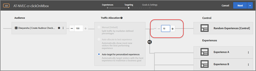
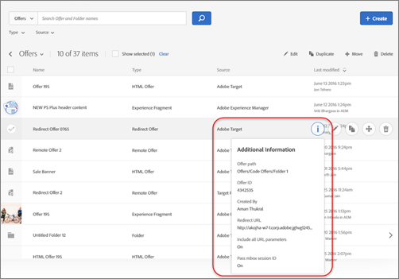

# Versionsinformation för tidigare versioner{#release-notes-for-previous-releases}

Versionsinformation för tidigare Target-versioner, inklusive versionsinformation för Target Standard/Premium, Target-plattformen och Target Javascript-biblioteket (at.js).

Versionsinformationen ordnas i fallande ordning efter månad och år då den släpptes.

>[!NOTE]
>
>Se [Versionsinformation för mål (aktuell)](/help/r-release-notes/release-notes.md#reference_8FE40B43A5A34DDF8F26A53D55EE036A) för information om den aktuella månadens Target-utgåvor (plattform och Target Standard/Premium).

## Versionsinformation - 2020

### Target Standard/Premium 20.9.1 (30 september 2020)

Den här underhållsversionen innehåller följande förbättringar, korrigeringar och ändringar:

* Förbättrad navigering och funktionalitet för användare som bara använder tangentbordet. (TGT-34487, TGT-34516, TGT-34517, TGT-34514)
* Etiketter har lagts till i användargränssnittet för att underlätta för användare som använder hjälpmedelstekniker. (TGT-34500, TGT-34501, TGT-34502, TGT-24504)
* Förbättrad text och färgkontrast för bilder och text i användargränssnittet. (TGT-34513)

### Target Standard/Premium 20.8.3 (15 september 2020)

| Funktion | Detaljer |
| --- | --- |
|  badgeAnalytics för Target-stöd (A4T) för Automatiskt mål-aktiviteter | [!UICONTROL Auto-Target] Nu har aktiviteter stöd för  [Analytics för Target](/help/c-integrating-target-with-mac/a4t/a4t.md).<br>Tack vare den här integreringen kan ni använda den  [!UICONTROL Auto-Target] unika maskininlärningsalgoritmen för att välja den bästa upplevelsen för varje besökare utifrån deras profil, beteende och sammanhang.<br>Om ni redan har  [implementerat A4](/help/c-integrating-target-with-mac/a4t/a4timplementation.md) Tfor för A/B Test och Experience Targeting är allt klart!<br>Mer information finns i  [Analytics for Target (A4T) support for Auto-Allocate and Auto-Target ](/help/c-integrating-target-with-mac/a4t/campaign-creation.md#a4t-aa) activity in  *Activity creation*. |

### Target Standard/Premium 20.8.2 (10 september 2020)

| Funktion | Detaljer |
| --- | --- |
|  badgeKontrollrekommendationer, platser inom villkorssekvenser | Med villkorssekvenser kan du nu styra antalet platser som tas upp av varje rekommendationsvillkor, vilket gör att du kan blanda och matcha olika typer av objekt eller olika algoritmlogik.<br>Mer information finns i  [Skapa ](/help/c-recommendations/c-algorithms/create-criteria-sequence.md#sequence) villkorssekvenser. |

### Target Standard/Premium 20.8.1 (2 september 2020)

Den här versionen innehåller följande förbättringar, korrigeringar och ändringar:

* Korrigerade ett problem som orsakade att fel visades när de nya [!UICONTROL Administration]-sidorna lästes in efter byte av organisationer. (TGT-37730)
* Korrigerade ett visningsproblem som gjorde att fel klientkod visades på sidan [!UICONTROL Administration > Implementation]. (TGT-37849)
* Korrigerade ett fel som ibland förhindrade användare från att använda redigeringsfunktionerna i [!UICONTROL Visual Experience Composer] (VEC) efter att ha läst in VEC. (TGT-37162)
* Korrigerade ett problem som förhindrade att sidor lästes in i VEC och Enhanced Experience Composer (EEC) trots att VEC Helper-tillägget installerades. Detta berodde på ändringar i Google Chrome 80+. Hämta det [uppdaterade VEC Helper-tillägget](/help/c-experiences/c-visual-experience-composer/r-troubleshoot-composer/issues-related-to-the-visual-experience-composer-vec-and-enhanced-experience-composer-eec.md). (TGT-37893)
* Korrigerade ett problem som ibland förhindrade användare från att hämta at.js från [!UICONTROL Administration > Implementation]-sidan efter att de bytt organisation. (TGT-37668)
* Nedladdningsknappen at.js är nu inaktiverad vid inläsning för att förhindra att [!DNL Target] skickar flera begäranden om användarna klickar på nedladdningsknappen flera gånger. (TGT-37633)
* Korrigerade ett problem i [!UICONTROL Experience Targeting]-aktiviteter (XT) som gjorde att upplevelser visade&quot;hämtningsresultat&quot; under en längre tid. (TGT-37684)
* Förbättrad navigering och funktionalitet för användare som bara använder tangentbordet. (TGT-34479 &amp; TGT-34473)
* Etiketter har lagts till i användargränssnittet för att underlätta för användare som använder hjälpmedelstekniker. (TGT-34480)
* Förbättrade felmeddelandet när en mobil visningsruta som används i en aktivitet tas bort. Felmeddelandet visas nu: &quot;Den här visningsrutan är för närvarande associerad med en eller flera aktiviteter. Du måste ta bort visningsrutan från dessa aktiviteter innan du kan ta bort den.&quot; (TGT-37030)
* Stöd har lagts till i VEC för klickspårning på en CSS-väljare som matchar mer än ett element på sidan. (TGT-37323)
* Ett problem som gjorde att vissa användare inte kunde visa listan [!UICONTROL Activity] har korrigerats. Följande felmeddelande visades: &quot;Det gick inte att hämta URL-förslag.&quot; Felet uppstod för användare som använder vagnreturer i FirstName (FirstName/r/n) i Adobe Backend-systemet. (TGT-37330)
* Ett problem som gjorde att användare inte kunde visa sidan [!UICONTROL Activity] har korrigerats om arbetsytans namn (som anges i [!UICONTROL Adobe Admin Console for Enterprise]) innehåller en apostrof. (TGT-37709)
* Korrigerade ett problem i [!UICONTROL Auto-Allocate]-aktiviteter när optimerings- och konverteringsmått valdes, där ett felmeddelande felaktigt informerade användarna om att de skulle välja en rapportserie, trots att en rapportserie redan hade angetts. (TGT-37689)
* Korrigerade ett problem som ibland orsakade att mått på [!UICONTROL Goals and Settings]-sidan var tomma efter att du navigerade till [!UICONTROL Targeting]-sidan och sedan tillbaka. (TGT-37691)
* Ett problem som orsakade ett felaktigt värde för [!DNL Recommendations]-villkor har korrigerats. (TGT-37666)
* Korrigerade ett problem som gjorde att mbox-ID:n visades i listrutan Mboxes i stället för i mbox-namn. (TGT-37739)

### .js 2.3.2 (24 juli 2020)

Den här versionen av at.js är en underhållsversion och innehåller följande korrigering:

* Korrigerade ett fel när ett skript eller en kod lägger till standardegenskap i fönstret eller dokumentet.

### Target Standard/Premium 20.7.1 (27 juli 2020)

Den här versionen innehåller följande ändringar:

#### [!UICONTROL Administration] gränssnittsuppdatering för avsnitt

Vi skriver gradvis om hela användargränssnittet i [!DNL Target] med en ny teknologi för att kunna erbjuda bättre prestanda, minska den underhållstid som krävs när nya funktioner släpps och för att förbättra användarupplevelsen i hela produkten. Det första avsnittet som uppdateras är [!UICONTROL Setup]-avsnittet som har fått ett nytt namn [!UICONTROL Administration].

Som en del av den här uppdateringen kan du enkelt utföra många åtgärder med hjälp av sidorna i [!UICONTROL Administration]-avsnittet, som:

* Hämta den senaste at.js-filen från fliken [!UICONTROL Implementation] (**[!UICONTROL Administration]** > **[!UICONTROL Implementation]**).
* Anpassa dina at.js-inställningar och granska enkelt dina ändringar (**[!UICONTROL Administration]** > **[!UICONTROL Implementation]**).
* Ändra utökade rapportinställningar, t.ex. standardvaluta och tidszon, IP-adresser som ska uteslutas från rapportering osv. (**[!UICONTROL Administration]** > **[!UICONTROL Reporting]**)
* Begränsa besökarens IP-adresser av sekretesskäl (**[!UICONTROL Administration]** > **[!UICONTROL Implementation]**)
* Visa den befintliga listan över användare per arbetsyta och deras roller innan du hanterar dem i Adobe Admin Console (**[!UICONTROL Administration]** > **[!UICONTROL Users]**).
* Sök och filtrera alla tabeller i [!UICONTROL Administration]-avsnittet.

Mer information finns i [Administrera målöversikt](/help/administrating-target/administrating-target.md).

#### Förbättringar, korrigeringar och ändringar

Den här versionen innehåller följande förbättringar, korrigeringar och ändringar:

* Ett problem som gjorde att platsinställningarna inte kunde behållas efter uppdateringen har åtgärdats. (TGT-37239)
* Korrigerade ett fel som gjorde att [!UICONTROL Insert After] > [!UICONTROL Image] inte kunde fungera korrekt med SVG-bilder (Scalable Vector Graphics). (TGT-37242)
* Ett problem har korrigerats för användare med rollen [!UICONTROL Publisher] som förhindrade att utkastaktiviteter togs bort. (TGT-37358)
* Ett problem som gjorde att användare inte kunde redigera en aktivitet när [!UICONTROL All My Workspaces] var markerat har åtgärdats. (TGT-37276)

### Target Standard/Premium 20.5.1 (17 juni 2020)

| Funktion/förbättring | Beskrivning |
| --- | --- |
| Analyser för Target-stöd (A4T) för [!UICONTROL Auto-Allocate]-aktiviteter | [!UICONTROL Auto-Allocate] Nu har aktiviteter stöd för  [Analytics för Target](/help/c-integrating-target-with-mac/a4t/a4t.md).<br>Tack vare den här integreringen kan ni använda de  [!UICONTROL Auto-Allocate] flerbeväpnade bandit-funktionerna för att driva trafik till vinnande upplevelser, samtidigt som ni använder  [!UICONTROL Adobe Analytics] målmätvärden och/eller  [!UICONTROL Adobe Analytics] rapporterings- och analysfunktioner.<br>Om ni redan har  [implementerat A4](/help/c-integrating-target-with-mac/a4t/a4timplementation.md) Tfor för A/B Test och Experience Targeting är allt klart!<br>Mer information finns i  [Analytics for Target (A4T) support for Auto-Allocate ](/help/c-integrating-target-with-mac/a4t/campaign-creation.md#a4t-aa) activity in  *Activity creation*. |
| Svarstoken för trafikallokeringsmetod för aktiviteter som Automatiskt mål och Automated Personalization | Två [svarstoken](/help/administrating-target/response-tokens.md) har lagts till i [!UICONTROL Auto-Target]- och [!UICONTROL Automated Personalization]-aktiviteter för att möjliggöra bestämning av om en besökare fick en viss upplevelse som ett resultat av att ha tilldelats till &quot;control&quot; eller till &quot;target&quot;-trafik.<ul><li>`experience.trafficAllocationId` returnerar 0 om en besökare har fått en upplevelse av att vara i&quot;kontrolltrafik&quot; och 1 om en besökare har fått en upplevelse av den&quot;riktade&quot; trafikfördelningen.</li><li>`experience.trafficAllocationType` returnerar &quot;control&quot; eller &quot;target&quot;.</li></ul>Mer information om kontroll kontra riktad trafik finns i [Välja kontroll för din Automated Personalization- eller Auto-Target-aktivitet](/help/c-activities/t-automated-personalization/experience-as-control.md). |
| [!UICONTROL Publisher] roll | Den nya rollen liknar den aktuella [!UICONTROL Observer]-rollen (kan visa aktiviteter, men kan inte skapa eller redigera dem). Rollen [!UICONTROL Publisher] har dock ytterligare behörighet att aktivera aktiviteter.<br>Mer information finns i: <ul><li>**Målanvändare**:  [Ange roller och ](/help/administrating-target/c-user-management/c-user-management/user-management.md#roles-permissions) behörigheter i  *Användare*.</li><li>**Användare** av Target Premium:  [Steg 6: Ange roller och ](/help/administrating-target/c-user-management/property-channel/properties-overview.md#section_8C425E43E5DD4111BBFC734A2B7ABC80) behörigheter i  *Konfigurera företagsbehörigheter*.</li></ul> |
| Stöd för A4T i [!DNL Analysis Workspace]<br>25 juni 2020 | [!UICONTROL Anaytics for Target] (A4T) stöds nu i  [!DNL Analysis Workspace]. Med [!UICONTROL Analytics for Target (A4T) panel] kan du analysera dina [!DNL Adobe Target]-aktiviteter och -upplevelser i [!DNL Analysis Workspace].<br>Mer information finns i  [Rapporter i ](/help/c-integrating-target-with-mac/a4t/reporting.md) AnalyticsIn  *A4T-* rapportering och  [Analytics for Target-](https://experienceleague.adobe.com/docs/analytics/analyze/analysis-workspace/panels/a4t-panel.html) panelen (A4T) i  *Analytics-verktygshandboken*. |

**Förbättringar, korrigeringar och ändringar**

* Korrigerade ett problem som gjorde att &quot;besökarmåttet&quot; lagrades i aktivitetens definition i stället för &quot;UniqueVisitors&quot;. (TGT-37098)
* Korrigerade ett fel i gränssnittet [!DNL Target] som gjorde att den lodräta rullningslisten inte fungerade korrekt på sidan [!UICONTROL Audiences]. (TGT-36968)

### Versioner av typen at.js 1.8.2 och at.js 2.3.1 (15 juni 2020)

Följande förbättringar och korrigeringar har gjorts i [!DNL Target] at.js-biblioteken:

| Funktion/förbättring | Beskrivning |
| --- | --- |
| at.js 1.8.2 | Den här versionen av at.js är en underhållsversion och innehåller följande korrigering:<ul><li>Korrigerade ett problem vid användning av CNAME och kantåsidosättning, at.js 1.*Serverdomänen kan* skapas felaktigt av xx, vilket resulterade i att  [!DNL Target] begäran misslyckades. (TNT-35064)</li></ul>Mer information finns i [versionsinformation för at.js](/help/c-implementing-target/c-implementing-target-for-client-side-web/target-atjs-versions.md). |
| at.js 2.3.1 | Den här versionen av at.js är en underhållsrelease och innehåller följande förbättringar och korrigeringar:<ul><li>Inställningen `deviceIdLifetime` kunde åsidosättas via [targetGlobalSettings](/help/c-implementing-target/c-implementing-target-for-client-side-web/targetgobalsettings.md). (TNT-36349)</li><li>Korrigerade ett problem vid användning av CNAME och kantåsidosättning, at.js 2.*Serverdomänen kan* skapas felaktigt av xx, vilket resulterade i att  [!DNL Target] begäran misslyckades. (TNT-35065)</li><li>Ett problem har korrigerats när tillägget [!DNL Target] [!DNL Launch] v2 och tillägget [!DNL Adobe Analytics] [!DNL Launch] användes, [!DNL Target] fördröjde [!DNL Analytics]-anropet. `sendBeacon` (TNT-36407, TNT-35990, TNT-36000)</li></ul>Mer information finns i [versionsinformation för at.js](/help/c-implementing-target/c-implementing-target-for-client-side-web/target-atjs-versions.md). |

### Ändringar i API:t för gruppstatus v2 (14 maj 2020)

I versionen från 20 maj returnerar status för profilgrupp endast feldata på radnivå som går framåt (data om lyckade åtgärder returneras inte). Misslyckade profil-ID:n returneras av API:t som fortsätter.

Föregående och nya API-svar är följande:

`ProfileBatchStatus Api
http://<<edge>>/m2/<<client>>/profile/batchStatus?batchId=<batchid>`

**För närvarande ser vi svaret som:**

```
<response>
 
    <batchId>samplebatch-1585929692655-59449976</batchId>
 
    <status>complete</status>
 
    <batchSize>164</batchSize>
 
    <profile>
 
        <id>1514187733806-729395</id>
 
        <status>success</status>
 
    </profile>
 
    <profile>
 
        <id>1573612762055-214017</id>
 
        <status>success</status>
 
    </profile>
 
    <profile>
 
        <id>some profile id</id>
 
        <status>failed</status>
 
    </profile>
 
</response>
```

**Efter 4 maj kommer svaret att vara:**

```
<response>
 
    <batchId>samplebatch-1585929692655-59449976</batchId>
 
    <status>complete</status>
 
    <batchSize>164</batchSize>
 
    <profile>
 
        <id>some profile id</id>
 
        <status>failed</status>
 
    </profile>
 
</response>
```

### Target Standard/Premium 20.4.1 (6 maj 2020)

Den här versionen innehåller följande förbättringar, korrigeringar och ändringar:

* Korrigerade ett problem som felaktigt kvalificerade en enhet och webbläsartyp för en målgrupp. (TGT-36266)
* Korrigerade ett problem som förhindrade rapportdata från att visas när de visades på skärmar som var mindre än 963 pixlar breda. (TGT-36549)
* Ett problem som orsakade att Automatisk personalisering inte kunde återges korrekt har åtgärdats. (TGT-36619)
* Ett problem har korrigerats som gjorde att inkompatibla mått kunde väljas i Automatisk allokering och Automatisk målaktiviteter som använder Analytics för mål (A4t). (TGT-36646)
* Korrigerade ett problem som gjorde att vissa alternativ i Visual Experience Composer (VEC) inte visades korrekt. (TGT-36571)
* Korrigerade ett fel i målgränssnittet som gjorde att andra Recommendations erbjuder förhandsgranskningar för att visa det redigerade innehållet efter att en användare har ersatt innehållet i en enda upplevelse. (TGT-36053 &amp; TGT-36894)
* Ett problem som gjorde att vissa användare inte kunde ta bort objekt från en Recommendations-katalog har korrigerats. (TGT-36455)
* Ett problem som gjorde att användare inte kunde spara Recommendations-villkor för en flersidig aktivitet har korrigerats. (TGT-36249)
* Korrigerade ett problem som gjorde att alternativknapparna för datakällan för beteendedata försvann när villkoret redigerades en andra gång i rad. (TGT-36796)
* Korrigerade ett visningsfel som gjorde att en Recommendations-algoritm visade &quot;hämtningsresultat&quot; under en längre period. (TGT-36550 &amp; TGT-36551)
* Uppdaterade många gränssnittssträngar som är lokaliserade på olika språk.

### Target at.js (25 mars 2020)

Följande nya versioner av JavaScript-biblioteken Target at.js är tillgängliga:

* at.js version 2.3.0
* at.js version 1.8.1

Mer information finns i [versionsinformation för at.js](/help/c-implementing-target/c-implementing-target-for-client-side-web/target-atjs-versions.md).

### Target Standard/Premium 20.2.1 (23 mars 2020)

Den här versionen innehåller följande förbättringar, korrigeringar och ändringar:

* Korrigerade ett problem som hindrade kunder från att välja en samling när de gjorde en katalogsökning. (TGT-36230)
* Korrigerade ett problem där ett villkor som skapats via API, men som inte refererats av en aktivitet som skapats i målgränssnittet, felaktigt kunde tas bort från gränssnittet. (TGT-35917)
* Implementerade säkerhetsförbättringar i Content Security Policy (CSP). (TGT-36190)
* Korrigerade ett problem som gjorde att &quot;NaN%&quot; visades när procentfältet för attributviktning flyttades längst till vänster. (TGT-36211)
* Löste lokaliseringsproblem så att gränssnittstext på olika språk visas korrekt.
* Vi har standardiserat listan med tillgängliga mätvärden från Adobe Analytics för Target-aktiviteter (A4T) genom att ta bort Adobe Analytics-statistik som inte stöds i den aktuella versionen av Adobe Analytics API:er. Detta gör att vi kan utöka vår A4T-support i framtida versioner av Adobe Target.

   Följande ändringar har gjorts:

   * &quot;Genomsnittlig tid spenderad på sidan&quot; har ersatts med &quot;Genomsnittlig tid spenderad på webbplatsen.&quot; Alla aktiviteter som använder detta som mått för det primära målmåttet kommer att ha &quot;Genomsnittlig tid spenderad på platsen&quot; (Obs! anges i minuter i stället för sekunder) väljs som primärt målmått nästa gång aktiviteten redigeras.
   * &quot;Besökare&quot; har ersatts med &quot;unika besökare&quot;. Alla aktiviteter som använder det här måttet som primärt målmått kommer att ha &quot;Unika besökare&quot; valt som primärt målmått nästa gång aktiviteten redigeras.

* Följande mått har tagits bort och kan inte längre väljas som primärt målmått när en ny A4T-aktivitet skapas.

   | Inaktuella mått | Föreslagna ersättningsmått |
   |--- |--- |
   | Dagliga besökare, timbesökare, månatliga besökare, kvartalsbesök, veckobesökare och årsbesök | Unika besökare |
   | Genomsnittligt besöksdjup | Ej tillämpligt. Ej rekommenderat som primärt målmått |
   | Bots | Ej tillämpligt. Ej rekommenderat som primärt målmått |
   | Kraschfrekvens för mobiler, genomsnittlig tidigare sessionslängd för mobilappar, genomsnittlig rankning för mobilappsbutik, kraschfrekvens för mobilappsprestanda, genomsnittlig klassificering för mobilappsbutik | Ej tillämpligt. Ej rekommenderat som primärt målmått |

### Adobe Experience Cloud navigering (22 februari 2019)

* När du loggar in på [!DNL Adobe Experience Cloud] dirigeras du till den nya rubriknavigeringen. Den ser ut ungefär som den tidigare navigeringen med det svarta fältet högst upp, men har följande förbättringar:

   * Enklare att växla mellan [!DNL Identity Management System]-organisationer (IMS) eller till en annan lösning.
   * Förbättrad användarhjälp: Sökresultaten inkluderar resultat från [!DNL Target]-produktdokumentationen, liksom communityforum och mer videoinnehåll, vilket ger dig enklare åtkomst till mer innehåll och hjälper dig att få ut så mycket som möjligt av [!DNL Target]. Vi har också lagt till en funktion för feedback direkt på [!UICONTROL Help]-menyn, vilket gör det enklare att rapportera problem eller dela med dig av dina idéer.

   * Förbättrad feedback för NPS (Net Promoter Score) så att undersökningen inte stör arbetsflödet.
   * Förbättrat inloggningsflöde. Tidigare landade alla [!DNL Target]-kunder på landningssidan för mål efter att ha klickat på ikonen [!DNL Target] i huvudet. Den här sidan tillåter sedan kunder att fortsätta med [!DNL Target Standard/Premium], [!DNL Search&Promote] eller [!DNL Recommendations Classic], enligt nedan:

      

      Vi eliminerade den här landningssidan för alla våra kunder. Du dirigeras nu alltid direkt till sidan [!UICONTROL Activities List] genom att klicka på ikonen [!DNL Target] i det nya sidhuvudsnavigeringsfältet.

      Om du använder [!DNL Recommendations Classic] kan du antingen gå direkt till lösningen eller gå från den korta länken som skapas på fliken [!UICONTROL Recommendations], vilket visas nedan:

      

      Om du använder [!DNL Search&Promote] måste du gå direkt till [Search &amp; Promote-URL](https://center.atomz.com/center/?ims=1) (https://center.atomz.com/center/?ims=1). Sökvägen till [!DNL Search&Promote] från insidan av [!DNL Adobe Target] har tagits bort helt.

   * Meddelanden för [!DNL Target] är för närvarande inte tillgängliga i listrutan [!UICONTROL Notifications] i huvudet.
   >[!NOTE]
   >
   >Som en del av utrullningen av det nya navigeringsfältet kommer du även att märka vissa URL-ändringar. Alla tidigare länkar med bokmärken fortsätter att fungera, men vi rekommenderar att du bokmärker nya länkar för snabbare öppning.

### Target Standard/Premium 20.1.1 (4 februari 2020)

Target Standard/Premium 20.1.1 är en underhållsrelease som innehåller backend-förbättringar och förbättringar. Dessutom ingår följande korrigeringar:

* Korrigerade ett problem som gjorde att fältet för Adobe Analytics-spårningsservern var tomt på sidan Mål och inställningar för befintliga Adobe for Target-aktiviteter (A4T). (TGT-35960)
* Korrigerade ett problem i användargränssnittet som gjorde att ditt val i den andra listrutan inte visades när en målgrupp skapades för kategoritillhörighet. (TGT-36098)

## Versionsinformation - 2019 {#releases-2019}

### Java SDK version 1.1.0 (16 december 2019)

* Stöd för proxykonfiguration har lagts till på grund av ett öppen källkodsbidrag från @hisham-hassan.

### Java SDK version 1.0.1 (11 november 2019)

Följande problem har åtgärdats i version 1.0.1:

* Skicka ytterligare data-ID i en Target-begäran även när det inte finns någon Visitor API-cookie.

### Målplattform (31 oktober 2019)

| Funktion/förbättring | Beskrivning |
| --- | --- |
| Java SDK | Med Java SDK [!DNL Target] kan du distribuera [!DNL Target] på serversidan. Denna Java SDK hjälper dig att enkelt integrera [!DNL Target] med andra [!DNL Adobe Experience Cloud]-lösningar, som [!DNL Adobe Experience Cloud Identity Service], [!DNL Adobe Analytics] och [!DNL Adobe Audience Manager].<br>Java SDK introducerar bästa praxis och eliminerar komplexitet när det integreras med  [!DNL Target] via vårt API så att era tekniker kan fokusera på affärslogik. Följande är viktiga funktioner som vi introducerar i den senaste versionen:<ul><li>Stöd för förhämtning och meddelanden som gör att du kan optimera prestanda via cachning.</li><li>Stöd för optimering av prestanda när du har en hybridintegrering av [!DNL Target] på både dina webbsidor och på serversidan. Vi introducerar en inställning med namnet `serverState` som fylls i av upplevelser som hämtats via servern så att at.js 2.2 inte längre gör ett ytterligare serveranrop för att hämta upplevelserna. Med den här metoden optimeras sidans laddningsprestanda.</li><li>Stöd för hämtning av VEC-skapade aktiviteter via Java SDK, vilket blir möjligt med det nya leverans-API:t.</li><li>Öppen källkod så att utvecklarna kan bidra till [mål-Java SDK](https://github.com/adobe/target-java-sdk).</li></ul>Läs mer om Target Java SDK i Adobe Tech Blog - [Serversidesoptimering med nya Target Java SDK](https://medium.com/adobetech/server-side-optimization-with-the-new-target-java-sdk-421dc418a3f2). |

### Target Standard/Premium 19.10.2 (31 oktober 2019)

| Funktion/förbättring | Beskrivning |
| --- | --- |
|  badgeMulti-value-attribut | Ibland vill du arbeta med ett fält med flera värden. Titta på följande exempel:<ul><li>Du erbjuder filmer till användare. En viss film har flera skådespelare.</li><li>Du säljer biljetter till konserter. En viss användare har flera favoritband.</li><li>Du säljer kläder. En skjorta finns i flera storlekar.</li></ul>Om du vill hantera rekommendationer i de här scenarierna kan du skicka data med flera värden till Target Recommendations och använda särskilda operatorer med flera värden.<br>Mer information finns i  [Arbeta med attribut](/help/c-recommendations/c-algorithms/work-with-multi-value-attributes.md) med flera värden. |

### Target Standard/Premium 19.10.1 (22 oktober 2019)

| Funktion/förbättring | Beskrivning |
| --- | --- |
|  badgeAnvändarbaserad Recommendations<br> (24 oktober 2019) | Rekommenderar objekt baserat på besökarens webbläsarhistorik, visning och inköp. De här objekten kallas vanligtvis&quot;Rekommenderas för dig&quot;.<br>Med dessa kriterier kan ni leverera personaliserat innehåll och personaliserade upplevelser till både nya och återkommande besökare. Listan med rekommendationer vägs mot besökarens senaste aktivitet och uppdateras under sessionen och blir mer personlig när besökaren surfar på webbplatsen.<br>Mer information finns i&quot;Användarbaserad Recommendations&quot; i  [Villkor/algoritmer](/help/c-recommendations/c-algorithms/algorithms.md#criteria-algorithms). |

**Adobe Experience Cloud navigering**

* När du loggar in på [!DNL Adobe Experience Cloud] dirigeras du till den nya rubriknavigeringen. Den ser ut ungefär som den tidigare navigeringen med det svarta fältet högst upp, men har följande förbättringar:

   * Enklare att växla mellan [!DNL Identity Management System]-organisationer (IMS) eller till en annan lösning.
   * Förbättrad användarhjälp: Sökresultaten inkluderar resultat från [!DNL Target]-produktdokumentationen, liksom communityforum och mer videoinnehåll, vilket ger dig enklare åtkomst till mer innehåll och hjälper dig att få ut så mycket som möjligt av [!DNL Target]. Vi har också lagt till en funktion för feedback direkt på [!UICONTROL Help]-menyn, vilket gör det enklare att rapportera problem eller dela med dig av dina idéer.

   * Förbättrad feedback för NPS (Net Promoter Score) så att undersökningen inte stör arbetsflödet.
   * Förbättrat inloggningsflöde. Tidigare landade alla [!DNL Target]-kunder på landningssidan för mål efter att ha klickat på ikonen [!DNL Target] i huvudet. Den här sidan tillåter sedan kunder att fortsätta med [!DNL Target Standard/Premium], [!DNL Search&Promote] eller [!DNL Recommendations Classic], enligt nedan:

      

      Vi eliminerade den här landningssidan för alla våra kunder. Du dirigeras nu alltid direkt till sidan [!UICONTROL Activities List] genom att klicka på ikonen [!DNL Target] i det nya sidhuvudsnavigeringsfältet.

      Om du använder [!DNL Recommendations Classic] kan du antingen gå direkt till lösningen eller gå från den korta länken som skapas på fliken [!UICONTROL Recommendations], vilket visas nedan:

      

      Om du använder [!DNL Search&Promote] måste du gå direkt till [Search &amp; Promote-URL](https://center.atomz.com/center/?ims=1) (https://center.atomz.com/center/?ims=1). Sökvägen till [!DNL Search&Promote] från insidan av [!DNL Adobe Target] har tagits bort helt.

   * Meddelanden för [!DNL Target] är för närvarande inte tillgängliga i listrutan [!UICONTROL Notifications] i huvudet.
   >[!NOTE]
   >
   >De här funktionerna kommer inte att lanseras samtidigt och kommer inte heller att lanseras för alla kunder tillsammans. Vi kommer att lansera de här funktionerna under de närmaste veckorna, med början i [!DNL Target Standard/Premium] 19.10.1 (22 oktober 2019)-versionen.
   >
   >Som en del av utrullningen av det nya navigeringsfältet kommer du även att märka vissa URL-ändringar. Alla tidigare länkar med bokmärken fortsätter att fungera, men vi rekommenderar att du bokmärker nya länkar för snabbare öppning.

### at.js version 2.2 och 1.8 (10 oktober 2019)

| Funktion/förbättring | Beskrivning |
| --- | --- |
| at.js version 2.2<br>och<br>at.js version 1.8 | Dessa versioner av at.js innehåller:<ul><li>Förbättrade prestanda när du använder både Experience Cloud ID Service (ECID) v4.4 och at.js 2.2 eller at.js 1.8 på dina webbsidor.</li><li>Tidigare gjorde ECID två blockerande anrop innan at.js kunde hämta upplevelser. Detta har reducerats till ett enda samtal, vilket avsevärt förbättrar prestandan.</li></ul> För att kunna utnyttja dessa prestandaförbättringar ska du uppgradera till at.js 2.2 eller at.js 1.8 tillsammans med ECID Library v4.4.<br>at.js 2.2 innehåller:<ul><li>**serverState**: En inställning som är tillgänglig i at.js v2.2+ som kan användas för att optimera sidprestanda när en hybridintegrering av Target implementeras. Hybrid-integrering innebär att du använder både at.js v2.2+ på klientsidan och leverans-API:t eller en Target SDK på serversidan för att leverera upplevelser. `serverState` ger at.js v2.2+ möjlighet att tillämpa upplevelser direkt från innehåll som hämtas på serversidan och returneras till klienten som en del av den sida som skickas.<br>Mer information finns i&quot;serverState&quot; i  [targetGlobalSettings](/help/c-implementing-target/c-implementing-target-for-client-side-web/targetgobalsettings.md#server-state).</li></ul> |

### Målplattform (9 oktober 2019)

| Funktion/förbättring | Beskrivning |
| --- | --- |
| Node.js SDK version 1.0 | Med Target Node.js SDK kan du distribuera på målservern.<br>Denna Node.js SDK hjälper dig att enkelt integrera Target med andra Experience Cloud-lösningar, som Adobe Experience Cloud Identity Service, Adobe Analytics och Adobe Audience Manager.<br>Node.js SDK introducerar bästa praxis och eliminerar komplexitet när du integrerar med Adobe Target via vårt API så att dina tekniker kan fokusera på affärslogik. Följande är viktiga funktioner som vi introducerar i den senaste versionen:<ul><li>Stöd för förhämtning och meddelanden som gör att du kan optimera prestanda via cachning.</li><li>Stöd för optimering av prestanda när du har en hybridintegrering av Target på både dina webbsidor och på serversidan. Vi introducerar en inställning med namnet `serverState` som fylls i av upplevelser som hämtats via servern så att at.js 2.2 inte längre gör ett ytterligare serveranrop för att hämta upplevelserna. Med den här metoden optimeras sidans laddningsprestanda.</li><li> Stöd för hämtning av VEC-skapade aktiviteter via Node.js SDK, som blir möjligt med det nya Delivery API.</li><li>Open sourced så att utvecklarna kan bidra till Node.js SDK.</li></ul> |
| Leverans-API | En helt ny leverans-API-slutpunkt (/v1/delivery) är tillgänglig i produktionen. Betydelbara funktioner är:<ul><li>En slutpunkt för att hämta upplevelser för en eller flera kryssrutor.</li><li>Hämta VEC-skapade aktiviteter via API:t.</li><li>Stöd för ett helt nytt objekt, Vyer, som används för Single Page-program (SPA) och Mobile-program.</li></ul> |

### Target Standard/Premium 19.9.2 (30 september 2019)

Den här underhållsversionen innehåller följande förbättringar:

* Flera säkerhetskorrigeringar, bland annat en säkerhetsuppdatering av RTF-redigeraren i Visual Experience Composer (VEC). (TGT-35383)
* Recommendations-erbjudanden kan nu läggas till i andra element än DIV (t.ex. P, UL, H1), utöver DIV, i A/B Test- och Experience Targeting-aktiviteter. (TGT-34333)
* Händelsemeddelanden (klockikonen i målgränssnittet) är inte längre tillgängliga. Ett nytt sätt att se på meddelanden kommer snart.

### Target Standard/Premium 19.9.1 (10 september 2019)

| Funktion/förbättring | Beskrivning |
| --- | --- |
|  badgeEnterprise Permissions | Med Target från september 2019 får kunder med Enterprise Permissions följande åtkomstkontroller:<UL><li>Du kan välja vilka arbetsytor som integreringen kan användas på.</li><li>Du kan använda en roll för Adobe I/O-integreringen: Godkännare, redigerare eller observatör.</li></ul>Stegvisa instruktioner och mer information finns i [Bevilja Adobe I/O-integreringar åtkomst till arbetsytor och tilldela roller](/help/administrating-target/c-user-management/property-channel/configure-adobe-io-integration.md). |

### Target Standard/Premium 19.7.1 (24 juli 2019) {#tgt-19-7-1}

Den här versionen innehåller följande nya funktioner och förbättringar:

(Numren inom parentes är avsedda för Adobe.)

| Funktion/förbättring | Beskrivning |
| --- | --- |
| <br>badgeRekommendationer för A/B-tester och XT-aktiviteter (Experience Targeting) | Statusen för Recommendations-erbjudandet (algoritm) visas på sidan Översikt för A/B Test- och XT-aktiviteter som innehåller Recommendations-erbjudanden. Statusen är: Resultatförberedda, resultaten är inte klara och matningsfel. (TGT-33649)<br>Se [Recommendations som ett erbjudande](/help/c-recommendations/recommendations-as-an-offer.md#status). |
| Spårning mellan domäner för at.js 2.0+ via ECID-biblioteket (Experience Cloud ID) | Tidigare stöds inte spårning mellan domäner i at.js 2.*x*. I den här versionen kan kunder som använder at.js 2.0 eller senare nu använda domänövergripande spårning via ECID-biblioteket. ECID-biblioteket måste installeras på sidan tillsammans med at.js 2.0 eller senare för att spårning mellan domäner ska fungera. [Experience Cloud ID-bibliotek 4.3.0+](https://experienceleague.adobe.com/docs/id-service/using/release-notes/release-notes.html) måste användas.<br>Se Stöd för spårning  [mellan domäner i at.js 2.x](/help/c-implementing-target/c-implementing-target-for-client-side-web/upgrading-from-atjs-1x-to-atjs-20.md#cross-domain). |
| Stöd för Apples ITP 2.1 och ITP 2.2 via Experience Cloud ID-biblioteket 4.3 | Idag kan Target-kunder minska Apples ITP 2.1 och ITP 2.2 genom att utnyttja Adobe’s CNAME-certifieringsprogram.<br>I den här versionen introducerar Target en smidig integrering med ECID-biblioteket 4.3, som utnyttjar en cookie på serversidan för att minska risken för ITP 2.1 och ITP 2.2. Vi rekommenderar starkt att Target-kunder driftsätter  [ECID-bibliotek 4.3+](https://experienceleague.adobe.com/docs/id-service/using/release-notes/release-notes.html) i kombination med Target JavaScript-bibliotek för att minska risken för framtida ITP-releaser. ECID-biblioteket kommer att fortsätta att innehålla förbättringar som ger en stabil lösning på de ständigt föränderliga cookie-profiler som webbläsarna inför.<br>Se  [Apple Intelligent Tracking Prevention (ITP) 2.x](/help/c-implementing-target/c-considerations-before-you-implement-target/c-privacy/apple-itp-2x.md). |

**Förbättring, korrigeringar och ändringar**

* Korrigerade ett problem som förhindrade att exkluderingsvärden i Recommendations-aktiviteter rensades när dubblettvärden lades till. (TGT-34996)
* Du kan nu ta bort en design i en Recommendations-aktivitet från målsidan (steg 2 i det guidade arbetsflödet i tre delar). Observera att om du vill ta bort en symbol måste du markera flera. (TGT-35118)
* Korrigerade ett problem som förhindrade att anpassade kriteriekort lästes in korrekt i Target-gränssnittet eller kunde redigeras. (TGT-35170)

### at.js version 2.1.1 (24 juli 2019)

Den här versionen av at.js är en underhållsrelease och innehåller följande förbättringar och korrigeringar:

(Numren inom parentes är avsedda för Adobe.)

* Korrigerade ett problem som gjorde att flera fyrar stacks när användaren använde metoden för klickspårning på sidan Mål och inställningar i Visual Experience Composer (VEC). (TNT-32812)
* Korrigerade ett problem som gjorde att `triggerView()` inte återgav erbjudanden mer än en gång. (TNT-32780)
* Korrigerade ett problem med `triggerView()` för att säkerställa att begäran innehåller Marketing Cloud ID-information (MCID). (TNT-32776)
* Korrigerade ett problem som förhindrade `triggerView()`-meddelandet att utlösas även om det inte finns några sparade vyer. (TNT-32614)
* Korrigerade ett problem som orsakade ett fel på grund av användningen av decodeURIcomponent som orsakade problem när URL:en innehåller en felformaterad frågesträngsparameter. (TNT-32710)
* Beacon-flaggan är nu inställd på &quot;true&quot; när leveransbegäranden skickas via API:t `Navigator.sendBeacon()`. (TNT-32683)
* Korrigerade ett problem som hindrade Recommendations erbjudanden från att visas på webbplatser för ett fåtal kunder. Kunderna kunde se erbjudandeinnehållet i API-anropet, men erbjudandet tillämpades inte på webbplatsen. (TNT-32680)
* Korrigerade ett problem som gjorde att klickspårning över flera upplevelser inte fungerade som förväntat. (TNT-32644)
* Korrigerade ett problem som förhindrade at at at.js från att använda det andra måttet efter att återgivningen av det första måttet misslyckades. (TNT-32628)
* Korrigerade ett problem när `mboxThirdPartyId` skickades med funktionen `targetPageParams` som gjorde att nyttolasten för begäran inte fanns i frågeparametrarna eller i nyttolasten för begäran. (TNT-32613)
* Korrigerade ett problem som gjorde att visnings- och klickmeddelanderesvar blockerades i Chromium-baserade webbläsare (inklusive Google Chrome). (TNT-32290)

Mer information om detta och tidigare versioner av at.js finns i [at.js versionsinformation](/help/c-implementing-target/c-implementing-target-for-client-side-web/target-atjs-versions.md).

### Målstandard/Premium 19.6.1 (26 juni 2019) {#tgt-19-6-1-historical}

Den här versionen innehåller följande nya funktioner och förbättringar:

(Numren inom parentes är avsedda för Adobe.)

| Funktion/förbättring | Beskrivning |
| --- | --- |
| Visual Experience Composer (VEC) | **Nya alternativ** på menyn VEC: När du klickar på ett sidelement i VEC visar en meny de alternativ som är tillgängliga för den elementtypen.<ul><li>Du kan nu använda alternativet [!UICONTROL Styles > Background] för att ändra bakgrundsbilden och färgen för det valda elementet. (TGT-15001)</li></ul>Se *Format* i [Alternativ för visuell upplevelse](/help/c-experiences/c-visual-experience-composer/viztarget-options.md#styles).<br>**Förbättrad** klickspårning: Vi har förbättrat processen för att konfigurera klickspårning i VEC och Single Page Application (SPA) VEC.<ul><li>När du markerar element som ska användas i klickspårning visas namnen på alla tillgängliga element på panelen Ändringar till höger, vilket gör det snabbt och enkelt att markera de önskade elementen.</li><li>På sidan [!UICONTROL Goals & Settings] i det guidade arbetsflödet för tre delar visas ett tal som representerar antalet element som valts för klickspårning. Du kan hålla muspekaren över det här talet för att se namnen på alla markerade element. (TGT-33878)</li></ul>Se [Klickspårning](/help/c-activities/r-success-metrics/click-tracking.md). |
| Visual Experience Composer (SPA VEC) för en sida | **Guidat arbetsflöde**: Ett nytt guidat arbetsflöde hjälper dig att förstå hur inställningar för sidleverans ska konfigureras för att köra och köra en aktivitet för din Single Page-app. (TGT-33718)<br> Se [Single Page App (SPA) Visual Experience Composer](/help/c-experiences/spa-visual-experience-composer.md#page-delivery-settings).<br>**Klonändringar**: Du kan nu definiera en ändring med SPA VEC och sedan klona ändringen för användning i andra vyer i Single Page App. (TGT-33882)<br>Se [Single Page App (SPA) Visual Experience Composer](/help/c-experiences/spa-visual-experience-composer.md). |
|  badgeAutomated Personalization (AP) &amp; Auto-Target | **Specifik upplevelse som kontroll**: Du kan välja en upplevelse som ska användas som kontroll när du skapar en AP- eller Auto-Target-aktivitet. Med den här funktionen kan du dirigera hela kontrolltrafiken till en viss upplevelse, baserat på den procentandel av trafikallokeringen som har konfigurerats i aktiviteten. Sedan kan ni utvärdera prestandarapparna för den personaliserade trafiken mot kontrolltrafiken till den upplevelsen. Det nuvarande kontrollalternativet (slumpmässigt hanterade upplevelser) är fortfarande tillgängligt. (TGT-32801, TGT-26572 och TGT-26571)<br>Se [Markera kontrollen för din Automated Personalization- eller Automatisk målaktivitet](/help/c-activities/t-automated-personalization/experience-as-control.md). Observera att det finns ett [känt fel](/help/r-release-notes/known-issues-resolved-issues.md) med den här funktionen.<br>**Insikter om personalisering - rapporter**: Den marknadsföringsvänliga namngivningen för attribut när en besökare ser en viss del av innehållet på en viss plats ger mer meningsfull information. (TGT-33421 &amp; TGT-34957)<br>Se [Datainsamling för målpersonaliseringsalgoritmerna](/help/c-activities/t-automated-personalization/ap-data.md). |
|  badgeRekommendationer | Du kan använda reglaget Rekommendera tidigare inköpta artiklar när du skapar logiken för nyligen visade objekt. (TGT-34030)<br>Mer information finns i [Nyligen visade objekt](/help/c-recommendations/c-algorithms/create-new-algorithm.md#previously-purchased) i&quot;Skapa villkor&quot;. |
| Google Chrome SameSite cookie-principer | Google meddelade nyligen att från och med Chrome 76, som är tilldelad till 30 juli 2019, måste utvecklare uttryckligen ange vilka cookies som kan användas på olika webbplatser och vilka cookies som kan spåra användare.<br>I takt med att branschen strävar efter att skapa en säkrare webbsajt för konsumenterna är Target helt engagerat i att leverera personaliserade upplevelser och samtidigt uppfylla och överträffa besökarnas förväntningar på integritetsskydd.<br>Se  [Google Chrome-cookie-principer](/help/c-implementing-target/c-considerations-before-you-implement-target/c-privacy/google-chrome-samesite-cookie-policies.md) för samma webbplats. |

### at.js version 2.1.0 (3 juni 2019) {#atjs-210}

Vi är stolta över att kunna meddela följande spännande funktioner i at.js 2.1.0:

| Funktion/förbättring | Beskrivning |
| --- | --- |
| Stöd för Adobe-deltagande | Adobe Opt-In är ett sätt att förenkla integreringen av Adobe-lösningar med plattformar för samtyckeshantering.<br>Mer information om Adobe deltagande finns i  [Sekretess och allmänna dataskyddsförordningen (GDPR)](/help/c-implementing-target/c-considerations-before-you-implement-target/c-privacy/cmp-privacy-and-general-data-protection-regulation.md). |
| CSP enligt branschstandard | at.js använder inte längre eval() för att köra JavaScript. |
| Loggning av analys på klientsidan | Ger kunderna full kontroll över hur de vill skicka analysdata till Adobe Analytics, oavsett om det gäller klient- eller serversidan.<br>Mer information finns i  [Logga in ](/help/c-integrating-target-with-mac/a4t/before-implement.md#client-side) med kundanalys  *innan du implementerar*. |
| Skicka meddelanden | Tillåter utvecklare att skicka meddelanden när en upplevelse återges av koden i stället för att använda `applyOffer()` eller `applyOffers()`.<br>Mer information finns i  [adobe.target.sendNotifications(options)](/help/c-implementing-target/c-implementing-target-for-client-side-web/adobe.target.sendnotifications-atjs-21.md). |
| Minskad filstorlek | Storleken på at.js reduceras med cirka 24 %. Den mindre filstorleken förbättrar sidans inläsningsprestanda och minskar tiden för att ladda ned at.js på sidan. |
| at.js dokumentationsuppdateringar | En fullständig lista över alla artiklar som har uppdaterats på grund av version at.js 2.1.0 finns i posterna 3 juni 2019 i [Dokumentationsändringar](/help/r-release-notes/doc-change.md). |

### [!DNL Target] Standard/Premium 19.5.1 (21 maj 2019)  {#tgt-19-5-1-historical}

(Numren inom parentes är avsedda för intern [!DNL Adobe]-användning.)

#### Funktionsuppdateringar

| Funktion/förbättring | Beskrivning |
| --- | --- |
| Visual Experience Composer (SPA VEC) för en sida | SPA VEC innehåller följande förbättringar som gör arbetet snabbare och effektivare:<ul><li>Om du klickar på en åtgärd i SPA markeras elementet på platsen där den här åtgärden ska tillämpas. Varje VEC-åtgärd som skapas under en vy har fyra motsvarande ikoner: Information, Redigera, Flytta och Ta bort. Med den nya funktionen &quot;Flytta&quot; i den här versionen kan du flytta åtgärden till en sidinläsningshändelse eller någon annan vy som redan finns på panelen Ändringar. (TGT-33746)</li><li>Du kan utföra många åtgärder innan sidan läses in i VEC, eller även om sidan inte läses in helt (t.ex. om anpassad kod inte längre fungerar). Åtgärder som inte kan redigeras innan webbplatsen läses in inaktiveras i målgränssnittet. (TGT-33851 &amp; TGT-34149)</li></ul>Mer information finns i [Single Page App (SPA) Visual Experience Composer](/help/c-experiences/spa-visual-experience-composer.md). |

#### Förbättring, korrigeringar och ändringar

* Verktygsfältsikonerna visas korrekt när du avbryter inläsningen av en sida i VEC. Om specifika åtgärder inte kan utföras förrän sidan har lästs in helt inaktiveras de associerade verktygsfältsikonerna. (TGT-33811)

### [!DNL Target] Standard/Premium 19.4.2 (30 april 2019)  {#release-19-4-2}

Den här versionen innehåller följande funktioner, ändringar och förbättringar:

(Numren inom parentes är avsedda för intern [!DNL Adobe]-användning.)

#### Funktionsuppdateringar

| Funktion/förbättring | Beskrivning |
| --- | --- |
| [!UICONTROL Visual Experience Composer] | [!UICONTROL Visual Experience Composer] (VEC) innehåller följande förbättringar som gör ditt arbete snabbare och effektivare:<ul><li>DOM-sökvägsfunktionen är nu tillgänglig när du ställer in klickspårning.<br>Mer information finns i  [Klickspårning](/help/c-activities/r-success-metrics/click-tracking.md#considerations).</li><li>Använd formatpanelen om du vill visa eller redigera värdet för befintliga format för det markerade elementet. Du kan också lägga till ytterligare format.<br>Du öppnar formatpanelen genom att klicka på ett sidelement i VEC och sedan klicka på  [!UICONTROL Edit] >  [!UICONTROL Styles].<br>Panelen Format visas till höger om VEC. Panelen innehåller en lista med format som du kan använda för att redigera eller lägga till i det markerade elementet. Med en CSS-redigerare i realtid kan du visa ändringar och lägga till format om du känner dig bekväm med att använda CSS (Cascading Style Sheets) eller om du tar emot kod från utvecklaren.<br>Mer information finns i  [](/help/c-experiences/c-visual-experience-composer/viztarget-options.md#styles) Format i Alternativ för  *visuell Experience Composer*.</li><li>RTF-redigeraren har nu stöd för kapslade HTML5-element.<br>HTML5-specifikationer tillåter nya kombinationer av taggar för kapsling. Den tidigare versionen av RTF-redigeraren hade inte stöd för ny kapsling av taggar enligt HTML5-specifikationen. Därför hanterades inte kapslade element som valdes i VEC korrekt, vilket ledde till oönskade HTML-ändringar. (TGT-33618)<br>Mer information finns i [Redigera text/HTML](/help/c-experiences/c-visual-experience-composer/viztarget-options.md#edit-text-html) i *Alternativ för Visual Experience Composer*.</li> |

#### Förbättring, korrigeringar och ändringar

* Vi förbättrade arbetsflödet när du tog bort resurser med VEC. Borttagna resurser tas nu bort från [!UICONTROL Offers library] och från [!DNL Scene7] (om tillämpligt). Borttagna resurser visas inte längre i sökresultaten. (TGT-31981)
* Du kan nu ta bort resursmappar även om de innehåller bilder (mappar som inte är tomma). (TGT-33265)

   Tidigare gick det inte att ta bort en mapp som inte är tom från målbildens bibliotek ([!UICONTROL Offers] > [!UICONTROL Image Offers]). Du får då ett meddelande om att mappen inte är tom. när du försöker ta bort mappen från användargränssnittet.  Med den här funktionen lägger vi till en funktion som gör att du kan ta bort en hel mapp som innehåller valfritt antal resurser och undermappar. Den här funktionen är tillgänglig i målgränssnittet och i användargränssnittet för Adobe Experience Cloud Assets.

   * Mappar som inte är tomma i bilderbjudandebiblioteket kan tas bort. Om inga referenser finns till alla bilder i mappen i någon aktivitet tas hela mappen och dess innehåll bort. Om det finns referenser till vissa bilder i mappen i någon aktivitet, tas alla bilder som inte refereras bort, men refererade bilder och mappar som innehåller dessa bilder behålls.
   * Rendering av bildeerbjudanden i Image Asset-väljaren går snabbare och effektivare.

   Mer information finns i [Arbeta med innehåll i biblioteket](/help/c-experiences/c-manage-content/assets-working.md). (TGT-32897)

* Vi förbättrade återgivningen av bilderbjudandena i Assets-väljaren. Nu går det snabbare och effektivare att visa och välja ut bilderbjudanden. (TGT-32897)
* Vi förbättrade hanteringen av omdirigeringar till URL:er när du avbryter inläsningen av en sida i VEC. (TGT-33815)
* När du har valt en [!UICONTROL Recommendations]-samling i samlingsväljaren måste du nu klicka på knappen [!UICONTROL Save]. Det här arbetsflödet är förenligt med andra arbetsflöden i [!DNL Target]. (TGT-33205)
* Korrigerade ett problem som fick en liten uppsättning Insights-rapporter att returnera 0 % konverteringsgrader istället för de faktiska konverteringsnivåerna. (TNT-32125)

### [!DNL Target] Standard/Premium 19.4.1 (15 april 2019)  {#release-19-4-1}

Den här versionen är en underhållsrelease och innehåller följande ändring:

(Numren inom parentes är avsedda för intern [!DNL Adobe]-användning.)

* Användargränssnittet [!DNL Adobe Experience Cloud] har uppdaterats för att återspegla varumärkes- och produktändringar. (TGT-33546, TGT-33272 och TGT-3331)

#### [!DNL Target] Standard/Premium 19.3.1 (29 mars 2019)  {#release-19-3-1}

Den här versionen innehåller följande funktioner, ändringar och förbättringar:

(Numren inom parentes är avsedda för intern [!DNL Adobe]-användning.)

| Funktion/förbättring | Beskrivning |
| --- | --- |
| Visual Experience Composer | Visual Experience Composer (VEC) innehåller följande förbättringar som gör arbetet snabbare och effektivare:<ul><li>Du kan nu avbryta inläsningen av en webbplats i VEC för att ta bort blockeringen för redigering av en aktivitet. Den här förbättringen är användbar om du t.ex. vill göra en liten redigering av aktiviteten, granska dess inställningar eller lägga till anpassad kod och du inte vill vänta på att webbplatsen ska läsas in. (TGT-31288)<br>Se [Avbryt inläsning av en sida i VEC](/help/c-experiences/c-visual-experience-composer/visual-experience-composer.md#cancel-loading).</li><li>Du kan utföra många åtgärder innan sidan läses in i VEC, eller även om sidan inte läses in helt (t.ex. om anpassad kod inte längre fungerar). Åtgärder som inte kan redigeras innan webbplatsen läses in inaktiveras i målgränssnittet. (TGT-31288, TGT-31611 och TGT-32602)<br>Se [Redigera en sida medan sidan läses in eller när sidan inte kan läsas in](/help/c-experiences/c-visual-experience-composer/visual-experience-composer.md#loading).</li><li>VEC visar DOM-sökvägen så att du enkelt kan välja rätt element när du skapar eller redigerar upplevelser. (TGT-13422)<br>Se [Navigera element med DOM-sökvägen](/help/c-experiences/c-visual-experience-composer/viztarget-options.md#dom-path).</li></ul> |

### at.js version 2.0.1 (19 mars 2019) {#atjs201}

Det här är en underhållsrelease och innehåller följande förbättringar och korrigeringar:

(Numren inom parentes är avsedda för intern [!DNL Adobe]-användning.)

* Korrigerade ett konkurrensvillkor i DOM-avsökningskoden som orsakade JavaScript-undantag för vissa kunder. (TNT-31869)
* Meddelanden om att vyer har renderats har kopplats bort från händelsehanterare för klickspårning. Inledningsvis skickade inte Target meddelanden om klickhändelsehanterare som tillhör en återgiven vy inte kunde bifogas. Målet skickar nu ett vymeddelande även när klickelementen inte hittas. (TNT-31969)
* Korrigerade ett problem som gjorde att omdirigeringsflaggan för händelsen som slutfördes alltid hade angetts till true. (TNT-31907)
* Korrigerade ett problem som gjorde att VEC-ändringsåtgärden loggades som lyckad, även när element saknades. (TNT-31924)
* Korrigerade ett problem som gjorde att meddelanden till vissa kunder inte innehöll egenskapstoken för företagsbehörigheter. (TNT-31999)

>[!NOTE]
>
>Om du behöver [!DNL Adobe] Opt-in-stöd för den allmänna dataskyddsförordningen (GDPR) bör du implementera at.js 1.7.1. Stöd för deltagande stöds för närvarande inte i at.js 2.*x*.

### at.js version 1.7.1 (19 mars 2019) {#atjs171}

Detta är en underhållsrelease och innehåller följande korrigering:

(Numren inom parentes är avsedda för intern [!DNL Adobe]-användning.)

* Korrigerade ett konkurrensvillkor i DOM-avsökningskoden som orsakade JavaScript-undantag för vissa kunder. (TNT-31869)

### Ändringar av plattform (19 februari 2019) {#atjs2}

| Funktion/förbättring | Beskrivning |
| --- | --- |
| at.js version 2.0.0<br>19 februari 2019 | at.js 2.x finns nu att köpa.<br>Den senaste versionen av at.js innehåller många funktioner som gör det möjligt för ditt företag att utföra personalisering på nästa generations klienttekniker. Den nya versionen fokuserar på att uppgradera at.js för att få harmonisk interaktion med applikationer för en sida (SPA).<br>Här är några fördelar med att använda at.js 2.x som inte finns i tidigare versioner:<ul><li>Möjligheten att cachelagra alla erbjudanden vid sidinläsning för att minska antalet serveranrop till ett enda serveranrop.</li><li>Förbättra slutanvändarnas upplevelser enormt på er webbplats, eftersom erbjudandena visas direkt via cachen utan den fördröjning som traditionella serversamtal ger.</li><li>Enkel kodrad och engångsinstallation av utvecklare så att era marknadsförare kan skapa och köra A/B- och Experience-aktiviteter (XT) via Visual Experience Composer (VEC) i era single page-applikationer.</li></ul>at.js 2.x innehåller följande nya funktioner:<ul><li>getOffers()</li><li>applyOffers()</li><li>triggerView()</li></ul>Följande funktioner har tagits bort i och med introduktionen av at.js 2.x:<ul><li>mboxCreate()</li><li>mboxDefine</li><li>registerExtension()</li></ul>Mer information finns i [Uppgradera från at.js 1.x till at.js 2.x](/help/c-implementing-target/c-implementing-target-for-client-side-web/upgrading-from-atjs-1x-to-atjs-20.md) och [at.js-funktioner](/help/c-implementing-target/c-implementing-target-for-client-side-web/cmp-atjs-functions.md).<br>**Obs**: Om du behöver stöd för Adobe Opt-in för den  [allmänna dataskyddsförordningen](/help/c-implementing-target/c-considerations-before-you-implement-target/c-privacy/cmp-privacy-and-general-data-protection-regulation.md)  (GDPR) måste du för närvarande använda at.js 1.7.0. Stöd för deltagande stöds inte i at.js 2.x. |
| at.js version 1.7.0<br>14 februari 2019 | at.js 1.7.0 finns att köpa.<br>Den här versionen har stöd för Adobe Opt-In. Adobe Opt-In är ett sätt att förenkla integreringen av Adobe-lösningar med plattformar för samtyckeshantering.<br>Mer information om Adobe deltagande finns i  [Sekretess och allmänna dataskyddsförordningen](/help/c-implementing-target/c-considerations-before-you-implement-target/c-privacy/cmp-privacy-and-general-data-protection-regulation.md)  (GDPR).<br>Den här versionen åtgärdar också ett problem där Target kan åsidosätta omdirigerings-URL-parametrar med parametrar som kommer från omdirigerings-URL:en.<br>**Obs**: Om du behöver stöd för Adobe-deltagande för GDPR måste du för närvarande använda at.js 1.7.0. Opt-in support is not supported in at.js 2.x.<br>En lista över alla versioner finns  [i versionsinformationen](/help/c-implementing-target/c-implementing-target-for-client-side-web/target-atjs-versions.md) at.js. |

### [!DNL Target] Standard/Premium 19.2.1 (19 februari 2019)  {#target-19-2-1}

Den här versionen innehåller följande funktioner, ändringar och förbättringar:

(Numren inom parentes är avsedda för intern [!DNL Adobe]-användning.)

| Funktion/förbättring | Beskrivning |
| --- | --- |
| Visual Experience Composer för enkelsidig app | Med Visual Experience Composer (VEC) för Single Page Apps (SPA) kan marknadsförare skapa tester och personalisera innehåll på SPA på ett sätt som gör det själv utan kontinuerliga utvecklingsberoenden. VEC kan användas för att skapa aktiviteter på de vanligaste ramverken, som React och Angular. (TGT-27916)<br>Mer information finns i [Single Page App (SPA) Visual Experience Composer](/help/c-experiences/spa-visual-experience-composer.md) och [Integrering av Single Page-program](/help/c-implementing-target/c-implementing-target-for-client-side-web/how-to-deployatjs/target-atjs-single-page-application.md).<br>Förutom ovanstående artikel finns det många ämnen som rör SPA och at.js som handlar om den här funktionen och hur den ska implementeras. Mer information finns i [Dokumentationsändringar](/help/r-release-notes/doc-change.md). |
| Visual Experience Composer | Visual Experience Composer (VEC) innehåller följande förbättringar som gör arbetet snabbare och effektivare:<ul><li>Du kan nu använda alternativen Infoga före och Infoga efter i VEC när du infogar [AEM Experience fragments](/help/c-experiences/c-manage-content/aem-experience-fragments.md). Se [Alternativ för Visual Experience Composer](/help/c-experiences/c-visual-experience-composer/viztarget-options.md). (TGT-32385)</li><li>Med [!DNL Adobe Target] VEC Helper-webbläsartillägget för Google Chrome kan du läsa in webbplatser tillförlitligt i VEC för att snabbt skapa och skapa QA-webbupplevelser. Se [Hjälptillägg för Visual Experience Composer](/help/c-experiences/c-visual-experience-composer/r-troubleshoot-composer/vec-helper-browser-extension.md). (TGT-32746)</li></ul> |
| <br>badgeRekommendationer  [!UICONTROL A/B Test] och  [!UICONTROL Experience Targeting] aktiviteter | Du kan nu inkludera rekommendationer i aktiviteterna [!UICONTROL A/B Test] (inklusive [!UICONTROL Auto-Allocate] och [!UICONTROL Auto-Target]) och [!UICONTROL Experience Targeting] (XT). Detta öppnar upp helt nya funktioner, som:<ul><li>Testa och målinrikta rekommendationer och innehåll som inte är rekommendationer inom samma aktivitet.</li><li>Experimentera enkelt med olika rekommendationer på sidan, t.ex. i vilken ordning olika rekommendationer ska ges.</li><li>Använd [!UICONTROL Auto-Allocate] för att automatiskt överföra trafik till den bästa rekommenderade upplevelsen.</li><li>Tilldela besökare dynamiskt anpassade rekommendationer baserat på deras individuella profiler med [!UICONTROL Auto-Target].</li></ul>Om du vill komma igång skapar du en [!UICONTROL A/B Test]- eller [!UICONTROL Experience Targeting]-aktivitet med VEC och använder åtgärden [!UICONTROL Insert Before], [!UICONTROL Insert After] eller [!UICONTROL Replace With] för att lägga till rekommendationer i en upplevelse. (RECS-6166)<br>Mer information finns i [Recommendations som ett erbjudande](/help/c-recommendations/recommendations-as-an-offer.md). |
| <br>badgeStöd för Enterprise Permissions i Target API:er | [Adobe Target Admin ](http://developers.adobetarget.com/api/#admin-apis) API:er kommer nu att dra full nytta av samma funktioner för företagsbehörigheter som finns i målgränssnittet. Från och med **21 februari 2019** kan systemadministratörer programmässigt komma åt rapportdata samt skapa och hantera aktiviteter, erbjudanden och målgrupper inom alla arbetsytor. Dessa åtgärder var tidigare begränsade till standardarbetsytan. Stöd för Automated Personalization-aktiviteter kommer i en kommande version.<br>**Obs!** Det finns en  [känd ](/help/r-release-notes/known-issues-resolved-issues.md#api) utgåva av den här funktionen. |

**Förbättring, korrigeringar och ändringar**

* För att förbättra säkerheten förhindrar [!DNL Target] nu åtkomst till Amazon Web Services-metadataslutpunkter (AWS) när VEC läses in. (TGT-33129)

### Plattformsändringar (januari 2019) {#platform-19-1-previous}

| Funktion/förbättring | Beskrivning |
| --- | --- |
| Målinriktad<br>25 januari 2019 | Ändrat hur målanpassning matchar funktionen för&quot;lika&quot;-jämförelser med icke-decimala och decimala värden som returneras av profilskript eller andra indatakällor, som mbox-parametrar, profilparametrar osv.<br>Mer information finns i  [Målgrupper och ](/help/c-target/c-troubleshooting-targets-and-audiences/troubleshooting-targets-and-audiences.md) målgrupperVanliga frågor och svar. |
| Profilskript<br>17 januari 2019 | Av prestandaskäl rekommenderar vi ett returvärde som inte är längre än 256 tecken.<br>Om returvärdet för ett String-returvärde är större än 2 048 tecken inaktiveras skriptet av systemet.<br>Om storleken på de sammanfogade värdena i arrayen överstiger 2 048 tecken inaktiveras skriptet av systemet för ett arrayreturvärde.<br>Mer information om teckenbegränsningar och andra begränsningar (erbjudandestorlek, målgrupper, profiler, värden, parametrar etc.) som påverkar aktiviteter och andra element i Target finns i [Gränser](/help/r-troubleshooting-target/target-limits.md). |
| at.js<br>16 januari 2019 | at.js 1.6.4 är en underhållsrelease som åtgärdar följande problem:<ul><li>Korrigerade ett tävlingsvillkorsmanifest i Microsoft Internet Explorer 11 som gjorde att dubblerade erbjudanden tillämpades. (TNT-31374)</li><li>Korrigerade ett problem som påverkade klickspårning när det finns ett standarderbjudande med en klicktoken och html-erbjudanden. (TNT-31493)</li><li>Utökade mboxEdgeCluster-cookien med varje Target-begäran. Detta används bara när mboxEdgeOverride är aktiverat. (TNT-31485)</li></ul> |

### [!DNL Target] Standard/Premium 19.1.1 (22 januari 2019)  {#release-19-1-1-previous}

Den här versionen innehåller följande funktioner, ändringar och förbättringar:

(Numren inom parentes är avsedda för Adobe.)

| Funktion/förbättring | Beskrivning |
| --- | --- |
| <br/>[!UICONTROL Enterprise Permissions] badgesupport i  [!DNL Target] API:er | [Adobe Target Admin ](http://developers.adobetarget.com/api/#admin-apis) API:er kommer nu att dra full nytta av samma funktioner för företagsbehörigheter som finns i målgränssnittet. Från och med **21 februari 2019** kan systemadministratörer programmässigt komma åt rapportdata samt skapa och hantera aktiviteter, erbjudanden och målgrupper inom alla arbetsytor. Dessa åtgärder var tidigare begränsade till standardarbetsytan. Stöd för Automated Personalization-aktiviteter kommer i en kommande version. |
| <br/>[!UICONTROL Recommendations]: filtrera samlingar och uteslutningar efter miljö (värdgrupp) | Nu kan du förhandsgranska innehållet i [!UICONTROL Recommendations]-samlingar och undantag för en vald miljö (värdgrupp).<br/>När du tidigare visade en samling eller ett undantag var de visade objekten resultat för standardvärdgruppen (anges i  [!UICONTROL Recommendations > Settings > Default Host Group]).<br/>När du skapar eller uppdaterar en samling eller ett undantag kan du nu använda  [!UICONTROL Environment] väljaren för att välja miljön och förhandsgranska resultatet. Det nya [!UICONTROL Environment]-filtret sparar tid och arbete eftersom du inte längre behöver navigera till [!UICONTROL Settings]-sidan för att välja rätt standardvärdgrupp innan du skapar eller redigerar samlingar och undantag.<br/>**Obs!** När du har ändrat den valda miljön måste du klicka för  [!UICONTROL Search] att uppdatera de returnerade resultaten.<br/>Det nya  [!UICONTROL Environment] filtret finns på följande platser i  [!DNL Target] användargränssnittet:<ul><li>[!UICONTROL Catalog Search] ([!UICONTROL Recommendations > Catalog Search])</li><li>[!UICONTROL Create Collection] dialogruta ([!UICONTROL Recommendations > Collections > Create New])</li><li>[!UICONTROL Update Collection] dialogruta ([!UICONTROL Recommendations > Collections > Edit])</li><li>[!UICONTROL Create Exclusion] dialogruta ([!UICONTROL Recommendations > Exclusions > Create New])</li><li>[!UICONTROL Update Exclusion] dialogruta ([!UICONTROL Recommendations > Exclusions > Edit])</li></ul><br>Mer information finns i följande avsnitt:<uL><li>[Samlingar](/help/c-recommendations/c-products/collections.md)</li><li>[Undantag](/help/c-recommendations/c-products/exclusions.md)</li><li>[Katalogsökning](/help/c-recommendations/c-products/catalog-search.md)</li><li>[Inställningar](/help/c-recommendations/plan-implement.md#concept_C1E1E2351413468692D6C21145EF0B84)</li><li>[Recommendations: filtrera samlingar och uteslutningar efter miljö (värdgrupp)](/help/administrating-target/hosts.md)</li></ul>(TGT-20622)</ul> |

**Förbättring, korrigeringar och ändringar**

* Korrigerade ett problem som gjorde att knappen Spara fortfarande var inaktiverad när användaren loggade in via popup-dialogrutan för inloggning när sessionen gick ut när målgruppen redigerades. (TGT-32722)

## Versionsinformation - 2018 {#reference_36ACC83E135A41F28104C44755C26D5B}

### Plattform (15 november 2018) {#section_484A56774E004282B98FFFF851E4E670}

<table id="table_7320E43397D2471FA313A9D6FC21E55F"> 
 <thead> 
  <tr> 
   <th colname="col1" class="entry"> Funktion/förbättring </th> 
   <th colname="col2" class="entry"> Beskrivning </th> 
  </tr>
 </thead>
 <tbody> 
  <tr> 
   <td colname="col1"> <p>at.js 1.6.3 </p> </td> 
   <td colname="col2"> <p>at.js version 1.6.3 finns nu att köpa. </p> <p> 
     <ul id="ul_2C7CB74B1AAF4B52B6EB382977F7DC28"> 
      <li id="li_07CF8EDB25E24A7AB9B7A0F3402BAEB1"> <p>Väljarna är nu CSS-escape-konverterade om de innehåller ID:n eller CSS-klasser som börjar med en siffra, två bindestreck eller ett bindestreck följt av en siffra (till exempel #-123). (TNT-31061) </p> </li> 
      <li id="li_6504E90D7C534A1BB9A2DE8510CE3B90"> <p>Korrigerade ett fel som introducerades i punkt 1.6.2 där VEC (Visual Experience Composer) erbjuder från olika aktiviteter som gäller för samma CSS-väljare inte respekterade aktivitetsprioriteten. (TNT-31052) </p> </li> 
      <li id="li_D347CA513F1240E4BF79D757287AB30C"> <p>Korrigerade ett problem med timing out a promise i miljöer där det inte fanns något inbyggt stöd för löften. (TNT-30974) </p> </li> 
      <li id="li_17F41A84CCFF41D7993E35DE10F87066"> <p>Problem registreras nu korrekt och rapporteras via händelsen misslyckad innehållsåtergivning. Tidigare kunde JavaScript ha körts korrekt, även om så inte var fallet. (TNT-30599) </p> </li> 
     </ul> </p> <p>Mer information finns i <a href="/help/c-implementing-target/c-implementing-target-for-client-side-web/target-atjs-versions.md#reference_DBB5EDB79EC44E558F9E08D4774A0F7A" format="dita" scope="local"> at.js Versionsinformation</a>. </p> </td> 
  </tr> 
 </tbody> 
</table>

### Target Standard/Premium 18.11.1 (12 november 2018) {#section_6BBA8B1EE9D241C28E12856A375E97F6}

[!DNL Target] Standard/Premium-versionen den 12 november innehåller backend-förbättringar, korrigeringar och ändringar. [!UICONTROL Personalization Insights]-rapporterna blir tillgängliga den 14 november.

<table id="table_EF529199D1C741F7BDBC9C41A37B7D26"> 
 <thead> 
  <tr> 
   <th colname="col1" class="entry"> Funktion/förbättring </th> 
   <th colname="col2" class="entry"> Beskrivning </th> 
  </tr>
 </thead>
 <tbody> 
  <tr> 
   <td colname="col1" class="premium"> <p>Insikter om personalisering - rapporter </p> <p> <p>Obs!  Tillgänglig 14 november 2018. </p> </p> </td> 
   <td colname="col2"> <p>Två specialrapporter är tillgängliga för användare av <span class="wintitle"> Automated Personalization (AP)</span> och <span class="wintitle"> Automatiskt mål (AT)</span>-aktiviteter: </p> <p> 
     <ul id="ul_C338AC34C57C49E1A8DFA471167EC40A"> 
      <li id="li_2329BFC8CC524EBBA99C2F8EDC745B90"> <p><b><span class="wintitle"> Automatiska segment</span>: </b> Olika besökare svarar annorlunda på erbjudanden/upplevelser i er AP/AT-aktivitet. Den här rapporten visar hur olika automatiserade segment som definierats av Target personaliseringsmodeller svarade på erbjudandena/upplevelserna i aktiviteten. </p> </li> 
      <li id="li_48556C9BAD48476DA00DD666F5265E2B"> <p><b><span class="wintitle"> Viktiga attribut</span>:</b> I olika aktiviteter är olika attribut viktigare eller mindre viktiga för hur modellen bestämmer sig för att personalisera. Den här rapporten visar de viktigaste attributen som påverkade modellen och deras relativa betydelse. </p> </li> 
     </ul> </p> <p>Se <a href="/help/c-reports/c-personalization-insights-reports/personalization-insights-reports.md#concept_A897070E1EDC403EB84CFB7A6ECAD767" format="dita" scope="local"> Insikter om personalisering-rapporter</a>. </p> </td> 
  </tr> 
 </tbody> 
</table>

### Target Standard/Premium 18.10.1 (24 oktober 2018) {#section_FA37BF4E840B424E8BC4791D7234FE2A}

Den här versionen innehåller följande funktioner och förbättringar:

(Numren inom parentes är avsedda för Adobe.)

<table id="table_B1911F55CCE1428881D258380A8254A9"> 
 <thead> 
  <tr> 
   <th colname="col1" class="entry"> Funktion/förbättring </th> 
   <th colname="col2" class="entry"> Beskrivning </th> 
  </tr> 
 </thead>
 <tbody> 
  <tr> 
   <td colname="col1"> <p>Erfarenheter </p> </td> 
   <td colname="col2"> <p>Nu kan du kopiera en upplevelse i en XT-aktivitet (Experience Targeting) så att du kan göra smärre ändringar i den utan att behöva skapa en helt ny upplevelse. Den här funktionen var redan tillgänglig för A/B-tester. (TGT-31504) </p> <p>Se <a href="https://experienceleague.adobe.com/docs/target/using/activities/experience-targeting/create-targeting/xt-add-experience.html" format="html" scope="external"> Skapa upplevelse </a>. </p> </td> 
  </tr> 
  <tr> 
   <td colname="col1" class="premium"> <p>Erbjudanden i Automated Personalization (AP) </p> </td> 
   <td colname="col2"> <p>I versionen från september 2018 har vi lagt till en förbättring som gör att du kan filtrera erbjudanden efter rapporteringsgrupper. Nu kan du filtrera efter ej tilldelade erbjudanden så att du kan tilldela en rapporteringsgrupp till ett erbjudande som för närvarande inte är tilldelat någon rapporteringsgrupp. (TGT-31882) </p> <p>Se <a href="https://experienceleague.adobe.com/docs/target/using/activities/automated-personalization/create-ap-activity.html" format="html" scope="external"> Skapa en Automated Personalization-aktivitet </a>. </p> </td> 
  </tr> 
  <tr> 
   <td colname="col1"> <p>Rapporteringskälla för aktiviteter </p> </td> 
   <td colname="col2"> <p>I <span class="wintitle"> Administration </span> &gt; <span class="wintitle"> Visual Experience Composer </span> kan du välja rapportkälla för dina aktiviteter, antingen <span class="keyword"> mål </span> eller <span class="keyword"> Adobe Analytics </span>. Du kan också välja att välja rapportkälla per aktivitet. </p> <p>Från och med den här versionen finns det några viktiga överväganden som du bör vara medveten om när du väljer rapportkälla i <span class="wintitle"> Inställningar </span> eller per aktivitet.</p></td> 
  </tr> 
 </tbody> 
</table>

**Förbättringar, korrigeringar och ändringar**

Den här [!DNL Target]-versionen innehåller följande förbättringar, korrigeringar och ändringar:

* Förbättrad hantering av målgrupper som refereras i Target-aktiviteter som har tagits bort i Adobe Audience Manager (AAM). (TGT-23338)

   * Om en målgrupp togs bort i AAM visas en varningsikon både i [!UICONTROL Audience]-listan och i målgruppsväljaren. Ett verktygstips i användargränssnittet anger också att målgruppen togs bort i AAM.
   * Om du försöker kombinera flera målgrupper med en borttagen målgrupp, eller om du försöker spara en aktivitet som refererar till en borttagen målgrupp, visas ett varningsmeddelande.

   Se [Om målgrupper](https://experienceleague.adobe.com/docs/target/using/audiences/create-audiences/audiences.html).

* Ett problem som gjorde att användare i vissa situationer inte kunde skapa en aktivitet när Adobe Analytics valdes som rapportkälla på [!UICONTROL Administration]-sidan har åtgärdats. Användarna såg meddelandet&quot;Välj en rapportsserie&quot; trots att de inte fick möjligheten att välja rapportsviten. (TGT-31968)

### Plattform (19 oktober 2018)

<table id="table_7320E43397D2471FA313A9D6FC21E55F"> 
 <thead> 
  <tr> 
   <th colname="col1" class="entry"> Funktion/förbättring </th> 
   <th colname="col2" class="entry"> Beskrivning </th> 
  </tr> 
 </thead>
 <tbody> 
  <tr> 
   <td colname="col1"> <p>at.js 1.6.2 </p> </td> 
   <td colname="col2"> <p>Detta är en underhållsrelease som åtgärdar följande problem: </p> <p> 
     <ul id="ul_2C7CB74B1AAF4B52B6EB382977F7DC28"> 
      <li id="li_07CF8EDB25E24A7AB9B7A0F3402BAEB1"> <p>Korrigerade ett problem som på vissa kundsajter ledde till en oändlig asynkron slinga. </p> </li> 
     </ul> </p> <p> <p>Viktigt:  Dessutom innehåller version 1.6.2 av at.js även alla förbättringar och korrigeringar som ingår i version 1.6.1 och 1.6.0 av at.js. Dessa versioner är inte längre tillgängliga för hämtning. Vi rekommenderar att du uppgraderar till version 1.6.2 om du använder 1.6.1 eller 1.6.0. </p> </p> <p>Mer information finns i <a href="https://experienceleague.adobe.com/docs/target/using/implement-target/client-side/target-atjs-versions.html" format="html" scope="external"> at.js Versionsinformation </a>. </p> </td> 
  </tr> 
 </tbody> 
</table>

### Target Standard/Premium 18.9.1 (26 september 2018) {#section_95CF405C95E44DBEA3CB308FDD5071CD}

<!-- 

target/r_release-notes-2018.xml

 -->

Den här versionen innehåller följande funktioner och förbättringar:

>[!NOTE]
>
>Utgivningsnumren inom parentes är avsedda för Adobe.

<table id="table_7ABC8E7477194D4C8C9E82ECE60E3498"> 
 <thead> 
  <tr> 
   <th colname="col1" class="entry"> Funktion/förbättring </th> 
   <th colname="col2" class="entry"> Beskrivning </th> 
  </tr> 
 </thead>
 <tbody> 
  <tr> 
   <td colname="col1" class="premium"> <p>Erbjudanden i Automated Personalization (AP) </p> </td> 
   <td colname="col2"> <p> 
     <ul id="ul_9C39ACD865CE4167BDBAA093EDFD3B68"> 
      <li id="li_19710BA5965E4F858B128E1E9FF89471"> <p>Nu kan du använda flera erbjudanden från samma plats i en exkluderingsgrupp. För ett stort antal undantag (i ordningen 1 000-tal) kan du även se snabbare inläsning av dialogrutan Hantera innehåll och förhandsgranskningssidan när du redigerar en Automated Personalization-aktivitet (AP). (TGT-31329) Se <a href="/help/c-activities/t-automated-personalization/managing-exclusions.md#topic_30B4E4F89C914EB2B20B038C0299ED2E" format="dita" scope="local"> Hantera undantag </a>. </p> </li> 
      <li id="li_542C66E2998541BC87D0A96F4672C665"> <p>Nu kan du filtrera erbjudanden efter rapporteringsgrupper. (TGT-31643) Se <a href="/help/c-activities/t-automated-personalization/create-ap-activity.md#task_8AAF837796D74CF893CA2F88BA1491C9" format="dita" scope="local"> Skapa en Automated Personalization-aktivitet </a>. </p> </li> 
     </ul> </p> </td> 
  </tr> 
  <tr> 
   <td colname="col1"> <p>Visual Experience Composer (VEC) </p> </td> 
   <td colname="col2"> <p>Vi har lagt till åtgärden <span class="wintitle"> Infoga före </span> i (VEC). Detta liknar det tidigare alternativet <span class="wintitle"> Infoga efter </span>. När du markerar ett element på sidan kan du klicka på <span class="wintitle"> Infoga före </span> och välja om du vill infoga en bild, HTML eller text. Det infogade elementet visas före det markerade elementet. (TGT-30473) Se <a href="/help/c-experiences/c-visual-experience-composer/viztarget-options.md#reference_3BD1BEEAFA584A749ED2D08F14732E81" format="dita" scope="local"> Alternativ för Visual Experience Composer </a>. </p> </td> 
  </tr> 
 </tbody> 
</table>

**Förbättringar, korrigeringar och ändringar**

Den här [!DNL Target]-versionen innehåller följande förbättringar, korrigeringar och ändringar:

* Vi har uppdaterat utseendet och känslan hos kriteriekort så att de blir mer intuitiva och användarvänliga. (TGT-30469)
* Prestandaförbättringar i användargränssnittet för snabbare inläsning av sidor.

### Target Standard/Premium 18.8.1 (21 augusti 2018) {#section_66A0030993D54565BE30E56AC9CAC1DA}

Den här versionen innehåller följande funktioner och förbättringar:

>[!NOTE]
>
>Utgivningsnumren inom parentes är avsedda för Adobe.

<table id="table_4785030753B24AA1A973E1DF790B83DD"> 
 <thead> 
  <tr> 
   <th colname="col1" class="entry"> Funktion/förbättring </th> 
   <th colname="col2" class="entry"> Beskrivning </th> 
  </tr> 
 </thead>
 <tbody> 
  <tr> 
   <td colname="col1" class="premium"> <p>Insikter om personalisering - rapporter </p> </td> 
   <td colname="col2"> <p>Få tillgång till specialrapporter för dina Automated Personalization- (AP) och AutoTarget-aktiviteter (AT): </p> <p> 
     <ul id="ul_54652C5AE0984657BB9A0E46673CB2F1"> 
      <li id="li_0807959BA7D94114BE47A43D3454CAB4"> <p><b>Automatiska segment:</b> Se hur olika automatiserade segment som definieras av Target personaliseringsmodeller svarar på erbjudanden/upplevelser i din aktivitet. </p> </li> 
      <li id="li_48210B1E4EB24288B96CDECAF1CEE34A"> <p><b>Modellattributrankning:</b> Se de viktigaste attributen som påverkade Target personaliseringsmodeller och den relativa betydelsen av varje attribut. </p> </li> 
     </ul> </p> <p> <p>Obs!  Den här funktionen kommer snart att vara tillgänglig. Håll dig uppdaterad och få information om exakt när den här funktionen är klar att användas. </p> </p> <p>Se <a href="/help/c-reports/c-personalization-insights-reports/personalization-insights-reports.md#concept_A897070E1EDC403EB84CFB7A6ECAD767" format="dita" scope="local"> Insikter om personalisering </a>. </p> </td> 
  </tr> 
  <tr> 
   <td colname="col1"> <p>Visual Experience Composer (VEC) </p> </td> 
   <td colname="col2"> <p> 
     <ul id="ul_406B95728467496CA6CC5892F88B69FE"> 
      <li id="li_6D717868FB204A3A95832E709773B424"> <p>Du kan docka panelen Ändringar lodrätt längs sidan av målgränssnittet eller vågrätt längst ned. </p> <p>Se <a href="/help/c-experiences/c-visual-experience-composer/c-vec-code-editor/vec-code-editor.md#concept_B3A6E9EE3A60406DB640E205EA1745B5" format="dita" scope="local"> Ändringar </a>. </p> </li> 
      <li id="li_27750AFBCB3E4CB8B0B53592B2447E59"> <p>Vi har grupperat olika VEC-åtgärder för att göra ditt jobb snabbare och effektivare. (TGT-30472) </p> <p>Se <a href="/help/c-experiences/c-visual-experience-composer/viztarget-options.md#reference_3BD1BEEAFA584A749ED2D08F14732E81" format="dita" scope="local"> Alternativ för Visual Experience Composer </a>. </p> </li> 
      <li id="li_27FEBEE245E64ADF9ADF561C6CBBDE8F"> <p>Du kan redigera erbjudanden effektivare tack vare ett större redigeringsfönster. (TGT-31052) </p> </li> 
     </ul> </p> </td> 
  </tr> 
  <tr> 
   <td colname="col1"> <p>Tips och tricks </p> </td> 
   <td colname="col2"> <p>Få ut mesta möjliga av Adobe Target genom att lära dig mer om olika funktioner och se varför du bör testa dem. Funktionen Tips och tricks visas på aktivitetslistsidan och innehåller länkar till videoklipp, användningsfall, bloggar, dokumentation och mycket annat. Bli en målstyrd användare! </p> <p>Se <a href="/help/c-activities/activities.md#section_F77F30A246A14B538D9363B7F3639F97" format="dita" scope="local"> Tips och tricks </a>. </p> </td> 
  </tr> 
  <tr> 
   <td colname="col1"> <p>Target Basics Webinar Series </p> </td> 
   <td colname="col2"> <p>Delta i nya Target Basics Webinar Series, en Customer Success Webinar Series som kommer från gemenskapen. </p> <p> Nästa webbinarium, Best Practices in Reporting &amp; Value Socialization, är planerad till 22 augusti 2018 från 8 till 9.00. (PDT). </p> <p>Se <a href="/help/cmp-resources-and-contact-information.md#concept_11902FAC95C64479AABE020557A7EEE4" format="dita" scope="local"> Target Basics Webinar Series </a>. </p> </td> 
  </tr> 
 </tbody> 
</table>

**Förbättringar, korrigeringar och ändringar**

Den här [!DNL Target]-versionen innehåller följande förbättringar, korrigeringar och ändringar:

* Vi har lagt till flera förbättringar som gör Target ännu säkrare än tidigare. (TGT-31090, TGT-31089, TGT-31143)

### Target Standard/Premium 18.7.1 (25 juli 2018) {#section_A4A9C20EB677455F84FF0BA389F645E5}

Den här versionen innehåller följande funktioner och förbättringar:

>[!NOTE]
>
>Utgivningsnumren inom parentes är avsedda för Adobe.

<table id="table_7E3513EABA4948DC92EADCCE0234A9FF"> 
 <thead> 
  <tr> 
   <th colname="col1" class="entry"> Funktion/förbättring </th> 
   <th colname="col2" class="entry"> Beskrivning </th> 
  </tr> 
 </thead>
 <tbody> 
  <tr> 
   <td colname="col1"> <p>A/B- och Experience Targeting-aktiviteter (XT) </p> </td> 
   <td colname="col2"> <p>Redigera och ta bort upplevelser direkt i aktivitetsdiagrammet. Nu kan du gå direkt till Visual Experience Composer (VEC) för en viss upplevelse eller ta bort en upplevelse direkt från diagrammet. </p> <p>  </p> <p>Se: </p> <p> 
     <ul id="ul_CB0C1146716F4C09BF924CF3DFA7DC1A"> 
      <li id="li_3767DD36F597481FB312CC577CD668F0"> <p>A/B-aktivitet: <a href="/help/c-activities/t-test-ab/t-test-create-ab/ab-add-experience.md#task_454646F2895242D3B92DC395A0CE1A00" format="dita" scope="local"> Lägg till upplevelse </a> </p> </li> 
      <li id="li_E2990CA178C6446BA7206643A3164FEF"> <p>XT-aktivitet: <a href="/help/c-activities/t-experience-target/t-xt-create/xt-add-experience.md#task_454646F2895242D3B92DC395A0CE1A00" format="dita" scope="local"> Skapa upplevelse </a> </p> </li> 
     </ul> </p> <p>(TGT-30229) </p> </td> 
  </tr> 
  <tr> 
   <td colname="col1"> <p>Målgrupper </p> </td> 
   <td colname="col2"> <p>Jämför ett profilattribut med ett annat profilattribut i stället för med ett statiskt tal. </p> <p>Se <a href="/help/c-target/c-audiences/creating-a-profile-attribute-comparison-audience.md#concept_4C2124B79A5B4556A6C1D10C0F5E40A0" format="dita" scope="local"> Skapa en jämförelsepublik för profilattribut </a>. </p> <p> (TGT-28406) </p> </td> 
  </tr> 
  <tr> 
   <td colname="col1"> <p>Egen kod </p> </td> 
   <td colname="col2"> <p>"Anpassad kod" är nu tillgängligt från panelen "Lägg till ändringar" i stället för att ha en egen flik. Du kan också lägga till mer än en anpassad kod och eventuellt namnge varje anpassad kod. (TGT-28504) </p> <p>Se <a href="/help/c-experiences/c-visual-experience-composer/c-vec-code-editor/vec-code-editor.md#concept_B3A6E9EE3A60406DB640E205EA1745B5" format="dita" scope="local"> Ändringar </a>. </p> </td> 
  </tr> 
  <tr> 
   <td colname="col1" class="premium"> <p>Recommendations </p> </td> 
   <td colname="col2"> <p> 
     <ul id="ul_371C18DFC6D24E94B3D4FFFD83FC8D3A"> 
      <li id="li_9D11939014E7479AB7FD8910852A5386"> <p>Visa en lista med aktiviteter som refererar till ett valt villkor på kriteriekortet. Kortet innehåller aktiva och inaktiva aktiviteter. (TGT-27672) </p> </li> 
      <li id="li_B97BF9305EB04F6D8B1F6178B2E0CB34"> <p>Från aktivitetsdiagrammet visas nu kriteriekorten när resultaten är klara att visas. (TGT-27673) </p> <p>Se <a href="/help/c-recommendations/c-algorithms/algorithms.md" format="dita" scope="local"> villkor </a>. </p> </li> 
     </ul> </p> </td> 
  </tr> 
  <tr> 
   <td colname="col1"> <p>Experience Templates </p> </td> 
   <td colname="col2"> <p>Adobe Target Experience Templates är förkodade erbjudandeexempel med konfigurerbara indata som kan användas i Target för att köra vissa vanliga användningsfall för marknadsförare. Dessa upplevelsemallar är kostnadsfria för utvecklare och marknadsförare som en startpunkt för att köra vissa vanliga externa användningsfall i Adobe Target, antingen via Visual Experience Composer eller formulärbaserad Experience Composer. Anpassning kan behövas för att du ska kunna integrera med din webbsida eller plattformsarkitektur. </p> <p>Se <a href="/help/c-experiences/c-visual-experience-composer/c-vec-code-editor/experience-templates.md#concept_109BBD7EABC04DD39E6B7B1687786652" format="dita" scope="local"> Experience Templates </a>. </p> </td> 
  </tr> 
  <tr> 
   <td colname="col1"> <p>Target Basics Webinar Series </p> </td> 
   <td colname="col2"> <p>Delta i den nya <a href="/help/cmp-resources-and-contact-information.md#concept_11902FAC95C64479AABE020557A7EEE4" format="dita" scope="local"> Target Basics Webinar Series </a>, en Customer Success Webinar-serie som kommer från gemenskapen. </p> </td> 
  </tr> 
 </tbody> 
</table>

**Förbättringar, korrigeringar och ändringar**

Den här [!DNL Target]-versionen innehåller följande förbättringar, korrigeringar och ändringar:

* Ökade modalstorleken för Rich Text Editor för bättre användbarhet. (TGT-24775)
* Diagrammen i målsteget (steg 2 i det guidade trestegsarbetsflödet) för Automated Personalization- (AP) och MVT-aktiviteter (Multivariate Test) har gjorts om så att de överensstämmer med designen som används för A/B-, Experience Targeting- (XT) och Recommendations-aktiviteter. (TGT-30712)
* Måttvärdet för MVT-platsbidragsrapporten (Multivariate Test) är nu mer konsekvent med värdena för andra mätvärden, som avrundas till två decimaler. (TGT-30921)

### at.js Version 1.5.0 (22 juni 2018) {#section_53C622F4978F4BC9ACD932D4B7194C12}

<table id="table_B332A93D4A6E4568BA3F7FA8EC0787F4"> 
 <thead> 
  <tr> 
   <th colname="col1" class="entry"> Funktion/förbättring </th> 
   <th colname="col2" class="entry"> Beskrivning </th> 
  </tr> 
 </thead>
 <tbody> 
  <tr> 
   <td colname="col1"> <p>at.js </p> </td> 
   <td colname="col2"> <p>at.js version 1.5.0 finns nu att köpa. </p> <p> <p>Obs!  Utgivningsnumren inom parentes är avsedda för Adobe. </p> </p> <p> 
     <ul id="ul_41FE0EED2D8B4ADE84FC4CA0FA0CE8A0"> 
      <li id="li_2DC17381CB7949AFA35B054B9CA723FA"> <p>Information om <span class="codeph">-händelsen </span> som efterfrågats innehåller omdirigeringsflaggan. Den här flaggan kan användas för att avgöra om sidan kommer att omdirigeras till en annan URL-adress. Om du vill veta URL:en prenumererar du på <span class="codeph"> at-content-rendering-redirect </span>. (TNT-29834) </p> </li> 
      <li id="li_2852878862724BB2BD475C8FC7BF20DA"> <p>Korrigerade ett problem som gjorde att <span class="codeph"> window.targetGlobalSettings.enabled </span> misslyckades med ett körningsundantag om värdet är false. (TNT-29829) </p> </li> 
      <li id="li_96E5E409B36444F1B0E3E2606DC03996"> <p>Korrigerade ett problem som gjorde att sidan inte kunde läsas in i Visual Experience Composer (VEC) om anpassad kod användes i en global mbox-begäran och brödtext gömdes. (TNT-29795) </p> </li> 
      <li id="li_818AA4EDDAC04D8B9BB4BA708D6BEF99"> <p>Stöd för <span class="codeph"> screenOrientation </span>, <span class="codeph"> devicePixelRatio </span> och <span class="codeph"> webGLRenderer </span> har lagts till. Dessa nya parametrar för Target-begäran används för iPhone X och annan modern enhetsidentifiering. Mer information finns i <a href="/help/c-target/c-audiences/c-target-rules/mobile.md#concept_2A794199DC1A4D349FFFBC7DCF1FEB89" format="dita" scope="local"> Mobil </a>. (TNT-29781) </p> </li> 
      <li id="li_87E3FB8B423C472AB1EE0DF2D7C64885"> <p>Ett problem har korrigerats där platstipset för Adobe Audience Manager (AAM) inte alltid skickades. (TNT-29695) </p> </li> 
      <li id="li_E9E5A5035AC24F54ADEF5447E3F15D3B"> <p>För webbläsare som har stöd för det växlar at.js 1.5.0 till MutationObserver för avsökning av väljare. Versioner före at.js 1.0.0 använde en MutationObserver-polyfill, som visade sig vara problematisk. För att undvika problem med polyfyllning använder version 1.5.0 följande pseudokod för att avgöra vilken schemaläggningsmekanism som ska användas: </p> <p> 
        <code>
          if MutationObserver is supported scheduler = MutationObserver else if document is visible scheduler = requestAnimationFrame else scheduler = setTimeout 
        </code> </p> </li> 
     </ul> </p> </td> 
  </tr> 
 </tbody> 
</table>

### Målstandard/Premium 18.6.1 (20 juni 2018) {#section_B63C660815B245DA9922BE33E03734A1}

Den här versionen innehåller följande funktioner och förbättringar:

>[!NOTE]
>
>Utgivningsnumren inom parentes är avsedda för Adobe.

<table id="table_5A60FFE5E86148F4BDC6A7031D03D6BA"> 
 <thead> 
  <tr> 
   <th colname="col1" class="entry"> Funktion/förbättring </th> 
   <th colname="col2" class="entry"> Beskrivning </th> 
  </tr> 
 </thead>
 <tbody> 
  <tr> 
   <td colname="col1"> <p>Visual Experience Composer (VEC) </p> </td> 
   <td colname="col2"> <p>När du klickar på en åtgärd på panelen Ändringar rullar VEC automatiskt webbsidan och motsvarande element markeras. Du behöver inte längre rulla nedåt manuellt för att hitta det HTML-element som påverkades av ändringen. </p> <p>  </p> <p>(TGT-30441) </p> </td> 
  </tr> 
  <tr> 
   <td colname="col1"> <p>Webbläsare som stöds </p> </td> 
   <td colname="col2"> <p>Microsoft Edge-stöd har lagts till för målgränssnittet och för innehållsleverans. </p> <p>Mer information finns i . <a href="/help/c-implementing-target/c-considerations-before-you-implement-target/supported-browsers.md#reference_01B4BF99E7D545A7998773202A2F6100" format="dita" scope="local"> Webbläsare som stöds  </a> (TGT-14102) </p> </td> 
  </tr> 
  <tr> 
   <td colname="col1" class="premium"> <p>Recommendations </p> </td> 
   <td colname="col2"> <p>Kriterierna för nyligen visade objekt returnerar nu resultat som är specifika för en given <a href="/help/administrating-target/hosts.md#concept_516BB01EBFBD4449AB03940D31AEB66E" format="dita" scope="local">-miljö </a>. Om två platser tillhör olika miljöer och en besökare växlar mellan de två platserna, visar varje plats endast nyligen visade objekt från rätt plats. Om två platser finns i samma miljö och en besökare växlar mellan de två platserna, kommer besökaren att se samma nyligen visade objekt för båda platserna. </p></td> 
  </tr> 
 </tbody> 
</table>

**Förbättringar, korrigeringar och ändringar**

Den här [!DNL Target]-versionen innehåller följande förbättringar, korrigeringar och ändringar:

* Säkerhetskopieringsraden i Recommendations CSV-nedladdningen har nu inledande &quot;*&quot; (dubbla citattecken som omger en asterisk) i stället för * (en enkel asterisk).
* Raden Top Sold/Top Viewing i Recommendations CSV-nedladdningen har inte längre något inledande komma.

### Ändringar av målplattform (19 juni 2018) {#section_0638BD69F3C640479A2A258AD78C0884}

Den här versionen innehåller följande förbättringar:

>[!NOTE]
>
>Utgivningsnumren inom parentes är avsedda för Adobe.

* Enhetslistan har uppdaterats med de senaste telefonmodellerna. Lagt till funktioner för att leverera riktat innehåll till specifika iPhone-modeller med hjälp av namnet på enhetsmarknadsföringen eller enhetsmodellen.

   Kunder som använder Mobile SDK behöver inte göra något för att utnyttja den här funktionen. Kunder som använder at.js måste uppgradera till at.js version 1.5.0.

   Mer information finns i [Mobil](/help/c-target/c-audiences/c-target-rules/mobile.md#concept_2A794199DC1A4D349FFFBC7DCF1FEB89). (TNT-26714 &amp; TNT-28288)

### Målhämtnings-API (5 juni 2018) {#section_B8729DA10F18433C8D8E01B04F308ED2}

Du kan använda API:t för att hämta rekommendationer i en CSV-fil som kan visas i ett kalkylblad eller en textredigerare. För förbättrad säkerhet, från och med den 5 juni 2018 **, blockerar Target HTTP-begäranden och tillåter bara HTTPS-begäranden.**

### Target Standard/Premium 18.5.1 (22 maj 2018) {#section_7C1427793C2A48DBAC39F8290717DC5B}

Den här versionen innehåller följande funktioner och förbättringar:

>[!NOTE]
>
>Utgivningsnumren inom parentes är avsedda för Adobe.

<table id="table_1C51F61184684072BC69AD15BA68BEBB"> 
 <thead> 
  <tr> 
   <th colname="col1" class="entry"> Funktion </th> 
   <th colname="col2" class="entry"> Beskrivning </th> 
  </tr> 
 </thead>
 <tbody> 
  <tr> 
   <td colname="col1"> <p>Rapporter </p> </td> 
   <td colname="col2"> <p> 
     <ul id="ul_8D08FE4AC7D748EFB2BBFF87DBDC5CE5"> 
      <li id="li_B8929C19276D42168A28A3775CDEDFB3"> <p>Du kan spara upp till tio olika förinställningar för en enskild aktivitets rapport efter att ha konfigurerat den som du vill (mått, målgrupper, avancerade inställningar osv.). Alla målanvändare kan visa, redigera och ta bort de olika förinställningarna, oavsett vem som skapade dem. (TGT-21268) </p> </li> 
      <li id="li_7ADA62F2ACA049C9B4A8986B09A9F4AA"> <p>Du kan konfigurera rapporten för en enskild aktivitet efter behov och sedan spara konfigurationen som standard-/favoritförinställning. Det här är vyn som visas när du visar aktivitetens rapport som fortsätter. (TGT-10082) </p> </li> 
      <li id="li_DC63C04F3A884BDDA55B5515E4643B7B"> <p>Varningar och meddelanden i rapporter visar om en (eller flera) målgrupp, mätvärden, värdgrupp eller upplevelse har tagits bort från en tidigare konfigurerad förinställd rapport. Varningen eller meddelandet instruerar dig att välja en annan målgrupp, mätare, värdgrupp eller upplevelse för att göra en förinställning igen. (TGT-29424) </p> </li> 
     </ul> </p> <p>Mer information finns i avsnittet Målförinställning i <a href="/help/c-reports/c-report-settings/report-settings.md#concept_3A80D5A394EC4B639DC715E06085BDB0" format="dita" scope="local"> Rapportinställningar </a>. </p> </td> 
  </tr> 
  <tr> 
   <td colname="col1"> <p>Profilskript </p> </td> 
   <td colname="col2"> <p> 
     <ul id="ul_F382C8E7708846A08676E1534BC92878"> 
      <li id="li_70E89504525C4119B588C230DCE772E8"> <p>Du kan visa profilskriptinformationskort på ungefär samma sätt som informationskort. Dessa profilskriptinformationskort gör att du kan visa en lista över aktiviteter som refererar till det valda profilskriptet, tillsammans med andra användbara metadata. (TGT-28253) </p> <p>Mer information finns i avsnittet Viewing Profile Script Information Cards i <a href="/help/c-target/c-visitor-profile/profile-parameters.md#concept_8C07AEAB0A144FECA8B4FEB091AED4D2" format="dita" scope="local"> Profile Script Attributes </a>. </p> </li> 
     </ul> </p> </td> 
  </tr> 
  <tr> 
   <td colname="col1"> <p>Målgrupper </p> </td> 
   <td colname="col2"> <p> 
     <ul id="ul_DFEB778393024E3EBBC482F31A5B39BC"> 
      <li id="li_4049E334A38F4F94842FF1E35F177FE9"> <p>Nu går det att använda mbox-parametern direkt utan att du behöver ange mbox-namnet. Nu är mbox-namnet valfritt. Med den här ändringen kan du använda parametrar från flera rutor eller referera till en parameter som ännu inte har registrerats på kanten. Du kan också filtrera på mbox-parametern med mbox-namnfiltret. </p> <p>Samma förbättring har även utökats till att omfatta Recommendations-kriterier, Recommendations-kampanjer och testregler för mallar. </p> </li> 
     </ul> </p> <p>Mer information finns i <a href="/help/c-target/c-audiences/c-target-rules/custom-parameters.md#concept_C4C6E00D7C5A4BE9B72D471DB2E3027B" format="dita" scope="local"> Egna parametrar </a>. </p> </td> 
  </tr> 
  <tr> 
   <td colname="col1" class="premium"> <p>Recommendations </p> </td> 
   <td colname="col2"> <p> 
     <ul id="ul_7765B69E679D4C94B1E863E340DFDE15"> 
      <li id="li_F2AF7E1AFBD6461990EF1D83D1989582"> <p>När du väljer Recommendations-villkor i den formulärbaserade Experience Composer finns det nu en direktlänk till det valda kriteriekortet så att du snabbt och enkelt kan redigera villkoren. (TGT-28483) </p> <p>Mer information finns i <a href="/help/c-experiences/form-experience-composer.md#task_FAC842A6535045B68B4C1AD3E657E56E" format="dita" scope="local"> Formulärbaserad Experience Composer </a>. </p> </li> 
      <li id="li_517F0A174587416B8621D6F710C1AC48"> <p>Nu kan du skapa regler för Recommendations-kriterier, Recommendations-kampanjer och malltestning genom att använda parametern mbox direkt utan att du behöver ange mbox-namnet obligatoriskt. Nu är mbox-namnet valfritt. Med den här ändringen kan du använda parametrar från flera rutor eller referera till en parameter som ännu inte har registrerats på kanten. Du kan också filtrera på mbox-parametern med mbox-namnfiltret. </p> <p>Samma förbättring har även utökats till att omfatta Skapa anpassad publik. </p> <p>Mer information finns i <a href="/help/c-recommendations/c-recommendations-faq/recommendations-faq.md#concept_EF272DE4AC6C47B19026BFBE816F5DB8" format="dita" scope="local"> Vanliga frågor om Recommendations </a>. </p> </li> 
      <li id="li_AAB242830D1E47B78E58A980B717C736"> <p>Gränssnittet för Recommendations Design-kort har uppdaterats. </p> </li> 
      <li id="li_1BE3178663E54F4CA8714FE3ACDBB97B"> <p>Dokumentationen för Target Recommendations API finns på Adobe Target-webbplatsen <a href="https://www.adobe.io/apis/experiencecloud/target/docs/getting-started.html" format="html" scope="external"> Adobe I/0 </a> (https://www.adobe.io/apis/experiencecloud/target/docs/getting-started.html). </p> </li> 
     </ul> </p> </td> 
  </tr> 
 </tbody> 
</table>

**Förbättringar, korrigeringar och ändringar**

Den här [!DNL Target]-versionen innehåller följande förbättringar, korrigeringar och ändringar:

* Gränssnittet för steg 2 i det guidade arbetsflödet i tre steg för Target som används för att skapa eller redigera en A/B-test, Experience Targeting (XT) eller Recommendations-aktivitet har uppdaterats. (TGT-18911)

### Target Standard/Premium 18.4.1 (25 april 2018) {#section_445DBC5402BA456BAF2D24AEA33A91C9}

Den här versionen innehåller följande funktioner och förbättringar:

>[!NOTE]
>
>Utgivningsnumren inom parentes är avsedda för Adobe.

<table id="table_6D99C48B72D24728BF623608053931D3"> 
 <thead> 
  <tr> 
   <th colname="col1" class="entry"> Funktion </th> 
   <th colname="col2" class="entry"> Beskrivning </th> 
  </tr> 
 </thead>
 <tbody> 
  <tr> 
   <td colname="col1"> <p>Adobe Experience Manager (AEM) Experience Fragments </p> </td> 
   <td colname="col2"> <p>Genom att använda upplevelsefragment som skapats i AEM i Target-aktiviteter kan ni kombinera lättanvända och kraftfulla AEM med kraftfulla funktioner för automatiserad intelligens (AI) och maskininlärning (ML) i Target för att testa och personalisera upplevelser i stor skala.&amp;nbsp;&amp;nbsp; </p> <p>AEM samlar allt innehåll och alla resurser på en central plats för att understödja er personaliseringsstrategi. AEM gör det enkelt att skapa innehåll för datorer, surfplattor och mobila enheter på en och samma plats utan att behöva skriva kod. Du behöver inte skapa sidor för alla enheter - AEM justerar automatiskt varje upplevelse med ditt innehåll. </p> <p> Med Target kan ni leverera personaliserade upplevelser i stor skala baserat på en kombination av regelbaserade och AI-drivna maskininlärningsstrategier som innehåller beteendevariabler, sammanhangsbaserade variabler och offlinevariabler.&amp;nbsp; Med Target kan ni enkelt konfigurera och köra A/B- och Multivariate-aktiviteter för att fastställa de bästa erbjudandena, innehållet och upplevelserna. </p> <p>Experience fragments utgör ett stort steg framåt för att länka samman innehålls-/upplevelseskapare och chefer med proffsen för optimering och personalisering som driver affärsresultaten med Target. </p> <p>Mer information finns i <a href="/help/c-experiences/c-manage-content/aem-experience-fragments.md#topic_1E1E4EA01F074349B2CF8785387B5FE8" format="dita" scope="local"> AEM Experience Fragments </a>. </p> </td> 
  </tr> 
  <tr> 
   <td colname="col1"> <p>Rapporter </p> </td> 
   <td colname="col2"> 
    <ul id="ul_EAB90C510EA04D6A8AEFF23A77DB2337"> 
     <li id="li_47DA6EB92CC84FFDBFDC9CC9386AF654"> <p>Du kan nu uppdatera en rapport om du vill uppdatera rapportens tabell- och diagramvy utan att uppdatera hela sidan, dess konfiguration eller dess datumintervall. (TGT-28125) </p> <p>Mer information finns i <a href="/help/c-reports/c-report-settings/report-settings.md#concept_3A80D5A394EC4B639DC715E06085BDB0" format="dita" scope="local"> Rapportinställningar </a>. </p> </li> 
     <li id="li_AB2DE7A45D914FD7AEB0832187AF3844"> <p>Kalendern i rapporter innehåller nu fördefinierade datumintervall, som Senaste 7 dagarna, Senaste 15 dagarna och så vidare. (TGT-29171) </p> <p>Mer information finns i <a href="/help/c-reports/c-report-settings/report-settings.md#concept_3A80D5A394EC4B639DC715E06085BDB0" format="dita" scope="local"> Rapportinställningar </a>. </p> </li> 
     <li id="li_46DF9037E0ED4935B3BCDB35E8BED065"> <p>Kolumnbredden för tabellvyn ändrades för att minska den vågräta rullningen när flera mätvärden används. (TGT-26575) </p> </li> 
    </ul> </td> 
  </tr> 
  <tr> 
   <td colname="col1"> <p>UI-lokalisering </p> </td> 
   <td colname="col2"> <p>Målgränssnittet finns nu på följande språk: </p> <p> 
     <ul id="ul_DB6C771FCFDF43F498F8754920A70BCD"> 
      <li id="li_A65D07DF66844AC8BEEC1D413F214191"> <p>Förenklad kinesiska </p> </li> 
      <li id="li_5986DD06AF5B4F76B3A02CFBF2DC3644"> <p>Traditionell kinesiska </p> </li> 
      <li id="li_341FDC1CEC2B4C4BBD45CB2A0A54F2A3"> <p>Koreanska </p> </li> 
      <li id="li_A4C31539B98E42348D5F1A18C63EAB6C"> <p>Italienska </p> </li> 
      <li id="li_97E3E0A916B64601BBF601AAED581174"> <p>Portugisiska </p> </li> 
     </ul> </p></td> 
  </tr> 
  <tr> 
   <td colname="col1"> <p>Målgrupper </p> </td> 
   <td colname="col2"> <p>När du skapar en anpassad målgrupp baserat på en mbox-parameter uppmanar <span class="codeph"> mboxParameter </span> dig inte längre att ange <span class="codeph"> mboxName </span>. Nu är mbox-namnet valfritt. Med den här ändringen kan du använda parametrar från flera rutor eller referera till en parameter som ännu inte har registrerats på kanten. (TGT-25807) </p> <p> <p>Obs!  Den här funktionen är synlig i målgränssnittet, men är för närvarande inaktiverad. Den här funktionen aktiveras snart (datum som ska meddelas). </p> </p> 
  </td> 
  </tr> 
 </tbody> 
</table>

**Förbättringar, korrigeringar och ändringar**

Den här [!DNL Target]-versionen innehåller följande förbättringar, korrigeringar och ändringar:

* TLS (Transport Layer Security) är det vanligaste säkerhetsprotokoll som används idag för webbläsare och andra program som kräver att data utbyts på ett säkert sätt över ett nätverk. Adobe har standarder för att uppfylla säkerhetskraven som kräver att äldre protokoll upphör att gälla och kräver att TLS 1.2 används för att få den senaste och säkraste versionen att använda. Från och med Target 18.4.1 (25 april 2018) kommer Adobe Target att vidta åtgärder för att gå mot TLS 1.2-kryptering och fasa ut stödet för TLS 1.0-kryptering helt före 12 september 2018. Det är viktigt att du går igenom detaljerna och planerar ändringarna för en smidig övergång. Mer information finns i [TLS (Transport Layer Security) Krypteringsändringar](/help/c-implementing-target/c-considerations-before-you-implement-target/tls-transport-layer-security-encryption.md#concept_CC1001E9D3AE4BABAF90B8311B0A6451).
* Gränssnittet för Recommendations-kriteriekort har förbättrats för bättre användbarhet. (TGT-27829)

### at.js (3 april 2018) {#section_932DF1004F4648668FE4984BFAF2EC49}

Den här versionen innehåller följande funktioner och förbättringar:

<table id="table_76576D9D931B4DA99900F2C03175938E"> 
 <thead> 
  <tr> 
   <th colname="col1" class="entry"> Funktion </th> 
   <th colname="col2" class="entry"> Beskrivning </th> 
  </tr> 
 </thead>
 <tbody> 
  <tr> 
   <td colname="col1"> <p>at.js </p> </td> 
   <td colname="col2"> <p>at.js version 1.3.0 finns nu att köpa. Mer information finns i <a href="/help/c-implementing-target/c-implementing-target-for-client-side-web/how-to-deployatjs/implementing-target-without-a-tag-manager.md#concept_1E1F958F9CCC4E35AD97581EFAF659E2" format="dita" scope="local"> Hämta at.js </a> och <a href="/help/c-implementing-target/c-implementing-target-for-client-side-web/target-atjs-versions.md#reference_DBB5EDB79EC44E558F9E08D4774A0F7A" format="dita" scope="local"> at.js Versionsinformation </a>. </p> <p> 
     <ul id="ul_349BEB37B6C94FF0801F121042037803"> 
      <li id="li_4C2F82F4DD394ED5A0BFF978B15FEDDF"> <p>Följande nya händelser är tillgängliga för att hjälpa dig att spåra, felsöka och anpassa interaktion med at.js: </p> <p> 
        <ul id="ul_EFF7E2FCEA0D42298779DDE13B54503F"> 
         <li id="li_6A2B06A522004EDE96D9A552571A7C30"> <p>LIBRARY_LOADED </p> </li> 
         <li id="li_61AA203A21DF4B7EAE075374A09C8FF0"> <p>REQUEST_START </p> </li> 
         <li id="li_DAF9CC1E86834C62B93419429B43A2CB"> <p>CONTENT_RENDERING_START </p> </li> 
         <li id="li_A52DC337115248A1BE5AF5B358BE5A9A"> <p>CONTENT_RENDERING_NO_OFFERS </p> </li> 
         <li id="li_7D71E48016B1446995493EBBF7D32447"> <p>CONTENT_RENDERING_REDIRECT </p> </li> 
        </ul> </p> <p>Mer information finns i <a href="/help/c-implementing-target/c-implementing-target-for-client-side-web/cmp-atjs-functions.md#reference_A828E4BA535F4E7692A075F3D70CF6CD" format="dita" scope="local"> at.js anpassade händelser </a>. </p> </li> 
      <li id="li_E2704294F8BA47FFAABE7572F67FB5C0"> <p>Du kan utöka en at.js-begäran med ytterligare parametrar från dataleverantörer. Dataleverantörer bör läggas till i <span class="codeph"> window.targetGlobalSettings </span> under <span class="codeph"> dataProviders-nyckeln </span>. </p> <p>Mer information finns i"Data Providers" i <a href="/help/c-implementing-target/c-implementing-target-for-client-side-web/cmp-atjs-functions.md#concept_8DACBC47ABDE4279BB102B42609FE506" format="dita" scope="local"> targetGlobalSettings() </a>. </p> </li> 
      <li id="li_02EAFE6DA0D44CF88980184FD14226A5"> <p>at.js-begäranden använder nu GET, men kommer att växla till POST när URL-storleken överstiger 2 048 tecken. Det finns en ny egenskap med namnet <span class="codeph"> urlSizeLimit </span> där du kan öka storleksgränsen om det behövs. Med den här ändringen kan Target justera at.js mot AppMeasurement, som använder samma teknik. </p> </li> 
      <li id="li_43363A4F3A764394AA88D2595F93D8C0"> <p>Målet kräver nu att <span class="codeph"> mbox </span>-nyckeln i <span class="codeph">-funktionen adobe.target.applyOffer(options) </span> används. Den här nyckeln har krävts tidigare, men Target använder den nu för att säkerställa att Target har korrekt validering och att kunderna använder funktionen korrekt. </p> <p>Mer information finns i <a href="/help/c-implementing-target/c-implementing-target-for-client-side-web/cmp-atjs-functions.md#reference_BBE83F513B5B4E03BBC3F50D90864245" format="dita" scope="local"> adobe.target.applyOffer(options) </a>. </p> </li> 
      <li id="li_7336D8D48A894291A378E0BB212B7F9B"> <p>at.js har förbättrat funktionerna för händelsespårning och klickning. at.js använder <span class="codeph"> navigator.sendBeacon() </span> för att skicka händelsespårningsdata och kommer att återgå till synkron XHR när <span class="codeph"> navigator.sendBeacon() </span> inte stöds. Detta gäller oftast Internet Explorer 10 och 11 samt vissa versioner av Safari. Safari kommer att lägga till stöd för <span class="codeph"> navigator.sendBeacon() </span> i iOS 11.3-versionen. </p> </li> 
      <li id="li_28D7324137B14C75BF6F1EA0B2487C9B"> <p>at.js kan nu återge erbjudanden även när en sida öppnas i bakgrundsflikar. Vissa målkunder stötte på ett problem när <span class="codeph"> requestAnimationFrame() </span> inaktiverades på grund av webbläsarbegränsningsbeteendet för bakgrundsflikar. </p> </li> 
      <li id="li_3278979E1C6C41DEA7E8025AEB337985"> <p>Den här versionen innehåller många prestandaförbättringar, bland annat kortare anropsstackar vid inspektion av en Chrome CPU-profil. </p> </li> 
      <li id="li_AAA9C0DCC3354DFA8907968C8E6427F6"> <p>at.js 1.3.0 stöder inte längre innehållsleverans i Microsoft Internet Explorer 9. En lista över webbläsare som stöds finns i <a href="/help/c-implementing-target/c-considerations-before-you-implement-target/supported-browsers.md#reference_01B4BF99E7D545A7998773202A2F6100" format="dita" scope="local"> Webbläsare som stöds </a>. Framöver utförs alla begäranden via <span class="codeph"> XMLHttpRequest </span> utan JSONP-begäranden. Den här förändringen förbättrar säkerheten avsevärt. </p> </li> 
     </ul> </p> </td> 
  </tr> 
 </tbody> 
</table>

### Target Standard/Premium 18.3.1 (20 mars 2018) {#section_880706BE15544A03A2C951F267F4AEC5}

Den här versionen innehåller följande funktioner och förbättringar:

>[!NOTE]
>
>Utgivningsnumren inom parentes är avsedda för Adobe.

<table id="table_AE38682151A948AEA21E35A353F18D76"> 
 <thead> 
  <tr> 
   <th colname="col1" class="entry"> Funktion </th> 
   <th colname="col2" class="entry"> Beskrivning </th> 
  </tr> 
 </thead>
 <tbody> 
  <tr> 
   <td colname="col1" class="premium"> <p>Popularitet efter entitetsattribut </p> </td> 
   <td colname="col2"> <p><b>Nytt: 22 mars 2018</b> </p> <p>Du kan nu välja attributet Popularitet efter entitet i det befintliga flödet när ett anpassat attribut väljs som nyckel. </p> <p>När du har valt önskad nyckel (i det här fallet ett anpassat profilattribut) för "Rekommendationslogik" kan du välja två nya alternativ: </p> <p> 
     <ul id="ul_7A6F2398ADE846EF8A7A3110C2736BF7"> 
      <li id="li_66BFF016564749B298B88F6B9638B64E"> <p>Mest visade </p> </li> 
      <li id="li_937FE5C40ED8471391B282D1ACE8C133"> <p>De viktigaste säljarna </p> </li> 
     </ul> </p></td> 
  </tr> 
  <tr> 
   <td colname="col1"> <p>Målgrupper </p> </td> 
   <td colname="col2"> <p>När du visar en målgrupps definitionskort (till exempel från Audience Library) kan du nu se andra aktiviteter som refererar till den målgruppen, om tillämpligt. På så sätt kan du undvika oavsiktlig påverkan på aktiviteter när du redigerar målgrupper. </p> <p>Tidigare, när du försökte ta bort en målgrupp som refererats av aktiviteter, visades en varning som informerar dig om att målgruppen inte kan tas bort med högst 10 aktiviteter som refererar till målgruppen. </p> <p>Mer information finns i <a href="/help/c-target/c-audiences/audiences.md#concept_65BE870D290E412D8BBF557EEA67C271" format="dita" scope="local"> Om målgrupper </a>. </p> </td> 
  </tr> 
  <tr> 
   <td colname="col1"> <p>Rapporter </p> </td> 
   <td colname="col2"> <p>Förbättrad information om lyft och gränser i rapporter som är mer omfattande och användbar, inklusive ett verktygstips som förklarar hur gränserna beräknas. (TGT-28729) </p> <p>Mer information finns i <a href="/help/c-reports/c-report-settings/average-lift-bounds-and-confidence-interval.md#topic_AFFDC672A8A34D028B100EF6BE5D8129" format="dita" scope="local"> Genomsnitt lyft, Lyft gränser och konfidensintervall </a>. </p> </td> 
  </tr> 
  <tr> 
   <td colname="col1" class="premium"> <p>Automated Personalization- (AP) och Automatiskt mål-aktiviteter </p> </td> 
   <td colname="col2"> <p>Ytterligare vägledning finns i användargränssnittet och i hjälpen för att hjälpa dig att fördela trafikprocentsatser mer effektivt i Automated Personalization- (AP) och Automatiskt mål-aktiviteter. </p> <p>Mer information finns i <a href="/help/c-activities/auto-target/auto-target-to-optimize.md" format="dita" scope="local"> Bestämma trafikallokering </a> och <a href="/help/c-activities/t-automated-personalization/create-ap-activity.md#task_8AAF837796D74CF893CA2F88BA1491C9" format="dita" scope="local"> Skapa en Automated Personalization-aktivitet </a>. </p> </td> 
  </tr> 
  <tr> 
   <td colname="col1" class="premium"> <p>Recommendations: Inkluderingsregler, samlingar och undantag för anpassade villkor </p> </td> 
   <td colname="col2"> <p>Du kan nu filtrera i realtid ovanpå dina egna utdata för anpassade kriterier. Du kan t.ex. begränsa dina rekommenderade objekt till endast de som finns i en besökares favoritkategori eller varumärke. Detta ger dig möjlighet att kombinera offlineberäkningar med realtidsfiltrering. </p> <p>Med tillägg av inkluderingsregler för anpassade kriterier förvandlas annars statiska rekommendationer till dynamiska rekommendationer baserade på besökarens intressen. </p> <p> 
     <ul id="ul_BDD55AB34F4A43C691D2399C16AA3D6C"> 
      <li id="li_133C33E0D02E4861A4C855BD8A492E69"> <p>Anpassade kriterier kan nu konfigureras, precis som andra villkor i rekommendationer. </p> </li> 
      <li id="li_AC201F0917BF465C985E8947635F762E"> <p>Du kan använda samlingar, uteslutningar och inkluderingar (inklusive de särskilda reglerna för Pris och Lager) på samma sätt som andra villkor. Samlingar och undantag stöds redan. Den här versionen innehåller tillägg. </p> </li> 
     </ul> </p> <p>Mer information finns i <a href="/help/c-recommendations/c-algorithms/algorithms.md" format="dita" scope="local"> Villkor </a>. </p> <p>(TGT-28488) </p> </td> 
  </tr> 
  <tr> 
   <td colname="col1" class="premium"> <p>Recommendations: Inkluderingsregler, samlingar och undantag för nyligen visade villkor </p> </td> 
   <td colname="col2"> <p>Nyligen visade objekt kan nu filtreras så att endast objekt med ett visst attribut visas. Ett flernationellt företag med flera företag kan till exempel ha besökarvisningsobjekt över flera digitala resurser. I det här fallet kan du begränsa antalet senast visade objekt så att de bara visas för respektive egenskap som de visades i. Detta förhindrar att nyligen visade objekt visas på en annan digital egenskaps webbplats. </p> <p> 
     <ul id="ul_A2D260F01CA047EEA72EF56BD0EE88FA"> 
      <li id="li_DB107DD357B741CCB2B7A4FDAD16F9D6"> <p>Det går nu att konfigurera nyligen visade villkor, precis som andra villkor i rekommendationerna. </p> </li> 
      <li id="li_85452C03F0924D4C8D854509F1293021"> <p>Du kan använda samlingar, uteslutningar och inkluderingar (inklusive de särskilda reglerna för Pris och Lager) på samma sätt som andra villkor. Samlingar och undantag stöds redan. Den här versionen innehåller tillägg. </p> </li> 
     </ul> </p> <p>Mer information finns i <a href="/help/c-recommendations/c-algorithms/algorithms.md" format="dita" scope="local"> Villkor </a>. </p> <p>(TGT-22843) </p> </td> 
  </tr> 
  <tr> 
   <td colname="col1"> <p>Target Extension for Adobe Launch </p> </td> 
   <td colname="col2"> <p>Launch är nästa generation av tagghanteringsfunktioner från Adobe. Launch ger kunderna ett enkelt sätt att driftsätta och hantera alla analyser, marknadsförings- och annonstaggar som behövs för att driva relevanta kundupplevelser. </p> <p>Med Target-tillägget kan du snabbt och enkelt implementera Target i din miljö. </p> <p>Mer information finns i <a href="/help/c-implementing-target/c-implementing-target-for-client-side-web/how-to-deployatjs/cmp-implementing-target-using-adobe-launch.md#topic_5234DDAEB0834333BD6BA1B05892FC25" format="dita" scope="local"> Implementera mål med Adobe Launch </a>. </p> </td> 
  </tr> 
 </tbody> 
</table>

**Förbättringar, korrigeringar och ändringar**

Den här [!DNL Target]-versionen innehåller följande förbättringar, korrigeringar och ändringar:

* När du skapar eller redigerar A/B- och Experience Targeting-aktiviteter (XT) sparar Target information om den senast öppnade upplevelsen, sidan eller upplevelseversionen (via flera målgrupper) och öppnar rätt sida nästa gång du öppnar målgränssnittet. (TGT-28225)
* Säkerhetskorrigeringar har gjorts för att uppfylla kraven.

### Målstandard/Premium 18.2.1 (15 februari 2018) {#section_837CBBB7A89D45D99855A8C5F5E7BFFB}

Den här versionen innehåller följande funktioner och förbättringar:

<table id="table_1C7A462AE8D4492FA5555F060031F665"> 
 <thead> 
  <tr> 
   <th colname="col1" class="entry"> Funktion </th> 
   <th colname="col2" class="entry"> Beskrivning </th> 
  </tr> 
 </thead>
 <tbody> 
  <tr> 
   <td colname="col1"> <p>Adobe Marketing Cloud har fått ett nytt varumärke och kallas nu Adobe Experience Cloud. </p> </td> 
   <td colname="col2"> <p>Experience Cloud är en integrerad familj av lösningar och tjänster för digital marknadsföring i Adobe. Det är också ett intuitivt gränssnitt som gör att du snabbt kan komma åt dina molnlösningar och bastjänster. </p> <p>Omprofilering och gränssnittsändringar: Adobe Marketing Cloud har fått ett nytt varumärke och kallas nu Adobe Experience Cloud. Dessutom visas gränssnittsändringar i målgränssnittet och i lösningsväljaren. </p> <p>Mer information om den här ändringen finns i <a href="https://experienceleague.adobe.com/docs/core-services/interface/about-core-services/solutions-core-services.html" format="html" scope="external"> Om de nya molnnamnen i Experience Cloud </a>. </p> </td> 
  </tr> 
 </tbody> 
</table>

**Förbättringar, korrigeringar och ändringar**

Den här [!DNL Target]-versionen innehåller vissa backend-förbättringar, korrigeringar och ändringar.

### Målplattform (18 januari 2018) {#section_F6A0DC31636D403F92BDB9DCE7A3F6ED}

Den här versionen innehåller följande funktioner och förbättringar:

<table id="table_0F5BF9370E214302BDFE0AC2D66EC773"> 
 <thead> 
  <tr> 
   <th colname="col1" class="entry"> Funktion </th> 
   <th colname="col2" class="entry"> Beskrivning </th> 
  </tr> 
 </thead>
 <tbody> 
  <tr> 
   <td colname="col1"> <p>at.js </p> </td> 
   <td colname="col2"> <p>at.js 1.2.3 har stöd för JSON-erbjudanden. JSON-erbjudanden stöds endast i aktiviteter som skapats med den formulärbaserade Experience Composer. För närvarande är det enda sättet att använda JSON-erbjudanden via direkta API-anrop. Se <a href="/help/c-experiences/c-manage-content/create-json-offer.md#concept_63C7BEE1F0DB4A7596D997219B7C136D" format="dita" scope="local"> Skapa JSON-erbjudande </a>. </p> </td> 
  </tr> 
  <tr> 
   <td colname="col1"> <p>Andra ändringar </p> </td> 
   <td colname="col2"> <p>Uteslutningsregler, kataloger, inkluderingsregler för algoritmer och körningsfiltrering är nu skiftlägeskänsliga. </p> </td> 
  </tr> 
 </tbody> 
</table>

### Målstandard/Premium 18.1.1 (23 januari 2018) {#section_3A2216543B064D6F82EC03E1F8AEC74D}

Den här versionen innehåller följande funktioner och förbättringar:

>[!NOTE]
>
>Utgivningsnumren inom parentes är avsedda för Adobe.

<table id="table_872FE2BE61CC4A5CA369D9A6C730686E"> 
 <thead> 
  <tr> 
   <th colname="col1" class="entry"> Funktion </th> 
   <th colname="col2" class="entry"> Beskrivning </th> 
  </tr> 
 </thead>
 <tbody> 
  <tr> 
   <td colname="col1"> <p>Målgrupper </p> </td> 
   <td colname="col2"> <p> 
     <ul id="ul_42D7C86043C94A7BBA5ED405B2902E3A"> 
      <li id="li_50F2A7D05AB244E18D263A476BD906B3"> <p>Nu kan du skapa målgrupper för tidsramar utan start- och slutdatum. På så sätt kan du använda samma målgrupp i flera aktiviteter (utan att göra en kopia av målgruppen) samtidigt som du styr start- och slutdatum på aktivitetsnivå. Se <a href="/help/c-target/c-audiences/c-target-rules/time-frame.md#concept_0FE1E8DACD104F8B870B0BADE3197F0A" format="dita" scope="local"> Tidsram </a>. (TGT-25975) </p> </li> 
      <li id="li_6F08D63BC4F040859D51C47C3521C5E1"> <p>Funktionerna Kopiera och Redigera är tillgängliga för målgrupper som bara har aktiviteten när du hovrar över en målgrupp på sidan Välj publik &gt; Endast aktivitet. Tidigare fanns den här funktionen bara för bibliotekets målgrupper. Se <a href="/help/c-target/creating-activity-only-audience.md#concept_A6BADCF530ED4AE1852E677FEBE68483" format="dita" scope="local"> Skapa en målgrupp med endast aktivitet </a>. (TGT-27410) </p> </li> 
      <li id="li_A8CF45E6DC37401AA273F7D6CF617524"> <p>Målgrupper som bara har aktiviteten över olika aktiviteter kan ha samma namn. Tidigare skulle dubblettnamn resultera i att tidsstämplar läggs till - en dubblettpublik med namnet"Target on Weekday" skulle sparas som"Target on Weekday-1456732099201". </p> <p>Biblioteksmålgrupperna behöver fortfarande unika namn. (TGT-17967) </p> </li> 
     </ul> </p> </td> 
  </tr> 
  <tr> 
   <td colname="col1"> <p>Rapporter </p> </td> 
   <td colname="col2"> <p> 
     <ul id="ul_C595EEF916494342AD99FF0FDF999927"> 
      <li id="li_8C74478D3480406591DC876F69C19329"> <p>Nu kan du visa konfidensintervall för kontinuerliga variabler. (TGT-2085) </p> </li> 
      <li id="li_21B31F91685C46CAA47688FDE5735312"> <p>Target visar nu lyftgränser när det är statistiskt signifikant i rapporter.(TGT-27301, TGT-27794 och TGT-26387) </p> </li> 
     </ul> </p> <p>Se <a href="/help/c-reports/c-report-settings/report-settings.md#concept_4BB6A7FDAB6F4806A632F9CD989B8BFA" format="dita" scope="local"> Rapportinställningar </a>. </p> </td> 
  </tr> 
  <tr> 
   <td colname="col1"> <p>Erbjudanden </p> </td> 
   <td colname="col2"> <p> 
     <ul id="ul_BD0C5B260E7E4F139FBC1FBA286C0B81"> 
      <li id="li_FCDBABE6C5034A3596F5BBF024245FB9"> <p>Target har nu stöd för att skapa JSON-erbjudanden i Erbjudandebiblioteket som kan användas i den formulärbaserade Experience Composer. Se <a href="/help/c-experiences/c-manage-content/create-json-offer.md#concept_63C7BEE1F0DB4A7596D997219B7C136D" format="dita" scope="local"> Skapa JSON-erbjudande </a>. (TGT-27064) </p> </li> 
      <li id="li_5500AE7DCF4146E88E4619382CE8E836"> <p>Nu kan du visa aktiviteter som refererar till ett koderbjudande i varje erbjudande på ett definitionskort. Den här funktionen gäller inte bilderbjudanden. Se <a href="/help/c-experiences/c-manage-content/manage-content.md#concept_17874A6FCBB743AA84C5988E8571CCF3" format="dita" scope="local"> Erbjudanden </a>. (TGT-26277) </p> </li> 
     </ul> </p> </td> 
  </tr> 
  <tr> 
   <td colname="col1" class="premium"> <p>Recommendations </p> </td> 
   <td colname="col2"> <p> 
     <ul id="ul_63613AD2D744442AA12CD23F4DAC75B4"> 
      <li id="li_4DD5CF06D93A4083BCB34A4FFA293C89"> <p>Gränssnittet visar nu status för överföring av anpassade algoritmdata för rekommendationer. Se <a href="/help/c-recommendations/c-algorithms/recommendations-csv.md#task_1BBA49883E794670A09F0ABE1B3F4288" format="dita" scope="local"> Överför anpassade villkor </a>. (TGT-23891) </p> </li> 
      <li id="li_14FCFDD0A0E84B47AF1488DB4DDF197B">Värdet är närvarande och värdet är inte närvarande, operatorer är nu tillgängliga när algoritminkluderingsregler skapas. Se <a href="/help/c-recommendations/c-algorithms/use-dynamic-and-static-inclusion-rules.md#concept_4CB5C0FA705D4E449BD0B37B3D987F9F" format="dita" scope="local"> Använd regler för dynamisk och statisk inkludering </a>. (TGT-24110) </li> 
     </ul> </p> </td> 
  </tr> 
  <tr> 
   <td colname="col1"> <p>Adobe Target Insider - nyhetsbrev </p> </td> 
   <td colname="col2"> <p>Adobe Target Insider är ett månatligt nyhetsbrev för medlemmar i Adobe Target community. Läs om produktuppdateringar och framtida planer, tips och tricks för personalisering och optimering, nöjda kunder, kommande event, informationsfyllda rapporter, populära blogginlägg med mera. Läs <a href="https://theblog.adobe.com/stay-optimized-adobe-target-insider-newsletter/" format="https" scope="external">-meddelandet </a> om du vill veta mer. </p> <p> <a href="https://www.adobe.com/subscription/adobe_target_newsletter.html" format="html" scope="external"> Prenumerera på nyhetsbrevet  </a> för att hjälpa er att leverera kundupplevelser utöver det vanliga som leder till affärsframgångar. </p> </td> 
  </tr> 
 </tbody> 
</table>

**Förbättringar, korrigeringar och ändringar**

Den här [!DNL Target]-versionen innehåller följande kundtillvända förbättringar, korrigeringar och ändringar:

* Nu kan du bläddra på sidan och ordna om upplevelserna i steg 2 i det guidade arbetsflödet i tre steg när du skapar aktiviteter. (TGT-27652)
* Du kan högerklicka på en aktivitet i aktivitetslistan för att öppna aktiviteten på en ny flik. I Firefox kan du till exempel högerklicka på önskad aktivitet > Öppna länk på ny flik. (TGT-27409)
* Förbättrade prestanda på sidan Design (Recommendations > Designs). Snabbheten för att visa och söka efter design har förbättrats. (TGT-21792)
* at.js är nu standardimplementeringsalternativet som ska hämtas. (TGT-24676)
* URL-verifiering tillåter nu användning av dubbla bindestreck i URL:en. Tidigare gick det inte att läsa in en URL med dubbla bindestreck i Visual Experience Composer (VEC). (TGT-28176)
* Flera korrigeringar av gränssnittslokalisering för språk som stöds.

## Utgåvor 2017 {#reference_59C7622A111C4147804A8AAC6D27BB8D}

### Målplattform (8 november 2017) {#section_536B3C0F32ED441C8D82704B94F6AF7E}

Den här versionen innehåller följande funktioner och förbättringar:

<table id="table_793CDDF1BD9E48BDBABBF6CD979BE186"> 
 <thead> 
  <tr> 
   <th colname="col1" class="entry"> Funktion </th> 
   <th colname="col2" class="entry"> Beskrivning </th> 
  </tr> 
 </thead>
 <tbody> 
  <tr> 
   <td colname="col1"> <p>at.js </p> </td> 
   <td colname="col2"> <p>at.js version 1.2.2 finns nu att köpa. Mer information finns i <a href="/help/c-implementing-target/c-implementing-target-for-client-side-web/how-to-deployatjs/implementing-target-without-a-tag-manager.md#concept_1E1F958F9CCC4E35AD97581EFAF659E2" format="dita" scope="local"> Hämta på.js </a>. </p> <p> 
     <ul id="ul_3C4C9385A0F3489AA2137A2C88AE93CF"> 
      <li id="li_E658799D930547E6901ACFBF7C541F1F"> <p>Korrigerade ett problem som returnerade ett JavaScript-fel när målbiblioteket lästes in på en sida i QUIRKS-läge. (TNT-28312) </p> </li> 
      <li id="li_050620115ED84CBDA736D94E9AAC6550"> <p>Korrigerade ett problem som gjorde att klickspårning i Target bröt samtalet om insamling av analysdata. (TNT-28261) </p> </li> 
      <li id="li_97BC1B7295364ACDAD3FB07005ED592F"> <p>Korrigerade ett problem som gjorde att <span class="codeph"> getOffer()-parametrar </span> misslyckades när <span class="codeph"> targetPageParams() </span> returnerar en tom sträng. (TNT-28359) </p> </li> 
      <li id="li_B542D4A4E37141BA8BE79D416E1B58DB"> <p>Ett problem med generering av sessions-ID har korrigerats när endast x användes. (TNT-28361) </p> </li> 
     </ul> </p> <p>Standardtidsgränsen för at.js ändras från 15 sekunder till 5 sekunder. </p> <p>Om den aktuella inställningen är 15 sekunder uppdateras den till den nya standardinställningen på 5 sekunder. Om du tidigare har ändrat inställningen till något annat påverkas inte inställningen. </p> </td> 
  </tr>  
 </tbody> 
</table>

### Target Standard/Premium 17.11.1 (8 november 2017) {#section_324A9B1DA0B14F5999FEE41F15B13A44}

Den här versionen innehåller följande funktioner och förbättringar (nummer på utgåvor inom parentes är avsedda för Adobe):

<table id="table_6ADDF3552AD04666B76F2D3F457BB042"> 
 <thead> 
  <tr> 
   <th colname="col1" class="entry"> Funktion </th> 
   <th colname="col2" class="entry"> Beskrivning </th> 
  </tr> 
 </thead>
 <tbody> 
  <tr> 
   <td colname="col1"> <p>Erbjudanden </p> </td> 
   <td colname="col2"> <p> Om en användare har behörigheten "Redigerare" kan den användaren inte redigera ett erbjudande som refereras till en aktiv eller schemalagd aktivitet. </p> <p> <p>Obs!  För Target Premium-kunder som använder <a href="https://experienceleague.adobe.com/docs/target/using/administer/manage-users/enterprise/property-channel.html" format="html" scope="external"> Enterprise-användarbehörigheter </a> använder Target den högsta behörigheten från användaren på arbetsytorna om en användare väljer alternativet Alla arbetsytor. Om den högsta behörigheten är "Editor" begränsar målet redigering enligt ovan </p>. </p> <p>Dessa begränsningar gäller alla erbjudanden, inte bara erbjudanden som skapats i Target. (TGT-27276) </p> </td> 
  </tr> 
  <tr> 
   <td colname="col1"> <p>Svarstoken </p> </td> 
   <td colname="col2"> <p>Följande inbyggda parametrar har lagts till: </p> <p> 
     <ul id="ul_17AD5B9788514E9DB14ED435A4224BFE"> 
      <li id="li_334F10A5B7934215B4D37278901BAF96"> <p>profile.tntId </p> </li> 
      <li id="li_AA9B4611035344549CC933FFC499289F"> <p>profile.marketingCloudVisitorId </p> </li> 
      <li id="li_DD751027371D4293BF9DB872278BD1B3"> <p>profile.thirdPartyId </p> </li> 
      <li id="li_B6D983A1B68D49AAA40CB401437676F1"> <p>profile.categoryAffinity </p> </li> 
      <li id="li_F5E86BFD14CA4C198F36F3F9987750F9"> <p>profile.categoryAffinities </p> </li> 
     </ul> </p> <p>Mer information finns i <a href="/help/administrating-target/response-tokens.md#concept_2B21B222F6A344D68CA5929817E836C4" format="dita" scope="local"> Svarstoken </a>. </p> </td> 
  </tr> 
 </tbody> 
</table>

### Target Standard/Premium 17.10.1 (25 oktober 2017) {#section_EF74751744024C209A02F45322642D37}

Den här versionen innehåller följande funktioner och förbättringar (nummer på utgåvor inom parentes är avsedda för Adobe):

<table id="table_307DF0CD143048BC9E419444C556B8FB"> 
 <thead> 
  <tr> 
   <th colname="col1" class="entry"> Funktion </th> 
   <th colname="col2" class="entry"> Beskrivning </th> 
  </tr> 
 </thead>
 <tbody> 
  <tr> 
   <td colname="col1"> <p>Målgrupper </p> </td> 
   <td colname="col2"> <p> 
     <ul id="ul_6E91AEC68A6E45D8B2907C77E752FEC6"> 
      <li id="li_A5778B528358433DB31D700D8F9BCB79"> <p>Du kan skapa målgrupper endast för aktivitet i det guidade arbetsflödet i tre steg när du skapar en aktivitet. Den här målgruppen kan användas på andra platser inom samma aktivitet, men lagras inte i publikbiblioteket för användning i andra aktiviteter. (TGT-25474) </p> <p>  </p> <p>Mer information finns i <a href="/help/c-target/creating-activity-only-audience.md#concept_A6BADCF530ED4AE1852E677FEBE68483" format="dita" scope="local"> Skapa en målgrupp med endast aktivitet </a>. </p> </li> 
      <li id="li_691812682A5B42C0941324F2BC7D5740"> <p>För alla aktiviteter kan du välja ett framgångsmått som kvalificerar användaren för målgruppen. Tidigare var Target kvalificerade användare för en viss målgrupp när de började aktiviteten, men nu kan ni välja när ni ska utvärdera målgruppen genom att välja ett framgångsmått. (TGT-15805) </p> <p>  </p> </li> 
     </ul> </p> <p>Mer information finns i <a href="/help/c-target/apply-reporting-audience-success-metric.md#concept_5F11149ACCA84FE79C7B9F766B6B0595" format="dita" scope="local"> Använda en rapportpublik på ett framgångsmått </a>. </p> </td> 
  </tr> 
  <tr> 
   <td colname="col1" class="premium"> <p>Automatiskt mål </p> </td> 
   <td colname="col2"> <p> 
     <ul id="ul_6F89BD36373E47C4B3A6F8584D431D82"> 
      <li id="li_5F7B590AF8F24066ADD270E9F75CB12F"> <p>AutoTarget-aktiviteter har nu stöd för rapportering på segmentnivå. (TGT-22777) </p> <p>Mer information finns i <a href="/help/c-activities/auto-target/auto-target-to-optimize.md" format="dita" scope="local"> Automatiskt mål för personaliserade upplevelser </a>. </p> </li> 
      <li id="li_35042E7D6BB04265B42F08A23A774E92"> <p>Du kan ändra kontrollprocenten för Automatiskt mål-aktiviteter. (TGT-26467) </p> <p>  </p> <p>Mer information finns i <a href="/help/c-activities/auto-target/auto-target-to-optimize.md" format="dita" scope="local"> Automatiskt mål för personaliserade upplevelser </a>. </p> </li> 
     </ul> </p> </td> 
  </tr> 
  <tr> 
   <td colname="col1"> <p>Erbjudanden </p> </td> 
   <td colname="col2"> <p> 
     <ul id="ul_667DDEDDC5284C8393F8BCA5CD9EF12A"> 
      <li id="li_E00DB93297EC4100B46E42D867757DAA"> <p>Nu kan du visa offertdefinitionsinformation på ett popup-kort i offertbiblioteket utan att öppna erbjudandet. (TGT-26377) </p> <p>  </p> <p>Mer information finns i <a href="/help/c-experiences/c-manage-content/manage-content.md#concept_17874A6FCBB743AA84C5988E8571CCF3" format="dita" scope="local"> Erbjudanden </a>. </p> </li> 
      <li id="li_F71AC4FDAC0E4BEE81D39490E82686C0"> <p>Du kan kopiera och redigera erbjudanden och mappar i erbjudandeväljaren när du skapar en aktivitet. (TGT-26936) </p> <p>  </p> <p>Mer information finns i <a href="/help/c-experiences/c-manage-content/manage-content.md#concept_17874A6FCBB743AA84C5988E8571CCF3" format="dita" scope="local"> Erbjudanden </a>. </p> </li> 
     </ul> </p> </td> 
  </tr> 
  <tr> 
   <td colname="col1"> <p>Formulärbaserad Experience Composer </p> </td> 
   <td colname="col2"> <p>I den formulärbaserade Experience Composer har förbättringarna ersatts med full målgruppsfunktionalitet. Förfiningar av befintliga aktiviteter har migrerats till målgrupper som bara är aktiva. (TGT-13646) </p> <p>Mer information finns i <a href="/help/c-experiences/form-experience-composer.md#task_FAC842A6535045B68B4C1AD3E657E56E" format="dita" scope="local"> Formulärbaserad Experience Composer </a>. </p> </td> 
  </tr> 
  <tr> 
   <td colname="col1"> <p>Svarstoken </p> </td> 
   <td colname="col2"> <p>Nu kan du skapa svarstoken från Target utan att vänta på att de ska skapas i eller importeras till Target. Tidigare kunde du i användargränssnittet för svarstoken bara se token som skapats via API. Om du ändrar den här funktionen kan du också undvika att behöva använda variabler för svar. (TGT-26534) </p> <p>Mer information finns i <a href="/help/administrating-target/response-tokens.md#concept_2B21B222F6A344D68CA5929817E836C4" format="dita" scope="local"> Svarstoken </a>. </p> </td> 
  </tr> 
 </tbody> 
</table>

**Förbättringar, korrigeringar och ändringar**

Den här [!DNL Target]-versionen innehåller följande kundtillvända förbättringar, korrigeringar och ändringar:

* Du kan ta bort importerade målgrupper (Target Classic, Experience Cloud o.s.v.) från målgruppsbiblioteket. Target varnar dig om du försöker ta bort en målgrupp som används för en aktiv aktivitet. (TGT-25171)
* Publiker som importeras från Target Classic får nu etiketten Adobe Target Classic i målgruppsbiblioteket. Tidigare skiljde sig inte användargränssnittet mellan målstandard/Premium och Target Classic. (TGT-27093)
* Samlingar gäller nu för alla villkor (inklusive nyligen visade objekt). (TGT-26646)
* Du kan filtrera efter arbetsyta i målgruppsbiblioteket och erbjudandebiblioteket (gäller för målPremium-användare med Enterprise-användarbehörigheter). (TGT-26813)
* Förbättrat rapportgränssnitt för bättre bläddring i tabeller och placeringar i listrutor med filter. (TGT-23713 &amp; TGT-26819)

### Ändringar av målplattform (13 oktober 2017) {#section_6C298C5C3D01415CB4B658EB2166096C}

<table id="table_8457FAE3508F454F9DFDEF093FBD7E40"> 
 <thead> 
  <tr> 
   <th colname="col1" class="entry"> Ändra </th> 
   <th colname="col2" class="entry"> Detaljer </th> 
  </tr> 
 </thead>
 <tbody> 
  <tr> 
   <td colname="col1"> <p> <span class="filepath"> at.js  </span> </p> </td> 
   <td colname="col2"> <p><b>13 oktober 2017</b> </p> <p> <span class="filepath"> at.js  </span> version 1.2.1 är nu tillgänglig. Mer information finns i <a href="/help/c-implementing-target/c-implementing-target-for-client-side-web/target-atjs-versions.md#reference_DBB5EDB79EC44E558F9E08D4774A0F7A" format="dita" scope="local"> at.js Versionsinformation </a>. </p> <p> 
     <ul id="ul_14D6BB3B51974789BBFC036A45B7A56B"> 
      <li id="li_AE9826C8FC4A4DF4BE61BB72C2946C93"> <p>Ett problem har korrigerats när klickspårning på en länk med target="_blank" förhindrade att Target öppnade länken på en ny flik. </p> </li> 
     </ul> </p> </td> 
  </tr> 
 </tbody> 
</table>

### Target Standard/Premium 17.9.1 (25 september 2017 &amp; 12 oktober 2017) {#section_ECC5DD8B6ED443788B46F53E25FC896E}

Den här versionen innehåller följande funktioner och förbättringar (nummer på utgåvor inom parentes är avsedda för Adobe):

<table id="table_0A8817F64F434875A485FD671C6988AB"> 
 <thead> 
  <tr> 
   <th colname="col1" class="entry"> Funktion </th> 
   <th colname="col2" class="entry"> Beskrivning </th> 
  </tr> 
 </thead>
 <tbody> 
  <tr> 
   <td colname="col1"> <p> Mobile Experience Preview </p> </td> 
   <td colname="col2"> <p><b>Uppdaterat: 12 oktober 2017</b> </p> <p> Nu kan du välja flera aktiviteter för mobilappar i användargränssnittet och förhandsgranska dem på din enhet. Med den här funktionen kan du registrera dig för flera olika upplevelser för förhandsgranskning och kvalitetskontroll utan att förlita dig på speciella testversioner och simulatorer. </p> <p>Den här funktionen kräver att du hämtar och installerar lämplig version av version 4.14 (eller senare) av Adobe Mobile SDK. </p> <p>Mer information finns i <a href="/help/c-target-mobile-app/target-mobile-preview.md#concept_5FBF12C2FDFC42429FE4F5CFBD78E19D" format="dita" scope="local"> Mobilförhandsvisning för mål </a>. </p> </td> 
  </tr> 
  <tr> 
   <td colname="col1"> <p>Batch- och förhämtningsleverans för mobila enheter </p> </td> 
   <td colname="col2"> <p><b>Uppdaterat: 12 oktober 2017</b> </p> <p> Innehåll för flera kartor kan förhämtas i ett enda anrop och cachas lokalt på enheten utan att man behöver oroa sig för hur, när och om slutanvändaren ska se innehållet. </p> <p>Den här funktionen kräver att du hämtar och installerar lämplig version av version 4.14 (eller senare) av Adobe Mobile SDK. </p> <p>Mer information finns i <a href="/help/c-target-mobile-app/prefetch-offer-content.md#concept_A355D9D55E1C429AA31FA4055A1DDFAF" format="dita" scope="local"> Förhämta innehåll för erbjudande </a>. </p> </td> 
  </tr> 
  <tr> 
   <td colname="col1"> <p>Verksamhet </p> </td> 
   <td colname="col2"> <p>Följande förbättringar har gjorts i arbetsflödet för att skapa aktiviteter: </p> <p> 
     <ul id="ul_2D251AC11FC54E86AE84DEFFB6FDF43C"> 
      <li id="li_AB8F12B3CF654120BD16EAE570517741"> <p>När du redigerar en aktivitet kan du göra önskade ändringar i det steg som visas, klicka på listrutan på delningsknappen och sedan välja <span class="wintitle"> Nästa </span> för att gå vidare till nästa steg, klicka på <span class="wintitle"> Spara och stäng </span> för att spara ändringarna och visa aktivitetens <span class="wintitle">-översiktssida </span> eller klicka på <span class="wintitle"> Spara </span> för att spara ändringarna och stanna kvar på det steget. </p> <p>  </p> <p>Mer information finns i <a href="/help/c-activities/edit-activity.md#concept_BB064C0D4A194BD1A1AE7CCA1E6BB8F0" format="dita" scope="local"> Redigera en aktivitet eller Spara som utkast </a>. </p> </li> 
      <li id="li_4C71E2570ECF4BBAB08443D89230CE82"> <p>När du redigerar en aktivitet kan du öppna det önskade arbetsflödessteget, göra ändringarna (till exempel upplevelseprocent, målgrupper osv.) och sedan spara eller stänga aktiviteten utan att behöva gå igenom det guidade arbetsflödet i tre steg. </p> <p>  </p> <p>Mer information finns i <a href="/help/c-activities/edit-activity.md#concept_BB064C0D4A194BD1A1AE7CCA1E6BB8F0" format="dita" scope="local"> Redigera en aktivitet eller Spara som utkast </a>. </p> </li> 
      <li id="li_43C15B13E4F7475E9376A98222AA0253"> <p>När du skapar en ny aktivitet som ännu inte har sparats, eller du redigerar en aktivitet som tidigare har sparats i ett utkast, visas alternativen <span class="wintitle"> Spara utkast </span> i delningsknappen. </p> <p>  </p> <p>Mer information finns i <a href="/help/c-activities/edit-activity.md#concept_BB064C0D4A194BD1A1AE7CCA1E6BB8F0" format="dita" scope="local"> Redigera en aktivitet eller Spara som utkast </a>. </p> </li> 
      <li id="li_36EF9AD13B2D40ADB99343C9F758D5FD"> <p>Nu kan du redigera eller kopiera en målgrupp genom att hovra över den önskade målgruppen i dialogrutan <span class="wintitle"> Välj publik </span> och välja mål i steg 2 i det guidade arbetsflödet i tre steg. </p> <p>  </p> </li> 
     </ul> </p> <p>Mer information finns i <a href="/help/c-activities/t-test-ab/t-test-create-ab/ab-audience.md#concept_A268236C1224451DB7844BF67F41A087" format="dita" scope="local"> Välj publik </a>. </p> </td> 
  </tr> 
  <tr> 
   <td colname="col1"> <p>Rapportering </p> </td> 
   <td colname="col2"> <p>Följande nya funktioner och förbättringar är tillgängliga för rapportering: </p> <p> 
     <ul id="ul_2D1AF91D1B4E478FBFFA0B83EE30075E"> 
      <li id="li_98E67A4DA8BF4CFF90C279FAC12F4C54"> <p>Du kan välja beräkningsmetod för diagram i rapporter. Observera att detta inte stöds i Auto-Target- och Automated Personalization-aktiviteter (AP). </p> <p>Mer information finns i raden Räkningsmetod i <a href="/help/c-reports/c-report-settings/report-settings.md#concept_4BB6A7FDAB6F4806A632F9CD989B8BFA" format="dita" scope="local"> Rapportinställningar </a>. </p> </li> 
      <li id="li_5803CE90DB764C9E983702CB6C1AFEE3"> <p>Du kan visa flera mätvärden i en enda rapport för A/B-aktiviteter med Automatiskt mål. (TGT-23464) </p> <p>Mer information finns i <a href="/help/c-reports/c-report-settings/view-multiple-metrics.md#concept_9E3C3F6F3EC1412FAF252975AC0720B7" format="dita" scope="local"> Visa flera mått i en rapport </a>. </p> </li> 
     </ul> </p> </td> 
  </tr> 
  <tr> 
   <td colname="col1"> <p>Målgrupper </p> </td> 
   <td colname="col2"> <p>Nu kan du visa definitioner för målgrupper som importerats från Target Classic eller skapats via API. (TGT-22630) </p> <p>  </p> <p>Mer information finns i"Visa målgruppsdefinitioner" i <a href="/help/c-target/c-audiences/audiences.md#concept_65BE870D290E412D8BBF557EEA67C271" format="dita" scope="local"> Om målgrupper </a>. </p> </td> 
  </tr> 
  <tr> 
   <td colname="col1"> <p>Kodredigeraren </p> </td> 
   <td colname="col2"> <p>I den formulärbaserade Experience Composer och HTML-erbjudanderedigeraren används nu samma kodredigerare som i Visual Experience Composer (VEC) i anpassad kod. (TGT-25808) </p> <p>Den här förbättringen ger dig följande funktioner när du använder kodredigeraren i den formulärbaserade Experience Composer och när du skapar HTML-erbjudanden: </p> <p> 
     <ul id="ul_CBB17806FBF34774A8160A61204ED014"> 
      <li id="li_22665F583F1742E280D5BC7EC4203007"> <p>Radnummer visas nu för bättre användbarhet. </p> </li> 
      <li id="li_B0D863CDAD2E46A4B133BB86886EB527"> <p>Syntaxmarkering hjälper dig att undvika felaktig syntax för HTML-erbjudanden. </p> </li> 
     </ul> </p> <p>Mer information finns i <a href="/help/c-experiences/c-visual-experience-composer/c-vec-code-editor/vec-code-editor.md#concept_B3A6E9EE3A60406DB640E205EA1745B5" format="dita" scope="local"> Kodredigeraren </a>. </p> </td> 
  </tr> 
  <tr> 
   <td colname="col1"> <p>Geo Targeting </p> </td> 
   <td colname="col2"> <p>Nu kan du använda latitud och longitud för geoanpassning. (TGT-12129) </p> <p>Mer information finns i <a href="/help/c-target/c-audiences/c-target-rules/geo.md#concept_5B4D99DE685348FB877929EE0F942670" format="dita" scope="local"> Geo </a>. </p> </td> 
  </tr> 
  <tr> 
   <td colname="col1"> <p>Node.JS SDK </p> </td> 
   <td colname="col2"> <p>Du kan installera nod.js SDK från <a href="https://www.npmjs.com/package/@adobe/target-node-client" format="https" scope="external"> npm @adobe/target-node-client </a> för att enkelt implementera och köra tester på serversidan i dina node.js-program. Tjänsten VisitorID är aktiverad i nodens SDK för att ansluta alla dina Adobe-data och du kan använda Adobe Analytics som rapportkälla (A4T). </p> </td> 
  </tr> 
 </tbody> 
</table>

**Förbättringar, korrigeringar och ändringar**

Den här [!DNL Target]-versionen innehåller följande kundtillvända förbättringar, korrigeringar och ändringar (nummer inom parentes är avsedda för intern Adobe-användning):

* Användare med behörigheten Godkännare kan nu generera och aktivera autentiseringstoken för profil-API. (TGT-24074)

   Mer information finns i [Profil-API-inställningar](/help/c-implementing-target/c-considerations-before-you-implement-target/c-methods-to-get-data-into-target/profile-api-settings.md#concept_5C4ABA5FA64E4D6CAE9C5902572F2794).

* När du skapar en aktivitet i Visual Experience Composer och användaren läser in sidan igen, behålls aktivitets-URL:en och tillhörande egenskaper i användargränssnittet. Behovet av att läsa in på nytt kan uppstå om aktiviteten använder blandat innehåll (säkert och osäkert innehåll) eller om det finns behörighetsproblem. (TGT-28230)
* Förbättrade meddelanden när en aktivitet använder blandat innehåll (säkert och osäkert innehåll). Meddelandet innehåller information som hjälper användare att utföra de steg som krävs för att öppna en HTTP-webbplats eller en webbplats med blandade anrop (HTTPS och HTTP). (TGT-26271)

Mer information finns i [Aktivera blandat innehåll i webbläsaren](/help/c-experiences/c-visual-experience-composer/r-troubleshoot-composer/mixed-content.md#concept_46D022D50280468C9EF6D5DF6EFC911C).

* Förbättrat arbetsflöde när en användares Target-session tar slut när alternativ konfigureras på sidorna Administratör, Publiker och Recommendations. När användaren klickar på Spara visas det meddelande som har gått ut för sessionen, men efter inloggningen visas en dialogruta som informerar användaren om att inloggningen lyckades och användargränssnittet finns kvar på samma sida i Target utan att några data går förlorade. (TGT-2557)

### Ändringar av målplattform (27 september 2017) {#section_AC32516DFBA64AD2AC9A74171D452778}

<table id="table_701D8D53D1DF4F28ADAC6EC221B0208A"> 
 <thead> 
  <tr> 
   <th colname="col1" class="entry"> Ändra </th> 
   <th colname="col2" class="entry"> Detaljer </th> 
  </tr> 
 </thead>
 <tbody> 
  <tr> 
   <td colname="col1"> <p> <span class="filepath"> at.js  </span> </p> </td> 
   <td colname="col2"> <p><b>27 september 2017</b> </p> <p> <span class="filepath"> at.js  </span> version 1.2.0 finns nu som en underhållsrelease som i huvudsak innehåller felkorrigeringar. Mer information finns i <a href="/help/c-implementing-target/c-implementing-target-for-client-side-web/target-atjs-versions.md#reference_DBB5EDB79EC44E558F9E08D4774A0F7A" format="dita" scope="local"> at.js Versionsinformation </a>. </p> <p> 
     <ul id="ul_D11024549C3643C7A756988087498D24"> 
      <li id="li_E1B3994125B64F6AB20B29FE8BCD8459"> <p>Korrigerade ett problem som förhindrade standardåtgärder för specialfall för klickspårning. (TNT-28089) </p> </li> 
      <li id="li_53806C902AA04B31B59AA87A1E707348"> <p>Korrigerade ett problem när klickspårning på en länk med <span class="codeph"> target="_blank" </span> som gjorde att Target inte kunde öppna länken på en ny flik. (TNT-28072) </p> </li> 
      <li id="li_94F5794330D14C71BA07B3F17D0705FD"> <p> IP-adresser kan användas som cookie-domän. (TNT-28002) </p> </li> 
      <li id="li_7D2A11B17672419583F9632CDA00D28F"> <p>Korrigerade ett problem som orsakade flimmer i omdirigeringserbjudanden med en global mbox eller andra regionala mbox. (TNT-27978) </p> </li> 
      <li id="li_BA27A749A7A242478080F3D8E04148FC"> <p> Korrigerade ett problem i konfigurationen av Experience Targeting-aktivitet som misslyckades i VEC vid växling mellan Browse och Compose. (TNT-27942) </p> </li> 
      <li id="li_FA11ABA5B9CD435080426805C5359A51"> <p> Felaktig hantering av flimmerstilklasser för klickspårselement har korrigerats. (TNT-27896) </p> </li> 
      <li id="li_E2DFBAE52FCA4996BA083868CBFCCD10"> <p>Korrigerade ett problem som gjorde att globala mbox-parametrar blandades ihop med alla mbox-parametrar. (TNT-27846) </p> </li> 
      <li id="li_B3153BBD66AA4D51AE81EF6C903CF78D"> <p>Ändringarna har gjorts för att säkerställa att hanterarfält, Mustache och andra mallbibliotek på klientsidan hanteras korrekt av <span class="filepath"> at.js </span>. (TNT-27831) </p> </li> 
      <li id="li_B859939C1B5A4DF78CF8ADF236B88306"> <p>Ändringarna har gjorts för att se till att <span class="codeph"> sdidParamExpiry </span> initieras korrekt och skickas till Visitor-API:t. Detta är en regression som har lagts till i <span class="codeph"> at.js 1.1.0 </span>. Tidigare <span class="filepath"> at.js </span>-versioner påverkas inte. Detta påverkar bara klienter som använder omdirigeringserbjudanden och A4T. (TNT-27791) </p> </li> 
      <li id="li_24A748DFB7824AE6AC7331B7EA940BFF"> <p>Ändringarna görs för att säkerställa att <span class="codeph"> SCRIPT </span> körs oavsett vilket typattribut som används. (TNT-27865) </p> </li> 
     </ul> </p> </td> 
  </tr> 
  <tr> 
   <td colname="col1"> <p>Experience Targeting (XT) </p> </td> 
   <td colname="col2"> <p><b>21 september 2017</b> </p> <p>I den nya versionen den 21 september kommer Target att förändra det sätt på vilket användarna placeras i upplevelser i XT-aktiviteter (Experience Targeting) (Landing Page campaign i Target Classic). För alla nya och befintliga aktiviteter i både Target Standard/Premium och Target Classic måste användarna uppfylla reglerna för upplevelseanpassning för varje intryck för att kunna fortsätta se upplevelsens innehåll och räknas i rapporter. Tidigare, om användaren inte längre är kvalificerad för någon upplevelse, skulle användaren fortsätta att se innehållet från och räknas i rapporter för den senaste upplevelsen som han/hon kvalificerat sig för. </p> <p>Den här ändringen sker automatiskt som en del av releasen för alla befintliga aktiviteter och för alla nya aktiviteter som skapas efter lanseringen. Om den föregående metoden (före den 21 september) önskas kan du skapa målgrupper med hjälp av profilskript så att användaren bara måste uppfylla ett villkor en gång för att kunna fortsätta inkräkta på den målgruppen i framtiden. Använd sedan dessa målgrupper för varje upplevelse i aktiviteten. </p> </td> 
  </tr> 
 </tbody> 
</table>

### Target Standard/Premium 17.8.1 (22 augusti 2017) {#section_71A554D072F04B18B359C1626529E5D8}

<table id="table_AAC16F89060D4CC09762A370B86C0885"> 
 <thead> 
  <tr> 
   <th colname="col1" class="entry"> Funktion </th> 
   <th colname="col2" class="entry"> Beskrivning </th> 
  </tr> 
 </thead>
 <tbody> 
  <tr> 
   <td colname="col1" class="premium"> <p>Enterprise-användarbehörigheter för Target Premium </p> </td> 
   <td colname="col2"> <p>Skapa separata arbetsytor i Target och tilldela sedan användarna olika roller och behörigheter för enskilda digitala egenskaper. </p> <p>Mer information finns i <a href="/help/administrating-target/c-user-management/property-channel/property-channel.md#concept_E396B16FA2024ADBA27BC056138F9838" format="dita" scope="local"> Enterprise User Permissions </a>. </p> <p>Mer information om utrullningen finns i <a href="/help/r-release-notes/known-issues-resolved-issues.md#concept_625C3A16B7F24D4B82EFF130F0945541" format="dita" scope="local"> Kända fel och Lösta problem </a>. </p> </td> 
  </tr> 
  <tr> 
   <td colname="col1"> <p>QA-läge </p> </td> 
   <td colname="col2"> <p>Utför enkelt verksamhets-QA med förgranskningslänkar som aldrig ändras, målgruppsanpassning som tillval och QA-rapportering som förblir segmenterad från liveaktivitetsdata. </p> <p>Mer information finns i <a href="/help/c-activities/c-activity-qa/activity-qa.md" format="dita" scope="local"> Aktivitets-QA </a>. </p> </td> 
  </tr> 
 </tbody> 
</table>

**Förbättringar, korrigeringar och ändringar**

Den här [!DNL Target]-versionen innehåller följande kundtillvända förbättringar, korrigeringar och ändringar: (nummer inom parentes är avsedda för Adobe):

* Vi har lagt till fler platser där du kan visa information om målgruppsdefinitioner på ett popup-kort i målgränssnittet utan att öppna målgruppen. Observera att den här funktionen endast gäller för målgrupper som skapats i [!DNL Target Standard/Premium. (TGT-25772)]
* Nu kan du visa definitioner av ad hoc-målgrupper när du skapar/översiktar aktiviteter. (TGT-25570)
* Följande variabler är nu tillgängliga som [hastighetsmatriser](/help/c-recommendations/c-design-overview/customizing-a-template.md#concept_94F1554C3F2E4CDB9A2C3D78F10EDA59): `entiites` och `entityN.categoriesList`.

### Ändringar av målplattform (3 augusti 2017) {#section_FA5BF6808EA74F3A9E8E941530879208}

<table id="table_1B43199F1AE64E69AE65313B23741444"> 
 <thead> 
  <tr> 
   <th colname="col1" class="entry"> Ändra </th> 
   <th colname="col2" class="entry"> Detaljer </th> 
  </tr> 
 </thead>
 <tbody> 
  <tr> 
   <td colname="col1"> <p> <span class="filepath"> at.js  </span> </p> </td> 
   <td colname="col2"> <p><b>3 augusti 2017</b> </p> <p> <span class="filepath"> at.js  </span> version 1.1 är nu tillgänglig. Mer information finns i <a href="/help/c-implementing-target/c-implementing-target-for-client-side-web/how-to-deployatjs/implementing-target-without-a-tag-manager.md#concept_1E1F958F9CCC4E35AD97581EFAF659E2" format="dita" scope="local"> Hämta på.js </a>. </p> <p>Följande förbättringar och korrigeringar finns i <span class="filepath"> at.js </span> version 1.1: </p> <p> 
     <ul id="ul_B7408267413347888938E2E7D48ABDBD"> 
      <li id="li_4DDF6DCFE6014C6795B6A9C9DFB54C21"> <p>Förbättrad hantering av svarstoken. Mer information finns i <a href="/help/administrating-target/response-tokens.md#concept_2B21B222F6A344D68CA5929817E836C4" format="dita" scope="local"> Svarstoken </a>. </p> </li> 
      <li id="li_741CD22B7D074FBA90180B2E36FACE0D"> <p>Löste ett problem så att <span class="codeph"> document.currentScript polyfill </span> inte stör Angular 1.X. </p> </li> 
      <li id="li_EF1B3D3DCC7F4D2490D2BFE660EC661C"> <p>Ändringarna görs för att säkerställa att klickspårning inte stör synlighetsegenskapen. Klickspårningselement markeras med CSS-klassen <span class="codeph"> at-element-click-tracking </span> i stället för <span class="codeph"> at-element-marker </span>. </p> </li> 
     </ul> </p> </td> 
  </tr> 
 </tbody> 
</table>

### Target Standard/Premium 17.7.3 (3 augusti 2017) {#section_D90CB766679442C7A0642E5D79657674}

<table id="table_C81EA97B251547169BC9681E5DDB4B8F"> 
 <thead> 
  <tr> 
   <th colname="col1" class="entry"> Funktion </th> 
   <th colname="col2" class="entry"> Beskrivning </th> 
  </tr> 
 </thead>
 <tbody> 
  <tr> 
   <td colname="col1"> <p>Svarstoken </p> </td> 
   <td colname="col2"> <p>Med svarstoken kan du automatiskt generera valbara variabler (t.ex. profilattribut) i Target-svar som levererar aktiviteter (t.ex. visningsrutor). Svarstoken kan användas för felsökning eller för integrering med tredjepartsleverantörer (till exempel Clicktale). </p> <p>Svarstoken liknar <span class="keyword"> Adobe Target Classic </span> serverplugin-program och har en funktionsparitet mellan de två lösningarna. </p> <p> <p>Obs!  Svarstoken är tillgängliga med <span class="filepath"> at.js </span> 1.1 eller senare.</span>. </p> </p> <p>Mer information finns i <a href="/help/administrating-target/response-tokens.md#concept_2B21B222F6A344D68CA5929817E836C4" format="dita" scope="local"> Svarstoken </a>. </p> </td> 
  </tr> 
 </tbody> 
</table>

### Target Standard/Premium 17.7.2 (27 juli 2017) {#section_6980EC04D3CF4A00919953B9B10BC472}

<table id="table_DB51BD66756F4EBD875ED008B2C7C5D0"> 
 <thead> 
  <tr> 
   <th colname="col1" class="entry"> Funktion </th> 
   <th colname="col2" class="entry"> Beskrivning </th> 
  </tr> 
 </thead>
 <tbody> 
  <tr> 
   <td colname="col1" class="premium"> <p>Automatiskt mål </p> </td> 
   <td colname="col2"> <p>Auto-Target in är nu tillgängligt för alla Target Premium-kunder. </p> <p>Auto-Target använder avancerad maskininlärning för att identifiera flera högpresterande marknadsföringsdefinierade upplevelser och levererar den mest anpassade upplevelsen till varje besökare baserat på deras individuella kundprofil och beteendet hos tidigare besökare med liknande profiler, för att personalisera innehåll och driva konverteringar. </p> <p>När du skapar en A/B-aktivitet med det guidade arbetsflödet i tre steg kan du välja att tilldela trafik med alternativet <span class="wintitle"> Automatiskt mål för personaliserade upplevelser </span>: </p> <p>  </p> <p>Mer information finns i <a href="/help/c-activities/auto-target/auto-target-to-optimize.md" format="dita" scope="local"> Automatiskt mål för personaliserade upplevelser </a>. </p> </td> 
  </tr> 
 </tbody> 
</table>

### Target Standard/Premium 17.7.1 (20 juli 2017) {#section_BB75DE30174F4ADD963451909FB81D74}

<table id="table_BCE36E0D56804E7B8861858DCF2F380E"> 
 <thead> 
  <tr> 
   <th colname="col1" class="entry"> Funktion </th> 
   <th colname="col2" class="entry"> Beskrivning </th> 
  </tr> 
 </thead>
 <tbody> 
  <tr> 
   <td colname="col1"> <p>Målgrupper </p> </td> 
   <td colname="col2"> <p>Nu kan du visa information om målgruppsdefinitioner på ett popup-kort på olika platser i målgränssnittet utan att öppna målgruppen. Observera att den här funktionen endast gäller för målgrupper som skapats i <span class="keyword"> Target Standard/Premium. </span> </p> <p>  </p> </td> 
  </tr> 
  <tr> 
   <td colname="col1"> <p>Framgångsmått </p> </td> 
   <td colname="col2"> <p>Tidigare tillät Target beroenden av ett enskilt mått och det måttet måste nås innan antalet ökades. Du kan nu ange beroende av flera mätvärden tillsammans med flexibiliteten att välja om mätvärdet ska nås eller inte för att antalet ska ökas. </p> <p>Funktionen för multimetriskt beroende stöds inte för följande: </p> <p> 
     <ul id="ul_EC856F910B704D648065EA7DA13EE5B0"> 
      <li id="li_1A82414FE50B414CAA1A0A88E80BCC1B"> <p>Recommendations verksamhet. Den här funktionen stöds för alla andra aktivitetstyper. </p> </li> 
      <li id="li_2D6CF42264D445FCB6C400ED321DE952"> <p>Om du använder Analytics som rapportkälla (A4T). </p> </li> 
      <li id="li_E3A983A70BB04AE8B25A7CEC1F5FE1D9"> <p>Mättypen Visad sida. </p> </li> 
      <li id="li_9AAF6BB275F7489BA691676E308172D5"> <p>Mättypen"Click an an Element" för VEC-aktiviteter (Visual Experience Composer). </p> </li> 
     </ul> </p> <p>Mer information finns i följande avsnitt: </p> <p> 
     <ul id="ul_4B0EFFDD257C42579E19569DCBE15BE3"> 
      <li id="li_2402575F27F547968BD536C460BF81B5"> <p>A/B: <a href="/help/c-activities/t-test-ab/t-test-create-ab/ab-goals-and-settings.md#reference_B25389FD6F3A4989801E740364B089CC" format="dita" scope="local"> Mål och inställningar </a> </p> </li> 
      <li id="li_FB5E7CBC0154406C989F5A5C6CAA0C8F"> <p>Automated Personalization (AP): <a href="/help/c-activities/t-automated-personalization/create-ap-activity.md#task_8AAF837796D74CF893CA2F88BA1491C9" format="dita" scope="local"> Skapa en Automated Personalization-aktivitet </a> </p> </li> 
      <li id="li_57C36A7945A24A52BCBD62CA0F15B668"> <p>Experience Targeting (XT): <a href="/help/c-activities/t-experience-target/t-xt-create/xt-goals-and-settings.md#reference_B25389FD6F3A4989801E740364B089CC" format="dita" scope="local"> Mål och inställningar </a> </p> </li> 
      <li id="li_06674A3152A547268A1AE5EE818EF1A5"> <p>Multivariat (MVT): <a href="/help/c-activities/c-multivariate-testing/t-create-multivariate-test/goals-and-settings.md#reference_B25389FD6F3A4989801E740364B089CC" format="dita" scope="local"> Mål och inställningar </a> </p> </li> 
     </ul> </p> </td> 
  </tr> 
  <tr> 
   <td colname="col1"> <p>Rapportering (autoallokera A/B-tester) </p> </td> 
   <td colname="col2"> <p>Nu kan du visa flera mätvärden för automatisk fördelning av A/B-aktiviteter. </p> <p>Mer information finns i <a href="/help/c-reports/c-report-settings/view-multiple-metrics.md#concept_9E3C3F6F3EC1412FAF252975AC0720B7" format="dita" scope="local"> Visa flera mått i en rapport </a>. </p> </td> 
  </tr> 
  <tr> 
   <td colname="col1"> <p>Målgrupper </p> </td> 
   <td colname="col2"> <p>Sidtyper och jämförelseoperatorer för målgrupper matchar nu typer och jämförelseoperatorer i Target Classic. </p> <p>Nu kan du skapa målgrupper för webbplatssidor med hjälp av en egen"användardefinierad frågeparameter" eller"användardefinierad rubrik". </p> <p>Mer information finns i <a href="/help/c-target/c-audiences/c-target-rules/site-pages.md#concept_6425D5304568490899E8340CC94798A9" format="dita" scope="local"> Platssidor </a>. </p> </td> 
  </tr> 
  <tr> 
   <td colname="col1"> <p>Verksamhet </p> </td> 
   <td colname="col2"> <p>Med aktivitetslistan kan du nu filtrera aktivitetstyperna Automatisk allokering och Automatiskt mål. </p> <p>Mer information finns i <a href="/help/c-activities/activities.md#concept_D317A95A1AB54674BA7AB65C7985BA03" format="dita" scope="local"> Aktiviteter </a>. </p> </td> 
  </tr> 
  <tr> 
   <td colname="col1" class="premium"> <p>Recommendations-villkor och -kampanjer </p> </td> 
   <td colname="col2"> <p>Du kan nu hantera tomma värden när du filtrerar efter entitetsattributmatchning, profilattributmatchning och parametermatchning. </p> <p>Mer information finns i <a href="/help/c-recommendations/c-algorithms/use-dynamic-and-static-inclusion-rules.md#concept_4CB5C0FA705D4E449BD0B37B3D987F9F" format="dita" scope="local"> Använd regler för dynamisk och statisk infogning </a>. </p> </td> 
  </tr> 
 </tbody> 
</table>

Den här [!DNL Target]-versionen innehåller följande förbättringar och korrigeringar som riktas mot kunden: (nummer inom parentes är avsedda för Adobe):

* Förbättrat arbetsflöde när en användares [!DNL Target]-session tickar ut när en aktivitet eller ett erbjudande skapas eller redigeras. När användaren klickar på [!UICONTROL Save] visas det meddelande som har upphört att gälla för sessionen, men när användaren har loggat in igen visas en dialogruta med information om att inloggningen lyckades och användargränssnittet finns kvar på samma sida i [!DNL Target] utan att några data går förlorade.

   Om en användare utför en intermittent åtgärd på en [!DNL Target]-sida och upplever en timeout för sessionen, dirigeras användaren till inloggningen igen och dirigeras sedan till den sista sidan som bearbetades i användargränssnittet för [!DNL Target].

* Korrigerade ett problem som gjorde att anpassade kodändringar gick förlorade om användaren bläddrar bort (ändrar upplevelser, växlar sida, byter målgrupp, klickar på Nästa, osv.) och glömmer att spara ändringarna. Användaren uppmanas nu att spara ändringarna. (TGT-23766)
* När en aktivitet arkiveras visas&quot;Arkiverad aktivitet&quot; i stället för&quot;Uppdatera aktiviteten&quot;. (KB-1517)
* Den nedrullningsbara listrutan på följande platser i målgränssnittet har ersatts med funktioner för automatisk komplettering för att förbättra hastighet och prestanda: (TGT-22939)

   * Activity Page > *activity* > Step3 > Report Suite-väljare
   * Publiker > Skapa publik > Besökarprofil
   * Recommendations > Feed Creation > When source type > Analytics > Report Suite picker

* Förbättrat felmeddelande när en webbplats har &quot;X-Frame-options&quot; inställt på SAMEORIGIN och webbplatsen inte kan läsas in i Visual Experience Composer (VEC). Meddelandet uppmanar användaren att växla till Förbättrad Experience Composer i Administration > Visual Experience Composer. (TGT-17356)
* Rapporter i Target Standard/Premium visas nu i ditt kontos tidszon i stället för i målserverns tidszon (US EST). (TGT-24868)
* Om aktiviteter som skapats i [!DNL Target] uppdateras utanför [!DNL Target] (till exempel via Adobe I/O) importeras följande aktivitetsattribut tillbaka till [!DNL Target]:

   `thirdpartyId`

   `startDate`

   `endDate`

   `status`

   `priority`

   `marketingCloudMetadata(remoteModifiedBy)`

   Det här importjobbet körs när aktivitetssidan öppnas, med en maximal fördröjning på tio minuter. (KB-1526)

### Target Standard/Premium 17.6.2 (22 juni 2017) {#section_F0372B07B56E454CB048CE79FF56E9CD}

<table id="table_8C4DB1B83B874E4C85CE9FF352E7B857"> 
 <thead> 
  <tr> 
   <th colname="col1" class="entry"> Funktion </th> 
   <th colname="col2" class="entry"> Beskrivning </th> 
  </tr> 
 </thead>
 <tbody> 
  <tr> 
   <td colname="col1" class="premium"> <p>Automated Personalization (AP)-aktiviteter </p> </td> 
   <td colname="col2"> <p> 
     <ul id="ul_F5BB1074DD4140C798CB55D68DEEF824"> 
      <li id="li_9596AABA14C64DEEB2E70E8ADED8AA74">Automated Personalization-aktiviteter kan skapas med den formulärbaserade dispositionen. </li> 
      <li id="li_315F5FF590404670A677FEA6E4E0DF5D">Nya konfidensnummer för Automated Personalization </li> 
     </ul> </p> </td> 
  </tr> 
  <tr> 
   <td colname="col1" class="premium"> <p>Recommendations: Villkor och kampanjer </p> </td> 
   <td colname="col2"> <p> Nu kan du skapa dynamiska villkor och kampanjer baserat på profilattributsmatchning och parametermatchning. </p> <p>  </p> <p> <p>Obs!  Om du känner till hur inkluderingsregler konfigurerades före Target 17.6.1-versionen (juni 2017) kommer du att märka att vissa alternativ och operatorer har ändrats. Endast de operatorer som kan användas för den valda alternativvisningen och vissa operatorer har bytt namn ("match" är nu lika med) för att vara mer konsekventa och intuitiva. Alla befintliga undantagsregler som skapades före den här versionen migrerades automatiskt till den nya strukturen. Ni behöver inte göra någon omstrukturering. </p> </p> </td> 
  </tr> 
  <tr> 
   <td colname="col1"> <p>Förbättringar av VEC-kodredigeraren </p> </td> 
   <td colname="col2"> <p> Om sidformatet ändras och åtgärder inte kan tillämpas visas nu en varning bredvid varje misslyckad åtgärd. Tidigare har ett allmänt fel meddelat användaren att sidstrukturen har ändrats. Nu markerar kodredigeraren varje misslyckad åtgärd. </p> </td> 
  </tr> 
 </tbody> 
</table>

Den här [!DNL Target]-versionen innehåller följande förbättringar och korrigeringar som riktas mot kunden:

* Förbättrade prestanda för värdgrupper och rekommendationer för entitetssöksidor.
* Mer beskrivande felmeddelanden i Target, särskilt när det gäller synkroniseringsfel.
* Korrigerade ett problem som gjorde att antalet på aktivitetsdiagrammet ibland var felaktigt i användargränssnittet när automatisk borttagning används efter att exkluderingsgrupper har skapats.
* Ett problem har korrigerats där manuella inkluderingar kanske inte återspeglas korrekt i användargränssnittet när en befintlig aktivitet med exkluderingsgrupp redigeras.

### Target Standard/Premium 17.6.1 (8 juni 2017) {#section_1D05FE23CE3744DDB5D28E933341F575}

<table id="table_47117524922A472AA977C652B581B356"> 
 <thead> 
  <tr> 
   <th colname="col1" class="entry"> Funktion </th> 
   <th colname="col2" class="entry"> Beskrivning </th> 
  </tr> 
 </thead>
 <tbody> 
  <tr> 
   <td colname="col1"> <p>XT-aktiviteter (Experience Targeting) </p> </td> 
   <td colname="col2"> <p>Med dra-och-släpp-funktionen kan du ordna målgrupper och upplevelser i önskad ordning när du skapar eller redigerar XT-aktiviteter. Besökarna kommer att utvärderas för sina upplevelser i ordning, uppifrån och ned. </p> <p>  </p> <p>Mer information finns i <a href="/help/c-activities/t-experience-target/t-xt-create/xt-add-experience.md#task_454646F2895242D3B92DC395A0CE1A00" format="dita" scope="local"> Skapa upplevelse </a>. </p> </td> 
  </tr> 
  <tr> 
   <td colname="col1"> <p>Rapportering: A/B, XT och Recommendations </p> </td> 
   <td colname="col2"> <p>Rapporterna om A/B-, XT- och Recommendations-aktiviteter innehåller visuella representationer som gör att du kan se konfidensintervallet och lyfta så att du kan avgöra en vinnare bättre. Du kan föra musen över representationerna för att se de faktiska siffrorna. Den här funktionen är inte tillgänglig för aktiviteter som använder Analytics som rapportkälla (A4T). </p> <p>  </p> <p>Mer information finns i <a href="/help/c-reports/c-report-settings/report-settings.md#concept_4BB6A7FDAB6F4806A632F9CD989B8BFA" format="dita" scope="local"> Rapportinställningar </a>. </p> </td> 
  </tr> 
  <tr> 
   <td colname="col1" class="premium"> <p>Automated Personalization (AP)-aktiviteter </p> </td> 
   <td colname="col2"> <p>Du kan skapa exkluderingsgrupper i AP-aktiviteter för att se till att upplevelser med de angivna erbjudandena automatiskt utesluts. </p> </td> 
  </tr> 
  <tr> 
   <td colname="col1" class="premium"> <p>Recommendations: Villkor och kampanjer </p> </td> 
   <td colname="col2"> <p><b>(Planerat att släppas den 22 juni 2017)</b> Du kan nu skapa dynamiska villkor och kampanjer baserat på profilattributsmatchning och parametermatchning. </p> <p>  </p> <p>Mer information finns i <a href="/help/c-recommendations/c-algorithms/use-dynamic-and-static-inclusion-rules.md#concept_4CB5C0FA705D4E449BD0B37B3D987F9F" format="dita" scope="local"> Använd regler för dynamisk och statisk infogning </a>. </p> <p> <p>Obs!  Om du känner till hur inkluderingsregler konfigurerades före Target 17.6.1-versionen (juni 2017) kommer du att märka att vissa alternativ och operatorer har ändrats. Endast de operatorer som kan användas för den valda alternativvisningen och vissa operatorer har bytt namn ("match" är nu lika med) för att vara mer konsekventa och intuitiva. Alla befintliga undantagsregler som skapades före den här versionen migrerades automatiskt till den nya strukturen. Ni behöver inte göra någon omstrukturering. </p> </p> </td> 
  </tr> 
  <tr> 
   <td colname="col1"> <p>Namngivningsaktiviteter </p> </td> 
   <td colname="col2"> <p>Du uppmanas nu att ge aktiviteten ett namn innan du sparar. Du kan inte spara en aktivitet utan ett namn. </p> </td> 
  </tr> 
  <tr> 
   <td colname="col1"> <p>Ny plats för målforum </p> </td> 
   <td colname="col2"> <p> Målforumet har flyttats till den nya <a href="https://forums.adobe.com/community/experience-cloud/marketing-cloud/target" format="https" scope="external"> Adobe Community Platform </a>. </p> </td> 
  </tr> 
 </tbody> 
</table>

### Target Standard/Premium 17.4.1 (27 april 2017) {#section_24E6889AF1E0405497F6F77A407A9A46}

Den här versionen innehåller följande funktioner och förbättringar:

<table id="table_9554D0094421417C88548BDC97B710F5"> 
 <thead> 
  <tr> 
   <th colname="col1" class="entry"> Funktion </th> 
   <th colname="col2" class="entry"> Detaljer </th> 
  </tr> 
 </thead>
 <tbody> 
  <tr> 
   <td colname="col1"> Rapportering </td> 
   <td colname="col2"> <p><b>Visa flera mål/mätvärden:</b> Nu kan du visa flera mätvärden i A/B- och Experience Targeting-aktiviteter (XT), med undantag för  <a href="/help/c-activities/automated-traffic-allocation/automated-traffic-allocation.md#concept_A1407678796B4C569E94CBA8A9F7F5D4" format="dita" scope="local"> Automatisk allokering  </a> och  <a href="/help/c-activities/auto-target/auto-target-to-optimize.md" format="dita" scope="local"> Automatisk Target- </a> A/B-aktiviteter. </p> <p>Mer information finns i <a href="/help/c-reports/c-report-settings/view-multiple-metrics.md#concept_9E3C3F6F3EC1412FAF252975AC0720B7" format="dita" scope="local"> Visa flera mått i en rapport </a>. </p> </td> 
  </tr> 
 </tbody> 
</table>

Den här [!DNL Target]-versionen fokuserar på back-end-korrigeringar och innehåller följande förbättringar och korrigeringar som riktas mot kunden: (nummer inom parentes är avsedda för Adobe):

* Korrigerade ett problem som gjorde att inställningen Öka antal, Frigör användare och Tillåt återinträde i Avancerade inställningar för aktiviteter inte fungerade korrekt. (TNT-26556)
* Korrigerade ett problem som förhindrade att kundattributdata togs bort från Target efter att ha uppdaterats med NULL i användargränssnittet i Experience Cloud. (TNT-26462)

### Ändringar av målplattform (13 april 2017) {#section_B59C26405EB7482AA80820D6D39B9C44}

<table id="table_6167ECB7B44F40DCADF299F46F1F795C"> 
 <thead> 
  <tr> 
   <th colname="col1" class="entry"> Ändra </th> 
   <th colname="col2" class="entry"> Detaljer </th> 
  </tr> 
 </thead>
 <tbody> 
  <tr> 
   <td colname="col1"> <p> <span class="filepath"> at.js  </span> </p> </td> 
   <td colname="col2"> <p> <span class="filepath"> at.js  </span> version 0.9.6 finns nu att köpa. Mer information finns i <a href="/help/c-implementing-target/c-implementing-target-for-client-side-web/how-to-deployatjs/implementing-target-without-a-tag-manager.md#concept_1E1F958F9CCC4E35AD97581EFAF659E2" format="dita" scope="local"> Hämta på.js </a>. </p> <p>Följande förbättringar och korrigeringar finns i <span class="filepath"> at.js </span> version 0.9.6: </p> <p> 
     <ul id="ul_108DF85393614C69988E299485D338FD"> 
      <li id="li_4117C900982240B5AFFCFE1B2716A443"> <p>Stöd för omdirigeringserbjudande för A4T. När du har hämtat och installerat <span class="filepath"> at.js </span> version 0.9.6 kan du använda omdirigeringserbjudanden i aktiviteter som använder <span class="keyword"> Adobe Analytics </span> som rapportkälla för <span class="keyword"> mål </span> (A4T). Förutom <span class="filepath"> at.js </span> version 0.9.6 finns det andra minimikrav som din implementering måste uppfylla för att kunna använda omdirigeringserbjudanden och A4T. Mer information och ytterligare viktig information som du bör känna till finns i <a href="/help/c-integrating-target-with-mac/a4t/r-a4t-faq/a4t-faq-redirect-offers.md#concept_21BF213F10E1414A9DCD4A98AF207905" format="dita" scope="local"> Omdirigeringserbjudanden - A4T FAQ </a>. </p> </li> 
      <li id="li_DA5321D72E81496DB7C49D589E1A59C4"> <p>Före <span class="filepath"> at.js </span> 0.9.6, när besökar-API:t fanns på sidan och <span class="codeph">-inställningen för visitorApiTimeout </span> var för aggressiv, kunde Target hamna i en situation när inga MCID-data skickades i <span class="keyword"> Target </span>-begäran. Detta kan leda till problem som osydda träffar i <span class="keyword"> Analytics </span> när A4T används. </p> <p>Detta beteende har ändrats i <span class="filepath"> at.js </span> 0.9.6, även om <span class="codeph"> visitorApiTimeout </span> är inställt på 1 ms, Target försöker samla in SDID, spåra servrar och kund-ID:n och skicka data i Target-begäran. </p> </li> 
      <li id="li_B11CE11D9A594CB1ABB85BD0D93C4A15"> <p>Lade till inställningen <span class="codeph"> selectorsPollingTimeout </span>. Mer information finns i <a href="/help/c-implementing-target/c-implementing-target-for-client-side-web/cmp-atjs-functions.md#concept_8DACBC47ABDE4279BB102B42609FE506" format="dita" scope="local"> targetGlobalSettings() </a>. </p> </li> 
      <li id="li_D6F862099A374FE394F4DA3520A1BBF0"> <p>Svarets format från <span class="codeph"> getOffer() </span> har ändrats. Mer information finns i <a href="/help/c-implementing-target/c-implementing-target-for-client-side-web/cmp-atjs-functions.md#reference_C81525D1598A4A1199740DCAB81A7FDF" format="dita" scope="local"> adobe.target.getOffer(options) </a>. </p> </li> 
      <li id="li_80166567ED8945ECB37FEEE2C5F06ACE"> <p>Konsolloggning har lagts till för <span class="codeph"> &lt;!DOCTYPE&gt; </span>-deklarationer som inte stöds. </p> </li> 
      <li id="li_02904EBAE8D3400092B762F0B28B0C86"> <p>Ett problem har korrigerats där <span class="keyword"> Target Classic </span>-plugin-program inte tillämpades korrekt när flera standarderbjudanden levererades till en enda mbox. (TGT-22664)</p> </li> 
      <li id="li_7016022D9DDE4529B77984F195825AB7"> <p>Förbättrad cookie-inställning för två TLD-domäner (top-level-domains) för två bokstäver för att säkerställa att mbox-cookien är korrekt inställd för dessa domäner (t.ex. <span class="filepath"> test.no </span>, <span class="filepath"> autodrive.ca </span> o.s.v.). </p> </li> 
      <li id="li_3B1F618DEC744056B5BB172C4DBB359A"> <p>Algoritmen för extrahering av toppnivådomänen som ska användas när cookies sparas har ändrats i <span class="codeph"> at.js </span> version 0.9.6. På grund av den här ändringen kan cookies inte sparas i adresser som använder IP. För det mesta används IP-adresser i testsyfte, men som tillfälliga lösningar kan du använda DNS-poster eller justera värdfilen i en lokal ruta. </p> </li> 
      <li id="li_A52181499E63402DB4E16E33E36A9400"> <p>Åtgärdade flytt- och omarrangeringsåtgärder när egenskaper är strängvärden i stället för heltal. </p> </li> 
     </ul> </p> <p>Mer information om detta och tidigare versioner av <span class="filepath"> at.js </span> finns i <a href="/help/c-implementing-target/c-implementing-target-for-client-side-web/target-atjs-versions.md#reference_DBB5EDB79EC44E558F9E08D4774A0F7A" format="dita" scope="local"> at.js Versionsinformation </a>. </p> </td> 
  </tr> 
 </tbody> 
</table>

### Target Standard/Premium 17.3.1 (30 mars 2017 - uppdaterad 13 april 2017) {#section_5C13660A8AA34F35A9CBEFEEC88738D0}

Den här versionen innehåller följande funktioner och förbättringar:

<table id="table_4BA8DA701BC64427957355E144570EFE"> 
 <thead> 
  <tr> 
   <th colname="col1" class="entry"> Funktion </th> 
   <th colname="col2" class="entry"> Beskrivning </th> 
  </tr> 
 </thead>
 <tbody> 
  <tr> 
   <td colname="col1"> <p>Analyser för mål (A4T) </p> <p>Omdirigeringserbjudanden </p> </td> 
   <td colname="col2"> <p><b>Uppdaterad 13 april 2017.</b> </p> <p>Nu kan du använda omdirigeringserbjudanden i aktiviteter som använder <span class="keyword"> Analytics </span> som rapportkälla. </p> <p>Dessa bibliotek måste finnas på både sidan med omdirigeringserbjudandet och den sida som besökaren omdirigeras till. Som en del av den här ändringen läggs nya URL-parametrar automatiskt till i dina omdirigerings-URL:er om besökar-ID-tjänsten implementeras på din webbplats, oavsett om du använder Analytics som rapportkälla för den aktiviteten eller inte. </p> <p>Mer information finns i <a href="/help/c-integrating-target-with-mac/a4t/r-a4t-faq/a4t-faq-redirect-offers.md#concept_21BF213F10E1414A9DCD4A98AF207905" format="dita" scope="local"> Omdirigeringserbjudanden - A4T FAQ </a>. </p> </td> 
  </tr> 
  <tr> 
   <td colname="col1"> <p>Målgrupper </p> </td> 
   <td colname="col2"> <p>Följande förbättringar har gjorts för målgruppsanpassning: </p> <p> 
     <ul id="ul_C920198404654C97A33190A29ACA6990"> 
      <li id="li_DB52EF909C9640649981940460CDF2B5"> <p><b>Vecka- och dagdelning:</b> Du kan ange  <span class="wintitle"> alternativen för vecka- och  </span> dagdelning för att skapa återkommande mönster för målgruppsanpassning. </p> <p>Mer information finns i <a href="/help/c-target/c-audiences/c-target-rules/time-frame.md#concept_0FE1E8DACD104F8B870B0BADE3197F0A" format="dita" scope="local"> Tidsram </a>. </p> </li> 
      <li id="li_2541A6EF2D604CE098012A16909C237E"> <p><b> Uteslutningar i kombinerade målgrupper:</b> Nu kan du lägga till exkluderingsregler och exkludera målgrupper när du kombinerar flera målgrupper. </p> <p>Mer information finns i <a href="/help/c-target/combining-multiple-audiences.md#concept_A7386F1EA4394BD2AB72399C225981E5" format="dita" scope="local"> Kombinera flera målgrupper </a>. </p> </li> 
     </ul> </p> </td> 
  </tr> 
  <tr> 
   <td colname="col1" class="premium"> <p>Recommendations </p> </td> 
   <td colname="col2"> <p><b>Dynamiska kampanjer: Recommendations </b> Target har nu stöd för dynamiska matchningar för kampanjer. </p> <p>Mer information finns i <a href="/help/c-recommendations/c-algorithms/use-dynamic-and-static-inclusion-rules.md#concept_4CB5C0FA705D4E449BD0B37B3D987F9F" format="dita" scope="local"> Använd regler för dynamisk och statisk infogning </a>. </p> </td> 
  </tr> 
 </tbody> 
</table>

>[!NOTE]
>
>Möjligheten att visa flera mätvärden i en rapport, som ingår i Target 17.3.1 (30 mars 2017), har tagits bort på grund av oväntat beteende. Den här funktionen kommer att vara tillgänglig igen i en kommande version.

Den här [!DNL Target]-versionen innehåller följande förbättringar och korrigeringar: :

* Användargränssnittet [!DNL Target] har uppdaterats för att stödja omdirigeringserbjudanden i aktiviteter som använder [!UICONTROL Analytics for Target] (A4T) som rapportkälla. Den här funktionen kräver [!DNL at.js] 0.9.6, som kommer att vara tillgänglig snart.
* [!DNL Target]-användargränssnittet har uppdaterats på vissa platser:

   * I rapporter och aktiviteter finns det vissa alternativ ( [!UICONTROL Edit], [!UICONTROL Share to Feed], [!UICONTROL View Experience URLs] osv.) går nu att komma åt genom att klicka på ikonen [!UICONTROL More Options] ( 

      ).
   * I [!UICONTROL Offers]-biblioteket visas erbjudanden nu i en lista i stället för som kort. Andra mindre gränssnittsändringar gjordes i hela användargränssnittet för [!UICONTROL Offers]-biblioteket.

* Avsevärt förbättrade prestanda i listorna [!UICONTROL Activity] och [!UICONTROL Audience]. Inläsningstiderna för sökresultaten returneras också avsevärt snabbare.
* Vyer är nu besök i [!UICONTROL Offer Level Report] för [!UICONTROL Automated Personalization]-rapporter.
* [!DNL Target] stöder nu byte av miljöer (värdgrupper) för  [!UICONTROL Automated Personalization] aktiviteter.
* [!UICONTROL Automated Personalization] aktiviteter har nu stöd för värdgrupper.

### Target Standard/Premium 17.2.1 (21 februari 2017) {#section_FC6412353DE64E848FFD5E8EFF72C7C7}

>[!NOTE]
>
>[!DNL Adobe Experience Manager] 6.2 med FP-11577 (eller senare) har nu stöd för  [!DNL at.js] implementeringar med dess  [!UICONTROL Adobe Target Cloud Services] integrering. Mer information finns i [Funktionspaket](https://docs.adobe.com/docs/en/aem/6-2/release-notes/feature-packs.html) och [Integrera med Adobe Target](https://docs.adobe.com/docs/en/aem/6-2/administer/integration/marketing-cloud/target.html) i *Adobe Experience Manager 6.2*-dokumentationen.

Den här [!DNL Target]-versionen fokuserar på användbarhets- och prestandaförbättringar och innehåller följande förbättringar och korrigeringar (felnummer inom parentes används för intern Adobe):

* Ytterligare objekt har lagts till på Hjälp-menyn som du kan komma åt från det övre högra hörnet i användargränssnittet för [!DNL Target]. Nya alternativ: &quot;Bloggar&quot; och &quot;Videor&quot;. Alternativet &quot;Adobe Experience Cloud Status&quot; är nu &quot;Adobe Target Standard/Premium Status&quot;. (TGT-22629)
* När du tar bort en målgrupp visar [!DNL Target] en lista över aktiviteter som refererar till den målgruppen. Användarna kan klicka på varje aktivitet i listan för att visa sidan [!UICONTROL Overview]. (TGT-17997)
* Förbättrad `user.activeCampaigns` för att returnera kampanj-ID för alla kampanjer/aktiviteter som användaren är inne i, även om han eller hon inte har interagerat med kampanjen/aktiviteten i den aktuella sessionen. (TNT-26237)
* Knappen [!UICONTROL Create Activity] på sidan [!UICONTROL Activities] är nu aktiv innan alla aktivitetsnamn har lästs in i listan. Tack vare den här förbättringen kan användare skapa nya aktiviteter snabbare, särskilt när kontot har många konfigurerade aktiviteter. (TGT-21470)
* Förbättrade e-postfunktioner (Enhanced Experience Composer, EEC) för att förbättra inläsningstiden för webbplatser som kör HTTPS och som nås via proxy. Målet hämtar inte längre statiska resurser via proxy. (TGT-21793)
* Förbättrade prestanda på [!UICONTROL Goals & Settings]-sidan, särskilt inläsningstid när många mätvärden har definierats för en aktivitet. (TGT-21654)
* Ett verktygstips har lagts till på sidan [!UICONTROL Goals & Settings] för alla aktiviteter som använder [!UICONTROL Analytics for Target] (A4T) som informerar användarna om att det inte krävs någon spårningsserver om aktivitetens sidor har at.js (version 0.9.1 eller senare) inläst. (TGT-22607)
* Måttnamnen visas nu på [!UICONTROL Goals & Settings]-sidan utan att användarna behöver expandera varje mätvärde för att kunna visa hela måttnamnet. Tack vare den här förbättringen kan användarna redigera mätvärden snabbare och effektivare. (TGT-21276)
* Nu kan du använda [!DNL Recommendations]-inkluderingsregler på anpassade villkor (som överförs via CSV), precis som andra villkor. (TGT-21896)
* Förbättrat användargränssnitt och användbarhet för [!UICONTROL Offers]-sidan, särskilt när du skapar eller hanterar mappar och skapar erbjudanden. (TGT-22509 och TGT-22187)
* Förbättrad användarupplevelse i [!UICONTROL Visual Experience Composer] (VEC) när du markerar objekt som ska döljas.
(TGT-2224)
* Förbättrade användarupplevelser när aktiviteter skapas med [!UICONTROL Form-Based Experience Composer]. När du väljer en mbox-plats förblir valideringsramen markerad efter att du klickat på [!UICONTROL Next]. (TGT-2221)
* Förbättrade nedladdade rapporter för att skilja mellan aktiva och raderade erbjudanden. (TGT-22449)
* Korrigerade ett problem som hindrade äldre resurser från att visas i listan över oändligt rullningsbara resurser i huvudanvändargränssnittet för Experience Cloud Assets-tjänsten. (TGT-19733)
* Korrigerade ett problem där den extrema orderinställningen inte respekteras i hämtade CSV-rapporter. (TGT-21871)
* Ett problem har korrigerats där extrema order inte markerades korrekt i den hämtade [!UICONTROL Order Details]CSV-rapporten. (TGT-22500)
* Korrigerade ett problem som gjorde att fel ordertid visades i den hämtade CSV-rapporten [!UICONTROL Campaign Audit], trots att rapporten visade rätt orderdatum. (TNT-26469)
* Ett problem som gjorde att [!UICONTROL Disable JavaScript]-alternativet inte fungerade korrekt för flersidiga aktiviteter har korrigerats. (TGT-15130)
* Om du använder den formulärbaserade Experience Composer med en annan ruta än den automatiskt skapade globala mbox ( `target-global-mbox`), och sedan väljer ett interaktionsmått som framgångsmått, ökas måttet bara på sidor där mbox används i aktiviteten. Om din mbox till exempel är `homepage_mbox` är [!UICONTROL Pages Per Visit]-måttet antalet träffar i `homepage_mbox` under det besöket.

   Om detta inte är vad du vill ha kan du lägga till en annan plats till aktiviteten och tilldela den globala mbox till den platsen och ge den standardinnehåll. Den här lösningen kopplar den globala mbox till aktiviteten och gör att Target kan räkna måttet för rapportering.

### Ändringar av målplattform (18 januari 2017) {#section_EA41802B2B24426FBA88D25E17DBE360}

<table id="table_3A2CD47252894F119B0E60BF6A9285B0"> 
 <thead> 
  <tr> 
   <th colname="col1" class="entry"> Ändra </th> 
   <th colname="col2" class="entry"> Detaljer </th> 
  </tr> 
 </thead>
 <tbody> 
  <tr> 
   <td colname="col1"> <p> <span class="codeph"> at.js  </span> version 0.9.4 </p> </td> 
   <td colname="col2"> <p>18 januari 2017 </p> <p> <span class="codeph"> at.js  </span> version 0.9.4 innehåller följande ändringar: </p> <p> 
     <ul id="ul_8F149C28E2D946B9888B4D2F45167C3C"> 
      <li id="li_93E866BBFE374E93BCDB65BCFAC33B62"> <p> Nu kan mbox-namn innehålla specialtecken, inklusive et-tecken ( &amp; ). (TNT-26144) </p> <p>Mer information finns i <a href="/help/c-implementing-target/c-implementing-target-for-client-side-web/how-to-deployatjs/implementing-target-without-a-tag-manager.md#concept_2FA0456607D04F82B0539C5BF5309812" format="dita" scope="local"> at.js Configurations </a>. </p> </li> 
      <li id="li_99309046030B4D93B59113C01A8789DA"> <p><span class="codeph"> secureOnly </span>-inställning som anger om <span class="codeph"> at.js </span> endast ska använda HTTPS eller tillåtas växla mellan HTTP och HTTPS baserat på sidprotokollet. Det här är en avancerad inställning som har standardvärdet False och kan åsidosättas via <span class="codeph"> targetGlobalSettings </span>. (TNT-26183) </p> <p>Mer information finns i <a href="/help/c-implementing-target/c-implementing-target-for-client-side-web/cmp-atjs-functions.md#concept_8DACBC47ABDE4279BB102B42609FE506" format="dita" scope="local"> targetGlobalSettings() </a>. </p> </li> 
      <li id="li_D84D578C43A24D4896795999F841CEB8"> <p>Alternativet <span class="wintitle"> Legacy Browser Support </span> är tillgängligt i <span class="codeph"> at.js </span> version 0.9.3 och tidigare. Det här alternativet togs bort i <span class="codeph"> at.js </span> version 0.9.4. </p> <p>Mer information finns i <a href="/help/c-implementing-target/c-implementing-target-for-client-side-web/how-to-deployatjs/implementing-target-without-a-tag-manager.md#concept_2FA0456607D04F82B0539C5BF5309812" format="dita" scope="local"> at.js Configurations </a>. </p> </li> 
     </ul> </p> <p>Mer information om ändringarna i respektive version av <span class="codeph"> at.js </span> finns i <a href="https://experienceleague.adobe.com/docs/target/using/implement-target/client-side/target-atjs-versions.html" format="html" scope="external"> at.js Versionsinformation </a>. </p> </td> 
  </tr> 
 </tbody> 
</table>

### Målstandard/Premium 17.1.1 (19 januari 2017) {#section_88AFA2F54CF24DF7822CFEBB07DFABE2}

Den här versionen innehåller följande funktioner och förbättringar:

<table id="table_4F7D4A71F5DF4E8782C7DBEEEF24AD04"> 
 <thead> 
  <tr> 
   <th colname="col1" class="entry"> Funktion </th> 
   <th colname="col2" class="entry"> Beskrivning </th> 
  </tr> 
 </thead>
 <tbody> 
  <tr> 
   <td colname="col1"> <p>Innehåll/erbjudanden </p> </td> 
   <td colname="col2"> <p>Följande förbättringar är nu tillgängliga för erbjudanden: </p> <p> 
     <ul id="ul_7D8E81443E0F48B6A0C1D1DF6F27D292"> 
      <li id="li_EA529EF4EBC2416E9D3B9E7251E7AAAB"> <p>Sidan Innehåll har bytt namn till Erbjudanden. Dessutom finns det nu två flikar på den högra sidan för att skilja olika erbjudanden från bilder. </p> <p>Om du hade kod och bilder i samma mapp före den här versionen delas de upp i två dubblettmappar. </p> </li> 
      <li id="li_9574FA6BDCFB4BAB938273BF7F4B21C8"> <p>Erbjudanden som skapats via Target Classic, Adobe Experience Manager (AEM), Adobe Mobile Services (AMS) och API:er visas nu i användargränssnittet för Target Standard/Premium. Erbjudanden som skapats i Target Classic kan redigeras i Target Standard/Premium. (TGT-15738) </p> <p> Erbjudanden som har uppdaterats under de senaste två åren och som använder dessa metoder visas i Target Standard/Premium (dvs. januari 2015 och senare). </p> </li> 
      <li id="li_CAD67C9EBB564525ABD2269D918275F8"> <p>Nu kan du filtrera erbjudanden efter källa och typ. </p> </li> 
     </ul> </p> <p>Mer information finns i <a href="/help/c-experiences/c-manage-content/manage-content.md#concept_17874A6FCBB743AA84C5988E8571CCF3" format="dita" scope="local"> Erbjudanden </a>. </p> <p>Följande förbättringar har gjorts av geografisk lokalisering: </p> <p> 
     <ul id="ul_DD8B50F980B8447A8C37EA96530D8949"> 
      <li id="li_348E04AB29B14E6F83E3A7E7BF7D75B8"> <p>Du kan nu använda <span class="codeph"> profile.geolocation </span>-värden direkt som tokens i erbjudanden, plugin-program och så vidare. (TNT-25967) </p> </li> 
     </ul> </p> <p>Mer information finns i <a href="/help/c-target/c-audiences/c-target-rules/geo.md#concept_5B4D99DE685348FB877929EE0F942670" format="dita" scope="local"> Geo </a>. </p> </td> 
  </tr> 
  <tr> 
   <td colname="col1"> <p>Rapportering </p> <p> <p>Obs!  Dessa förbättringar gäller inte för A4T-rapporter (Analytics for Target). </p> </p> </td> 
   <td colname="col2"> <p>Följande rapportförbättringar är nu tillgängliga för Target-rapporter. </p> <p> 
     <ul id="ul_ACFCA821B120419EA252EF5031309D52"> 
      <li id="li_0B634602BB044AEDB26DAF78189AB833"> <p>Användargränssnittet för rapporter har omarbetats. </p> </li> 
      <li id="li_309435D10AE84E8795C4CCC1F36747F7"> <p>Målrapporter har nu ett alternativ för att återställa rapportdata för att ta bort gamla data. (TGT-5933) </p> </li> 
      <li id="li_9D30BFCC4CD6461B9DDCD5797A5E2B3A"> <p>I beräkningsmetodiken för rapportering finns besökare (standard), besök och aktivitetsimpressioner. (TGT-10002) </p> </li> 
     </ul> </p> <p>Mer information finns i <a href="/help/c-reports/c-report-settings/report-settings.md#concept_4BB6A7FDAB6F4806A632F9CD989B8BFA" format="dita" scope="local"> Rapportinställningar </a> och <a href="/help/c-reports/conversion-rate.md#concept_EC19BC897D66411BABAF2FA27BCE89AA" format="dita" scope="local"> Räkningsmetod </a>. </p> <p>Följande rapportförbättringar är nu tillgängliga för hämtningsbara CSV-rapporter: </p> <p> 
     <ul id="ul_18B0636A41B94F9F903ABFE3E13285DA"> 
      <li id="li_2422075AA0A34F868809C5D580FC5D4B"> <p>CSV-rapporten på erbjudandenivå innehåller nu ytterligare information om varje erbjudande. (TGT-18995) </p> </li> 
      <li id="li_659D126E846348D4BE4544962F41539F"> <p>Hämtade CSV-filer på erbjudandenivå innehåller nu alltid data från kontroll- och målsegment för <span class="wintitle"> Automated Personalization </span>-rapporter. (TGT-22000) </p> </li> 
     </ul> </p> <p>Följande rapportförbättringar är nu tillgängliga för Automated Personalization-rapporter (AP). </p> <p> 
     <ul id="ul_5743684487CD4905BA998C298FD423D7"> 
      <li id="li_EB48BA21E00C4878B4408D24DD23BA9C"> <p>Förbättrad rapporteringstid för Automated Personalization-aktiviteter. </p> </li> 
      <li id="li_B8ECCE250A674B83A66705AD5C45B9C3"> <p>Konfidensintervallet för kontinuerliga variabler (intäkt- och engagemangsmåttstyper) visas nu i Automated Personalization (AP) sammanfattningsrapporter. </p> </li> 
     </ul> </p> </td> 
  </tr> 
  <tr> 
   <td colname="col1"> <p>Verksamhet </p> </td> 
   <td colname="col2"> <p>Följande förbättringar är nu tillgängliga för målaktiviteter: </p> <p> 
     <ul id="ul_436556860E6C4AEEB35411A02E78A199"> 
      <li id="li_5CC3B995D0AF4B658B3D6C3F6895AA41"> <p>Aktiviteter som skapats i <span class="keyword"> Adobe Mobile Services </span> visas nu i användargränssnittet <span class="keyword"> Target Standard/Premium </span>. (TGT-10806) </p> <p>Mer information finns i <a href="/help/c-activities/activities.md#concept_D317A95A1AB54674BA7AB65C7985BA03" format="dita" scope="local"> Aktiviteter </a>. </p> </li> 
      <li id="li_684F9FC5CF414F4A892E6495352B5939"> <p>När du skapar multivariata tester kan du nu exkludera mer än 10 procent av upplevelserna från testet, förutsatt att du anger att du måste använda offlinerapporter för analys. (TGT-21719) </p> <p>Mer information finns i <a href="/help/c-activities/c-multivariate-testing/t-create-multivariate-test/preview-experiences.md#task_21A700587E88453A9FC2210C0DE53A28" format="dita" scope="local"> Preview Experiences for a Multivariate Test </a>. </p> </li> 
      <li id="li_B2FC7414C76848B39AD6EA20EE483F06"> <p>Kampanj-ID:t visas nu på sidan Översikt för varje aktivitet. Detta är användbart för API- och felsökningsåtgärder. (TGT-20928) </p> </li> 
      <li id="li_5A9880AFE5FB46168D92255AA088B854"> <p>Designen för kollisioner och ändringsloggsidor har förbättrats. </p> </li> 
      <li id="li_1489EA6C30C94B2AB394189E5FAFF6F6"> <p>Den högsta tillåtna längden för anonyma erbjudandenamn i Automated Personalization-aktiviteter (AP) har ökats från 30 till 250 tecken. </p> </li> 
     </ul> </p> </td> 
  </tr> 
  <tr> 
   <td colname="col1"> <p>Målgrupper </p> </td> 
   <td colname="col2"> <p>Följande förbättringar är nu tillgängliga för målgrupper: </p> <p> 
     <ul id="ul_F1D1F97266134D4ABE627CF2DCE2C6D4"> 
      <li id="li_99A611FCC1254D229D79B8FD075B952A"> <p> <span class="wintitle"> Device Marketing Name  </span> finns nu som ett inbyggt alternativ i listrutan när ni skapar målgrupper för mobila enheter. </p> <p>Med den här ändringen kan du enkelt välja ett enhetsmodellnamn i stället för att söka efter rätt enhetsmodellnummer. Till exempel är namnet på Galaxy S7:s marknadsföringsenhet"Samsung Galaxy S7 Edge", medan enhetsmodellen är"SM-G9350". (TGT-18393) </p> <p>Mer information finns i <a href="/help/c-target/c-audiences/c-target-rules/mobile.md#concept_2A794199DC1A4D349FFFBC7DCF1FEB89" format="dita" scope="local"> Mobil </a>. </p> </li> 
     </ul> </p> </td> 
  </tr> 
  <tr> 
   <td colname="col1" class="premium"> <p>Recommendations </p> </td> 
   <td colname="col2"> <p>Följande förbättringar har gjorts i Recommendations: </p> <p> 
     <ul id="ul_9D3644890C0C472D8B485DE9A52898B3"> 
      <li id="li_1E5662348F6E4ABDB2B74FE3326F2FD3"> <p>Resultatraden för säkerhetskopieringsalgoritmen finns nu med i CSV-nedladdningar som visas överst och som köpts överst. Rekommendationen för säkerhetskopiering börjar med "*," </p> </li> 
      <li id="li_91DFD809378D4C20918F8F875747CE07"> <p>Med ytterligare statusvärden kan du ta reda på hur rekommendationsflödena fortskrider. </p> <p>Mer information finns i <a href="/help/c-recommendations/c-products/feeds.md#concept_1228B31E3D0B483B9DD42C5E2AE436E3" format="dita" scope="local">-feeds </a>. </p> </li> 
     </ul> </p> </td> 
  </tr> 
  <tr> 
   <td colname="col1"> <p>Förbättrad Visual Experience Composer (VEC) </p> </td> 
   <td colname="col2"> <p>IP-adresserna för Enhanced Visual Experience Composer (VEC) har uppdaterats. </p> <p>Om du tillåtslista IP-adresser som används för VEC lägger du till de nya IP-adresserna. </p> <p>Mer information finns i <a href="/help/c-experiences/c-visual-experience-composer/r-troubleshoot-composer/troubleshoot-composer.md#reference_77743144F10143A3A89D56E116D296E4" format="dita" scope="local"> Felsöka Visual Experience Composer </a>. </p> </td> 
  </tr> 
 </tbody> 
</table>

## Utgåvor 2016 {#reference_607661929B504CCFAB3791B13C0DCDBE}

### Target Standard/Premium 16.10.2 (8 november 2016) {#section_2FDEFB3D56CC4BD7BC04DBEECFF6E942}

**Korrigeringar**

Den här versionen innehåller följande korrigeringar:

* Korrigerade ett problem i [!DNL Recommendations] där feeds inte kunde skapas för miljöer som inte var standard (värdgrupper).
* Flera förbättringar har gjorts för att minska antalet aktivitetssynkroniseringsfel.
* Du kan inte längre skapa omdirigeringserbjudanden för aktiviteter med [!DNL Analytics for Target] (A4T).

### Target Standard/Premium 16.10.1 (25 oktober 2016) {#section_F76F7329FCAC452FB88F8BE0BA727044}

Den här versionen innehåller följande funktioner och förbättringar:

<table id="table_F8C01B2A9F07443490DB3025AC3AAC2A"> 
 <thead> 
  <tr> 
   <th colname="col1" class="entry"> Funktion </th> 
   <th colname="col2" class="entry"> Beskrivning </th> 
  </tr> 
 </thead>
 <tbody> 
  <tr> 
   <td colname="col1"> Automatisk fördelning: Winner Badge </td> 
   <td colname="col2"> <p>Vi har nu gjort det enklare att fastställa en vinnare i en automatisk fördelning av A/B-aktivitet. </p> <p>Många marknadsförare gör misstag genom att i förväg deklarera en vinnande upplevelse innan resultatet visar på den tydliga vinnaren. </p> <p>När du använder funktionen <span class="wintitle"> Automated Traffic Allocation </span> visar <span class="keyword"> Target </span> ett märke högst upp på aktivitetens sida som anger "No Winner Yet" tills aktiviteten når det minsta antalet konverteringar med tillräcklig säkerhet. När en klar vinnare deklareras visar <span class="keyword"> Target </span> "Winner: Experience X." </p> <p>Mer information finns i <a href="/help/c-activities/automated-traffic-allocation/automated-traffic-allocation.md#concept_A1407678796B4C569E94CBA8A9F7F5D4" format="dita" scope="local"> Automatiserad trafikallokering </a> och <a href="/help/c-activities/automated-traffic-allocation/determine-winner.md#concept_5741A89ED7224E1285A3BC34B2CCD0F9" format="dita" scope="local"> Bestämma en vinnare </a>. </p> <p> <p>Obs!  Automatisk allokering av A/B-aktiviteter stöds inte längre i A4T (Analytics for Target) som fortsätter. I den här versionen växlas alla aktiva automatiska A/B-aktiviteter med A4T aktiverat till läget <span class="wintitle"> Manuell </span> (lika trafikallokering). </p> </p> </td> 
  </tr> 
  <tr> 
   <td colname="col1"> Anpassa mobila enheter efter leverantör </td> 
   <td colname="col2"> <p>Skapa en målgrupp för mobila enheter baserade på mobiloperatör (Verizon, Sprint, AT&amp;T, T-Mobile osv.). Alternativet <span class="wintitle"> Mobile Carrier </span> finns under inställningarna för <span class="wintitle"> Geo </span>. </p> <p>Mer information finns i <a href="/help/c-target/c-audiences/c-target-rules/geo.md#concept_5B4D99DE685348FB877929EE0F942670" format="dita" scope="local"> Geo </a>. </p> </td> 
  </tr> 
  <tr> 
   <td colname="col1"> Generera autentiseringstoken för mboxTrace från målanvändargränssnittet </td> 
   <td colname="col2"> <p>Aktivera avancerade <span class="keyword">-målverktyg för </span>-felsökning genom att skapa en tillfällig autentiseringstoken. </p> <p>Klicka på <span class="uicontrol"> Generera autentiseringstoken </span> på sidan <span class="wintitle"> Implementeringsinformation </span> ( <span class="uicontrol"> Administration </span> &gt; <span class="uicontrol"> Implementering </span>). Du kan sedan lägga till den resulterande parametern i webbsidans URL-adresser i felsökningssyfte. </p> <p>Mer information finns i"Retrieve the Authorization Token to Use With Debugging Tools" i <a href="/help/c-activities/c-troubleshooting-activities/content-trouble.md#concept_D2548B486C984B1E97ED7A72075B8EEA" format="dita" scope="local"> Troubleshooting Content Delivery </a>. </p> </td> 
  </tr> 
  <tr> 
   <td colname="col1" class="premium"> Recommendations: Ordningsföljd för villkorsuppsättning </td> 
   <td colname="col2"> <p>Använd uppsättningar med upp till fem färdiga kriterier i en och samma upplevelse för bättre kontroll över de rekommendationer som läggs fram för besökarna. </p> <p>Mer information finns i <a href="/help/c-recommendations/c-algorithms/create-criteria-sequence.md"> Skapa villkorssekvenser </a>. </p> </td> 
  </tr> 
  <tr> 
   <td colname="col1" class="premium"> Recommendations: Infoga externa kampanjer </td> 
   <td colname="col2"> <p>Lägg till framhävda objekt och styr placeringen av dem i dina Recommendations-designer. </p> <p>Mer information finns i <a href="/help/c-recommendations/t-create-recs-activity/adding-promotions.md#task_CC5BD28C364742218C1ACAF0D45E0E14" format="dita" scope="local"> Lägga till kampanjer </a>. </p> </td> 
  </tr> 
  <tr> 
   <td colname="col1" class="firstlook"> <p><b>First Look</b> </p> Automatisk anpassning i A/B-aktiviteter </td> 
   <td colname="col2"> <p> <p>Obs!  Det här"First Look"-erbjudandet är aktiverat för ett fåtal kunder i den här versionen för testning och feedback. </p> </p> <p>Rikta automatiskt in er på upplevelserna i A/B-tester för att leverera rätt upplevelse till rätt besökare. </p> <p>Mer information finns i <a href="/help/c-activities/auto-target/auto-target-to-optimize.md" format="dita" scope="local"> Automatiskt mål för personaliserade upplevelser </a>. </p> </td> 
  </tr> 
 </tbody> 
</table>

### Ändringar av målplattform (10 oktober 2016) {#section_0761AED70C3E44EA9D8546107B162CC1}

<table id="table_E3E52A4362724D05A8472DB5F51A2429"> 
 <thead> 
  <tr> 
   <th colname="col1" class="entry"> Ändra </th> 
   <th colname="col2" class="entry"> Detaljer </th> 
  </tr> 
 </thead>
 <tbody> 
  <tr> 
   <td colname="col1"> <p> <span class="codeph"> at.js  </span> version 0.9.3 </p> </td> 
   <td colname="col2"> <p>10 oktober 2016 </p> <p> <span class="codeph"> at.js  </span> version 0.9.3 finns tillgänglig. </p> <p> 
     <ul id="ul_E4D300700390433E9EF8D5C9D3AA7669"> 
      <li id="li_E916EB3A77ED4CFF90CF6B4D30F188B1"> <p>Gör att mbox-anrop utlöses i Microsoft Internet Explorer 11 när äldre webbläsare är inaktiverade i <span class="codeph"> at.js </span>-inställningarna. </p> </li> 
      <li id="li_1130509832CE429DB6DE636404CC54E1"> <p>Ser till att standardinnehåll återges om ett dynamiskt fjärrerbjudande misslyckas (till exempel om URL:en är felaktig och returnerar ett 404-fel). </p> </li> 
      <li id="li_21B5225D894B43CB863A775C937F66F4"> <p>Ser till att element snabbt visas när VEC-klickningsspårningsväljare inte kan hittas i DOM. </p> </li> 
     </ul> </p> <p>Mer information finns i <a href="/help/c-implementing-target/c-implementing-target-for-client-side-web/target-atjs-versions.md#reference_DBB5EDB79EC44E558F9E08D4774A0F7A" format="dita" scope="local"> at.js Versionsinformation </a>. </p> </td> 
  </tr> 
 </tbody> 
</table>

### Target Standard/Premium 16.9.1 (22 september 2016) {#section_3CD20678B6254DE1A9BD41FDD2255DDD}

Den här versionen innehåller följande funktioner och förbättringar:

<table id="table_FED049F97C054CA895E0AEA3F2B180BF"> 
 <thead> 
  <tr> 
   <th colname="col1" class="entry"> Funktion </th> 
   <th colname="col2" class="entry"> Beskrivning </th> 
  </tr> 
 </thead>
 <tbody> 
  <tr> 
   <td colname="col1"> Kombinera målgrupper </td> 
   <td colname="col2"> <p>Kombinera flera målgrupper (inklusive <span class="keyword"> Adobe Experience Cloud </span> målgrupper och <span class="keyword"> målgrupper </span>) direkt när du skapar aktiviteter. </p> <p>Du kan till exempel rikta in dig på alla lojalitetskunder genom att inkludera ett specifikt <span class="keyword"> Audience Manager </span>-segment för lojalitetsstatus och kombinera det med ett <span class="keyword"> Target </span>-segment som består av personer som registrerade sig för ditt lojalitetsprogram under den aktuella sessionen, i stället för att skapa en tredje, permanent målgrupp. </p> <p>Mer information finns i <a href="/help/c-target/combining-multiple-audiences.md#concept_A7386F1EA4394BD2AB72399C225981E5" format="dita" scope="local"> Kombinera flera målgrupper </a>. </p> </td> 
  </tr> 
  <tr> 
   <td colname="col1"> Rikta besökarna under en viss tidsperiod </td> 
   <td colname="col2"> <p>Lägg till start- och slutdatum för att nå en viss målgrupp. </p> <p>Med hjälp av de nya kombinerade ad hoc-målgrupperna ovan kan ni inrikta er på lågfrekventa kunder med specifikt innehåll under de tre dagarna fram till Black Friday och annat innehåll efter Black Friday. </p> <p>Mer information finns i <a href="/help/c-target/c-audiences/c-target-rules/time-frame.md#concept_0FE1E8DACD104F8B870B0BADE3197F0A" format="dita" scope="local"> Tidsram </a>. </p> </td> 
  </tr> 
  <tr> 
   <td colname="col1"> Spara smarta samlingar </td> 
   <td colname="col2"> <p>Sökfunktionen på sidan <span class="wintitle"> Innehåll </span> innehåller nu sparade mappar, som kallas smarta samlingar, som sparar tid när liknande sökningar utförs. </p> <p>Mer information finns i <a href="/help/c-experiences/c-manage-content/filter-and-search-content.md#concept_3B59B8F025BF4CEA82ECC5199D365276" format="dita" scope="local"> Söka efter innehåll och Skapa smarta samlingar </a>. </p> </td> 
  </tr> 
  <tr> 
   <td colname="col1"> Formulärbaserad Experience Composer </td> 
   <td colname="col2"> <p>Lägg till en länk till en bild. Länken kan vara en klickbar länk, en mållänk eller en landningslänk. </p> <p>Mer information finns i <a href="/help/c-experiences/form-experience-composer.md#task_FAC842A6535045B68B4C1AD3E657E56E" format="dita" scope="local"> Formulärbaserad Experience Composer </a>. </p> </td> 
  </tr> 
 </tbody> 
</table>

**Förbättringar**

Den här versionen innehåller följande förbättringar:

| Förbättring | Beskrivning |
|---|---|
| Visual Experience Composer (VEC) | Förbättrade felmeddelanden. |

**Kända fel**

* Alternativet [!UICONTROL Render Using JavaScript] stöds för närvarande inte om det används tillsammans med anpassad kod i Visual Experience Composer.

### Ändringar av målplattform (september 2016) {#section_1955146045A247D393DB824669A2A916}

<table id="table_8FDAEED5D84C4C718AB863BD6C383F20"> 
 <thead> 
  <tr> 
   <th colname="col1" class="entry"> Ändra </th> 
   <th colname="col2" class="entry"> Detaljer </th> 
  </tr> 
 </thead>
 <tbody> 
  <tr> 
   <td colname="col1"> <p> <span class="codeph"> at.js  </span> version 0.9.2 </p> </td> 
   <td colname="col2"> <p>21 september 2016 </p> <p> <span class="codeph"> at.js  </span> version 0.9.2 finns tillgänglig. </p> <p> 
     <ul id="ul_0778A9049C9D48A7B6CB4B79A95F0F4C"> 
      <li id="li_689FF306179F4EC3B391DEE3C53F4B1D"> <p>En <span class="codeph">-inställning för optoutEnabled </span> har lagts till för att aktivera eller inaktivera Device Graph-avanmälan. Om den här inställningen är inställd på <span class="codeph"> true </span> och besökaren har valt att inte följa spårningen, kommer besökarens webbläsare inte att göra några mbox-anrop. Device Graph är för närvarande i Beta. Den här inställningen är som standard <span class="codeph"> false </span>, men måste anges till <span class="codeph"> true </span> om du använder Device Graph.</p> </li> 
      <li id="li_663462C0680049F89CA8FE1853F31807"> <p><span class="codeph"> CustomEvent </span>-stöd för meddelandefunktionen har lagts till. Tidigare gick det inte att använda händelsemeddelandefunktionen <span class="codeph"> at.js </span> via vanliga DOM-API:er, till exempel <span class="codeph"> document.addEventListener() </span>. Nu kan du använda <span class="codeph"> document.addEventListener() </span> för att prenumerera på <span class="codeph"> at.js </span>-händelser, till exempel begäranhändelser och innehållsrenderingshändelser. </p> </li> 
      <li id="li_3FB2914F8D2F4AFFAA9B4622E8CA1EFF"> <p>Ett problem som rör erbjudanden som har skapats i Visual Experience Composer (VEC) har korrigerats. Före den här versionen dolde Target väljarna och gömde dem bara när alla väljare matchade. I <span class="codeph"> at.js </span> 0.9.2 Target tas väljarna bort så snart de matchar. </p> </li> 
     </ul> </p> <p>Mer information finns i <a href="/help/c-implementing-target/c-implementing-target-for-client-side-web/target-atjs-versions.md#reference_DBB5EDB79EC44E558F9E08D4774A0F7A" format="dita" scope="local"> at.js Versionsinformation </a>. </p> </td> 
  </tr> 
 </tbody> 
</table>

### Target Standard/Premium 16.9.1 (22 september 2016) {#section_60ADF842E4A0424E8D2A81FB8B813A7A}

Den här versionen innehåller följande funktioner och förbättringar:

<table id="table_896218AECE4C4EC691B76E79CC7DC356"> 
 <thead> 
  <tr> 
   <th colname="col1" class="entry"> Funktion </th> 
   <th colname="col2" class="entry"> Beskrivning </th> 
  </tr> 
 </thead>
 <tbody> 
  <tr> 
   <td colname="col1"> Kombinera målgrupper </td> 
   <td colname="col2"> <p>Kombinera flera målgrupper (inklusive <span class="keyword"> Adobe Experience Cloud </span> målgrupper och <span class="keyword"> målgrupper </span>) direkt när du skapar aktiviteter. </p> <p>Du kan till exempel rikta in dig på alla lojalitetskunder genom att inkludera ett specifikt <span class="keyword"> Audience Manager </span>-segment för lojalitetsstatus och kombinera det med ett <span class="keyword"> Target </span>-segment som består av personer som registrerade sig för ditt lojalitetsprogram under den aktuella sessionen, i stället för att skapa en tredje, permanent målgrupp. </p> <p>Mer information finns i <a href="/help/c-target/combining-multiple-audiences.md#concept_A7386F1EA4394BD2AB72399C225981E5" format="dita" scope="local"> Kombinera flera målgrupper </a>. </p> </td> 
  </tr> 
  <tr> 
   <td colname="col1"> Rikta besökarna under en viss tidsperiod </td> 
   <td colname="col2"> <p>Lägg till start- och slutdatum för att nå en viss målgrupp. </p> <p>Med hjälp av de nya kombinerade ad hoc-målgrupperna ovan kan ni inrikta er på lågfrekventa kunder med specifikt innehåll under de tre dagarna fram till Black Friday och annat innehåll efter Black Friday. </p> <p>Mer information finns i <a href="/help/c-target/c-audiences/c-target-rules/time-frame.md#concept_0FE1E8DACD104F8B870B0BADE3197F0A" format="dita" scope="local"> Tidsram </a>. </p> </td> 
  </tr> 
  <tr> 
   <td colname="col1"> Spara smarta samlingar </td> 
   <td colname="col2"> <p>Sökfunktionen på sidan <span class="wintitle"> Innehåll </span> innehåller nu sparade mappar, som kallas smarta samlingar, som sparar tid när liknande sökningar utförs. </p> <p>Mer information finns i <a href="/help/c-experiences/c-manage-content/filter-and-search-content.md#concept_3B59B8F025BF4CEA82ECC5199D365276" format="dita" scope="local"> Söka efter innehåll och Skapa smarta samlingar </a>. </p> </td> 
  </tr> 
  <tr> 
   <td colname="col1"> Formulärbaserad Experience Composer </td> 
   <td colname="col2"> <p>Lägg till en länk till en bild. Länken kan vara en klickbar länk, en mållänk eller en landningslänk. </p> <p>Mer information finns i <a href="/help/c-experiences/form-experience-composer.md#task_FAC842A6535045B68B4C1AD3E657E56E" format="dita" scope="local"> Formulärbaserad Experience Composer </a>. </p> </td> 
  </tr> 
 </tbody> 
</table>

**Förbättringar**

Den här versionen innehåller följande förbättringar:

| Förbättring | Beskrivning |
|---|---|
| Visual Experience Composer (VEC) | Förbättrade felmeddelanden. |

**Kända fel**

* Alternativet [!UICONTROL Render Using JavaScript] stöds för närvarande inte om det används tillsammans med anpassad kod i Visual Experience Composer.

### Adobe Target Standard/Premium 16.8.1 (23 augusti 2016) {#section_A8854D4EDF014AEBB81F49EB104D4A20}

Adobe Target Standard/Premium 16.8.1 (23 augusti 2016) innehåller följande funktioner och förbättringar:

<table id="table_AE048CB9EA1C4C7BBC2E9D90D26F7395"> 
 <thead> 
  <tr> 
   <th colname="col1" class="entry"> Funktion </th> 
   <th colname="col2" class="entry"> Beskrivning </th> 
  </tr> 
 </thead>
 <tbody> 
  <tr> 
   <td colname="col1"> <p>Hantering av värdar och miljöer (värdgrupp) </p> </td> 
   <td colname="col2"> <p>Organisera sajter och förproduktionsmiljöer för enkel hantering och separat rapportering. </p> <p>Värdar paketeras i miljöer för enkel hantering. I förinställda miljöer ingår produktion, mellanlagring och utveckling. Du kan också lägga till nya miljöer. </p> <p>Den här funktionen uppnår funktionsparitet med <span class="keyword"> Target Classic </span>. </p> <p>Mer information finns i <a href="/help/administrating-target/hosts.md#concept_516BB01EBFBD4449AB03940D31AEB66E" format="dita" scope="local"> Värdar </a>. </p> </td> 
  </tr> 
  <tr> 
   <td colname="col1"> <p>Kategoritillhörighet </p> </td> 
   <td colname="col2"> <p>Kategoritillhörighetsfunktionen fångar automatiskt in kategorierna som en användare besöker och beräknar användarens tillhörighet för kategorin så att den kan användas och segmenteras. Detta bidrar till att säkerställa att innehållet är riktat till besökare som är mest benägna att agera på den informationen. </p> <p>Den här funktionen uppnår funktionsparitet med <span class="keyword"> Target Classic </span>. </p> <p>Mer information finns i <a href="/help/c-target/c-visitor-profile/category-affinity.md#concept_75EC1E1123014448B8B92AD16B2D72CC" format="dita" scope="local"> Kategoritillhörighet </a>. </p> </td> 
  </tr> 
  <tr> 
   <td colname="col1"> <p>Aktivera/inaktivera Förbättrad Experience Composer på aktivitetsnivå </p> </td> 
   <td colname="col2"> <p>Aktivera/inaktivera <span class="wintitle"> Förbättrad Experience Composer </span> på kontonivå (gäller alla aktiviteter som skapas i kontot) eller på den enskilda aktivitetsnivån. </p> <p>Tidigare kunde du bara aktivera/inaktivera Förbättrad Experience Composer på kontonivå. </p> <p>Mer information finns i <a href="/help/c-experiences/experiences.md#concept_A2E10F6AFB3D4AEAB6951EE14688848D" format="dita" scope="local"> Upplevelser </a>. </p> </td> 
  </tr> 
  <tr> 
   <td colname="col1"> <p class="premium">Automated Personalization: Resultatrapport för erbjudande </p> </td> 
   <td colname="col2"> <p>Ladda ned en rapport om hur väl erbjudandet fungerar med alla Automated Personalization-aktivitetssiffror. </p> </td> 
  </tr> 
 </tbody> 
</table>

**Förbättringar**

Den här versionen innehåller följande förbättringar:

<table id="table_E2E4BE72BD79413A821C6A6D1A3AB0F8"> 
 <thead> 
  <tr> 
   <th colname="col1" class="entry"> Förbättring </th> 
   <th colname="col2" class="entry"> Beskrivning </th> 
  </tr> 
 </thead>
 <tbody> 
  <tr> 
   <td colname="col1"> <p>Omdesign av kodredigerarens användargränssnitt </p> </td> 
   <td colname="col2"> <p>Kodredigerarens användargränssnitt har uppdaterats för att vara mer intuitivt och enklare att använda. </p> <p>Mer information finns i <a href="/help/c-experiences/c-visual-experience-composer/c-vec-code-editor/vec-code-editor.md#concept_B3A6E9EE3A60406DB640E205EA1745B5" format="dita" scope="local"> Kodredigeraren </a>. </p> </td> 
  </tr> 
 </tbody> 
</table>

Följande kända fel har rapporterats:

* En del av gränssnittstexten för funktionen [!UICONTROL Category Affinity] visas endast på engelska. Text på andra språk kommer att vara tillgänglig i versionen från september [!DNL Target].

### Ändringar av målplattform (juli 2016) {#section_09C18773707B4059852A41C764F817E4}

<table id="table_33B60910EAE24BAFA778F280F72FB683"> 
 <thead> 
  <tr> 
   <th colname="col1" class="entry"> Ändra </th> 
   <th colname="col2" class="entry"> Detaljer </th> 
  </tr> 
 </thead>
 <tbody> 
  <tr> 
   <td colname="col1"> <p> <span class="filepath"> at.js  </span> version 0.9.1 </p> </td> 
   <td colname="col2"> <p>14 juli 2016 </p> <p> <span class="filepath"> at.js  </span> version 0.9.1 finns nu att köpa. </p> <p>Mer information finns i <a href="/help/c-implementing-target/c-implementing-target-for-client-side-web/target-atjs-versions.md#reference_DBB5EDB79EC44E558F9E08D4774A0F7A" format="dita" scope="local"> at.js Versionsinformation </a>. </p> </td> 
  </tr> 
 </tbody> 
</table>

### Adobe Target Standard/Premium 16.7.1 (21 juli 2016) {#section_DB583EF9A30247A488EE319583911F22}

Adobe Target Standard/Premium 16.7.1 (21 juli 2016) innehåller följande funktioner och förbättringar:

<table id="table_EBA34BD2F5C745DD9EC5231AD79F6C00"> 
 <thead> 
  <tr> 
   <th colname="col1" class="entry"> Funktion </th> 
   <th colname="col2" class="entry"> Beskrivning </th> 
  </tr> 
 </thead>
 <tbody> 
  <tr> 
   <td colname="col1"> Prioritetsinställningar för aktiviteter </td> 
   <td colname="col2"> <p>Du kan nu ange prioritetsnivåer för aktiviteter från 0-999 för att få bättre kontroll över vilken aktivitet som visas om flera aktiviteter tilldelas till samma plats med samma målgrupp. </p> <p>Det här alternativet måste aktiveras i <span class="wintitle"> Administration </span> &gt; <span class="wintitle"> Reporting </span>. </p> <p>Det finkorniga prioritetsalternativet gäller för A/B-tester, Automated Personalization-, Experience Targeting- och Multivariate Test-aktiviteter. </p> <p>Mer information finns i följande avsnitt: </p> <p> 
     <ul id="ul_FD92CD06CF25480887AC171274262E18"> 
      <li id="li_D321FAED82944D2685DA69EB310D80BE"><b>A/B-test:  </b> <a href="/help/c-activities/t-test-ab/t-test-create-ab/ab-goals-and-settings.md#reference_B25389FD6F3A4989801E740364B089CC" format="dita" scope="local"> Mål och inställningar  </a> </li> 
      <li id="li_12ECDFD71DB94E22A85AB13B487E8503"><b>Automated Personalization:  </b> <a href="/help/c-activities/t-automated-personalization/automated-personalization.md#task_8AAF837796D74CF893CA2F88BA1491C9" format="dita" scope="local"> Automated Personalization  </a> </li> 
      <li id="li_84B893C214994246AB36E28E84C51460"><b>Experience Targeting:  </b> <a href="/help/c-activities/t-experience-target/t-xt-create/xt-goals-and-settings.md#reference_B25389FD6F3A4989801E740364B089CC" format="dita" scope="local"> Mål och inställningar  </a> </li> 
      <li id="li_26533B659C0E49D6A6D3B3FEBE9CA930"><b>Multivariata tester:  </b> <a href="/help/c-activities/c-multivariate-testing/t-create-multivariate-test/goals-and-settings.md#reference_B25389FD6F3A4989801E740364B089CC" format="dita" scope="local"> Mål och inställningar  </a> </li> 
      <li id="li_FBACF2B73B2E491BBB85618153AC4568"><b>Verksamheter:  </b> <a href="/help/c-activities/activity-settings.md#task_C6B2FF8374724933BE79A83549B9CD02" format="dita" scope="local"> Aktivitetsinställningar  </a> </li> 
     </ul> </p> </td> 
  </tr> 
  <tr> 
   <td colname="col1" class="premium"> Flervärdesattribut för Recommendations </td> 
   <td colname="col2"> <p>Alla anpassade <span class="keyword"> Recommendations </span>-attribut kan nu innehålla flera entitetsvärden. </p> <p>Mer information finns i <a href="/help/c-recommendations/c-products/custom-entity-attributes.md#concept_E5CF39BCAC8140309A73828706288322" format="dita" scope="local"> Anpassade entitetsattribut </a>. </p> </td> 
  </tr> 
  <tr> 
   <td colname="col1"> Stöd för dynamiskt/fjärranslutet erbjudande </td> 
   <td colname="col2"> <p>Dynamiskt innehåll kan vara en del av valfri formulärbaserad aktivitet i <span class="keyword"> Target Standard/Premium </span>. Dynamiskt innehåll lagras utanför <span class="keyword">-målet </span>. </p> <p>Mer information finns i <a href="/help/c-experiences/c-manage-content/about-remote-offers.md#concept_657016A0E6174C22B89036E9C8A0170F" format="dita" scope="local"> Skapa fjärrerbjudanden </a>. </p> </td> 
  </tr> 
  <tr> 
   <td colname="col1"> Kopiera målgrupper och profilskript </td> 
   <td colname="col2"> <p>Nu kan du kopiera en befintlig målgrupp som du sedan kan redigera för att skapa en liknande målgrupp. </p> <p>Mer information finns i <a href="/help/c-target/c-audiences/create-audience.md#task_E18BD77A9A8F4ED0AC50569F94556558" format="dita" scope="local"> Skapa en publik </a>. </p> <p>Du kan också kopiera befintliga profilskript. </p> <p>Mer information finns i <a href="/help/c-target/c-visitor-profile/profile-parameters.md#concept_8C07AEAB0A144FECA8B4FEB091AED4D2" format="dita" scope="local"> Profilskriptattribut </a>. </p> </td> 
  </tr> 
  <tr> 
   <td colname="col1"> Använd klasser för att fastställa elementväljare </td> 
   <td colname="col2"> <p>Elementväljare kan nu baseras på klasser eller ID:n i Automated Personalization- och Multivariate Test-aktiviteter. I tidigare versioner var det här alternativet endast tillgängligt för A/B-testaktiviteter. </p> <p>Mer information finns i <a href="/help/c-experiences/c-visual-experience-composer/vec-selectors.md#concept_4EB7663E255F439B8D24079D23479337" format="dita" scope="local"> Elementväljare som används i Visual Experience Composer </a>. </p> </td> 
  </tr> 
  <tr> 
   <td colname="col1" class="premium"> Recommendations: Likhet i innehåll </td> 
   <td colname="col2"> <p> Använd regler för innehållets likhet om du vill göra rekommendationer baserat på objekt- eller medieattribut. </p> </td> 
  </tr> 
 </tbody> 
</table>

<table id="table_699755B33F8F48ECABB6FC7E78289A79"> 
 <thead> 
  <tr> 
   <th colname="col1" class="entry"> Förbättring </th> 
   <th colname="col2" class="entry"> Beskrivning </th> 
  </tr> 
 </thead>
 <tbody> 
  <tr> 
   <td colname="col1"> <p>Förbättrade rapporter </p> </td> 
   <td colname="col2"> <p>Resultatmätningsrapporter visar nu mått- och segmentnamn i stället för ID:n. </p> </td> 
  </tr> 
  <tr> 
   <td colname="col1" class="premium"> Utvärdera mbox-villkor för varje begäran i Automated Personalization-aktiviteter </td> 
   <td colname="col2"> <p>I Automated Personalization-aktiviteter utvärderas tävlingskriterier (URL-adress, mallregler, målgruppsmål) för varje förfrågan för mer korrekt leverans av erbjudanden. </p> <p>Mer information finns i <a href="/help/c-activities/t-automated-personalization/automated-personalization.md#task_8AAF837796D74CF893CA2F88BA1491C9" format="dita" scope="local"> Automated Personalization </a>. </p> </td> 
  </tr> 
 </tbody> 
</table>

### Adobe Target Standard/Premium 16.6.1 (16 juni 2016) {#section_C1E9F43111BF4160AF31482CD53E00BD}

Det finns ingen kundinriktad release planerad till juni.

**Korrigeringar**

Den här versionen innehåller följande korrigeringar:

* Korrigerade ett problem där vissa kunder såg en vitskärm när de försökte redigera sin sida i Visual Experience Composer.

**Kända fel**

Följande kända fel har rapporterats:

* När&quot;Inaktivera JavaScript&quot; har valts för sida A i en flersidig aktivitet inaktiveras JavaScript överallt, även om&quot;Inaktivera JavaScript&quot; inte har valts på andra sidor.
* Problem med URL:er för förhandsgranskning av upplevelser för upplevelser med en omdirigering. Du kan lösa det genom att klicka på **[!UICONTROL Configure]** i Experience Composer, välja **[!UICONTROL Multiple Audiences]** och lägga till **[!UICONTROL All visitors]** som den enda målgruppen. Fortsätt spara aktiviteten. Detta påverkar inte leveransen av din aktivitet, men tillåter förhandsgranskning. Detta kommer att rättas till i juliversionen av Adobe Target.

* Dokumentationen visar det förväntade beteendet för kryssrutan Omdirigerings-URL. På grund av ett fel visas dock inte kryssrutan som vald som standard. Den här defekten kommer snart att åtgärdas.

   Om du vill kontrollera det här alternativet i en befintlig aktivitet med ett omdirigeringserbjudande använder du följande lösning:

   1. Öppna popup-fönstret Omdirigera till URL.
   1. Ändra URL:en till en dummy-URL och spara den.
   1. Ändra dummy-URL:en igen till kampanjens förväntade omdirigerings-URL.
   1. Markera alternativet Inkludera aktuella frågeparametrar och spara.

   Om du markerar alternativet när du skapar ett nytt omdirigeringserbjudande kan du förvänta dig att dina frågeparametrar inkluderas i omdirigeringen.

   Om det här alternativet är markerat i aktivitetens upplevelsedisposition för äldre aktiviteter innebär det att din omdirigering kommer att innehålla frågeparametrarna. Om den inte är markerad inkluderas inte aktuella frågeparametrar i omdirigeringen.

### Adobe Target Standard/Premium 16.5.1 (19 maj 2016) {#section_406CE09317994F55A26C2FDB77C77FEA}

Adobe Target Standard/Premium 16.5.1 (19 maj 2016) innehåller följande funktioner och förbättringar:

<table id="table_DDC5356FD6B8443EAA6EB81C03ADF73A"> 
 <thead> 
  <tr> 
   <th colname="col1" class="entry"> Funktion </th> 
   <th colname="col2" class="entry"> Beskrivning </th> 
  </tr> 
 </thead>
 <tbody> 
  <tr> 
   <td colname="col1"> Experience Versions </td> 
   <td colname="col2"> <p>Versioner som riktar sig till olika målgrupper kan nu skapas med upplevelser i A/B-aktiviteter. </p> <p>Se <a href="/help/c-activities/t-test-ab/t-test-create-ab/target-experience-to-multiple-audiences.md#task_0138112E283A4A5B9F8AB9AAF2FBC2FF" format="dita" scope="local"> Skapa en upplevelse för flera målgrupper </a>. </p> </td> 
  </tr> 
  <tr> 
   <td colname="col1"> URL för frågor och svar/förhandsgranskning </td> 
   <td colname="col2"> <p>URL:er för förhandsgranskning är nu tillgängliga för den formulärbaserade upplevelsedispositionen. </p> <p>Se <a href="/help/c-activities/t-automated-personalization/experience-preview.md#task_586C6655A6FD4AF08F5678FC3F481EFC" format="dita" scope="local"> Visa URL:er för upplevelse </a>. </p> </td> 
  </tr> 
  <tr> 
   <td colname="col1" class="premium"> Recommendations anpassade algoritmer </td> 
   <td colname="col2"> <p>Anpassade algoritmmappningar kan överföras i en CSV-fil. Du behöver inte längre använda det XML-baserade API:t. </p> <p>Se <a href="/help/c-recommendations/c-algorithms/recommendations-csv.md#task_1BBA49883E794670A09F0ABE1B3F4288" format="dita" scope="local"> Överför anpassade villkor </a>. </p> </td> 
  </tr> 
  <tr> 
   <td colname="col1"> Analyser för Target: Analysspårningsserver </td> 
   <td colname="col2"> <p>För att rapporteringen ska bli korrekt måste du ange en spårningsserver när du skapar eller redigerar aktiviteter som använder Analytics for Target (A4T). Befintliga aktiviteter fortsätter att köras med aktuella inställningar. </p> <p>Se <a href="/help/c-integrating-target-with-mac/a4t/analytics-tracking-server.md#task_72077BA7E93C4A65A715A18F32228823" format="dita" scope="local"> Använda en analysspårningsserver </a>. </p> </td> 
  </tr> 
  <tr> 
   <td colname="col1"> Nya instruktionsvideor </td> 
   <td colname="col2"> <p>Följande instruktionsvideor har lagts till som hjälp: </p> <p> 
     <ul id="ul_47BAE946E764404497B7D81EE4C5D076"> 
      <li id="li_E16E50F94D3748E2985FB78F75140626">Använda DTM för att skicka parametrar till den globala mbox </li> 
      <li id="li_A8CCDE3EFF25430580E6C372000CF964">Använda DTM för att distribuera Target </li> 
      <li id="li_8897F7B5930B448D87274CEDFCC75AE4">Ställa in ett multivariat test </li> 
      <li id="li_2573DF52CE974ED0AF9EA433C97BC4C0">Skapa en A/B-aktivitet </li> 
      <li id="li_52F28040D54D43E787B763E6AA998614">Om aktivitetstyper </li> 
      <li id="li_577C8DDEB4CE429CA3C14BE5655F6E11">Konfigurera aktivitetsinställningar </li> 
      <li id="li_2F7FCA657FD04E02ADD6E6964A8EA1F0">Målinrikta en aktivitet </li> 
      <li id="li_A08B8AFF48764D1B9EA706977F72AA66">Skapa målgrupper </li> 
      <li id="li_493CDC3BEA5F4EA0821B971579177E03">Använda målgrupper </li> 
      <li id="li_19045C86E1524649B56F82416934EF13">Använda innehållsbiblioteket </li> 
      <li id="li_8E89F3691A6F4400A2DFDFE5186DFA83">Använda profilskript </li> 
      <li id="li_2EBB2B61BFA24F5FB858C0551AB20F70">Ange kontoinställningar </li> 
      <li id="li_E1886818C7BF4F36B07EC293F1A45911">Förstå visuella Experience Composer-lägen </li>  
      <li id="li_A87B876298344B2987BDC5FFD5580EC0">Skapa och hantera målanvändare </li> 
      <li id="li_F90E1083444E4DBAA8C406AC293C0FD6">Ange framgångsmått </li> 
     </ul> </p> </td> 
  </tr> 
  <tr> 
   <td colname="col1"> Förbättrat användargränssnitt </td> 
   <td colname="col2"> <p>Förbättrat användargränssnitt har gjorts i sökningar i Visual Experience Composer och Recommendations. </p> </td> 
  </tr> 
  <tr> 
   <td colname="col1" class="premium"> Recommendations CSV-nedladdning </td> 
   <td colname="col2"> <p>CSV-hämtningar har nu en linje för alla miljöer, inklusive de som inte har entitetsrekommendationer (till exempel: 
     <code>
       # environment: 1724 
     </code>). </p> </td> 
  </tr> 
 </tbody> 
</table>

**Förbättringar**

Förbättringar har gjorts för att förbättra A4T-provisioneringsprocessen.

**Kända fel**

Följande kända fel har rapporterats:

* När&quot;Inaktivera JavaScript&quot; har valts för sida A i en flersidig aktivitet inaktiveras JavaScript överallt, även om&quot;Inaktivera JavaScript&quot; inte har valts på andra sidor.
* Problem med URL:er för förhandsgranskning av upplevelser för upplevelser med en omdirigering. Du kan lösa det genom att klicka på **[!UICONTROL Configure]** i Experience Composer, välja **[!UICONTROL Multiple Audiences]** och lägga till **[!UICONTROL All visitors]** som den enda målgruppen. Fortsätt spara aktiviteten. Detta påverkar inte leveransen av din aktivitet, men tillåter förhandsgranskning. Detta kommer att rättas till i juliversionen av Adobe Target.

### New Target Implementation Library, at.js 0.8.0 (5 maj 2016) {#section_6A44C277E82D409AB6DCD0901F43794A}

at.js är ett nytt implementeringsbibliotek för Target som är utformat för både vanliga webbimplementeringar och ensidiga program.

Bland annat har at.js förbättrat sidinläsningstiderna för webbimplementeringar, förbättrat säkerheten och erbjuder bättre implementeringsalternativ för enkelsidiga applikationer.

at.js innehåller komponenterna som ingick i target.js, så det finns inte längre något anrop till target.js.

Tänk på följande när du implementerar at.js:

* Omdirigeringar för Visual Experience Composer fungerar inte.
* Tidigare versioner än 8 av Internet Explorer stöds inte.
* Asynkron implementering innebär att äldre integreringar som plugin-programmet Test&amp;Target till SiteCatalyst kanske inte fungerar.
* Alla anrop till Target görs via XMLHTTPRequest och innehållet returneras via JSON.

### Adobe Target Standard/Premium 16.4.1 Fix (5 maj 2016) {#section_70552F61E83140C7B4D2A245198B630E}

* at.js v 0.8.0 kan nu laddas ned från Target-gränssnittet.
* Mål-API har ändrats. `applyOffer` nu krävs  `mbox param [0]`.

   ```
   adobe.target.applyOffer({ 
       "mbox": "target-global-mbox", 
    "params": {"test": "true"}, 
       "selector": ".banner-text", 
       "offer": offer 
   });
   ```

### Adobe Target Standard/Premium 16.4.1 (21 april 2016) {#section_C968860FAB81485BA12BD588F4ECA401}

Den här versionen innehåller följande funktioner och förbättringar:

<table id="table_162CC5A0DB324B38A8A4252A18976686"> 
 <thead> 
  <tr> 
   <th colname="col1" class="entry"> Funktion </th> 
   <th colname="col2" class="entry"> Beskrivning </th> 
  </tr> 
 </thead>
 <tbody> 
  <tr> 
   <td colname="col1"> Förbättrat användargränssnitt </td> 
   <td colname="col2"> <p>Användargränssnittet har ändrats avsevärt i den här versionen. Bland de mest märkbara ändringarna finns: </p> <p> 
     <ul id="ul_28F382C60ADE43F5A3A4BD0CD5A5CE52"> 
      <li id="li_C47240826E5844D6843314F453F042FC">Navigeringen har flyttats från vänster till överst </li> 
      <li id="li_3BB03504E98C40CC85583DCD9A4CEA06">Förbättrade dialogrutor </li> 
      <li id="li_AE71506DF1E748A788C40E1F09951732">Förbättrat flöde för att skapa aktivitet </li> 
     </ul> </p> <p>Det sätt på vilket Experience Cloud-lösningar, inklusive Target, väljs har också ändrats. Klicka på menyikonen om du vill öppna Experience Cloud lösningar och tjänster: </p> <p>  </p> <p>Mer information om hur du använder Target och gör Target till standardsida efter att du har loggat in på Experience Cloud finns i <a href="/help/c-intro/target-access-from-mac.md#task_5467C72DAFCB4BB583762CAAFC00A5CF" format="dita" scope="local"> Access Target från Adobe Experience Cloud </a>. </p> <p>Mer information om förbättringar i användargränssnittet finns i <a href="https://experienceleague.adobe.com/docs/core-services/interface/release-notes/marketing-cloud-interface.html" format="https" scope="external"> Nyheter i Adobe Experience Cloud - våren 2016 </a>. </p> </td> 
  </tr> 
  <tr> 
   <td colname="col1" class="premium"> Inkluderingsregler kan inaktiveras för säkerhetskopieringsrekommendationer </td> 
   <td colname="col2"> <p>När du har aktiverat rekommendationer för säkerhetskopiering kan du välja att inte tillämpa inkluderingsregler för dina rekommendationer för säkerhetskopiering. . </p>  </td> 
  </tr> 
  <tr> 
   <td colname="col1" class="premium"> Recommendations: Nya felsökningsfunktioner i textområdet via <span class="codeph"> mboxTrace </span> </td> 
   <td colname="col2"> <p>Om du lägger till <span class="codeph"> &amp;mboxTrace </span> till en URL ersätts rekommendationerna på den sidan med felsökningsinformation, inklusive information om serverade rekommendationer, villkor, design, undantag, inkluderingar, rekommendationer för säkerhetskopiering med mera. </p> </td> 
  </tr> 
  <tr> 
   <td colname="col1" class="premium"> Recommendations API: Överför en CSV-fil för anpassade villkor </td> 
   <td colname="col2"> <p>Du kan överföra en CSV-fil för anpassade villkor via API. </p> <p>Den här möjligheten kommer att läggas till i Target Premium-användargränssnittet i en kommande version. </p>  </td> 
  </tr> 
  <tr> 
   <td colname="col1" class="premium"> Recommendations API: Nya design-API:er </td> 
   <td colname="col2"> <p>Med nya design-API:er kan du hantera dina Recommendations-designer via API. </p>  </td> 
  </tr> 
  <tr> 
   <td colname="col1" class="premium"> AP: Beroende framgångsmått </td> 
   <td colname="col2"> Automated Personalization stöder nu möjligheten att begränsa antalet lyckade försök till att endast räkna om ett tidigare framgångsmått redan har uppfyllts. <p>Mer information finns i <a href="/help/c-activities/r-success-metrics/success-metrics.md#reference_D011575C85DA48E989A244593D9B9924" format="dita" scope="local"> Success Metrics </a>. </p> </td> 
  </tr> 
  <tr> 
   <td colname="col1" class="premium"> AP: Hämtning av rapportsammanfattningsvy </td> 
   <td colname="col2"> Hämtningsalternativet tillåter nu användare att hämta en sammanfattningsvy (dvs. jämföra Control och Automated Trafiken) uppdelad efter alla tillgängliga framgångsvärden. </td> 
  </tr> 
  <tr> 
   <td colname="col1"> Kundattribut kan användas som token i erbjudanden </td> 
   <td colname="col2"> <p>Tidigare gick det att referera till kundattribut i profilskript som formaterats som <span class="codeph"> crs.get('&lt; <span class="varname"> Datakällans namn </span>&gt;.&lt;&gt; Attributnamn  <span class="varname">&gt;')  </span>.</span> </p> <p>Attributen är nu tillgängliga som token i profilskript och direkt i erbjudanden utan att först behöva ett profilskript. Token ska ha följande format: <span class="codeph"> $crs. <span class="varname"> datakällans namn  </span>. <span class="varname"> attributeName  </span> </span>. </p> <p>Se <a href="/help/c-target/c-visitor-profile/variables-profiles-parameters-methods.md#section_62B4821EB6564FF4A14159A837AD4EDB" format="dita" scope="local"> CRS-token </a>. </p> </td> 
  </tr> 
  <tr> 
   <td colname="col1"> Förbättrad anpassad kod </td> 
   <td colname="col2"> Anpassad kod kan nu köra JavaScript-koden i <span class="codeph"> &lt;head&gt; </span>-taggen. Kodkörningen väntar inte längre på att taggen <span class="codeph"> &lt;body&gt; </span> ska finnas i DOM. Tidigare var väljaren bara det första elementet i <span class="codeph"> &lt;body&gt; </span>-taggen. </td> 
  </tr> 
  <tr> 
   <td colname="col1"> Nya instruktionsvideor </td> 
   <td colname="col2"> Instruktionsvideor har lagts till som hjälp. För närvarande kan du visa videofilmer om <a href="/help/c-experiences/experiences.md#concept_A2E10F6AFB3D4AEAB6951EE14688848D" format="dita" scope="local"> Visual Experience Composer och formulärbaserad Experience Composer </a>. Fler videor kommer att läggas till under de kommande veckorna. </td> 
  </tr> 
 </tbody> 
</table>

**Korrigeringar**

Den här versionen innehåller följande korrigeringar:

* Problemet som introducerades i Chrome version 48 som fick Visual Experience Composer att fungera felaktigt i Chrome har åtgärdats. Uppdatera till Chrome version 50 om du vill utnyttja den här korrigeringen.

**Kända fel**

Följande kända fel har rapporterats:

* När&quot;Inaktivera JavaScript&quot; har valts för sida A i en flersidig aktivitet inaktiveras JavaScript överallt, även om&quot;Inaktivera JavaScript&quot; inte har valts på andra sidor.

### Adobe Target Standard/Premium 16.3.1 (15 mars 2016) {#section_A5A9B03A5CCD4213AD656BE722B5FF67}

Den här versionen innehåller följande funktioner och förbättringar:

<table id="table_F2A89DF1EAB443B4B4C7E0BC6118384B"> 
 <thead> 
  <tr> 
   <th colname="col1" class="entry"> Funktion </th> 
   <th colname="col2" class="entry"> Beskrivning </th> 
  </tr> 
 </thead>
 <tbody> 
  <tr> 
   <td colname="col1"> <p>First Look: </p> <p>New Target implementation library, at.js </p> </td> 
   <td colname="col2"> <p> <p>Obs!  Det här"First Look"-erbjudandet är tillgängligt via API-nedladdning. Den kommer att vara tillgänglig via Target-gränssnittet i en kommande version. Under tiden kan du ladda ned biblioteket at.js, testa det i din miljö och driftsätta det i din implementering av produktionsmål. </p> </p> <p> at.js är ett nytt implementeringsbibliotek för Target som är utformat för både vanliga webbimplementeringar och ensidiga program. </p></p> <p>Bland annat har at.js förbättrat sidinläsningstiderna för webbimplementeringar, förbättrat säkerheten och erbjuder bättre implementeringsalternativ för enkelsidiga applikationer. </p> <p>at.js innehåller komponenterna som ingick i target.js, så det finns inte längre något anrop till target.js. </p> <p>Tänk på följande när du implementerar at.js: </p> <p> 
     <ul id="ul_8C50C669AA7B4464A5FDECFCFD8662ED"> 
      <li id="li_6065B208480D46178055B40A2654E0C6">Omdirigeringar för Visual Experience Composer fungerar inte. </li> 
      <li id="li_A2FABD3C21994511A45DED84283E526E">Tidigare versioner än 8 av Internet Explorer stöds inte. </li> 
      <li id="li_04499B391F784B89B09A1D6329B1C790">Asynkron implementering innebär att äldre integreringar som plugin-programmet Test&amp;Target till SiteCatalyst kanske inte fungerar. </li>  
     </ul> </p> </td> 
  </tr> 
  <tr> 
   <td colname="col1"> Beroende framgångsmått </td> 
   <td colname="col2"> <p>Den här funktionen ger möjlighet per framgångsmått att räkna någon som uppnår framgångsmåttet endast om de tidigare har nått ett annat framgångsmått. </p> <p> Ett test kan till exempel ändra hjältebilden på hemsidan. Marknadsföraren kanske bara vill räkna konverteringar för personer som klickat på hjältebilden. Marknadsföraren kan alltså ange ett framgångsmått för"klickad på en hemsidhjälte" och sedan ett annat köpmått. Sedan kan marknadsföraren lägga till en regel för"köpmåttet" för att se till att besökarna först har nått framgångsmåttet"klickat på startsidans hjälte". </p> <p> <p>Obs!  Om målgruppsanpassning har angetts för en plats i ett framgångsmått stöds inte den här funktionen för det måttet. </p> </p> <p> Beroende Success Metrics stöds endast i AB-, XT- och MVT-aktiviteter. Automated Personalization och Recommendations kommer att finnas senare. </p> <p>Mer information finns i <a href="/help/c-activities/r-success-metrics/success-metrics.md#reference_D011575C85DA48E989A244593D9B9924" format="dita" scope="local"> Success Metrics </a>. </p> </td> 
  </tr> 
  <tr> 
   <td colname="col1"> Automatisk allokering av förbättringar av användbarheten </td> 
   <td colname="col2"> <p>När modellen för en automatisk allokeringsaktivitet är klar tillåts inte följande åtgärder från användargränssnittet: </p> <p> 
     <ul id="ul_52B790B2B0D746769A3471E09CE1A122"> 
      <li id="li_B9F0FFF019CE4CB697F5D0B60061DC27">Växla läget"Trafikallokering" till"Manuell" </li> 
      <li id="li_C271B0BE4C5C4B06BB21703239E7B061">Ändra rapportkällan från"Adobe Target" till"Analytics" och vice versa </li> 
      <li id="li_E023DDA7ED9142B58D54F42904ADC994">Ändra målmåttstyp </li> 
      <li id="li_619F4765CEEC48E0A45E1821C282A082">Ändra alternativ på panelen Avancerade inställningar </li> 
     </ul> </p> <p>Mer information om automatisk fördelning finns i <a href="/help/c-activities/automated-traffic-allocation/automated-traffic-allocation.md#concept_A1407678796B4C569E94CBA8A9F7F5D4" format="dita" scope="local"> Automatiserad trafikallokering </a>. </p> </td> 
  </tr> 
 </tbody> 
</table>

**Kända fel**

Följande kända fel har rapporterats:

* När&quot;Inaktivera JavaScript&quot; har valts för sida A i en flersidig aktivitet inaktiveras JavaScript överallt, även om&quot;Inaktivera JavaScript&quot; inte har valts på andra sidor.
* Vissa gränssnittsproblem kan uppstå i Internet Explorer 10, bland annat skärmflimmer och eventuell långsamhet.
* Uppdateringen Chrome version 48 orsakade ett problem som gör att Visual Experience Composer inte fungerar korrekt i Chrome. Google arbetar på en lösning. Mer information finns i [https://code.google.com/p/chromium/issues/detail?id=582603](https://code.google.com/p/chromium/issues/detail?id=582603). Så här undviker du problemet:

   * Använd Firefox eller Internet Explorer.
   * Aktivera Förbättrad Experience Composer, som kan konfigureras från fliken **[!UICONTROL Administration]** > **[!UICONTROL Visual Experience Composer]**.

### Adobe Target Standard/Premium 16.2.1 (18 februari 2016) {#section_47E5CEE2EED24CB3B71D7457673F3200}

Den här versionen innehåller följande funktioner och förbättringar:

| Funktion | Beskrivning |
|---|---|
| Målinriktning för aktivitetspost efter procent. | Nu kan du begränsa inmatningar till [A/B](/help/c-activities/t-test-ab/t-test-create-ab/test-create-ab.md) och [multivariate](/help/c-activities/c-multivariate-testing/t-create-multivariate-test/create-multivariate-test.md#task_BF870FA60A8245AB8F0B775BE32EA710)-aktiviteter till en procentandel av besökarna eller målgruppsmedlemmarna. Du kan t.ex. begränsa antalet deltagare till 50 % av alla besökare eller 45 % av alla dina&quot;Kalifornier&quot;-målgrupper. |
| Stöd för intäkter, beställningar och engagemang i Automatisk fördelning | Nu kan du välja Inkomster (RPV), Order och Engagement Metrics (Inköpsmätningar) som mål för A/B-aktiviteter när Automatisk allokering är valt. Tidigare stöddes endast konverteringsmått. Se [Automatisk trafikallokering](/help/c-activities/automated-traffic-allocation/automated-traffic-allocation.md#concept_A1407678796B4C569E94CBA8A9F7F5D4). |
| Filtrera efter källa | Du kan nu filtrera aktivitetslistan efter källan som aktiviteten skapades i. Valet är Adobe Target och Adobe Experience Manager. Se [Aktiviteter](/help/c-activities/activities.md#concept_D317A95A1AB54674BA7AB65C7985BA03). |
| Automated Personalization prestandaförbättringar | Automated Personalization har fått en ny design för att prestera bättre med ett stort antal kombinationer av erbjudanden och platser. |

**Kända fel**

Följande kända fel har rapporterats:

* När&quot;Inaktivera JavaScript&quot; har valts för sida A i en flersidig aktivitet inaktiveras JavaScript överallt, även om&quot;Inaktivera JavaScript&quot; inte har valts på andra sidor.
* Vissa gränssnittsproblem kan uppstå i Internet Explorer 10, bland annat skärmflimmer och eventuell långsamhet.
* Uppdateringen Chrome version 48 orsakade ett problem som gör att Visual Experience Composer inte fungerar korrekt i Chrome. Google arbetar på en lösning. Mer information finns i [https://code.google.com/p/chromium/issues/detail?id=582603](https://code.google.com/p/chromium/issues/detail?id=582603). Så här undviker du problemet:

   * Använd Firefox eller Internet Explorer.
   * Aktivera Förbättrad Experience Composer, som kan konfigureras från fliken **[!UICONTROL Administration]** > **[!UICONTROL Visual Experience Composer]**.

### Adobe Target Standard/Premium 16.1.1 (28 januari 2016) {#section_8BF7705B452C449F961AEFC568A0778C}

Den här versionen innehåller följande funktioner och förbättringar:

<table id="table_8525ECC9B6D0435ABEF8C27F747B7A0C"> 
 <thead> 
  <tr> 
   <th colname="col1" class="entry"> Funktion </th> 
   <th colname="col2" class="entry"> Beskrivning </th> 
  </tr> 
 </thead>
 <tbody> 
  <tr> 
   <td colname="col1"> Förbättrat användargränssnitt. </td> 
   <td colname="col2"> <p>Designen för aktivitetslistan och målgruppslistan har förbättrats, liksom sök- och sorteringsfunktionen. Ytterligare ändringar i användargränssnittet kommer att ingå i kommande versioner. </p> <p>Se <a href="/help/c-activities/activities.md#concept_D317A95A1AB54674BA7AB65C7985BA03" format="dita" scope="local"> aktiviteter </a>. </p> </td> 
  </tr> 
  <tr> 
   <td colname="col1"> "Supermålgrupper" </td> 
   <td colname="col2"> <p>Använd kapslad AND/OR-logik när du konfigurerar målgrupper. </p> <p>Se <a href="/help/c-target/c-audiences/create-audience.md#task_E18BD77A9A8F4ED0AC50569F94556558" format="dita" scope="local"> Skapa en publik </a>. </p> </td> 
  </tr> 
  <tr> 
   <td colname="col1"> Välj värdgrupper i rapporter </td> 
   <td colname="col2"> <p>Värdgrupper är tillgängliga i rapporter. </p> <p> <p>Obs!  Det här alternativet är inte tillgängligt för Automated Personalization. </p> </p> </td> 
  </tr> 
  <tr> 
   <td colname="col1"> Stöd för Internet Explorer 11 </td> 
   <td colname="col2"> <p>Internet Explorer 11 stöds nu i Target-gränssnittet. </p> <p>Se <a href="/help/c-implementing-target/c-considerations-before-you-implement-target/supported-browsers.md#reference_01B4BF99E7D545A7998773202A2F6100" format="dita" scope="local"> Webbläsare </a> som stöds. </p> </td> 
  </tr> 
  <tr> 
   <td colname="col1"> Visa konfidensintervall i målrapporter för kontinuerliga variabler </td> 
   <td colname="col2"> <p>Visa intervallet för konfidensintervall för intäktsmåttstypen (RPV, AOV, Sales, Orders) och för interaktionsmått. </p> <p>Om RPV = 200.00 och CI Range = 50.00 ska detta visas för RPV: 200.00 +/- 50.00 </p> <p>Den här ändringen gäller A/B-, Experience Targeting- och Multivariate-tester. </p> <p>Se <a href="/help/c-reports/conversion-rate.md#concept_0D0002A1EBDF420E9C50E2A46F36629B" format="dita" scope="local"> Konfidensnivå och konfidensintervall </a>. </p> </td> 
  </tr> 
  <tr> 
   <td colname="col1"> Förbättrade URL-regler för Visual Experience Composer </td> 
   <td colname="col2"> <p>Tidigare formade URL-mallreglerna i Visual Experience Composer ett OR-villkor med sidans URL. Nu kan du välja AND eller OR när du anger flera URL:er. ELLER är standardvärdet. </p> </td> 
  </tr> 
  <tr> 
   <td colname="col1"> <p class="premium">Recommendations: </p> <p>Ändring i leveranskod för globala mbox </p> </td> 
   <td colname="col2"> <p>När du skapar en design är det nu standard att kapsla in en HTML-design i ett <span class="codeph"> &lt;div&gt; </span>-element. </p> <p>Mer information om hur du skapar en design finns i <a href="/help/c-recommendations/c-design-overview/create-design.md#task_CC5BD28C364742218C1ACAF0D45E0E14" format="dita" scope="local"> Skapa en design </a>. </p> </td> 
  </tr> 
  <tr> 
   <td colname="col1"> <p>Teknik för förstärkning av maskininlärning med LTV-värde (Life Time Value) </p> </td> 
   <td colname="col2"> <p>Den nya algoritmen fokuserar på långsiktig konvertering i många sessioner i stället för att fokusera på att förbättra konverteringen just under den här sessionen. Den här tekniken är lämplig för webbplatser med många återkommande besökare, eftersom den optimerar den totala intäkten för hela interaktionen med besökaren. </p> <p>Se <a href="/help/c-activities/t-automated-personalization/automated-personalization.md#task_8AAF837796D74CF893CA2F88BA1491C9" format="dita" scope="local"> Automated Personalization </a>. </p> </td> 
  </tr> 
  <tr> 
   <td colname="col1"> <p>Förbättring: Tillåt mål på hash-fragment (#) </p> </td> 
   <td colname="col2"> <p>Nu kan du ange mål för den del av en URL som följer efter ett hash-värde (#). </p> <p>Se <a href="/help/c-experiences/c-visual-experience-composer/temtest.md#task_2539D51A18044F82B0D9895636546781" format="dita" scope="local"> Inkludera samma upplevelse på liknande sidor </a> och andra relevanta ämnen. </p> </td> 
  </tr> 
  <tr> 
   <td colname="col1"> <p> Ladda ned rapporten om framgångsmått </p> </td> 
   <td colname="col2"> <p> Ladda ned en enda csv-fil med alla framgångsmätningar listade, i stället för en rapport som bara hade det slutliga aktivitetsmålet. </p> <p>Se <a href="/help/c-reports/reports.md" format="dita" scope="local"> rapporter </a>. </p> </td> 
  </tr> 
 </tbody> 
</table>

**Korrigeringar**

Den här versionen innehåller följande korrigeringar:

* Ett problem som orsakade alla AEM-baserade aktiviteter som XT-aktiviteter (Experience Targeting) har korrigerats. AEM använder nu rätt aktivitetstyper för A/B- och XT-aktiviteter.
* Tog bort ett alternativ för att använda icke-konverteringsmått som mål i nya Automatiskt allokerade aktiviteter. Begränsningen kommer att hävas i en kommande version.
* Ett problem som förhindrade att ett profilskript som skapats i Target Classic från Target Standard togs bort har åtgärdats.
* Korrigerade ett problem som kapslade en Recommendations-mall som inte är HTML i ett `<div>`-element när det användes i ett formulärbaserat arbetsflöde.
* Ett problem som orsakade att kollisionsberäkningar orsakade timeout för ett stort antal aktiviteter har åtgärdats.
* Korrigerade ett problem som resulterade i att CSV-nedladdningen visade sammanfattningsrapporten i stället för rapporten Success Metrics.
* Popup-meddelandet Unikt ID som ibland visades när element redigerades togs bort.

**Kända fel**

Följande kända fel har rapporterats:

* När&quot;Inaktivera JavaScript&quot; är aktiverat för pageA i en flersidig aktivitet är JavaScript fortfarande aktiverat för alla sidor, men funktionen är fortfarande inaktiverad.
* Vissa gränssnittsproblem kan uppstå i Internet Explorer 10, bland annat skärmflimmer och eventuell långsamhet.
* Uppdateringen Chrome version 48 orsakade ett problem som gör att Visual Experience Composer inte fungerar korrekt i Chrome. Google arbetar på en lösning. Mer information finns i [https://code.google.com/p/chromium/issues/detail?id=582603](https://code.google.com/p/chromium/issues/detail?id=582603). Så här undviker du problemet:

   * Använd Firefox eller Internet Explorer.
   * Aktivera Förbättrad Experience Composer, som kan konfigureras från fliken **[!UICONTROL Administration]** > **[!UICONTROL Visual Experience Composer]**.

## Utgåvor 2015 {#reference_8E940F500A374F9FBCD68CDE9E7E1A00}

### Adobe Target Standard/Premium 15.10.1 (2 november 2015) {#section_B5135D75FA0D42A1A3C2711CA3A1B812}

<!-- 

target/r_release-notes-2015.xml

 -->

Den här versionen innehåller följande funktioner och förbättringar:

<table id="table_EE13D9B959DA4FB0AD6BC03FBF78AEF6"> 
 <thead> 
  <tr> 
   <th colname="col1" class="entry"> Funktion </th> 
   <th colname="col2" class="entry"> Beskrivning </th> 
  </tr> 
 </thead>
 <tbody> 
  <tr> 
   <td colname="col1"> <p>Automatisk fördelning i A/B-tester </p> </td> 
   <td colname="col2"> <p> Nu kan ni tilldela trafik automatiskt för att öka den övergripande kampanjökningen och hitta vinnande upplevelser snabbare. Den här algoritmen ökar den övergripande kampanjprestandan samtidigt som integriteten för ett A/B-test bibehålls. </p> <p>Algoritmen bygger på uppmätta prestanda (t.ex. konverteringsgrad) och konfidensintervall för att ge en trafikfördelning som ändras upp till två gånger per timme. </p> <p>Viktiga fördelar </p> <p> 
     <ul id="ul_A41C74C0C7C844F3A923CD6EA5D5D952"> 
      <li id="li_86D3C6A4993F4DC0907BF42986E6CCD1">Bevarar integriteten i ett A/B-test genom att säkerställa att besökarna behåller samma upplevelse, som i ett manuellt A/B-test </li> 
      <li id="li_B849EB2709F84831A1B7A4F312EAFA7E">Hittar en statistiskt signifikant vinnare snabbare än ett manuellt A/B-test </li> 
      <li id="li_3F258C6DEB7245E2924115C5628BC3C6">Ger högre genomsnittlig kampanjlyft än ett manuellt A/B-test </li> 
      <li id="li_C9E82388B93E4A298000984B69CBAEDE">Växla till ett manuellt test när du vill </li> 
     </ul> </p> <p>Se <a href="/help/c-activities/automated-traffic-allocation/automated-traffic-allocation.md#concept_A1407678796B4C569E94CBA8A9F7F5D4" format="dita" scope="local"> Automatisk trafikallokering </a>. </p> </td> 
  </tr> 
  <tr> 
   <td colname="col1"> <p>Kundattribut </p> </td> 
   <td colname="col2"> <p> Ladda upp data från första part, så kallade kundattribut, med Experience Cloud bastjänst och välj attribut att dela till Target. Den här funktionaliteten lanserades i mars för Analytics och är nu direkt integrerad med Target. </p> <p> Du kan till exempel använda kunddata som medlemskapsstatus (guld, silver osv.), inköpshistorik, favoritdestination, lokal butik osv. i CRM- eller eCommerce/POS-systemet. Nu kan du överföra dessa data till Experience Cloud. När användaren har autentiserats på webbplatsen kan Target matcha dessa data med deras webbbeteende. </p> <p>Se <a href="https://experienceleague.adobe.com/docs/core-services/interface/customer-attributes/attributes.html" format="https" scope="external"> Kundattribut </a>. </p> </td> 
  </tr> 
  <tr> 
   <td colname="col1"> <p>Flera företag är tillgängliga när de väljer Analytics som rapportkälla för Target. </p> </td> 
   <td colname="col2"> <p>När du väljer Analytics som rapportkälla för Target väljer du en Analytics-rapportsserie som tar emot Target-aktivitetsdata. För att göra detta väljer du först något av Analytics-företagen som ditt konto är knutet till och väljer sedan lämplig rapportsvit för aktiviteten. Endast rapportsviter som har etablerats för att ansluta till Adobe Target kan väljas. Om du inte ser de rapportsviter du förväntar dig kan du först logga ut och logga in på Adobe Experience Cloud för att försöka igen. Kontakta kundtjänst om rapportsviten fortfarande saknas i listan. </p> </td> 
  </tr> 
  <tr> 
   <td colname="col1"> <p>Nya inbyggda alternativ för att skapa målgrupper </p> </td> 
   <td colname="col2"> <p>Det finns nya inbyggda målgruppsalternativ: </p> <p> 
     <ul id="ul_16E7B53E324B4FB79E1B1E97A1CE65AC"> 
      <li id="li_60B55A81119E48FE83639B9740A2FD21">Rikta besökarna baserat på vilket språk de använder i webbläsaren. Detta är mer exakt än geografisk språkanpassning. </li> 
      <li id="li_84CAAE7E02CA48FA9C7C00C0415046B6">Rikta besökarna baserat på webbläsarversion, inte bara vilken webbläsare som används. </li> 
      <li id="li_AAF8170CAF4C45BB965D1A9A4E9204D5">Nu kan du ange flera webbläsare som mål i stället för bara en. </li> 
     </ul> </p> <p>Se <a href="/help/c-target/c-audiences/c-target-rules/browser.md#concept_221D8EEF53CC45AEACEB17CF336A3658" format="dita" scope="local"> Webbläsaralternativ </a>. </p> </td> 
  </tr> 
  <tr> 
   <td colname="col1" class="premium"> <p class="Premium">Recommendations </p> <p class="Premium">Exkludera tidigare köp </p> </td> 
   <td colname="col2"> <p>Målet utesluter nu automatiskt tidigare inköpta artiklar från en besökares rekommendationer. Det här alternativet kan inaktiveras för alla villkor. </p> <p>Alla körklara villkor har nu det här alternativet aktiverat, inklusive de som användes i aktiviteter som kördes före den här versionen. Om du inte vill utesluta tidigare inköp bör du redigera dessa aktiviteter. </p> </td> 
  </tr> 
  <tr> 
   <td colname="col1" class="premium"> <p class="Premium">Recommendations </p> <p> Attributviktning </p> </td> 
   <td colname="col2"> <p> Recommendations rankningsregler har ändrats för kriterier. Ändringen påverkar befintlig Recommendations. </p> <p> Använd attributviktning för att knuffa algoritmen. Marknadsförarna kan påverka algoritmen baserat på viktig beskrivning eller metadata om innehållskatalogen. Använd en högre viktning på dessa artiklar som säljs så att de visas oftare i rekommendationen. Ej sålda artiklar exkluderas inte helt, men visas mindre ofta. Flera viktningar kan tillämpas på samma algoritm och viktningarna kan testas på delad trafik i rekommendationen. </p> <p>Dessa nya vikter har automatiskt tillämpats på alla aktiviteter. </p></td> 
  </tr> 
  <tr> 
   <td colname="col1" class="premium"> <p class="Premium">Recommendations </p> <p>Ange tid för matbearbetning </p> </td> 
   <td colname="col2"> <p>Ange den tidpunkt då du vill att en feed ska uppdateras. </p> <p>Se <a href="/help/c-recommendations/c-products/feeds.md#task_C6CD9EA905744C2CA0BB8259BB74C867" format="dita" scope="local"> Skapa feed </a>. </p> </td> 
  </tr> 
  <tr> 
   <td colname="col1" class="premium"> <p class="Premium">Recommendations </p> <p>Använd feedlistan för att ange att en feed aldrig ska köras </p> </td> 
   <td colname="col2"> <p>I matningslistan anger du att en feed aldrig ska köras om du inte vill uppdatera den matningen. </p> <p>Se <a href="/help/c-recommendations/c-products/feeds.md#task_C6CD9EA905744C2CA0BB8259BB74C867" format="dita" scope="local"> Skapa feed </a>. </p> </td> 
  </tr> 
  <tr> 
   <td colname="col1" class="premium"> <p class="Premium">Recommendations </p> <p>Ange en ny villkorstyp baserad på innehållets likhet </p> </td> 
   <td colname="col2"> <p>Ett objektbaserat villkor som kan användas för följande: </p> <p> 
     <ul id="ul_86BDF2DE0FCE4665A2985D0C56E50A53"> 
      <li id="li_D83669F9019B431891E072C973B317D7">Aktuella objekt med liknande attribut </li> 
      <li id="li_4E45848423F2450999C699C64E0EE9E2">Senast köpta artikel med liknande attribut </li> 
      <li id="li_901D4AAF7BE244FCB9277DC7EDD91E32">Anpassade attribut som matchar en angiven entitet.id och använder objekt med liknande attribut </li> 
      <li id="li_49D52B0182F346E982C11A0C2DA50B4F">Senast visade objekt med liknande attribut </li> 
      <li id="li_2DBAF32476AC435EB57D08D96CB55683">Mest visade objekt med liknande attribut </li> 
     </ul> </p> </td> 
  </tr> 
  <tr> 
   <td colname="col1"> Nya filter för aktivitetslista </td> 
   <td colname="col2"> <p>Flera filter har lagts till för att hjälpa dig att visa de aktiviteter du är mest intresserad av i aktivitetslistan. </p> <p>Se <a href="/help/c-activities/activities.md#concept_D317A95A1AB54674BA7AB65C7985BA03" format="dita" scope="local"> aktiviteter </a>. </p> </td> 
  </tr> 
  <tr> 
   <td colname="col1" class="premium"> <p class="Premium">Recommendations </p> <p>Förbättring: Konfiguration av kriterier som är relevanta för branschen </p> </td> 
   <td colname="col2"> <p>Orelevanta alternativ under installationen har tagits bort. Tidigare var vissa konfigurationsalternativ för vissa vertikala branscher, som Media, inte alltid relevanta. </p> </td> 
  </tr> 
  <tr> 
   <td colname="col1" class="premium"> <p class="Premium">Recommendations </p> <p>Nya färdiga villkor </p> </td> 
   <td colname="col2"> <p> 
     <ul id="ul_47E67312A04E414EB797F9AE2A1F7599"> 
      <li id="li_5EDF9006145B4498B2EAD95D642057C5">Fler videoklipp som detta </li> 
      <li id="li_6A8DAACE7CD741D0BB766EBCB52BCD88">Fler artiklar som detta </li> 
      <li id="li_1B44AB35B045416B8D8B72C428750822">Mer innehåll som detta </li> 
      <li id="li_FEC84CCF3DF3444DAB39F4764DE897B0">Fler bildspel som det här </li> 
      <li id="li_5E874ACB5B004CACBDB4F8FF217BC593">Fler produkter som detta </li> 
     </ul> </p> <p>Se <a href="/help/c-recommendations/c-algorithms/algorithms.md" format="dita" scope="local"> villkor </a>. </p> </td> 
  </tr> 
  <tr> 
   <td colname="col1"> Förbättring: Förbättrad rapportinformation som visas när Analytics används som rapportkälla. </td> 
   <td colname="col2"> <p>Den information som visas som standard i en Analytics-rapport när A4T används matchar nu den information som visas i Target-rapporten. </p> </td> 
  </tr> 
 </tbody> 
</table>

**Korrigeringar**

Den här versionen innehåller följande korrigeringar:

* Korrigerade ett fel i Global Experience Composer som gjorde att ett hörn inte kunde dras för att ändra storlek på en anpassad visningsruta.

**Kända fel**

Följande kända fel har rapporterats:

* När&quot;Inaktivera javascript&quot; är aktiverat för pageA i en flersidig aktivitet är JavaScript fortfarande aktiverat för alla sidor, men funktionen är fortfarande inaktiverad.

### Adobe Target Standard/Premium 15.9.1 (30 september 2015) {#section_A54204291A99476688E8C0BD8255F93C}

Den här versionen innehåller följande funktioner och förbättringar:

<table id="table_907A952F54084C2A9C61F10E2B7A7BFF"> 
 <thead> 
  <tr> 
   <th colname="col1" class="entry"> Funktion </th> 
   <th colname="col2" class="entry"> Beskrivning </th> 
  </tr> 
 </thead>
 <tbody> 
  <tr> 
   <td colname="col1"> Mobile Web Experience Composer </td> 
   <td colname="col2"> <p> Visa webbplatsen som den ser ut på olika mobila enheter och olika skärmstorlekar. Ange responsiva brytpunkter för webbplatsen en gång och använd dem i alla dina aktiviteter för att säkerställa att optimeringsaktiviteterna ser bra ut på alla enheter som besökarna använder. </p> <p>Se <a href="/help/c-experiences/c-visual-experience-composer/mobile-viewports.md#concept_8E45527C4ABC41D59AA3553BEDC76FA5" format="dita" scope="local"> Mobile Viewports for Responsive Experiences </a>. </p> </td> 
  </tr> 
  <tr> 
   <td colname="col1"> Platsbaserad målinriktning när formulärbaserad aktivitet skapas </td> 
   <td colname="col2"> <p> Använd målinriktning på dina mbox-platser för att begränsa var aktiviteten visas. </p> <p>Se <a href="/help/c-experiences/form-experience-composer.md#task_FAC842A6535045B68B4C1AD3E657E56E" format="dita" scope="local"> Formulärbaserad Experience Composer </a>. </p> </td> 
  </tr> 
  <tr> 
   <td colname="col1"> Markering av bakgrundsfärg i Visual Experience Composer för MVT- och Automated Personalization-aktiviteter </td> 
   <td colname="col2"> <p>Med en färgväljare kan du ange bakgrundsfärger när du redigerar Automated Personalization och Multivariate Test-aktiviteter. </p> <p>Den här funktionen var tidigare bara tillgänglig för A/B- och Experience Targeting-aktiviteter. </p> <p>Se <a href="/help/c-experiences/c-visual-experience-composer/viztarget-options.md#reference_3BD1BEEAFA584A749ED2D08F14732E81" format="dita" scope="local"> Alternativ för Visual Experience Composer </a>. </p> </td> 
  </tr> 
  <tr> 
   <td colname="col1"> RTF- och HTML-redigering i Visual Experience Composer för MVT- och Automated Personalization-aktiviteter </td> 
   <td colname="col2"> <p> Text- och HTML-formatering i ett ordprocessorliknande fönster när du redigerar Automated Personalization- och Multivariate Test-aktiviteter. </p> <p> Den här funktionen var tidigare bara tillgänglig för A/B- och Experience Targeting-aktiviteter. </p> <p>Dessa åtgärder ger möjlighet till textredigering genom att lägga till HTML-taggar eller använda format. De här ändringarna av RTF-redigeraren för alla åtgärder kan visas i källvyn. Användarna kan trycka på HTML-knappen i textredigeraren för att se källvyn. De format som läggs till av RTF-redigeraren kan störa kundernas webbplatsformat. I det här fallet kan användarna gå till källvyn och redigera ändringarna för att justera dem efter webbplatsens format. </p> <p>Se <a href="/help/c-experiences/c-visual-experience-composer/viztarget-options.md#reference_3BD1BEEAFA584A749ED2D08F14732E81" format="dita" scope="local"> Alternativ för Visual Experience Composer </a>. </p> </td> 
  </tr> 
  <tr> 
   <td colname="col1" class="premium"> <p class="Premium">Recommendations </p> <p class="Premium">Formulärbaserade rekommendationer </p> </td> 
   <td colname="col2"> <p> Skapa rekommendationer för andra platser än platsen, inklusive e-post, konsoler, kioskdatorer osv. </p> <p>Se <a href="/help/c-experiences/form-experience-composer.md#task_FAC842A6535045B68B4C1AD3E657E56E" format="dita" scope="local"> Formulärbaserad Experience Composer </a>. </p> </td> 
  </tr> 
  <tr> 
   <td colname="col1" class="premium"> <p class="Premium">Recommendations </p> <p> Visa information om nyckeln i designen </p> </td> 
   <td colname="col2"> <p>Visa nyckelelementet i din Recommendations-design. </p></td> 
  </tr> 
  <tr> 
   <td colname="col1" class="premium"> <p class="Premium">Automated Personalization </p> <p>Konverteringsbaserad rapport </p> </td> 
   <td colname="col2"> <p> Om optimeringsmålet är ett konverteringsmått visar rapporten Erbjudandedetalj nu effekten av de översta prediktiva variablerna i lyft och inkrementella konverteringar. Den här rapporten var bara intäktsbaserad tidigare, så den här möjligheten säkerställer att aktiviteter utan intäktsdata fortfarande ger relevanta och åtgärdbara insikter. </p> <p>Se <a href="/help/c-reports/reports-ap.md#concept_C02BAFC922114A44846998FD956E345A" format="dita" scope="local"> Automated Personalization Reports </a>. </p> </td> 
  </tr> 
  <tr> 
   <td colname="col1"> Adobe Campaign e-postintegrering med Target Standard </td> 
   <td colname="col2"> <p> Tidigare var det nödvändigt att använda Target Classic för att skapa en riktad e-postkampanj med Adobe Campaign. Med två nya funktioner i Target Standard (blankettbaserad aktivitet och omdirigeringserbjudanden) är det nu möjligt att använda Target Standard för att skapa en riktad e-postkampanj med Adobe Campaign.</p></td> 
  </tr> 
  <tr> 
   <td colname="col1"> Omdirigera erbjudanden när formulärbaserad aktivitet skapas </td> 
   <td colname="col2"> <p> Stöd för omdirigering innehåller funktioner i Target Classic som lagts till i det formulärbaserade aktivitetsflödet i Target Standard. </p> <p>Se <a href="/help/c-experiences/form-experience-composer.md#task_FAC842A6535045B68B4C1AD3E657E56E" format="dita" scope="local"> Formulärbaserad Experience Composer </a>. </p> </td> 
  </tr> 
  <tr> 
   <td colname="col1"> Förbättring: Upplevelse-URL:er i aktiviteter använder inte längre cookie på webbplatsen </td> 
   <td colname="col2"> <p> URL:er för förhandsgranskning som är tillgängliga per aktivitet är nu mer tillförlitliga. Kopiera enkelt webbadresserna och dela dem med andra teammedlemmar, även om de inte använder Adobe Target. </p> <p> <p>Obs!  Uppdaterade URL:er för upplevelser fungerar endast för aktiviteter som skapats efter 30 juli 2015. Äldre aktiviteter fortsätter att använda den cookie-baserade förhandsvisningsfunktionen. </p> </p> </td> 
  </tr> 
  <tr> 
   <td colname="col1"> <p> Rapportförbättring för Analytics som rapportkälla för Target </p> </td> 
   <td colname="col2"> <p> Klicka för att visa den fullständiga analysrapporten direkt från aktivitetsrapportsidan. </p></td> 
  </tr> 
  <tr> 
   <td colname="col1"> Prestandaförbättringar för aktivitetslista </td> 
   <td colname="col2"> <p>Förbättrade inläsningstiden avsevärt för aktiviteter i listan. Sökning och filtrering går mycket snabbare, särskilt när det finns många aktiviteter i listan. </p> </td> 
  </tr> 
 </tbody> 
</table>

**Korrigeringar**

Den här versionen innehåller följande korrigeringar:

* Ett problem som gjorde att Target-rapportsviter inte kunde visas i Target-rapportsvitväljaren har korrigerats efter att de har aktiverats för Analytics for Target.
* Ett problem som gjorde att det inte gick att söka efter aktiviteter via URL har korrigerats.

**Kända fel**

Följande kända fel har rapporterats:

* När&quot;Inaktivera javascript&quot; är aktiverat för pageA i en flersidig aktivitet är JavaScript fortfarande aktiverat för alla sidor, men funktionen är fortfarande inaktiverad.

### Adobe Target Standard/Premium 15.8.1 (20 augusti 2015) {#section_1C26CB72316A404DB655EBE655F5B8C1}

Målet med den här versionen är att tillhandahålla funktionsparitet med Target Classic. De vanligaste funktionerna i Target Classic är nu tillgängliga i Target Standard.

Den här versionen innehåller följande funktioner och förbättringar:

<table id="table_DF5B434D639345B4ACE2467B8966A908"> 
 <thead> 
  <tr> 
   <th colname="col1" class="entry"> Funktion </th> 
   <th colname="col2" class="entry"> Beskrivning </th> 
  </tr> 
 </thead>
 <tbody> 
  <tr> 
   <td colname="col1"> Skapa och redigera profilskript </td> 
   <td colname="col2"> <p>Profilskript kör profilattributet "catchers" på varje mbox-begäran. När en mbox-begäran tas emot kör Target alla relevanta profilskript, fastställer vilken aktivitet som ska köras och visar innehåll som är lämpligt för den aktiviteten och den upplevelsen, och spårar sedan aktivitetens framgång. På så sätt kan du spåra information om besöket, t.ex. besökarens plats, tid på dagen, antal gånger besökaren har besökt webbplatsen, om han eller hon har köpt den tidigare och så vidare. Den här informationen läggs sedan till i besökarprofilen så att du bättre kan spåra besökarens aktivitet på webbplatsen. </p> <p>Se <a href="/help/c-target/c-visitor-profile/profile-parameters.md#concept_01A30B4762D64CD5946B3AA38DC8A201" format="dita" scope="local"> profilattribut </a>. 
     <!--(Copy help from Classic)--> </p> </td> 
  </tr> 
  <tr> 
   <td colname="col1"> Konfidensintervall för binära mått </td> 
   <td colname="col2"> <p>Uppdaterade rapporter med Target-baserade data visar lyftets konfidensintervall jämfört med kontrollen. </p> <p>Se <a href="/help/c-reports/conversion-rate.md#concept_0D0002A1EBDF420E9C50E2A46F36629B" format="dita" scope="local"> Konfidensnivå och konfidensintervall </a>. </p> </td> 
  </tr> 
  <tr> 
   <td colname="col1"> Hämta rapportdata för exportaktivitet </td> 
   <td colname="col2"> <p>Ladda ned data i CSV-format för snabb import till Excel eller andra dataanalysprogram. Den här funktionen fungerar för A/B-, Experience Targeting- och Multivariate-aktiviteter. </p> <p>Se <a href="/help/c-reports/reports.md#section_3099BC87DCAE46A2B075E1FF5B6552A6" format="dita" scope="local"> Hämta rapporter </a>. </p> </td> 
  </tr> 
  <tr> 
   <td colname="col1"> RTF- och HTML-redigering i Visual Experience Composer </td> 
   <td colname="col2"> <p>Textformateringsalternativ är tillgängliga när du redigerar text och HTML för A/B- och Experience Targeting-aktiviteter i Visual Experience Composer. Du kan välja ett teckensnitt, välja ett teckensnittsformat, ändra textjustering och andra standardalternativ för textformatering. När du ändrar HTML kan du växla mellan kodvyn och den avancerade redigeringsvyn för HTML. </p> <p>Se <a href="/help/c-experiences/c-visual-experience-composer/viztarget-options.md#reference_3BD1BEEAFA584A749ED2D08F14732E81" format="dita" scope="local"> Alternativ för Visual Experience Composer </a>. </p> </td> 
  </tr> 
  <tr> 
   <td colname="col1"> Markering av bakgrundsfärg i Visual Experience Composer </td> 
   <td colname="col2"> <p>Med en färgväljare kan du ange bakgrundsfärger när du redigerar A/B- och Experience Targeting-aktiviteter i Visual Experience Composer. Det här alternativet är inte tillgängligt om en bakgrundsbild har angetts. </p> <p>Se <a href="/help/c-experiences/c-visual-experience-composer/viztarget-options.md#reference_3BD1BEEAFA584A749ED2D08F14732E81" format="dita" scope="local"> Alternativ för Visual Experience Composer </a>. </p> </td> 
  </tr> 
  <tr> 
   <td colname="col1"> Arkivera aktivitet </td> 
   <td colname="col2"> <p>Skicka en aktivitet till arkivet. Du kan godkänna en arkiverad aktivitet och göra den aktiv igen. Aktiviteter i arkivet visas inte som standard i listan Aktiviteter. </p> <p>Se <a href="/help/c-activities/activities.md#concept_D317A95A1AB54674BA7AB65C7985BA03" format="dita" scope="local"> aktiviteter </a>. </p> </td> 
  </tr> 
  <tr> 
   <td colname="col1" class="premium"> <p>Automated Personalization </p> <p>Målgruppsanpassning på erbjudandenivå </p> </td> 
   <td colname="col2"> <p>Marknadsförare kan tillämpa regler för målinriktning på erbjudanden i Automated Personalization. Gör det möjligt att utesluta vissa erbjudanden från att visas för en viss grupp personer. </p> <p>Se <a href="/help/c-activities/t-automated-personalization/ap-target-offers.md#task_F207ED7A41B84FD39BB6FCBFABF4B23E" format="dita" scope="local"> Mål-AP-erbjudanden </a>. </p> </td> 
  </tr> 
  <tr> 
   <td colname="col1" class="premium"> <p>Recommendations Premium </p> <p>Visa antal aktiviteter som använder design </p> </td> 
   <td colname="col2"> <p>Designbiblioteket visar hur många aktiva och inaktiva aktiviteter som använder varje design. </p></td> 
  </tr> 
  <tr> 
   <td colname="col1" class="premium"> <p>Recommendations Premium </p> <p>Anpassade dynamiska rubriker visas i designen </p> </td> 
   <td colname="col2"> <p>Välj en titel som ska visas när du använder en viss design. Den här titeln behöver inte matcha den rubrik som visas för besökare på sidan. </p></td> 
  </tr> 
  <tr> 
   <td colname="col1" class="premium"> <p>Recommendations Premium </p> <p>API-token </p> </td> 
   <td colname="col2"> <p>Du kan ställa in klientens API-token från Recommendations Premium. </p></td> 
  </tr> 
  <tr> 
   <td colname="col1"> Förbättring: URL:er som används ofta </td> 
   <td colname="col2"> När du anger en URL för en aktivitet eller en ny sida i en aktivitet visas de senaste och oftast använda URL-adresserna på en meny. </td> 
  </tr> 
  <tr> 
   <td colname="col1"> Nya målinriktningsalternativ för mobila enheter </td> 
   <td colname="col2"> <p>Nu kan du ha flera mobila enheter som mål utan att behöva använda ett profilskript. </p> <p>Se <a href="/help/c-target/c-audiences/c-target-rules/mobile.md#concept_2A794199DC1A4D349FFFBC7DCF1FEB89" format="dita" scope="local"> Mobil </a>. </p> </td> 
  </tr> 
 </tbody> 
</table>

### Adobe Target Standard/Premium 15.7.1 (30 juli 2015) {#section_9C888BFD04A94DD58616D3F67D209CCC}

Den här versionen innehåller följande funktioner och förbättringar:

<table id="table_46FF5AF77D824ADC941B1E472234F05C"> 
 <thead> 
  <tr> 
   <th colname="col1" class="entry"> Funktion </th> 
   <th colname="col2" class="entry"> Beskrivning </th> 
  </tr> 
 </thead>
 <tbody> 
  <tr> 
   <td colname="col1"> Logg för aktivitetsändring </td> 
   <td colname="col2"> <p>Ändringsloggen innehåller en lista över ändringar som gjorts i en aktivitet. Åtgärden och användaren listas med en tidsstämpel för varje ändring. </p> <p>Se <a href="/help/c-activities/change-log.md#task_D6F224E8CE8346699187D21CD9A2B4AB" format="dita" scope="local"> Logg för aktivitetsändring </a>. </p> </td> 
  </tr> 
  <tr> 
   <td colname="col1"> Flersidig aktivitet </td> 
   <td colname="col2"> <p>Med en flersidig aktivitet kan du skapa en artikel över flera sidor, med en design som är specifik för varje sida. </p> <p>Du kanske vill testa ett erbjudande om fri frakt med inköp över ett visst belopp. Du kanske vill att erbjudandet ska visas på landningssidan, på en kategorisida och på vissa produktsidor, men du vill att det ska vara olika stort och på olika platser för varje sidtyp. Du kan visa ett framträdande erbjudande på din hemsida och sedan förstärka erbjudandet med mindre erbjudanden på andra relevanta sidor. </p> <p>Du kan också använda en flersidig aktivitet för att definiera olika layouter för mobilsajter på datorn och för mobilsajter som inte svarar. </p> <p>Se <a href="/help/c-experiences/c-visual-experience-composer/multipage-activity.md#concept_277E096063E14813AC5D8EDFA1D2ED48" format="dita" scope="local"> Flersidig aktivitet </a>. </p> </td> 
  </tr> 
  <tr> 
   <td colname="col1"> Skapa blankettbaserade aktiviteter </td> 
   <td colname="col2"> <p>Skapa en aktivitet utan att använda Visual Experience Composer. Välj i stället platser och erbjudanden via ett formulär. Med detta kan Target Standard-aktiviteter levereras i e-postmeddelanden, mobilappar, kioskdatorer och andra platser som inte fungerar med en Visual Experience Composer. </p> <p>Se <a href="/help/c-experiences/form-experience-composer.md#task_FAC842A6535045B68B4C1AD3E657E56E" format="dita" scope="local"> Formulärbaserad Experience Composer </a>. </p> </td> 
  </tr> 
  <tr> 
   <td colname="col1"> Konfigurerbara framgångsmått </td> 
   <td colname="col2"> <p> Med finkorniga alternativ kan ni avgöra hur många som är framgångsrika. Du kan bland annat räkna mätvärdena per intryck eller en gång per besökare och välja om du vill behålla användaren i aktiviteten eller ta bort dem. Detta motsvarar de"avancerade alternativ" som finns i Target Classic. </p> <p>Se <a href="/help/c-activities/r-success-metrics/success-metrics.md#reference_D011575C85DA48E989A244593D9B9924" format="dita" scope="local"> Success Metrics </a>. </p> </td> 
  </tr> 
  <tr> 
   <td colname="col1"> Förbättring: Experience Targeting Experience limit har tagits bort. </td> 
   <td colname="col2"> Den tidigare gränsen på tio upplevelser i Experience Targeting har tagits bort. </td> 
  </tr>  
  <tr> 
   <td colname="col1"> Synkronisering av profiler i realtid för data från 3rdPartyId </td> 
   <td colname="col2"> När en besökare loggar in i mitten av sessionen och får ett 3D-partyId är alla tidigare inlästa profilattribut som är kopplade till 3rdPartyId nu omedelbart tillgängliga. Se <a href="/help/c-target/c-audiences/c-target-rules/visitor-profile.md#concept_E972690B9A4C4372A34229FA37EDA38E" format="dita" scope="local"> Besökarprofil </a>. </td> 
  </tr> 
  <tr> 
   <td colname="col1" class="premium"> Recommendations Premium: Sök efter ansiktsnamn </td> 
   <td colname="col2"> Nu kan du söka efter ett ansiktsnamn. </td> 
  </tr> 
  <tr> 
   <td colname="col1" class="premium"> Automated Personalization: Mätspårning efter mål </td> 
   <td colname="col2"> <p> Tidigare startade Target om en upplevelse när besökaren nådde modelleringsmålet. Nu kan användarna hållas kvar i aktiviteten i spårningssyfte efter att ha nått modelleringsmålet. </p> <p> En Automated Personalization-aktivitet används till exempel ofta för att förbättra klickfrekvensen, och detta anges som modelleringsmål. Men det är viktigt att se hur ökade klickfrekvenser leder till slutgiltig konvertering, så att det är viktigt att spåra genom den slutliga konverteringen. </p> Se <a href="/help/c-activities/t-automated-personalization/automated-personalization.md#task_8AAF837796D74CF893CA2F88BA1491C9" format="dita" scope="local"> Automated Personalization </a>. </td> 
  </tr> 
 </tbody> 
</table>

**Korrigeringar**

Den här versionen innehåller följande korrigeringar:

* Analyser som rapportkälla för Target stöds nu för XT-aktiviteter.
* Korrigerade ett problem som fick kontrollupplevelsen som visades i Analytics att ändras när aktiviteten blev aktiv.
* Ett problem har korrigerats där värden efter # i en URL ansågs vara en del av sökvägen när målgrupp/segment skapades.

**Kända fel**

Följande kända fel har rapporterats:

* När&quot;Inaktivera javascript&quot; är aktiverat för pageA i en flersidig aktivitet är JavaScript fortfarande aktiverat för alla sidor, men funktionen är fortfarande inaktiverad.

### Adobe Target Standard/Premium 15.6.1 (25 juni 2015) {#section_43FEA310830E4E8E853FAB56B12B1301}

Den här versionen innehåller följande funktioner och förbättringar:

<table id="table_C0B37E1730014ADA8C36310093F5C43A"> 
 <thead> 
  <tr> 
   <th colname="col1" class="entry"> Funktion </th> 
   <th colname="col2" class="entry"> Beskrivning </th> 
  </tr> 
 </thead>
 <tbody> 
  <tr> 
   <td colname="col1"> <p>Kompatibilitetsförbättringar för Visual Experience Composer </p> </td> 
   <td colname="col2"> <p> En ny kontoövergripande inställning som gör det enklare för Target att generera rätt CSS-väljare. Det kan till exempel anges om Target ska använda klasser eller ID:n. Detta förbättrar kompatibiliteten med AEM. Den här inställningen kan åsidosättas per aktivitet </p> </td> 
  </tr> 
  <tr> 
   <td colname="col1"> <p>Experience Targeting-stöd för Analytics som rapportkälla </p> </td> 
   <td colname="col2"> <p>Nu kan ni använda Analytics som en rapportkälla för Experience Targeting-aktiviteter. </p></td> 
  </tr> 
  <tr> 
   <td colname="col1" class="premium"> <p>Automated Personalization: Visuell indikation på modellstatus </p> </td> 
   <td colname="col2"> <p> När en prediktiv modell har godkänt de kvalitetskriterier som krävs och anses vara giltig, anses den vara färdig och används för att beräkna en personaliserad poäng för anbudsbeslut. En klockikon ändras till en bock när modellen är klar och Target kan börja leverera personaliserat innehåll. Eftersom lift (lift) förväntas först när modellerna är klara kan du med den visuella indikeringen ställa in rätt förväntningar. Använd trafikuppskattaren i Visual Experience Composer för att få en riktlinje för när modellerna ska vara klara. </p></td> 
  </tr> 
  <tr> 
   <td colname="col1" class="premium"> <p>Premium Recommendations: Bläddra och navigera i Visual Experience Composer </p> </td> 
   <td colname="col2"> <p> Gör att du kan öppna den visuella upplevelsedispositionen på en sida och sedan följa länkar och inskickade formulär för att nå andra sidor på webbplatsen, till exempel en kundvagn. När du är på den sida du vill testa vänder du visuella upplevelsedisposition tillbaka till läget Komponera och skapar dina upplevelser. Du kan till exempel ändra ett meddelande på sidan Leverans och sedan testa det mot standardmeddelandet. </p> </td> 
  </tr> 
  <tr> 
   <td colname="col1" class="premium"> <p>Premium Recommendations: Sök i motsatt katalog </p> </td> 
   <td colname="col2"> <p> Gör det enklare att söka i katalogen. Det blir också enklare att begränsa sökresultaten till mycket specifika produkter. </p> </td> 
  </tr> 
  <tr> 
   <td colname="col1"> <p> Visa externa kampanjer i listan Standardaktiviteter för mål </p> </td> 
   <td colname="col2"> <p> Nu visas Klassiska målkampanjer i listan Standardaktiviteter för mål. Om du vill filtrera bort Target Classic-kampanjer och bara visa Target Standard kan du använda sökfilteralternativet Källa. Om du till exempel bara vill visa Adobe Target Standard-aktiviteter väljer du källfiltret och skriver"Adobe Target" som källa. Möjligheten att visa aktiviteter som skapats i Recommendations Classic eller Adobe Mobile Services kommer att läggas till i en kommande version. </p> <p>Du kan aktivera och inaktivera aktiviteter som skapats i andra lösningar med hjälp av användargränssnittet i Target. För alla andra ändringar måste du redigera aktiviteterna i källlösningen. </p> <p> För aktiviteter som skapats i andra lösningar visas inte målgruppsinformationen på sidan Översikt. Visa målgruppsinformationen i den lösning där aktiviteten skapades. </p> <p>Se <a href="/help/c-activities/activities.md#concept_D317A95A1AB54674BA7AB65C7985BA03" format="dita" scope="local"> aktiviteter </a>. </p> </td> 
  </tr> 
 </tbody> 
</table>

**Korrigeringar**

Den här versionen innehåller följande korrigeringar:

* Ett meddelande har lagts till som anger att en aktivitet som inte kan visas är tillgänglig för visning i Target Classic.
* Korrigerade ett problem som gjorde att URL:er omdirigerades långsamt.
* Korrigerade ett problem som gjorde att klickspårningsvärdena inte fungerade om andra framgångsmått i aktiviteten togs bort.
* Ett problem har korrigerats där den bild som överfördes till Recommendations inte visades korrekt i Visual Experience Composer.
* Korrigerade ett problem med trafikuppskattaren i Automated Personalization-aktiviteter där antalet kombinationer användes istället för summan av erbjudanden mellan olika platser.
* Korrigerade ett problem där mbox-parametrar inte alltid visas på målgruppsskärmarna.
* Ett problem som blockerade uppdateringar av miniatyrbilden för Recommendations-design har korrigerats.

### Adobe Target Standard/Premium 15.5.1_programfix (28 maj 2015) {#section_D751F55A3812417FAA72BD6872AE3C2A}

Den här snabbkorrigeringsversionen innehåller följande korrigeringar:

* Ett problem har korrigerats där kryssrutan Uppskattat lyft i intäkt inte var synlig.
* Ett problem som gjorde att knappen Skapa aktivitet inte kunde visas korrekt för vissa användare har åtgärdats.
* Ett problem som gjorde att textrutan Aktivitetsnamn försvann i Visual Experience Composer när A/B-aktiviteter redigerades och Experience Targeting-aktiviteter har åtgärdats.

### Adobe Target Standard/Premium 15.5.1 (21 maj 2015) {#section_FF0F959908784AF0906EFB9E8324F207}

Den här versionen innehåller följande funktioner och förbättringar:

<table id="table_3985F758176F4884A94AFDFB78B24209"> 
 <thead> 
  <tr> 
   <th colname="col1" class="entry"> Funktion </th> 
   <th colname="col2" class="entry"> Beskrivning </th> 
  </tr> 
 </thead>
 <tbody> 
  <tr> 
   <td colname="col1"> <p>Anpassad kodinmatning och redigering i Visual Experience Composer </p> </td> 
   <td colname="col2"> <p>Gör att du kan visa, redigera och lägga till nya åtgärder med en kodredigerare i Visual Experience Composer. </p> <p>Mer information finns i <a href="/help/c-experiences/c-visual-experience-composer/c-vec-code-editor/vec-code-editor.md#concept_B3A6E9EE3A60406DB640E205EA1745B5" format="dita" scope="local"> Kodredigeraren </a>. </p> </td> 
  </tr> 
  <tr> 
   <td colname="col1"> <p>Lägg till JavaScript och CSS högst upp på sidan </p> </td> 
   <td colname="col2"> <p> Lägg till JavaScript-kod på sidan/sidorna precis nedanför <span class="codeph"> &lt;body&gt; </span>-taggen, utan att du behöver välja ett element på sidan. </p> <p>Mer information finns i <a href="/help/c-experiences/c-visual-experience-composer/c-vec-code-editor/vec-code-editor.md#concept_B3A6E9EE3A60406DB640E205EA1745B5" format="dita" scope="local"> Kodredigeraren </a>. </p> </td> 
  </tr> 
  <tr> 
   <td colname="col1"> <p>Alternativ för att skapa nya målgrupper </p> </td> 
   <td colname="col2"> <p>Nu kan du ange följande som mål (finns i avsnittet Geo när du skapar en målgrupp): </p> <p> 
     <ul id="ul_FE1E3605FB8042E9B5E80C0DB0C6C2AD"> 
      <li id="li_6D112A4DB2344B4E9F1B84E943A43DD8">ISP </li> 
      <li id="li_5C95F3F55D194D81905F8138FB546288">Nätverksdomän </li> 
      <li id="li_63E3606516BC4FFC8C91E49297542464">Anslutningshastighet (alternativen är: bredband, uppringning, mobil, t1, t3, satellit) </li> 
     </ul> </p> <p>Se <a href="/help/c-target/c-audiences/audiences.md#concept_65BE870D290E412D8BBF557EEA67C271" format="dita" scope="local"> Publiker </a>. </p> </td> 
  </tr> 
  <tr> 
   <td colname="col1" class="premium"> <p>Recommendations Premium - nya funktioner </p> </td> 
   <td colname="col2"> <p> 
     <ul id="ul_6DC206CB52E34498BC762FCCF77807AA"> 
      <li id="li_B26568D642974F17B4B2D6E42CFDC5B9"> <p>Nytt förhandsgranskningsläge för att visa design med JavaScript </p></li> 
      <li id="li_B8D1ADE874D244F198CBD3387ED3E310"> <p>Katalogsökning har nu stöd för kostnadsfri sökning på engelska </p> </li> 
      <li id="li_EB8D595EA8A84B37A3262F76543E1B05"> <p>Stöd på kontonivå för att ange en statisk bas-URL som ska användas som prepend för alla relativa <span class="codeph">-värden för entity.thumbnailUrl </span> </p></td> 
  </tr> 
  <tr> 
   <td colname="col1" class="premium"> <p class="Premium"> Förbättringar i Recommendations Premium </p> </td> 
   <td colname="col2"> <p> 
     <ul id="ul_1CF5F2D0CDE84DDC9C445B5CD878EEAA"> 
      <li id="li_EB225752776449C6B21C2B2514B508C5"> <p>Förbättringar av förhandsgranskning av design i VEC </p> </li> 
      <li id="li_2CD8267EF166421DBB6EFBF704625848"> <p>Förbättrad layout för färdiga layouter </p> </li> 
      <li id="li_D737754C200844638B536A3BE02E9C5F"> Samling som visas i målgruppsdiagram</li> 
     </ul> </p> </td> 
  </tr> 
  <tr> 
   <td colname="col1" class="premium"> <p class="Premium"> Funktionen Recommendations Classic stöds nu i Recommendations Premium </p> </td> 
   <td colname="col2"> <p> 
     <ul id="ul_E0D6A9C12B514DE3B3EA753BB4D56662"> 
      <li id="li_2A728C8938834162A0C0C1C926AC5DD9"> Delvis mallåtergivning <p>Se <a href="/help/c-recommendations/c-algorithms/create-new-algorithm.md#content" format="dita" scope="local"> Innehållsinställningar </a>. </p> </li> 
      <li id="li_B1DFC829D19B4570AB5A7F937C7EF2CC"> Ange regler för säkerhetskopiering enligt villkor </li> 
      <li id="li_F8C9690CEC974E37B72A85C2FACFAA6D"> Stöd för FTPS för produktflöden</li> 
      <li id="li_3C0FA493C87345E4BE994936DF0D0162"> Anpassade algoritmer visas nu automatiskt som villkor</li> 
      <li id="li_5B074C9FB3CB46EBA6EB4D8B1098480E"> Automatisk omindexering av produktkataloger per timme för kunder utan feeds </li> 
     </ul> </p> </td> 
  </tr> 
  <tr> 
   <td colname="col1" class="premium"> <p>Automated Personalization: QA-länkar har lagts till </p> </td> 
   <td colname="col2"> <p> Nu kan ni förhandsgranska hur upplevelserna kommer att se ut när de levereras. Visa och dela länkar till era AP-upplevelser på er webbplats för att få en"riktig förhandsvisning" av upplevelserna utanför Target Visual Experience Composer. </p> <p>Se <a href="/help/c-activities/t-automated-personalization/automated-personalization.md#task_8AAF837796D74CF893CA2F88BA1491C9" format="dita" scope="local"> Automated Personalization </a>. </p> </td> 
  </tr> 
  <tr> 
   <td colname="col1"> <p>Analysdriven MVT: Förhandsgranska upplevelse från resultatrapport </p> </td> 
   <td colname="col2"> <p>När du använder Analytics som rapportkälla för multivariata tester kan du förhandsgranska dina MVT-aktiviteter från resultatrapporten. </p> </td> 
  </tr> 
  <tr> 
   <td colname="col1"> <p> A/B-tester och Experience Targeting: skapa i tre steg </p> </td> 
   <td colname="col2"> <p> <a href="/help/c-activities/t-test-ab/t-test-create-ab/test-create-ab.md" format="dita" scope="local"> Skapa A/B-  </a>och  <a href="/help/c-activities/t-experience-target/t-xt-create/xt-create.md#task_D6B3429AC31549E1A70EDF04B3DDC765" format="dita" scope="local"> Experience Targeting- </a> aktivitet i tre steg istället för fyra. Den här ändringen gör processen att skapa dessa aktiviteter mer lik arbetsflödet för andra aktivitetstyper, som Automated Personalization och Multivariate Tests. </p> </td> 
  </tr> 
  <tr> 
   <td colname="col1"> <p>Analyser som rapportkälla är tillgängliga med de flesta aktivitetstyper. </p> </td> 
   <td colname="col2"> <p> Aktivitetstypen A/B med Analytics finns inte längre. Alternativet att använda Analytics som rapportkälla finns nu på sidan Mål och inställningar för alla aktivitetstyper utom Automated Personalization och Experience Targeting. Därför finns det inte längre någon separat aktivitetstyp som kallas A/B-test med analysdata. </p> </td> 
  </tr> 
  <tr> 
   <td colname="col1"> <p> Visa externa kampanjer i listan Standardaktiviteter för mål </p> </td> 
   <td colname="col2"> <p> Nu visas Klassiska målkampanjer i listan Standardaktiviteter för mål. Om du vill filtrera bort Target Classic-kampanjer och bara visa Target Standard kan du använda sökfilteralternativet Källa. Om du till exempel bara vill visa Adobe Target Standard-aktiviteter väljer du källfiltret och skriver"Adobe Target" som källa. Möjligheten att visa aktiviteter som skapats i Recommendations Classic eller Adobe Mobile Services kommer att läggas till i en kommande version. </p> <p>Se <a href="/help/c-activities/activities.md#concept_D317A95A1AB54674BA7AB65C7985BA03" format="dita" scope="local"> aktiviteter </a>. </p> </td> 
  </tr> 
  <tr> 
   <td colname="col1"> <p> Exportera orderrevideringsrapport </p> </td> 
   <td colname="col2"> <p> Möjlighet att exportera/hämta ordergranskningsrapport som lagts till i Target-rapporter. </p> </td> 
  </tr> 
  <tr> 
   <td colname="col1"> <p>Beta: A4T lift och tillförsikt </p> </td> 
   <td colname="col2"> <p> Lyft och tillförsikt finns nu för Analytics standardvärden och anpassade händelser. </p> </td> 
  </tr> 
 </tbody> 
</table>

**Korrigeringar**

Den här versionen innehåller följande korrigeringar:

* Korrigerade ett problem i målgruppsgenereringen där operatorer tog bort attributvärden.
* Förbättringar som gör att anpassade, kodade regionala mrutor kan markeras i Visual Experience Composer.
* Korrigerade ett problem i Recommendations där attribut med dubbelbytetecken (för flerspråkiga fall) kringgick reglerna för inkluderingsfiltrering.
* Alla aktivitetstyper har nu stöd för aktivitetsnamn som är högst 200 tecken långa.

### Adobe Target Standard/Premium15.3.1 (26 mars 2015) {#section_591371851693496C820175753F588E73}

Den här versionen innehåller följande funktioner och förbättringar:

<table id="table_5A2F2058ACFB455E9F69484CA0C8D3DE"> 
 <thead> 
  <tr> 
   <th colname="col1" class="entry"> Funktion </th> 
   <th colname="col2" class="entry"> Beskrivning </th> 
  </tr> 
 </thead>
 <tbody> 
  <tr> 
   <td colname="col1"> <p>Förbättringar i Visual Experience Composer </p> </td> 
   <td colname="col2"> <p>Innehåll som bara visas vid hovring, t.ex. utfällbara menyer och minikort, kan nu markeras för redigering i Visual Experience Composer. </p> <p>Se <a href="/help/c-experiences/experiences.md#concept_A2E10F6AFB3D4AEAB6951EE14688848D" format="dita" scope="local"> upplevelser </a>. </p> </td> 
  </tr> 
  <tr> 
   <td colname="col1"> <p class="premium">Automated Personalization: Trafikberäkning </p> </td> 
   <td colname="col2"> <p>Traffic Estimator, som tidigare bara fanns i aktivitetstypen Multivariate Test, är nu tillgänglig för Automated Personalization-aktiviteter. </p> <p>Se <a href="/help/c-activities/t-automated-personalization/ap-traffic-estimator.md#task_71AA6922AFD447EA8C5E610A78ABA714" format="dita" scope="local"> Beräkna trafiken som krävs för att lyckas </a>. </p> </td> 
  </tr> 
  <tr> 
   <td colname="col1"> <p class="premium">Automated Personalization: Visuell förhandsgranskning </p> </td> 
   <td colname="col2"> <p>Förhandsgranska alla innehållskombinationer i Visual Experience Composer. </p> <p>Se <a href="/help/c-activities/t-automated-personalization/ap-preview-experiences.md#task_21A700587E88453A9FC2210C0DE53A28" format="dita" scope="local"> Preview Experiences for an Automated Personalization Test </a>. </p> </td> 
  </tr> 
  <tr> 
   <td colname="col1"> <p class="premium">Recommendations: Förbättrad visning av innehåll </p> </td> 
   <td colname="col2"> <p>Nu kan du se alla objekt som uppfyller kraven för en samling eller exkludering när du visar eller redigerar samlingen. </p></td> 
  </tr> 
  <tr> 
   <td colname="col1"> <p class="premium">Recommendations: Förbättrade sökresultat </p> </td> 
   <td colname="col2"> <p>Det totala antalet objekt som uppfyller varje söksträng visas. </p>  </td> 
  </tr> 
  <tr> 
   <td colname="col1"> <p>Ladda upp kundattribut i Adobe Analytics </p> </td> 
   <td colname="col2"> <p>Analysanvändare som samlar in företagsdata i en CRM-databas kan överföra dessa data till Experience Cloud. </p> <p>När data finns i Experience Cloud kan ni till exempel skapa ett målgruppssegment i Analytics som innehåller kundattribut i segmentdefinitionen och sedan dela målgruppen med Target. </p> <p> <p>Obs!  Målet kan ännu inte konsumera råa kundattribut direkt. </p> </p></td> 
  </tr> 
 </tbody> 
</table>

**Korrigeringar**

Den här versionen innehåller följande korrigeringar:

* För Analytics för Target-baserade aktiviteter är kolumnerna Lyft och Konfidentiellt dolda för Analytics-mått, där beräkningarna inte kan utföras.
* Ett problem har korrigerats där det korta formatet för metataggen `charset` inte kändes igen i Förbättrad Experience Composer

**Kända fel**

* Målbaserade konverteringshändelser för multivariata tester i Target Standard/Premium rapporteras inte när Analytics används som rapportkälla för Target. Problemet förväntas bli åtgärdat snart.

### Adobe Target 15.2.1 (19 februari 2015) {#section_9AA19B060D814E08A673FB752E21D0C3}

Den här versionen innehåller följande funktioner och förbättringar:

<table id="table_1558E5A5BAB64CC281C193F5A49E2ECE"> 
 <thead> 
  <tr> 
   <th colname="col1" class="entry"> Funktion </th> 
   <th colname="col2" class="entry"> Beskrivning </th> 
  </tr> 
 </thead>
 <tbody> 
  <tr> 
   <td colname="col1"> <p class="premium">Ny aktivitetstyp: Recommendations </p> </td> 
   <td colname="col2"> <p>Recommendations-aktiviteter visar automatiskt produkter eller innehåll som kan intressera dina kunder baserat på tidigare användaraktiviteter. Recommendations hjälper kunderna att hänvisa till relevanta saker som de annars kanske inte känner till. </p> <p>Recommendations ingår i Target Premium. Det ingår inte i Target Standard utan en Target Premium-licens. </p> </td> 
  </tr> 
 </tbody> 
</table>

**Korrigeringar**

Den här versionen innehåller följande korrigeringar:

* Korrigerade ett fel som gjorde att ett omdirigeringserbjudande inte fungerade när en sida startades om.

### Adobe Target 15.1.1 (22 januari 2015) {#section_059F9B41804B4FA58D05C4485EDF926D}

Den här versionen innehåller följande funktioner och förbättringar:

<table id="table_5D4C3C5695BA4A88BC65E2721CFB073A"> 
 <thead> 
  <tr> 
   <th colname="col1" class="entry"> Funktion </th> 
   <th colname="col2" class="entry"> Beskrivning </th> 
  </tr> 
 </thead>
 <tbody> 
  <tr> 
   <td colname="col1"> Ny aktivitetstyp: Multivariata tester </td> 
   <td colname="col2"> <p> I ett multivariat helfaktoriellt test jämförs alla möjliga kombinationer av erbjudanden i ert innehållsområde för att hjälpa er att fastställa den bästa möjliga kombinationen av innehåll. Multivariata tester visar också vilket innehåll inom vilka områden som bidrar mest till att aktiviteten blir framgångsrik. Ett vanligt sätt att använda multivariata tester är att optimera en hel sida efter att du har använt ett A/B-test för att fastställa en optimal layout. Med multivariata tester kan du optimera de enskilda resurserna på sidan (till exempel huvudbilden, rubrikerna eller reklaminnehållet). </p> <p>En introduktionsvideo finns på <a href="https://my.adobeconnect.com/p2k6u8iiu6l/" format="https" scope="external"> https://my.adobeconnect.com/p2k6u8iiu6l/ </a>. </p> </td> 
  </tr> 
  <tr> 
   <td colname="col1"> Bläddra till sidor och sidelement i Visual Experience Composer </td> 
   <td colname="col2"> <p> Gör att du kan öppna den visuella upplevelsedispositionen på en sida och sedan följa länkar och inskickade formulär för att nå andra sidor på webbplatsen, till exempel en kundvagn. När du är på den sida du vill testa vänder du visuella upplevelsedisposition tillbaka till läget Komponera och skapar dina upplevelser. Du kan till exempel ändra ett meddelande på sidan Leverans och sedan testa det mot standardmeddelandet. </p> <p> I bläddringsläget kan du även interagera med en sida för att komma till rätt läge, till exempel genom att gå igenom en bildkarusell, öppna en minivagn eller stänga ett popup-fönster. När sidan är i det läge du behöver kan du växla till"Disponera"-läge och skapa ett test. </p> <p> Fungerar för närvarande med A/B-tester, målinriktning av upplevelser och A/B-tester med Analytics. </p> <p>Mer information finns i <a href="/help/c-experiences/experiences.md#concept_A2E10F6AFB3D4AEAB6951EE14688848D" format="dita" scope="local"> Experience </a>. </p> </td> 
  </tr> 
  <tr> 
   <td colname="col1"> Målinriktning för mobila enheter </td> 
   <td colname="col2"> Du kan välja alternativ för mobila enheter när du skapar en målgrupp. <p>Mer information finns i <a href="/help/c-target/c-audiences/audiences.md#concept_65BE870D290E412D8BBF557EEA67C271" format="dita" scope="local"> Publiker </a>. </p> </td> 
  </tr> 
  <tr> 
   <td colname="col1"> Klickspårning (Automated Personalization) </td> 
   <td colname="col2"> <p>Nu kan du spåra klick i Automated Personalization. </p> </td> 
  </tr> 
  <tr> 
   <td colname="col1"> mboxTrace-felsökningsverktyg </td> 
   <td colname="col2"> <p> Granska information om målsidans implementering och aktivitets-/upplevelseleveransstatus för förbättrad felsökning. </p> <p>Mer information finns i <a href="/help/c-activities/c-troubleshooting-activities/content-trouble.md#concept_D2548B486C984B1E97ED7A72075B8EEA" format="dita" scope="local"> Troubleshooting Content Delivery </a>. </p> </td> 
  </tr> 
 </tbody> 
</table>

**Korrigeringar**

Den här versionen innehåller följande korrigeringar:

* Korrigerade ett problem där rullning inte fungerade korrekt i IE10.

## Utgåvor 2014 {#reference_A841709C803C4ECEB236F62E6513EB0F}

### Adobe Target 14.10.2 (6 november 2014) {#section_E7036B45DF974FB7B81E67261357A01B}

<!-- 

target/r_release-notes-2014.xml

 -->

Den här mindre versionen fokuserar främst på serverstabilitet. Det finns inga nya funktioner som ingår i den här korrigeringen.

### Adobe Target 14.10.1 (30 oktober 2014) {#section_D557CB331A004155B91CFE5B197076F3}

Den här versionen innehåller följande funktioner och förbättringar:

| Funktion | Beskrivning |
|---|---|
| Omdirigeringserbjudanden | Omdirigera en upplevelse till en annan URL så att du kan testa en sida mot en annan. Se [Skapa ett omdirigeringserbjudande](/help/c-experiences/c-visual-experience-composer/redirect-offer.md#task_9578678D42784F5EB9638F8AC8C911FA). |
| Använd målinriktning på framgångsmått | Välj en sparad målgrupp att använda på ett framgångsmått. Med den här funktionen kan du begränsa vilka åtgärder som ska räknas för en viss händelse. Ett exempel kan vara att begränsa konverteringar till när beställningen är större än $0, eller att bara räkna när en användare visar en viss sida i samma session som aktiviteten. |
| Automated Personalization: Välj och rapportera mot RPV/AOV-värden | Nu kan du välja RPV- och AOV-värden i Automated Personalization när du skapar upplevelser. Mer information om hur du skapar en Automated Personalization-aktivitet finns i [Automated Personalization](/help/c-activities/t-automated-personalization/automated-personalization.md#task_8AAF837796D74CF893CA2F88BA1491C9). |
| Förbättrade behörighetskontroller | Endast användare med tillräcklig behörighet kan redigera målgrupper. |

Den här versionen innehåller följande förbättringar:

* Översikt visar aktivitetens mål.
* En varning visas när JavaScript anges i redigeringsrutan för HTML.

### Adobe Target 14.9.1 (19 september 2014) {#section_681F27FBFDFF46FE8A1A8E24A50A26F4}

Den här versionen innehåller följande funktioner och förbättringar:

| Funktion/förbättring | Beskrivning |
|---|---|
| Tillåt infogning och redigering av JavaScript | Lagt till möjligheten att redigera och injicera egen JavaScript i upplevelseredigeraren när du väljer **[!UICONTROL Edit HTML]** på Åtgärder-menyn. |
| Automatisk målgruppsimport | Publiken importeras automatiskt i bakgrunden när en användare öppnar målgruppslistan och de importerade målgrupperna är mer än tio minuter gamla. |
| Ökad storlek på HTML-erbjudanden än vad som kan synkroniseras till [!DNL Target Classic] | Ökade den tidigare gränsen på 64 kB till 256 kB. |

Den här versionen innehåller följande korrigeringar:

* Korrigerade ett problem där videoklipp inte levererades korrekt i Firefox.
* Korrigerade ett problem som förhindrade att ångra vid redigering av länk visas som ångrad i Visual Experience Composer.
* Korrigerade ett problem i Automated Personalization Experience Editor som gjorde att ett ändrat videouppbud inte verkade som ändrat.
* Korrigerade ett fel som gjorde att en aktivitets kollisionssida inte kunde visas i Google Chrome som en tom sida.

### Adobe Target 14.8.1 (21 augusti 2014) {#section_02D0DFA7A8D145B2B3FEFF83591243E1}

Den här versionen innehåller följande nya funktioner och förbättringar:

| Funktion/förbättring | Beskrivning |
|---|---|
| Förbättrad synkronisering av HTML-erbjudanden med [!DNL Target Classic] genom att öka teckengränsen | Förbättrade teckengränsen för ett HTML-erbjudande som skapats under Innehåll för att anpassas till 256 kB-gränsen för HTML-erbjudanden som synkroniseras med [!DNL Target Classic]. |
| Förbättrad användarupplevelse när ett fel skapas i Experience Editor. | I Experience Editor visas ett meddelande när DOM-strukturen ändras på sidan och väljarna bryts. |

**Korrigeringar**

* Ett problem har korrigerats där rapportdiagrammet inte genererades vid navigering mellan aktiviteter.
* Ett problem har korrigerats där markerade länkar inte markerades som markerade när användare klickade på **[!UICONTROL Select Link]** på sidan [!UICONTROL Goals and Settings].

* Ett fel som gjorde att en ny aktivitet inte kunde visas i [!UICONTROL Activity List] efter att den aktiverats på sidan [!UICONTROL Overview] har åtgärdats.

* Ett problem som gjorde att användare inte kunde välja en länk för klickspårning har åtgärdats.
* Korrigerade ett problem som fick dubblerade erbjudanden att visas i en rapport på erbjudandenivå.
* Ett problem som gjorde att mbox-element inte kunde infogas har åtgärdats.
* Ett fel som orsakade att länkklickningskonverteringar inte fungerade har åtgärdats.
* Korrigerade ett klickspårskonverteringsfel som negerade `target="_blank" functions.`
* Ett problem där klickspårning navigerade utanför sidan har korrigerats.

### Adobe Target 14.6.1 (25 juni 2014) {#section_A520F01EEE0A4C2CBB3F2A37E6DD6F83}

Den här versionen innehåller följande nya funktioner:

>[!NOTE]
>
>Vissa funktioner i den här versionen är bara tillgängliga som en del av [!DNL Target Premium]-lösningen.

<table id="table_A2A978B157D54E17BD7366ADC04C8FC9"> 
 <thead> 
  <tr> 
   <th colname="col1" class="entry"> Funktion </th> 
   <th colname="col2" class="entry"> Beskrivning </th> 
  </tr> 
 </thead>
 <tbody> 
  <tr> 
   <td colname="col1"> <span class="keyword"> Automated Personalization (Target Premium)  </span> </td> 
   <td colname="col2"> <p> <span class="keyword"> Automated Personalization  </span> tillhandahåller avancerade maskininlärningsalgoritmer som driver personaliserade upplevelser och förbättrade konverteringsgrader för digitala upplevelser. </p> <p> <p>Obs!  <span class="keyword"> Automated Personalization </span> är tillgängligt som en del av <span class="keyword"> Target Premium </span>-lösningen. Det ingår inte i <span class="keyword"> målstandard </span> utan en <span class="keyword"> Target Premium </span>-licens. Om du har en <span class="keyword"> målstandard </span> eller <span class="keyword"> målpremiumlicens </span> använder du <span class="keyword"> målkortet i Adobe Experience Cloud.</span> </p> </p> <p>Implementera en fil på webbplatsen och aktivera möjligheten att peka och klicka på valfritt innehåll och sedan visuellt skapa och välja ytterligare innehållsalternativ för det området. Sedan avgör modelleringssystemet automatiskt vilken del av innehållet som ska levereras till varje enskild person baserat på alla beteendedata som systemet har om besökaren. Denna möjlighet ger en personaliserad upplevelse för varje besökare. Marknadsföraren behöver inte köra ett test, sedan analysera resultaten och därefter leverera en vinnare innan optimeringen ger resultat. </p> <p> <span class="keyword"> Automated Personalization  </span> tillhandahåller: </p> 
    <ul id="ul_9EF654B10FFA46169EE2E033683BA82E"> 
     <li id="li_8D201BF8F37B4B2489D039A0340E065E">Två maskininlärningsalgoritmer: 
      <ul id="ul_E1DF69071C9047EEA692B5EF01176E4B"> 
       <li id="li_1F4ED87AB6D044C1BE04D0360F42D56F"> <span class="keyword"> Slumpmässig skog  </span> </li> 
       <li id="li_BE6388BA88684501B741713CECF5AE91"> <span class="keyword"> Restvariansmodell  </span> </li> 
      </ul> </li> 
     <li id="li_36E18493A95B4C96BFA3133CDFD8826A">Kodimplementering på en rad med WYSIWYG-redigering </li> 
     <li id="li_79B1878FA64A40E88A973C57C39FC5FF">Det primära målet för aktiviteten använder för närvarande konverteringsmåttet. Intäkter och engagemang finns som ytterligare mått. </li> 
     <li id="li_FE94A79767EF4534BD02B2AFD7E27E1B">Anslutning till <span class="keyword"> Överordnad Marketing Profile </span> för smidig insamling av avancerade beteendedata från besökare </li> 
    </ul> <p>Se <a href="/help/c-activities/t-automated-personalization/automated-personalization.md#task_8AAF837796D74CF893CA2F88BA1491C9" format="dita" scope="local"> Automated Personalization </a>. </p> </td> 
  </tr> 
  <tr> 
   <td colname="col1"> Flera aktiviteter på en sida </td> 
   <td colname="col2"> <p>Innehåll från flera Target Standard-aktiviteter kan levereras på en sida från ett <span class="keyword"> Target </span>-serveranrop. </p> <p> <p>Obs!  Detta påverkar inte utvärderingen av klassiska målprioriteringar. </p> </p><p>Mer information om hur Target avgör vilken upplevelse som ska visas när flera aktiviteter har samma plats på en sida finns i <a href="/help/c-activities/priority.md#concept_1780C11FEA57440499F0047DD6900E0F" format="dita" scope="local"> Prioritet </a>. </p> </td> 
  </tr> 
 </tbody> 
</table>

**Korrigeringar**

* Korrigerade ett problem där vissa delade målgrupper som har tagits bort fortfarande visas i [!UICONTROL Audiences]-listan.
* Korrigerade ett fel där en oväntad [!UICONTROL Save]-dialogruta visades i Internet Explorer 10.
* Korrigerade ett synkroniseringsfel när en kampanj sparades.
* Ett problem har korrigerats där målgruppen för en upplevelse inte visades i rapporter.
* Korrigerade ett problem som förhindrade att måttlistorna i [!DNL Target] och [!DNL Analytics] matchade.

* Ett problem som gjorde att användare kunde ange sin globala mbox som en mbox som används för att leverera HTML-innehåll av [!DNL Target Standard] har åtgärdats. Om du använder den globala mbox på det sättet påverkas innehållsleveransen negativt och om [!DNL Target Classic] kan leverera flera kampanjer till en enda sida i en enda begäran.

* Korrigerade ett fel som medförde att borttagna objekt fortfarande visades.

### Adobe Target Standard 14.5 (28 maj 2014) {#section_530EAB9376414D4989CA0740361DDCC2}

Den här versionen innehåller följande felkorrigeringar:

* Korrigerade ett problem där förhandsgranskning av en upplevelse inte fungerade som förväntat.

### Adobe Target Standard 1.7 (28 april 2014) {#section_2C2B9B6299ED4F48A3B983AB015F381A}

[Target Standard 1.7 Release Webinar](https://my.adobeconnect.com/p1oabaz3cxi/)

Den här versionen innehåller följande nya funktioner:

<table id="table_11CD9EE0C9534FF19C9154784C4BFCF0"> 
 <thead> 
  <tr> 
   <th colname="col1" class="entry"> Funktion </th> 
   <th colname="col2" class="entry"> Beskrivning </th> 
  </tr> 
 </thead>
 <tbody> 
  <tr> 
   <td colname="col1"> Adobe Analytics förbättrade rapportering för Adobe Target </td> 
   <td colname="col2"> Adobe Analytics-kunder kan välja Analytics som standardrapportkälla under <a href="/help/c-activities/t-test-ab/t-test-create-ab/create-a4t.md#task_FE48F7B077C44A5BA015B087428412EF" format="dita" scope="local">-testkonfigurationsprocessen </a>. Det är inte längre nödvändigt att välja alla framgångsmått eller målgrupper som du vill använda för att filtrera resultaten. I rapporter kan ni välja vilket framgångsmått eller målgruppssegment som helst som definieras i Analytics och retroaktivt använda det i era rapporter för omfattande filtrering och detaljanalys av optimeringsresultaten. <p> <p>Obs!  Om du vill begära åtkomst till den här funktionen går du till <a href="https://www.adobe.com/go/audiences" format="http" scope="external"> https://www.adobe.com/go/audiences </a>. </p> </p> </td> 
  </tr> 
  <tr> 
   <td colname="col1"> Överordnad marknadsföringsprofil för målgrupper i realtid </td> 
   <td colname="col2"> Utnyttja den överordnad marknadsföringsprofil som förenar besökar-ID:n och data till en enda hanterbar profil som kan användas i alla lösningar. Med en kryssruta när du skapar segment i Adobe Analytics är segmentet tillgängligt i Adobe Target anpassade målgruppsbibliotek. Ett segment som skapats i Analytics eller Audience Manager kan användas för att rikta in sig på besökare i Target. <p> <p>Obs!  Om du vill begära åtkomst till den här funktionen går du till <a href="https://www.adobe.com/go/audiences" format="http" scope="external"> https://www.adobe.com/go/audiences </a>. </p> </p> </td> 
  </tr> 
  <tr> 
   <td colname="col1"> Aktivitetstyp för målinriktning </td> 
   <td colname="col2"> <a href="/help/c-activities/t-experience-target/experience-target.md#task_A53DF336CB9F4D7BB87EF2106099EFC4" format="dita" scope="local"> Rikta olika upplevelser till olika målgrupper i en och samma aktivitet  </a>. <p> <p>Obs!  Detta har liknande funktionalitet som landningssidkampanjen i Target Advanced. </p> </p> </td> 
  </tr> 
  <tr> 
   <td colname="col1"> Flersidig testning </td> 
   <td colname="col2"> <p> <a href="/help/c-experiences/c-visual-experience-composer/temtest.md#task_2539D51A18044F82B0D9895636546781" format="dita" scope="local"> Välj om du vill köra en test- eller målinriktad aktivitet på en uppsättning webbsidor  </a>. Du kan nu leverera tester till alla produktsidor eller ändra din globala navigering på alla sidor på webbplatsen. Använd ett enkelt regelverktyg för att ange vad sidgruppen ska vara. </p> </td> 
  </tr> 
 </tbody> 
</table>

**Felkorrigeringar**

Den här versionen innehåller följande felkorrigeringar:

* Korrigerade ett problem som förhindrade `target.js` från att komprimeras av Edge.
* Korrigerade ett problem i rapporter som hindrade antalet konverteringar i aktivitetsraden från att visas för A/B-aktiviteter.
* Ett problem har korrigerats där en rapport inte längre visas efter att en dataupplevelse har tagits bort.
* En tillfällig lösning skapades för att automatiskt kringgå en Chrome version 34-defekt som förhindrar att sidor med blandat innehåll visas. Alla versioner av Chrome kan nu användas.

**Kända fel**

Den här versionen innehåller följande kända fel. Problemet kommer att åtgärdas i en kommande uppdatering.

* Klickspårning fungerar inte för element som har ordnats om med Visual Experience Composer. Undvik att ställa in klickspårning för omsorterade element tills felet har åtgärdats.
* Ett synkroniseringsfel inträffar om geomålgrupper skapas i målstandard när geopositionering är inaktiverat i Target Advanced.
* Det går inte att byta ut en bild när det finns referenser till bilden i CSS.
* Om du byter ut en bild och sedan ändrar storlek på den visas inte upplevelserna i Experience Editor korrekt.

### Adobe Target Standard 1.6 (17 mars 2014) {#section_DB1319CDD8944F6FB749E525EB551017}

Den här versionen innehåller följande nya funktioner:

| Funktion | Beskrivning |
|---|---|
| Lokaliserade versioner tillgängliga | Målstandarden har lokaliserats på franska, tyska, japanska och spanska |
| Förenklad implementering | Target Standard har förbättrats så att det blir enklare att implementera för befintliga Target Advanced-användare. I den nya implementeringen används dina befintliga globala kryssrutor för att köra Adobe Standard-aktiviteter. |

**Felkorrigeringar**

Den här versionen innehåller följande felkorrigeringar:

* Korrigerade ett problem som gjorde att Ta bort objekt och Redigera HTML inte fungerade i vissa fall.

**Kända fel**

Den här versionen innehåller följande kända fel. Problemet kommer att åtgärdas i en kommande uppdatering.

* Vinnaren arbetar endast baserat på mål och ändras inte baserat på valda mätvärden.
* Klickspårning fungerar inte för element som har ordnats om med Visual Experience Composer. Undvik att ställa in klickspårning för omsorterade element tills felet har åtgärdats.
* Ett synkroniseringsfel inträffar om geomålgrupper skapas i målstandard när geopositionering är inaktiverat i Target Advanced.
* Det går inte att byta ut en bild när det finns referenser till bilden i CSS.
* Den nya typen av Viztarget-mbox fungerar inte med Target Advanced/Adobe Analytics-integreringen v4, den aktuella versionen.
* I rapporter överensstämmer inte talformatet och valutan som visas i diagrammet med tabellen om språkområdet är inställt på något annat än USD.
* Det går inte att använda icke-ASCII-tecken i sökrutan för målgrupper.
* För användare av spanska och japanska versioner uppstår ett fel om du sparar en aktivitet efter att du har angett start- och slutdatum. Vi rekommenderar att du sparar utan att ange start- och slutdatum och sedan aktiverar och stoppar aktiviteten från sidan Aktivitetsöversikt eller Aktivitetslista när det behövs.

### Adobe Target Standard 1.5 (25 februari 2014) {#section_5E9E3DDBCB82494AA62A21AC9282063F}

Den här versionen innehåller följande nya funktioner:

<table id="table_67115780726F48859DC8E46E34567DC3"> 
 <thead> 
  <tr> 
   <th colname="col1" class="entry"> Funktion </th> 
   <th colname="col2" class="entry"> Beskrivning </th> 
  </tr> 
 </thead>
 <tbody> 
  <tr> 
   <td colname="col1"> Aktivitetskollisioner </td> 
   <td colname="col2"> <p> Target Standard innehåller nu en lista med aktivitetskonflikter. En aktivitetskollision inträffar när flera aktiviteter har konfigurerats för att leverera innehåll till samma sida. Om en aktivitetskonflikt inträffar kanske du inte ser det förväntade innehållet på sidan eftersom du har angett en annan aktivitet. </p> <p> Alla aktiviteter på samma URL listas, oavsett målgrupp i varje aktivitet. </p> <p> Om din aktivitet innehåller kollisioner finns en <span class="wintitle">-flik </span> tillgänglig på sidan med aktivitetsöversikt. Öppna den här fliken om du vill se en lista över aktiviteter som kolliderar. Klicka på en aktivitet i listan för att visa översiktssidan för den aktiviteten. </p> <p>Se <a href="/help/c-experiences/c-visual-experience-composer/activity-collisions.md#concept_0BC6B929592744DFA7DA01FF4F91052E" format="dita" scope="local"> Aktivitetskollisioner </a>. </p> </td> 
  </tr> 
  <tr> 
   <td colname="col1"> Nya alternativ för målinriktning: Profil, användare </td> 
   <td colname="col2"> Nu kan du ange profil- och användarparametrar som mål. Se <a href="/help/c-target/c-audiences/audiences.md#concept_65BE870D290E412D8BBF557EEA67C271" format="dita" scope="local"> Publiker </a>. </td> 
  </tr> 
  <tr> 
   <td colname="col1"> Infoga element </td> 
   <td colname="col2"> <p>Nu kan du lägga till alla typer av element på sidan förutom att ändra befintligt innehåll. Lägg till text, kod, listor med mera för att skapa helt olika upplevelser att testa. </p> <p>Se <a href="/help/c-experiences/c-visual-experience-composer/viztarget-options.md#reference_3BD1BEEAFA584A749ED2D08F14732E81" format="dita" scope="local"> Alternativ för Visual Experience Composer </a>. </p> </td> 
  </tr> 
 </tbody> 
</table>

Den här versionen innehåller följande kända fel. Problemet kommer att åtgärdas i en kommande uppdatering.

* Vinnaren arbetar endast baserat på mål och ändras inte baserat på valda mätvärden.
* Klickspårning fungerar inte för element som har ordnats om med Visual Experience Composer. Undvik att ställa in klickspårning för omsorterade element tills felet har åtgärdats.
* Ett synkroniseringsfel inträffar om geomålgrupper skapas i målstandard när geopositionering är inaktiverat i Target Advanced.
* Det går inte att byta ut en bild när det finns referenser till bilden i CSS.

### Adobe Target Standard 1.4 (20 januari 2014) {#section_CD27AEE32B4F40BDAB422711B96739A5}

Den här versionen innehåller följande nya funktioner och förbättringar:

<table id="table_9E303FF0CD954795A29369A6D4166DB5"> 
 <thead> 
  <tr> 
   <th colname="col1" class="entry"> Funktion </th> 
   <th colname="col2" class="entry"> Beskrivning </th> 
  </tr> 
 </thead>
 <tbody> 
  <tr> 
   <td colname="col1"> Uppskattad intäktsökning </td> 
   <td colname="col2"> <p>Target kan beräkna den vinst du skulle uppnå om alla användare såg den vinnande upplevelsen. </p> <p>Denna uppskattning beräknar den lyft som den vinnande upplevelsen och det totala antalet besökare uppnår under testperioden, och visar den lyft som du kan uppnå om alla besökare ser den vinnande upplevelsen, om trenderna fortsätter som de har under testet. </p> <p> Hur riktig uppskattningen är beror på ett antal faktorer, inklusive prognostiserade siffror om aktuella trender fortsätter. Dessa värden är uppskattningar baserade på tidigare resultat och bör inte användas som ekonomisk vägledning. Framtida resultat kan variera. </p></td> 
  </tr> 
  <tr> 
   <td colname="col1"> Ångra/Gör om </td> 
   <td colname="col2"> <p>Du kan ångra ändringar du gör i dina aktiviteter under en redigeringssession. Du kan även göra om ångra ändringar. </p> <p>Se <a href="/help/c-experiences/c-visual-experience-composer/viztarget-options.md#reference_3BD1BEEAFA584A749ED2D08F14732E81" format="dita" scope="local"> Alternativ för Visual Experience Composer </a>. </p> </td> 
  </tr> 
  <tr> 
   <td colname="col1"> Flytta element </td> 
   <td colname="col2"> <p>Du kan flytta element på sidan. Till skillnad från Ordna om element flyttas inte andra element när du flyttar. Använd piltangenterna för att finjustera flyttningen. </p> <p>Se <a href="/help/c-experiences/c-visual-experience-composer/viztarget-options.md#reference_3BD1BEEAFA584A749ED2D08F14732E81" format="dita" scope="local"> Alternativ för Visual Experience Composer </a>. </p> </td> 
  </tr> 
  <tr> 
   <td colname="col1"> Ändra storlek på element </td> 
   <td colname="col2"> <p>Du kan ändra storlek på ett element på sidan. När du väljer Ändra storlek visas ett handtag i ett hörn av elementet där du kan ändra storlek genom att dra i hörnet. </p> <p>Se <a href="/help/c-experiences/c-visual-experience-composer/viztarget-options.md#reference_3BD1BEEAFA584A749ED2D08F14732E81" format="dita" scope="local"> Alternativ för Visual Experience Composer </a>. </p> </td> 
  </tr> 
  <tr> 
   <td colname="col1"> Ange en plats när du skapar en målgrupp </td> 
   <td colname="col2"> <p>När du skapar en målgrupp kan du välja en plats (mbox) och ange parametrar för den platsen. </p> <p>Se <a href="/help/c-target/c-audiences/create-audience.md#task_1D507519D3AD4390B507F188BD294DC1" format="dita" scope="local"> Skapa en ny publik </a>. </p> </td> 
  </tr> 
  <tr> 
   <td colname="col1"> Förhandsgranska länkar (förbättring) </td> 
   <td colname="col2"> <p>Förhandsgranska länkar fungerar som förväntat. </p> </td> 
  </tr> 
 </tbody> 
</table>

Den här versionen innehåller följande korrigeringar:

* Korrigerade problem som hindrade förhandsgranskningslänkarna från att visas som förväntat.

Den här versionen innehåller följande kända fel. Dessa problem kommer att åtgärdas i en kommande uppdatering.

* Om Uppskattat Lyft är aktiverat i Target Standard och Target Advanced är inställt på en annan tidszon än användarens webbläsare kanske det förväntade intäktsvärdet inte visas i aktivitetslistan eller i rapportstatusfältet i upp till en hel dag. Eftersom rapportvyn använder datum men inte tid, visas data i rapportvyn men inte för projicerad lyft.
* Klickspårning fungerar inte för element som har ordnats om med Visual Experience Composer. Undvik att ställa in klickspårning för omsorterade element tills felet har åtgärdats.
* Ett synkroniseringsfel inträffar om geomålgrupper skapas i målstandard när geopositionering är inaktiverat i Target Advanced.
* Det går inte att byta ut en bild när det finns referenser till bilden i CSS.

## Utgåvor 2013

### Adobe Target Standard 1.3 (19 november 2013) {#section_D633ACA56FA941648219EB3748D814EC}

Den här versionen innehåller följande nya funktioner och förbättringar:

| Funktion | Beskrivning |
|---|---|
| Geografisk inriktning | Ange land, stat, ort, postnummer eller DMA. |
| Använd Visual Experience Composer för att ordna om element. | Du kan ordna om underordnade element inuti deras överordnade element med hjälp av Visual Experience Composer. |
| Förhandsgranska upplevelser direkt på er webbplats. | När du har sparat en aktivitet kan du förhandsgranska den direkt på webbplatsen, även om aktiviteten inte är aktiv. På så sätt kan du se hur den kommer att se ut, utan att behöva visa den via en iFrame. Du kan kopiera länkar till varje testupplevelse för att visa upplevelserna i webbläsaren eller för att skicka dem till teammedlemmarna för att de ska kunna se dem. Personer som visar dessa sidor räknas inte i rapporterna. |

Den här versionen innehåller följande korrigeringar:

* Ett problem har korrigerats där klickspårningsmåttet inte togs bort från en aktivitet om upplevelse-URL:en återställdes.
* Korrigerade ett problem i Experience Composer som gjorde att standardupplevelsen blinkade snabbt innan nytt innehåll visas när du navigerar genom upplevelser.

Den här versionen innehåller följande kända fel. Dessa problem kommer att åtgärdas i en kommande uppdatering.

* Ett synkroniseringsfel inträffar om geomålgrupper skapas i målstandard när geopositionering är inaktiverat i Target Advanced.
* Det går inte att byta ut en bild när det finns referenser till bilden i CSS.
* Klickspårning fungerar inte för element som har ordnats om med Visual Experience Composer. Undvik att ställa in klickspårning för omsorterade element tills felet har åtgärdats.
* Användarna kan inte välja åtgärden **[!UICONTROL Remove]** för innehåll som är omslaget i en mbox.

### Adobe Target Standard 1.2 (31 oktober 2013) {#section_420B5E910D7341AA8DB059C8E1071D53}

Det finns fyra kända problem med den här versionen. Dessa problem kommer att åtgärdas i en kommande uppdatering.

* I vissa kluster återspeglas redigering av återanvändbara erbjudanden inte på kundens webbplats för aktiviteter som använder erbjudandet utanför en mbox.
* Växlade bilder i ett område på en sida som inte styrs av en mbox kan resultera i ett 404-fel.
* När du skapar en ny publik, eller redigerar och sparar en befintlig publik, visas den inte i publiklistan förrän du uppdaterar skärmen eller söker efter målgruppen.
* När du tar bort ett HTML-erbjudande från Target Standard tas det inte bort från Target Advanced.

Den här versionen innehåller följande korrigeringar och förbättringar:

* Flera problem har korrigerats som gjorde att vissa aktiviteter och upplevelser inte kunde synkroniseras korrekt med Target Advanced.
* Korrigerade ett problem där [!DNL target.js] flyttar andra skript från `<head>`-avsnittet på en sida.

* Korrigerade ett problem som gjorde att vissa refererade resurser kopierades när en aktivitet kopierades.
* Korrigerade ett problem som medförde att en uppdaterad bild inte kunde uppdateras både i Scene7 och Target Advanced.
* Ett problem har korrigerats där användningen av ett sökfilter rensar de målgrupper som valts i&quot;Publiker för rapportering&quot;.
* Förbättrade diagram som standard ger timresultat när ett test har varit live i mindre än två dagar.
* Korrigerade ett problem som orsakade att kopiering av en osynkroniserad aktivitet misslyckades.
* Tangentbordsinmatningsfunktioner har lagts till för att visa de nedrullningsbara menyerna.
* Förbättrade felmeddelandet som visas när ett erbjudande som används i en aktivitet tas bort.

### Adobe Target Standard 1.1 (18 oktober 2013) {#section_79FA6A61D2284D41A34F00014A342F07}

Den här versionen innehåller följande korrigeringar och förbättringar:

* Korrigerade ett problem som gjorde att aktivitetssynkroniseringen misslyckades i det första synkroniseringsförsöket efter att giltiga upplevelser har lagts till i en partiell aktivitet.
* Korrigerade ett problem som resulterade i 500 fel i sammanfattningsrapporten efter att en upplevelse hade tagits bort och lagts till.
* Korrigerade ett problem som orsakade felaktiga besöksdata när en besökare visade flera upplevelser.
* Aktivitetens start- och sluttider synkroniseras nu korrekt mellan Standard och Avancerat.
* Förbättrad visning av blandat innehåll.
* Korrigerade ett problem som gjorde att Visual Experience Composer inte fungerade om JavaScript i HTML-koden åsidosätter webbläsardefinitionen för JSON-objektet.
* Ett problem har korrigerats där det visade antalet aktiviteter var felaktigt vid sortering efter status.
* Ett problem har korrigerats där tomt utrymme i målfältet inte validerades korrekt.
* Korrigerade ett problem som orsakade att flera erbjudanden skapades för en enda i avancerat läge när bilden byttes ut.
* Korrigerade ett problem som medförde att sökningen inte fungerade för bilder i innehållsväljaren.
* Korrigerade ett fel som orsakade att den inverterade aktivitetslistan sorterades efter namn eller tillstånd.
* Ett problem har korrigerats där anonyma erbjudanden inte togs bort när de inte längre användes i en aktivitet.
* Korrigerade ett fel som gjorde att ett felaktigt upplevelsenamn visades på ett delat kort när en aktivitet redigerades.
* Korrigerade ett fel där ett uppdaterat bilderbjudande inte uppdaterade innehållet korrekt i både Scene7 och Target Advanced.
* Ett problem har korrigerats där kopiering av en bildresurs även kopierade Scene7-relaterade egenskaper som inte skulle ha kopierats.
